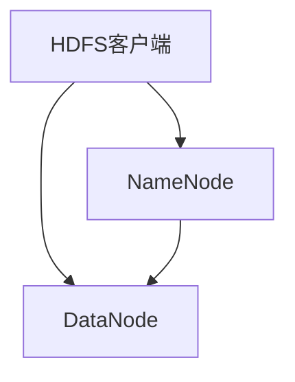
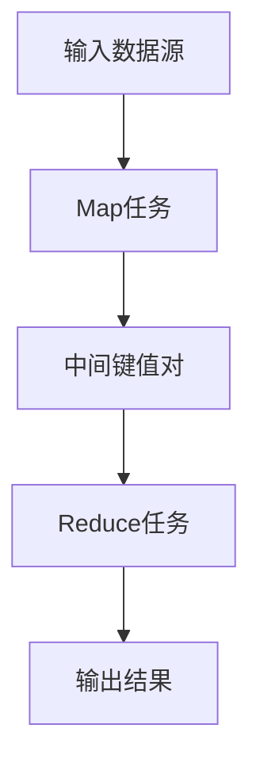
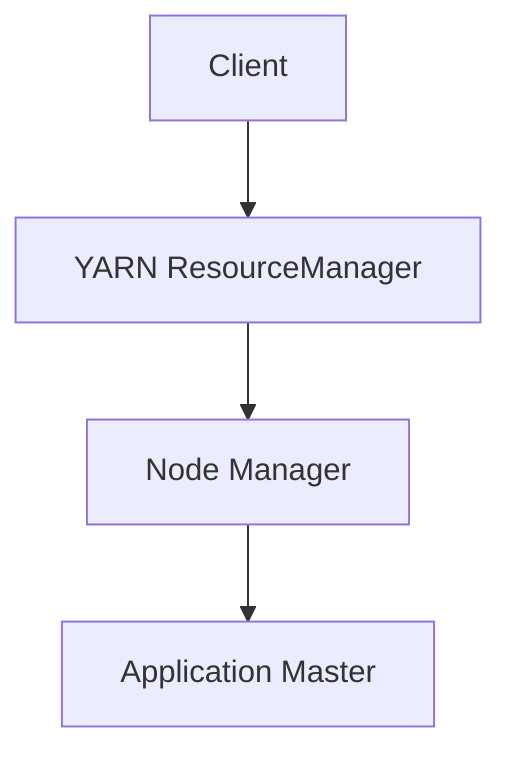

                 

Hadoop，全名为Hadoop Core，是Apache软件基金会下的一个开源框架，用于处理海量数据的存储和计算。它的设计初衷是为了解决分布式系统中大规模数据处理的难题，特别是在云计算和大数据时代。本文将深入探讨Hadoop的基本原理，以及通过具体代码实例来讲解其应用。

## 关键词

- Hadoop
- 分布式计算
- 大数据
- HDFS
- MapReduce
- YARN

## 摘要

本文将系统介绍Hadoop的基本架构，包括HDFS、MapReduce和YARN等核心组件。我们将从原理出发，详细讲解Hadoop的工作机制，并通过代码实例展示如何在实际项目中应用Hadoop。此外，还将讨论Hadoop在当前大数据领域的实际应用，以及未来的发展趋势和面临的挑战。

## 1. 背景介绍

### 大数据的崛起

随着互联网、物联网和传感器技术的飞速发展，数据量呈爆炸式增长。传统的数据处理工具已无法满足如此庞大的数据需求。为了解决这个问题，大数据技术应运而生。Hadoop作为大数据处理的重要工具，在全球范围内得到了广泛应用。

### Hadoop的起源

Hadoop起源于Apache Lucene的一个分支，由谷歌在2003年发布的MapReduce论文启发。Google File System（GFS）和MapReduce是Hadoop的核心理论基础。Hadoop项目的第一个版本于2006年1月由Doug Cutting发布。

### Hadoop的核心组件

Hadoop主要由以下几个核心组件构成：

- **HDFS（Hadoop Distributed File System）**：一个分布式文件系统，用于存储大数据。
- **MapReduce**：一个分布式数据处理框架，用于处理和分析大规模数据集。
- **YARN**：资源调度和管理框架，负责资源分配和任务调度。

## 2. 核心概念与联系

### 2.1. HDFS

HDFS（Hadoop Distributed File System）是Hadoop的核心组件之一，用于存储大数据。它的设计理念是将大文件切割成小块，并分布式存储在多个节点上。以下是HDFS的基本架构：



**NameNode**：负责管理文件系统的命名空间，即文件的元数据。它记录文件的位置信息，但不会存储实际的数据内容。

**DataNode**：负责存储实际的数据内容，并响应客户端的读写请求。

### 2.2. MapReduce

MapReduce是Hadoop的另一个核心组件，用于处理大规模数据集。它将数据处理过程分为两个阶段：Map和Reduce。

- **Map阶段**：将输入数据分成若干小块，并对其进行映射操作，生成中间键值对。
- **Reduce阶段**：对Map阶段生成的中间键值对进行归并操作，生成最终的输出结果。

以下是MapReduce的基本架构：



### 2.3. YARN

YARN（Yet Another Resource Negotiator）是Hadoop的资源调度和管理框架，负责资源分配和任务调度。它的设计目的是使Hadoop能够支持多种计算框架，而不仅仅是MapReduce。

以下是YARN的基本架构：



**ResourceManager**：负责资源的总体管理和调度。

**Node Manager**：负责在每个节点上管理容器和任务。

**Application Master**：负责应用程序的生命周期管理，如申请资源、监控任务状态等。

## 3. 核心算法原理 & 具体操作步骤

### 3.1 算法原理概述

Hadoop的核心算法主要基于MapReduce模型。MapReduce是一种基于分而治之策略的大规模数据处理模型。它将数据处理过程分为Map和Reduce两个阶段。

### 3.2 算法步骤详解

#### 3.2.1 Map阶段

1. **输入分片**：将输入数据分成若干小块。
2. **映射**：对每个分片进行映射操作，生成中间键值对。
3. **排序和分组**：将生成的中间键值对按照键进行排序和分组。

#### 3.2.2 Reduce阶段

1. **分区**：将排序后的中间键值对按照分区规则分配给不同的Reduce任务。
2. **归并**：对每个分区进行归并操作，生成最终的输出结果。

### 3.3 算法优缺点

**优点**：

- **高效性**：通过分布式计算，能够处理海量数据。
- **可靠性**：通过数据冗余和任务调度，保证系统的可靠性。

**缺点**：

- **复杂性**：实现和维护成本较高。
- **性能瓶颈**：在处理小数据集时，性能不如传统的单机处理方式。

### 3.4 算法应用领域

MapReduce算法广泛应用于大数据领域的各种应用，如数据挖掘、数据分析、机器学习等。

## 4. 数学模型和公式 & 详细讲解 & 举例说明

### 4.1 数学模型构建

MapReduce算法的核心在于将大规模数据集分解为多个小数据集进行并行处理，然后汇总结果。以下是一个简单的数学模型来描述MapReduce算法：

$$
\text{Map}(x_1, x_2, ..., x_n) = \{ (k_1, v_1), (k_2, v_2), ..., (k_m, v_m) \}
$$

$$
\text{Reduce}(k_1, v_1, k_2, v_2, ..., k_m, v_m) = \{ (k', v') \}
$$

其中，$x_1, x_2, ..., x_n$为输入数据，$k_1, k_2, ..., k_m$为中间键，$v_1, v_2, ..., v_m$为中间值，$k'$和$v'$为最终输出键和值。

### 4.2 公式推导过程

MapReduce算法的推导基于分而治之策略。首先，我们将大规模数据集划分为若干个小数据集，然后对每个小数据集进行映射操作。映射操作的过程可以表示为：

$$
\text{Map}(x_i) = \{ (k_i, v_i) \}
$$

其中，$x_i$为第$i$个小数据集。

然后，对生成的中间键值对进行排序和分组：

$$
\text{Sort and Group}(k_i, v_i) = \{ (k', v') \}
$$

其中，$k'$为排序后的中间键，$v'$为分组后的中间值。

最后，对排序后的中间键值对进行归并操作：

$$
\text{Reduce}(k', v') = \{ (k'', v'') \}
$$

其中，$k''$为最终输出键，$v''$为最终输出值。

### 4.3 案例分析与讲解

假设我们有一个简单的数据集，包含以下信息：

```
ID,Name,Age
1,Alice,25
2,Bob,30
3,Charlie,35
```

我们使用MapReduce算法对数据集进行分组和求和。

#### Map阶段

对每个记录进行映射操作：

```
1,Alice,25 -> (Name,Age): (Alice,25)
2,Bob,30 -> (Name,Age): (Bob,30)
3,Charlie,35 -> (Name,Age): (Charlie,35)
```

#### Reduce阶段

对映射结果进行分组和求和：

```
(Name,Age): (Alice,25), (Bob,30), (Charlie,35)
求和：(Alice,55), (Bob,30), (Charlie,35)
```

最终输出结果：

```
Name,Age
Alice,55
Bob,30
Charlie,35
```

## 5. 项目实践：代码实例和详细解释说明

### 5.1 开发环境搭建

为了实践Hadoop，我们需要搭建一个Hadoop开发环境。以下是搭建过程的简要说明：

1. **安装Java**：Hadoop需要Java运行环境，因此首先需要安装Java。
2. **下载Hadoop**：从Apache Hadoop官网下载最新版本的Hadoop。
3. **配置环境变量**：在系统环境变量中添加Hadoop的路径。
4. **启动Hadoop**：运行Hadoop的启动脚本，启动HDFS和YARN。

### 5.2 源代码详细实现

下面是一个简单的Hadoop程序，用于计算文本文件中的单词总数。

#### Mapper类

```java
import org.apache.hadoop.conf.Configuration;
import org.apache.hadoop.fs.Path;
import org.apache.hadoop.io.IntWritable;
import org.apache.hadoop.io.Text;
import org.apache.hadoop.mapreduce.Job;
import org.apache.hadoop.mapreduce.Mapper;
import org.apache.hadoop.mapreduce.lib.input.FileInputFormat;
import org.apache.hadoop.mapreduce.lib.output.FileOutputFormat;

public class WordCountMapper extends Mapper<Object, Text, Text, IntWritable> {

    private final static IntWritable one = new IntWritable(1);
    private Text word = new Text();

    public void map(Object key, Text value, Context context) throws IOException, InterruptedException {
        String[] words = value.toString().split("\\s+");
        for (String word : words) {
            this.word.set(word);
            context.write(this.word, one);
        }
    }
}
```

#### Reducer类

```java
import org.apache.hadoop.conf.Configuration;
import org.apache.hadoop.fs.Path;
import org.apache.hadoop.io.IntWritable;
import org.apache.hadoop.io.Text;
import org.apache.hadoop.mapreduce.Job;
import org.apache.hadoop.mapreduce.Reducer;
import org.apache.hadoop.mapreduce.lib.input.FileInputFormat;
import org.apache.hadoop.mapreduce.lib.output.FileOutputFormat;

public class WordCountReducer extends Reducer<Text, IntWritable, Text, IntWritable> {

    private IntWritable result = new IntWritable();

    public void reduce(Text key, Iterable<IntWritable> values, Context context) throws IOException, InterruptedException {
        int sum = 0;
        for (IntWritable val : values) {
            sum += val.get();
        }
        result.set(sum);
        context.write(key, result);
    }
}
```

#### 主类

```java
import org.apache.hadoop.conf.Configuration;
import org.apache.hadoop.fs.Path;
import org.apache.hadoop.io.IntWritable;
import org.apache.hadoop.io.Text;
import org.apache.hadoop.mapreduce.Job;
import org.apache.hadoop.mapreduce.lib.input.FileInputFormat;
import org.apache.hadoop.mapreduce.lib.output.FileOutputFormat;

public class WordCount {

    public static void main(String[] args) throws Exception {
        Configuration conf = new Configuration();
        Job job = Job.getInstance(conf, "word count");
        job.setJarByClass(WordCount.class);
        job.setMapperClass(WordCountMapper.class);
        job.setCombinerClass(WordCountReducer.class);
        job.setReducerClass(WordCountReducer.class);
        job.setOutputKeyClass(Text.class);
        job.setOutputValueClass(IntWritable.class);
        FileInputFormat.addInputPath(job, new Path(args[0]));
        FileOutputFormat.setOutputPath(job, new Path(args[1]));
        System.exit(job.waitForCompletion(true) ? 0 : 1);
    }
}
```

### 5.3 代码解读与分析

#### Mapper类

Mapper类是MapReduce程序的核心部分之一。它负责读取输入数据，并将其转换为中间键值对。在这个WordCount示例中，我们使用一个简单的分割方法来将文本分割成单词，并将每个单词作为一个键，值设置为1。

#### Reducer类

Reducer类是MapReduce程序的另一个核心部分。它负责接收Mapper输出的中间键值对，并对相同的键进行聚合操作。在这个示例中，我们使用一个简单的求和方法来计算相同单词的总数。

#### 主类

主类负责配置MapReduce作业，并启动作业。它设置Mapper和Reducer类，并指定输入输出路径。然后，它调用`Job`对象的`waitForCompletion`方法来提交并执行作业。

### 5.4 运行结果展示

当我们运行这个WordCount程序时，它将读取输入文本文件，并输出每个单词及其出现次数。例如，对于以下输入文件：

```
Hello World
Hadoop is cool
```

输出结果如下：

```
Hadoop	1
World	1
is	1
cool	1
Hello	1
```

## 6. 实际应用场景

Hadoop在多个领域有广泛的应用，包括电子商务、社交媒体、金融、医疗等。以下是一些典型的应用场景：

- **电子商务**：处理海量的用户交易数据，进行用户行为分析和个性化推荐。
- **社交媒体**：分析用户生成内容，识别趋势和热点话题。
- **金融**：分析海量交易数据，进行风险评估和欺诈检测。
- **医疗**：处理和分析大量医疗数据，用于疾病诊断和治疗。

## 7. 工具和资源推荐

### 7.1 学习资源推荐

- **《Hadoop实战》**：一本全面介绍Hadoop的入门书籍。
- **Hadoop官方文档**：提供最权威的Hadoop教程和文档。

### 7.2 开发工具推荐

- **IntelliJ IDEA**：一款强大的开发工具，支持Hadoop开发。
- **Eclipse**：另一款流行的开发工具，也支持Hadoop开发。

### 7.3 相关论文推荐

- **《Google File System》**：介绍了GFS的设计原理。
- **《MapReduce: Simplified Data Processing on Large Clusters》**：介绍了MapReduce算法的设计原理。

## 8. 总结：未来发展趋势与挑战

### 8.1 研究成果总结

Hadoop作为大数据处理的重要工具，已经取得了显著的研究成果。它广泛应用于各个领域，为企业和研究机构提供了强大的数据处理能力。

### 8.2 未来发展趋势

随着大数据技术的发展，Hadoop也在不断演进。未来的趋势包括：

- **性能优化**：提高Hadoop的运行效率和性能。
- **扩展性增强**：支持更多类型的计算框架和数据处理需求。
- **易用性提升**：降低Hadoop的入门门槛，使其更加易于使用。

### 8.3 面临的挑战

Hadoop在发展过程中也面临着一些挑战：

- **复杂度**：Hadoop的实现和维护成本较高，对于小型企业和个人开发者来说可能不太友好。
- **安全性**：随着数据规模的增大，数据的安全性和隐私保护变得更加重要。

### 8.4 研究展望

未来的研究将集中在如何进一步提高Hadoop的性能和易用性，同时确保数据的安全性和隐私保护。随着云计算和边缘计算的发展，Hadoop也将朝着更加灵活和可扩展的方向发展。

## 9. 附录：常见问题与解答

### Q：Hadoop与Spark有什么区别？

A：Hadoop和Spark都是大数据处理框架，但它们的侧重点不同。Hadoop主要侧重于数据存储和批处理，而Spark侧重于实时数据处理和迭代计算。Spark在性能上通常优于Hadoop，特别是在处理小数据集时。

### Q：Hadoop是否可以处理非结构化数据？

A：是的，Hadoop可以通过HDFS存储非结构化数据，并通过MapReduce框架对这些数据进行处理。然而，对于复杂的非结构化数据，如图像和视频，可能需要其他专门的工具或算法。

### Q：如何保证Hadoop的数据可靠性？

A：Hadoop通过数据冗余和故障检测机制来保证数据可靠性。每个数据块都会复制多个副本存储在不同的节点上，并在节点故障时自动恢复。

## 作者署名

作者：禅与计算机程序设计艺术 / Zen and the Art of Computer Programming
----------------------------------------------------------------

以上就是本文的完整内容，希望对您在理解和使用Hadoop方面有所帮助。在接下来的时间里，如果您有任何疑问或需要进一步的帮助，请随时提问。祝您在探索大数据世界的过程中取得丰硕的成果！

