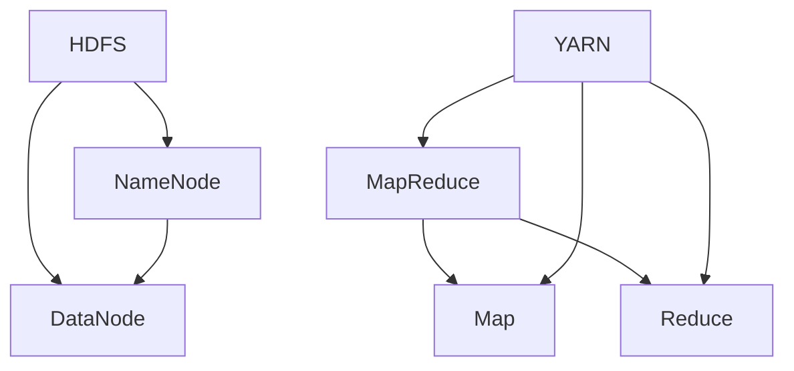

                 

 > **关键词**: Hadoop, 大数据, 分布式计算, MapReduce, HDFS, YARN, 代码实例

> **摘要**: 本文将深入讲解Hadoop的原理，包括其核心组件HDFS和MapReduce，以及YARN的资源管理框架。通过代码实例，我们将展示如何利用Hadoop进行实际的数据处理任务，并分析其优缺点和应用领域。

## 1. 背景介绍

大数据（Big Data）时代，数据量的爆炸式增长对数据处理提出了新的挑战。传统的集中式数据处理系统已难以应对如此庞大的数据规模和复杂的处理需求。为了解决这个问题，分布式计算技术应运而生。Hadoop正是分布式计算领域的一个代表性项目，由Apache Software Foundation维护。

Hadoop的设计目标是实现海量数据的存储和处理，其主要特点如下：

- **分布式存储**: 使用HDFS（Hadoop Distributed File System）来存储数据，确保数据的可靠性和高效访问。
- **分布式计算**: 基于MapReduce编程模型，实现数据的分布式计算，提高处理速度。
- **可扩展性**: 能够在廉价的硬件上横向扩展，支持大规模数据处理。
- **容错性**: 具有强大的容错机制，保证系统的高可用性。

## 2. 核心概念与联系

### 2.1 HDFS

HDFS（Hadoop Distributed File System）是Hadoop的核心组件之一，负责存储海量数据。其设计理念基于Google的GFS论文，主要特点包括：

- **数据分块**: 数据被分为固定大小的块（默认为128MB或256MB），分布在集群中的多个节点上。
- **副本机制**: 为了保证数据的高可用性，每个数据块会有多个副本，默认为3个。
- **主从架构**: 由一个NameNode和多个DataNode组成，NameNode负责维护元数据，而DataNode负责存储实际的数据块。

### 2.2 MapReduce

MapReduce是Hadoop的分布式计算模型，由两个阶段组成：Map阶段和Reduce阶段。MapReduce的特点如下：

- **并行处理**: 数据被划分为多个小块，并行处理，提高了处理速度。
- **容错机制**: Map和Reduce任务可以自动重启，确保处理过程不会因为节点故障而中断。
- **通用性**: 能够处理各种类型的数据处理任务，如过滤、排序、聚合等。

### 2.3 YARN

YARN（Yet Another Resource Negotiator）是Hadoop的资源管理框架，负责管理和分配集群资源。YARN的主要特点包括：

- **资源隔离**: 为每个应用程序提供独立的资源隔离，避免不同应用程序之间的资源冲突。
- **灵活性**: 支持多种计算模型，如MapReduce、Spark等，能够灵活地扩展和整合其他计算框架。

### 2.4 Mermaid流程图

以下是Hadoop核心组件的Mermaid流程图：



## 3. 核心算法原理 & 具体操作步骤

### 3.1 算法原理概述

Hadoop的MapReduce模型基于分而治之的策略，将大规模数据处理任务划分为多个小任务，并在分布式环境中并行执行。

- **Map阶段**: 将输入数据划分为关键数据块，对每个数据块进行映射操作，产生中间键值对。
- **Shuffle阶段**: 根据中间键值对的键进行排序和分组，将具有相同键的中间值发送到同一个Reduce任务。
- **Reduce阶段**: 对每个分组的数据进行聚合操作，产生最终结果。

### 3.2 算法步骤详解

1. **初始化**: 启动Hadoop集群，确保所有节点正常工作。
2. **输入数据**: 将待处理的数据上传到HDFS中，确保数据块分布合理。
3. **Map阶段**: 启动Map任务，读取HDFS中的数据块，对每个数据块进行映射操作，产生中间键值对。
4. **Shuffle阶段**: 根据中间键值对的键进行排序和分组，将具有相同键的中间值发送到同一个Reduce任务。
5. **Reduce阶段**: 启动Reduce任务，对每个分组的数据进行聚合操作，产生最终结果。
6. **输出数据**: 将最终结果存储回HDFS或其他存储系统。

### 3.3 算法优缺点

#### 优点

- **高效性**: 分布式计算模型能够充分利用集群资源，提高处理速度。
- **容错性**: 自动重启任务，确保处理过程不会因为节点故障而中断。
- **灵活性**: 支持多种数据处理任务，适用于各种场景。

#### 缺点

- **复杂性**: 集群的搭建、配置和管理较为复杂。
- **资源浪费**: 为了保证数据的高可用性，每个数据块都会存储多个副本，可能导致资源浪费。

### 3.4 算法应用领域

Hadoop的MapReduce模型适用于以下领域：

- **数据挖掘**: 如日志分析、社交网络分析等。
- **数据清洗**: 如数据去重、数据归一化等。
- **机器学习**: 如大规模线性回归、分类等。

## 4. 数学模型和公式 & 详细讲解 & 举例说明

### 4.1 数学模型构建

Hadoop的MapReduce模型可以抽象为一个数学模型：

- **Map阶段**: 映射操作，将输入数据映射为中间键值对。
- **Reduce阶段**: 聚合操作，将中间键值对映射为输出数据。

### 4.2 公式推导过程

假设输入数据为 \(A = \{a_1, a_2, ..., a_n\}\)，其中每个元素 \(a_i\) 都是一个多维数组。

- **Map阶段**: 对于每个输入元素 \(a_i\)，计算其映射函数 \(f(a_i)\)，得到中间键值对 \((k_i, v_i)\)。
- **Reduce阶段**: 对于每个中间键值对 \((k_i, v_i)\)，计算其聚合函数 \(g(k_i, v_i)\)，得到输出元素 \(b_i\)。

### 4.3 案例分析与讲解

假设我们有一个包含学生成绩的数据集，其中每个学生都有多个科目成绩。我们需要计算每个学生的平均成绩。

- **Map阶段**: 对于每个学生的成绩数据，将其映射为键值对 \((student\_id, score)\)。
- **Reduce阶段**: 对于每个学生ID，计算其平均成绩。

```latex
\text{平均成绩} = \frac{\sum_{i=1}^{n} \text{score}_i}{n}
```

## 5. 项目实践：代码实例和详细解释说明

### 5.1 开发环境搭建

在本节中，我们将搭建一个简单的Hadoop开发环境。您需要准备以下软件：

- Java开发工具包（JDK）
- Hadoop软件包
- Hadoop运行环境（如Docker）

### 5.2 源代码详细实现

以下是一个简单的Hadoop程序，用于计算文本文件的词频。

```java
import org.apache.hadoop.conf.Configuration;
import org.apache.hadoop.fs.Path;
import org.apache.hadoop.io.IntWritable;
import org.apache.hadoop.io.Text;
import org.apache.hadoop.mapreduce.Job;
import org.apache.hadoop.mapreduce.Mapper;
import org.apache.hadoop.mapreduce.Reducer;
import org.apache.hadoop.mapreduce.lib.input.FileInputFormat;
import org.apache.hadoop.mapreduce.lib.output.FileOutputFormat;

public class WordCount {

  public static class TokenizerMapper
       extends Mapper<Object, Text, Text, IntWritable>{

    private final static IntWritable one = new IntWritable(1);
    private Text word = new Text();

    public void map(Object key, Text value, Context context
                    ) throws IOException, InterruptedException {
      StringTokenizer itr = new StringTokenizer(value.toString());
      while (itr.hasMoreTokens()) {
        word.set(itr.nextToken());
        context.write(word, one);
      }
    }
  }

  public static class IntSumReducer
      extends Reducer<Text,IntWritable,Text,IntWritable> {
    private IntWritable result = new IntWritable();

    public void reduce(Text key, Iterable<IntWritable> values,
                       Context context
                       ) throws IOException, InterruptedException {
      int sum = 0;
      for (IntWritable val : values) {
        sum += val.get();
      }
      result.set(sum);
      context.write(key, result);
    }
  }

  public static void main(String[] args) throws Exception {
    Configuration conf = new Configuration();
    Job job = Job.getInstance(conf, "word count");
    job.setMapperClass(TokenizerMapper.class);
    job.setCombinerClass(IntSumReducer.class);
    job.setReducerClass(IntSumReducer.class);
    job.setOutputKeyClass(Text.class);
    job.setOutputValueClass(IntWritable.class);
    FileInputFormat.addInputPath(job, new Path(args[0]));
    FileOutputFormat.setOutputPath(job, new Path(args[1]));
    System.exit(job.waitForCompletion(true) ? 0 : 1);
  }
}
```

### 5.3 代码解读与分析

- **TokenizerMapper**: 负责将输入文本分割成词，并输出键值对。
- **IntSumReducer**: 负责将Map阶段输出的中间键值对进行聚合，计算词频。

### 5.4 运行结果展示

执行以下命令，运行WordCount程序：

```bash
hadoop jar wordcount.jar WordCount /input /output
```

程序将在输出目录中生成词频统计结果。

## 6. 实际应用场景

Hadoop广泛应用于大数据领域，以下是一些实际应用场景：

- **搜索引擎**: 如Google、Bing等搜索引擎，使用Hadoop进行网页爬取、索引构建和更新。
- **社交网络**: 如Facebook、Twitter等社交网络，使用Hadoop进行数据分析和用户行为预测。
- **金融领域**: 如股票交易、风险评估等，使用Hadoop进行海量数据处理和实时分析。
- **医疗领域**: 如基因测序、医疗数据分析等，使用Hadoop进行大规模数据处理和存储。

## 7. 工具和资源推荐

### 7.1 学习资源推荐

- **Hadoop官方文档**: https://hadoop.apache.org/docs/
- **《Hadoop实战》**: 作者：Alexey Zverev，详细介绍了Hadoop的安装、配置和使用。
- **《Hadoop应用与开发》**: 作者：张天翔，涵盖了Hadoop在各个领域的应用实例。

### 7.2 开发工具推荐

- **IntelliJ IDEA**: 一款功能强大的Java集成开发环境，支持Hadoop开发。
- **Eclipse**: 另一款流行的Java开发工具，也支持Hadoop开发。

### 7.3 相关论文推荐

- **《The Google File System》**: Google的GFS论文，介绍了分布式文件系统的设计原则。
- **《MapReduce: Simplified Data Processing on Large Clusters》**: Google的MapReduce论文，介绍了分布式计算模型。
- **《Yet Another Resource Negotiator》**: YARN的设计论文，介绍了Hadoop的资源管理框架。

## 8. 总结：未来发展趋势与挑战

### 8.1 研究成果总结

Hadoop在大数据领域取得了显著的成果，推动了分布式计算技术的发展。HDFS、MapReduce和YARN等核心组件在设计理念、性能优化和稳定性方面都有了显著的提升。

### 8.2 未来发展趋势

- **性能优化**: 随着硬件技术的发展，Hadoop的性能有望进一步提升。
- **生态系统扩展**: 继续整合和扩展其他计算框架，如Spark、Flink等。
- **安全性提升**: 加强数据安全和隐私保护，提高系统的可靠性。

### 8.3 面临的挑战

- **复杂性**: 集群的搭建、配置和管理依然复杂，需要进一步简化。
- **成本控制**: 随着数据量的持续增长，硬件成本和运维成本也在增加。

### 8.4 研究展望

Hadoop的未来发展将继续关注性能优化、生态系统扩展和安全性提升。同时，研究如何更好地应对大数据时代的挑战，为企业和个人提供更加高效、可靠的数据处理解决方案。

## 9. 附录：常见问题与解答

### 9.1 如何搭建Hadoop集群？

搭建Hadoop集群需要以下步骤：

1. 安装JDK和Hadoop。
2. 配置集群环境，包括主机名、IP地址等。
3. 配置HDFS，包括NameNode和DataNode的配置。
4. 配置YARN，包括 ResourceManager和NodeManager的配置。
5. 启动集群。

### 9.2 Hadoop如何保证数据一致性？

Hadoop通过副本机制保证数据一致性。每个数据块都会存储多个副本，默认为3个。当读取数据时，Hadoop会从所有副本中选择一个最近的副本进行读取，确保数据的可靠性。

### 9.3 Hadoop的MapReduce模型是否适用于所有数据处理任务？

Hadoop的MapReduce模型适用于大规模数据处理任务，如日志分析、数据清洗和机器学习等。但对于需要实时处理的小规模数据任务，MapReduce可能不是最佳选择，可以考虑使用其他实时计算框架，如Spark。

## 作者署名

作者：禅与计算机程序设计艺术 / Zen and the Art of Computer Programming

（完）

