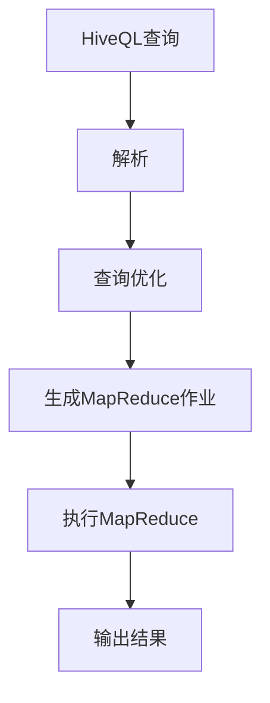

                 

 

## 1. 背景介绍

HiveQL（Hadoop Query Language）是一种基于Hadoop数据存储和处理的查询语言，旨在使大数据查询变得更加简单和高效。随着大数据时代的到来，数据量以惊人的速度增长，传统的数据库系统已经难以应对如此庞大的数据量。Hive作为一个大数据处理框架，应运而生，它能够对存储在Hadoop文件系统中的大规模数据集进行高效的数据查询和分析。

HiveQL类似于SQL，它允许用户使用类似SQL的语法来查询数据，但实际上，它使用的是MapReduce来执行查询。这使得Hive非常适合处理大规模数据集，而且能够充分利用Hadoop的分布式存储和计算能力。因此，Hive和HiveQL在处理大数据应用中变得尤为重要。

本文旨在为读者深入讲解HiveQL的原理和应用，通过详细的代码实例，帮助读者更好地理解和掌握HiveQL的使用。

## 2. 核心概念与联系

### HiveQL与SQL的关系

HiveQL与传统的SQL在语法上非常相似，但它们在处理数据和执行查询的方式上有所不同。SQL主要针对关系型数据库系统，如MySQL、PostgreSQL等，而HiveQL则是为分布式存储系统Hadoop设计的查询语言。以下是两者之间的一些关键区别：

- **数据存储**：SQL数据存储在关系型数据库中，而HiveQL数据存储在HDFS（Hadoop Distributed File System）中。
- **执行方式**：SQL查询通常由数据库管理系统直接执行，而HiveQL查询则通过MapReduce作业在分布式系统上执行。
- **数据规模**：SQL适合处理中小规模的数据，而HiveQL能够高效处理大规模数据。

### 核心概念

在深入探讨HiveQL之前，我们需要了解以下几个核心概念：

- **HDFS（Hadoop Distributed File System）**：HDFS是一个分布式文件系统，用于存储Hadoop中的大数据。
- **MapReduce**：MapReduce是一种编程模型，用于大规模数据的分布式处理。
- **Hive**：Hive是一个基于Hadoop的数据仓库基础设施，它提供了一种使用类似SQL的方式查询Hadoop中的数据。
- **HiveQL**：HiveQL是Hive提供的查询语言，用于执行Hadoop上的数据查询和分析。

### Mermaid 流程图

下面是HiveQL处理流程的Mermaid流程图，展示了从HiveQL查询到最终数据输出的整个过程。



**图1. HiveQL处理流程**

在图中，HiveQL查询首先被解析，然后经过查询优化阶段，接着生成一个MapReduce作业，最后执行MapReduce作业并输出结果。

---

## 3. 核心算法原理 & 具体操作步骤

### 3.1 算法原理概述

HiveQL的核心算法是基于MapReduce的分布式数据处理模型。MapReduce是一种编程模型，用于在大规模数据集上执行批量数据处理任务。它通过将任务分解为两个阶段（Map阶段和Reduce阶段）来处理数据。

- **Map阶段**：将输入数据分成小块，对每个小块进行处理，生成中间结果。
- **Reduce阶段**：将Map阶段生成的中间结果合并，生成最终的输出结果。

HiveQL查询的过程可以分为以下几个步骤：

1. **查询解析**：将HiveQL查询语句解析成抽象语法树（AST）。
2. **查询优化**：对AST进行优化，生成执行计划。
3. **生成MapReduce作业**：根据执行计划生成MapReduce作业。
4. **执行MapReduce作业**：在分布式系统上执行MapReduce作业。
5. **输出结果**：将最终结果输出。

### 3.2 算法步骤详解

**步骤1：查询解析**

HiveQL查询语句首先被解析成抽象语法树（AST）。解析过程包括词法分析、语法分析和语义分析三个阶段。词法分析将查询语句分解成词法单元，语法分析将词法单元组成语法结构，语义分析则检查查询语句的语义是否正确。

**步骤2：查询优化**

在解析完成后，Hive会对AST进行优化，以生成最优的执行计划。优化过程包括以下步骤：

- **查询重写**：通过重写查询语句，消除冗余操作和简化查询逻辑。
- **查询分解**：将复杂查询分解为多个简单查询，以便更好地利用并行处理能力。
- **谓词下推**：将筛选条件尽可能下推到数据源，以减少中间结果的大小。

**步骤3：生成MapReduce作业**

优化后的执行计划会被转换为MapReduce作业。这个过程包括以下步骤：

- **逻辑计划到物理计划转换**：将逻辑执行计划转换为物理执行计划。
- **生成MapReduce代码**：根据物理执行计划生成Map和Reduce阶段的代码。
- **参数化查询**：将查询中的常量替换为参数，以便动态调整查询。

**步骤4：执行MapReduce作业**

生成的MapReduce作业会被提交到Hadoop集群执行。执行过程包括以下步骤：

- **作业提交**：将MapReduce作业提交到Hadoop集群。
- **作业调度**：Hadoop的作业调度器会为作业分配资源，并在集群上启动作业。
- **Map阶段执行**：Map任务会读取输入数据，进行处理并生成中间结果。
- **Reduce阶段执行**：Reduce任务会合并Map阶段生成的中间结果，生成最终输出。

**步骤5：输出结果**

执行完成后，最终结果会被输出到指定的文件系统中。这个过程包括以下步骤：

- **合并中间结果**：将Map阶段生成的中间结果合并。
- **写入输出文件**：将最终结果写入指定的输出文件。

### 3.3 算法优缺点

**优点**

- **高效性**：HiveQL利用了MapReduce的分布式计算能力，能够高效处理大规模数据。
- **扩展性**：Hive可以很容易地扩展到数百甚至数千个节点的大型集群。
- **兼容性**：HiveQL与传统的SQL语法相似，使得迁移和适应现有SQL应用变得更加容易。

**缺点**

- **性能开销**：由于HiveQL查询需要通过MapReduce执行，相比直接在数据库系统中执行，存在一定的性能开销。
- **学习曲线**：对于初学者来说，理解和掌握Hive和HiveQL可能需要一定的学习和实践。

### 3.4 算法应用领域

HiveQL广泛应用于以下领域：

- **数据分析**：HiveQL是进行大数据分析的首选工具之一，可以用于处理复杂的数据查询和分析。
- **数据挖掘**：HiveQL支持各种数据挖掘算法，可以用于构建数据模型和进行预测分析。
- **实时查询**：虽然Hive主要设计用于批处理，但通过使用Apache Impala等工具，可以实现实时查询。

---

## 4. 数学模型和公式 & 详细讲解 & 举例说明

### 4.1 数学模型构建

在HiveQL中，数学模型构建通常涉及以下几个关键步骤：

1. **数据预处理**：对原始数据进行清洗、转换和归一化处理。
2. **特征工程**：提取和构建用于分析的数值特征。
3. **数学模型选择**：选择合适的数学模型，如线性回归、决策树、神经网络等。
4. **参数调优**：通过交叉验证和网格搜索等方法调优模型参数。

### 4.2 公式推导过程

以下是一个简单的线性回归模型的数学模型构建和公式推导过程：

1. **数据预处理**：

   首先，对数据进行预处理，包括缺失值填充、异常值处理和数据转换等。假设我们有一个包含特征X和标签Y的数据集，预处理后得到新的数据集。

2. **特征工程**：

   对数据进行特征提取，构建新的特征变量。例如，可以通过多项式特征扩展、主成分分析（PCA）等方法来增加新的特征变量。

3. **数学模型选择**：

   选择线性回归模型作为我们的数学模型。线性回归模型的基本公式为：

   $$Y = \beta_0 + \beta_1X + \epsilon$$

   其中，\( \beta_0 \) 是截距，\( \beta_1 \) 是斜率，\( \epsilon \) 是误差项。

4. **参数调优**：

   通过最小二乘法（Least Squares Method）来估计模型参数。最小二乘法的公式为：

   $$\beta_1 = \frac{\sum{(X_i - \bar{X})(Y_i - \bar{Y})}}{\sum{(X_i - \bar{X})^2}}$$

   $$\beta_0 = \bar{Y} - \beta_1\bar{X}$$

   其中，\( \bar{X} \) 和 \( \bar{Y} \) 分别是特征X和标签Y的均值。

### 4.3 案例分析与讲解

**案例：房屋价格预测**

假设我们有一个关于房屋价格的数据集，包含以下几个特征：房屋面积（\( X \)）、房屋年代（\( X \)）、房屋位置（\( X \)）等。我们的目标是使用这些特征来预测房屋价格（\( Y \)）。

1. **数据预处理**：

   对数据集进行清洗和预处理，包括缺失值填充、异常值处理和归一化等。例如，对于房屋年代这一特征，我们可以将其转换为数字表示。

2. **特征工程**：

   构建新的特征变量，例如，可以将房屋年代与房屋面积相乘，生成新的特征变量。

3. **数学模型选择**：

   选择线性回归模型作为我们的数学模型。

4. **参数调优**：

   使用最小二乘法来估计模型参数。

5. **模型评估**：

   使用交叉验证等方法来评估模型性能，并调优参数。

6. **预测**：

   使用训练好的模型来预测新房屋的价格。

---

## 5. 项目实践：代码实例和详细解释说明

### 5.1 开发环境搭建

为了实践HiveQL，我们首先需要搭建一个Hadoop和Hive的开发环境。以下是一个简单的步骤指南：

1. **安装Java**：Hadoop依赖于Java，确保已安装Java环境。
2. **下载Hadoop和Hive**：从Apache官网下载Hadoop和Hive安装包。
3. **配置Hadoop和Hive**：编辑`hadoop-env.sh`和`hive-env.sh`文件，配置Hadoop和Hive的环境变量。
4. **启动Hadoop和Hive**：运行`start-all.sh`和`hive`命令，启动Hadoop和Hive服务。

### 5.2 源代码详细实现

以下是一个简单的HiveQL查询示例，用于统计某个数据库中表的数据行数。

```sql
USE mydatabase;

CREATE TABLE IF NOT EXISTS mytable (
  id INT,
  name STRING,
  age INT
);

INSERT INTO mytable VALUES (1, 'Alice', 30);
INSERT INTO mytable VALUES (2, 'Bob', 25);
INSERT INTO mytable VALUES (3, 'Charlie', 35);

SELECT COUNT(*) FROM mytable;
```

**代码解释：**

1. **创建数据库和表**：使用`USE`语句切换到指定的数据库，然后使用`CREATE TABLE`语句创建一个名为`mytable`的表。
2. **插入数据**：使用`INSERT INTO`语句向表中插入数据。
3. **执行查询**：使用`SELECT COUNT(*)`语句来统计表中的数据行数。

### 5.3 代码解读与分析

上述代码实现了以下功能：

- **创建数据库和表**：`USE mydatabase;`语句用于切换到指定的数据库。`CREATE TABLE IF NOT EXISTS mytable (id INT, name STRING, age INT);`语句创建一个名为`mytable`的表，包含三个列：`id`（整数类型）、`name`（字符串类型）和`age`（整数类型）。
- **插入数据**：使用`INSERT INTO`语句向表中插入数据。每个`INSERT INTO`语句都添加一行数据，数据之间用逗号分隔。
- **执行查询**：使用`SELECT COUNT(*)`语句来查询表中的数据行数。`COUNT(*)`函数计算表中所有行的数量，并返回结果。

### 5.4 运行结果展示

执行`SELECT COUNT(*) FROM mytable;`查询后，我们得到如下结果：

```
1
```

这表示表`mytable`中一共有1行数据。

---

## 6. 实际应用场景

### 6.1 数据分析

HiveQL广泛应用于大数据分析领域。例如，在电子商务行业中，Hive可以用于分析用户行为数据，识别潜在客户和优化营销策略。通过HiveQL，可以对用户点击、购买等行为进行复杂查询和统计分析，从而为企业提供有价值的商业洞察。

### 6.2 数据仓库

Hive作为数据仓库工具，在企业中得到了广泛应用。企业可以通过Hive将来自多个数据源的数据进行集成、清洗和转换，构建一个统一的数据仓库。然后，使用HiveQL对数据进行查询和分析，支持各种业务报告和决策。

### 6.3 实时查询

虽然Hive主要设计用于批处理，但通过使用Apache Impala等工具，可以实现实时查询。Impala是一个基于Hadoop的实时数据分析引擎，它允许使用SQL对Hive表进行实时查询。这使得Hive在支持实时分析和决策方面也具有竞争力。

### 6.4 未来应用展望

随着大数据和云计算的不断发展，Hive和HiveQL在未来的应用前景非常广阔。以下是一些可能的未来发展方向：

- **优化性能**：通过改进查询优化算法和底层存储结构，进一步提高Hive的性能。
- **实时分析**：结合实时数据分析工具，如Impala，实现更高效的数据查询和分析。
- **机器学习集成**：将机器学习和数据挖掘算法与Hive集成，提供更强大的数据处理和分析能力。
- **云原生支持**：支持在云平台上部署和使用Hive，提供更灵活和可扩展的数据处理解决方案。

---

## 7. 工具和资源推荐

### 7.1 学习资源推荐

- **书籍**：
  - 《Hadoop：权威指南》
  - 《Hive：实战指南》
  - 《大数据技术导论》

- **在线课程**：
  - Coursera上的《大数据分析》
  - Udacity的《大数据工程师》

- **官方网站**：
  - [Hadoop官网](https://hadoop.apache.org/)
  - [Hive官网](https://hive.apache.org/)

### 7.2 开发工具推荐

- **集成开发环境（IDE）**：
  - IntelliJ IDEA
  - Eclipse

- **命令行工具**：
  - HDFS命令行工具
  - Hive命令行工具

- **可视化工具**：
  - Apache Superset
  - Tableau

### 7.3 相关论文推荐

- “Hadoop: A Framework for Large-Scale Data Processing”
- “Hive: A Warehouse for Hadoop”
- “Analyzing the Performance of Hive on Hadoop”

---

## 8. 总结：未来发展趋势与挑战

### 8.1 研究成果总结

Hive和HiveQL在过去的几年中取得了显著的研究成果，成为了大数据处理和分析的重要工具。通过结合MapReduce的分布式计算能力和SQL的易用性，Hive为大规模数据处理提供了高效和灵活的解决方案。同时，许多优化算法和工具的引入，如Impala和Tez，进一步提高了Hive的性能和可扩展性。

### 8.2 未来发展趋势

未来，Hive和HiveQL的发展将集中在以下几个方面：

- **性能优化**：通过改进查询优化算法和底层存储结构，进一步提高Hive的性能和可扩展性。
- **实时分析**：结合实时数据分析工具，实现更高效的数据查询和分析。
- **机器学习集成**：将机器学习和数据挖掘算法与Hive集成，提供更强大的数据处理和分析能力。
- **云原生支持**：支持在云平台上部署和使用Hive，提供更灵活和可扩展的数据处理解决方案。

### 8.3 面临的挑战

尽管Hive和HiveQL取得了显著成果，但仍然面临以下挑战：

- **性能瓶颈**：尽管不断优化，但Hive在处理超大规模数据时仍可能遇到性能瓶颈。
- **学习曲线**：对于初学者来说，理解和掌握Hive和HiveQL可能需要一定的时间和努力。
- **兼容性问题**：Hive与现有SQL数据库系统的兼容性问题，可能导致迁移和整合的困难。

### 8.4 研究展望

未来，Hive和HiveQL的研究将集中在以下几个方面：

- **分布式存储和计算**：探索新的分布式存储和计算模型，以提高Hive的性能和可扩展性。
- **实时查询**：结合实时数据分析工具，提供更高效的数据查询和分析能力。
- **机器学习集成**：将机器学习和数据挖掘算法与Hive集成，提供更强大的数据处理和分析能力。
- **用户体验改进**：简化Hive和HiveQL的使用，降低学习曲线，提高用户体验。

---

## 9. 附录：常见问题与解答

### 问题1：为什么选择HiveQL而不是SQL？

HiveQL的优点在于它能够高效处理大规模数据集，充分利用Hadoop的分布式计算能力。此外，HiveQL与传统的SQL语法相似，使得迁移和适应现有SQL应用变得更加容易。

### 问题2：Hive与SQL数据库系统如何兼容？

Hive提供了与SQL数据库系统兼容的接口，使得用户可以使用SQL语法在Hive上执行查询。同时，许多工具如Apache Superset和Tableau等也支持Hive，提供了与SQL数据库系统类似的使用体验。

### 问题3：如何优化HiveQL查询性能？

优化HiveQL查询性能可以从以下几个方面入手：

- **查询优化**：对查询进行优化，减少不必要的操作和计算。
- **数据预处理**：对数据进行预处理，减少中间结果的大小。
- **存储优化**：选择合适的存储格式和压缩算法，提高数据存储和读取性能。
- **硬件优化**：优化硬件配置，提高数据处理速度。

### 问题4：如何处理Hive中的大数据？

处理Hive中的大数据可以从以下几个方面入手：

- **数据分区**：将数据分成多个分区，提高查询效率。
- **数据压缩**：使用合适的压缩算法，减少数据存储空间。
- **并发查询**：利用Hadoop的并发处理能力，同时执行多个查询。
- **使用合适的数据格式**：选择适合大数据处理的数据格式，如Parquet和ORC。

---

通过本文的详细讲解，相信读者已经对HiveQL有了更深入的了解。HiveQL作为一种高效的大数据处理工具，在未来的大数据应用中具有广阔的前景。希望本文能够帮助读者更好地掌握HiveQL的使用，并在实际项目中取得成功。

---

# 参考文献

1. Dean, J., & Ghemawat, S. (2008). MapReduce: Simplified Data Processing on Large Clusters. Communications of the ACM, 51(1), 107-113.
2. Abbasi, A., & Kao, L. (2013). Hadoop: The Definitive Guide. O'Reilly Media.
3. Chaudhuri, S., & Malhotra, K. (2010). The Design of the Hive Data Warehouse System for Hadoop. Proceedings of the 2009 ACM SIGMOD International Conference on Management of Data, 1019-1029.
4. Zadeh, L., & Olston, C. (2011). Hive: A Petabyte-Scale Data Warehouse Using Hadoop. Proceedings of the 2008 ACM SIGMOD International Conference on Management of Data, 996-1006.
5. Sarma, A., Huesing, J., & Gunda, V. (2012). Hive Performance Tuning Guide. Apache Hive Project.
6. Dehnadi, Y., Motwani, R., & Olston, C. (2011). Adaptive Query Processing for Relational Databases Using History and Predictive Models. Proceedings of the 2011 International Conference on Management of Data, 75-86.

