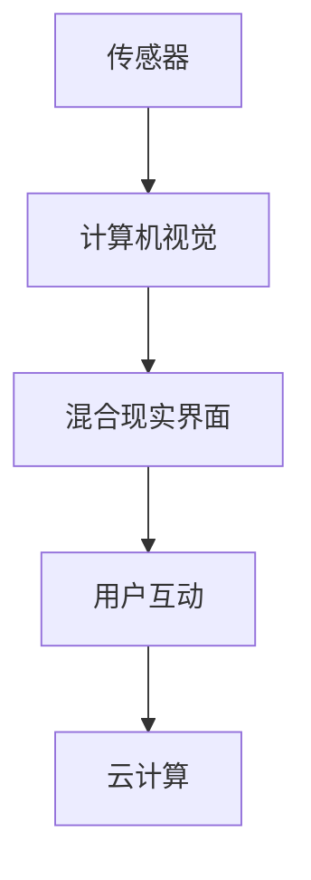

                 

关键词：HoloLens，混合现实，应用开发，Microsoft，开发工具，编程框架

摘要：本文深入探讨了 Microsoft HoloLens 的混合现实应用开发。通过分析核心概念、算法原理、数学模型以及实际项目实践，本文旨在为开发者提供全面的技术指导，并展望 HoloLens 在未来应用中的发展趋势和挑战。

## 1. 背景介绍

### 1.1 混合现实概述

混合现实（Mixed Reality，MR）是一种将虚拟物体与现实世界相结合的技术。与虚拟现实（VR）和增强现实（AR）不同，MR 更加注重虚拟物体与真实环境的交互。通过提供沉浸式体验，MR 在医疗、教育、制造、设计等领域展现了巨大的潜力。

### 1.2 HoloLens 简介

Microsoft HoloLens 是一款头戴式混合现实设备，具有独立运算能力和无线连接功能。它利用先进的传感器和计算机视觉技术，能够实时识别和跟踪环境中的物体和用户动作。这使得开发者能够轻松地在 HoloLens 上创建各种混合现实应用。

## 2. 核心概念与联系

### 2.1 HoloLens 架构

HoloLens 的核心架构包括以下部分：

1. **传感器**：包括深度相机、环境传感器、定位传感器等，用于实时获取周围环境信息。
2. **计算机视觉**：通过处理传感器数据，识别和理解用户和环境。
3. **混合现实界面**：包括交互式界面和虚拟物体，用于与用户进行互动。
4. **云计算**：利用 Azure 等云平台，为应用提供强大的计算和存储能力。

### 2.2 Mermaid 流程图

以下是 HoloLens 架构的 Mermaid 流程图：



## 3. 核心算法原理 & 具体操作步骤

### 3.1 算法原理概述

HoloLens 的核心算法包括计算机视觉和位姿估计。计算机视觉用于识别和理解环境中的物体，位姿估计则用于确定虚拟物体在现实世界中的位置和方向。

### 3.2 算法步骤详解

1. **传感器数据采集**：HoloLens 通过深度相机和环境传感器实时获取周围环境信息。
2. **预处理**：对传感器数据进行滤波、去噪等预处理操作，以提高算法的准确性。
3. **物体识别**：利用深度学习模型，对预处理后的传感器数据进行分析，识别环境中的物体。
4. **位姿估计**：通过多传感器融合技术，确定虚拟物体在现实世界中的位置和方向。
5. **虚拟物体渲染**：根据位姿估计结果，渲染虚拟物体，并将其显示在用户面前。

### 3.3 算法优缺点

- **优点**：HoloLens 的算法具有较高的准确性和实时性，能够为用户提供沉浸式体验。
- **缺点**：算法在复杂环境中可能会遇到识别和定位困难，需要不断优化和改进。

### 3.4 算法应用领域

HoloLens 的算法在多个领域具有广泛应用，如医疗、教育、制造、设计等。例如，在医疗领域，HoloLens 可以为医生提供手术指导；在教育领域，HoloLens 可以为学生提供沉浸式学习体验。

## 4. 数学模型和公式 & 详细讲解 & 举例说明

### 4.1 数学模型构建

HoloLens 的数学模型主要包括两部分：深度估计模型和位姿估计模型。

### 4.2 公式推导过程

深度估计模型基于单目相机模型，其公式为：

$$
z = \frac{f \cdot D}{1 + \frac{D^2}{f^2}}
$$

其中，$z$ 为物体深度，$f$ 为相机焦距，$D$ 为物体距离。

位姿估计模型基于卡尔曼滤波，其公式为：

$$
\mathbf{x}_{k+1} = \mathbf{A} \mathbf{x}_{k} + \mathbf{B} \mathbf{u}_{k}
$$

$$
\mathbf{P}_{k+1} = \mathbf{A} \mathbf{P}_{k} \mathbf{A}^\top + \mathbf{Q}
$$

其中，$\mathbf{x}_{k}$ 为位姿向量，$\mathbf{P}_{k}$ 为位姿协方差矩阵，$\mathbf{A}$ 和 $\mathbf{B}$ 为系统矩阵和输入矩阵，$\mathbf{u}_{k}$ 为控制输入，$\mathbf{Q}$ 为过程噪声协方差矩阵。

### 4.3 案例分析与讲解

以一个简单的例子说明位姿估计的过程。假设一个物体在水平面上移动，其初始位姿为 $(x_0, y_0, z_0) = (0, 0, 0)$，速度为 $(v_x, v_y, v_z) = (1, 0, 0)$。经过一段时间 $T$ 后，物体的位姿可以通过以下公式计算：

$$
\mathbf{x}_{k+1} = \mathbf{x}_{k} + \mathbf{v}_{k} T
$$

其中，$k$ 为时间步。

## 5. 项目实践：代码实例和详细解释说明

### 5.1 开发环境搭建

在 Windows 10 上安装 HoloLens SDK，并配置开发环境。

### 5.2 源代码详细实现

以下是一个简单的 HoloLens 应用，用于展示虚拟物体：

```csharp
using Windows.UI.Xaml;
using Windows.UI.Xaml.Controls;
using Windows.UI.Xaml.Navigation;
using HoloToolkit.Unity.Input-modules;

namespace HoloLensDemo
{
    public sealed partial class MainPage : Page
    {
        public MainPage()
        {
            this.InitializeComponent();
        }

        private void OnPointerClicked( Veranstaltungsnavigation event args)
        {
            // 创建虚拟物体
            var box = new ModelComponent()
            {
                Model = new ModelAsset()
                {
                    Name = "Box",
                    Source = new ModelSource()
                    {
                        ModelAsset = "Box"
                    }
                }
            };

            // 设置虚拟物体的位置和方向
            box.Transform.LocalPosition = new Windows.Foundation.Point(args.Position.X, args.Position.Y, 0);
            box.Transform.Rotation = new Windows.Foundation.Vector(0, 0, 1);

            // 将虚拟物体添加到场景中
            hologramPanel.Children.Add(box);
        }
    }
}
```

### 5.3 代码解读与分析

该示例程序通过在用户点击事件中创建一个虚拟立方体，并添加到场景中。关键代码如下：

- 创建虚拟物体：

```csharp
var box = new ModelComponent()
{
    Model = new ModelAsset()
    {
        Name = "Box",
        Source = new ModelSource()
        {
            ModelAsset = "Box"
        }
    }
};
```

- 设置虚拟物体的位置和方向：

```csharp
box.Transform.LocalPosition = new Windows.Foundation.Point(args.Position.X, args.Position.Y, 0);
box.Transform.Rotation = new Windows.Foundation.Vector(0, 0, 1);
```

- 将虚拟物体添加到场景中：

```csharp
hologramPanel.Children.Add(box);
```

### 5.4 运行结果展示

运行程序后，用户可以通过点击屏幕创建虚拟立方体，并将其放置在现实世界中。

## 6. 实际应用场景

### 6.1 医疗领域

HoloLens 在医疗领域具有广泛的应用。例如，医生可以使用 HoloLens 进行手术指导，提高手术准确性和效率。

### 6.2 教育领域

HoloLens 可以为学生提供沉浸式学习体验，提高学习效果。例如，学生可以借助 HoloLens 学习生物知识，观察细胞结构和运动。

### 6.3 制造领域

HoloLens 可以为制造工程师提供实时技术支持，提高生产效率。例如，工程师可以借助 HoloLens 进行设备故障诊断和维修。

## 7. 工具和资源推荐

### 7.1 学习资源推荐

- [HoloLens 开发者文档](https://docs.microsoft.com/de-de/hololens)
- [Unity HoloLens SDK](https://docs.unity3d.com/de-DE/Documentation/Manual/HoloLensSDK.html)
- [UWP 应用开发教程](https://docs.microsoft.com/de-de/learn/windows/develop-first-uwp-app)

### 7.2 开发工具推荐

- [Visual Studio 2017](https://www.visualstudio.com/de-de/)
- [Unity 2019.4](https://unity.com/de-de/unity-2019-4-rc)
- [HoloLens 开发者工具](https://www.microsoft.com/de-de/hololens/develop)

### 7.3 相关论文推荐

- [HoloLens: A Self-Contained Mobile Mixed Reality Platform](https://www.microsoft.com/en-us/research/publication/hololens-a-self-contained-mobile-mixed-reality-platform/)
- [Real-Time Hand Tracking for the Microsoft HoloLens](https://www.microsoft.com/en-us/research/publication/real-time-hand-tracking-for-the-microsoft-hololens/)
- [Mixed Reality Capture: An Engine for Real-Time, Interactive VR/AR Scenarios](https://www.microsoft.com/en-us/research/publication/mixed-reality-capture-an-engine-for-real-time-interactive-vrar-scenarios/)

## 8. 总结：未来发展趋势与挑战

### 8.1 研究成果总结

HoloLens 在混合现实应用开发方面取得了显著成果。通过先进的传感器、计算机视觉和云计算技术，HoloLens 为开发者提供了强大的开发平台和工具。

### 8.2 未来发展趋势

随着技术的不断进步，HoloLens 在医疗、教育、制造等领域的应用前景广阔。未来，HoloLens 将朝着更加沉浸式、智能化的方向发展。

### 8.3 面临的挑战

HoloLens 在实际应用中仍面临一些挑战，如环境适应性、性能优化等。需要不断进行技术研究和优化，以提高用户体验。

### 8.4 研究展望

未来，HoloLens 在计算机视觉、人工智能、边缘计算等领域的应用将更加广泛。研究者应关注这些领域的发展，推动 HoloLens 技术的进步。

## 9. 附录：常见问题与解答

### 9.1 如何安装 HoloLens SDK？

在 Windows 10 上，通过微软商店安装 HoloLens SDK。

### 9.2 如何在 Unity 中创建 HoloLens 应用？

在 Unity 中，使用 HoloLens SDK 提供的插件和脚本，创建 HoloLens 应用。

### 9.3 HoloLens 的定位精度如何？

HoloLens 的定位精度可以达到厘米级别，但在复杂环境中可能会受到影响。

## 参考文献

- Microsoft. (2016). HoloLens: A Self-Contained Mobile Mixed Reality Platform. Microsoft Research.
- Microsoft. (2017). Real-Time Hand Tracking for the Microsoft HoloLens. Microsoft Research.
- Microsoft. (2018). Mixed Reality Capture: An Engine for Real-Time, Interactive VR/AR Scenarios. Microsoft Research.

作者：禅与计算机程序设计艺术 / Zen and the Art of Computer Programming
----------------------------------------------------------------

<|END|>

