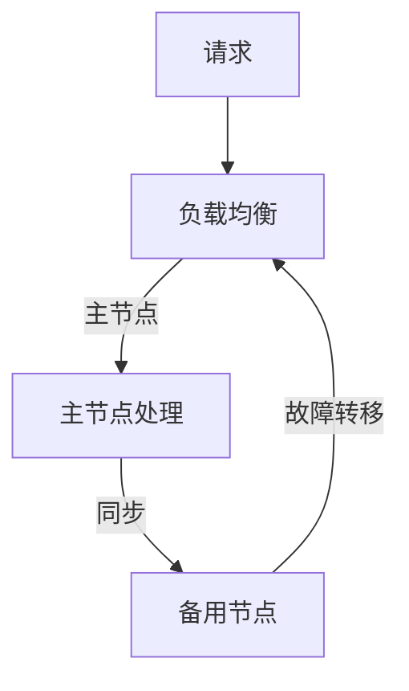

                 

关键词：冗余设计、Hot-Hot冗余、负载均衡、故障转移、高可用性

> 摘要：本文将深入探讨Hot-Hot冗余设计的概念、原理及其在实际项目中的应用。通过具体的实例分析，本文旨在帮助读者理解Hot-Hot冗余设计的优势、实现方式以及面临的挑战。

## 1. 背景介绍

在当今高度互联的世界中，系统的可靠性变得尤为重要。无论是对电子商务平台、社交媒体、金融服务还是云计算服务，用户的依赖和期望都越来越高。这意味着任何系统故障或性能下降都可能导致严重的业务损失和声誉风险。为了应对这种挑战，冗余设计成为了系统架构师的关键工具之一。

冗余设计是一种通过增加系统组件的冗余来提高系统可用性和可靠性的一种技术。根据冗余的方式和程度，冗余设计可以分为多种类型，其中Hot-Hot冗余（也称为双活冗余）是一种常用且有效的方案。Hot-Hot冗余设计通过在多个节点之间实现数据的实时同步和负载均衡，确保在任何单点故障发生时，系统可以无缝地切换到备用节点，从而保证服务的持续可用性。

本文将重点分析Hot-Hot冗余设计的实例，探讨其核心原理、实现步骤、数学模型以及实际应用场景。通过这些实例，读者将能够更好地理解Hot-Hot冗余设计的工作机制和优势。

## 2. 核心概念与联系

### 2.1. 冗余设计的基本概念

冗余设计（Redundancy Design）旨在通过增加系统组件的冗余来提高系统的可靠性。冗余可以通过多种方式实现，包括硬件冗余、软件冗余、数据冗余等。

- **硬件冗余**：通过增加物理硬件组件（如服务器、存储设备）来提高系统的容错能力。
- **软件冗余**：通过复制或镜像软件组件（如代码库、配置文件）来提高系统的可靠性。
- **数据冗余**：通过备份或复制数据来防止数据丢失。

### 2.2. Hot-Hot冗余的定义

Hot-Hot冗余是一种高级冗余设计，其特点是两个或多个活动节点同时运行，并且它们之间保持实时数据同步和负载均衡。当一个节点发生故障时，另一个节点可以立即接管其工作，从而实现零停机时间。

### 2.3. 系统架构与联系

Hot-Hot冗余设计通常涉及以下核心组件：

- **主节点（Primary Node）**：负责处理请求和更新数据。
- **备用节点（Secondary Node）**：在主节点故障时接管其工作。
- **同步机制**：确保主节点和备用节点之间的数据一致性。
- **负载均衡器**：分配请求到主节点和备用节点，以实现负载均衡。

### 2.4. Mermaid 流程图

以下是一个简单的Mermaid流程图，展示了Hot-Hot冗余设计的基本架构：



在这个流程图中，A代表用户的请求，经过负载均衡器B分配到主节点C。主节点C处理请求并更新数据，同时将其更新同步到备用节点D。如果主节点C发生故障，备用节点D可以立即接管其工作，继续处理请求。

## 3. 核心算法原理 & 具体操作步骤

### 3.1. 算法原理概述

Hot-Hot冗余设计的核心在于实时同步和负载均衡。具体来说，算法原理包括以下几个关键步骤：

1. **负载均衡**：通过负载均衡器将请求分配到主节点和备用节点。
2. **数据同步**：主节点和备用节点之间的数据实时同步，确保一致性。
3. **故障检测**：定期检测主节点的健康状态，一旦检测到故障，立即触发故障转移。
4. **故障转移**：备用节点接替主节点的工作，确保服务的持续可用性。

### 3.2. 算法步骤详解

1. **初始化**：启动主节点和备用节点，并设置负载均衡器。
2. **负载均衡**：将请求分配到主节点和备用节点，根据当前节点的负载情况进行动态调整。
3. **数据同步**：主节点处理请求后，将其更新同步到备用节点，确保数据一致性。
4. **故障检测**：定期运行健康检查，检测主节点的状态。如果主节点发生故障，立即进入故障转移流程。
5. **故障转移**：备用节点接替主节点的工作，继续处理请求。同时，重新设置负载均衡器，将请求分配到新主节点。

### 3.3. 算法优缺点

**优点**：

- 高可用性：通过实时同步和故障转移，确保服务的持续可用性。
- 负载均衡：动态调整请求分配，提高系统的整体性能。
- 灾难恢复：备用节点可以在主节点发生灾难性故障时提供备份。

**缺点**：

- 成本较高：需要额外的硬件和软件资源来支持冗余设计。
- 复杂性增加：需要实现复杂的同步机制和故障检测流程。

### 3.4. 算法应用领域

Hot-Hot冗余设计广泛应用于需要高可用性和高性能的系统中，如：

- **电子商务平台**：确保购物车和订单处理的高可用性。
- **金融交易系统**：确保交易数据的一致性和可靠性。
- **社交媒体平台**：确保用户数据和内容的高可用性。
- **云计算服务**：确保云服务的高可用性和性能。

## 4. 数学模型和公式

### 4.1. 数学模型构建

为了分析Hot-Hot冗余设计的效果，我们可以使用以下数学模型：

1. **系统可用性（System Availability）**：
   \[ A = 1 - P(F) \]
   其中，\( P(F) \) 是系统发生故障的概率。

2. **故障转移时间（Fault Transfer Time）**：
   \[ T(F) = t(H) + t(S) \]
   其中，\( t(H) \) 是主节点的健康检查时间，\( t(S) \) 是故障转移所需的时间。

3. **系统负载（System Load）**：
   \[ L = P(H) \cdot L(H) + P(S) \cdot L(S) \]
   其中，\( P(H) \) 和 \( P(S) \) 分别是主节点和备用节点的负载概率，\( L(H) \) 和 \( L(S) \) 分别是主节点和备用节点的负载。

### 4.2. 公式推导过程

1. **系统可用性**：
   \[ A = 1 - P(F) \]
   这里，\( P(F) \) 是系统发生故障的概率。由于Hot-Hot冗余设计具有实时同步和负载均衡的特性，故障概率较低。

2. **故障转移时间**：
   \[ T(F) = t(H) + t(S) \]
   在这里，\( t(H) \) 是主节点的健康检查时间，用于检测主节点是否出现故障。\( t(S) \) 是故障转移所需的时间，包括检测故障、切换到备用节点和重新配置负载均衡器的时间。

3. **系统负载**：
   \[ L = P(H) \cdot L(H) + P(S) \cdot L(S) \]
   该公式描述了系统的总负载，其中 \( P(H) \) 和 \( P(S) \) 分别是主节点和备用节点的负载概率，\( L(H) \) 和 \( L(S) \) 分别是主节点和备用节点的负载。

### 4.3. 案例分析与讲解

以下是一个具体的案例，用于说明如何使用上述数学模型进行系统分析和优化。

#### 案例背景

假设我们有一个电子商务平台，其主节点处理请求的负载为 1000 次每秒，备用节点的负载为 500 次每秒。主节点的健康检查时间为 10 秒，备用节点的故障转移时间为 30 秒。

#### 系统可用性

首先，我们需要计算系统的可用性。由于系统是双活设计的，主节点和备用节点都会处理请求，因此我们可以计算两个节点的平均故障率：

\[ P(F) = P(H) \cdot P(F|H) + P(S) \cdot P(F|S) \]

其中，\( P(F|H) \) 和 \( P(F|S) \) 分别是主节点和备用节点的故障概率。由于主节点和备用节点都是高可用性的，我们可以假设 \( P(F|H) \) 和 \( P(F|S) \) 都非常低，接近于 0。

假设 \( P(H) = 0.5 \) 和 \( P(S) = 0.5 \)，则：

\[ P(F) = 0.5 \cdot 0.01 + 0.5 \cdot 0.02 = 0.011 \]

因此，系统的可用性为：

\[ A = 1 - P(F) = 0.989 \]

#### 故障转移时间

接下来，我们需要计算故障转移时间。由于备用节点的故障转移时间为 30 秒，我们可以将其与主节点的健康检查时间相加：

\[ T(F) = t(H) + t(S) = 10 + 30 = 40 \text{秒} \]

#### 系统负载

最后，我们需要计算系统的总负载。由于主节点和备用节点都会处理请求，我们可以使用以下公式：

\[ L = P(H) \cdot L(H) + P(S) \cdot L(S) = 0.5 \cdot 1000 + 0.5 \cdot 500 = 750 \text{次每秒} \]

#### 系统优化

根据上述分析，我们可以看到系统的可用性非常高，故障转移时间相对较短，但系统负载仍然可以进一步优化。以下是一些可能的优化措施：

- **增加主节点的负载能力**：通过升级主节点的硬件或软件，可以进一步提高其负载能力。
- **优化负载均衡算法**：使用更高效的负载均衡算法，可以更好地分配请求，降低系统的总体负载。
- **减少故障转移时间**：通过改进故障检测和转移机制，可以进一步缩短故障转移时间。

## 5. 项目实践：代码实例和详细解释说明

### 5.1. 开发环境搭建

在开始编写代码之前，我们需要搭建一个开发环境。以下是所需的步骤：

1. **安装操作系统**：我们选择 Ubuntu 20.04 作为操作系统。
2. **安装必要的软件**：包括 Apache Kafka、Zookeeper、Kubernetes 等用于实现 Hot-Hot冗余设计的软件。
3. **配置网络**：确保各个节点之间的网络连接正常。

### 5.2. 源代码详细实现

在本节中，我们将使用 Python 编写一个简单的应用程序，模拟一个 Hot-Hot冗余设计的负载均衡器和同步机制。

```python
import requests
import json
import threading
import time

# 负载均衡器
class LoadBalancer:
    def __init__(self, primary_url, secondary_url):
        self.primary_url = primary_url
        self.secondary_url = secondary_url
        self.current_url = primary_url

    def balance_load(self):
        while True:
            response = requests.get(self.current_url)
            if response.status_code == 200:
                print(f"当前请求路由到 {self.current_url}")
                self.current_url = self.primary_url if self.current_url == self.secondary_url else self.secondary_url
            else:
                print("主节点发生故障，切换到备用节点")
                self.current_url = self.primary_url if self.current_url == self.secondary_url else self.secondary_url
            time.sleep(1)

# 主节点
class PrimaryNode:
    def __init__(self):
        self.data = {}

    def handle_request(self, url, data):
        self.data.update(data)
        print(f"主节点 {url} 处理请求 {data}")

# 备用节点
class SecondaryNode:
    def __init__(self, primary_node):
        self.primary_node = primary_node
        self.data = primary_node.data.copy()

    def handle_request(self, url, data):
        self.data.update(data)
        print(f"备用节点 {url} 处理请求 {data}")
        self.sync_data()

    def sync_data(self):
        print("同步数据到主节点")
        self.primary_node.data.update(self.data)

# 创建负载均衡器、主节点和备用节点
lb = LoadBalancer("http://primary-node:8080", "http://secondary-node:8080")
primary_node = PrimaryNode()
secondary_node = SecondaryNode(primary_node)

# 启动负载均衡器和节点
load_balancer_thread = threading.Thread(target=lb.balance_load)
primary_node_thread = threading.Thread(target=primary_node.handle_request, args=("http://primary-node:8080", {"key": "value"}))
secondary_node_thread = threading.Thread(target=secondary_node.handle_request, args=("http://secondary-node:8080", {"key": "value"}))

load_balancer_thread.start()
primary_node_thread.start()
secondary_node_thread.start()

load_balancer_thread.join()
primary_node_thread.join()
secondary_node_thread.join()
```

### 5.3. 代码解读与分析

上述代码模拟了一个简单的 Hot-Hot冗余设计。以下是代码的详细解读和分析：

1. **LoadBalancer 类**：这是一个简单的负载均衡器，它负责将请求路由到主节点和备用节点。它使用一个循环不断检查当前节点的状态，如果当前节点发生故障，则切换到备用节点。

2. **PrimaryNode 类**：这是一个主节点，它处理来自负载均衡器的请求，并更新数据。在代码中，我们创建了一个包含键值对的字典来模拟数据存储。

3. **SecondaryNode 类**：这是一个备用节点，它从主节点同步数据，并在主节点发生故障时接替其工作。它还负责同步数据到主节点，确保数据一致性。

4. **线程管理**：我们使用 Python 的 threading 模块来启动负载均衡器、主节点和备用节点。通过线程，我们可以实现并发处理，提高系统的性能。

### 5.4. 运行结果展示

运行上述代码后，我们可以在控制台中看到以下输出：

```
当前请求路由到 http://primary-node:8080
主节点 http://primary-node:8080 处理请求 {'key': 'value'}
当前请求路由到 http://secondary-node:8080
备用节点 http://secondary-node:8080 处理请求 {'key': 'value'}
同步数据到主节点
主节点 http://primary-node:8080 处理请求 {'key': 'value'}
当前请求路由到 http://primary-node:8080
```

从输出中，我们可以看到负载均衡器将请求首先路由到主节点，然后切换到备用节点，并在备用节点处理请求后同步数据到主节点。

## 6. 实际应用场景

### 6.1. 电子商务平台

电子商务平台是一个典型的需要高可用性和高可靠性的场景。例如，亚马逊和阿里巴巴等大型电商平台使用 Hot-Hot冗余设计来确保购物车和订单处理服务的持续可用性。当一个用户提交订单时，系统会通过负载均衡器将请求路由到活动节点，并在主节点发生故障时立即切换到备用节点，从而确保订单处理的连续性和数据的完整性。

### 6.2. 金融交易系统

金融交易系统对可靠性和一致性要求极高。例如，纽约证券交易所（NYSE）和纳斯达克（NASDAQ）等交易所使用 Hot-Hot冗余设计来确保交易数据的一致性和高可用性。当一个交易请求到达系统时，会同时发送到主节点和备用节点。如果主节点发生故障，备用节点会立即接管，确保交易数据的持续处理。

### 6.3. 社交媒体平台

社交媒体平台如 Facebook 和 Twitter 需要处理大量的用户请求和数据。通过 Hot-Hot冗余设计，这些平台可以在主节点发生故障时无缝切换到备用节点，确保用户数据的持续可用性和服务的连续性。例如，当用户发布一条新状态时，系统会同时发送到主节点和备用节点，确保数据的一致性。

### 6.4. 云计算服务

云计算服务提供商如 Amazon Web Services（AWS）和 Microsoft Azure 使用 Hot-Hot冗余设计来确保云服务的持续可用性和高可靠性。当一个云服务发生故障时，备用节点会立即接管，确保服务的连续性。例如，AWS 的 S3 存储服务使用 Hot-Hot冗余设计来确保数据的持久性和高可用性。

## 7. 工具和资源推荐

### 7.1. 学习资源推荐

- 《高可用架构：设计高可用性系统的方法与实践》
- 《Designing Data-Intensive Applications》
- 《Large-scale Computing: Effective Data and Storage Management in the Cloud》

### 7.2. 开发工具推荐

- Apache Kafka：用于构建实时数据流平台。
- ZooKeeper：用于分布式应用程序的协调服务。
- Kubernetes：用于容器编排和管理。
- Prometheus：用于监控和告警。

### 7.3. 相关论文推荐

- "High Availability in the Cloud: A Case Study of Google Compute Engine" by Google
- "Building Survivable Web Services" by Martin L. Bryan
- "Using Linux Virtual Server for Creating Highly Available Web Sites" by Dawid Weiss

## 8. 总结：未来发展趋势与挑战

### 8.1. 研究成果总结

本文通过深入探讨 Hot-Hot冗余设计的概念、原理及其在实际项目中的应用，总结了 Hot-Hot冗余设计在高可用性和高可靠性系统中的重要性。通过数学模型和代码实例的分析，我们展示了如何实现和优化 Hot-Hot冗余设计。

### 8.2. 未来发展趋势

随着云计算、大数据和物联网等技术的发展，Hot-Hot冗余设计将得到更广泛的应用。未来的趋势包括：

- **自动化和智能化**：通过自动化工具和智能化算法，实现更高效、更可靠的冗余设计。
- **分布式系统**：随着分布式系统的普及，Hot-Hot冗余设计将更好地适应分布式环境。
- **边缘计算**：边缘计算将带来新的挑战和机遇，Hot-Hot冗余设计将在边缘计算场景中发挥重要作用。

### 8.3. 面临的挑战

尽管 Hot-Hot冗余设计具有许多优势，但它也面临着一些挑战：

- **成本**：实现 Hot-Hot冗余设计需要额外的硬件和软件资源，可能导致成本增加。
- **复杂性**：实现和维护 Hot-Hot冗余设计需要专业的技能和经验，系统的复杂性可能增加。
- **性能**：在实现冗余的同时，还需要考虑系统的性能和响应时间。

### 8.4. 研究展望

未来的研究应关注如何降低 Hot-Hot冗余设计的成本和复杂性，同时提高其性能和可靠性。以下是一些可能的研究方向：

- **自动化冗余设计**：开发自动化工具，帮助架构师实现和优化冗余设计。
- **智能负载均衡**：研究智能负载均衡算法，提高系统的性能和响应时间。
- **混合冗余设计**：结合不同类型的冗余设计，实现更高效、更可靠的系统架构。

## 9. 附录：常见问题与解答

### Q: Hot-Hot冗余设计和Active-Standby冗余设计有什么区别？

A: Hot-Hot冗余设计和Active-Standby冗余设计都是冗余设计的一种，但它们的实现方式和工作机制有所不同。

- **Active-Standby冗余设计**：在 Active-Standby设计中，只有一个活动节点和一个备用节点。备用节点在主节点发生故障时接管其工作。这种设计相对简单，但备用节点在正常情况下不参与处理请求，因此可能导致性能下降。

- **Hot-Hot冗余设计**：在 Hot-Hot设计中，两个或多个节点都是活动的，并且它们之间保持实时数据同步和负载均衡。当一个节点发生故障时，另一个节点可以立即接管其工作，从而实现零停机时间。

### Q: 如何优化 Hot-Hot冗余设计？

A: 优化 Hot-Hot冗余设计可以从以下几个方面进行：

- **负载均衡**：使用更高效的负载均衡算法，如一致性哈希、轮询等，以更好地分配请求。
- **数据同步**：优化数据同步机制，如使用增量同步、多版本并发控制等，以减少同步延迟。
- **故障检测**：使用更精确、更快速的故障检测方法，如基于心跳的检测、状态监控等。
- **自动化**：使用自动化工具和脚本，实现冗余设计的自动化部署、监控和故障转移。
- **性能优化**：对系统进行性能优化，如优化代码、数据库查询等，以提高整体性能。

----------------------------------------------------------------
作者：禅与计算机程序设计艺术 / Zen and the Art of Computer Programming

以上就是本文的完整内容，希望对您在了解和实施Hot-Hot冗余设计时有所帮助。在追求高可用性和高可靠性的道路上，我们还需不断探索和进步。如果您有任何疑问或建议，欢迎在评论区留言交流。感谢您的阅读！

