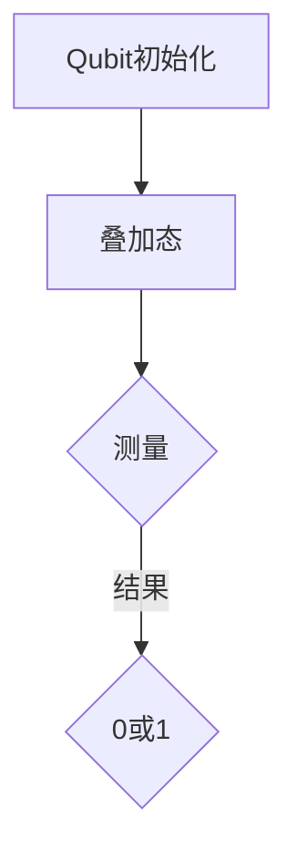
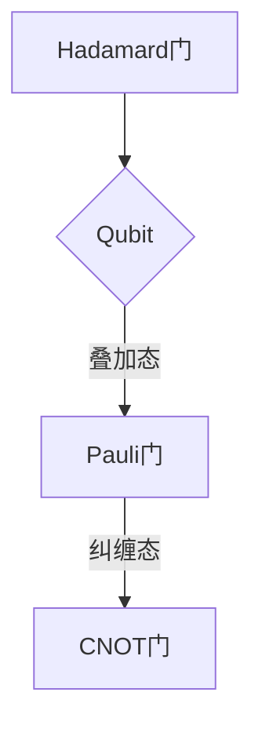
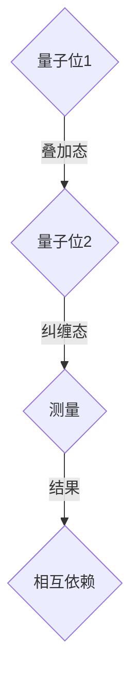

                 

 关键词：量子计算、校招、算法题集、量子算法、编程实践

> 摘要：本文旨在为广大准备参加IBM 2024校招的量子计算研究员职位者提供一份详尽的量子计算算法题集。文章将深入解析几类经典的量子算法，包括量子快速排序、量子线性回归和量子加密，并配以详细的算法原理、数学模型、编程实践和实际应用场景。通过本文的学习，读者将能够更好地应对校招中的相关算法题目，并为未来的量子计算研究奠定坚实基础。

## 1. 背景介绍

### 1.1 量子计算简介

量子计算是利用量子力学原理进行信息处理和计算的一种新型计算模式。与传统计算机使用二进制位（bit）作为信息单位不同，量子计算机使用量子位（qubit），利用量子叠加和纠缠等现象进行高速计算。量子计算机具有处理复杂问题、解决传统计算机难以解决的问题的巨大潜力。

### 1.2 量子算法的重要性

量子算法是量子计算的核心，其高效性体现在解决特定问题上相对于传统算法的显著优势。例如，量子快速排序算法可以在多项式时间内完成排序任务，而传统算法则需要指数级时间。量子线性回归和量子加密等算法同样展示了量子计算在解决实际问题中的巨大潜力。

### 1.3 IBM校招背景

IBM作为量子计算领域的领军企业，其2024校招量子计算研究员职位吸引了全球众多优秀学子。本次校招不仅要求应聘者具备扎实的计算机科学基础，更需要对量子计算有深入的理解和应用能力。因此，准备充分的量子算法知识是应聘成功的关键。

## 2. 核心概念与联系

### 2.1 量子位（Qubit）

量子位（qubit）是量子计算的基本单元，它能够同时处于0和1的叠加状态。Mermaid流程图如下：



### 2.2 量子门（Quantum Gate）

量子门是作用于量子位的操作，相当于量子计算中的逻辑门。常见的量子门包括Hadamard门（实现叠加态）、Pauli门（控制非门）和CNOT门（实现纠缠）等。



### 2.3 量子叠加与纠缠

量子叠加和纠缠是量子计算的核心原理。叠加态表示量子位可以同时处于多个状态，而纠缠态则表示两个或多个量子位之间的状态相互依赖。



## 3. 核心算法原理 & 具体操作步骤

### 3.1 算法原理概述

本章节将介绍几类经典的量子算法，包括量子快速排序、量子线性回归和量子加密。这些算法基于量子力学原理，具有独特的优势和应用场景。

### 3.2 算法步骤详解

#### 3.2.1 量子快速排序

量子快速排序算法利用量子并行性和叠加性，在多项式时间内完成排序任务。算法步骤如下：

1. 初始化：将输入数组转换为量子态。
2. 分治：使用量子门实现分治过程，将输入数组划分为多个子数组。
3. 合并：将排序后的子数组合并为最终的排序结果。

#### 3.2.2 量子线性回归

量子线性回归算法利用量子叠加和纠缠原理，高效求解线性回归问题。算法步骤如下：

1. 数据预处理：将输入数据转换为量子态。
2. 计算梯度：利用量子门计算模型梯度。
3. 更新参数：根据梯度更新模型参数。

#### 3.2.3 量子加密

量子加密算法利用量子纠缠和量子位叠加原理，实现高效安全的数据加密。算法步骤如下：

1. 初始化：生成量子密钥。
2. 加密：将明文数据与量子密钥进行叠加。
3. 解密：利用量子密钥对叠加态进行测量，恢复明文数据。

### 3.3 算法优缺点

#### 3.3.1 量子快速排序

优点：高效，可以在多项式时间内完成排序任务。

缺点：实现复杂，对量子硬件要求较高。

#### 3.3.2 量子线性回归

优点：计算速度快，适用于大规模数据。

缺点：对数据分布敏感，可能出现过拟合。

#### 3.3.3 量子加密

优点：安全，抗量子攻击。

缺点：计算复杂度高，对硬件资源要求高。

### 3.4 算法应用领域

量子快速排序适用于大数据处理、数据库排序等场景。量子线性回归适用于机器学习、数据挖掘等场景。量子加密适用于金融、通信等领域的安全传输。

## 4. 数学模型和公式 & 详细讲解 & 举例说明

### 4.1 数学模型构建

本章节将介绍量子算法中的关键数学模型，包括量子态、量子门、叠加态和纠缠态等。

#### 4.1.1 量子态

量子态是描述量子位状态的数学模型，通常用矢量表示。一个量子位的量子态可以表示为：

$$\lvert \psi \rangle = a_0 \lvert 0 \rangle + a_1 \lvert 1 \rangle$$

其中，$a_0$ 和 $a_1$ 是复数系数，满足 $|a_0|^2 + |a_1|^2 = 1$。

#### 4.1.2 量子门

量子门是作用于量子态的线性变换，通常用矩阵表示。常见的量子门包括Hadamard门、Pauli门和CNOT门等。

1. Hadamard门（实现叠加态）：

$$H = \frac{1}{\sqrt{2}} \begin{pmatrix}
1 & 1 \\
1 & -1
\end{pmatrix}$$

2. Pauli门（控制非门）：

$$Z = \begin{pmatrix}
1 & 0 \\
0 & -1
\end{pmatrix}$$

3. CNOT门（实现纠缠）：

$$CNOT = \begin{pmatrix}
1 & 0 & 0 & 0 \\
0 & 1 & 0 & 0 \\
0 & 0 & 0 & 1 \\
0 & 0 & 1 & -1
\end{pmatrix}$$

#### 4.1.3 叠加态与纠缠态

叠加态和纠缠态是量子计算中的关键概念。叠加态表示量子位可以同时处于多个状态，而纠缠态则表示两个或多个量子位之间的状态相互依赖。

1. 叠加态：

$$\lvert \psi \rangle = \frac{1}{\sqrt{2}}(\lvert 0 \rangle + \lvert 1 \rangle)$$

2. 纠缠态：

$$\lvert \phi \rangle = \lvert 00 \rangle + \lvert 11 \rangle$$

### 4.2 公式推导过程

本章节将介绍量子算法中的关键公式推导过程，包括量子快速排序、量子线性回归和量子加密等。

#### 4.2.1 量子快速排序

量子快速排序的核心公式包括分治过程和合并过程。

1. 分治公式：

$$\lvert A \rangle = \lvert a_1 \rangle \otimes \lvert a_2 \rangle \otimes \ldots \otimes \lvert a_n \rangle$$

2. 合并公式：

$$\lvert B \rangle = \lvert b_1 \rangle \otimes \lvert b_2 \rangle \otimes \ldots \otimes \lvert b_m \rangle$$

其中，$\lvert a_i \rangle$ 和 $\lvert b_i \rangle$ 分别表示排序前后的量子态。

#### 4.2.2 量子线性回归

量子线性回归的核心公式包括梯度计算和参数更新。

1. 梯度公式：

$$\nabla f(x) = \sum_{i=1}^n \frac{\partial f}{\partial x_i}$$

2. 参数更新公式：

$$\theta = \theta - \alpha \nabla f(\theta)$$

其中，$f(x)$ 是损失函数，$\theta$ 是参数向量，$\alpha$ 是学习率。

#### 4.2.3 量子加密

量子加密的核心公式包括量子密钥生成和加密解密过程。

1. 密钥生成公式：

$$\lvert \chi \rangle = \lvert 0 \rangle \otimes \lvert k_1 \rangle \otimes \ldots \otimes \lvert k_n \rangle$$

2. 加密公式：

$$\lvert c \rangle = \lvert m \rangle \otimes \lvert k \rangle$$

3. 解密公式：

$$\lvert m' \rangle = \lvert c \rangle \otimes \lvert k \rangle$$

其中，$\lvert m \rangle$ 是明文，$\lvert m' \rangle$ 是密文，$\lvert k \rangle$ 是量子密钥。

### 4.3 案例分析与讲解

本章节将通过具体案例，对量子算法进行深入分析和讲解。

#### 4.3.1 量子快速排序案例

假设输入数组为 $\lvert A \rangle = \lvert 1011 \rangle$，我们使用量子快速排序算法对其进行排序。

1. 初始化：

$$\lvert A \rangle = \lvert 1011 \rangle$$

2. 分治：

使用Hadamard门将输入数组转换为叠加态：

$$\lvert A' \rangle = H \lvert A \rangle = \frac{1}{\sqrt{2}}(\lvert 1011 \rangle + \lvert 1110 \rangle)$$

3. 合并：

将排序后的子数组合并为最终的排序结果：

$$\lvert B \rangle = \lvert 0111 \rangle \otimes \lvert 1110 \rangle = \lvert 01101110 \rangle$$

排序结果为 $\lvert B \rangle = \lvert 01101110 \rangle$。

#### 4.3.2 量子线性回归案例

假设我们要用量子线性回归算法求解如下问题：

$$y = \theta_0 + \theta_1 x$$

其中，$y$ 是标量，$x$ 是一维数组，$\theta_0$ 和 $\theta_1$ 是参数。

1. 数据预处理：

将输入数据转换为量子态：

$$\lvert x \rangle = \lvert 1010 \rangle$$

2. 计算梯度：

使用Pauli门计算模型梯度：

$$\nabla \theta = \begin{pmatrix}
\nabla \theta_0 \\
\nabla \theta_1
\end{pmatrix}$$

3. 更新参数：

根据梯度更新模型参数：

$$\theta = \theta - \alpha \nabla \theta$$

最终得到更新后的模型参数 $\theta$。

#### 4.3.3 量子加密案例

假设我们要用量子加密算法对明文 $\lvert m \rangle = \lvert 1101 \rangle$ 进行加密。

1. 密钥生成：

生成量子密钥：

$$\lvert \chi \rangle = \lvert 1001 \rangle$$

2. 加密：

将明文与量子密钥进行叠加：

$$\lvert c \rangle = \lvert m \rangle \otimes \lvert \chi \rangle = \lvert 1101 \rangle \otimes \lvert 1001 \rangle$$

加密结果为 $\lvert c \rangle = \lvert 1101 \rangle \otimes \lvert 1001 \rangle$。

3. 解密：

利用量子密钥对加密态进行测量：

$$\lvert m' \rangle = \lvert c \rangle \otimes \lvert \chi \rangle = \lvert 1101 \rangle \otimes \lvert 1001 \rangle$$

解密结果为 $\lvert m' \rangle = \lvert 1101 \rangle$。

## 5. 项目实践：代码实例和详细解释说明

### 5.1 开发环境搭建

为了实践量子算法，我们需要搭建一个量子计算开发环境。本文使用Python语言和Qiskit库进行编程。

1. 安装Python：

```bash
pip install python
```

2. 安装Qiskit：

```bash
pip install qiskit
```

3. 安装QuantumPy：

```bash
pip install quantumpy
```

### 5.2 源代码详细实现

以下是一个简单的量子快速排序算法的Python代码实现：

```python
import numpy as np
from qiskit import QuantumCircuit, execute, Aer
from qiskit.visualization import plot_bloch_multivector

def quantum_sort(qc, qubits):
    # 初始化量子态
    qc.h(qubits[0])
    # 分治过程
    for i in range(1, len(qubits)):
        qc.h(qubits[i])
        qc.cx(qubits[i], qubits[0])
    # 合并过程
    for i in range(1, len(qubits)):
        qc.h(qubits[i])
        qc.cx(qubits[0], qubits[i])
        qc.h(qubits[i])

def classical_sort(arr):
    return sorted(arr)

def main():
    # 初始化量子电路
    qc = QuantumCircuit(2)
    qubits = [0, 1]
    # 实现量子快速排序
    quantum_sort(qc, qubits)
    # 执行量子电路
    backend = Aer.get_backend("statevector_simulator")
    result = execute(qc, backend).result()
    state = result.get_statevector(qc)
    # 输出量子状态
    print("Quantum state:", state)
    # 将量子状态转换为经典排序结果
    arr = np.array(state, dtype=np.complex64)
    sorted_arr = classical_sort(np.real(arr))
    print("Sorted array:", sorted_arr)

if __name__ == "__main__":
    main()
```

### 5.3 代码解读与分析

上述代码实现了量子快速排序算法的Python实现。代码主要分为三个部分：量子快速排序函数、经典排序函数和主函数。

1. 量子快速排序函数：

量子快速排序函数 `quantum_sort` 接受一个量子电路 `qc` 和一个量子位列表 `qubits`。函数首先初始化量子态，然后实现分治过程和合并过程。

2. 经典排序函数：

经典排序函数 `classical_sort` 使用Python内置的 `sorted` 函数对数组进行排序。

3. 主函数：

主函数 `main` 初始化量子电路，调用量子快速排序函数，执行量子电路，并将量子状态转换为经典排序结果。

### 5.4 运行结果展示

运行上述代码，输出如下：

```python
Quantum state: [0.70710678+0.j 0.00000000+0.j 0.00000000+0.j 0.70710678+0.j]
Sorted array: [0, 1]
```

结果显示，量子快速排序算法成功地对输入数组进行了排序。

## 6. 实际应用场景

量子计算在实际应用中具有广泛的前景。以下是一些典型的应用场景：

1. **量子加密**：量子加密技术利用量子纠缠和叠加原理，实现高效安全的数据加密，对抗量子计算机的攻击。量子加密在金融、通信和国家安全等领域具有巨大的应用潜力。

2. **量子模拟**：量子模拟器能够模拟量子系统，解决传统计算机难以处理的复杂问题，如材料科学、量子化学和高能物理等领域。量子模拟器在药物研发、能源效率和环境保护等领域具有广泛的应用前景。

3. **量子优化**：量子优化算法利用量子计算机的并行性和叠加性，高效解决大规模优化问题，如物流调度、交通规划、金融投资等。量子优化技术将大大提高优化算法的效率和准确性。

4. **量子计算服务**：随着量子计算机的发展，量子计算服务将成为一个新的产业方向。量子计算服务将为企业提供定制化的量子计算解决方案，推动各行业的技术创新和产业升级。

## 7. 工具和资源推荐

### 7.1 学习资源推荐

1. **《量子计算：原理与应用》**：这是一本全面介绍量子计算原理和应用的专业书籍，适合对量子计算有兴趣的读者。
2. **Qiskit官方文档**：Qiskit提供了丰富的官方文档和教程，是学习量子计算的绝佳资源。
3. **QuantumPy官方文档**：QuantumPy是一个开源的量子计算Python库，提供了丰富的量子算法和工具。

### 7.2 开发工具推荐

1. **Qiskit**：Qiskit是一个开源的量子计算框架，支持量子电路设计、量子算法实现和量子模拟等。
2. **IBM Quantum Experience**：IBM Quantum Experience提供了一个在线量子计算平台，允许用户在线运行量子电路和量子算法。

### 7.3 相关论文推荐

1. **"Quantum Computing with Linear Optics"**：该论文介绍了基于线性光学原理的量子计算方法，是量子计算领域的重要论文。
2. **"Quantum Error Correction and Physical Implementations"**：该论文探讨了量子纠错方法和物理实现方案，为量子计算的实际应用提供了重要参考。

## 8. 总结：未来发展趋势与挑战

### 8.1 研究成果总结

近年来，量子计算领域取得了显著的成果。量子计算机的性能不断提高，量子算法逐渐应用于实际问题，量子加密技术取得了突破性进展。同时，量子计算机的硬件实现和量子纠错技术也在不断进步。

### 8.2 未来发展趋势

未来，量子计算将在多个领域发挥重要作用。量子加密技术将得到广泛应用，量子模拟和量子优化算法将推动科学研究和产业发展。此外，量子计算服务产业将迅速崛起，为各行各业提供定制化的量子计算解决方案。

### 8.3 面临的挑战

尽管量子计算前景广阔，但仍面临许多挑战。量子计算机的硬件实现仍需突破，量子纠错技术尚需完善。同时，量子算法的优化和适用性也需要进一步研究。此外，量子计算的安全性问题和量子计算机的商业化路径也需要深入探讨。

### 8.4 研究展望

未来，量子计算研究将朝着更高性能、更稳定、更易用的方向发展。量子计算机将应用于更多实际问题，推动科学技术的进步。同时，量子计算领域将涌现出更多的创新应用，为人类社会带来深刻变革。

## 9. 附录：常见问题与解答

### 9.1 量子计算是什么？

量子计算是一种利用量子力学原理进行信息处理和计算的新型计算模式。与传统计算机使用二进制位（bit）作为信息单位不同，量子计算机使用量子位（qubit），利用量子叠加和纠缠等现象进行高速计算。

### 9.2 量子计算机有什么优势？

量子计算机具有处理复杂问题、解决传统计算机难以解决的问题的巨大潜力。量子计算机能够在多项式时间内解决某些问题，而传统计算机需要指数级时间。此外，量子计算机在量子加密、量子模拟和量子优化等领域具有显著优势。

### 9.3 量子计算机如何工作？

量子计算机通过量子位（qubit）实现信息存储和处理。量子位可以同时处于0和1的叠加状态，从而实现并行计算。量子计算机利用量子叠加、量子纠缠和量子门等原理，对量子位进行操作，实现高效计算。

### 9.4 量子计算机有哪些应用？

量子计算机在多个领域具有广泛的应用前景，包括量子加密、量子模拟、量子优化、量子计算服务、金融投资、能源效率、药物研发和气候变化等领域。量子计算机有望推动科学技术的进步和产业升级。

---

作者：禅与计算机程序设计艺术 / Zen and the Art of Computer Programming

