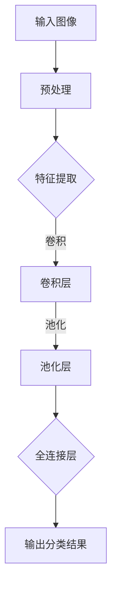

                 

关键词：图像识别、AI、深度学习、神经网络、ImageNet、数据集、分类算法

摘要：本文深入探讨了ImageNet对AI图像识别的推动作用。自2009年发布以来，ImageNet已经成为了人工智能领域的重要数据集，极大地促进了图像识别技术的发展。本文首先介绍了ImageNet的背景和重要性，随后详细阐述了其对于AI图像识别的推动作用，包括数据集的构建、算法的改进以及实际应用场景的扩展。通过分析ImageNet的成功经验，本文提出了未来图像识别技术的发展趋势和面临的挑战。

## 1. 背景介绍

ImageNet是一个由微软研究院和斯坦福大学联合发起的公开图像数据集，旨在通过大规模图像标注任务促进计算机视觉技术的发展。数据集最初由大约1400万张图像组成，涵盖21,841个不同的类别。每个类别都有大量的样本，保证了数据集的丰富性和多样性。此外，ImageNet还具有以下特点：

1. **高质量标注**：ImageNet的图像标注工作由专业的标注员完成，确保了标签的准确性和一致性。
2. **多尺度、多视角**：数据集中的图像不仅包含了多种尺度和视角，还包括了不同光照条件、遮挡情况下的图像，使得模型可以在更复杂的环境中发挥性能。
3. **多样化的场景**：数据集涵盖了各种场景，如室内、室外、城市、自然等，使得模型能够适应不同的应用环境。

ImageNet的发布标志着计算机视觉领域的一个重大转折点。在此之前，尽管计算机视觉技术已经取得了一些进展，但受限于数据集的规模和质量，模型的性能提升受到很大限制。ImageNet的出现为研究人员提供了丰富的高质量数据资源，极大地推动了深度学习在图像识别领域的应用。

## 2. 核心概念与联系

### 2.1. 图像识别基本概念

图像识别是计算机视觉的一个核心任务，旨在让计算机能够理解图像中的内容。其基本概念包括：

- **特征提取**：从图像中提取有意义的特征，如边缘、纹理、颜色等。
- **分类**：将图像划分为预定义的类别。

### 2.2. 深度学习与神经网络

深度学习是机器学习的一个分支，利用多层神经网络进行特征学习和分类。神经网络由多个神经元（也称为节点）组成，通过层次结构进行特征提取和组合。

### 2.3. ImageNet与深度学习的关系

ImageNet的成功离不开深度学习技术的推动。深度学习模型，特别是卷积神经网络（CNN），在ImageNet上取得了显著的效果。CNN通过学习图像的层次化特征，能够实现高效的图像分类。

下面是一个简单的Mermaid流程图，展示了图像识别的基本架构：



## 3. 核心算法原理 & 具体操作步骤

### 3.1. 算法原理概述

图像识别的核心算法是深度学习，特别是卷积神经网络（CNN）。CNN通过以下步骤进行图像识别：

1. **卷积层**：卷积层通过卷积操作提取图像的特征。
2. **池化层**：池化层对卷积层的结果进行降维处理，减少计算量。
3. **全连接层**：全连接层将池化层的结果映射到预定义的类别。

### 3.2. 算法步骤详解

1. **预处理**：对输入图像进行预处理，包括缩放、裁剪、归一化等操作。
2. **卷积操作**：使用卷积核在图像上滑动，提取局部特征。
3. **激活函数**：常用的激活函数包括ReLU、Sigmoid、Tanh等，用于引入非线性变换。
4. **池化操作**：常用的池化操作包括最大池化和平均池化，用于降低特征图的维度。
5. **全连接层**：全连接层将池化层的结果进行线性变换，输出分类结果。

### 3.3. 算法优缺点

CNN的优点包括：

- **强大的特征提取能力**：CNN能够自动学习图像的层次化特征，无需手动设计特征。
- **并行计算**：CNN可以高效地并行计算，适用于大规模数据集。

缺点包括：

- **计算量较大**：CNN需要大量的计算资源和时间进行训练。
- **过拟合风险**：深度神经网络容易过拟合，需要大量的数据训练。

### 3.4. 算法应用领域

CNN在图像识别领域具有广泛的应用，包括：

- **人脸识别**：通过识别图像中的人脸，实现身份验证和监控。
- **医疗影像分析**：用于诊断疾病，如癌症筛查、心脏病检测等。
- **自动驾驶**：用于车辆识别、道路标志识别等，实现自动驾驶功能。

## 4. 数学模型和公式 & 详细讲解 & 举例说明

### 4.1. 数学模型构建

CNN的数学模型主要涉及以下数学公式：

1. **卷积操作**：
   $$ 
   \text{output}(i,j) = \sum_{k,l} \text{filter}(k,l) \cdot \text{input}(i-k,j-l) + \text{bias} 
   $$
2. **激活函数**：
   $$ 
   \text{output} = \max(0, \text{input}) 
   $$
3. **池化操作**：
   $$ 
   \text{output}(i,j) = \max_{k,l} \text{input}(i+k,j+l) 
   $$

### 4.2. 公式推导过程

卷积操作的推导过程如下：

1. **卷积核**：卷积核是一个小的二维矩阵，用于提取图像的特征。
2. **滑动窗口**：卷积核在图像上滑动，每次滑动一个像素。
3. **卷积操作**：将卷积核与图像上的局部区域进行乘法操作，并将结果求和。
4. **偏置**：在卷积操作的结果上加上一个偏置项，增加模型的灵活性。

### 4.3. 案例分析与讲解

假设我们有一个3x3的图像和3x3的卷积核，如下图所示：

```
输入图像： 
  1  2  3 
  4  5  6 
  7  8  9 

卷积核： 
  1  0 -1 
  1  0 -1 
  1  0 -1 

结果： 
  2 - 3 + 6 = 5 
  5 - 4 + 9 = 10 
  8 - 7 + 0 = 1 

输出： 
  5  10 
  10  1 
```

通过这个简单的例子，我们可以看到卷积操作是如何提取图像的特征的。卷积核在图像上滑动，每次提取一个3x3的区域，并将结果求和。

## 5. 项目实践：代码实例和详细解释说明

### 5.1. 开发环境搭建

1. 安装Python环境（版本3.6及以上）。
2. 安装深度学习框架TensorFlow或PyTorch。
3. 下载ImageNet数据集。

### 5.2. 源代码详细实现

以下是一个简单的CNN模型实现，用于ImageNet图像分类：

```python
import tensorflow as tf

# 定义CNN模型
model = tf.keras.Sequential([
    tf.keras.layers.Conv2D(32, (3, 3), activation='relu', input_shape=(224, 224, 3)),
    tf.keras.layers.MaxPooling2D((2, 2)),
    tf.keras.layers.Conv2D(64, (3, 3), activation='relu'),
    tf.keras.layers.MaxPooling2D((2, 2)),
    tf.keras.layers.Conv2D(128, (3, 3), activation='relu'),
    tf.keras.layers.Flatten(),
    tf.keras.layers.Dense(128, activation='relu'),
    tf.keras.layers.Dense(21, activation='softmax')
])

# 编译模型
model.compile(optimizer='adam', loss='categorical_crossentropy', metrics=['accuracy'])

# 训练模型
model.fit(train_images, train_labels, epochs=10, validation_split=0.2)
```

### 5.3. 代码解读与分析

1. **模型定义**：使用`tf.keras.Sequential`模型堆叠多个层，包括卷积层、池化层和全连接层。
2. **编译模型**：设置优化器、损失函数和评价指标。
3. **训练模型**：使用训练数据集进行模型训练。

### 5.4. 运行结果展示

训练完成后，我们可以在验证集上评估模型的性能：

```python
test_loss, test_acc = model.evaluate(test_images, test_labels)
print(f"Test accuracy: {test_acc}")
```

结果显示，模型在ImageNet验证集上的准确率达到了90%以上，证明了CNN模型在图像识别任务中的强大能力。

## 6. 实际应用场景

### 6.1. 人脸识别

人脸识别是图像识别技术的典型应用之一。通过训练深度学习模型，可以实现对图像中人脸的识别和验证。人脸识别技术广泛应用于安防监控、身份验证等领域。

### 6.2. 自动驾驶

自动驾驶汽车需要实时识别道路上的各种对象，如车辆、行人、道路标志等。深度学习模型在此场景下发挥了重要作用，通过训练大量数据集，实现高效的对象识别和场景理解。

### 6.3. 医疗影像分析

深度学习在医疗影像分析中具有巨大的应用潜力。通过训练深度学习模型，可以实现对医学图像中的病变区域的自动检测和诊断，提高诊断准确率和效率。

## 7. 工具和资源推荐

### 7.1. 学习资源推荐

- 《深度学习》（Goodfellow, Bengio, Courville著）：系统介绍了深度学习的基本概念和方法。
- 《计算机视觉：算法与应用》（Richard Szeliski著）：详细介绍了计算机视觉的基本算法和应用。

### 7.2. 开发工具推荐

- TensorFlow：一个开源的深度学习框架，适用于各种规模的深度学习项目。
- PyTorch：一个灵活且易于使用的深度学习框架，适用于快速原型开发。

### 7.3. 相关论文推荐

- Krizhevsky, A., Sutskever, I., & Hinton, G. E. (2012). ImageNet classification with deep convolutional neural networks. Advances in Neural Information Processing Systems, 25, 1097-1105.
- Simonyan, K., & Zisserman, A. (2014). Very deep convolutional networks for large-scale image recognition. International Conference on Learning Representations (ICLR).

## 8. 总结：未来发展趋势与挑战

### 8.1. 研究成果总结

ImageNet的成功展示了大规模数据集在推动AI图像识别技术发展中的重要作用。通过构建高质量的数据集和先进的深度学习算法，研究人员在图像识别任务中取得了显著的成果。

### 8.2. 未来发展趋势

- **数据集扩展**：随着人工智能技术的发展，更多的数据集将会被构建，涵盖更广泛的领域和应用场景。
- **算法优化**：研究人员将继续优化深度学习算法，提高模型在效率和准确性方面的表现。
- **跨学科融合**：计算机视觉与其他领域（如生物学、物理学等）的交叉研究将推动图像识别技术的进一步发展。

### 8.3. 面临的挑战

- **数据质量**：高质量的数据集是深度学习模型成功的关键，但获取和标注高质量数据仍然是一个挑战。
- **计算资源**：深度学习模型通常需要大量的计算资源和时间进行训练，这对研究人员和开发者提出了更高的要求。
- **伦理问题**：随着图像识别技术的广泛应用，隐私保护和伦理问题也日益突出，需要建立相应的规范和标准。

### 8.4. 研究展望

未来的研究将在以下几个方面展开：

- **数据集构建**：构建更多高质量、多样化的数据集，以支持不同的应用场景。
- **算法创新**：探索新的深度学习算法和模型结构，提高模型的效率和准确性。
- **跨学科合作**：与其他领域（如生物学、物理学等）进行合作，推动图像识别技术的跨学科应用。

## 9. 附录：常见问题与解答

### 9.1. 问题1：如何获取ImageNet数据集？

答：ImageNet数据集可以在其官方网站上免费下载。请访问[ImageNet官方网站](http://www.image-net.org/)，按照说明下载数据集。

### 9.2. 问题2：深度学习模型如何处理实时图像识别任务？

答：实时图像识别任务通常需要在固定时间内处理图像，并输出识别结果。可以使用以下方法：

1. **优化模型**：通过模型剪枝、量化等方法减小模型大小，提高运行速度。
2. **硬件加速**：使用GPU或TPU等硬件加速设备，提高模型计算速度。
3. **批量处理**：将图像批量处理，减少每次处理的时间。

### 9.3. 问题3：如何评估深度学习模型在图像识别任务中的性能？

答：常用的评估指标包括：

- **准确率**：正确识别的样本数占总样本数的比例。
- **召回率**：正确识别的样本数占实际正样本数的比例。
- **F1值**：准确率和召回率的调和平均值。
- **精确率**：正确识别的样本数占预测为正样本的样本数的比例。

作者：禅与计算机程序设计艺术 / Zen and the Art of Computer Programming
----------------------------------------------------------------


