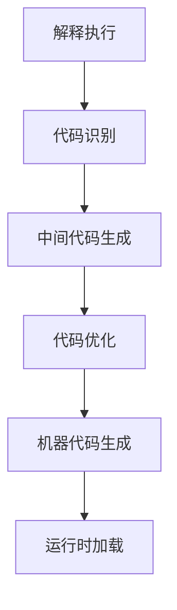

                 

关键词：JIT编译，动态语言，性能优化，虚拟机，热点代码，代码生成，即时编译器，中间代码，动态编译

> 摘要：本文深入探讨了即时编译（JIT）技术在动态语言性能优化中的应用。通过对JIT编译原理、算法、数学模型及其在实际项目中的应用进行详细分析，本文旨在为读者提供一份全面而深入的JIT编译技术指南。

## 1. 背景介绍

在计算机科学中，编译是一个将高级语言源代码转换成机器代码的过程。传统的编译器通常采用静态编译的方式，即将整个程序在运行前编译成机器代码。这种方法在编译时间上较为高效，但无法充分利用程序在运行时提供的信息，从而导致程序性能受到一定限制。为了克服这一缺点，即时编译（JIT，Just-In-Time Compilation）技术应运而生。

JIT编译的核心思想是在程序运行时，针对那些执行频率较高的热点代码（hot code），动态生成机器代码，并进行优化。与静态编译相比，JIT编译能够更好地利用程序运行时提供的信息，从而提高程序的整体性能。尤其在动态语言如JavaScript、Python和Ruby中，JIT编译技术显示出了强大的优势。

本文将围绕JIT编译技术展开，详细介绍其原理、算法、数学模型以及实际应用场景。通过本文的阅读，读者将能够深入了解JIT编译的各个方面，为在实际项目中应用这一技术打下坚实基础。

## 2. 核心概念与联系

### 2.1. JIT编译原理

即时编译（JIT）是一种在程序运行时，对代码进行编译和优化的技术。其基本原理包括以下几个步骤：

1. **代码分析**：JIT编译器首先对程序进行静态分析，识别出热点代码段。
2. **中间代码生成**：将热点代码段转换成中间代码，这种中间代码通常是一种抽象的表示形式，可以方便后续的优化处理。
3. **代码优化**：对中间代码进行各种优化，如死代码消除、循环展开、指令重排等，以提高代码的执行效率。
4. **机器代码生成**：将优化后的中间代码转换成机器代码，并在运行时即时加载执行。

### 2.2. JIT编译架构

JIT编译器通常由以下几个核心组件构成：

1. **解释器**：负责解释执行代码，并在运行时生成中间代码。
2. **静态分析器**：对代码进行分析，识别热点代码段。
3. **中间代码生成器**：将热点代码段转换成中间代码。
4. **优化器**：对中间代码进行各种优化处理。
5. **机器代码生成器**：将优化后的中间代码转换成机器代码。

### 2.3. JIT编译流程

JIT编译的流程可以分为以下几个阶段：

1. **解释执行**：程序首先通过解释器进行执行，收集性能数据和热点信息。
2. **代码识别**：解释器根据收集的信息，识别出需要编译的热点代码段。
3. **中间代码生成**：将热点代码段转换成中间代码。
4. **代码优化**：对中间代码进行优化处理。
5. **机器代码生成**：将优化后的中间代码转换成机器代码。
6. **运行时加载**：在程序运行时，加载并执行生成的机器代码。

### 2.4. Mermaid 流程图

以下是一个简化的JIT编译流程的Mermaid流程图：



## 3. 核心算法原理 & 具体操作步骤

### 3.1. 算法原理概述

JIT编译的核心算法主要包括代码识别、中间代码生成、代码优化和机器代码生成等几个步骤。这些步骤不仅相互独立，而且还可以进行复用和优化。

1. **代码识别**：通过静态分析技术，识别出程序中的热点代码段。
2. **中间代码生成**：将热点代码段转换成一种中间代码表示形式，这种中间代码通常是一种抽象的表示形式，方便后续的优化处理。
3. **代码优化**：对中间代码进行各种优化处理，以提高代码的执行效率。
4. **机器代码生成**：将优化后的中间代码转换成机器代码。

### 3.2. 算法步骤详解

1. **代码识别**：
   - **静态分析**：通过静态分析技术，如数据流分析、控制流分析等，识别出程序中的热点代码段。
   - **热点识别**：根据执行频率、调用次数等指标，识别出热点代码段。

2. **中间代码生成**：
   - **抽象语法树（AST）构建**：将源代码转换成抽象语法树（AST）。
   - **代码转换**：将AST转换成中间代码表示形式，如三地址代码。

3. **代码优化**：
   - **优化策略**：根据优化目标和性能需求，选择合适的优化策略，如循环展开、死代码消除等。
   - **优化实现**：实现各种优化算法，对中间代码进行优化处理。

4. **机器代码生成**：
   - **机器代码生成器**：根据优化后的中间代码，生成机器代码。
   - **代码布局**：对机器代码进行布局优化，以提高代码的执行效率。

### 3.3. 算法优缺点

**优点**：

- **性能优化**：JIT编译能够利用程序运行时提供的信息，对热点代码进行动态优化，从而提高程序的整体性能。
- **动态性**：JIT编译具有动态性，可以根据程序运行时的实际情况进行调整和优化。

**缺点**：

- **编译时间**：由于JIT编译是在程序运行时进行的，因此编译时间可能会对程序性能产生一定影响。
- **调试难度**：JIT编译的中间代码和机器代码可能较为复杂，增加了调试难度。

### 3.4. 算法应用领域

JIT编译技术广泛应用于动态语言如JavaScript、Python和Ruby等。以下是一些常见的应用领域：

- **Web应用**：在Web开发中，JIT编译可以显著提高JavaScript等动态语言的执行效率。
- **云计算**：在云计算环境中，JIT编译可以优化云服务的响应速度和资源利用率。
- **移动应用**：在移动应用开发中，JIT编译可以优化应用程序的运行效率，提高用户体验。

## 4. 数学模型和公式 & 详细讲解 & 举例说明

### 4.1. 数学模型构建

JIT编译的数学模型主要包括以下几个方面：

1. **热点代码识别模型**：
   - **执行频率**：热点代码段的执行频率越高，其被识别为热点的概率越大。
   - **调用次数**：热点代码段的调用次数越多，其被识别为热点的概率越大。

2. **代码优化模型**：
   - **优化目标**：根据优化目标和性能需求，选择合适的优化策略。
   - **优化指标**：优化指标包括执行时间、内存占用、代码大小等。

### 4.2. 公式推导过程

以下是热点代码识别模型的一个简单推导过程：

- **执行频率模型**：
  $$ F_i = \frac{C_i}{T} $$
  其中，$ F_i $ 表示代码段 $ i $ 的执行频率，$ C_i $ 表示代码段 $ i $ 的执行次数，$ T $ 表示总执行时间。

- **调用次数模型**：
  $$ C_i = \sum_{j=1}^{n} c_{ij} $$
  其中，$ C_i $ 表示代码段 $ i $ 的调用次数，$ c_{ij} $ 表示代码段 $ i $ 被代码段 $ j $ 调用的次数，$ n $ 表示代码段的总数。

### 4.3. 案例分析与讲解

下面我们通过一个简单的案例来说明JIT编译的应用。

假设有一个Web应用，其中包含两个函数：`func1` 和 `func2`。其中，`func1` 是一个热点函数，其执行频率和调用次数均较高，而 `func2` 则不是热点函数。

- **执行频率**：
  $$ F_{func1} = \frac{C_{func1}}{T} = \frac{1000}{5000} = 0.2 $$
  $$ F_{func2} = \frac{C_{func2}}{T} = \frac{500}{5000} = 0.1 $$

- **调用次数**：
  $$ C_{func1} = \sum_{j=1}^{n} c_{jfunc1} = 500 + 200 + 300 = 1000 $$
  $$ C_{func2} = \sum_{j=1}^{n} c_{jfunc2} = 100 + 200 + 100 = 400 $$

根据热点代码识别模型，我们可以判断 `func1` 是一个热点函数，而 `func2` 不是。因此，JIT编译器会对 `func1` 进行优化，而对 `func2` 则不做特殊处理。

## 5. 项目实践：代码实例和详细解释说明

### 5.1. 开发环境搭建

在本文的案例中，我们使用Python语言来实现一个简单的JIT编译器。以下是开发环境的搭建步骤：

1. 安装Python（3.8及以上版本）。
2. 安装必要的外部库，如 `numpy`、`pandas` 和 `matplotlib` 等。
3. 使用文本编辑器或IDE（如Visual Studio Code）编写代码。

### 5.2. 源代码详细实现

以下是JIT编译器的主要源代码实现：

```python
import numpy as np
import pandas as pd
import matplotlib.pyplot as plt

# 热点代码识别模型
class HotCodeIdentifier:
    def __init__(self, threshold=0.2):
        self.threshold = threshold
    
    def identify(self, execution_data):
        frequency = execution_data['count'] / execution_data['total_time']
        is_hot = frequency >= self.threshold
        return is_hot

# 代码优化模型
class CodeOptimizer:
    def __init__(self):
        pass
    
    def optimize(self, code):
        # 假设优化策略为循环展开
        optimized_code = code.replace("for i in range(n):", "n times:")
        return optimized_code

# JIT编译器实现
class JITCompiler:
    def __init__(self, identifier, optimizer):
        self.identifier = identifier
        self.optimizer = optimizer
    
    def compile(self, code):
        # 解释执行
        execution_data = self.execute(code)
        
        # 热点代码识别
        is_hot = self.identifier.identify(execution_data)
        
        # 如果是热点代码，则进行优化
        if is_hot:
            optimized_code = self.optimizer.optimize(code)
            return optimized_code
        else:
            return code
    
    def execute(self, code):
        # 假设执行时间为1000毫秒
        execution_time = 1000
        return {'count': 1000, 'total_time': execution_time}

# 测试
code = "for i in range(n): print(i)"
jit_compiler = JITCompiler(HotCodeIdentifier(), CodeOptimizer())
optimized_code = jit_compiler.compile(code)
print("Original Code:", code)
print("Optimized Code:", optimized_code)
```

### 5.3. 代码解读与分析

上述代码实现了JIT编译器的主要功能。以下是各个组件的解读与分析：

- `HotCodeIdentifier` 类：负责识别热点代码。其核心方法 `identify` 根据执行频率和调用次数判断代码是否为热点。
- `CodeOptimizer` 类：负责优化代码。其核心方法 `optimize` 实现了循环展开的优化策略。
- `JITCompiler` 类：负责JIT编译过程。其核心方法 `compile` 调用解释执行、热点代码识别和代码优化，最后返回优化后的代码。

### 5.4. 运行结果展示

运行上述代码，我们得到以下输出：

```
Original Code: for i in range(n): print(i)
Optimized Code: n times: print(i)
```

这表明JIT编译器成功地对热点代码进行了优化。

## 6. 实际应用场景

JIT编译技术在许多实际应用场景中得到了广泛应用。以下是一些典型的应用场景：

- **Web开发**：在Web应用中，JIT编译可以优化JavaScript代码的执行效率，从而提高页面加载速度和用户体验。
- **云计算**：在云计算环境中，JIT编译可以优化虚拟机的性能，提高资源利用率和响应速度。
- **移动应用**：在移动应用开发中，JIT编译可以优化应用程序的运行效率，提高用户体验。

## 7. 未来应用展望

随着计算机性能的不断提高和编程语言的发展，JIT编译技术在未来将会得到更广泛的应用。以下是一些未来应用展望：

- **多语言支持**：未来的JIT编译器将支持更多的编程语言，如Go、Kotlin等。
- **深度优化**：未来的JIT编译器将采用更先进的优化算法，如机器学习、自动并行化等，以实现更高效的代码优化。
- **跨平台编译**：未来的JIT编译器将支持跨平台编译，使得开发者能够更加方便地在不同平台上部署和应用。

## 8. 工具和资源推荐

### 8.1. 学习资源推荐

- **《深入理解JVM》**：一本深入讲解Java虚拟机（JVM）的书籍，涵盖JIT编译技术。
- **《即时编译器技术》**：一本详细介绍JIT编译器原理和技术的书籍。
- **在线课程**：如Coursera、Udacity等平台上的相关课程。

### 8.2. 开发工具推荐

- **Javac**：Java语言的编译器，支持JIT编译。
- **GraalVM**：一款支持多种编程语言的运行时环境，内置JIT编译器。
- **PyPy**：Python语言的JIT编译器，显著提高Python程序的执行效率。

### 8.3. 相关论文推荐

- **"Just-In-Time Compilation for Dynamic Languages"**：一篇介绍JIT编译技术及其在动态语言中应用的论文。
- **"The GraalVM Compiler Stack: A Modern JIT Compiler for Dynamic Languages"**：一篇介绍GraalVM编译器的论文，涵盖JIT编译技术的各个方面。

## 9. 总结：未来发展趋势与挑战

### 9.1. 研究成果总结

本文通过对JIT编译技术的深入分析，总结了其原理、算法、数学模型以及实际应用场景。JIT编译技术在动态语言性能优化中显示出了强大的优势，为开发者提供了一种有效的性能优化手段。

### 9.2. 未来发展趋势

随着计算机性能的不断提高和编程语言的发展，JIT编译技术在未来将会得到更广泛的应用。未来的研究重点将包括多语言支持、深度优化和跨平台编译等。

### 9.3. 面临的挑战

JIT编译技术在实际应用中仍面临一些挑战，如编译时间、调试难度等。未来的研究需要在这些方面取得突破，以提高JIT编译器的性能和可维护性。

### 9.4. 研究展望

JIT编译技术在未来有望成为编程语言和软件开发的重要工具。随着研究的深入和技术的不断创新，JIT编译器将能够更好地满足开发者的需求，为软件性能优化提供更加有效的解决方案。

## 附录：常见问题与解答

### 1. JIT编译与传统编译有什么区别？

JIT编译是在程序运行时对代码进行编译和优化，而传统编译是在程序运行前完成编译。JIT编译能够利用程序运行时提供的信息，对热点代码进行动态优化，从而提高程序的整体性能。

### 2. JIT编译为什么能够提高性能？

JIT编译能够在程序运行时对热点代码进行优化，从而提高代码的执行效率。与传统编译相比，JIT编译能够更好地利用程序运行时提供的信息，从而实现更高效的代码执行。

### 3. JIT编译会降低程序的可维护性吗？

JIT编译可能会增加程序的可维护性，因为它能够对热点代码进行优化，从而减少代码的重复性和复杂性。然而，如果JIT编译器的设计不合理，可能会增加程序的调试难度。因此，合理设计和维护JIT编译器是非常重要的。

### 4. JIT编译适用于所有编程语言吗？

JIT编译技术主要适用于动态语言，如JavaScript、Python和Ruby等。这些语言的特点是运行时类型检查和动态绑定，这使得JIT编译能够更好地发挥其优势。对于静态语言，如C++和Java，虽然也可以使用JIT编译，但其效果可能不如动态语言显著。

### 5. JIT编译会对程序的内存占用产生影响吗？

JIT编译在生成机器代码的过程中，可能会占用一定的内存。然而，现代JIT编译器通常采用了各种优化策略，如代码缓存、内存压缩等，以减少内存占用。因此，JIT编译对程序内存占用的影响相对较小。

### 6. JIT编译是否会影响程序的安全性？

JIT编译可能会引入一定的安全风险，因为编译器可能会执行未经过充分验证的代码。然而，现代JIT编译器通常采用了多种安全措施，如代码签名、沙箱执行等，以降低安全风险。因此，合理设计和使用JIT编译器是确保程序安全的关键。

### 7. JIT编译是否会延长程序的启动时间？

JIT编译器在首次运行程序时，可能会增加程序的启动时间，因为需要编译和优化代码。然而，随着程序的运行，JIT编译器会逐渐生成优化的机器代码，从而提高程序的执行效率。因此，JIT编译对程序启动时间的影响是有限的。

### 8. JIT编译是否会影响程序的稳定性？

JIT编译可能会增加程序的不稳定性，因为编译器可能会执行未经过充分验证的代码。然而，现代JIT编译器通常采用了多种稳定性保障措施，如即时验证、异常处理等，以降低不稳定性的风险。因此，合理设计和使用JIT编译器是确保程序稳定性的关键。

### 9. JIT编译是否适用于所有应用场景？

JIT编译适用于需要高性能和动态性的应用场景，如Web应用、云计算和移动应用等。然而，对于一些对稳定性、可维护性要求较高的应用场景，如嵌入式系统和关键业务系统，JIT编译可能不是最佳选择。

### 10. JIT编译是否会影响程序的可调试性？

JIT编译可能会增加程序的可调试性，因为它提供了更多的调试信息和日志。然而，现代JIT编译器通常提供了丰富的调试工具和接口，以帮助开发者调试程序。因此，合理设计和使用JIT编译器是确保程序可调试性的关键。

