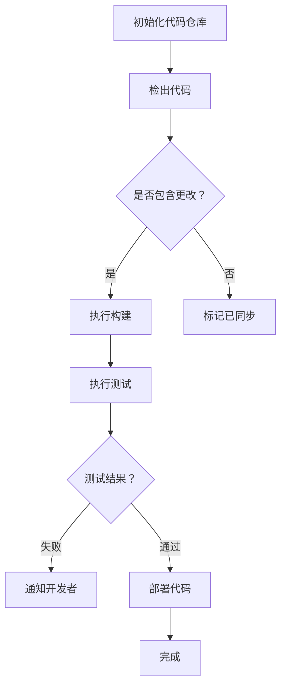

                 

关键词：Jenkins，持续集成，Pipeline，DevOps，自动化，代码质量，敏捷开发

> 摘要：本文将深入探讨Jenkins持续集成Pipeline的设计与应用，从背景介绍、核心概念、算法原理、数学模型、项目实践、实际应用场景等多个角度，全面解析Jenkins持续集成Pipeline的实现方法、优缺点以及未来发展趋势，旨在为读者提供一份全面、深入的Jenkins持续集成Pipeline设计指南。

## 1. 背景介绍

随着软件行业的快速发展，软件项目的规模和复杂度不断增大，传统的软件开发模式已经难以满足现代软件开发的快速迭代和持续交付需求。为了提高软件交付的效率和质量，持续集成（Continuous Integration，CI）和持续交付（Continuous Delivery，CD）成为了软件开发过程中不可或缺的一环。而Jenkins作为一款开源的持续集成工具，因其强大的功能、灵活的插件系统以及易用性，成为了DevOps实践中的首选工具。

持续集成Pipeline是Jenkins的核心功能之一，它通过自动化构建、测试和部署流程，实现代码的快速迭代和高质量交付。本文将围绕Jenkins持续集成Pipeline的设计与应用，从多个角度进行深入探讨。

## 2. 核心概念与联系

### 2.1 持续集成（CI）

持续集成是一种软件开发实践，通过频繁地将代码合并到主干分支，并对每次合并提交进行自动化构建和测试，以确保代码质量，降低集成风险。

### 2.2 Jenkins

Jenkins是一款开源的持续集成工具，支持多种软件开发流程，如自动化构建、测试、部署等。它拥有丰富的插件系统，可以通过配置实现各种自定义需求。

### 2.3 Pipeline

Jenkins Pipeline是一种Jenkins插件，提供了用于自动化部署、构建、测试等任务的声明式语言，支持在Jenkins中定义、运行和调度Pipeline。

### 2.4 Mermaid流程图

Mermaid是一种基于Markdown的图表绘制工具，可以方便地绘制各种流程图、UML图等。本文将使用Mermaid流程图来展示Jenkins持续集成Pipeline的架构和流程。

## 2.5 Mermaid流程图



## 3. 核心算法原理 & 具体操作步骤

### 3.1 算法原理概述

Jenkins持续集成Pipeline的核心算法原理是基于Git仓库的代码变更监控，当代码仓库发生变更时，自动触发构建、测试和部署流程。

### 3.2 算法步骤详解

1. 初始化代码仓库：将项目代码仓库初始化到本地。
2. 检出代码：从代码仓库检出最新代码。
3. 执行构建：根据项目配置，执行构建操作，生成可执行文件或包。
4. 执行测试：运行测试用例，确保代码质量。
5. 部署代码：将构建成功的代码部署到目标环境。

### 3.3 算法优缺点

**优点：**
1. 提高代码质量：通过自动化测试，降低集成风险，提高代码质量。
2. 提高交付效率：自动化构建、测试和部署，减少人工干预，提高交付效率。
3. 促进团队合作：团队成员可以实时查看代码状态，提高沟通效率。

**缺点：**
1. 需要一定的技术储备：配置和使用Jenkins持续集成Pipeline需要一定的技术背景。
2. 系统复杂度较高：涉及多个环节，如代码仓库、构建工具、测试工具、部署工具等，系统复杂度较高。

### 3.4 算法应用领域

Jenkins持续集成Pipeline广泛应用于软件开发领域，如Web应用、移动应用、大数据应用等。尤其在敏捷开发、DevOps实践中，Jenkins持续集成Pipeline发挥了重要作用。

## 4. 数学模型和公式 & 详细讲解 & 举例说明

### 4.1 数学模型构建

在Jenkins持续集成Pipeline中，我们可以使用概率论和图论来构建数学模型。

- 概率论：用于计算代码质量、构建成功率、测试覆盖率等指标的概率分布。
- 图论：用于描述构建、测试、部署等任务的依赖关系，构建任务调度图。

### 4.2 公式推导过程

1. 代码质量指标：  
   $$ Q = \frac{1}{n} \sum_{i=1}^{n} q_i $$  
   其中，$n$ 为测试用例数量，$q_i$ 为第 $i$ 个测试用例的代码质量评分。

2. 构建成功率：  
   $$ S = \frac{1}{n} \sum_{i=1}^{n} s_i $$  
   其中，$n$ 为构建次数，$s_i$ 为第 $i$ 次构建的成功率。

3. 测试覆盖率：  
   $$ C = \frac{1}{m} \sum_{i=1}^{m} c_i $$  
   其中，$m$ 为测试用例总数，$c_i$ 为第 $i$ 个测试用例的覆盖率。

### 4.3 案例分析与讲解

假设我们有一个Web应用项目，包含100个测试用例。在持续集成过程中，共执行了10次构建，其中8次成功，2次失败。每次构建包含5个测试用例，测试覆盖率平均为80%。

根据上述公式，我们可以计算出：
- 代码质量指标：$Q = 0.8$
- 构建成功率：$S = 0.8$
- 测试覆盖率：$C = 0.8$

通过这些指标，我们可以对项目的持续集成效果进行评估。

## 5. 项目实践：代码实例和详细解释说明

### 5.1 开发环境搭建

在开始搭建Jenkins持续集成环境之前，需要确保已经安装了Jenkins和Git。具体步骤如下：

1. 安装Jenkins：参考Jenkins官方文档，下载并安装Jenkins。
2. 安装Git：参考Git官方文档，下载并安装Git。
3. 启动Jenkins：运行Jenkins安装目录下的`jenkins.war`文件，启动Jenkins服务。

### 5.2 源代码详细实现

在Jenkins中创建一个新Pipeline项目，并添加以下代码：

```groovy
pipeline {
    agent any
    stages {
        stage('Checkout') {
            steps {
                git url: 'https://github.com/your_username/your_project.git', branch: 'main'
            }
        }
        stage('Build') {
            steps {
                sh 'mvn clean package'
            }
        }
        stage('Test') {
            steps {
                sh 'mvn test'
            }
        }
        stage('Deploy') {
            steps {
                sh 'mvn install'
            }
        }
    }
    post {
        always {
            archiveArtifacts artifacts: 'target/*.jar', fingerprint: true
        }
    }
}
```

### 5.3 代码解读与分析

上述代码定义了一个简单的Jenkins持续集成Pipeline，包含以下部分：

1. `agent any`：指定执行任务的工作节点。
2. `stages`：定义Pipeline的各个阶段。
3. `stage('Checkout')`：检出代码。
4. `stage('Build')`：执行构建操作。
5. `stage('Test')`：执行测试操作。
6. `stage('Deploy')`：部署代码。
7. `post`：Pipeline执行完毕后的操作，如归档Artifact。

通过这个示例，我们可以看到如何使用Jenkins Pipeline实现持续集成流程。

### 5.4 运行结果展示

执行Jenkins Pipeline后，我们可以查看Jenkins界面的运行日志，了解各个阶段的执行情况。如果构建成功，Jenkins会自动将生成的Artifact归档到指定的路径。

## 6. 实际应用场景

### 6.1 Web应用

在Web应用开发中，Jenkins持续集成Pipeline可以用于自动化构建、测试和部署，确保项目的高质量和快速迭代。

### 6.2 移动应用

对于移动应用项目，Jenkins持续集成Pipeline可以与CI/CD工具（如App Center、Fastlane等）集成，实现自动化打包、测试和发布。

### 6.3 大数据应用

在大数据应用项目中，Jenkins持续集成Pipeline可以用于自动化构建、测试和部署Hadoop、Spark等组件，提高开发效率和项目稳定性。

## 7. 工具和资源推荐

### 7.1 学习资源推荐

1. Jenkins官方文档：[https://www.jenkins.io/documentation/](https://www.jenkins.io/documentation/)
2. Jenkins Pipeline官方文档：[https://www.jenkins.io/doc/book/pipeline/](https://www.jenkins.io/doc/book/pipeline/)
3. DevOps中国：[https://www.devops.org/](https://www.devops.org/)

### 7.2 开发工具推荐

1. Git：[https://git-scm.com/](https://git-scm.com/)
2. Maven：[https://maven.apache.org/](https://maven.apache.org/)
3. Gradle：[https://gradle.org/](https://gradle.org/)

### 7.3 相关论文推荐

1. Martin Fowler的《持续集成实践》：[https://www.martinfowler.com/articles/ci.html](https://www.martinfowler.com/articles/ci.html)
2. Jez Humble和Dave Farley的《持续交付：发布可靠软件的系统方法》：[https://www.infoq.com/books/continuous-delivery/](https://www.infoq.com/books/continuous-delivery/)

## 8. 总结：未来发展趋势与挑战

### 8.1 研究成果总结

近年来，持续集成和持续交付在软件开发领域取得了显著的成果。Jenkins持续集成Pipeline因其强大的功能和易用性，成为了DevOps实践中的首选工具。通过本文的探讨，我们对Jenkins持续集成Pipeline的设计与应用有了更深入的了解。

### 8.2 未来发展趋势

1. AI与持续集成的结合：未来，AI技术将应用于持续集成，如自动化测试、代码审查等，提高持续集成效率。
2. 微服务与持续集成的融合：随着微服务架构的普及，持续集成将更加关注微服务项目的构建、测试和部署。
3. 更多的云原生支持：持续集成工具将更好地支持云原生应用，如Kubernetes、Docker等。

### 8.3 面临的挑战

1. 系统复杂度：持续集成系统涉及多个环节，如代码仓库、构建工具、测试工具、部署工具等，系统复杂度较高。
2. 安全性问题：持续集成系统需要保证代码的安全性和隐私性，防止敏感信息泄露。

### 8.4 研究展望

未来，持续集成和持续交付将继续发展，为软件开发带来更多便利。我们期待看到更多优秀的持续集成工具和解决方案的出现，推动软件开发进入新的阶段。

## 9. 附录：常见问题与解答

### 9.1 如何配置Jenkins插件？

在Jenkins管理界面，点击“管理Jenkins” -> “管理插件”，然后在插件管理页面中选择要安装的插件，点击“安装”按钮即可。

### 9.2 如何在Jenkins中配置多环境部署？

在Jenkins中，可以通过定义多阶段Pipeline来实现多环境部署。具体步骤如下：

1. 在Jenkins中创建一个新Pipeline项目。
2. 在Pipeline脚本中，使用`stages`定义各个阶段，如开发环境、测试环境、生产环境等。
3. 在每个环境中，根据需求执行相应的部署操作。

### 9.3 如何监控Jenkins持续集成Pipeline的执行状态？

在Jenkins管理界面，可以查看每个Pipeline项目的执行状态。同时，Jenkins提供了丰富的插件，如Jenkins Status插件，可以用于实时监控Jenkins服务的运行状态。

---

作者：禅与计算机程序设计艺术 / Zen and the Art of Computer Programming
----------------------------------------------------------------
本文为《禅与计算机程序设计艺术》系列文章之十一，旨在为读者提供一份全面、深入的Jenkins持续集成Pipeline设计指南。在后续文章中，我们将继续探讨更多关于软件开发的深度话题。敬请期待！

