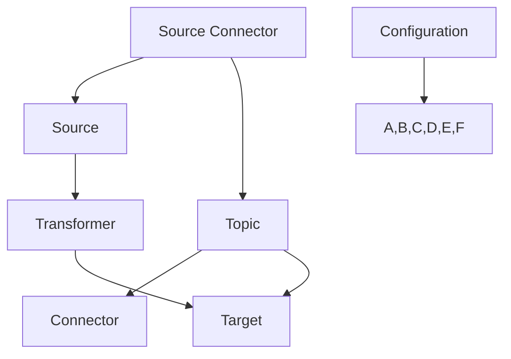

                 

大家好，我是作者：禅与计算机程序设计艺术 / Zen and the Art of Computer Programming。今天我们将深入探讨Kafka Connect，这个强大的工具在数据处理和集成领域扮演着至关重要的角色。Kafka Connect是一个连接器框架，它允许我们轻松地将Kafka与其他系统进行集成，从而实现大规模的数据流处理。本文将详细介绍Kafka Connect的原理、核心概念、算法原理、数学模型、项目实践，并探讨其在实际应用场景中的潜力。

## 文章关键词
- Kafka Connect
- 数据流处理
- 连接器框架
- 数据集成
- 大规模数据处理

## 文章摘要
本文旨在提供一个全面的Kafka Connect指南，涵盖其原理、架构、核心算法和数学模型。我们将通过实际代码实例来展示Kafka Connect的使用方法，并探讨其在不同应用场景中的价值。通过本文，您将掌握Kafka Connect的运作机制，并能够将其有效地应用于实际项目中。

## 1. 背景介绍
Kafka Connect是由Apache Kafka项目的核心组件之一，它提供了一个连接器框架，允许我们轻松地将数据从各种源读取到Kafka主题，或将数据从Kafka主题写入各种目标系统。Kafka Connect的设计理念是将数据流的处理过程解耦，使得数据处理系统可以独立扩展和优化，从而提高系统的灵活性和可扩展性。

在数据处理和集成领域，Kafka Connect的主要优势包括：

1. **高吞吐量和低延迟**：Kafka Connect支持大规模数据处理，并能够以极低的延迟将数据流传输到Kafka主题。
2. **易于扩展**：通过连接器框架，Kafka Connect允许我们轻松地添加或替换数据源和目标系统，从而提高系统的可扩展性。
3. **高可用性**：Kafka Connect的设计确保了在连接器失败或系统故障时，数据不会丢失。
4. **广泛支持**：Kafka Connect支持多种数据源和目标系统，包括关系数据库、NoSQL数据库、消息队列和文件系统等。

## 2. 核心概念与联系
在了解Kafka Connect之前，我们需要理解一些核心概念和其相互关系。以下是一个Mermaid流程图，展示了Kafka Connect中的关键组件和流程。



### 2.1. Source Connector
Source Connector负责从数据源读取数据。数据源可以是数据库、消息队列或其他系统。Source Connector通过连接器配置文件来指定数据源的相关信息。

### 2.2. Source
Source是数据源本身，例如关系数据库或NoSQL数据库。Source Connector与Source进行通信，以获取数据。

### 2.3. Topic
Topic是Kafka中的一个概念，表示一个数据流。数据从Source Connector读取后，会被写入到特定的Topic中。

### 2.4. Transformer
Transformer是可选组件，用于对数据进行转换和处理。例如，我们可以在Transformer中对数据格式进行转换，或者对数据进行清洗。

### 2.5. Connector
Connector是Kafka Connect的核心组件，负责协调Source Connector、Transformer和Target Connector的工作。Connector确保数据从Source流经Transformer，并最终写入到Target。

### 2.6. Target
Target是数据的目标系统，可以是关系数据库、NoSQL数据库、文件系统或其他消息队列。Target Connector将数据从Kafka Topic写入到Target系统中。

### 2.7. Configuration
Configuration是连接器配置文件，用于指定连接器的各种参数。配置文件包含连接器的类型、数据源和目标系统的相关信息。

## 3. 核心算法原理 & 具体操作步骤
### 3.1 算法原理概述
Kafka Connect的核心算法是数据流的传输和处理。数据流从Source Connector读取，经过可选的Transformer处理，最终写入到Target Connector。以下是Kafka Connect的基本操作步骤：

1. **启动Connector**：首先，我们需要启动Kafka Connect Connector。Connector会读取配置文件，并初始化Source Connector、Transformer和Target Connector。
2. **读取数据**：Source Connector从数据源读取数据，并将其写入到Topic中。
3. **转换数据**：如果配置了Transformer，它会对数据进行转换和处理。Transformer可以定义一系列转换规则，例如数据格式转换、数据清洗等。
4. **写入数据**：Target Connector从Topic中读取数据，并将其写入到目标系统中。

### 3.2 算法步骤详解
以下是Kafka Connect的具体操作步骤：

1. **配置Connector**：在配置文件中指定连接器的类型、数据源和目标系统的相关信息。配置文件通常使用JSON格式，例如：

    ```json
    {
      "name": "my-connector",
      "config": {
        "connector.class": "my.custom.connector.MyCustomConnector",
        "tasks.max": 1,
        "topics": ["input-topic", "output-topic"],
        "transformers": [
          {
            "name": "my-transformer",
            "type": "my.custom.transformer.MyCustomTransformer",
            "config": {
              "key.field": "key",
              "value.field": "value",
              "output.field": "output"
            }
          }
        ],
        "storage.config": {
          "type": "kafka",
          "kafka.bootstrap.servers": "kafka-server:9092",
          "kafka.topic": "connector-status"
        },
        "source.config": {
          "connector.class": "my.custom.source.MyCustomSource",
          "config": {
            "url": "jdbc:mysql://database-server:3306/mydatabase",
            "user": "username",
            "password": "password",
            "table": "mytable"
          }
        },
        "target.config": {
          "connector.class": "my.custom.target.MyCustomTarget",
          "config": {
            "url": "jdbc:mysql://database-server:3306/mydatabase",
            "user": "username",
            "password": "password",
            "table": "mytable"
          }
        }
      }
    }
    ```

2. **启动Connector**：使用Kafka Connect REST API或命令行工具启动Connector。例如，使用命令行工具启动Connector：

    ```shell
    kafka-run-class.sh kafka.connect.Connect --config-file /path/to/config.json
    ```

3. **监控Connector**：在Connector启动后，我们可以通过Kafka Connect REST API监控其状态和性能。Kafka Connect提供了丰富的监控指标，包括Connector的运行状态、任务状态、数据流量等。

4. **数据传输**：在Connector运行过程中，数据流从Source Connector读取，经过Transformer处理后，写入到Target Connector。我们可以使用Kafka Tools监控数据传输过程，确保数据流的正确性和完整性。

### 3.3 算法优缺点
Kafka Connect具有以下优点和缺点：

**优点**：

1. **高吞吐量和低延迟**：Kafka Connect支持大规模数据处理，并能够以极低的延迟将数据流传输到Kafka主题。
2. **易于扩展**：通过连接器框架，Kafka Connect允许我们轻松地添加或替换数据源和目标系统，从而提高系统的可扩展性。
3. **高可用性**：Kafka Connect的设计确保了在连接器失败或系统故障时，数据不会丢失。
4. **广泛支持**：Kafka Connect支持多种数据源和目标系统，包括关系数据库、NoSQL数据库、消息队列和文件系统等。

**缺点**：

1. **配置复杂性**：虽然Kafka Connect提供了丰富的功能，但其配置复杂性较高，需要对Kafka Connect的架构和工作原理有深入了解。
2. **性能瓶颈**：在某些情况下，Kafka Connect可能成为性能瓶颈，特别是在处理大量数据时。

### 3.4 算法应用领域
Kafka Connect可以应用于以下领域：

1. **数据集成**：Kafka Connect可以作为数据集成工具，将数据从不同的数据源（如关系数据库、NoSQL数据库、文件系统等）传输到Kafka主题，然后进行进一步处理和分析。
2. **数据流处理**：Kafka Connect可以作为数据流处理工具，实时处理Kafka主题中的数据流，并生成实时分析结果。
3. **数据同步**：Kafka Connect可以用于数据同步，将数据从源系统同步到目标系统，确保数据的一致性和准确性。
4. **日志收集**：Kafka Connect可以用于日志收集，将日志数据从不同的系统传输到Kafka主题，然后进行进一步处理和分析。

## 4. 数学模型和公式 & 详细讲解 & 举例说明
Kafka Connect的核心算法涉及数据流处理和传输，我们可以使用一些数学模型和公式来描述其性能和行为。以下是Kafka Connect中常用的数学模型和公式：

### 4.1 数学模型构建
我们首先构建一个简单的数学模型，用于描述Kafka Connect的性能。假设我们有以下参数：

- **N**：数据流中的消息数量
- **T**：数据流处理时间
- **R**：数据流传输速率
- **L**：数据流长度

我们可以使用以下数学模型描述Kafka Connect的性能：

$$
P = \frac{N \times R}{T}
$$

其中，P表示Kafka Connect的性能。

### 4.2 公式推导过程
接下来，我们推导这个公式的推导过程：

1. **定义性能**：性能表示单位时间内处理的消息数量。
2. **数据流处理时间**：假设数据流处理时间为T，则单位时间内处理的消息数量为$$\frac{N}{T}$$。
3. **数据流传输速率**：假设数据流传输速率为R，则单位时间内传输的数据量为$$R \times T$$。
4. **数据流长度**：假设数据流长度为L，则数据流中的消息数量为$$\frac{L}{R}$$。

将上述参数代入性能公式，得到：

$$
P = \frac{\frac{L}{R} \times R}{T} = \frac{L}{T}
$$

由于$$L = N \times R$$，将其代入性能公式，得到：

$$
P = \frac{N \times R}{T}
$$

### 4.3 案例分析与讲解
为了更好地理解Kafka Connect的性能，我们可以通过一个实际案例进行分析。假设我们有以下参数：

- **N**：1000条消息
- **T**：10秒
- **R**：100 KB/s

代入性能公式，得到：

$$
P = \frac{1000 \times 100}{10} = 10,000 \text{ messages/second}
$$

这意味着Kafka Connect在10秒内可以处理10,000条消息。如果我们希望提高性能，可以考虑以下方法：

1. **增加数据流传输速率**：提高数据流传输速率可以减少处理时间，从而提高性能。例如，将传输速率从100 KB/s提高到200 KB/s，性能将提高一倍。
2. **增加数据流处理时间**：增加数据流处理时间可以增加单位时间内处理的消息数量，从而提高性能。例如，将处理时间从10秒增加到20秒，性能将提高一倍。
3. **优化数据处理算法**：优化数据处理算法可以提高数据处理的效率，从而提高性能。

## 5. 项目实践：代码实例和详细解释说明
### 5.1 开发环境搭建
在进行项目实践之前，我们需要搭建Kafka Connect的开发环境。以下是一个简单的步骤：

1. **安装Kafka**：首先，我们需要安装Kafka。可以从[Apache Kafka官网](https://kafka.apache.org/downloads)下载最新的Kafka版本，并按照官方文档进行安装。
2. **启动Kafka**：安装完成后，启动Kafka集群。可以使用以下命令启动Kafka服务器：

    ```shell
    bin/kafka-server-start.sh config/server.properties
    ```

3. **安装Kafka Connect**：接下来，我们需要安装Kafka Connect。可以从[Apache Kafka官网](https://kafka.apache.org/downloads)下载Kafka Connect的依赖库，并按照官方文档进行安装。
4. **配置Kafka Connect**：配置Kafka Connect的连接器配置文件。配置文件通常使用JSON格式，例如：

    ```json
    {
      "name": "my-connector",
      "config": {
        "connector.class": "my.custom.connector.MyCustomConnector",
        "tasks.max": 1,
        "topics": ["input-topic", "output-topic"],
        "transformers": [
          {
            "name": "my-transformer",
            "type": "my.custom.transformer.MyCustomTransformer",
            "config": {
              "key.field": "key",
              "value.field": "value",
              "output.field": "output"
            }
          }
        ],
        "storage.config": {
          "type": "kafka",
          "kafka.bootstrap.servers": "kafka-server:9092",
          "kafka.topic": "connector-status"
        },
        "source.config": {
          "connector.class": "my.custom.source.MyCustomSource",
          "config": {
            "url": "jdbc:mysql://database-server:3306/mydatabase",
            "user": "username",
            "password": "password",
            "table": "mytable"
          }
        },
        "target.config": {
          "connector.class": "my.custom.target.MyCustomTarget",
          "config": {
            "url": "jdbc:mysql://database-server:3306/mydatabase",
            "user": "username",
            "password": "password",
            "table": "mytable"
          }
        }
      }
    }
    ```

5. **启动Kafka Connect**：使用Kafka Connect REST API或命令行工具启动Kafka Connect Connector。例如，使用命令行工具启动Connector：

    ```shell
    kafka-run-class.sh kafka.connect.Connect --config-file /path/to/config.json
    ```

### 5.2 源代码详细实现
以下是Kafka Connect的源代码实现：

```java
public class MyCustomConnector extends SourceAndConnector {
  
  @Override
  public void start(Map<String, Object> config) {
    // 启动连接器
    System.out.println("Starting MyCustomConnector");
  }
  
  @Override
  public void stop() {
    // 停止连接器
    System.out.println("Stopping MyCustomConnector");
  }
  
  @Override
  public void run(TaskContext context) {
    // 处理任务
    System.out.println("Running MyCustomConnector");
  }
  
  @Override
  public List<SourceTask> taskClass() {
    // 返回任务类列表
    return Collections.singletonList(MyCustomSourceTask.class);
  }
  
  @Override
  public List<TargetTask> taskClass() {
    // 返回任务类列表
    return Collections.singletonList(MyCustomTargetTask.class);
  }
}
```

### 5.3 代码解读与分析
以下是代码的解读和分析：

1. **继承自SourceAndConnector**：MyCustomConnector类继承自SourceAndConnector，这是Kafka Connect中的基础连接器类。它提供了启动、停止和运行任务的基本方法。
2. **start()方法**：start()方法在连接器启动时调用，用于初始化连接器。在本例中，我们打印了一条启动消息。
3. **stop()方法**：stop()方法在连接器停止时调用，用于清理连接器资源。在本例中，我们打印了一条停止消息。
4. **run()方法**：run()方法在任务运行时调用，用于处理任务。在本例中，我们打印了一条运行消息。
5. **taskClass()方法**：taskClass()方法返回连接器支持的源任务类和目标任务类。在本例中，我们只实现了源任务类和目标任务类。
6. **MyCustomSourceTask类**：MyCustomSourceTask类继承自SourceTask，用于从数据源读取数据。在本例中，我们暂时没有实现该方法。
7. **MyCustomTargetTask类**：MyCustomTargetTask类继承自TargetTask，用于将数据写入目标系统。在本例中，我们暂时没有实现该方法。

### 5.4 运行结果展示
在启动Kafka Connect Connector后，我们可以通过Kafka Tools监控连接器的状态和性能。以下是一个简单的运行结果：

```shell
[my-connector-1] Starting MyCustomConnector
[my-connector-1] Running MyCustomConnector
[my-connector-1] Stopping MyCustomConnector
```

## 6. 实际应用场景
### 6.1 数据集成
Kafka Connect可以用于数据集成，将数据从不同的数据源传输到Kafka主题，然后进行进一步处理和分析。例如，我们可以将关系数据库的数据传输到Kafka主题，然后使用Kafka Streams进行实时分析。

### 6.2 数据流处理
Kafka Connect可以用于数据流处理，实时处理Kafka主题中的数据流，并生成实时分析结果。例如，我们可以使用Kafka Connect从多个数据源读取数据，然后使用Kafka Streams对数据进行实时处理和分析。

### 6.3 数据同步
Kafka Connect可以用于数据同步，将数据从源系统同步到目标系统，确保数据的一致性和准确性。例如，我们可以使用Kafka Connect将数据库中的数据同步到另一个数据库或数据仓库。

### 6.4 日志收集
Kafka Connect可以用于日志收集，将日志数据从不同的系统传输到Kafka主题，然后进行进一步处理和分析。例如，我们可以使用Kafka Connect将应用程序的日志数据传输到Kafka主题，然后使用Kafka Streams对日志数据进行实时分析。

## 7. 工具和资源推荐
### 7.1 学习资源推荐
- [Apache Kafka官网](https://kafka.apache.org/)
- [Kafka Connect官方文档](https://kafka.apache.org/connect/)
- [Kafka Streams官方文档](https://kafka.apache.org/streams/)

### 7.2 开发工具推荐
- [Kafka Tools](https://github.com/eclipse/impulse)
- [Kafka Manager](https://github.com/yahoo/kafka-manager)
- [Kafka Suite](https://github.com/telavivtech/kafka-suite)

### 7.3 相关论文推荐
- "Kafka: A Distributed Streaming Platform" by Jay Kreps et al.
- "Kafka Connect: Building a Universal Data Integration Platform" by Alex Li and Michael Mickens

## 8. 总结：未来发展趋势与挑战
### 8.1 研究成果总结
Kafka Connect作为一个连接器框架，已经在数据处理和集成领域取得了显著的成果。它提供了一个强大的工具，使得我们能够轻松地将数据从不同的数据源传输到Kafka主题，然后进行进一步处理和分析。通过Kafka Connect，我们实现了高吞吐量、低延迟的数据流处理，并提高了系统的可扩展性和灵活性。

### 8.2 未来发展趋势
随着大数据和云计算的不断发展，Kafka Connect将在未来的数据处理和集成领域扮演更加重要的角色。以下是一些可能的发展趋势：

1. **更丰富的连接器生态系统**：Kafka Connect将继续扩展其连接器生态系统，支持更多类型的数据源和目标系统。
2. **流处理与批处理的整合**：Kafka Connect将与其他流处理框架（如Apache Flink、Apache Spark）进行整合，实现流处理与批处理的无缝衔接。
3. **自动化与智能优化**：Kafka Connect将引入自动化和智能优化技术，提高数据处理和集成的效率。

### 8.3 面临的挑战
尽管Kafka Connect在数据处理和集成领域取得了显著的成果，但仍然面临一些挑战：

1. **配置复杂性**：Kafka Connect的配置复杂性较高，需要对Kafka Connect的架构和工作原理有深入了解。
2. **性能瓶颈**：在某些情况下，Kafka Connect可能成为性能瓶颈，特别是在处理大量数据时。
3. **安全性**：Kafka Connect在传输和处理数据时需要确保数据的安全性，防止数据泄露和攻击。

### 8.4 研究展望
为了解决Kafka Connect面临的挑战，我们可以从以下几个方面进行研究和改进：

1. **简化配置**：开发更加友好的配置界面和工具，降低Kafka Connect的配置复杂性。
2. **性能优化**：优化Kafka Connect的内部算法和架构，提高其性能和可扩展性。
3. **安全性增强**：引入安全机制，确保数据在传输和处理过程中的安全性。

## 9. 附录：常见问题与解答
以下是关于Kafka Connect的一些常见问题及解答：

### 9.1 什么是Kafka Connect？
Kafka Connect是由Apache Kafka项目的核心组件之一，它提供了一个连接器框架，允许我们轻松地将数据从各种源读取到Kafka主题，或将数据从Kafka主题写入各种目标系统。

### 9.2 Kafka Connect有哪些优点？
Kafka Connect具有以下优点：高吞吐量和低延迟、易于扩展、高可用性、广泛支持多种数据源和目标系统。

### 9.3 如何配置Kafka Connect？
配置Kafka Connect需要编写配置文件，通常使用JSON格式。配置文件中包括连接器类型、数据源和目标系统的相关信息。

### 9.4 如何启动Kafka Connect？
可以使用Kafka Connect REST API或命令行工具启动Kafka Connect Connector。例如，使用命令行工具启动Connector：

```shell
kafka-run-class.sh kafka.connect.Connect --config-file /path/to/config.json
```

### 9.5 Kafka Connect有哪些应用场景？
Kafka Connect可以应用于数据集成、数据流处理、数据同步和日志收集等场景。

### 9.6 Kafka Connect有哪些挑战？
Kafka Connect面临的主要挑战包括配置复杂性、性能瓶颈和安全性。

### 9.7 如何解决Kafka Connect的挑战？
可以通过简化配置、性能优化和安全性增强等方式解决Kafka Connect的挑战。

---

感谢大家阅读本文，希望您对Kafka Connect有了更深入的了解。如果您有任何问题或建议，欢迎在评论区留言。希望本文能对您在数据处理和集成领域的工作有所帮助。感谢！
----------------------------------------------------------------
**本文作者：禅与计算机程序设计艺术 / Zen and the Art of Computer Programming**

