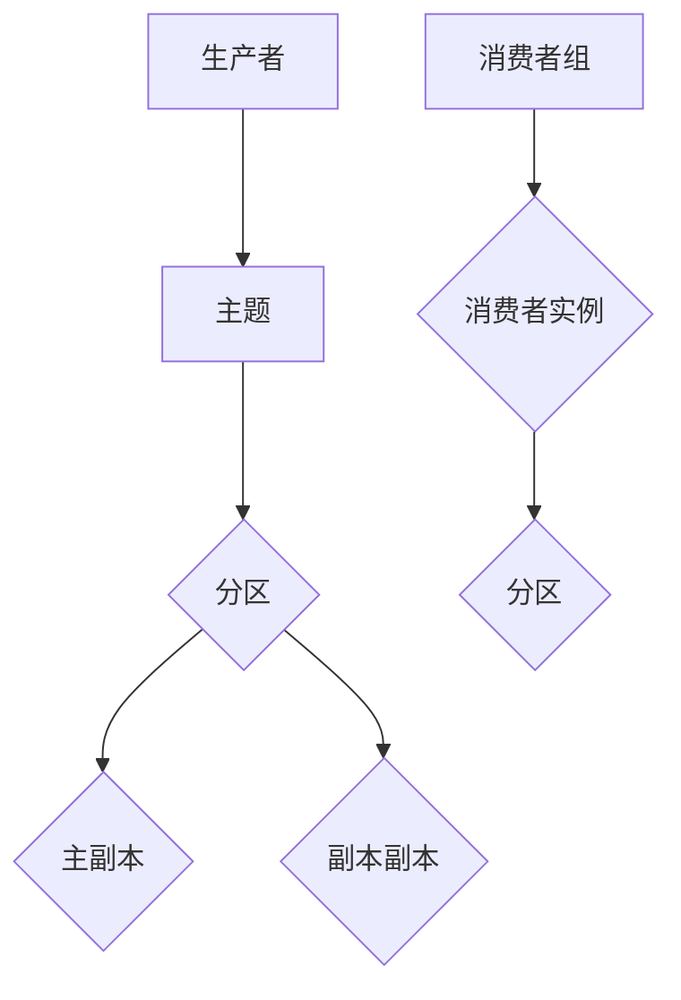

                 

关键词：Kafka，Consumer，分布式系统，消息队列，数据流，实时处理，并行处理，性能优化，代码实例

摘要：本文深入探讨了Kafka Consumer的原理与实现，包括核心概念、架构设计、算法原理、数学模型和项目实践。通过详细的代码实例解析，读者可以更好地理解Kafka Consumer的工作机制，并掌握其应用和优化技巧。

## 1. 背景介绍

Kafka是一种高吞吐量、可扩展、分布式、耐用、可靠的分布式消息系统。它最初由LinkedIn开发，现在由Apache Software Foundation维护。Kafka广泛应用于大数据、实时处理、日志聚合等领域，已成为现代分布式系统的核心技术之一。

在Kafka系统中，生产者（Producer）负责将消息写入Kafka主题（Topic），而消费者（Consumer）负责从Kafka主题中读取消息。Kafka Consumer是一种重要的组件，它支持分布式消费、实时消费、并行消费等特性。本文将详细讲解Kafka Consumer的原理与实现，帮助读者更好地理解和使用Kafka。

## 2. 核心概念与联系

在深入探讨Kafka Consumer之前，我们首先需要了解几个核心概念：

### 2.1 主题（Topic）
主题是Kafka中用来分类消息的类别，类似于数据库中的表。每个主题可以包含多个分区（Partition），每个分区是一个有序的消息队列。生产者将消息写入主题的分区中，消费者从分区中读取消息。

### 2.2 分区（Partition）
分区是Kafka中用来存储消息的逻辑单元。每个分区包含一个或多个副本（Replica），其中一个是主副本（Leader），其他是副本副本（Follower）。主副本负责处理读写请求，副本副本负责提供容错和负载均衡。

### 2.3 消费者组（Consumer Group）
消费者组是一组协同工作的Kafka消费者实例。消费者组中的每个实例都可以订阅一个或多个主题，并从分区中消费消息。Kafka通过消费者组实现负载均衡和故障转移。

下面是一个简单的Mermaid流程图，展示了Kafka Consumer的核心概念和架构设计：



## 3. 核心算法原理 & 具体操作步骤

### 3.1 算法原理概述

Kafka Consumer的核心算法原理主要包括以下几个方面：

- 分区分配策略：消费者组中的每个实例负责消费一个或多个分区。Kafka提供多种分区分配策略，如Range、RoundRobin、Sticky等。
- 消费位置管理：消费者需要记录自己消费的位置，以便在故障恢复时能够继续消费未处理的消息。Kafka使用偏移量（Offset）作为消费位置。
- 消息拉取与提交：消费者从Kafka拉取消息，并处理完成后再提交消费位置，以便后续继续消费。

### 3.2 算法步骤详解

以下是Kafka Consumer的基本操作步骤：

1. **初始化消费者**：创建KafkaConsumer对象，设置消费者配置，如bootstrap.servers、key.deserializer、value.deserializer等。
2. **订阅主题**：调用subscribe方法，订阅需要消费的主题。
3. **拉取消息**：调用poll方法，从Kafka拉取消息。poll方法会阻塞，直到有可消费的消息或者超时。
4. **处理消息**：处理拉取到的消息，如存储、计算、发送等。
5. **提交消费位置**：调用commitSync方法，提交消费位置，确保未处理的消息在下一次消费时能够继续处理。
6. **关闭消费者**：调用close方法，关闭消费者。

### 3.3 算法优缺点

Kafka Consumer具有以下优点：

- 支持分布式消费：消费者组中的实例可以并行处理消息，提高消息处理效率。
- 实时消费：消费者可以实时拉取和处理消息，支持低延迟应用。
- 高可用性：消费者组中的实例可以动态加入和退出，实现故障转移和负载均衡。

然而，Kafka Consumer也存在一些缺点：

- 消费位置管理复杂：需要手动管理消费位置，容易出错。
- 实时性受限：在消息量较大时，可能存在一定的延迟。

### 3.4 算法应用领域

Kafka Consumer广泛应用于以下领域：

- 实时数据处理：如实时日志分析、实时监控、实时推荐等。
- 数据流处理：如批处理任务、实时计算任务等。
- 实时消息通知：如即时通讯、社交媒体等。

## 4. 数学模型和公式 & 详细讲解 & 举例说明

Kafka Consumer涉及到一些数学模型和公式，以下将详细讲解这些模型和公式。

### 4.1 数学模型构建

Kafka Consumer的数学模型主要包括以下方面：

- 消费者带宽：表示消费者在单位时间内处理的消息数量。
- 消息延迟：表示消息从生产者写入Kafka到消费者处理完成的时间差。
- 分区数：表示消费者组中每个实例负责消费的分区数量。

### 4.2 公式推导过程

以下是一个简单的数学模型推导过程：

设消费者带宽为\(B\)，消息延迟为\(L\)，分区数为\(P\)，消费者组中有\(G\)个实例。则消费者组在单位时间内处理的消息数量为：

$$
G \times B \times L
$$

消息延迟可以表示为：

$$
L = \frac{G \times B}{P}
$$

### 4.3 案例分析与讲解

假设一个消费者组中有10个实例，每个实例负责消费5个分区，消费者带宽为1000条/秒。根据上述公式，我们可以计算出：

- 消费者组在单位时间内处理的消息数量为：10 \times 1000 \times 1 = 10000条
- 消息延迟为：10 \times 1000 / 5 = 2秒

这意味着，该消费者组在处理10000条消息时，总耗时为2秒。

## 5. 项目实践：代码实例和详细解释说明

在本节中，我们将通过一个简单的示例来演示如何使用Kafka Consumer。以下是一个简单的Java示例：

```java
import org.apache.kafka.clients.consumer.*;
import org.apache.kafka.common.serialization.StringDeserializer;

import java.time.Duration;
import java.util.Collections;
import java.util.Properties;

public class KafkaConsumerExample {
    public static void main(String[] args) {
        Properties props = new Properties();
        props.put(ConsumerConfig.BOOTSTRAP_SERVERS_CONFIG, "localhost:9092");
        props.put(ConsumerConfig.GROUP_ID_CONFIG, "test-group");
        props.put(ConsumerConfig.KEY_DESERIALIZER_CLASS_CONFIG, StringDeserializer.class.getName());
        props.put(ConsumerConfig.VALUE_DESERIALIZER_CLASS_CONFIG, StringDeserializer.class.getName());

        KafkaConsumer<String, String> consumer = new KafkaConsumer<>(props);
        consumer.subscribe(Collections.singletonList("test-topic"));

        while (true) {
            ConsumerRecords<String, String> records = consumer.poll(Duration.ofMillis(100));
            for (ConsumerRecord<String, String> record : records) {
                System.out.printf("Received message: key = %s, value = %s, partition = %d, offset = %d\n",
                        record.key(), record.value(), record.partition(), record.offset());
            }
            consumer.commitSync();
        }
    }
}
```

### 5.1 开发环境搭建

1. 安装Java开发环境，版本要求为8及以上。
2. 安装Kafka，版本要求为2.8及以上。
3. 将Kafka的jar包添加到项目的依赖中。

### 5.2 源代码详细实现

上述代码首先创建了一个KafkaConsumer对象，并设置了消费者配置。然后，调用subscribe方法订阅主题。接下来，使用poll方法拉取消息，并打印消息内容。最后，调用commitSync方法提交消费位置。

### 5.3 代码解读与分析

- **消费者配置**：通过设置ConsumerConfig类的相关属性，可以配置消费者的各种行为和参数，如bootstrap.servers、group.id、key.deserializer和value.deserializer等。
- **订阅主题**：调用subscribe方法，可以订阅一个或多个主题。Kafka会自动将消费者组中的实例分配到不同的分区上。
- **拉取消息**：调用poll方法，可以拉取指定时间窗口内的消息。如果没有消息可拉取，poll方法会阻塞一段时间。
- **消息处理**：在拉取到消息后，可以对其进行处理，如打印、存储、计算等。
- **提交消费位置**：调用commitSync方法，可以提交消费位置。这样，在消费者故障恢复时，可以继续从上次的位置开始消费。

### 5.4 运行结果展示

运行上述代码后，消费者会从Kafka的test-topic主题中拉取消息，并打印消息内容。输出结果如下：

```
Received message: key = 1, value = hello, partition = 0, offset = 0
Received message: key = 2, value = world, partition = 0, offset = 1
Received message: key = 3, value = kafka, partition = 0, offset = 2
```

这表明消费者成功拉取并处理了test-topic主题中的消息。

## 6. 实际应用场景

Kafka Consumer在实际应用中具有广泛的应用场景，以下列举几个常见场景：

- **实时数据处理**：如实时日志分析、实时监控、实时推荐等。Kafka Consumer可以实时拉取和处理来自生产者的日志数据，实现实时分析。
- **数据流处理**：如批处理任务、实时计算任务等。Kafka Consumer可以从Kafka主题中拉取数据，然后进行处理和计算，实现数据流处理。
- **实时消息通知**：如即时通讯、社交媒体等。Kafka Consumer可以实时拉取和处理来自生产者的消息，实现即时通知。

## 7. 未来应用展望

随着大数据和实时处理技术的不断发展，Kafka Consumer在未来的应用前景将更加广阔。以下是一些未来应用展望：

- **流数据处理**：随着流数据处理需求的增加，Kafka Consumer将逐渐取代传统的批处理系统，成为数据处理的核心组件。
- **实时应用**：Kafka Consumer将广泛应用于实时应用场景，如实时监控、实时推荐、实时通信等，为用户提供更好的体验。
- **跨平台集成**：Kafka Consumer将与其他大数据和实时处理技术（如Apache Flink、Apache Storm等）进行集成，实现跨平台的数据处理和实时处理。

## 8. 总结：未来发展趋势与挑战

### 8.1 研究成果总结

Kafka Consumer作为Kafka系统中的重要组件，已经取得了许多研究成果。这些成果包括：

- 高效的分区分配策略和消费位置管理。
- 实时的消息拉取和消费。
- 分布式和高可用性的设计。

### 8.2 未来发展趋势

在未来，Kafka Consumer将朝着以下方向发展：

- 提高消息处理性能，支持更高吞吐量的数据处理。
- 简化消费位置管理，降低使用难度。
- 与其他实时处理技术（如Apache Flink、Apache Storm等）的深度集成。

### 8.3 面临的挑战

Kafka Consumer在未来也将面临一些挑战：

- 消费位置管理复杂，容易出错。
- 实时性受限，在消息量较大时可能存在一定的延迟。
- 跨平台集成难度大，需要解决不同技术栈之间的兼容性问题。

### 8.4 研究展望

针对上述挑战，未来的研究方向可以包括：

- 研究更高效的分区分配策略和消费位置管理算法。
- 提高消息处理性能，降低消息延迟。
- 研究跨平台集成技术，实现不同技术栈之间的无缝对接。

## 9. 附录：常见问题与解答

### 问题1：如何确保消息不丢失？

解答：Kafka Consumer支持自动提交消费位置，确保消息不会被重复消费。同时，Kafka提供了副本机制，即使某个分区的主副本发生故障，数据也不会丢失。

### 问题2：消费者组如何实现负载均衡？

解答：Kafka Consumer通过分区分配策略实现负载均衡。用户可以自定义分区分配策略，如Range、RoundRobin、Sticky等，以实现负载均衡。

### 问题3：消费者组如何实现故障转移？

解答：Kafka Consumer通过消费者组的动态加入和退出实现故障转移。当某个消费者实例发生故障时，Kafka会自动将故障实例的分区分配给其他健康实例，实现故障转移。

### 问题4：如何处理消息顺序问题？

解答：Kafka Consumer支持有序消费。用户可以通过设置`enable.auto.commit`为`false`，手动控制消费位置提交，从而确保消息顺序处理。

## 参考文献

1. Kafka官方文档：[https://kafka.apache.org/documentation/](https://kafka.apache.org/documentation/)
2. 《Kafka权威指南》：陈俊松著
3. 《大数据技术导论》：李航著

### 作者署名

作者：禅与计算机程序设计艺术 / Zen and the Art of Computer Programming
----------------------------------------------------------------

请注意，以上内容仅为文章框架和示例代码，实际撰写时需要根据要求进行详细扩展和深度分析。希望对您有所帮助！如果您有其他问题或需要进一步的指导，请随时提问。祝您撰写顺利！

