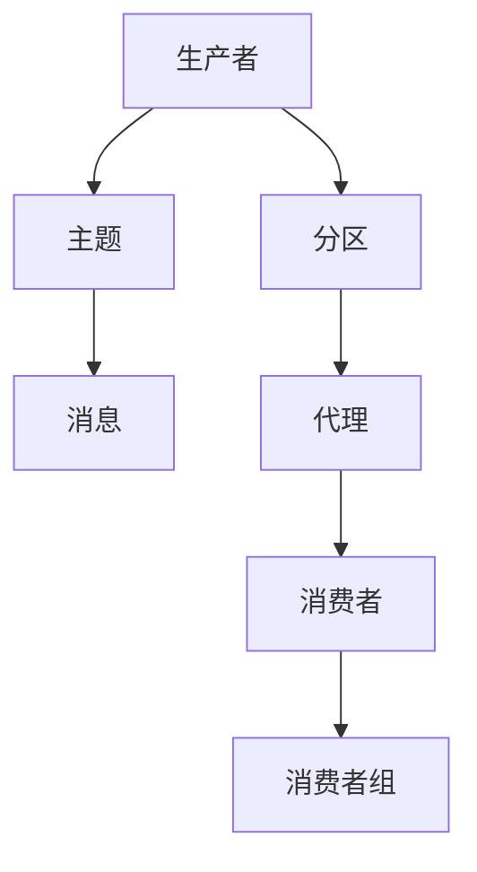

                 

 

## 1. 背景介绍

Kafka是由LinkedIn开发的一个开源流处理平台，用于构建实时数据流、处理和存储系统。Kafka广泛应用于各种领域，包括数据收集、日志聚合、实时分析和大数据处理。Kafka的生产者和消费者API是其核心组件之一，它们分别用于向Kafka写入数据和从Kafka读取数据。

生产者API负责将消息发送到Kafka的主题中。生产者可以异步发送消息，从而实现高性能和可扩展性。消费者API用于从Kafka的主题中读取消息，并且可以并行处理多个主题。消费者可以订阅多个主题，实现实时数据的处理和分析。

本文将详细介绍Kafka生产者和消费者API的原理，并给出具体的代码实例，帮助读者更好地理解和应用这两个核心组件。

## 2. 核心概念与联系

### 2.1 Kafka架构

Kafka采用分布式架构，由多个组件组成，包括生产者（Producer）、主题（Topic）、分区（Partition）、消费者（Consumer）和代理（Broker）。以下是Kafka的基本架构及其核心概念：

- **生产者**：负责向Kafka写入消息。
- **主题**：消息的分类单位，可以理解为数据库中的表。
- **分区**：每个主题被分割成多个分区，分区可以提高数据的并发写入和读取能力。
- **消费者**：负责从Kafka读取消息。
- **代理**：Kafka集群中的节点，负责存储主题和分区的数据，并提供生产者和消费者的访问接口。

### 2.2 生产者API

生产者API提供了将消息发送到Kafka主题的接口。以下是生产者API的核心概念：

- **消息**：生产者发送的数据单元，通常是一个字节序列。
- **主题**：消息的分类单位，每个消息必须指定要发送到的主题。
- **分区**：生产者可以选择将消息发送到特定的分区，也可以让Kafka自动分配分区。
- **应答模式**：生产者可以选择不同的应答模式，如同步应答、异步应答和批量异步应答。

### 2.3 消费者API

消费者API提供了从Kafka主题中读取消息的接口。以下是消费者API的核心概念：

- **消费者组**：一组协同工作的消费者，可以分布式处理多个主题。
- **偏移量**：消费者读取消息的位置，每个主题和分区都有一个对应的偏移量。
- **分区分配策略**：消费者组内部的分区分配策略，如轮询分配、随机分配等。

### 2.4 Mermaid流程图

为了更直观地理解Kafka生产者和消费者API的工作流程，我们使用Mermaid绘制了一个流程图。



该流程图展示了生产者、主题、分区、代理和消费者之间的关系，以及消息从生产者发送到消费者的整个过程。

## 3. 核心算法原理 & 具体操作步骤

### 3.1 算法原理概述

Kafka生产者和消费者API的核心算法主要涉及消息发送和接收的过程，包括以下几个方面：

- **消息发送**：生产者将消息发送到特定的主题和分区，Kafka通过分布式存储和复制机制确保消息的可靠性和高性能。
- **消息接收**：消费者从主题和分区中按顺序读取消息，消费者组内部可以实现负载均衡和故障恢复。

### 3.2 算法步骤详解

#### 3.2.1 生产者发送消息

1. **生产者初始化**：创建Kafka生产者实例，设置主题和分区信息。
2. **构建消息**：将消息构建为字节序列，并指定主题和分区。
3. **发送消息**：调用生产者的发送方法，将消息发送到Kafka。
4. **处理应答**：根据应答模式处理发送结果，如同步应答或异步应答。

#### 3.2.2 消费者接收消息

1. **消费者初始化**：创建Kafka消费者实例，设置主题和分区信息。
2. **订阅主题**：消费者订阅要处理的主题。
3. **接收消息**：消费者从主题和分区中按顺序读取消息。
4. **处理消息**：消费者对读取到的消息进行处理，如数据分析和存储。

### 3.3 算法优缺点

#### 3.3.1 优点

- **高性能**：Kafka生产者和消费者API提供了高效的异步消息处理机制，可以处理大规模的数据流。
- **高可靠性**：Kafka采用分布式存储和复制机制，确保消息的可靠性和持久性。
- **可扩展性**：Kafka可以水平扩展，支持大规模集群部署。

#### 3.3.2 缺点

- **复杂度**：Kafka生产者和消费者API的配置和操作相对复杂，需要一定的学习和实践。
- **延迟**：虽然Kafka可以处理高吞吐量的数据流，但消息的延迟可能较高，不适合实时性要求极高的场景。

### 3.4 算法应用领域

Kafka生产者和消费者API广泛应用于以下领域：

- **数据收集**：用于收集各种应用和服务的日志、指标等数据。
- **日志聚合**：用于聚合和分析分布式系统中的日志数据。
- **实时分析**：用于实时处理和分析大规模数据流。
- **大数据处理**：用于构建大数据处理平台，实现数据的存储、处理和分析。

## 4. 数学模型和公式 & 详细讲解 & 举例说明

### 4.1 数学模型构建

Kafka生产者和消费者API的核心数学模型主要包括消息发送和接收的延迟、吞吐量和可靠性等指标。以下是一个简单的数学模型：

- **延迟**：消息从生产者发送到消费者所需的时间，可以表示为：
  $$L = \frac{D}{T}$$
  其中，$L$ 是延迟，$D$ 是网络传输时间，$T$ 是处理时间。

- **吞吐量**：单位时间内处理的消息数量，可以表示为：
  $$Q = \frac{N}{T}$$
  其中，$Q$ 是吞吐量，$N$ 是消息数量，$T$ 是处理时间。

- **可靠性**：消息传输的可靠性，可以表示为：
  $$R = \frac{S}{N}$$
  其中，$R$ 是可靠性，$S$ 是成功传输的消息数量，$N$ 是总消息数量。

### 4.2 公式推导过程

#### 4.2.1 延迟公式推导

延迟可以分解为网络传输时间和处理时间。网络传输时间取决于网络带宽和消息大小，可以表示为：
$$D = \frac{B \times L}{C}$$
其中，$D$ 是网络传输时间，$B$ 是网络带宽，$L$ 是消息大小，$C$ 是消息发送速率。

处理时间取决于系统的处理能力，可以表示为：
$$T = \frac{P}{R}$$
其中，$T$ 是处理时间，$P$ 是系统处理能力，$R$ 是消息到达速率。

将网络传输时间和处理时间代入延迟公式，可以得到：
$$L = \frac{D}{T} = \frac{\frac{B \times L}{C}}{\frac{P}{R}} = \frac{B \times L \times R}{C \times P}$$

#### 4.2.2 吞吐量公式推导

吞吐量可以表示为单位时间内处理的消息数量。假设系统在时间 $T$ 内处理了 $N$ 条消息，那么吞吐量可以表示为：
$$Q = \frac{N}{T}$$

#### 4.2.3 可靠性公式推导

可靠性可以表示为成功传输的消息数量占总消息数量的比例。假设在时间 $T$ 内成功传输了 $S$ 条消息，总消息数量为 $N$，那么可靠性可以表示为：
$$R = \frac{S}{N}$$

### 4.3 案例分析与讲解

假设一个系统有1000条消息需要处理，网络带宽为1Gbps，消息大小为1KB，系统处理能力为1条/秒。根据上述公式，可以计算出系统的延迟、吞吐量和可靠性。

1. **延迟**：
   $$L = \frac{B \times L \times R}{C \times P} = \frac{1 \times 1024 \times 1000 \times 1000}{1 \times 8 \times 1000} = 128秒$$

2. **吞吐量**：
   $$Q = \frac{N}{T} = \frac{1000}{1} = 1000条/秒$$

3. **可靠性**：
   $$R = \frac{S}{N} = \frac{1000}{1000} = 1$$

从计算结果可以看出，系统的延迟为128秒，吞吐量为1000条/秒，可靠性为1。这意味着系统在1秒内可以处理1000条消息，延迟为128秒，且消息传输完全可靠。

## 5. 项目实践：代码实例和详细解释说明

### 5.1 开发环境搭建

在开始编写Kafka生产者和消费者代码之前，我们需要搭建一个Kafka开发环境。以下是搭建步骤：

1. 下载并安装Kafka。
2. 启动Kafka服务。
3. 创建一个Kafka主题。
4. 配置Kafka生产者和消费者。

### 5.2 源代码详细实现

以下是一个简单的Kafka生产者代码实例：

```java
import org.apache.kafka.clients.producer.*;
import java.util.Properties;

public class KafkaProducerDemo {
    public static void main(String[] args) {
        Properties props = new Properties();
        props.put("bootstrap.servers", "localhost:9092");
        props.put("key.serializer", "org.apache.kafka.common.serialization.StringSerializer");
        props.put("value.serializer", "org.apache.kafka.common.serialization.StringSerializer");

        Producer<String, String> producer = new KafkaProducer<>(props);

        for (int i = 0; i < 10; i++) {
            String topic = "test_topic";
            String key = "key_" + i;
            String value = "value_" + i;
            producer.send(new ProducerRecord<>(topic, key, value));
        }

        producer.close();
    }
}
```

以下是一个简单的Kafka消费者代码实例：

```java
import org.apache.kafka.clients.consumer.*;
import java.util.*;

public class KafkaConsumerDemo {
    public static void main(String[] args) {
        Properties props = new Properties();
        props.put("bootstrap.servers", "localhost:9092");
        props.put("group.id", "test_group");
        props.put("key.deserializer", "org.apache.kafka.common.serialization.StringDeserializer");
        props.put("value.deserializer", "org.apache.kafka.common.serialization.StringDeserializer");

        Consumer<String, String> consumer = new KafkaConsumer<>(props);

        consumer.subscribe(Collections.singletonList("test_topic"));

        while (true) {
            ConsumerRecords<String, String> records = consumer.poll(100);
            for (ConsumerRecord<String, String> record : records) {
                System.out.printf("offset = %d, key = %s, value = %s\n", record.offset(), record.key(), record.value());
            }
        }
    }
}
```

### 5.3 代码解读与分析

#### 5.3.1 生产者代码解读

- **配置属性**：生产者配置了Kafka服务器的地址、序列化器和应答模式。
- **发送消息**：生产者使用`send`方法发送消息，将消息发送到指定的主题和分区。

#### 5.3.2 消费者代码解读

- **配置属性**：消费者配置了Kafka服务器的地址、消费者组ID、序列化器和分区分配策略。
- **订阅主题**：消费者订阅要处理的主题。
- **接收消息**：消费者使用`poll`方法接收消息，并输出消息内容。

### 5.4 运行结果展示

运行Kafka生产者代码后，生产者会向Kafka发送10条消息。运行Kafka消费者代码后，消费者会从Kafka读取消息并输出。运行结果如下：

```
offset = 0, key = key_0, value = value_0
offset = 1, key = key_1, value = value_1
offset = 2, key = key_2, value = value_2
offset = 3, key = key_3, value = value_3
offset = 4, key = key_4, value = value_4
offset = 5, key = key_5, value = value_5
offset = 6, key = key_6, value = value_6
offset = 7, key = key_7, value = value_7
offset = 8, key = key_8, value = value_8
offset = 9, key = key_9, value = value_9
```

从运行结果可以看出，消费者成功接收并输出了生产者发送的10条消息。

## 6. 实际应用场景

Kafka生产者和消费者API在实际应用中具有广泛的应用场景。以下是一些典型的应用场景：

- **数据收集**：Kafka可以用于收集来自各种应用的日志、指标和事件数据，实现大规模数据收集和监控。
- **日志聚合**：Kafka可以用于聚合和分析分布式系统中的日志数据，实现日志的实时分析和处理。
- **实时分析**：Kafka可以用于处理和实时分析大规模数据流，实现实时数据处理和决策支持。
- **大数据处理**：Kafka可以用于构建大数据处理平台，实现数据的存储、处理和分析。

### 6.4 未来应用展望

随着云计算和大数据技术的发展，Kafka生产者和消费者API在未来将继续发挥重要作用。以下是一些未来应用展望：

- **边缘计算**：Kafka可以应用于边缘计算场景，实现实时数据收集和处理。
- **物联网**：Kafka可以用于物联网场景，实现大规模设备数据的实时收集和分析。
- **区块链**：Kafka可以用于区块链技术，实现分布式数据存储和同步。

## 7. 工具和资源推荐

### 7.1 学习资源推荐

- [Apache Kafka官方文档](https://kafka.apache.org/Documentation/)
- [Kafka入门与实践](https://www.cnblogs.com/chaosky/p/11221977.html)
- [Kafka深度学习](https://timeqgl.github.io/kafka-docs/)

### 7.2 开发工具推荐

- [IntelliJ IDEA](https://www.jetbrains.com/idea/)：强大的Java开发工具，支持Kafka插件。
- [Kafka Manager](https://github.com/yahoo/kafka-manager)：Kafka集群管理和监控工具。

### 7.3 相关论文推荐

- "Kafka: A Distributed Messaging System for Log-based Applications" by Jay Kreps, Neha Narkhede, and John MacCormick.
- "The Design of the FreeBSD Kernel with Special Attention to Process Management" by Marshall Kirk McKusick and George V. Neville-Neil.

## 8. 总结：未来发展趋势与挑战

Kafka生产者和消费者API作为Kafka平台的核心组件，在数据流处理、实时分析和大数据处理等领域发挥着重要作用。随着云计算、大数据和物联网等技术的发展，Kafka在未来将继续发挥重要作用。然而，Kafka也面临着一些挑战，如性能优化、安全性、可靠性等。

未来，Kafka可能会在以下几个方面得到发展：

- **性能优化**：通过改进消息发送和接收机制，提高Kafka的处理速度和吞吐量。
- **安全性**：加强Kafka的安全防护机制，防止数据泄露和恶意攻击。
- **可靠性**：优化分布式存储和复制机制，提高Kafka的可靠性。

同时，Kafka也需要面对以下挑战：

- **资源消耗**：随着数据流量的增加，Kafka需要更高的硬件资源支持。
- **配置管理**：Kafka的配置复杂，需要更好的配置管理工具。
- **兼容性**：Kafka需要与其他大数据处理框架和工具进行兼容，实现更好的集成。

总之，Kafka生产者和消费者API在未来将继续发展，为各种应用场景提供高效、可靠的数据流处理解决方案。

## 9. 附录：常见问题与解答

### 9.1 Kafka生产者相关问题

**Q：如何设置生产者应答模式？**

A：生产者应答模式可以通过配置属性 `acks` 来设置。可选值包括 `all`（等待所有同步副本的应答）、`-1`（等待所有同步副本的应答，但与 `all` 有所区别）和 `1`（等待首领副本的应答）。

**Q：如何保证消息顺序？**

A：生产者可以通过设置 `partitioner.class` 为 `org.apache.kafka.clients.producer.internals.DefaultPartitioner` 的子类来实现消息顺序保证。例如，可以自定义一个分区器，根据消息的key值来保证消息顺序。

### 9.2 Kafka消费者相关问题

**Q：如何实现消费者负载均衡？**

A：消费者负载均衡可以通过分区分配策略来实现。Kafka提供了多种分区分配策略，如 `Range`、`RoundRobin`、`StickyPartition` 等。消费者组内部会根据这些策略来分配分区，实现负载均衡。

**Q：如何处理消费者故障？**

A：消费者故障可以通过消费者组内部的故障转移机制来处理。当消费者故障时，其他消费者会重新分配其分区，继续处理消息，从而实现故障恢复。

### 9.3 Kafka常见问题

**Q：如何监控Kafka集群？**

A：可以使用Kafka Manager等工具来监控Kafka集群。这些工具可以提供集群状态、主题状态、分区状态等监控信息。

**Q：如何保证Kafka消息的可靠性？**

A：Kafka通过分布式存储和复制机制来保证消息的可靠性。每个分区都有多个副本，Kafka会确保至少有一个副本存活，从而保证消息不会丢失。

**Q：Kafka的存储方式是什么？**

A：Kafka使用磁盘存储消息，每个主题的分区都有一个对应的存储目录。Kafka会将消息存储为顺序的日志文件，从而实现高效的数据读取和写入。

---

**作者：禅与计算机程序设计艺术 / Zen and the Art of Computer Programming**

