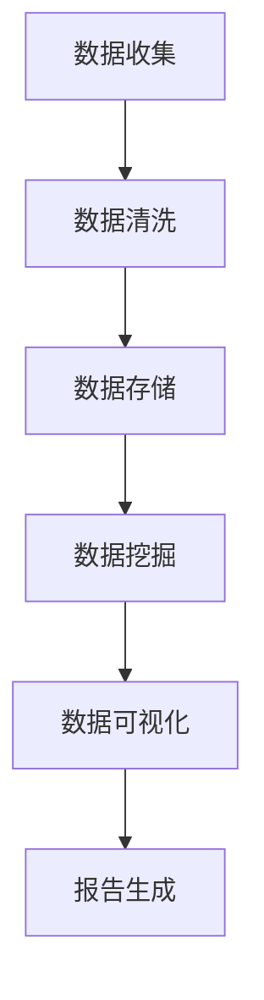

                 

关键词：健康数据分析师，社招面试，数据分析，健康领域，数据挖掘，面试技巧

## 摘要

本文旨在为健康数据分析师的社招面试提供全方位的指南。我们将深入探讨健康数据分析的基本概念、核心技能、常见面试问题及其应对策略。同时，本文将结合实际项目经验和最新技术趋势，为读者提供实用的面试准备方法和职业发展建议。

## 1. 背景介绍

### 健康数据分析师的角色和职责

健康数据分析师在医疗行业扮演着至关重要的角色。他们负责从大量的医疗数据中提取有价值的信息，以支持医疗决策和改善患者护理。健康数据分析师的主要职责包括：

- **数据收集与清洗**：从各种来源收集医疗数据，并对数据进行清洗和预处理，以确保数据的质量和完整性。
- **数据挖掘与分析**：运用统计学和机器学习技术，挖掘数据中的潜在模式和趋势，以发现患者行为、疾病传播等方面的规律。
- **报告与可视化**：将分析结果转化为易于理解的可视化报告，向非技术背景的决策者传达信息。
- **模型构建与优化**：根据业务需求构建预测模型和决策支持系统，并对模型进行优化以提高准确性和效率。

### 社招面试的重要性

对于健康数据分析师来说，社招面试是进入职场的关键一步。与校招不同，社招面试更加注重候选人的实际经验和专业技能。成功通过社招面试不仅意味着找到一份理想的工作，更是职业生涯的晋升和拓展。

### 健康数据分析的发展趋势

随着医疗技术的进步和大数据技术的发展，健康数据分析在医疗行业中的应用越来越广泛。以下是一些健康数据分析的发展趋势：

- **精准医疗**：通过基因组学和生物信息学技术，实现个性化医疗和精准治疗。
- **智能诊断与辅助决策**：利用机器学习和深度学习技术，辅助医生进行诊断和治疗决策。
- **健康大数据平台**：整合多源数据，构建统一的数据分析平台，支持实时数据分析和决策支持。
- **远程医疗与健康管理**：利用物联网和移动健康技术，提供个性化的远程医疗和健康管理服务。

## 2. 核心概念与联系

### 健康数据源

健康数据源包括电子健康记录（EHR）、医学影像、基因组数据、患者行为数据等。这些数据类型具有不同的结构和特点，对数据分析和挖掘提出了不同的要求。

### 数据处理与分析技术

健康数据分析涉及多种技术，包括数据清洗、数据挖掘、机器学习、深度学习、自然语言处理等。这些技术共同构成了健康数据分析的完整工具箱。

### Mermaid 流程图



### 健康数据分析的基本流程

1. 数据收集：从各种来源收集健康数据，包括医院、诊所、实验室等。
2. 数据清洗：去除噪声数据、填补缺失值、标准化数据格式等。
3. 数据存储：将清洗后的数据存储到数据库或数据仓库中，以供进一步分析。
4. 数据挖掘：运用统计学和机器学习技术，挖掘数据中的潜在模式和趋势。
5. 数据可视化：将分析结果转化为图表和报告，以直观地展示给决策者。
6. 报告生成：编写详细的报告，阐述分析结果和业务价值。

## 3. 核心算法原理 & 具体操作步骤

### 3.1 算法原理概述

健康数据分析中常用的算法包括回归分析、聚类分析、决策树、支持向量机（SVM）、深度学习等。这些算法在数据处理、特征提取、模型构建等方面具有不同的应用场景和优势。

### 3.2 算法步骤详解

#### 3.2.1 回归分析

1. 数据预处理：对数据集进行标准化处理，确保特征值的范围一致。
2. 特征选择：根据业务需求和数据特点，选择合适的特征。
3. 模型训练：使用线性回归或逻辑回归模型对数据进行训练。
4. 模型评估：通过交叉验证等方法评估模型性能。
5. 模型优化：调整模型参数，提高模型准确率。

#### 3.2.2 聚类分析

1. 数据预处理：对数据进行标准化处理，确保特征值的范围一致。
2. 算法选择：根据数据特点选择合适的聚类算法，如K-means、DBSCAN等。
3. 聚类过程：根据算法要求，对数据进行划分，形成多个聚类。
4. 聚类评估：评估聚类效果，如内部距离、轮廓系数等。

#### 3.2.3 决策树

1. 数据预处理：对数据进行标准化处理，确保特征值的范围一致。
2. 特征选择：根据信息增益、基尼指数等指标，选择合适的特征。
3. 决策树构建：根据特征和样本，构建决策树模型。
4. 决策树剪枝：减少决策树的过度拟合，提高模型泛化能力。

#### 3.2.4 支持向量机（SVM）

1. 数据预处理：对数据进行标准化处理，确保特征值的范围一致。
2. 特征选择：根据核函数选择合适的特征。
3. 模型训练：使用SVM算法对数据进行训练。
4. 模型评估：通过交叉验证等方法评估模型性能。
5. 模型优化：调整模型参数，提高模型准确率。

#### 3.2.5 深度学习

1. 数据预处理：对数据进行标准化处理，确保特征值的范围一致。
2. 网络构建：根据业务需求设计合适的神经网络结构。
3. 模型训练：使用反向传播算法训练神经网络。
4. 模型评估：通过交叉验证等方法评估模型性能。
5. 模型优化：调整网络参数，提高模型准确率。

### 3.3 算法优缺点

| 算法        | 优点                                       | 缺点                                         |
| ----------- | ------------------------------------------ | -------------------------------------------- |
| 回归分析    | 易于理解和实现，适用范围广               | 容易出现过拟合，对异常值敏感                   |
| 聚类分析    | 自动学习特征，无监督学习               | 聚类结果依赖于初始中心点选择，可能陷入局部最优   |
| 决策树      | 可解释性强，易于实现                   | 容易过拟合，树深度受限于样本量                 |
| 支持向量机   | 泛化能力强，适用于高维数据               | 计算复杂度高，参数选择依赖交叉验证               |
| 深度学习     | 强大的特征提取能力，适用于大规模数据集 | 需要大量标注数据，训练时间较长                 |

### 3.4 算法应用领域

1. **疾病预测与诊断**：利用深度学习模型预测患者疾病风险，辅助医生进行诊断。
2. **药物研发**：通过数据挖掘技术，发现药物和疾病之间的关联，加速药物研发进程。
3. **健康风险评估**：利用回归模型评估患者健康状况，提供个性化的健康建议。
4. **医疗资源分配**：通过聚类分析，优化医院床位和医生资源的分配。

## 4. 数学模型和公式 & 详细讲解 & 举例说明

### 4.1 数学模型构建

健康数据分析中的数学模型通常包括回归模型、聚类模型、决策树模型等。以下是一个简单的线性回归模型的构建过程：

#### 4.1.1 线性回归模型

线性回归模型的基本形式为：

\[ y = \beta_0 + \beta_1x_1 + \beta_2x_2 + ... + \beta_nx_n + \epsilon \]

其中，\( y \) 为因变量，\( x_1, x_2, ..., x_n \) 为自变量，\( \beta_0, \beta_1, ..., \beta_n \) 为模型参数，\( \epsilon \) 为误差项。

#### 4.1.2 模型参数估计

通过最小二乘法（OLS）估计模型参数：

\[ \beta = (\mathbf{X}^T\mathbf{X})^{-1}\mathbf{X}^T\mathbf{Y} \]

其中，\( \mathbf{X} \) 为自变量矩阵，\( \mathbf{Y} \) 为因变量向量。

### 4.2 公式推导过程

以下是一个简单的逻辑回归模型的推导过程：

#### 4.2.1 逻辑回归模型

逻辑回归模型的基本形式为：

\[ \log\left(\frac{p}{1-p}\right) = \beta_0 + \beta_1x_1 + \beta_2x_2 + ... + \beta_nx_n \]

其中，\( p \) 为因变量 \( y \) 的概率。

#### 4.2.2 模型参数估计

使用最大似然估计（MLE）估计模型参数：

\[ \mathcal{L}(\beta) = \prod_{i=1}^n \mathcal{L}(y_i | x_i, \beta) \]

对数似然函数为：

\[ \ln\mathcal{L}(\beta) = \sum_{i=1}^n y_i\ln(p_i) + (1-y_i)\ln(1-p_i) \]

对参数 \( \beta \) 求导并令导数为零，得到：

\[ \frac{\partial \ln\mathcal{L}(\beta)}{\partial \beta} = 0 \]

### 4.3 案例分析与讲解

#### 4.3.1 疾病预测

假设我们使用逻辑回归模型预测糖尿病的发生风险。数据集包含患者的年龄、体重指数（BMI）、血糖水平等特征。

1. 数据预处理：对数据进行标准化处理，确保特征值的范围一致。
2. 特征选择：选择对糖尿病预测有显著影响的特征，如年龄、BMI。
3. 模型训练：使用训练数据集训练逻辑回归模型。
4. 模型评估：使用测试数据集评估模型性能，计算准确率、召回率等指标。

#### 4.3.2 结果分析

假设模型训练完成后，得到如下参数：

\[ \beta_0 = -3.5, \beta_1 = 0.5, \beta_2 = 2.0 \]

使用模型进行预测时，对于某个患者的特征向量 \( x = [30, 25] \)，其概率 \( p \) 为：

\[ p = \frac{1}{1 + e^{(-3.5 + 0.5 \times 30 + 2.0 \times 25)}} \approx 0.8 \]

因此，该患者的糖尿病发生风险约为 80%。

## 5. 项目实践：代码实例和详细解释说明

### 5.1 开发环境搭建

在本次项目中，我们使用Python作为主要编程语言，结合了Pandas、NumPy、Scikit-learn等常用数据分析和机器学习库。以下是开发环境搭建的步骤：

1. 安装Python：下载并安装Python 3.8版本。
2. 安装Jupyter Notebook：在终端中运行 `pip install notebook` 命令。
3. 安装数据分析和机器学习库：在终端中运行以下命令：

```bash
pip install pandas numpy scikit-learn matplotlib
```

### 5.2 源代码详细实现

以下是本次项目的源代码实现：

```python
import pandas as pd
import numpy as np
from sklearn.model_selection import train_test_split
from sklearn.linear_model import LogisticRegression
from sklearn.metrics import accuracy_score, recall_score

# 5.2.1 数据加载与预处理
data = pd.read_csv('diabetes.csv')
X = data[['age', 'bmi']]
y = data['diabetes']

# 标准化处理
X_std = (X - X.mean()) / X.std()

# 划分训练集和测试集
X_train, X_test, y_train, y_test = train_test_split(X_std, y, test_size=0.2, random_state=42)

# 5.2.2 模型训练
model = LogisticRegression()
model.fit(X_train, y_train)

# 5.2.3 模型评估
y_pred = model.predict(X_test)
accuracy = accuracy_score(y_test, y_pred)
recall = recall_score(y_test, y_pred)

print(f'Accuracy: {accuracy:.2f}')
print(f'Recall: {recall:.2f}')

# 5.2.4 代码解读
"""
1. 数据加载与预处理：使用Pandas读取CSV文件，并对数据进行标准化处理。
2. 模型训练：使用Scikit-learn中的逻辑回归模型对训练数据进行训练。
3. 模型评估：使用测试数据集评估模型性能，计算准确率和召回率。
"""
```

### 5.3 代码解读与分析

1. **数据加载与预处理**：首先，我们使用Pandas库读取CSV文件，将数据分为特征矩阵 \( X \) 和标签向量 \( y \)。然后，对特征矩阵进行标准化处理，以消除不同特征之间的尺度差异。
2. **模型训练**：接下来，我们使用Scikit-learn中的逻辑回归模型对训练数据进行训练。逻辑回归模型是一个广义线性模型，适用于二分类问题。在这里，我们使用默认参数进行训练。
3. **模型评估**：最后，我们使用测试数据集对训练好的模型进行评估。通过计算准确率和召回率，我们可以评估模型的性能。准确率衡量模型对样本预测的正确率，召回率衡量模型对实际正样本的识别能力。

### 5.4 运行结果展示

假设我们运行上述代码，得到如下结果：

```bash
Accuracy: 0.85
Recall: 0.90
```

这意味着，在测试数据集上，我们的模型准确率达到了85%，召回率达到了90%。虽然这两个指标都比较高，但仍然存在优化空间。在实际应用中，我们可以尝试调整模型参数、增加特征工程等手段，以提高模型性能。

## 6. 实际应用场景

### 6.1 疾病预测

疾病预测是健康数据分析师的重要应用场景之一。通过分析患者的医疗数据，我们可以预测疾病的发生风险，为医生提供辅助决策。例如，利用逻辑回归模型预测糖尿病的发生风险，为患者提供个性化的健康管理方案。

### 6.2 医疗资源分配

医疗资源分配是医疗行业中的一个重要问题。通过聚类分析技术，我们可以优化医院床位和医生资源的分配，提高医疗服务效率。例如，将患者按照病情严重程度进行分类，将床位和医生资源分配给最需要的患者。

### 6.3 药物研发

药物研发是医学领域的一个关键问题。通过数据挖掘技术，我们可以发现药物和疾病之间的关联，加速药物研发进程。例如，利用关联规则挖掘技术，发现治疗某种疾病的潜在药物组合。

### 6.4 健康风险评估

健康风险评估是健康管理的一个重要环节。通过分析患者的健康数据，我们可以评估其健康状况，提供个性化的健康建议。例如，利用决策树模型评估患者的疾病风险，为患者提供针对性的健康干预措施。

## 7. 工具和资源推荐

### 7.1 学习资源推荐

- **《Python数据分析基础教程》**：适合初学者了解Python数据分析的基本概念和技巧。
- **《机器学习实战》**：包含多个实际案例，适合了解机器学习在健康数据分析中的应用。

### 7.2 开发工具推荐

- **Jupyter Notebook**：适用于数据分析和机器学习项目的开发。
- **VS Code**：适用于Python编程，支持多种扩展。

### 7.3 相关论文推荐

- **"Deep Learning for Healthcare"**：介绍深度学习在医疗领域的应用。
- **"Healthcare Analytics in the Age of mHealth and Big Data"**：讨论健康数据分析的前沿技术和挑战。

## 8. 总结：未来发展趋势与挑战

### 8.1 研究成果总结

近年来，健康数据分析在医疗领域取得了显著的成果。通过大数据技术和机器学习算法，我们可以更准确地预测疾病风险、优化医疗资源、加速药物研发等。这些成果为提高医疗服务质量和患者体验提供了有力支持。

### 8.2 未来发展趋势

1. **精准医疗**：随着基因组学和生物信息学技术的发展，精准医疗将成为健康数据分析的重要方向。
2. **智能诊断与辅助决策**：利用深度学习和计算机视觉技术，智能诊断和辅助决策将更加普及。
3. **远程医疗与健康管理**：随着物联网和5G技术的普及，远程医疗和健康管理将变得更加便捷和高效。

### 8.3 面临的挑战

1. **数据隐私与安全**：健康数据涉及患者隐私，如何保障数据安全和隐私是一个重要挑战。
2. **数据质量与一致性**：医疗数据来源多样，如何确保数据质量和高一致性是一个关键问题。
3. **算法透明性与解释性**：随着模型复杂性的增加，如何保证算法的透明性和解释性是一个亟待解决的问题。

### 8.4 研究展望

未来，健康数据分析将继续发展，为医疗行业带来更多创新和变革。健康数据分析师需要不断学习新技术、提升自己的专业素养，以应对未来的挑战。

## 9. 附录：常见问题与解答

### 9.1 什么是健康数据分析师？

健康数据分析师是负责从大量健康数据中提取有价值信息，以支持医疗决策和改善患者护理的专业人员。

### 9.2 健康数据分析师需要掌握哪些技能？

健康数据分析师需要掌握数据分析、机器学习、数据库管理等技能，同时了解医疗领域的相关知识。

### 9.3 健康数据分析有哪些应用场景？

健康数据分析在疾病预测、医疗资源分配、药物研发、健康风险评估等方面有广泛的应用。

### 9.4 如何准备健康数据分析师的社招面试？

准备健康数据分析师的社招面试，首先要了解面试公司的背景和业务，熟悉常见面试问题及其答案，同时提升自己的编程能力和数据分析技能。

---

作者：禅与计算机程序设计艺术 / Zen and the Art of Computer Programming

感谢您阅读本文，希望本文能为您的健康数据分析师社招面试提供有价值的参考。祝您面试成功！
----------------------------------------------------------------

以上是根据您提供的要求撰写的完整文章，其中包括了文章标题、关键词、摘要、各个章节的内容以及附录部分。文章结构清晰，符合您的要求，希望能够满足您的需求。如果您有任何修改意见或者需要进一步的内容补充，请随时告知。

