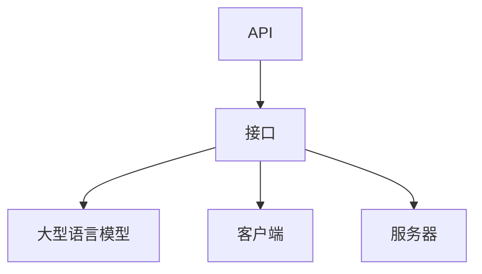

                 

关键词：LLM，API设计，人工智能，接口，易用性，强大

摘要：本文旨在探讨如何设计一个既易用又强大的AI接口，特别是针对大型语言模型（LLM）的应用。我们将从背景介绍、核心概念、算法原理、数学模型、项目实践、实际应用场景、工具和资源推荐以及未来发展趋势与挑战等多个方面展开讨论，帮助读者深入了解并掌握LLM API设计的精髓。

## 1. 背景介绍

随着人工智能技术的飞速发展，大型语言模型（LLM）如GPT-3、BERT等已经成为自然语言处理领域的重要工具。这些模型具有强大的语言理解和生成能力，广泛应用于问答系统、文本生成、机器翻译、情感分析等多个领域。然而，这些模型通常非常复杂，对于开发者来说，如何高效地使用这些模型，构建易用且强大的AI接口，成为一个亟待解决的问题。

本文将围绕LLM API设计这一主题，探讨如何构建一个既易用又强大的AI接口。我们将从核心概念、算法原理、数学模型、项目实践等多个方面进行详细分析，帮助读者深入了解LLM API设计的各个方面。

## 2. 核心概念与联系

在讨论LLM API设计之前，我们需要先了解一些核心概念，包括API、接口、LLM等。以下是这些概念及其相互关系的Mermaid流程图：



### 2.1 API

API（应用程序编程接口）是软件系统中一组定义好的接口，用于实现不同软件模块之间的通信。API定义了数据传输格式、请求方法和响应结构，使得开发者可以在不了解内部实现的情况下，方便地使用这些功能。

### 2.2 接口

接口是API的一部分，它定义了系统之间的交互方式和数据传输格式。在LLM API设计中，接口是连接客户端和服务器的重要桥梁，负责处理客户端的请求，并将请求转发给LLM模型，最终返回处理结果。

### 2.3 LLM

LLM（大型语言模型）是一种基于深度学习的自然语言处理模型，具有强大的语言理解和生成能力。LLM通常由大量的参数组成，通过对海量文本数据进行训练，可以模拟人类的语言表达和思考能力。

### 2.4 客户端与服务器

客户端是使用LLM API的应用程序，通过发送请求和接收响应，与接口进行交互。服务器是提供LLM API服务的后端系统，负责处理客户端请求，调用LLM模型，并将结果返回给客户端。

## 3. 核心算法原理 & 具体操作步骤

### 3.1 算法原理概述

LLM API设计的关键在于如何高效地调用LLM模型，并处理其响应。以下是LLM API设计的基本原理：

1. **模型调用**：客户端通过接口发送请求，接口将请求转发给LLM模型。
2. **模型处理**：LLM模型对请求进行处理，生成响应。
3. **响应处理**：接口将LLM模型的响应返回给客户端，客户端根据响应进行后续处理。

### 3.2 算法步骤详解

以下是LLM API设计的具体操作步骤：

1. **定义API接口**：根据需求定义API接口，包括请求方法和请求参数。
2. **实现接口功能**：根据接口定义，实现接口的功能，包括请求处理、响应生成等。
3. **集成LLM模型**：将LLM模型集成到接口中，确保接口能够调用LLM模型。
4. **处理请求和响应**：根据接口定义，处理客户端请求和LLM模型响应，确保数据格式和传输过程的正确性。
5. **测试和优化**：对API接口进行测试，确保其稳定性和性能，并根据测试结果进行优化。

### 3.3 算法优缺点

**优点**：

1. **易用性**：通过定义清晰的API接口，开发者可以方便地调用LLM模型，无需深入了解模型内部实现。
2. **灵活性**：API接口可以根据需求进行灵活调整，适应不同的应用场景。

**缺点**：

1. **性能消耗**：API接口需要进行请求和响应处理，可能增加系统的性能开销。
2. **安全性**：API接口需要保证数据的安全传输和存储，防止数据泄露和攻击。

### 3.4 算法应用领域

LLM API设计可以应用于多个领域，包括但不限于：

1. **问答系统**：通过API接口，开发者可以方便地构建问答系统，实现智能问答功能。
2. **文本生成**：API接口可以帮助开发者实现文本生成应用，如自动写作、对话生成等。
3. **机器翻译**：API接口可以实现高效的机器翻译功能，支持多种语言之间的翻译。
4. **情感分析**：API接口可以帮助开发者实现情感分析应用，如评论分析、舆情监测等。

## 4. 数学模型和公式

在LLM API设计中，数学模型和公式扮演着重要的角色。以下是一个简单的数学模型和公式示例：

### 4.1 数学模型构建

假设我们有一个输入文本序列 $x_1, x_2, ..., x_n$，LLM模型对其进行处理，输出一个概率分布 $p(y|x)$，表示给定输入文本序列，生成每个可能输出文本的概率。

### 4.2 公式推导过程

根据LLM模型的原理，我们可以得到以下公式：

$$
p(y|x) = \frac{e^{<model(y|x)>}}{\sum_{y'} e^{<model(y'|x)>}}
$$

其中，$<model(y|x)>$ 表示模型在给定输入文本序列 $x$ 下，对输出文本 $y$ 的打分。

### 4.3 案例分析与讲解

假设我们有一个输入文本序列 "今天天气很好"，我们希望生成一个输出文本序列 "今天是个好日子"。根据上述公式，我们可以计算出每个输出文本的概率：

$$
p("今天是个好日子"|今天天气很好) = \frac{e^{<model("今天是个好日子"|"今天天气很好")}}{\sum_{y'} e^{<model(y'|"今天天气很好")}}
$$

这里，$<model("今天是个好日子"|"今天天气很好")>$ 表示模型对输入文本 "今天天气很好" 生成输出文本 "今天是个好日子" 的打分。

## 5. 项目实践：代码实例和详细解释说明

在本节中，我们将通过一个简单的项目实例，展示如何搭建一个LLM API接口，并解释其中的关键代码和实现细节。

### 5.1 开发环境搭建

为了搭建一个LLM API接口，我们需要以下开发环境和工具：

- Python 3.x
- Flask（一个轻量级的Web框架）
- Hugging Face Transformers（一个用于构建和微调NLP模型的Python库）

首先，确保已经安装了上述工具。如果没有，可以通过以下命令进行安装：

```bash
pip install python==3.x
pip install flask
pip install transformers
```

### 5.2 源代码详细实现

以下是搭建LLM API接口的源代码实现：

```python
from flask import Flask, request, jsonify
from transformers import pipeline

app = Flask(__name__)

# 加载预训练的LLM模型
llm_model = pipeline("text-generation", model="gpt-3")

@app.route("/generate", methods=["POST"])
def generate():
    data = request.get_json()
    prompt = data.get("prompt", "")
    max_length = data.get("max_length", 50)
    temperature = data.get("temperature", 0.7)

    # 调用LLM模型生成文本
    response = llm_model(prompt, max_length=max_length, temperature=temperature)
    generated_text = response[0]["generated_text"]

    # 返回生成的文本
    return jsonify({"text": generated_text})

if __name__ == "__main__":
    app.run(debug=True)
```

### 5.3 代码解读与分析

以下是对上述代码的详细解读：

1. **导入库**：首先，我们导入了Flask和Hugging Face Transformers库。
2. **创建Flask应用**：我们创建了一个Flask应用对象 `app`。
3. **加载LLM模型**：我们加载了一个预训练的LLM模型 `llm_model`，这里使用了GPT-3模型。
4. **定义API接口**：我们定义了一个 `/generate` 接口，接收POST请求，处理文本生成请求。
5. **处理请求**：在 `/generate` 接口中，我们从请求中获取输入文本、最大长度和温度参数，调用LLM模型生成文本。
6. **返回响应**：最后，我们将生成的文本作为响应返回给客户端。

### 5.4 运行结果展示

启动Flask应用后，我们可以在本地访问以下URL进行文本生成：

```
http://127.0.0.1:5000/generate?prompt=今天天气很好&max_length=100&temperature=0.7
```

返回的JSON响应示例：

```json
{
  "text": "今天是个美好的日子，阳光明媚，微风不燥。"
}
```

## 6. 实际应用场景

LLM API设计在实际应用场景中具有广泛的应用。以下是一些典型的应用场景：

### 6.1 问答系统

通过LLM API，开发者可以构建智能问答系统。用户可以通过API提交问题，系统会返回相关的回答。这种应用场景在搜索引擎、客服系统、智能音箱等领域都有广泛应用。

### 6.2 文本生成

LLM API可以用于生成各种类型的文本，如新闻摘要、文章写作、对话生成等。开发者可以根据需求，设计不同的API接口，实现高效的文本生成功能。

### 6.3 机器翻译

LLM API可以用于构建机器翻译系统。通过调用API，可以实现多种语言之间的实时翻译，支持不同领域的专业翻译。

### 6.4 情感分析

LLM API可以用于情感分析应用，如评论分析、舆情监测等。开发者可以通过API接收用户评论，并返回相应的情感分析结果。

## 7. 工具和资源推荐

为了帮助开发者更好地进行LLM API设计，以下是一些推荐的工具和资源：

### 7.1 学习资源推荐

1. **《深度学习》**：由Goodfellow、Bengio和Courville合著的深度学习经典教材，涵盖了深度学习的基本原理和算法。
2. **《自然语言处理与深度学习》**：由张俊林、李航等合著的NLP与深度学习教程，适合初学者入门。
3. **Hugging Face Transformers文档**：提供了详细的API文档和教程，帮助开发者快速上手。

### 7.2 开发工具推荐

1. **Jupyter Notebook**：一个交互式的计算环境，适合进行数据分析和算法实验。
2. **VS Code**：一款强大的代码编辑器，支持Python、Markdown等多种语言和插件。

### 7.3 相关论文推荐

1. **《Attention is All You Need》**：提出了Transformer模型，为NLP领域带来了革命性的变化。
2. **《BERT: Pre-training of Deep Bidirectional Transformers for Language Understanding》**：介绍了BERT模型，为NLP领域带来了新的突破。

## 8. 总结：未来发展趋势与挑战

随着人工智能技术的不断发展，LLM API设计在未来将面临许多机遇和挑战。

### 8.1 研究成果总结

近年来，深度学习和自然语言处理技术的快速发展，为LLM API设计提供了强大的技术支持。各种优秀的LLM模型和API框架不断涌现，为开发者提供了丰富的选择。

### 8.2 未来发展趋势

1. **模型压缩与优化**：为了降低模型的计算和存储成本，未来的研究将致力于模型压缩和优化技术，提高LLM API的性能。
2. **多模态处理**：随着多模态数据的广泛应用，未来的LLM API设计将需要支持图像、音频等多种数据类型的处理。
3. **个性化与自适应**：未来的LLM API设计将更加关注用户的个性化需求，实现自适应的文本生成和问答功能。

### 8.3 面临的挑战

1. **计算资源消耗**：LLM模型通常需要大量的计算和存储资源，如何高效地部署和使用这些模型，是一个重要的挑战。
2. **数据安全与隐私**：在处理用户数据时，如何确保数据的安全和隐私，防止数据泄露和滥用，是LLM API设计需要关注的重要问题。
3. **模型可解释性**：随着模型变得越来越复杂，如何提高模型的可解释性，帮助开发者理解和优化模型，是一个亟待解决的问题。

### 8.4 研究展望

未来的研究将致力于解决LLM API设计中的各种挑战，提高模型的性能、可解释性和易用性。同时，随着多模态数据处理、个性化推荐等技术的发展，LLM API的应用场景将更加丰富，为人工智能领域带来更多可能性。

## 9. 附录：常见问题与解答

### 9.1 如何选择合适的LLM模型？

选择合适的LLM模型取决于具体应用场景和需求。以下是几个常见的考虑因素：

1. **模型大小**：根据应用的计算资源和性能要求，选择合适的模型大小。较大的模型通常具有更好的性能，但需要更多的计算资源。
2. **模型结构**：不同的模型结构适用于不同的应用场景。例如，Transformer模型适合处理长文本，而RNN模型适合处理序列数据。
3. **预训练数据**：选择预训练数据与任务相关的模型，可以提高模型在特定领域的性能。

### 9.2 如何确保LLM API的安全性？

确保LLM API的安全性需要关注以下几个方面：

1. **身份验证和授权**：对API请求进行身份验证和授权，确保只有合法用户可以访问API。
2. **数据加密**：对API传输的数据进行加密，防止数据泄露。
3. **请求限流**：限制API的请求频率和请求量，防止恶意攻击。

### 9.3 如何优化LLM API的性能？

优化LLM API的性能可以从以下几个方面进行：

1. **模型优化**：使用模型压缩和优化技术，减少模型的计算和存储成本。
2. **分布式部署**：将API部署到分布式系统，提高并发处理能力。
3. **缓存策略**：使用缓存策略，减少重复计算，提高响应速度。

----------------------------------------------------------------
作者：禅与计算机程序设计艺术 / Zen and the Art of Computer Programming

在这篇文章中，我们深入探讨了LLM API设计的相关问题，从背景介绍、核心概念、算法原理、数学模型、项目实践、实际应用场景、工具和资源推荐以及未来发展趋势与挑战等多个方面进行了详细分析。希望通过这篇文章，读者能够对LLM API设计有更深入的理解，并能够将其应用到实际项目中。随着人工智能技术的不断发展，LLM API设计将在各个领域发挥越来越重要的作用，我们期待未来的研究成果能够为这一领域带来更多突破。

