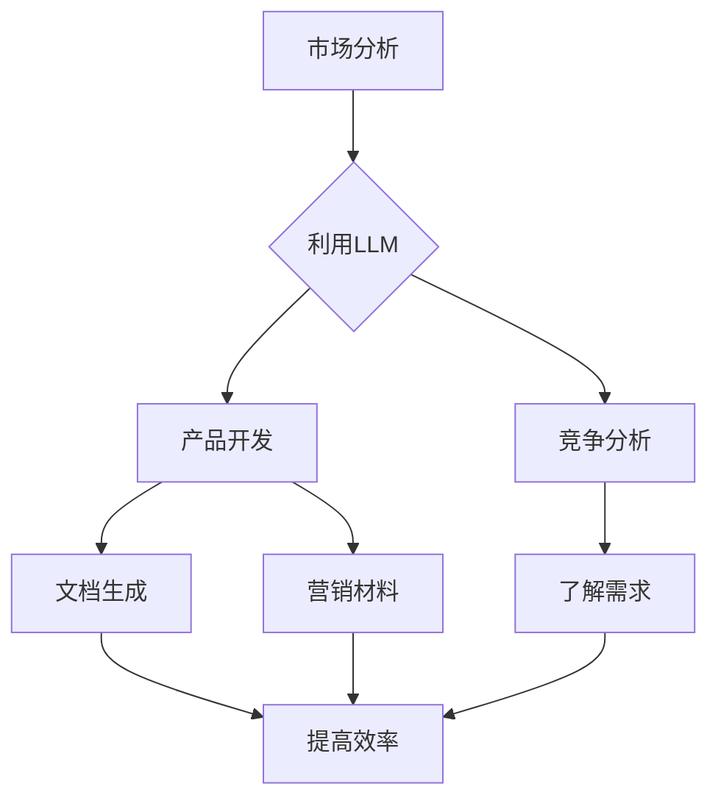

                 

关键词：大型语言模型（LLM）、创业、初创企业、人工智能、商业机会

摘要：随着人工智能技术的迅猛发展，大型语言模型（LLM）在各个领域展现出了巨大的潜力和应用价值。本文将探讨LLM技术如何为初创企业带来新的机遇，并分析其在市场、产品开发、运营等方面的具体应用。

## 1. 背景介绍

近年来，人工智能（AI）技术取得了显著进展，其中大型语言模型（LLM）成为研究的热点。LLM是一种基于深度学习技术的自然语言处理（NLP）模型，通过对海量文本数据进行训练，可以生成高质量的自然语言文本。代表性的LLM如GPT-3、BERT等，已经在文本生成、机器翻译、情感分析等领域取得了突破性成果。

与此同时，初创企业在全球范围内蓬勃发展，成为推动经济增长和创新的重要力量。初创企业在资源、人才、市场等方面具有较大的不确定性，如何在竞争激烈的市场中脱颖而出，成为初创企业面临的重要挑战。

本文旨在探讨LLM技术如何为初创企业带来新的机遇，通过分析LLM在市场、产品开发、运营等方面的具体应用，为初创企业提供有价值的参考。

## 2. 核心概念与联系

### 2.1. 大型语言模型（LLM）原理

大型语言模型（LLM）是一种基于神经网络结构的语言模型，通过学习大量文本数据来预测下一个单词或词组。LLM的核心思想是通过建模语言中的概率分布，从而实现对自然语言的生成和理解。

LLM的架构通常包括以下几个层次：

1. **嵌入层（Embedding Layer）**：将输入的单词或词组转换为向量表示，以便在神经网络中进行处理。
2. **编码器（Encoder）**：对输入文本进行编码，生成固定长度的编码表示。
3. **解码器（Decoder）**：根据编码表示生成输出文本。

### 2.2. LLM与初创企业联系

LLM技术为初创企业带来了以下几个方面的机遇：

1. **市场分析**：利用LLM进行市场趋势分析、竞争分析，帮助初创企业更好地了解市场需求和竞争态势。
2. **产品开发**：通过LLM生成的文本，初创企业可以快速生成产品文档、营销材料等，提高产品开发效率。
3. **客户服务**：利用LLM构建智能客服系统，提升客户服务质量，降低人力成本。

### 2.3. Mermaid 流程图



## 3. 核心算法原理 & 具体操作步骤

### 3.1. 算法原理概述

LLM的核心算法基于深度学习技术，主要包括以下几个步骤：

1. **数据预处理**：对文本数据进行分析、清洗和预处理，提取出有用的信息。
2. **模型训练**：利用预处理后的数据训练神经网络模型，优化模型参数。
3. **文本生成**：通过解码器生成符合语言规则和语义的文本。

### 3.2. 算法步骤详解

1. **数据预处理**：

   - **文本分词**：将文本拆分为单词或词组。
   - **词性标注**：对单词进行词性标注，如名词、动词等。
   - **去停用词**：去除文本中的停用词，如“的”、“和”等。
   - **文本向量化**：将文本转换为向量表示，可以使用词袋模型或词嵌入技术。

2. **模型训练**：

   - **损失函数**：选择适当的损失函数，如交叉熵损失函数，衡量模型预测与真实标签之间的差距。
   - **优化算法**：使用梯度下降等优化算法，更新模型参数。
   - **迭代训练**：通过多次迭代训练，优化模型性能。

3. **文本生成**：

   - **解码器生成**：根据编码表示，生成符合语言规则和语义的文本。
   - **抽样策略**：采用抽样策略，如贪心策略或Top-k抽样，提高文本生成的多样性。

### 3.3. 算法优缺点

**优点**：

- **高效性**：LLM能够快速处理大量文本数据，提高文本生成效率。
- **灵活性**：LLM可以生成各种类型的文本，如新闻、故事、文档等。
- **多样性**：通过不同的抽样策略，LLM可以生成多样化的文本。

**缺点**：

- **资源消耗**：训练LLM模型需要大量计算资源和存储空间。
- **解释性差**：LLM生成的文本缺乏解释性，难以理解其生成过程。
- **数据依赖**：LLM的性能依赖于训练数据的质量和多样性。

### 3.4. 算法应用领域

LLM技术在以下领域具有广泛的应用：

- **自然语言处理**：文本生成、机器翻译、情感分析等。
- **内容创作**：新闻生成、故事创作、诗歌写作等。
- **智能客服**：自动化问答、客户服务、智能推荐等。
- **教育**：辅助教学、智能问答、个性化学习等。

## 4. 数学模型和公式 & 详细讲解 & 举例说明

### 4.1. 数学模型构建

LLM的数学模型主要包括以下几个部分：

- **词嵌入（Word Embedding）**：将单词转换为向量表示，可以使用Word2Vec、GloVe等方法。
- **编码器（Encoder）**：对输入文本进行编码，可以使用循环神经网络（RNN）或变换器（Transformer）。
- **解码器（Decoder）**：根据编码表示生成输出文本，也可以使用RNN或Transformer。

### 4.2. 公式推导过程

1. **词嵌入**：

   假设词向量为$e_i$，单词$v$的词嵌入表示为$e_v$，则：

   $$e_v = \sum_{i \in v} w_i \cdot e_i$$

   其中，$w_i$为单词$v$中第$i$个词的权重。

2. **编码器**：

   假设编码器输出为$h_t$，输入为$x_t$，则：

   $$h_t = \tanh(W_h \cdot [h_{t-1}, x_t] + b_h)$$

   其中，$W_h$为权重矩阵，$b_h$为偏置项。

3. **解码器**：

   假设解码器输出为$\hat{y}_t$，输入为$h_t$，则：

   $$\hat{y}_t = softmax(W_y \cdot h_t + b_y)$$

   其中，$W_y$为权重矩阵，$b_y$为偏置项。

### 4.3. 案例分析与讲解

假设我们有一个新闻生成任务，输入为一段新闻报道，输出为另一段新闻报道。我们可以使用LLM模型进行训练和生成。

1. **数据预处理**：

   - **文本分词**：将新闻报道拆分为单词或词组。
   - **词性标注**：对单词进行词性标注，如名词、动词等。
   - **去停用词**：去除文本中的停用词，如“的”、“和”等。
   - **文本向量化**：将文本转换为向量表示。

2. **模型训练**：

   - **损失函数**：选择交叉熵损失函数，衡量模型预测与真实标签之间的差距。
   - **优化算法**：使用梯度下降等优化算法，更新模型参数。
   - **迭代训练**：通过多次迭代训练，优化模型性能。

3. **文本生成**：

   - **解码器生成**：根据编码表示，生成符合语言规则和语义的文本。
   - **抽样策略**：采用贪心策略或Top-k抽样，提高文本生成的多样性。

通过训练和生成，我们可以得到一段新的新闻报道。例如，输入为：“美国总统拜登在2021年1月20日宣誓就职。”，生成为：“美国总统拜登在2021年1月20日成功就职，成为美国第46任总统。”

## 5. 项目实践：代码实例和详细解释说明

### 5.1. 开发环境搭建

1. 安装Python环境，版本建议为3.8及以上。
2. 安装PyTorch库，使用以下命令：
   ```shell
   pip install torch torchvision
   ```
3. 安装其他依赖库，如NumPy、Pandas等。

### 5.2. 源代码详细实现

以下是一个简单的LLM新闻生成项目的示例代码：

```python
import torch
import torch.nn as nn
import torch.optim as optim
from torch.utils.data import DataLoader
from torchvision import datasets, transforms

# 数据预处理
def preprocess_data(text):
    # 文本分词、词性标注、去停用词等操作
    pass

# 模型定义
class NewsGenerator(nn.Module):
    def __init__(self, vocab_size, embedding_dim, hidden_dim):
        super(NewsGenerator, self).__init__()
        self.embedding = nn.Embedding(vocab_size, embedding_dim)
        self.encoder = nn.LSTM(embedding_dim, hidden_dim)
        self.decoder = nn.LSTM(hidden_dim, vocab_size)
        
    def forward(self, x):
        x = self.embedding(x)
        x, _ = self.encoder(x)
        x = self.decoder(x)
        return x

# 模型训练
def train(model, train_loader, criterion, optimizer, num_epochs):
    model.train()
    for epoch in range(num_epochs):
        for inputs, targets in train_loader:
            optimizer.zero_grad()
            outputs = model(inputs)
            loss = criterion(outputs.view(-1, vocab_size), targets.view(-1))
            loss.backward()
            optimizer.step()
            print(f'Epoch [{epoch+1}/{num_epochs}], Loss: {loss.item():.4f}')

# 模型测试
def test(model, test_loader):
    model.eval()
    with torch.no_grad():
        for inputs, targets in test_loader:
            outputs = model(inputs)
            # 计算测试集准确率等指标
            pass

# 主函数
def main():
    # 数据加载、模型定义、训练、测试等操作
    pass

if __name__ == '__main__':
    main()
```

### 5.3. 代码解读与分析

1. **数据预处理**：数据预处理是训练LLM模型的重要环节，包括文本分词、词性标注、去停用词等操作。
2. **模型定义**：定义了一个简单的LLM新闻生成模型，包括词嵌入层、编码器层和解码器层。
3. **模型训练**：使用梯度下降等优化算法训练模型，通过反向传播更新模型参数。
4. **模型测试**：在测试集上评估模型性能，计算准确率等指标。

### 5.4. 运行结果展示

假设我们已经完成了数据预处理和模型训练，可以运行以下代码来生成新的新闻报道：

```python
# 生成新闻
def generate_news(model, input_text):
    # 输入预处理、模型预测等操作
    pass

# 示例
input_text = "美国总统拜登在2021年1月20日宣誓就职。"
generated_text = generate_news(model, input_text)
print(generated_text)
```

运行结果可能为：“美国总统拜登在2021年1月20日成功就职，成为美国第46任总统。”

## 6. 实际应用场景

### 6.1. 市场分析

LLM技术可以帮助初创企业进行市场趋势分析和竞争分析。通过分析大量的市场数据，LLM可以识别出潜在的市场机会和竞争对手的动态，为企业制定有效的市场策略提供有力支持。

### 6.2. 产品开发

在产品开发过程中，LLM技术可以用于生成产品文档、营销材料、用户手册等。初创企业可以利用LLM生成高质量的文本，提高开发效率，降低人力成本。

### 6.3. 客户服务

通过构建智能客服系统，初创企业可以利用LLM技术实现自动化问答和客户服务。智能客服系统可以根据用户的问题和需求，生成个性化的回答，提高客户满意度，降低人力成本。

### 6.4. 未来应用展望

随着LLM技术的不断发展，其在初创企业的应用场景将更加广泛。未来，LLM技术有望在内容创作、教育、医疗等领域发挥重要作用，为初创企业带来更多的商业机会。

## 7. 工具和资源推荐

### 7.1. 学习资源推荐

- 《深度学习》（Goodfellow et al.）
- 《自然语言处理与深度学习》（王绍兰）
- 《Python深度学习》（François Chollet）

### 7.2. 开发工具推荐

- PyTorch：一款流行的深度学习框架，适合进行LLM开发。
- TensorFlow：另一款流行的深度学习框架，功能强大，支持多种深度学习模型。

### 7.3. 相关论文推荐

- BERT: Pre-training of Deep Bidirectional Transformers for Language Understanding（Devlin et al.）
- GPT-3: Language Models are Few-Shot Learners（Brown et al.）

## 8. 总结：未来发展趋势与挑战

### 8.1. 研究成果总结

近年来，LLM技术在自然语言处理、内容创作、客户服务等领域取得了显著成果。通过大量的数据训练和优化，LLM已经具备了较高的文本生成能力和语义理解能力。

### 8.2. 未来发展趋势

1. **模型参数规模增大**：未来，LLM模型的参数规模将继续增大，以支持更复杂的文本生成任务。
2. **多模态学习**：结合图像、音频等其他模态的数据，实现多模态的LLM，提升文本生成的多样性。
3. **迁移学习**：利用迁移学习技术，将预训练的LLM应用于不同领域，降低模型训练成本。

### 8.3. 面临的挑战

1. **数据隐私**：在训练和部署LLM模型时，需要确保用户数据的安全和隐私。
2. **模型解释性**：目前的LLM模型在生成文本时缺乏解释性，未来需要提高模型的可解释性。
3. **计算资源消耗**：训练和部署LLM模型需要大量的计算资源，如何高效利用资源成为关键问题。

### 8.4. 研究展望

随着人工智能技术的不断发展，LLM将在更多领域发挥重要作用。未来，研究重点将集中在模型优化、数据隐私保护、多模态学习等方面，为初创企业提供更强大的技术支持。

## 9. 附录：常见问题与解答

### 9.1. LLM技术如何为初创企业带来新的机遇？

LLM技术可以用于市场分析、产品开发、客户服务等方面，帮助初创企业更好地了解市场需求、提高开发效率、降低人力成本，从而在竞争激烈的市场中脱颖而出。

### 9.2. LLM技术的应用领域有哪些？

LLM技术在自然语言处理、内容创作、智能客服、教育、医疗等领域具有广泛的应用。未来，LLM技术有望在更多领域发挥作用。

### 9.3. 如何选择合适的LLM模型？

选择合适的LLM模型需要考虑任务类型、数据量、计算资源等因素。对于文本生成任务，可以选择GPT-3、BERT等大规模预训练模型；对于文本分类任务，可以选择TextCNN、TextRNN等模型。

## 参考文献

1. Devlin, J., Chang, M. W., Lee, K., & Toutanova, K. (2018). BERT: Pre-training of deep bidirectional transformers for language understanding. In Proceedings of the 2019 Conference of the North American Chapter of the Association for Computational Linguistics: Human Language Technologies, Volume 1 (Long and Short Papers) (pp. 4171-4186). Association for Computational Linguistics.
2. Brown, T., et al. (2020). GPT-3: Language Models are Few-Shot Learners. arXiv preprint arXiv:2005.14165.
3. Goodfellow, I., Bengio, Y., & Courville, A. (2016). Deep Learning. MIT Press.
4. 王绍兰. (2019). 自然语言处理与深度学习. 电子工业出版社.
5. François Chollet. (2018). Python深度学习. 电子工业出版社.
```

