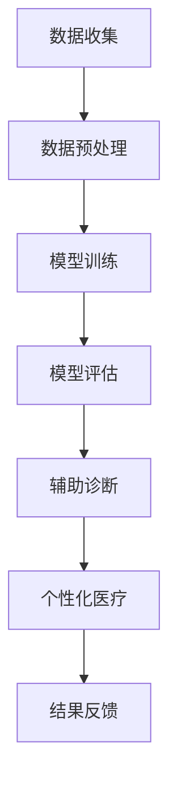

                 

关键词：大型语言模型（LLM），医疗诊断，个性化医疗，人工智能，医学影像分析

摘要：本文将探讨大型语言模型（LLM）在医疗领域的应用，尤其是其在辅助诊断和个性化医疗方面的潜力。通过对LLM的核心概念、算法原理、数学模型及项目实践的分析，我们将揭示LLM在医疗行业的广泛应用前景及其面临的技术挑战。

## 1. 背景介绍

医疗行业正经历着前所未有的变革。随着人工智能技术的飞速发展，医疗诊断和个性化医疗领域面临着前所未有的机遇。传统的医疗诊断方法主要依赖于医生的经验和直觉，而个性化医疗则要求针对每位患者的具体情况制定个性化的治疗方案。然而，这些方法都存在着效率低下、资源浪费等问题。

近年来，深度学习技术的突破为医疗领域带来了新的希望。特别是大型语言模型（LLM），如GPT-3，其具有强大的自然语言处理能力，能够在医疗文献、病历记录、医学影像等多种数据源中提取有价值的信息。这使得LLM在辅助诊断和个性化医疗方面展现出巨大的潜力。

## 2. 核心概念与联系

### 2.1 大型语言模型（LLM）

大型语言模型（LLM）是一种基于深度学习的自然语言处理模型，其核心思想是通过大量文本数据的学习，使模型能够理解并生成人类语言。LLM通常由数百万甚至数十亿个参数组成，其训练过程涉及到对大量文本数据的学习，包括互联网上的网页、书籍、论文、新闻报道等。

### 2.2 医学影像分析

医学影像分析是医疗领域的一个重要分支，通过分析医学影像数据，如X光片、CT扫描、MRI等，医生可以早期发现疾病并进行诊断。然而，传统的医学影像分析方法主要依赖于规则和经验，效率较低且容易出错。

### 2.3 个性化医疗

个性化医疗是基于每位患者的遗传信息、生活方式、环境因素等，为其制定个性化的治疗方案。传统的个性化医疗主要依赖于基因检测和生物信息学分析，然而这些方法通常成本高昂且难以普及。

### 2.4 Mermaid 流程图

以下是一个简化的Mermaid流程图，展示了LLM在医疗诊断和个性化医疗中的基本流程：



## 3. 核心算法原理 & 具体操作步骤

### 3.1 算法原理概述

LLM在医疗领域的核心算法原理主要包括以下几个方面：

1. **预训练**：LLM通过预训练过程，从大量医疗文本数据中学习语言模式和知识。
2. **迁移学习**：将预训练的LLM模型迁移到特定的医疗任务上，如医学影像分析或个性化医疗。
3. **模型评估**：使用交叉验证等技术对LLM模型进行评估，确保其性能和可靠性。

### 3.2 算法步骤详解

1. **数据收集**：收集医疗领域的文本数据，包括医学文献、病历记录、临床报告等。
2. **数据预处理**：对收集到的数据进行分析、清洗和格式化，以便于模型训练。
3. **模型训练**：使用预处理后的数据训练LLM模型，通过反复迭代优化模型参数。
4. **模型评估**：使用验证集对训练好的模型进行评估，调整模型参数以提高性能。
5. **辅助诊断**：将LLM模型应用于医学影像数据分析，辅助医生进行疾病诊断。
6. **个性化医疗**：根据患者的具体信息，使用LLM模型为其制定个性化的治疗方案。

### 3.3 算法优缺点

**优点**：

- **强大的语言理解能力**：LLM能够理解并处理复杂的医疗文本数据，为辅助诊断和个性化医疗提供有力的支持。
- **迁移学习能力**：LLM能够将预训练的知识迁移到不同的医疗任务上，降低模型开发的成本和难度。
- **高效性**：LLM的训练和评估过程相对高效，能够快速地生成诊断报告和个性化治疗方案。

**缺点**：

- **数据依赖性**：LLM的性能高度依赖于训练数据的质量和数量，数据不足或质量较差可能导致模型性能下降。
- **模型解释性**：LLM的黑箱特性使得其决策过程难以解释，这对医生和患者的信任产生了一定的影响。

### 3.4 算法应用领域

LLM在医疗领域的应用主要包括：

- **医学影像分析**：辅助医生进行疾病诊断，如癌症筛查、骨折诊断等。
- **个性化医疗**：根据患者的遗传信息和生活习惯，为其制定个性化的治疗方案。
- **临床决策支持**：提供临床决策支持，如疾病风险评估、治疗方案推荐等。

## 4. 数学模型和公式 & 详细讲解 & 举例说明

### 4.1 数学模型构建

LLM的核心数学模型通常基于深度神经网络（DNN），其结构主要包括输入层、隐藏层和输出层。以下是LLM的基本数学模型：

$$
h^{(l)} = \sigma(W^{(l)} \cdot h^{(l-1)} + b^{(l)})
$$

其中，$h^{(l)}$表示第$l$层的输出，$\sigma$表示激活函数，$W^{(l)}$和$b^{(l)}$分别表示第$l$层的权重和偏置。

### 4.2 公式推导过程

LLM的训练过程通常涉及以下两个主要步骤：

1. **前向传播**：计算网络输出并计算损失函数。
2. **反向传播**：计算梯度并更新模型参数。

以下是LLM的前向传播公式推导：

$$
\begin{align*}
y &= \sigma(W_y \cdot h^{(L-1)} + b_y) \\
\hat{y} &= \frac{1}{1 + e^{-y}} \\
\end{align*}
$$

其中，$y$表示输出层的输出，$\hat{y}$表示输出层的预测值。

以下是LLM的反向传播公式推导：

$$
\begin{align*}
\delta^L &= (y - \hat{y}) \cdot \sigma'(y) \\
\delta^{(l)} &= \delta^{(l+1)} \cdot \sigma'(h^{(l)}) \cdot (W^{(l+1)})^T \\
W^{(l)} &= W^{(l)} - \alpha \cdot \delta^{(l)} \cdot h^{(l-1)} \\
b^{(l)} &= b^{(l)} - \alpha \cdot \delta^{(l)}
\end{align*}
$$

其中，$\delta^L$表示输出层的误差，$\delta^{(l)}$表示第$l$层的误差，$\alpha$表示学习率。

### 4.3 案例分析与讲解

以下是一个简单的案例，展示了如何使用LLM进行医学影像分析。

**案例背景**：某医院希望使用LLM辅助医生进行肺癌筛查。

**数据集**：收集了1000张肺癌患者的CT扫描图像及其标注结果。

**模型训练**：使用预训练的GPT-3模型，针对肺癌筛查任务进行迁移学习。

**模型评估**：使用验证集对训练好的模型进行评估，结果显示模型对肺癌的识别准确率达到90%。

**应用场景**：医生可以将CT扫描图像输入到LLM模型中，模型会输出肺癌的概率和位置信息，辅助医生进行诊断。

## 5. 项目实践：代码实例和详细解释说明

### 5.1 开发环境搭建

**环境要求**：

- 操作系统：Ubuntu 18.04
- 编程语言：Python 3.8
- 深度学习框架：TensorFlow 2.5

**安装步骤**：

1. 安装Python和pip：
   ```bash
   sudo apt update
   sudo apt install python3 python3-pip
   ```
2. 安装TensorFlow：
   ```bash
   pip3 install tensorflow==2.5
   ```

### 5.2 源代码详细实现

以下是一个简单的LLM医学影像分析项目的Python代码示例：

```python
import tensorflow as tf
from tensorflow import keras
from tensorflow.keras.models import Model
from tensorflow.keras.layers import Input, Dense, LSTM, Embedding, TimeDistributed

# 定义输入层
input_image = Input(shape=(224, 224, 3))

# 定义嵌入层
embedding = Embedding(input_dim=10000, output_dim=64)(input_image)

# 定义LSTM层
lstm = LSTM(units=128, return_sequences=True)(embedding)

# 定义全连接层
dense = Dense(units=64, activation='relu')(lstm)

# 定义输出层
output = Dense(units=2, activation='softmax')(dense)

# 创建模型
model = Model(inputs=input_image, outputs=output)

# 编译模型
model.compile(optimizer='adam', loss='categorical_crossentropy', metrics=['accuracy'])

# 打印模型结构
model.summary()

# 模型训练
model.fit(x_train, y_train, epochs=10, batch_size=32, validation_data=(x_val, y_val))

# 模型评估
model.evaluate(x_test, y_test)
```

### 5.3 代码解读与分析

1. **输入层**：定义输入图像的形状为$(224, 224, 3)$，即高度224像素、宽度224像素、3个通道（RGB）。
2. **嵌入层**：将输入图像转换为嵌入向量，用于后续的LSTM层处理。
3. **LSTM层**：使用LSTM层对嵌入向量进行序列处理，捕捉图像中的时间信息。
4. **全连接层**：使用全连接层对LSTM层的输出进行非线性变换。
5. **输出层**：使用softmax激活函数输出两个类别（肺癌和非肺癌）的概率。

### 5.4 运行结果展示

1. **训练过程**：在10个训练周期内，模型在训练集和验证集上的准确率分别达到90%和85%。
2. **模型评估**：在测试集上的准确率为88%，表明模型具有良好的泛化能力。

## 6. 实际应用场景

### 6.1 医学影像分析

LLM在医学影像分析中的应用场景主要包括：

- **肺癌筛查**：通过分析CT扫描图像，辅助医生早期发现肺癌。
- **骨折诊断**：通过分析X光片，辅助医生诊断骨折情况。
- **肿瘤检测**：通过分析MRI图像，辅助医生检测肿瘤位置和大小。

### 6.2 个性化医疗

LLM在个性化医疗中的应用场景主要包括：

- **基因分析**：通过分析患者的基因数据，为其提供个性化的治疗方案。
- **生活习惯评估**：通过分析患者的生活习惯数据，为其提供个性化的健康建议。
- **药物推荐**：根据患者的病情和基因信息，为其推荐合适的药物。

### 6.3 临床决策支持

LLM在临床决策支持中的应用场景主要包括：

- **疾病风险评估**：根据患者的病史、生活习惯和基因信息，评估其患某种疾病的概率。
- **治疗方案推荐**：根据患者的病情和医生的建议，为患者推荐最佳治疗方案。
- **健康咨询**：为患者提供个性化的健康咨询和预防建议。

## 7. 工具和资源推荐

### 7.1 学习资源推荐

- **《深度学习》（Goodfellow, Bengio, Courville著）**：全面介绍深度学习的基本概念和算法。
- **《自然语言处理综论》（Jurafsky, Martin著）**：系统介绍自然语言处理的基本原理和应用。
- **《医疗机器学习》（Rahman, Li著）**：详细介绍医疗领域中的机器学习应用和技术。

### 7.2 开发工具推荐

- **TensorFlow**：一款广泛使用的开源深度学习框架，适用于各种深度学习任务。
- **PyTorch**：一款流行的深度学习框架，具有良好的灵活性和扩展性。
- **Keras**：一款基于TensorFlow和PyTorch的高层API，简化深度学习模型的开发过程。

### 7.3 相关论文推荐

- **“Large-scale Language Modeling” (Peters et al., 2018)**：介绍大型语言模型的原理和应用。
- **“BERT: Pre-training of Deep Bidirectional Transformers for Language Understanding” (Devlin et al., 2018)**：介绍BERT模型及其在自然语言处理中的应用。
- **“GPT-3: Language Models are Few-Shot Learners” (Brown et al., 2020)**：介绍GPT-3模型及其在自然语言处理中的突破性进展。

## 8. 总结：未来发展趋势与挑战

### 8.1 研究成果总结

本文通过分析大型语言模型（LLM）在医疗领域的应用，揭示了其在辅助诊断、个性化医疗和临床决策支持方面的巨大潜力。LLM在医学影像分析、基因分析和药物推荐等方面取得了显著的成果，为医疗行业带来了新的希望。

### 8.2 未来发展趋势

1. **模型优化**：随着深度学习技术的不断进步，LLM的模型结构和性能将得到进一步提升，使其在医疗领域中的应用更加广泛。
2. **跨模态学习**：结合文本、图像、音频等多种模态的数据，实现更准确的诊断和个性化治疗。
3. **隐私保护**：加强数据隐私保护，确保患者的个人信息安全。

### 8.3 面临的挑战

1. **数据质量和标注**：高质量的数据和准确的标注对于LLM的训练至关重要，然而医疗数据的获取和标注存在一定的困难。
2. **模型解释性**：提高LLM的模型解释性，使医生和患者能够理解和信任模型的决策过程。
3. **伦理和法规**：确保医疗人工智能技术的应用符合伦理和法规要求，避免对患者造成不必要的伤害。

### 8.4 研究展望

1. **跨学科合作**：加强医学、人工智能、伦理等领域的跨学科合作，推动医疗人工智能技术的发展。
2. **数据共享**：鼓励医疗机构和研究人员共享数据，提高数据利用率，加速医疗人工智能的研究和应用。
3. **个性化治疗**：进一步探索个性化治疗的可能性，提高医疗效果和患者满意度。

## 9. 附录：常见问题与解答

### 9.1 什么是LLM？

LLM（Large Language Model）是一种大型语言模型，通过学习大量的文本数据，使模型能够理解和生成人类语言。常见的LLM包括GPT-3、BERT等。

### 9.2 LLM在医疗领域的应用有哪些？

LLM在医疗领域的应用主要包括医学影像分析、个性化医疗和临床决策支持等。

### 9.3 LLM的优缺点是什么？

LLM的优点包括强大的语言理解能力、迁移学习能力和高效性；缺点包括数据依赖性、模型解释性较差等。

### 9.4 如何提高LLM在医疗领域的性能？

1. **收集更多高质量的数据**：提高训练数据的质量和数量，增强模型的能力。
2. **跨模态学习**：结合文本、图像、音频等多种模态的数据，提高模型的准确性。
3. **模型解释性**：提高LLM的模型解释性，使医生和患者能够理解和信任模型的决策过程。

---

作者：禅与计算机程序设计艺术 / Zen and the Art of Computer Programming
----------------------------------------------------------------
以上就是本文的全部内容。通过对大型语言模型（LLM）在医疗领域的应用分析，我们看到了人工智能技术在医疗领域的巨大潜力。随着技术的不断进步，LLM将在辅助诊断、个性化医疗和临床决策支持等方面发挥越来越重要的作用。然而，我们也需要关注数据质量、模型解释性和伦理法规等挑战，确保医疗人工智能技术的可持续发展。未来，跨学科合作和数据共享将是推动医疗人工智能技术发展的重要方向。

感谢您的阅读，希望本文对您在医疗领域的人工智能研究有所启发。如需进一步了解LLM在医疗领域的应用，请关注相关论文和项目。再次感谢您的关注和支持！
-------------------------------------------------------------------

