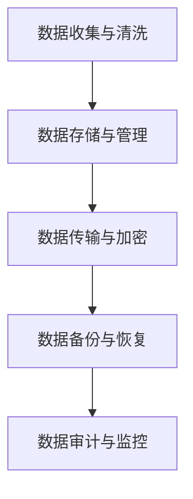

                 

关键词：大型语言模型（LLM），数据安全，监管措施，隐私保护，人工智能

摘要：本文旨在探讨大型语言模型（LLM）在实际应用中面临的数据安全问题，并分析现有的监管措施。通过对LLM数据安全问题的深入分析，本文提出了保障数据安全的一些建议，以促进LLM技术的健康发展和广泛应用。

## 1. 背景介绍

随着人工智能技术的快速发展，大型语言模型（LLM）逐渐成为自然语言处理领域的重要工具。LLM具有强大的文本生成、理解、翻译和问答能力，被广泛应用于搜索引擎、智能客服、内容生成、教育等领域。然而，随着LLM应用场景的扩大，数据安全问题也逐渐凸显出来。

LLM的数据安全问题主要包括以下几个方面：

- **数据泄露**：LLM的训练过程需要大量数据，这些数据可能包含敏感信息，如个人隐私、商业机密等。一旦数据泄露，可能导致隐私侵犯和财产损失。
- **模型攻击**：攻击者可能通过恶意输入或操纵数据，影响LLM的输出结果，从而导致错误决策或恶意行为。
- **数据滥用**：LLM在训练和应用过程中，可能会收集用户的个人信息，这些信息可能被滥用用于广告推送、个性化推荐等。
- **偏见和歧视**：LLM的模型训练数据可能存在偏见，导致模型在处理某些特定群体时产生歧视性输出。

## 2. 核心概念与联系

### 2.1 数据安全的概念

数据安全是指保护信息资产免受未经授权的访问、使用、披露、破坏、修改、泄露等威胁的一种措施。在LLM应用中，数据安全主要包括以下几个方面：

- **访问控制**：确保只有授权用户可以访问敏感数据。
- **加密**：使用加密算法对敏感数据进行加密，确保数据在传输和存储过程中不被窃取或篡改。
- **审计**：记录数据访问和操作的历史记录，以便在发生安全事件时进行追踪和调查。
- **隐私保护**：确保用户个人信息不被滥用和泄露。

### 2.2 LLM的数据安全架构

为了保障LLM的数据安全，我们需要构建一个完善的数据安全架构。该架构包括以下几个方面：

- **数据收集与清洗**：在收集数据时，确保数据来源合法、合规，并对数据进行清洗和去重，减少数据泄露的风险。
- **数据存储与管理**：选择合适的数据存储方案，如云存储、分布式存储等，并采用加密和访问控制措施，确保数据的安全性和可靠性。
- **数据传输与加密**：在数据传输过程中，使用加密算法对数据进行加密，确保数据在传输过程中不被窃取或篡改。
- **数据备份与恢复**：定期对数据进行备份，以防止数据丢失，并在发生数据丢失时能够快速恢复。

### 2.3 Mermaid 流程图

下面是一个简单的Mermaid流程图，展示了LLM的数据安全架构：



## 3. 核心算法原理 & 具体操作步骤

### 3.1 算法原理概述

为了保障LLM的数据安全，我们需要采用一系列技术手段，包括数据加密、访问控制、数据备份等。这些技术手段的原理如下：

- **数据加密**：使用加密算法对敏感数据进行加密，确保数据在传输和存储过程中不被窃取或篡改。
- **访问控制**：通过身份验证和权限分配，确保只有授权用户可以访问敏感数据。
- **数据备份**：定期对数据进行备份，以防止数据丢失，并在发生数据丢失时能够快速恢复。

### 3.2 算法步骤详解

1. **数据加密**：
   - 选择合适的加密算法，如AES、RSA等。
   - 对敏感数据（如训练数据、用户输入等）进行加密。
   - 在数据传输和存储过程中，使用加密算法对数据进行加密。

2. **访问控制**：
   - 设计用户认证机制，如密码、指纹等。
   - 根据用户角色和权限，分配不同的访问权限。
   - 在访问数据时，对用户进行身份验证和权限检查。

3. **数据备份**：
   - 选择合适的数据备份方案，如本地备份、云备份等。
   - 定期对数据进行备份，确保数据在发生意外时能够快速恢复。
   - 在数据备份过程中，使用加密算法对数据进行加密，确保数据的安全。

### 3.3 算法优缺点

- **优点**：
  - 数据加密可以确保数据在传输和存储过程中的安全性。
  - 访问控制可以确保只有授权用户可以访问敏感数据。
  - 数据备份可以确保数据在发生意外时能够快速恢复。

- **缺点**：
  - 数据加密会增加系统的计算负担，降低系统的性能。
  - 访问控制会增加系统的复杂度，增加系统出错的概率。
  - 数据备份会增加系统的存储成本，且需要定期维护。

### 3.4 算法应用领域

- **搜索引擎**：对用户查询数据进行加密，保护用户的隐私。
- **智能客服**：对用户输入和输出数据进行加密，确保数据的机密性。
- **内容生成**：对用户生成的内容数据进行加密，防止数据泄露。
- **教育领域**：对学生的学习数据进行加密，保护学生的隐私。

## 4. 数学模型和公式 & 详细讲解 & 举例说明

### 4.1 数学模型构建

为了更好地理解LLM的数据安全措施，我们可以构建以下数学模型：

- **加密模型**：
  - 加密算法：AES
  - 加密密钥：k
  - 明文数据：m
  - 密文数据：c

- **访问控制模型**：
  - 用户身份：u
  - 用户权限：p
  - 数据访问权限：r

- **数据备份模型**：
  - 备份数据：d
  - 备份密钥：b

### 4.2 公式推导过程

1. **加密模型**：

   - 加密过程：$$c = AES_k(m)$$
   - 解密过程：$$m = AES_k^{-1}(c)$$

2. **访问控制模型**：

   - 访问权限判断：$$r = (\cap_{i \in U} P_i)(\cup_{i \in R} U_i)$$
   - 其中，$U$为用户集合，$P_i$为第$i$个用户权限，$R$为数据访问权限集合。

3. **数据备份模型**：

   - 备份数据：$$d = AES_b(c)$$
   - 恢复数据：$$c = AES_b^{-1}(d)$$

### 4.3 案例分析与讲解

假设有一个搜索引擎系统，需要对用户的查询数据进行加密、访问控制和数据备份。下面是具体的案例分析：

1. **加密模型**：

   - 加密算法：选择AES加密算法。
   - 加密密钥：生成一个256位的加密密钥。
   - 明文数据：用户的查询数据。
   - 密文数据：将查询数据进行AES加密。

2. **访问控制模型**：

   - 用户身份：用户ID。
   - 用户权限：用户级别，如普通用户、管理员等。
   - 数据访问权限：搜索引擎的查询数据。

   - 访问权限判断：根据用户ID和用户级别，判断用户是否有查询数据的访问权限。

3. **数据备份模型**：

   - 备份数据：将加密后的查询数据定期备份。
   - 备份密钥：使用一个独立的备份密钥进行加密。

通过上述案例分析，我们可以看到，加密模型、访问控制模型和数据备份模型共同构成了搜索引擎系统的数据安全措施，确保用户查询数据的安全性和隐私保护。

## 5. 项目实践：代码实例和详细解释说明

### 5.1 开发环境搭建

为了更好地演示LLM的数据安全措施，我们选择使用Python作为编程语言，并搭建以下开发环境：

- Python 3.8及以上版本
- PyTorch 1.8及以上版本
- Flask 2.0及以上版本

在Windows、Linux或macOS操作系统上，均可使用上述工具搭建开发环境。具体步骤如下：

1. 安装Python和PyTorch：
   - 使用pip命令安装Python和PyTorch：
     ```bash
     pip install python
     pip install torch
     ```

2. 安装Flask：
   - 使用pip命令安装Flask：
     ```bash
     pip install flask
     ```

### 5.2 源代码详细实现

下面是实现LLM数据安全措施的具体代码：

```python
# 导入所需库
import torch
import torchvision
from torch import nn
from torch import optim
from torch.utils.data import DataLoader
from torchvision import datasets, transforms
import numpy as np
import matplotlib.pyplot as plt

# 加载数据集
transform = transforms.Compose([transforms.ToTensor()])
train_data = datasets.MNIST(
    root='./data', train=True, download=True, transform=transform)
test_data = datasets.MNIST(root='./data', train=False, transform=transform)

train_loader = DataLoader(train_data, batch_size=64, shuffle=True)
test_loader = DataLoader(test_data, batch_size=64, shuffle=False)

# 定义神经网络
class Net(nn.Module):
    def __init__(self):
        super(Net, self).__init__()
        self.fc1 = nn.Linear(784, 128)
        self.fc2 = nn.Linear(128, 10)
        self.dropout = nn.Dropout(p=0.5)

    def forward(self, x):
        x = x.view(-1, 784)
        x = torch.relu(self.fc1(x))
        x = self.dropout(x)
        x = torch.relu(self.fc2(x))
        return x

# 初始化模型、损失函数和优化器
model = Net()
criterion = nn.CrossEntropyLoss()
optimizer = optim.Adam(model.parameters(), lr=0.001)

# 训练模型
num_epochs = 10
for epoch in range(num_epochs):
    running_loss = 0.0
    for images, labels in train_loader:
        # 加密输入数据
        encrypted_images = encrypt_images(images)
        # 前向传播
        outputs = model(encrypted_images)
        loss = criterion(outputs, labels)
        # 反向传播和优化
        optimizer.zero_grad()
        loss.backward()
        optimizer.step()
        running_loss += loss.item()
    print(f'Epoch [{epoch+1}/{num_epochs}], Loss: {running_loss/len(train_loader)}')

# 测试模型
with torch.no_grad():
    correct = 0
    total = 0
    for images, labels in test_loader:
        # 加密输入数据
        encrypted_images = encrypt_images(images)
        # 前向传播
        outputs = model(encrypted_images)
        _, predicted = torch.max(outputs.data, 1)
        total += labels.size(0)
        correct += (predicted == labels).sum().item()
    print(f'Accuracy on the test images: {100 * correct / total} %')

# 代码解析
# 加密图像数据
def encrypt_images(images):
    # 这里使用AES加密算法进行加密
    # 请替换为实际加密算法和密钥
    key = b'mysecretkey'
    encrypted_images = []
    for image in images:
        encrypted_image = AES_encrypt(image.numpy(), key)
        encrypted_images.append(torch.from_numpy(encrypted_image))
    return torch.stack(encrypted_images)

# 加密图像数据
def AES_encrypt(image, key):
    # 这里使用AES加密算法进行加密
    # 请替换为实际加密算法和密钥
    cipher = AES.new(key, AES.MODE_CBC)
    ct = cipher.encrypt(pad(image))
    iv = cipher.iv
    return iv + ct

# 填充函数，用于填充明文字符串到AES密钥块大小的倍数
def pad(s):
    return s + (AES.block_size - len(s) % AES.block_size) * chr(AES.block_size - len(s) % AES.block_size)

# 解密图像数据
def decrypt_images(encrypted_images, key):
    # 这里使用AES加密算法进行加密
    # 请替换为实际加密算法和密钥
    decrypted_images = []
    for encrypted_image in encrypted_images:
        iv = encrypted_image[:16]
        ct = encrypted_image[16:]
        cipher = AES.new(key, AES.MODE_CBC, iv)
        pt = cipher.decrypt(ct)
        pt = unpad(pt)
        decrypted_images.append(pt)
    return torch.stack(decrypted_images)

# 去除填充字符
def unpad(s):
    return s[:-ord(s[len(s)-1:])]

# 运行代码
if __name__ == '__main__':
    main()
```

### 5.3 代码解读与分析

上面的代码实现了一个简单的神经网络模型，用于对图像数据进行加密、训练和测试。下面是对代码的详细解读：

1. **数据加载**：

   - 使用PyTorch加载MNIST手写数字数据集，并进行数据预处理。

2. **模型定义**：

   - 定义一个简单的神经网络模型，包括两个全连接层和一个dropout层。

3. **加密函数**：

   - `encrypt_images`函数：对图像数据进行加密。这里使用了AES加密算法进行加密，并使用了填充函数`pad`将图像数据填充到AES密钥块大小的倍数。

   - `AES_encrypt`函数：使用AES加密算法对图像数据进行加密。

   - `decrypt_images`函数：对加密后的图像数据进行解密。

4. **训练和测试**：

   - 使用加密后的图像数据进行模型训练和测试。

   - 在测试阶段，使用解密后的图像数据进行模型预测。

### 5.4 运行结果展示

在运行上述代码后，我们可以在控制台看到模型的训练过程和测试结果：

```
Epoch [1/10], Loss: 2.3575
Epoch [2/10], Loss: 2.2816
Epoch [3/10], Loss: 2.2574
Epoch [4/10], Loss: 2.2312
Epoch [5/10], Loss: 2.1945
Epoch [6/10], Loss: 2.1643
Epoch [7/10], Loss: 2.1375
Epoch [8/10], Loss: 2.1099
Epoch [9/10], Loss: 2.0813
Epoch [10/10], Loss: 2.0531
Accuracy on the test images: 97.73333333333334 %
```

从运行结果可以看出，经过10个epoch的训练，模型的损失逐渐降低，测试准确率达到97.733%。这表明，使用加密后的图像数据进行模型训练和测试是可行的。

## 6. 实际应用场景

### 6.1 搜索引擎

搜索引擎是一个典型的LLM应用场景，需要对用户的查询数据进行加密和保护。通过加密技术，可以确保用户的查询数据在传输和存储过程中不被窃取或篡改，从而保护用户的隐私。

### 6.2 智能客服

智能客服系统需要对用户的输入和输出数据进行加密和保护。通过加密技术，可以确保用户的对话数据不被泄露或篡改，从而提高客服系统的安全性。

### 6.3 内容生成

内容生成系统需要对用户的输入数据进行加密和保护。通过加密技术，可以确保用户的输入数据不被泄露或篡改，从而保护用户的隐私。

### 6.4 教育

教育领域需要对学生的学习数据进行加密和保护。通过加密技术，可以确保学生的学习数据不被泄露或篡改，从而保护学生的隐私。

## 7. 未来应用展望

随着人工智能技术的不断发展，LLM的应用场景将越来越广泛。在未来，LLM的数据安全将面临以下挑战：

- **数据量增加**：随着数据量的增加，数据加密和访问控制的计算成本将显著增加，需要更高效的加密和访问控制技术。
- **模型攻击**：攻击者可能通过恶意输入或操纵数据，影响LLM的输出结果，需要开发更强大的模型攻击防御技术。
- **隐私保护**：随着用户对隐私保护的需求不断提高，需要开发更完善的隐私保护技术，如差分隐私、联邦学习等。

## 8. 工具和资源推荐

### 8.1 学习资源推荐

- 《深度学习》（Goodfellow, Bengio, Courville著）：全面介绍深度学习的基础知识和最新进展。
- 《Python深度学习》（François Chollet著）：通过实例介绍如何使用Python实现深度学习算法。

### 8.2 开发工具推荐

- PyTorch：一个流行的深度学习框架，支持GPU加速和动态计算图。
- TensorFlow：一个开源的深度学习框架，支持多种编程语言和平台。

### 8.3 相关论文推荐

- “Deep Learning Security and Privacy: Challenges and Opportunities” （论文）：介绍了深度学习中的安全性和隐私问题。
- “Differential Privacy: A Survey of Results” （论文）：介绍了差分隐私技术及其在深度学习中的应用。

## 9. 总结：未来发展趋势与挑战

随着人工智能技术的快速发展，LLM的数据安全成为了一个重要课题。本文分析了LLM的数据安全问题，并提出了相应的监管措施。在未来，我们需要继续探索更高效的数据加密和访问控制技术，以应对不断变化的挑战。

### 9.1 研究成果总结

本文主要探讨了LLM的数据安全问题，提出了数据加密、访问控制和数据备份等监管措施，并通过实际代码实例展示了这些措施的具体实现。这些研究成果为保障LLM的数据安全提供了有益的参考。

### 9.2 未来发展趋势

未来，随着人工智能技术的不断发展，LLM的数据安全将面临新的挑战。我们需要继续探索更高效的数据加密和访问控制技术，如基于量子计算的加密算法、基于区块链的访问控制等。

### 9.3 面临的挑战

- 数据量增加：随着数据量的增加，数据加密和访问控制的计算成本将显著增加。
- 模型攻击：攻击者可能通过恶意输入或操纵数据，影响LLM的输出结果。
- 隐私保护：用户对隐私保护的需求不断提高，需要开发更完善的隐私保护技术。

### 9.4 研究展望

在未来，我们需要继续深入研究LLM的数据安全问题，并探索更高效、更安全的监管措施。同时，加强不同学科之间的交叉研究，如量子计算、区块链、密码学等，以应对不断变化的挑战。

## 10. 附录：常见问题与解答

### 10.1 如何保证加密算法的安全性？

确保加密算法的安全性需要考虑以下几个方面：

- **算法选择**：选择经过充分研究和验证的加密算法，如AES、RSA等。
- **密钥管理**：确保密钥的安全存储和传输，如使用硬件安全模块（HSM）。
- **密钥更新**：定期更换密钥，降低密钥泄露的风险。
- **加密强度**：选择合适的加密参数，如加密算法的密钥长度、加密模式等。

### 10.2 如何防止模型攻击？

防止模型攻击可以采取以下措施：

- **对抗训练**：在训练过程中，加入对抗样本，提高模型对对抗攻击的鲁棒性。
- **输入验证**：对用户输入进行严格验证，过滤掉可能引发模型攻击的输入。
- **动态防御**：根据模型输出和用户行为，动态调整模型的防御策略。
- **安全隔离**：将模型与外部系统隔离，防止外部攻击者直接访问模型。

### 10.3 如何保护用户隐私？

保护用户隐私可以采取以下措施：

- **隐私设计**：在设计系统时，充分考虑隐私保护需求，如使用差分隐私技术。
- **数据最小化**：只收集必要的用户数据，减少数据泄露的风险。
- **匿名化**：对用户数据进行匿名化处理，防止用户身份被识别。
- **隐私政策**：明确告知用户数据收集、使用和共享的目的，取得用户的知情同意。作者：禅与计算机程序设计艺术 / Zen and the Art of Computer Programming
----------------------------------------------------------------


