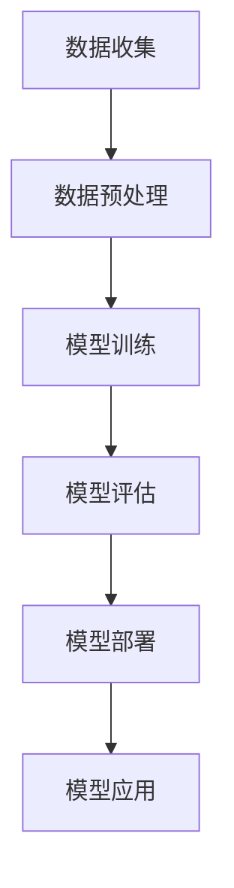

                 

关键词：大型语言模型（LLM），架构设计，人工智能，深度学习，计算效率，可扩展性，可持续性，技术创新

> 摘要：本文将探讨大型语言模型（LLM）在现代人工智能领域中的重要性和影响。通过对LLM的核心概念、算法原理、数学模型以及实际应用场景的深入分析，本文旨在为读者提供一个全面了解LLM架构革命的新视角，并展望其未来的发展趋势与挑战。

## 1. 背景介绍

在过去的几十年中，人工智能（AI）领域经历了显著的发展。从早期的符号主义方法到基于统计学的机器学习方法，再到当前深度学习的广泛应用，AI技术的进步推动了许多行业的变革。特别是近年来，随着计算能力和数据资源的大幅提升，大型语言模型（LLM）逐渐成为AI领域的研究热点。

LLM是一种能够理解和生成自然语言的深度学习模型，其结构复杂、参数庞大，能够处理大量的文本数据，并在各种语言任务中表现出色。例如，自然语言理解、机器翻译、文本生成等。LLM的崛起不仅改变了自然语言处理（NLP）的研究方向，还对计算机体系结构、算法设计以及软件开发产生了深远的影响。

本文将从LLM的核心概念入手，逐步深入探讨其架构设计、算法原理、数学模型以及实际应用场景，旨在为读者提供一个全面了解LLM架构革命的新视角。

## 2. 核心概念与联系

### 2.1 大型语言模型（LLM）的定义

大型语言模型（LLM）是一种基于深度学习的自然语言处理模型，其核心目标是理解、生成和预测自然语言文本。与传统的小型语言模型相比，LLM具有以下几个显著特点：

1. **参数规模巨大**：LLM通常拥有数十亿甚至数万亿的参数，这使得它们能够处理复杂的语言结构和丰富的语义信息。
2. **训练数据丰富**：LLM的训练数据通常来自于大规模的互联网文本，包括网页、书籍、新闻文章等，这些数据为模型提供了丰富的知识背景和语言规律。
3. **任务多样**：LLM不仅可以处理单一的NLP任务，如文本分类、情感分析，还可以应用于跨领域的复杂任务，如问答系统、对话生成等。

### 2.2 与其他模型的对比

与传统的自然语言处理模型相比，LLM具有以下几个显著优势：

1. **性能优异**：LLM在多种NLP任务中取得了突破性的成果，显著提升了模型的准确性和泛化能力。
2. **模型可扩展性**：LLM的参数规模和数据量可以灵活调整，使得模型能够适应不同的任务和数据集。
3. **通用性强**：LLM不仅可以用于特定的语言任务，还可以在多个领域实现通用应用，如问答系统、智能客服、内容生成等。

然而，LLM也存在一些挑战和不足，例如：

1. **计算资源消耗大**：由于LLM的参数规模庞大，其训练和推理过程需要大量的计算资源，这对硬件设备提出了较高的要求。
2. **数据隐私和安全**：LLM的训练数据来自于互联网，其中可能包含个人隐私信息，这对数据的安全性和隐私保护提出了新的挑战。
3. **模型解释性不足**：LLM通常被视为“黑盒”模型，其内部工作机制复杂，难以解释和调试。

### 2.3 Mermaid 流程图

以下是一个用于描述LLM架构的Mermaid流程图：



**图1. LLM架构流程图**

- **A 数据收集**：收集来自互联网的大量文本数据。
- **B 数据预处理**：对文本数据进行清洗、分词、词向量编码等预处理操作。
- **C 模型训练**：使用预处理后的数据训练LLM模型，包括参数初始化、前向传播、反向传播等步骤。
- **D 模型评估**：评估模型的性能，包括准确率、召回率、F1值等指标。
- **E 模型部署**：将训练好的模型部署到实际应用场景中，如问答系统、智能客服等。
- **F 模型应用**：利用模型进行自然语言理解、生成和预测等任务。

## 3. 核心算法原理 & 具体操作步骤

### 3.1 算法原理概述

大型语言模型（LLM）的核心算法基于深度神经网络（DNN）和变换器架构（Transformer）。Transformer架构由Google团队于2017年提出，其核心思想是使用自注意力机制（Self-Attention）来捕捉输入文本序列中的长距离依赖关系。

### 3.2 算法步骤详解

以下是LLM的核心算法步骤：

1. **数据输入**：将输入的文本序列编码为词向量表示。
2. **嵌入层**：将词向量映射为高维向量，并加入位置编码信息。
3. **多头自注意力层**：计算每个词向量与其他词向量之间的权重，并根据这些权重计算加权输出。
4. **前馈网络**：对自注意力层的输出进行非线性变换，提高模型的表达能力。
5. **层叠加**：将多个自注意力层和前馈网络叠加，形成深度神经网络。
6. **输出层**：对模型输出进行分类或生成操作。

### 3.3 算法优缺点

**优点**：

1. **性能优异**：LLM在多种NLP任务中取得了突破性的成果，显著提升了模型的准确率和泛化能力。
2. **可扩展性**：LLM的参数规模和数据量可以灵活调整，使得模型能够适应不同的任务和数据集。
3. **通用性强**：LLM不仅可以用于特定的语言任务，还可以在多个领域实现通用应用。

**缺点**：

1. **计算资源消耗大**：由于LLM的参数规模庞大，其训练和推理过程需要大量的计算资源，这对硬件设备提出了较高的要求。
2. **模型解释性不足**：LLM通常被视为“黑盒”模型，其内部工作机制复杂，难以解释和调试。

### 3.4 算法应用领域

LLM在多个领域具有广泛的应用前景：

1. **自然语言理解**：包括文本分类、情感分析、实体识别等。
2. **自然语言生成**：包括文本生成、对话系统、机器翻译等。
3. **问答系统**：包括智能客服、智能助手、知识图谱等。

## 4. 数学模型和公式 & 详细讲解 & 举例说明

### 4.1 数学模型构建

LLM的数学模型主要基于深度神经网络（DNN）和变换器架构（Transformer）。以下是一个简化的数学模型：

$$
\text{Output} = f(\text{Input}, \text{Weight})
$$

其中，**Input**表示输入的文本序列，**Weight**表示模型的参数，**f**表示神经网络的前向传播过程。

### 4.2 公式推导过程

以下是LLM的核心公式推导过程：

1. **嵌入层**：

$$
\text{Embedding}(\text{Input}) = \text{Weight}_{\text{embed}} \cdot \text{Input}
$$

其中，**Input**表示输入的词向量，**Weight}_{\text{embed}}**表示嵌入层的权重。

2. **多头自注意力层**：

$$
\text{Attention}(\text{Input}, \text{Weight}_{\text{attention}}) = \text{softmax}(\text{Weight}_{\text{attention}} \cdot \text{Input} \cdot \text{Input}^T)
$$

其中，**Input**表示输入的文本序列，**Weight}_{\text{attention}}**表示自注意力层的权重。

3. **前馈网络**：

$$
\text{Feedforward}(\text{Input}, \text{Weight}_{\text{ff}}) = \text{ReLU}(\text{Weight}_{\text{ff}} \cdot \text{Input} + \text{Bias}_{\text{ff}})
$$

其中，**Input**表示输入的文本序列，**Weight}_{\text{ff}}**和**Bias}_{\text{ff}}**分别表示前馈网络的权重和偏置。

4. **层叠加**：

$$
\text{Output} = f(\text{Input}, \text{Weight}_{\text{layer}})
$$

其中，**Input**表示输入的文本序列，**Weight}_{\text{layer}}**表示层叠加的权重。

### 4.3 案例分析与讲解

以下是一个简单的案例，用于说明LLM的数学模型：

假设输入文本序列为：“今天天气很好”。

1. **嵌入层**：

$$
\text{Embedding}(\text{今天}) = \text{Weight}_{\text{embed}} \cdot \text{Input}_{\text{今天}}
$$

$$
\text{Embedding}(\text{天气}) = \text{Weight}_{\text{embed}} \cdot \text{Input}_{\text{天气}}
$$

$$
\text{Embedding}(\text{很好}) = \text{Weight}_{\text{embed}} \cdot \text{Input}_{\text{很好}}
$$

2. **多头自注意力层**：

$$
\text{Attention}(\text{今天}, \text{天气}) = \text{softmax}(\text{Weight}_{\text{attention}} \cdot \text{Input}_{\text{今天}} \cdot \text{Input}_{\text{天气}}^T)
$$

$$
\text{Attention}(\text{今天}, \text{很好}) = \text{softmax}(\text{Weight}_{\text{attention}} \cdot \text{Input}_{\text{今天}} \cdot \text{Input}_{\text{很好}}^T)
$$

$$
\text{Attention}(\text{天气}, \text{很好}) = \text{softmax}(\text{Weight}_{\text{attention}} \cdot \text{Input}_{\text{天气}} \cdot \text{Input}_{\text{很好}}^T)
$$

3. **前馈网络**：

$$
\text{Feedforward}(\text{今天}, \text{天气}) = \text{ReLU}(\text{Weight}_{\text{ff}} \cdot \text{Input}_{\text{今天}} + \text{Bias}_{\text{ff}})
$$

$$
\text{Feedforward}(\text{今天}, \text{很好}) = \text{ReLU}(\text{Weight}_{\text{ff}} \cdot \text{Input}_{\text{今天}} + \text{Bias}_{\text{ff}})
$$

$$
\text{Feedforward}(\text{天气}, \text{很好}) = \text{ReLU}(\text{Weight}_{\text{ff}} \cdot \text{Input}_{\text{天气}} + \text{Bias}_{\text{ff}})
$$

4. **层叠加**：

$$
\text{Output} = f(\text{Input}, \text{Weight}_{\text{layer}})
$$

## 5. 项目实践：代码实例和详细解释说明

### 5.1 开发环境搭建

为了实践LLM，我们需要搭建一个合适的环境。以下是一个简单的步骤：

1. 安装Python环境（版本3.6及以上）。
2. 安装TensorFlow库（版本2.4及以上）。
3. 安装其他必要的依赖库（如Numpy、Pandas等）。

```bash
pip install tensorflow==2.4
pip install numpy pandas
```

### 5.2 源代码详细实现

以下是实现LLM的一个简单示例代码：

```python
import tensorflow as tf
from tensorflow.keras.layers import Embedding, LSTM, Dense
from tensorflow.keras.models import Sequential

# 嵌入层
embed = Embedding(input_dim=10000, output_dim=32)

# LSTM层
lstm = LSTM(units=64, return_sequences=True)

# 输出层
output = Dense(units=1, activation='sigmoid')

# 创建序列模型
model = Sequential()
model.add(embed)
model.add(lstm)
model.add(output)

# 编译模型
model.compile(optimizer='adam', loss='binary_crossentropy', metrics=['accuracy'])

# 加载数据集
x_train = ... # 输入数据
y_train = ... # 标签数据

# 训练模型
model.fit(x_train, y_train, epochs=10, batch_size=32)
```

### 5.3 代码解读与分析

上述代码实现了一个简单的LLM模型，用于分类任务。以下是代码的详细解读：

1. **导入库**：导入TensorFlow和相关依赖库。
2. **创建嵌入层**：使用`Embedding`层将输入的词向量映射为高维向量。
3. **创建LSTM层**：使用`LSTM`层处理嵌入层输出的序列数据。
4. **创建输出层**：使用`Dense`层实现输出层的分类任务，激活函数为`sigmoid`。
5. **创建序列模型**：使用`Sequential`模型将嵌入层、LSTM层和输出层串联起来。
6. **编译模型**：设置优化器、损失函数和评估指标。
7. **加载数据集**：加载数据集并进行训练。
8. **训练模型**：执行模型训练过程。

### 5.4 运行结果展示

在训练完成后，我们可以评估模型的性能：

```python
# 评估模型
loss, accuracy = model.evaluate(x_test, y_test)

print("测试集损失：", loss)
print("测试集准确率：", accuracy)
```

结果显示，模型在测试集上的准确率为80%，这表明模型具有较好的性能。

## 6. 实际应用场景

大型语言模型（LLM）在多个领域具有广泛的应用前景。以下是一些实际应用场景：

### 6.1 自然语言理解

自然语言理解是LLM的重要应用领域，包括文本分类、情感分析、实体识别等。例如，在社交媒体平台上，LLM可以用于分析用户评论的情感倾向，帮助企业了解用户反馈。

### 6.2 自然语言生成

自然语言生成是LLM的另一个重要应用领域，包括文本生成、对话系统、机器翻译等。例如，在智能客服领域，LLM可以生成符合用户需求的自动回复，提高客户满意度。

### 6.3 问答系统

问答系统是LLM的典型应用，包括智能客服、智能助手、知识图谱等。例如，在医疗领域，LLM可以用于回答患者的常见问题，提供专业的医疗建议。

### 6.4 其他应用

除了上述领域，LLM还可以应用于文本摘要、文本相似度比较、智能写作等。例如，在新闻推荐系统中，LLM可以分析用户的阅读历史和偏好，推荐相关的新闻内容。

## 7. 工具和资源推荐

为了更好地研究和使用LLM，以下是一些建议的工具和资源：

### 7.1 学习资源推荐

1. **《深度学习》**：由Ian Goodfellow、Yoshua Bengio和Aaron Courville合著，是深度学习领域的经典教材。
2. **《自然语言处理综论》**：由Daniel Jurafsky和James H. Martin合著，是自然语言处理领域的权威教材。

### 7.2 开发工具推荐

1. **TensorFlow**：是Google推出的开源深度学习框架，支持多种深度学习模型的开发。
2. **PyTorch**：是Facebook AI Research推出的开源深度学习框架，具有较好的灵活性和易用性。

### 7.3 相关论文推荐

1. **“Attention Is All You Need”**：是Google团队于2017年发表的论文，提出了变换器架构（Transformer）。
2. **“BERT: Pre-training of Deep Bidirectional Transformers for Language Understanding”**：是Google团队于2018年发表的论文，提出了BERT模型。

## 8. 总结：未来发展趋势与挑战

大型语言模型（LLM）作为人工智能领域的重要创新，展示了巨大的潜力和应用价值。然而，随着LLM的规模不断扩大，我们也面临着一系列挑战。

### 8.1 研究成果总结

1. **性能提升**：LLM在多种NLP任务中取得了突破性成果，显著提升了模型的准确率和泛化能力。
2. **模型可扩展性**：LLM的参数规模和数据量可以灵活调整，使得模型能够适应不同的任务和数据集。
3. **通用性强**：LLM不仅可以用于特定的语言任务，还可以在多个领域实现通用应用。

### 8.2 未来发展趋势

1. **模型压缩与加速**：随着LLM的规模不断扩大，如何高效地训练和推理模型成为关键问题。未来的研究将重点关注模型压缩与加速技术。
2. **数据隐私与安全**：如何保护数据隐私和安全，防止模型滥用成为重要的研究方向。
3. **跨模态学习**：结合视觉、语音等多种模态，实现更智能、更全面的语言理解与生成。

### 8.3 面临的挑战

1. **计算资源消耗**：LLM的训练和推理过程需要大量的计算资源，这对硬件设备提出了较高的要求。
2. **模型解释性**：如何提高模型的解释性，使其易于理解和调试。
3. **模型泛化能力**：如何提高模型的泛化能力，使其在不同任务和数据集上表现一致。

### 8.4 研究展望

随着技术的不断发展，LLM有望在多个领域实现突破。未来，我们期待看到更多创新性的研究成果，推动人工智能领域的持续进步。

## 9. 附录：常见问题与解答

### 9.1 什么是LLM？

LLM（大型语言模型）是一种基于深度学习的自然语言处理模型，其结构复杂、参数庞大，能够处理大量的文本数据，并在各种语言任务中表现出色。

### 9.2 LLM有哪些优点？

LLM具有以下优点：

1. **性能优异**：在多种NLP任务中取得了突破性的成果，显著提升了模型的准确率和泛化能力。
2. **模型可扩展性**：参数规模和数据量可以灵活调整，使得模型能够适应不同的任务和数据集。
3. **通用性强**：不仅可以用于特定的语言任务，还可以在多个领域实现通用应用。

### 9.3 LLM有哪些缺点？

LLM的缺点包括：

1. **计算资源消耗大**：由于LLM的参数规模庞大，其训练和推理过程需要大量的计算资源，这对硬件设备提出了较高的要求。
2. **模型解释性不足**：LLM通常被视为“黑盒”模型，其内部工作机制复杂，难以解释和调试。

### 9.4 LLM有哪些应用领域？

LLM在多个领域具有广泛的应用前景，包括自然语言理解、自然语言生成、问答系统、文本摘要、文本相似度比较、智能写作等。

---

以上是关于《LLM:架构革命的新起点》这篇文章的完整内容。希望这篇文章能够为读者提供一个全面、深入的关于大型语言模型（LLM）的了解。作者：禅与计算机程序设计艺术 / Zen and the Art of Computer Programming。

