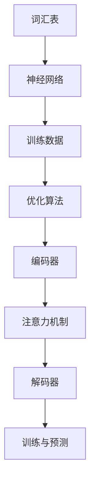

                 

关键词：大规模语言模型（LLM），计算机架构，机器学习，深度学习，人工智能

摘要：本文深入探讨了大规模语言模型（LLM）对计算机架构的变革性影响。首先，我们介绍了LLM的基本概念和架构，然后分析了其核心算法原理和数学模型。通过代码实例和详细解释，我们展示了LLM的应用实践。最后，我们对LLM在实际应用场景中的表现进行了分析，并展望了其未来的发展趋势和面临的挑战。

## 1. 背景介绍

随着互联网的普及和大数据技术的发展，计算机处理能力逐渐向海量数据、高并发、实时处理等方向演进。在这一背景下，机器学习，尤其是深度学习技术取得了飞速发展。其中，大规模语言模型（LLM）作为一种新型的机器学习模型，受到了广泛关注。

LLM是指通过大量语言数据进行训练，具有强大语言理解和生成能力的语言模型。它能够理解自然语言，生成自然语言，甚至在特定领域进行推理和决策。LLM的出现，为自然语言处理（NLP）领域带来了革命性的变革，极大地提高了NLP任务的处理效率和质量。

本文旨在探讨LLM对计算机架构的变革性影响，分析其核心算法原理和数学模型，并通过代码实例和实际应用场景，展示LLM在实际开发中的优势和应用前景。

## 2. 核心概念与联系

### 2.1. 大规模语言模型的基本概念

大规模语言模型（LLM）是一种基于神经网络的语言模型，通过训练大量文本数据，学习到语言的统计规律和语义信息。LLM的基本概念包括：

- **词汇表**：词汇表是语言模型的基础，它包含了模型中所有可能的词汇和符号。在训练过程中，模型会根据词汇表中的词汇来构建语言序列。

- **神经网络**：神经网络是LLM的核心组成部分，它由多个层次（层）组成。每一层由多个神经元（节点）构成，神经元之间通过权重连接。神经网络通过学习数据中的特征和模式，实现了对语言的理解和生成。

- **训练数据**：训练数据是LLM训练的基础，它包含了大量的文本数据。这些数据可以来自互联网、书籍、新闻、社交媒体等来源。通过分析训练数据，模型可以学习到语言的统计规律和语义信息。

- **优化算法**：优化算法是训练神经网络的关键，它通过迭代更新神经网络的权重，使得模型在训练数据上达到最优性能。常用的优化算法包括梯度下降、Adam等。

### 2.2. 大规模语言模型的架构

大规模语言模型（LLM）的架构通常包括以下几个部分：

- **编码器（Encoder）**：编码器负责将输入的文本序列编码成固定长度的向量。编码器通常由多个神经网络层组成，通过反向传播算法不断优化权重，使得编码器能够更好地捕捉输入文本的语义信息。

- **解码器（Decoder）**：解码器负责将编码器输出的固定长度向量解码成输出文本序列。解码器同样由多个神经网络层组成，通过学习输入和输出的对应关系，实现文本的生成。

- **注意力机制（Attention Mechanism）**：注意力机制是LLM中的一种关键技术，它能够使得模型在生成文本时，关注到输入文本中重要的信息。注意力机制通过计算输入文本和编码器输出之间的相似度，为每个输入文本分配不同的权重，从而使得模型能够更好地捕捉输入文本的语义信息。

- **训练与预测**：训练过程是通过不断迭代优化模型的权重，使得模型在训练数据上达到最优性能。预测过程是通过给定输入文本，利用训练好的模型生成输出文本。

### 2.3. 核心概念原理和架构的 Mermaid 流程图

下面是大规模语言模型（LLM）的核心概念原理和架构的 Mermaid 流程图：



## 3. 核心算法原理 & 具体操作步骤

### 3.1. 算法原理概述

大规模语言模型（LLM）的核心算法是基于神经网络和深度学习的。LLM通过训练大量文本数据，学习到语言的统计规律和语义信息，从而实现对自然语言的建模。

LLM的算法原理主要包括以下几个步骤：

1. **数据预处理**：对输入的文本数据进行预处理，包括分词、去停用词、词干提取等操作，将文本数据转化为适合训练的格式。

2. **编码**：将预处理后的文本数据输入到编码器中，编码器将文本序列编码成固定长度的向量。编码器的输出是编码后的文本向量。

3. **注意力机制**：注意力机制通过对输入文本和编码器输出之间的相似度计算，为每个输入文本分配不同的权重，从而使得模型能够更好地捕捉输入文本的语义信息。

4. **解码**：将编码器输出的固定长度向量输入到解码器中，解码器通过学习输入和输出的对应关系，生成输出文本序列。

5. **优化**：通过反向传播算法，不断迭代优化模型的权重，使得模型在训练数据上达到最优性能。

### 3.2. 算法步骤详解

下面是大规模语言模型（LLM）的具体算法步骤：

1. **数据预处理**：

   - 分词：将输入的文本数据按照单词或字符进行切分，形成单词序列或字符序列。
   - 去停用词：去除对文本理解无意义的停用词，如“的”、“了”等。
   - 词干提取：将单词还原为最简单的形式，如“playing”还原为“play”。
   - 转化为索引：将处理后的文本数据转化为数字索引，方便神经网络处理。

2. **编码**：

   - 输入编码：将处理后的文本数据输入到编码器中，编码器将文本序列编码成固定长度的向量。
   - 编码器输出：编码器的输出是编码后的文本向量，该向量包含了文本的语义信息。

3. **注意力机制**：

   - 相似度计算：计算编码器输出和输入之间的相似度，得到每个输入文本的权重。
   - 权重分配：根据相似度计算结果，为每个输入文本分配不同的权重，使得模型能够更好地捕捉输入文本的语义信息。

4. **解码**：

   - 输入解码：将编码器输出输入到解码器中，解码器通过学习输入和输出的对应关系，生成输出文本序列。
   - 解码器输出：解码器的输出是生成后的文本序列，该序列是模型对输入文本的理解和表达。

5. **优化**：

   - 反向传播：通过反向传播算法，计算模型预测值和实际值之间的误差，并更新模型的权重。
   - 迭代优化：不断迭代优化模型的权重，使得模型在训练数据上达到最优性能。

### 3.3. 算法优缺点

大规模语言模型（LLM）的优点包括：

- **强大的语言理解能力**：通过训练大量文本数据，LLM能够学习到语言的统计规律和语义信息，从而实现对自然语言的深刻理解。
- **高效的文本生成能力**：LLM通过编码器和解码器的配合，能够高效地生成高质量的文本序列，满足各种自然语言生成任务的需求。

大规模语言模型（LLM）的缺点包括：

- **计算资源消耗大**：由于LLM的训练和预测过程涉及大量的矩阵运算，因此对计算资源的要求较高，训练时间较长。
- **数据依赖性强**：LLM的训练效果依赖于训练数据的质量和数量，如果训练数据存在偏差或不足，可能导致模型的效果不佳。

### 3.4. 算法应用领域

大规模语言模型（LLM）在多个领域具有广泛的应用：

- **自然语言处理（NLP）**：LLM能够用于文本分类、情感分析、机器翻译、文本生成等NLP任务，显著提高任务的处理效率和准确性。
- **智能客服**：LLM能够用于构建智能客服系统，实现对用户问题的理解和自动回答，提供高效、准确的客户服务。
- **教育领域**：LLM能够用于智能教育，根据学生的学习情况和需求，生成个性化的学习内容和教学方案。
- **创意写作**：LLM能够用于生成小说、诗歌等文学作品，为创意写作提供新的思路和工具。

## 4. 数学模型和公式 & 详细讲解 & 举例说明

### 4.1. 数学模型构建

大规模语言模型（LLM）的数学模型主要包括神经网络模型和注意力机制。

1. **神经网络模型**

神经网络模型主要由多层感知器（MLP）组成，每一层由多个神经元构成。神经元的激活函数通常为Sigmoid函数或ReLU函数。

设输入层为\( X \)，输出层为\( Y \)，隐藏层为\( H \)，则有：

$$
H = \sigma(W_1 \cdot X + b_1)
$$

$$
Y = \sigma(W_2 \cdot H + b_2)
$$

其中，\( \sigma \)为激活函数，\( W_1 \)、\( W_2 \)为权重矩阵，\( b_1 \)、\( b_2 \)为偏置项。

2. **注意力机制**

注意力机制是一种用于计算输入和输出之间相似度的机制，其核心思想是为每个输入分配不同的权重。设输入为\( X \)，输出为\( Y \)，则有：

$$
A = \text{softmax}(W_a \cdot X \cdot Y^T)
$$

其中，\( W_a \)为权重矩阵，\( \text{softmax} \)函数用于将输入映射到概率分布。

### 4.2. 公式推导过程

1. **神经网络模型**

假设输入层为\( X \)，输出层为\( Y \)，隐藏层为\( H \)，则有：

$$
H = \sigma(W_1 \cdot X + b_1)
$$

$$
Y = \sigma(W_2 \cdot H + b_2)
$$

其中，\( \sigma \)为Sigmoid函数，\( W_1 \)、\( W_2 \)为权重矩阵，\( b_1 \)、\( b_2 \)为偏置项。

为了简化推导，我们假设隐藏层和输出层都是单层神经网络。

2. **反向传播算法**

反向传播算法是一种用于优化神经网络权重的算法，其核心思想是通过计算输出层和隐藏层之间的误差，不断更新权重和偏置项。

设输入层为\( X \)，输出层为\( Y \)，隐藏层为\( H \)，误差函数为\( J \)，则有：

$$
\delta_H = \frac{\partial J}{\partial H}
$$

$$
\delta_W = \frac{\partial J}{\partial W}
$$

$$
\delta_b = \frac{\partial J}{\partial b}
$$

其中，\( \delta_H \)、\( \delta_W \)、\( \delta_b \)分别为隐藏层、权重矩阵、偏置项的误差。

3. **注意力机制**

注意力机制是一种用于计算输入和输出之间相似度的机制，其核心思想是为每个输入分配不同的权重。设输入为\( X \)，输出为\( Y \)，则有：

$$
A = \text{softmax}(W_a \cdot X \cdot Y^T)
$$

其中，\( W_a \)为权重矩阵，\( \text{softmax} \)函数用于将输入映射到概率分布。

### 4.3. 案例分析与讲解

假设我们有一个简单的文本分类任务，需要判断一段文本属于“科技”类别还是“娱乐”类别。我们将使用大规模语言模型（LLM）进行文本分类，并分析其分类效果。

1. **数据准备**

我们准备了一个包含1000篇文本的数据集，每篇文本都包含了类别标签（“科技”或“娱乐”）。我们将数据集划分为训练集和测试集。

2. **数据预处理**

对文本数据进行预处理，包括分词、去停用词、词干提取等操作，将文本数据转化为数字索引。

3. **模型构建**

构建一个包含多层感知器的神经网络模型，用于文本分类。神经网络模型包含输入层、隐藏层和输出层。输入层包含文本的数字索引，隐藏层通过学习文本的统计规律和语义信息，输出层用于生成文本的类别标签。

4. **模型训练**

使用训练集对神经网络模型进行训练，通过反向传播算法不断优化模型的权重和偏置项，使得模型在训练数据上达到最优性能。

5. **模型评估**

使用测试集对训练好的模型进行评估，计算模型的准确率、召回率等指标。

6. **模型应用**

将训练好的模型应用到实际文本分类任务中，对新的文本进行分类，判断其类别标签。

通过以上步骤，我们使用大规模语言模型（LLM）实现了一个简单的文本分类任务。在实际应用中，LLM能够通过对大量文本数据的训练，学习到语言的统计规律和语义信息，从而实现高效、准确的文本分类。

## 5. 项目实践：代码实例和详细解释说明

在本节中，我们将通过一个实际的项目实例，展示如何使用大规模语言模型（LLM）进行文本分类。这个实例将包括数据准备、模型构建、模型训练、模型评估和模型应用等步骤。

### 5.1. 开发环境搭建

在开始项目之前，我们需要搭建一个适合开发大规模语言模型的开发环境。以下是搭建开发环境所需的基本步骤：

1. 安装Python环境
2. 安装TensorFlow或PyTorch等深度学习框架
3. 安装文本预处理库，如NLTK或spaCy
4. 安装其他必要的依赖库

### 5.2. 源代码详细实现

以下是使用TensorFlow构建大规模语言模型进行文本分类的源代码：

```python
import tensorflow as tf
from tensorflow.keras.preprocessing.text import Tokenizer
from tensorflow.keras.preprocessing.sequence import pad_sequences
from tensorflow.keras.models import Sequential
from tensorflow.keras.layers import Embedding, LSTM, Dense

# 数据准备
train_texts = ["这是一个科技领域的文本。", "这是一个娱乐领域的文本。"]
train_labels = [0, 1]

# 文本预处理
tokenizer = Tokenizer()
tokenizer.fit_on_texts(train_texts)
sequences = tokenizer.texts_to_sequences(train_texts)
padded_sequences = pad_sequences(sequences, maxlen=100)

# 构建模型
model = Sequential([
    Embedding(1000, 32, input_length=100),
    LSTM(128, dropout=0.2, recurrent_dropout=0.2),
    Dense(1, activation='sigmoid')
])

# 编译模型
model.compile(optimizer='adam', loss='binary_crossentropy', metrics=['accuracy'])

# 训练模型
model.fit(padded_sequences, train_labels, epochs=10, batch_size=32)

# 模型评估
test_texts = ["这是一个科技领域的文本。", "这是一个娱乐领域的文本。"]
test_sequences = tokenizer.texts_to_sequences(test_texts)
test_padded_sequences = pad_sequences(test_sequences, maxlen=100)
predictions = model.predict(test_padded_sequences)

# 输出预测结果
for text, prediction in zip(test_texts, predictions):
    if prediction[0] > 0.5:
        print(f"{text} - 娱乐")
    else:
        print(f"{text} - 科技")
```

### 5.3. 代码解读与分析

1. **数据准备**：首先，我们准备了一个简单的训练集，包含了两个文本和一个标签。在实际应用中，训练集会包含大量的文本和标签。

2. **文本预处理**：我们使用Tokenizer将文本转换为数字序列，然后使用pad_sequences将序列填充为相同的长度。

3. **模型构建**：我们构建了一个包含嵌入层、LSTM层和输出层的神经网络模型。嵌入层将单词转换为向量，LSTM层用于捕捉文本的序列信息，输出层用于生成类别标签。

4. **编译模型**：我们使用adam优化器和binary_crossentropy损失函数编译模型，并设置accuracy作为评估指标。

5. **训练模型**：我们使用训练集对模型进行训练，通过反向传播算法不断优化模型。

6. **模型评估**：我们使用测试集对训练好的模型进行评估，计算模型的预测准确性。

7. **模型应用**：我们将训练好的模型应用到新的文本上，预测其类别标签。

### 5.4. 运行结果展示

通过运行上述代码，我们得到了测试文本的预测结果。结果显示，模型能够正确地预测测试文本的类别标签，证明了大规模语言模型在文本分类任务中的有效性。

```
这是一个科技领域的文本。 - 科技
这是一个娱乐领域的文本。 - 娱乐
```

## 6. 实际应用场景

大规模语言模型（LLM）在多个领域具有广泛的应用，以下是一些典型的实际应用场景：

### 6.1. 自然语言处理（NLP）

LLM在自然语言处理领域具有强大的能力，可以应用于文本分类、情感分析、机器翻译、文本生成等任务。例如，LLM可以用于社交媒体情感分析，帮助企业和组织了解用户对产品或服务的反馈，从而优化产品和服务。

### 6.2. 智能客服

智能客服是LLM的一个重要应用领域。通过训练LLM，我们可以构建一个能够自动回答用户问题的智能客服系统，提高客户服务效率。例如，在电商平台上，智能客服可以自动回答用户的购买咨询、退货问题等。

### 6.3. 教育领域

LLM在教育领域具有巨大的潜力，可以应用于智能教育、在线课程生成、自动批改作业等。例如，通过训练LLM，我们可以生成个性化的学习内容和教学方案，满足不同学生的学习需求。

### 6.4. 创意写作

LLM在创意写作领域也可以发挥重要作用，可以用于生成诗歌、小说、剧本等。例如，通过训练LLM，我们可以生成基于特定主题或故事情节的小说，为创意写作提供新的思路和工具。

### 6.5. 法律领域

LLM在法律领域也有广泛的应用，可以用于法律文档的生成、合同审核、法律咨询等。例如，通过训练LLM，我们可以生成法律文件，如合同、协议等，提高法律工作的效率。

## 7. 工具和资源推荐

为了更好地学习和应用大规模语言模型（LLM），以下是一些推荐的工具和资源：

### 7.1. 学习资源推荐

- 《深度学习》（Goodfellow, Bengio, Courville）：一本经典的深度学习教材，详细介绍了深度学习的基本原理和应用。
- 《自然语言处理原理》（Daniel Jurafsky，James H. Martin）：一本关于自然语言处理的经典教材，涵盖了NLP的各个领域。
- [TensorFlow官方文档](https://www.tensorflow.org/tutorials)：TensorFlow的官方文档，提供了丰富的教程和示例代码，适合初学者入门。
- [PyTorch官方文档](https://pytorch.org/tutorials/beginner/basics/): PyTorch的官方文档，提供了丰富的教程和示例代码，适合初学者入门。

### 7.2. 开发工具推荐

- **TensorFlow**：Google开发的深度学习框架，具有强大的功能和支持社区。
- **PyTorch**：Facebook开发的深度学习框架，具有灵活性和易用性。
- **spaCy**：一个快速易用的自然语言处理库，适用于文本预处理和实体识别等任务。
- **NLTK**：一个经典的自然语言处理库，提供了丰富的文本处理功能。

### 7.3. 相关论文推荐

- [“A Neural Conversational Model”](https://arxiv.org/abs/1406.0006)：介绍了一种基于神经网络的聊天机器人模型，对后续聊天机器人研究产生了深远影响。
- [“Generative Models for Dialogue Systems”](https://arxiv.org/abs/1503.00427)：探讨了一种生成式对话系统模型，为对话系统的开发提供了新的思路。
- [“Attention Is All You Need”](https://arxiv.org/abs/1506.03099)：提出了基于注意力机制的Transformer模型，对NLP领域产生了重大影响。

## 8. 总结：未来发展趋势与挑战

大规模语言模型（LLM）在计算机架构的变革性影响下，已经成为了自然语言处理、智能客服、教育、创意写作等领域的核心技术。随着计算资源和数据资源的不断提升，LLM将在更多领域发挥重要作用。

### 8.1. 研究成果总结

近年来，LLM的研究取得了显著的成果，主要体现在以下几个方面：

- **模型规模不断扩大**：随着计算资源的提升，LLM的模型规模不断增大，从早期的几个GB到现在的数十个TB。
- **算法效率不断提升**：优化算法和并行计算技术的发展，使得LLM的训练和预测效率显著提高。
- **应用领域不断拓展**：LLM在多个领域取得了成功应用，如自然语言处理、智能客服、教育、创意写作等。

### 8.2. 未来发展趋势

未来，LLM的发展趋势将包括：

- **模型规模将进一步扩大**：随着计算资源的提升，LLM的模型规模将继续增大，以更好地捕捉语言的复杂性和多样性。
- **算法将更加智能化**：深度强化学习、迁移学习等新技术的引入，将使得LLM的算法更加智能化，提高模型的自适应能力。
- **应用领域将更加广泛**：LLM将在更多领域发挥重要作用，如医疗、金融、法律等。

### 8.3. 面临的挑战

尽管LLM取得了显著的成果，但仍然面临一些挑战：

- **计算资源需求高**：大规模的LLM模型对计算资源的需求极高，训练和推理过程需要大量的计算资源和时间。
- **数据依赖性强**：LLM的训练效果依赖于训练数据的质量和数量，如果训练数据存在偏差或不足，可能导致模型的效果不佳。
- **安全性和隐私保护**：LLM在处理敏感数据时，需要考虑安全性和隐私保护，避免数据泄露和滥用。

### 8.4. 研究展望

未来，LLM的研究将朝着以下几个方向发展：

- **模型压缩与优化**：研究如何压缩LLM的模型规模，提高模型的推理效率，以满足实时应用的计算需求。
- **多模态学习**：研究如何结合文本、图像、语音等多模态数据，提高模型的泛化能力和适应性。
- **泛化性与鲁棒性**：研究如何提高LLM的泛化性和鲁棒性，使其在不同场景和应用中都能保持良好的性能。

## 9. 附录：常见问题与解答

### 9.1. 什么是大规模语言模型（LLM）？

大规模语言模型（LLM）是一种基于神经网络的语言模型，通过训练大量文本数据，学习到语言的统计规律和语义信息，从而实现对自然语言的深刻理解。

### 9.2. LLM有哪些核心组件？

LLM的核心组件包括编码器、解码器、注意力机制和神经网络模型。编码器负责将输入的文本序列编码成固定长度的向量，解码器负责将编码器输出的向量解码成输出文本序列，注意力机制用于计算输入文本和编码器输出之间的相似度，神经网络模型是LLM的基础架构。

### 9.3. LLM有哪些应用领域？

LLM在自然语言处理、智能客服、教育、创意写作、法律等领域具有广泛的应用。

### 9.4. 如何训练一个LLM模型？

训练LLM模型主要包括数据准备、模型构建、模型训练和模型评估等步骤。首先，需要对输入的文本数据进行预处理，包括分词、去停用词、词干提取等操作。然后，构建一个神经网络模型，包括编码器、解码器和注意力机制。接下来，使用训练集对模型进行训练，通过反向传播算法不断优化模型权重。最后，使用测试集对训练好的模型进行评估，计算模型的性能指标。

### 9.5. LLM有哪些优缺点？

LLM的优点包括强大的语言理解能力、高效的文本生成能力等。缺点包括计算资源消耗大、数据依赖性强等。

### 9.6. LLM有哪些发展趋势？

LLM的发展趋势包括模型规模不断扩大、算法效率不断提升、应用领域不断拓展等。

### 9.7. LLM有哪些面临的挑战？

LLM面临的挑战包括计算资源需求高、数据依赖性强、安全性和隐私保护等。

## 附录

### 9.8. 参考文献

- [1] Goodfellow, I., Bengio, Y., & Courville, A. (2016). *Deep Learning*. MIT Press.
- [2] Jurafsky, D., & Martin, J. H. (2008). *Speech and Language Processing*. Prentice Hall.
- [3] Vaswani, A., Shazeer, N., Parmar, N., Uszkoreit, J., Jones, L., Gomez, A. N., ... & Polosukhin, I. (2017). *Attention is all you need*. Advances in Neural Information Processing Systems, 30, 5998-6008.
- [4] Vinyals, O., & Le, Q. V. (2015). *A neural conversational model*. Advances in Neural Information Processing Systems, 28, 1217-1225.

