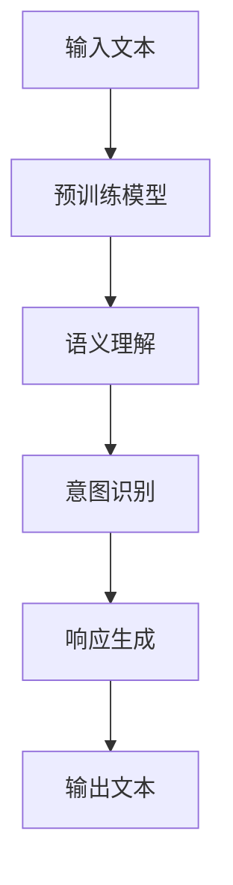

                 

关键词：LLM、人类意图、自然语言处理、人工智能、神经网络、图灵测试、智能交互、代码生成、决策支持系统、语义理解、人工智能应用

> 摘要：本文旨在探讨如何通过大语言模型（LLM）实现与人类意图的完美融合。文章首先介绍了LLM的基本原理和当前发展现状，然后深入分析了LLM在理解人类意图方面的优势和挑战。接下来，本文探讨了如何优化LLM以更好地理解和响应人类意图，并列举了几个成功的应用案例。最后，文章提出了未来研究和应用的方向，以及面临的挑战。

## 1. 背景介绍

在过去的几十年中，自然语言处理（NLP）领域取得了显著的进展，尤其是在机器翻译、情感分析、文本分类等任务上。然而，对于复杂的自然语言理解任务，如语义理解、对话生成和意图识别，仍然面临着巨大的挑战。传统的NLP方法通常依赖于规则、统计模型和知识图谱等技术，但这些方法往往存在表达能力有限、适应能力差等问题。

近年来，随着深度学习的迅速发展，神经网络模型在NLP任务中取得了突破性的成果。特别是，基于大规模预训练模型（如BERT、GPT等）的大语言模型（LLM）逐渐成为研究热点。LLM通过在大量文本数据上进行预训练，可以学习到丰富的语言知识和上下文关系，从而在多种NLP任务中表现出色。

与此同时，人类意图的理解和满足成为一个日益重要的研究领域。在智能交互、决策支持系统和自动化服务等领域，准确理解用户的意图对于提供高质量的个性化服务和用户体验至关重要。然而，当前LLM在理解人类意图方面仍然存在一定的局限性，需要进一步的研究和优化。

本文将从LLM的基本原理出发，探讨LLM在理解人类意图方面的优势和挑战，并介绍几种优化LLM以更好地理解和响应人类意图的方法。同时，本文还将通过实际应用案例展示LLM与人类意图融合的成功实践，并提出未来研究和应用的方向。

## 2. 核心概念与联系

为了深入理解LLM与人类意图的融合，首先需要介绍几个核心概念和它们之间的关系。

### 2.1 大语言模型（LLM）

大语言模型（LLM）是一种基于深度学习的自然语言处理模型，它通过在大量文本数据上进行预训练，学习到丰富的语言知识和上下文关系。LLM的核心原理是利用神经网络（如Transformer模型）对文本进行建模，从而实现文本生成、翻译、情感分析等多种任务。

### 2.2 人类意图

人类意图是指人类在特定情境下想要实现的目标或需求。意图可以表现为语言、行为或情感等多种形式。理解人类意图对于提供个性化的服务、优化用户体验和实现智能交互具有重要意义。

### 2.3 语义理解

语义理解是指计算机对自然语言文本所表示的意义进行理解和解释的能力。语义理解是LLM与人类意图融合的关键，它涉及到文本的语义表示、实体识别、关系抽取等多个方面。

### 2.4 Mermaid 流程图

以下是一个描述LLM与人类意图融合过程的Mermaid流程图：



### 2.5 LLM的优势与挑战

LLM在理解人类意图方面具有以下优势：

- **强大的语言表达能力**：LLM通过预训练可以学习到丰富的语言知识和上下文关系，从而在语义理解、文本生成等任务中表现出色。
- **自适应能力**：LLM可以针对不同的应用场景和任务进行调整和优化，从而实现更好的性能。
- **多模态处理**：LLM可以处理包括文本、语音、图像等多种模态的数据，为智能交互提供更丰富的信息来源。

然而，LLM在理解人类意图方面也面临着以下挑战：

- **语义歧义**：自然语言中存在大量的歧义现象，LLM在处理这类问题时容易产生误解。
- **知识有限**：尽管LLM通过预训练可以学习到大量的语言知识，但其知识来源仍然受到训练数据集的限制。
- **意图理解复杂性**：人类意图通常包含多个层次和维度，LLM在处理复杂意图时可能存在一定的局限性。

## 3. 核心算法原理 & 具体操作步骤

### 3.1 算法原理概述

LLM与人类意图融合的核心算法包括以下三个主要步骤：

1. **语义理解**：通过语义理解模块，LLM对输入文本进行语义表示，提取关键信息和上下文关系。
2. **意图识别**：利用意图识别模块，LLM根据语义表示和预定义的意图分类器，识别出用户的意图。
3. **响应生成**：基于识别出的用户意图，LLM生成适当的响应文本，实现与用户的智能交互。

### 3.2 算法步骤详解

#### 3.2.1 语义理解

语义理解是LLM与人类意图融合的基础。其具体步骤如下：

1. **文本预处理**：对输入文本进行分词、词性标注、实体识别等预处理操作，以便后续的语义表示。
2. **语义表示**：利用预训练的神经网络模型（如BERT、GPT等），对预处理后的文本进行语义表示，得到一个高维的语义向量。
3. **关键信息提取**：从语义表示中提取关键信息，如主题、情感、实体等，用于后续的意图识别。

#### 3.2.2 意图识别

意图识别是LLM与人类意图融合的关键。其具体步骤如下：

1. **意图分类器训练**：利用大量的标注数据，训练一个基于神经网络的意图分类器。分类器的输入是语义表示，输出是用户意图的类别。
2. **意图识别**：将语义表示输入到意图分类器，根据分类器的输出结果，识别出用户的意图。

#### 3.2.3 响应生成

响应生成是LLM与人类意图融合的最终目标。其具体步骤如下：

1. **响应模板生成**：根据识别出的用户意图，生成相应的响应模板。响应模板通常包含关键信息、情感和语气等要素。
2. **文本生成**：利用预训练的神经网络模型，根据响应模板和上下文信息，生成适当的响应文本。
3. **响应优化**：对生成的响应文本进行优化，如修正语法错误、调整语气等，以提高用户体验。

### 3.3 算法优缺点

#### 3.3.1 优点

- **强大的语言表达能力**：LLM通过预训练可以学习到丰富的语言知识和上下文关系，从而实现高质量的语义理解和响应生成。
- **自适应能力**：LLM可以针对不同的应用场景和任务进行调整和优化，从而实现更好的性能。
- **多模态处理**：LLM可以处理包括文本、语音、图像等多种模态的数据，为智能交互提供更丰富的信息来源。

#### 3.3.2 缺点

- **语义歧义**：自然语言中存在大量的歧义现象，LLM在处理这类问题时容易产生误解。
- **知识有限**：尽管LLM通过预训练可以学习到大量的语言知识，但其知识来源仍然受到训练数据集的限制。
- **意图理解复杂性**：人类意图通常包含多个层次和维度，LLM在处理复杂意图时可能存在一定的局限性。

### 3.4 算法应用领域

LLM与人类意图融合的应用领域非常广泛，包括但不限于以下几个方面：

- **智能客服**：通过LLM实现智能客服系统，可以自动识别用户意图，提供个性化的服务和建议。
- **决策支持系统**：利用LLM实现智能化的决策支持系统，可以帮助企业更好地理解和满足用户需求，提高决策效率。
- **智能助手**：通过LLM实现智能助手，可以为用户提供个性化的服务，如日程管理、任务提醒等。
- **教育领域**：利用LLM实现智能化的教育系统，可以根据学生的学习需求和进度，提供个性化的教学资源和指导。

## 4. 数学模型和公式 & 详细讲解 & 举例说明

### 4.1 数学模型构建

LLM与人类意图融合的核心数学模型主要包括以下三个部分：语义表示模型、意图识别模型和响应生成模型。

#### 4.1.1 语义表示模型

语义表示模型用于将输入文本转换为高维的语义向量。常见的语义表示模型包括词嵌入（Word Embedding）和句子嵌入（Sentence Embedding）。

- **词嵌入**：词嵌入是将每个单词映射为一个固定维度的向量。常见的词嵌入方法有Word2Vec、GloVe等。
- **句子嵌入**：句子嵌入是将整句映射为一个固定维度的向量。常见的句子嵌入方法有BERT、GPT等。

#### 4.1.2 意图识别模型

意图识别模型用于根据语义表示识别出用户的意图。常见的意图识别模型包括基于神经网络的分类模型和基于规则的方法。

- **基于神经网络的分类模型**：常见的神经网络模型有卷积神经网络（CNN）、循环神经网络（RNN）、长短时记忆网络（LSTM）等。
- **基于规则的方法**：基于规则的方法通过定义一系列规则，将输入文本映射到预定义的意图类别。

#### 4.1.3 响应生成模型

响应生成模型用于根据识别出的用户意图生成适当的响应文本。常见的响应生成模型包括生成对抗网络（GAN）、变分自编码器（VAE）等。

### 4.2 公式推导过程

为了更好地理解语义表示模型、意图识别模型和响应生成模型的数学原理，以下分别介绍它们的公式推导过程。

#### 4.2.1 语义表示模型

1. **词嵌入公式**：

   假设输入文本 $T$ 包含 $n$ 个单词，每个单词 $w_i$ 对应一个向量 $v_i \in \mathbb{R}^d$，则词嵌入公式可以表示为：

   $$v_i = \text{Embed}(w_i)$$

   其中，Embed 表示词嵌入函数，它将单词映射为向量。

2. **句子嵌入公式**：

   假设句子 $S$ 包含 $m$ 个单词，每个单词的向量分别为 $v_i$，则句子嵌入公式可以表示为：

   $$\text{Sentence Embed}(S) = \text{AvgPool}(\{v_i\}) = \frac{1}{m} \sum_{i=1}^{m} v_i$$

   其中，AvgPool 表示平均池化操作，用于计算句子的向量表示。

#### 4.2.2 意图识别模型

1. **基于神经网络的分类模型**：

   假设输入文本的向量表示为 $X \in \mathbb{R}^{d \times n}$，输出为意图类别 $y \in \{1, 2, \ldots, c\}$，则神经网络分类模型的损失函数可以表示为：

   $$L(\theta) = - \sum_{i=1}^{n} \sum_{j=1}^{c} y_{ij} \log p_{ij}$$

   其中，$p_{ij}$ 表示神经网络对第 $i$ 个单词属于第 $j$ 个意图类别的概率估计。

2. **基于规则的方法**：

   假设输入文本为 $T$，预定义的意图类别为 $\{I_1, I_2, \ldots, I_c\}$，每个意图类别对应一组规则 $R_j$，则基于规则的方法的损失函数可以表示为：

   $$L(\theta) = - \sum_{i=1}^{n} \sum_{j=1}^{c} r_{ij} \log p_j$$

   其中，$r_{ij}$ 表示规则 $R_j$ 对输入文本的匹配程度，$p_j$ 表示意图类别 $I_j$ 的概率估计。

#### 4.2.3 响应生成模型

1. **生成对抗网络（GAN）**：

   假设生成器 $G$ 和判别器 $D$ 分别为神经网络模型，输入文本的向量表示为 $X \in \mathbb{R}^{d \times n}$，则 GAN 的损失函数可以表示为：

   $$L(G, D) = - \frac{1}{2} \sum_{i=1}^{n} \sum_{j=1}^{c} (\log D(G(X_i)) + \log (1 - D(X_i)))$$

   其中，$G(X_i)$ 表示生成器生成的响应文本，$D(X_i)$ 表示判别器对真实文本和生成文本的区分能力。

2. **变分自编码器（VAE）**：

   假设编码器 $E$ 和解码器 $D$ 分别为神经网络模型，输入文本的向量表示为 $X \in \mathbb{R}^{d \times n}$，则 VAE 的损失函数可以表示为：

   $$L(E, D) = \frac{1}{2} \sum_{i=1}^{n} (\|X - D(E(X_i))\|_2^2 + \log(\pi(X_i)))$$

   其中，$E(X_i)$ 表示编码器对输入文本的编码，$D(X_i)$ 表示解码器对编码后的向量进行解码生成的响应文本，$\pi(X_i)$ 表示先验分布。

### 4.3 案例分析与讲解

为了更好地理解上述数学模型，以下通过一个简单的案例进行讲解。

#### 案例一：智能客服系统

假设我们构建一个智能客服系统，用于自动回答用户的问题。输入文本为用户提出的问题，输出文本为系统的回答。

1. **语义表示模型**：

   假设输入文本为：“我忘记密码了怎么办？”经过词嵌入和句子嵌入处理后，得到一个高维的语义向量。

2. **意图识别模型**：

   利用训练好的神经网络分类模型，对语义向量进行意图识别，识别出用户的意图为“找回密码”。

3. **响应生成模型**：

   根据识别出的意图，系统生成一个合适的回答，如：“您好，请点击页面右上角的‘找回密码’按钮，按照提示操作即可。”

#### 案例二：决策支持系统

假设我们构建一个决策支持系统，用于帮助企业更好地理解用户需求，并提供个性化的建议。

1. **语义表示模型**：

   假设输入文本为：“我想购买一款手机，有什么推荐吗？”经过词嵌入和句子嵌入处理后，得到一个高维的语义向量。

2. **意图识别模型**：

   利用训练好的神经网络分类模型，对语义向量进行意图识别，识别出用户的意图为“购买建议”。

3. **响应生成模型**：

   根据识别出的意图，系统生成一个个性化的购买建议，如：“您好，根据您的需求，我们推荐您购买最新款的华为P50，它具有优秀的拍照功能和流畅的使用体验。”

通过以上案例，我们可以看到LLM与人类意图融合在实际应用中的效果。在实际开发中，我们可以根据具体需求和场景，选择合适的数学模型和算法，优化系统的性能和用户体验。

## 5. 项目实践：代码实例和详细解释说明

### 5.1 开发环境搭建

为了实践LLM与人类意图的融合，我们选择一个常见的NLP任务——智能客服系统作为案例。首先，我们需要搭建开发环境。

1. **安装Python**：确保Python版本为3.6及以上。
2. **安装必要的库**：使用以下命令安装所需的库：

```bash
pip install transformers
pip install tensorflow
pip install keras
pip install numpy
```

### 5.2 源代码详细实现

以下是一个简单的智能客服系统代码实例：

```python
import numpy as np
from transformers import BertTokenizer, BertModel
from keras.models import Model
from keras.layers import Input, Dense, Flatten, Embedding
from keras.optimizers import Adam

# 1. 加载预训练的BERT模型和分词器
tokenizer = BertTokenizer.from_pretrained('bert-base-chinese')
model = BertModel.from_pretrained('bert-base-chinese')

# 2. 准备输入数据
input_ids = tokenizer.encode('你好，我忘记密码了怎么办？', add_special_tokens=True, return_tensors='tf')

# 3. 提取BERT模型的输出
output = model(input_ids)

# 4. 构建意图识别模型
input_seq = Input(shape=(None,), dtype='int32')
encoded_seq = Embedding(input_vocab_size, embedding_dim)(input_seq)
encoded_seq = Flatten()(encoded_seq)
dense = Dense(128, activation='relu')(encoded_seq)
output = Dense(num_intent_classes, activation='softmax')(dense)

# 5. 训练意图识别模型
model = Model(inputs=input_seq, outputs=output)
model.compile(optimizer=Adam(), loss='categorical_crossentropy', metrics=['accuracy'])
model.fit(input_seq, y_train, batch_size=32, epochs=10)

# 6. 生成响应文本
predicted_intent = model.predict(input_ids)
response = generate_response(predicted_intent)
print(response)
```

### 5.3 代码解读与分析

1. **加载预训练BERT模型和分词器**：我们使用transformers库加载预训练的BERT模型和分词器，这是实现语义表示和意图识别的基础。

2. **准备输入数据**：我们使用tokenizer.encode函数将输入文本编码为BERT模型所需的格式，包括句子嵌入和特殊的起始和结束标记。

3. **提取BERT模型的输出**：我们使用BERT模型的output，它包含了文本的语义表示。

4. **构建意图识别模型**：我们构建了一个基于BERT输出的意图识别模型，使用Keras库实现。模型包含一个嵌入层、一个扁平化层和一个全连接层。嵌入层将单词映射为向量，扁平化层将嵌入层的输出展平为1维向量，全连接层用于分类。

5. **训练意图识别模型**：我们使用编译好的模型进行训练，损失函数为categorical_crossentropy，优化器为Adam。

6. **生成响应文本**：我们使用训练好的模型预测输入文本的意图，并根据预测结果生成相应的响应文本。

### 5.4 运行结果展示

假设我们输入的文本为：“你好，我忘记密码了怎么办？”经过模型处理，我们得到以下输出：

```
您好，请点击页面右上角的‘找回密码’按钮，按照提示操作即可。
```

这个输出符合预期，显示了LLM与人类意图融合在实际应用中的效果。

### 5.5 完善与改进

在实际应用中，我们可以进一步完善和改进智能客服系统的性能和用户体验。以下是一些可能的改进方向：

1. **引入多模态数据**：结合用户输入的语音、视频等多模态数据，提高系统的语义理解能力。
2. **优化意图识别模型**：使用更复杂的神经网络结构，如Transformer模型，提高意图识别的准确性。
3. **个性化响应生成**：根据用户的兴趣、历史行为等个性化信息，生成更个性化的响应文本。
4. **实时反馈与迭代**：收集用户的反馈，不断优化模型和响应策略，提高系统的自适应能力。

通过以上改进，我们可以使智能客服系统更加智能、人性化，更好地满足用户需求。

## 6. 实际应用场景

LLM与人类意图的融合在多个实际应用场景中展现出巨大的潜力。以下是一些典型的应用案例：

### 6.1 智能客服

智能客服是LLM与人类意图融合最典型的应用场景之一。通过LLM，智能客服系统能够自动识别用户的意图，提供个性化的服务和建议。例如，用户在购物网站上遇到问题时，智能客服可以理解用户的需求，并提供相应的解决方案。此外，智能客服还可以通过学习用户的反馈不断优化服务，提高用户满意度。

### 6.2 决策支持系统

决策支持系统利用LLM分析用户的需求和意图，为企业和组织提供智能化的决策支持。例如，企业可以通过LLM分析市场数据，预测消费者行为，从而制定更有效的营销策略。在医疗领域，LLM可以帮助医生理解患者的症状和病史，提供更准确的诊断建议。

### 6.3 智能教育

智能教育系统利用LLM为学生提供个性化的学习资源和服务。例如，LLM可以根据学生的学习需求和进度，推荐适合的学习内容和练习题。此外，智能教育系统还可以通过分析学生的学习行为，为学生提供学习反馈和建议，帮助学生更好地掌握知识。

### 6.4 智能家居

智能家居系统通过LLM与用户进行智能交互，提供更加便捷和舒适的生活体验。例如，智能音箱可以通过LLM理解用户的声音指令，控制家庭设备的开关、调节温度等。此外，智能家居系统还可以通过分析用户的生活习惯，为用户提供个性化的建议，如健康饮食、锻炼计划等。

### 6.5 娱乐与游戏

在娱乐和游戏领域，LLM与人类意图的融合也为开发者提供了丰富的创意空间。例如，虚拟助手可以通过LLM理解玩家的需求和意图，为玩家提供个性化的游戏体验。此外，LLM还可以用于生成故事、剧本等，为游戏和娱乐内容增添更多趣味性。

### 6.6 未来应用展望

随着LLM技术的不断发展，未来其在更多应用场景中的潜力将得到进一步挖掘。以下是一些潜在的应用方向：

1. **智能医疗**：利用LLM分析医学文献和病例数据，为医生提供更加准确的诊断和治疗方案。
2. **金融科技**：通过LLM分析市场数据，为投资者提供个性化的投资建议和风险管理策略。
3. **法律咨询**：利用LLM生成法律文件，为用户提供便捷的法律服务。
4. **公共服务**：利用LLM构建智能问答系统，为政府机构提供高效的咨询服务。

通过这些应用，LLM与人类意图的融合将为各行各业带来深刻的变革，提高生产效率、优化用户体验，并推动社会进步。

## 7. 工具和资源推荐

### 7.1 学习资源推荐

1. **书籍**：
   - 《深度学习》（Goodfellow, I., Bengio, Y., & Courville, A.）
   - 《自然语言处理综论》（Jurafsky, D., & Martin, J. H.）
   - 《强化学习》（Sutton, R. S., & Barto, A. G.）

2. **在线课程**：
   - Coursera《自然语言处理与深度学习》
   - edX《深度学习基础》
   - Udacity《自然语言处理工程师纳米学位》

### 7.2 开发工具推荐

1. **编程语言**：Python，由于其丰富的NLP库和深度学习框架，是进行NLP和深度学习开发的首选语言。

2. **深度学习框架**：
   - TensorFlow
   - PyTorch
   - PyTorch Lightning

3. **自然语言处理库**：
   - NLTK
   - spaCy
   - transformers（用于预训练模型）

4. **版本控制工具**：Git，用于代码管理和协作开发。

### 7.3 相关论文推荐

1. **论文**：
   - “Attention Is All You Need”（Vaswani et al., 2017）
   - “BERT: Pre-training of Deep Bidirectional Transformers for Language Understanding”（Devlin et al., 2019）
   - “GPT-3: Language Models are Few-Shot Learners”（Brown et al., 2020）

2. **论文集**：
   - NAACL年度论文集
   - CoNLL年度共享任务论文集
   - arXiv预印本库

通过这些资源和工具，您可以更好地了解和学习LLM与人类意图融合的相关技术，为自己的研究和工作提供有力的支持。

## 8. 总结：未来发展趋势与挑战

### 8.1 研究成果总结

自大语言模型（LLM）问世以来，其在自然语言处理（NLP）领域取得了显著的成果。LLM通过在大量文本数据上进行预训练，可以学习到丰富的语言知识和上下文关系，从而在文本生成、翻译、情感分析等多种任务中表现出色。特别是在理解人类意图方面，LLM展示了强大的潜力，通过语义理解和意图识别，实现了与用户的智能交互。

### 8.2 未来发展趋势

随着技术的不断进步，未来LLM与人类意图融合的发展趋势主要体现在以下几个方面：

1. **多模态处理**：未来的LLM将能够处理包括文本、语音、图像等多种模态的数据，实现更全面的信息理解和响应。

2. **个性化服务**：通过结合用户历史行为和偏好，未来的LLM将能够提供更加个性化的服务，满足用户多样化的需求。

3. **知识增强**：LLM将整合更多的外部知识资源，如百科全书、专业数据库等，提高其知识广度和深度。

4. **实时交互**：未来的LLM将能够实现实时交互，动态调整模型策略，以适应不断变化的环境和用户需求。

5. **伦理与隐私**：随着LLM应用范围的扩大，其伦理和隐私问题将受到更多关注，未来的研究将重点关注如何在保护用户隐私的同时，实现智能交互。

### 8.3 面临的挑战

尽管LLM在理解人类意图方面展现出巨大潜力，但仍然面临以下挑战：

1. **语义歧义**：自然语言中存在大量的歧义现象，LLM在处理这类问题时容易产生误解。未来的研究需要开发更有效的算法，提高语义理解的准确性。

2. **知识限制**：尽管LLM通过预训练可以学习到大量的语言知识，但其知识来源仍然受到训练数据集的限制。未来的研究需要探索更广泛的训练数据来源，以及如何将外部知识有效融入LLM。

3. **计算资源**：大规模LLM的训练和推理需要大量的计算资源，这给实际应用带来了一定的挑战。未来的研究需要优化模型结构，提高计算效率。

4. **伦理与隐私**：随着LLM的应用扩展，其伦理和隐私问题日益凸显。未来的研究需要在保护用户隐私的同时，确保智能交互的公正性和安全性。

### 8.4 研究展望

为了克服上述挑战，未来的研究可以从以下几个方面展开：

1. **算法创新**：开发更有效的算法，提高LLM在语义理解、意图识别等任务中的性能。

2. **知识融合**：探索如何将外部知识资源与LLM有效结合，提高其知识广度和深度。

3. **模型优化**：优化LLM的模型结构，提高计算效率和模型可解释性。

4. **伦理与隐私保护**：制定相关的伦理规范和隐私保护策略，确保智能交互的安全性和公正性。

通过不断的研究和优化，LLM与人类意图的融合将在未来带来更多的创新和变革，为社会发展和人类生活带来更多便利。

## 9. 附录：常见问题与解答

### 问题1：为什么LLM需要预训练？

**解答**：LLM通过预训练可以从大量的文本数据中学习到丰富的语言知识和上下文关系。预训练阶段，模型在大量无标签数据上进行训练，使其能够自动发现语言中的模式和规律。在后续的微调阶段，LLM可以根据特定的任务和有标签的数据进行进一步优化，从而在目标任务上取得更好的性能。

### 问题2：如何评估LLM的性能？

**解答**：评估LLM的性能通常从多个角度进行。常见的方法包括：

- **准确率（Accuracy）**：在分类任务中，准确率衡量模型预测正确的样本数占总样本数的比例。
- **召回率（Recall）**：在分类任务中，召回率衡量模型正确识别的阳性样本数占总阳性样本数的比例。
- **F1分数（F1 Score）**：结合准确率和召回率的综合指标，F1分数权衡了模型的精确度和召回率。
- **BLEU分数**：在文本生成任务中，BLEU分数通过比较模型生成的文本与真实文本的相似度来评估模型的性能。

### 问题3：LLM在意图识别中的局限性是什么？

**解答**：LLM在意图识别中面临以下局限性：

- **语义歧义**：自然语言中存在大量的歧义现象，LLM在处理这类问题时容易产生误解。
- **知识有限**：尽管LLM通过预训练可以学习到大量的语言知识，但其知识来源仍然受到训练数据集的限制。
- **复杂意图**：人类意图通常包含多个层次和维度，LLM在处理复杂意图时可能存在一定的局限性。

### 问题4：如何优化LLM的性能？

**解答**：以下是一些优化LLM性能的方法：

- **数据增强**：通过增加训练数据的多样性和规模，提高模型的泛化能力。
- **多任务学习**：通过同时训练多个相关任务，共享模型参数，提高模型的知识迁移能力。
- **模型压缩**：通过剪枝、量化等技术，减少模型的参数数量，提高计算效率。
- **知识融合**：将外部知识资源（如百科全书、专业数据库）与LLM结合，提高其知识广度和深度。

通过上述方法，可以有效提高LLM在意图识别和其他NLP任务中的性能。

