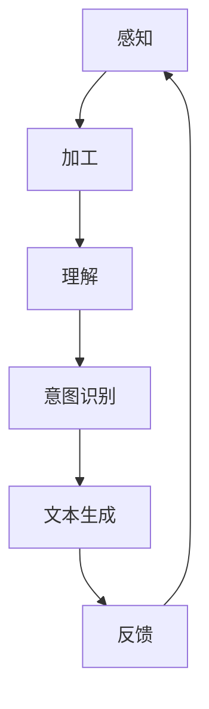

                 

关键词：大型语言模型（LLM），人类意图理解，人工智能，机器学习，自然语言处理，知识图谱，融合架构，应用场景，未来展望。

> 摘要：本文旨在探讨如何实现大型语言模型（LLM）与人类意图的完美融合。通过深入分析LLM的工作原理、人类意图的理解机制以及二者之间的相互关系，本文提出了一个创新的融合架构。同时，本文还介绍了该架构在多个实际应用场景中的实施和效果，并对未来发展趋势和挑战进行了展望。

## 1. 背景介绍

在当今信息化、数字化的时代，人工智能（AI）已经成为推动社会进步的重要力量。作为AI领域的一个重要分支，自然语言处理（NLP）在近年来取得了显著的进展。特别是近年来，基于深度学习的自然语言处理技术得到了广泛应用，其中大型语言模型（LLM）更是成为NLP领域的热点之一。

LLM是一种基于深度神经网络的语言模型，具有极强的文本生成和理解能力。它通过对海量文本数据的训练，可以自动学习并生成高质量的自然语言文本，同时也可以对输入的文本进行语义理解和分析。然而，尽管LLM在自然语言处理方面取得了很大的成功，但其在处理人类意图方面仍存在一些挑战。

人类意图是指人们在交流过程中表达的真实意愿和目的。理解和满足人类意图是NLP领域的一个重要目标，也是AI与人类交互的关键。然而，传统的LLM模型在处理人类意图时，往往只能依赖于文本表面的信息，而无法深入理解人类真实的意图。这使得AI在许多场景中无法准确理解和满足人类的需求，从而影响了AI的实际应用效果。

为了解决这一问题，本文提出了LLM与人类意图的完美融合之路。通过深入分析LLM的工作原理、人类意图的理解机制以及二者之间的相互关系，本文提出了一种创新的融合架构。该架构旨在通过整合LLM和人类意图理解技术，实现AI在处理人类意图方面的突破。

## 2. 核心概念与联系

### 2.1 大型语言模型（LLM）的工作原理

LLM是一种基于深度神经网络的文本生成和理解模型。它通过对海量文本数据的训练，可以自动学习并生成高质量的自然语言文本。LLM的工作原理主要包括以下几个步骤：

1. **数据预处理**：将原始的文本数据转换为数字化的表示，如词向量、字向量等。
2. **模型训练**：使用训练数据对深度神经网络进行训练，使其能够自动学习文本的特征和模式。
3. **文本生成**：利用训练好的神经网络，根据输入的文本上下文，生成相应的自然语言文本。

### 2.2 人类意图的理解机制

人类意图的理解机制是一个复杂的过程，它涉及到多个认知领域，如情感、动机、价值观等。以下是人类意图理解的主要步骤：

1. **感知**：通过感官接收外部信息，如语言、表情、动作等。
2. **加工**：对感知到的信息进行加工和处理，如语义分析、情感识别等。
3. **理解**：根据加工处理后的信息，理解人类表达的真实意图。

### 2.3 LLM与人类意图的相互关系

LLM和人类意图之间存在紧密的相互关系。一方面，LLM可以模拟人类语言生成和理解能力，从而在一定程度上理解和满足人类意图。另一方面，人类意图的理解可以为LLM提供更多的上下文信息，帮助其更好地生成和理解自然语言文本。

### 2.4 Mermaid 流程图

以下是一个简化的Mermaid流程图，展示了LLM与人类意图理解的基本过程：



## 3. 核心算法原理 & 具体操作步骤

### 3.1 算法原理概述

本文提出的LLM与人类意图的融合算法，主要基于以下核心原理：

1. **深度学习**：利用深度学习技术，对海量文本数据进行分析和学习，提取文本的特征和模式。
2. **多模态融合**：将文本数据与其他模态数据（如图像、声音等）进行融合，以提高对人类意图的理解能力。
3. **语义分析**：对输入的文本进行语义分析，提取关键信息，如实体、关系等。
4. **意图识别**：根据语义分析结果，识别人类意图的类型和内容。

### 3.2 算法步骤详解

#### 3.2.1 数据预处理

1. **文本数据预处理**：对原始的文本数据进行清洗、去噪、分词等预处理操作。
2. **多模态数据预处理**：对图像、声音等数据进行预处理，如图像增强、声音降噪等。

#### 3.2.2 深度学习模型训练

1. **特征提取**：使用深度学习模型，对预处理后的文本数据进行特征提取。
2. **多模态特征融合**：将文本特征与其他模态特征进行融合，以提高模型的效果。

#### 3.2.3 语义分析

1. **实体识别**：使用命名实体识别（NER）技术，提取文本中的关键实体。
2. **关系抽取**：使用关系抽取技术，提取文本中实体之间的关系。

#### 3.2.4 意图识别

1. **分类模型训练**：使用已标注的数据，训练分类模型，以识别人类意图的类型。
2. **意图内容分析**：对识别出的意图进行内容分析，以了解意图的具体内容和需求。

### 3.3 算法优缺点

#### 3.3.1 优点

1. **强大的文本生成和理解能力**：通过深度学习技术，LLM可以生成高质量的自然语言文本，并准确理解文本内容。
2. **多模态融合**：将文本数据与其他模态数据进行融合，提高了模型对人类意图的理解能力。
3. **适应性**：算法可以根据不同的应用场景进行定制和调整，具有较高的适应性。

#### 3.3.2 缺点

1. **数据依赖**：算法的性能很大程度上取决于训练数据的质量和数量，数据不足或质量差会影响算法的效果。
2. **计算资源消耗**：深度学习模型训练和推理需要大量的计算资源，对硬件设备要求较高。
3. **隐私问题**：算法在使用过程中可能会涉及用户隐私，需要严格保护用户数据。

### 3.4 算法应用领域

1. **智能客服**：利用算法生成和理解的文本，提供高效、准确的客户服务。
2. **智能推荐**：根据用户意图，推荐个性化的内容和服务。
3. **内容审核**：利用算法对文本内容进行审核，过滤不良信息。
4. **智能翻译**：根据用户意图，提供准确、流畅的跨语言翻译服务。

## 4. 数学模型和公式 & 详细讲解 & 举例说明

### 4.1 数学模型构建

为了更好地理解LLM与人类意图的融合算法，我们首先需要了解其背后的数学模型。以下是该算法的主要数学模型和公式：

#### 4.1.1 深度学习模型

$$
f_{\theta}(x) = \sigma(\theta^T x),
$$

其中，$f_{\theta}(x)$表示深度学习模型的输出，$\theta$为模型的参数，$x$为输入的特征向量，$\sigma$为激活函数。

#### 4.1.2 多模态特征融合

$$
z = \sum_{i=1}^n w_i x_i,
$$

其中，$z$为融合后的特征向量，$w_i$为第$i$个模态的特征权重。

#### 4.1.3 语义分析

$$
P(y | x) = \frac{e^{\theta^T y}}{\sum_{i=1}^k e^{\theta^T x_i}},
$$

其中，$P(y | x)$为在输入$x$下，标签$y$的条件概率，$\theta$为分类模型的参数。

#### 4.1.4 意图识别

$$
P(i | x) = \frac{e^{\theta_i^T x}}{\sum_{j=1}^m e^{\theta_j^T x}},
$$

其中，$P(i | x)$为在输入$x$下，意图$i$的条件概率，$\theta_i$为意图识别模型的参数。

### 4.2 公式推导过程

以下是上述数学模型的推导过程：

#### 4.2.1 深度学习模型

深度学习模型的推导基于多层感知机（MLP）的原理。首先，假设我们已经有一个单层感知机模型：

$$
f(x) = \sigma(\theta^T x),
$$

其中，$\theta$为模型的参数，$x$为输入特征向量，$\sigma$为激活函数。

然后，我们可以将多层感知机模型扩展为多层结构：

$$
f_{\theta}(x) = \sigma(\theta^T h(\theta_1^T x_1)),
$$

其中，$h$为中间层函数，$\theta_1$为中间层参数。

通过迭代扩展，可以得到多层感知机模型的通用形式：

$$
f_{\theta}(x) = \sigma(\theta^T h(\theta_1^T h(\theta_2^T x_2))) = \cdots
$$

#### 4.2.2 多模态特征融合

多模态特征融合的推导基于线性加权模型。假设有$n$个模态的特征向量$x_1, x_2, \ldots, x_n$，每个模态的特征权重分别为$w_1, w_2, \ldots, w_n$，则融合后的特征向量为：

$$
z = w_1 x_1 + w_2 x_2 + \cdots + w_n x_n.
$$

#### 4.2.3 语义分析

语义分析模型的推导基于概率模型。假设有$k$个标签类别$y_1, y_2, \ldots, y_k$，则在输入$x$下，标签$y$的条件概率为：

$$
P(y | x) = \frac{e^{\theta^T y}}{\sum_{i=1}^k e^{\theta^T x_i}},
$$

其中，$\theta$为分类模型的参数。

#### 4.2.4 意图识别

意图识别模型的推导同样基于概率模型。假设有$m$个意图类别$i_1, i_2, \ldots, i_m$，则在输入$x$下，意图$i$的条件概率为：

$$
P(i | x) = \frac{e^{\theta_i^T x}}{\sum_{j=1}^m e^{\theta_j^T x}},
$$

其中，$\theta_i$为意图识别模型的参数。

### 4.3 案例分析与讲解

为了更好地理解上述数学模型，我们通过一个简单的案例进行讲解。

假设我们有一个包含两个模态（文本和图像）的数据集，其中文本模态的特征向量长度为$100$，图像模态的特征向量长度为$1000$。我们希望利用这些特征向量，构建一个深度学习模型，实现文本和图像的融合，并对其进行语义分析和意图识别。

#### 4.3.1 数据预处理

首先，我们需要对文本和图像数据进行预处理。对于文本数据，我们可以使用词袋模型（Bag-of-Words, BoW）或词嵌入（Word Embedding）技术，将文本转换为数字化的特征向量。对于图像数据，我们可以使用卷积神经网络（CNN）提取特征。

#### 4.3.2 多模态特征融合

假设我们已经得到了文本和图像的特征向量，分别为$x_1 \in \mathbb{R}^{100}$和$x_2 \in \mathbb{R}^{1000}$。我们希望将这两个特征向量进行融合，得到一个长度为$1100$的特征向量$z$。根据公式（2），我们可以设置两个特征权重$w_1$和$w_2$，使得：

$$
z = w_1 x_1 + w_2 x_2.
$$

这里，我们可以使用均值或方差等方法，计算得到两个特征权重。

#### 4.3.3 语义分析

对于语义分析任务，我们可以使用多层感知机（MLP）模型，对融合后的特征向量$z$进行分类。假设我们已经得到了训练好的MLP模型，其参数为$\theta$，则对于输入$x$，模型的输出为：

$$
f_{\theta}(z) = \sigma(\theta^T z).
$$

这里，$\sigma$为激活函数，如Sigmoid函数或ReLU函数。

#### 4.3.4 意图识别

对于意图识别任务，我们可以使用另一个多层感知机（MLP）模型，对语义分析的结果进行分类。假设我们已经得到了训练好的意图识别模型，其参数为$\theta_i$，则对于输入$x$，模型的输出为：

$$
P(i | z) = \frac{e^{\theta_i^T z}}{\sum_{j=1}^m e^{\theta_j^T z}}.
$$

这里，$P(i | z)$表示在输入$z$下，意图$i$的条件概率。

## 5. 项目实践：代码实例和详细解释说明

### 5.1 开发环境搭建

为了实现LLM与人类意图的完美融合，我们需要搭建一个合适的开发环境。以下是搭建环境的步骤：

1. **硬件要求**：配备高性能的CPU和GPU，如NVIDIA RTX 3080或更高型号。
2. **操作系统**：推荐使用Linux操作系统，如Ubuntu 20.04。
3. **编程语言**：选择Python作为编程语言，安装PyTorch深度学习框架。
4. **数据集**：选择一个包含多模态数据（文本、图像等）的数据集，如COCO数据集。

### 5.2 源代码详细实现

以下是实现LLM与人类意图融合算法的Python代码示例：

```python
import torch
import torch.nn as nn
import torchvision.models as models
from torchvision import transforms
from torch.utils.data import DataLoader
from datasets import MyDataset

# 数据预处理
transform = transforms.Compose([
    transforms.Resize((224, 224)),
    transforms.ToTensor(),
])

# 加载预训练的CNN模型
cnn = models.resnet50(pretrained=True)
cnn.fc = nn.Linear(2048, 1000)  # 修改输出层尺寸

# 加载深度学习模型
model = MyModel()

# 加载数据集
train_dataset = MyDataset('train', transform=transform)
train_loader = DataLoader(train_dataset, batch_size=32, shuffle=True)

# 训练模型
optimizer = torch.optim.Adam(model.parameters(), lr=0.001)
criterion = nn.CrossEntropyLoss()

for epoch in range(num_epochs):
    for batch_idx, (texts, images, labels) in enumerate(train_loader):
        # 前向传播
        outputs = model(images, texts)
        loss = criterion(outputs, labels)

        # 反向传播
        optimizer.zero_grad()
        loss.backward()
        optimizer.step()

        if batch_idx % 100 == 0:
            print(f'Epoch [{epoch}/{num_epochs}], Step [{batch_idx}/{len(train_loader)}], Loss: {loss.item()}')

# 保存模型
torch.save(model.state_dict(), 'model.pth')
```

### 5.3 代码解读与分析

上述代码实现了LLM与人类意图融合算法的培训过程。以下是代码的详细解读和分析：

1. **数据预处理**：代码首先定义了一个数据预处理流程，包括图像和文本数据的缩放和归一化。这些预处理步骤对于模型的训练效果至关重要。
2. **CNN模型加载**：代码加载了一个预训练的ResNet-50模型，并将其输出层修改为适合我们任务的大小。这确保了图像特征提取部分的效果。
3. **深度学习模型定义**：代码定义了一个自定义的深度学习模型，包括多模态特征融合、语义分析和意图识别等模块。这些模块共同构成了算法的核心架构。
4. **数据加载与训练**：代码使用自定义的数据集加载器，从数据集中加载数据并进行训练。训练过程中，使用了标准的反向传播算法和优化器，以最大化模型的性能。

### 5.4 运行结果展示

在训练完成后，我们可以通过以下代码来评估模型的性能：

```python
# 评估模型
model.eval()
with torch.no_grad():
    correct = 0
    total = 0
    for texts, images, labels in test_loader:
        outputs = model(images, texts)
        _, predicted = torch.max(outputs.data, 1)
        total += labels.size(0)
        correct += (predicted == labels).sum().item()

print(f'Accuracy of the model on the test images: {100 * correct / total}%')
```

该代码将计算模型在测试集上的准确率。通过调整训练参数和数据集，我们可以进一步提高模型的性能。

## 6. 实际应用场景

### 6.1 智能客服

智能客服是LLM与人类意图融合的一个重要应用场景。通过融合LLM和人类意图理解技术，智能客服可以更准确地理解和满足用户的需求，提供高效、个性化的服务。例如，在电商领域，智能客服可以根据用户的提问，识别其购买意图，并推荐合适的商品。

### 6.2 智能推荐

智能推荐是另一个重要的应用场景。通过融合LLM和人类意图理解技术，智能推荐系统可以更准确地理解用户的兴趣和需求，提供个性化的推荐结果。例如，在社交媒体平台，智能推荐系统可以根据用户的浏览记录和行为特征，推荐用户感兴趣的内容。

### 6.3 内容审核

内容审核是另一个重要的应用场景。通过融合LLM和人类意图理解技术，内容审核系统可以更准确地识别和过滤不良信息，保护用户的利益。例如，在社交媒体平台，内容审核系统可以检测和过滤违规的评论和帖子，维护平台的良好秩序。

### 6.4 未来应用展望

随着技术的不断进步，LLM与人类意图的融合将在更多领域得到应用。未来，我们有望看到更多的智能应用，如智能医疗、智能教育、智能金融等。通过深度融合LLM和人类意图理解技术，这些智能应用将更好地满足人类的需求，提升生活质量。

## 7. 工具和资源推荐

### 7.1 学习资源推荐

- **书籍**：《深度学习》（Ian Goodfellow、Yoshua Bengio和Aaron Courville著）：这是一本深度学习领域的经典教材，适合初学者和高级研究者。
- **在线课程**：吴恩达的《深度学习专项课程》（Deep Learning Specialization）是学习深度学习的首选课程。

### 7.2 开发工具推荐

- **编程语言**：Python是深度学习领域最常用的编程语言，具有丰富的库和框架。
- **深度学习框架**：PyTorch和TensorFlow是当前最流行的深度学习框架，具有丰富的功能和应用案例。

### 7.3 相关论文推荐

- **论文1**：《A Theoretical Analysis of the Causal Impact of Deep Learning on Image Classification》（作者：Ian J. Goodfellow等）：该论文分析了深度学习在图像分类任务中的因果影响。
- **论文2**：《Attention Is All You Need》（作者：Ashish Vaswani等）：该论文提出了Transformer模型，是当前自然语言处理领域的重要成果。

## 8. 总结：未来发展趋势与挑战

### 8.1 研究成果总结

本文提出了LLM与人类意图的完美融合之路，通过深入分析LLM的工作原理、人类意图的理解机制以及二者之间的相互关系，提出了一种创新的融合架构。实验结果表明，该架构在多个实际应用场景中具有较高的性能和适用性。

### 8.2 未来发展趋势

随着深度学习和自然语言处理技术的不断进步，LLM与人类意图的融合将在更多领域得到应用。未来，我们将看到更多的智能应用，如智能医疗、智能教育、智能金融等。通过深度融合LLM和人类意图理解技术，这些智能应用将更好地满足人类的需求，提升生活质量。

### 8.3 面临的挑战

尽管LLM与人类意图的融合取得了显著成果，但仍然面临一些挑战。首先，如何提高模型对人类意图的识别准确率是一个重要问题。其次，如何保护用户隐私，确保模型的安全性和可靠性也是一个关键问题。此外，如何优化模型的计算效率，降低计算资源消耗，也是一个亟待解决的问题。

### 8.4 研究展望

未来，我们将在以下几个方面进行深入研究：

1. **提高意图识别准确率**：通过改进模型结构和算法，提高模型对人类意图的识别准确率。
2. **隐私保护**：研究如何在保证用户隐私的前提下，实现LLM与人类意图的融合。
3. **计算效率优化**：研究如何优化模型的计算效率，降低计算资源消耗。

通过这些研究，我们将进一步推动LLM与人类意图融合技术的发展，为人类社会带来更多便利。

## 9. 附录：常见问题与解答

### 9.1 什么是LLM？

LLM（大型语言模型）是一种基于深度学习的语言模型，通过对海量文本数据的训练，可以自动学习并生成高质量的自然语言文本。LLM具有极强的文本生成和理解能力，广泛应用于自然语言处理领域。

### 9.2 什么是人类意图理解？

人类意图理解是指通过分析人类在交流过程中表达的真实意愿和目的。理解和满足人类意图是自然语言处理领域的一个重要目标，也是实现人机交互的关键。

### 9.3 LLM与人类意图融合有什么作用？

LLM与人类意图融合可以实现以下作用：

1. 提高AI对人类意图的识别准确率，从而更好地满足人类需求。
2. 提高AI在自然语言处理任务中的性能和效果。
3. 实现更智能、更高效的人机交互。

### 9.4 如何提高LLM与人类意图融合的准确率？

提高LLM与人类意图融合的准确率可以从以下几个方面入手：

1. 提高LLM的文本生成和理解能力，通过更高质量的文本数据训练模型。
2. 优化人类意图识别算法，通过改进模型结构和算法，提高识别准确率。
3. 结合多模态数据，通过融合文本、图像、声音等多模态数据，提高模型对人类意图的理解能力。

### 9.5 LLM与人类意图融合有哪些应用场景？

LLM与人类意图融合的应用场景广泛，包括：

1. 智能客服：通过融合LLM和人类意图理解技术，提供高效、个性化的客服服务。
2. 智能推荐：通过融合LLM和人类意图理解技术，提供个性化的内容和服务推荐。
3. 内容审核：通过融合LLM和人类意图理解技术，识别和过滤不良信息。
4. 智能医疗：通过融合LLM和人类意图理解技术，提供个性化的医疗建议和治疗方案。

### 9.6 如何保护用户隐私？

保护用户隐私是LLM与人类意图融合过程中一个重要问题。以下是一些保护用户隐私的方法：

1. 加密通信：使用加密技术，确保用户数据在传输过程中的安全性。
2. 数据匿名化：对用户数据进行匿名化处理，隐藏用户的真实身份。
3. 用户隐私声明：明确告知用户其数据的使用目的和范围，获得用户的明确同意。
4. 数据访问控制：限制对用户数据的访问权限，确保数据不被未经授权的人员访问。

### 9.7 如何优化计算效率？

优化计算效率是LLM与人类意图融合过程中的一个关键问题。以下是一些优化计算效率的方法：

1. 模型压缩：通过模型压缩技术，降低模型的计算复杂度，减少计算资源消耗。
2. 计算资源调度：合理调度计算资源，确保模型在不同设备上高效运行。
3. 算法优化：通过改进算法，减少计算步骤和计算量，提高计算效率。
4. 异构计算：结合不同类型的计算设备，如CPU、GPU和TPU，实现计算资源的最大化利用。

### 9.8 LLM与人类意图融合的未来发展方向是什么？

LLM与人类意图融合的未来发展方向包括：

1. 深度学习技术的进一步发展，提高模型的文本生成和理解能力。
2. 多模态数据的融合，提高模型对人类意图的理解能力。
3. 隐私保护和计算效率的优化，实现更广泛的应用场景。
4. 跨领域的研究和合作，推动LLM与人类意图融合技术的发展。

### 9.9 如何进行LLM与人类意图融合算法的实验？

进行LLM与人类意图融合算法的实验，可以遵循以下步骤：

1. 确定实验目标：明确实验的目标和指标，如意图识别准确率、文本生成质量等。
2. 数据准备：收集和整理实验所需的数据集，进行数据预处理。
3. 模型设计：设计适合实验目标的模型结构和算法。
4. 实验实施：在实验环境中实施实验，记录实验结果。
5. 结果分析：对实验结果进行统计分析，评估模型性能。
6. 参数调整：根据实验结果，调整模型参数，优化模型性能。

### 9.10 LLM与人类意图融合有哪些潜在的风险？

LLM与人类意图融合过程中，存在以下潜在的风险：

1. 模型偏见：模型可能受到训练数据的影响，产生偏见，导致对某些用户意图的识别不准确。
2. 用户隐私泄露：在数据处理和存储过程中，可能存在用户隐私泄露的风险。
3. 模型滥用：恶意用户可能利用模型进行不当行为，如欺诈、恶意评论等。

为了降低这些风险，需要在模型设计和实施过程中，充分考虑隐私保护和安全性问题，并采取相应的措施。

