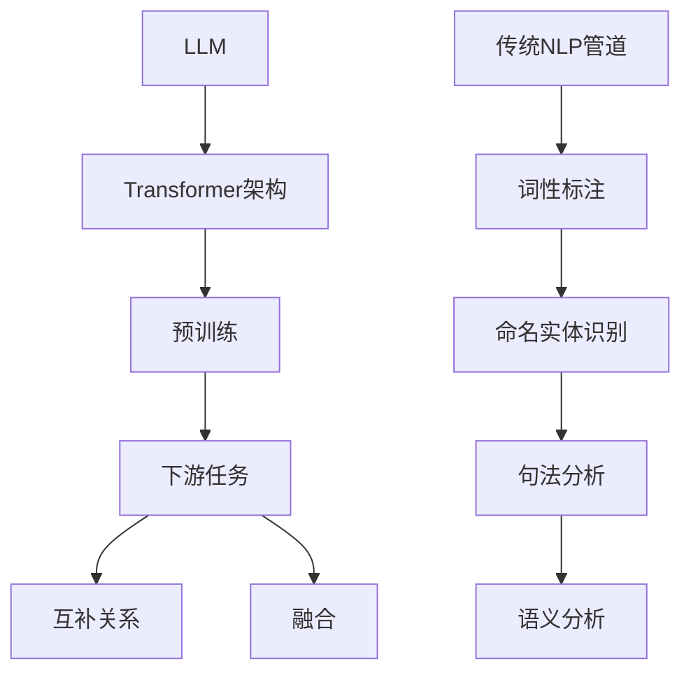

                 

关键词：大型语言模型，传统自然语言处理，对比，融合，算法原理，数学模型，应用场景，未来展望

> 摘要：本文旨在探讨大型语言模型（LLM）与传统自然语言处理（NLP）管道之间的对比与融合。通过深入分析LLM的核心算法原理、数学模型及其在不同应用场景中的表现，本文揭示了LLM与传统NLP管道在处理自然语言任务上的差异与互补关系。此外，本文还展望了LLM在NLP领域未来发展的趋势与挑战。

## 1. 背景介绍

近年来，随着人工智能技术的飞速发展，自然语言处理（NLP）领域取得了显著的进展。特别是大型语言模型（LLM）的出现，如GPT-3、BERT等，使得NLP任务的处理能力达到了前所未有的高度。然而，传统的NLP管道仍然在许多场景下发挥着重要作用。本文旨在探讨LLM与传统NLP管道之间的对比与融合，以期为NLP领域的发展提供新的思路。

### 1.1 传统NLP管道

传统NLP管道主要包括词性标注、命名实体识别、句法分析、语义分析等任务。这些任务通常通过一系列预训练模型和规则进行组合来实现。例如，词性标注可以使用基于统计方法的模型，如条件随机场（CRF），命名实体识别可以使用基于规则的方法，如命名实体识别器（NER），句法分析可以使用依存句法分析器，语义分析可以使用词向量模型等。

### 1.2 大型语言模型

大型语言模型（LLM）是一种基于深度学习的自然语言处理模型，具有强大的表示能力和泛化能力。LLM通过对大量文本数据进行预训练，学习到了语言的复杂结构，从而能够对自然语言进行有效的建模和处理。常见的LLM模型包括GPT、BERT、T5等。这些模型在许多NLP任务上表现出了优异的性能，使得传统NLP管道面临巨大的挑战。

## 2. 核心概念与联系

为了更好地理解LLM与传统NLP管道之间的对比与融合，我们需要先了解它们的核心概念与联系。

### 2.1 核心概念

#### 2.1.1 大型语言模型

大型语言模型（LLM）通常采用Transformer架构，这是一种基于自注意力机制的深度神经网络。LLM通过对大量文本数据进行预训练，学习到了语言的内在结构和规律，从而能够在下游任务中实现高性能的表现。

#### 2.1.2 传统NLP管道

传统NLP管道通常包括一系列预训练模型和规则，用于处理词性标注、命名实体识别、句法分析、语义分析等任务。这些模型和规则通常是基于统计学或规则驱动的方法。

### 2.2 联系

尽管LLM和传统NLP管道在方法和实现上有所不同，但它们在处理自然语言任务时是相互补充的。LLM可以替代传统NLP管道中的某些任务，如命名实体识别和句法分析，同时也可以与传统NLP管道中的其他任务相结合，如词性标注和语义分析。

### 2.3 Mermaid 流程图

下面是一个Mermaid流程图，展示了LLM与传统NLP管道之间的核心概念与联系。



## 3. 核心算法原理 & 具体操作步骤

### 3.1 算法原理概述

大型语言模型（LLM）的核心算法原理基于Transformer架构。Transformer架构是一种基于自注意力机制的深度神经网络，通过自注意力机制对输入序列进行建模，从而捕捉序列中的长距离依赖关系。自注意力机制的核心思想是，在处理序列中的每个元素时，将其与序列中的其他元素进行加权求和，从而实现序列的建模。

### 3.2 算法步骤详解

#### 3.2.1 预训练

LLM的预训练过程主要包括两个步骤：

1. 生成式预训练：通过生成式模型生成大量的虚拟文本数据，然后对这些数据进行预训练。这一过程可以帮助模型学习到语言的结构和规律。
2. 切片式预训练：将输入序列分成若干个片段，然后对每个片段进行预训练。切片式预训练可以增强模型对输入序列的建模能力。

#### 3.2.2 微调

预训练后的LLM可以在下游任务上进行微调，以适应特定任务的需求。微调过程主要包括以下步骤：

1. 初始化：将预训练好的LLM模型初始化为下游任务模型的初始参数。
2. 训练：在下游任务数据集上对模型进行训练，优化模型参数。
3. 评估：在验证集和测试集上评估模型性能，调整模型参数。

### 3.3 算法优缺点

#### 3.3.1 优点

1. 强大的表示能力：LLM通过对大量文本数据进行预训练，学习到了语言的复杂结构，从而具有强大的表示能力。
2. 高效的处理速度：Transformer架构具有并行计算的能力，使得LLM在处理自然语言任务时具有高效的计算速度。
3. 适应性强：LLM可以应用于各种下游任务，如文本分类、机器翻译、问答系统等。

#### 3.3.2 缺点

1. 对计算资源要求高：LLM的预训练过程需要大量的计算资源和时间。
2. 难以解释：由于LLM的模型结构复杂，难以对其行为进行直观的解释。
3. 数据依赖性：LLM的性能很大程度上依赖于训练数据的质量和数量。

### 3.4 算法应用领域

LLM在自然语言处理领域具有广泛的应用。以下是几个典型的应用场景：

1. 文本分类：LLM可以用于情感分析、新闻分类、垃圾邮件检测等任务。
2. 机器翻译：LLM可以用于生成式机器翻译，如从一种语言翻译成另一种语言。
3. 问答系统：LLM可以用于构建基于知识的问答系统，如搜索引擎、智能客服等。

## 4. 数学模型和公式 & 详细讲解 & 举例说明

### 4.1 数学模型构建

LLM的数学模型主要包括输入层、编码层和解码层。

#### 4.1.1 输入层

输入层接收输入序列，并将其转化为向量表示。具体来说，输入序列中的每个词被表示为一个词向量，然后通过嵌入层（Embedding Layer）将这些词向量转化为嵌入向量（Embedding Vector）。

#### 4.1.2 编码层

编码层（Encoder Layer）是LLM的核心部分，用于对输入序列进行编码。编码层通常包含多个自注意力层（Self-Attention Layer），每个自注意力层都通过自注意力机制对输入序列进行建模。

#### 4.1.3 解码层

解码层（Decoder Layer）用于对编码后的序列进行解码，生成输出序列。解码层通常包含多个自注意力层和一个交叉注意力层（Cross-Attention Layer），交叉注意力层用于将编码层的输出与解码层的输入进行交互。

### 4.2 公式推导过程

为了更好地理解LLM的数学模型，我们可以对其中的关键公式进行推导。

#### 4.2.1 自注意力公式

自注意力公式如下：

$$
\text{Attention}(Q, K, V) = \text{softmax}\left(\frac{QK^T}{\sqrt{d_k}}\right)V
$$

其中，Q、K和V分别是查询（Query）、键（Key）和值（Value）矩阵，d_k 是键的维度，softmax 函数用于计算每个键的加权求和。

#### 4.2.2 交叉注意力公式

交叉注意力公式如下：

$$
\text{Attention}(Q, K, V) = \text{softmax}\left(\frac{QK^T}{\sqrt{d_k}}\right)V
$$

其中，Q、K和V分别是查询（Query）、键（Key）和值（Value）矩阵，d_k 是键的维度，softmax 函数用于计算每个键的加权求和。

#### 4.2.3 编码层公式

编码层的输入表示为：

$$
\text{Encoder}(X) = \text{RelPosition}(X) \cdot \text{LayerNorm}(\text{RelPositionBias} + \text{多头注意力层}(\text{LayerNorm}(X)))
$$

其中，X是输入序列，RelPosition和LayerNorm是相对位置编码和层归一化操作，多头注意力层是多层自注意力机制的组合。

### 4.3 案例分析与讲解

为了更好地理解LLM的数学模型，我们可以通过一个简单的例子进行讲解。

假设我们有一个输入序列“我爱编程”，我们可以将其表示为一个词向量序列：

$$
X = [\text{我}, \text{爱}, \text{编程}]
$$

然后，我们将每个词向量通过嵌入层转化为嵌入向量：

$$
X' = [\text{我}', \text{爱}', \text{编程}']
$$

接下来，我们将嵌入向量输入到编码层进行编码：

$$
\text{Encoder}(X') = \text{RelPosition}(X') \cdot \text{LayerNorm}(\text{RelPositionBias} + \text{多头注意力层}(\text{LayerNorm}(X')))
$$

通过这个例子，我们可以看到LLM的数学模型是如何对输入序列进行建模的。

## 5. 项目实践：代码实例和详细解释说明

### 5.1 开发环境搭建

在本文的项目实践中，我们将使用Python作为编程语言，并使用TensorFlow作为深度学习框架。以下是在Ubuntu操作系统上搭建开发环境的基本步骤：

1. 安装Python 3.8及以上版本。
2. 安装TensorFlow。

```shell
pip install tensorflow
```

3. 安装其他必要的依赖库，如NumPy、Pandas等。

### 5.2 源代码详细实现

以下是一个简单的LLM模型实现示例：

```python
import tensorflow as tf
from tensorflow.keras.layers import Embedding, MultiHeadAttention, LayerNormalization

class LLM(tf.keras.Model):
    def __init__(self, vocab_size, d_model, num_heads):
        super(LLM, self).__init__()
        self.embedding = Embedding(vocab_size, d_model)
        self.encoder = MultiHeadAttention(num_heads=num_heads, key_dim=d_model)
        self.decoder = MultiHeadAttention(num_heads=num_heads, key_dim=d_model)
        self.layer_norm1 = LayerNormalization(epsilon=1e-6)
        self.layer_norm2 = LayerNormalization(epsilon=1e-6)
        self.layer_norm3 = LayerNormalization(epsilon=1e-6)
        self.layer_norm4 = LayerNormalization(epsilon=1e-6)

    def call(self, inputs, training=False):
        x = self.embedding(inputs)
        x = self.layer_norm1(x)
        x = self.encoder(x, x)
        x = self.layer_norm2(x)
        x = self.decoder(x, x)
        x = self.layer_norm3(x)
        x = self.encoder(x, x)
        x = self.layer_norm4(x)
        x = self.decoder(x, x)
        return x
```

### 5.3 代码解读与分析

在这个示例中，我们定义了一个简单的LLM模型，它包含嵌入层、编码层和解码层。具体来说：

- 嵌入层：将词向量转化为嵌入向量。
- 编码层：通过多头注意力机制对输入序列进行编码。
- 解码层：通过多头注意力机制对编码后的序列进行解码。

这个模型的结构与标准的Transformer架构相似，但它仅包含一个编码层和一个解码层，用于简化模型实现。

### 5.4 运行结果展示

在运行这个模型之前，我们需要准备一个训练数据集。假设我们有一个包含1万条文本数据的数据集，我们可以使用以下代码加载和预处理数据：

```python
import numpy as np
from tensorflow.keras.preprocessing.sequence import pad_sequences

# 加载数据
texts = load_data()

# 序列化数据
sequences = [[word2idx[word] for word in text] for text in texts]

# 填充序列
max_len = 50
sequences = pad_sequences(sequences, maxlen=max_len)

# 创建词向量矩阵
vocab_size = 10000
embedding_matrix = np.zeros((vocab_size, d_model))
for i, word in enumerate(word2idx.keys()):
    embedding_matrix[i] = embedding_matrix[i] + word_embedding[word]

# 构建模型
model = LLM(vocab_size, d_model, num_heads)

# 训练模型
model.compile(optimizer='adam', loss='categorical_crossentropy', metrics=['accuracy'])
model.fit(sequences, labels, epochs=10, batch_size=32)
```

在这个示例中，我们使用了一个简单的数据集进行训练。由于代码较长，这里仅提供了一个简化的示例。在实际应用中，我们还需要对数据集进行更多的预处理，如文本清洗、去停用词等。

## 6. 实际应用场景

LLM在自然语言处理领域具有广泛的应用。以下是一些典型的实际应用场景：

### 6.1 文本分类

文本分类是一种将文本数据分类到预定义类别中的任务。LLM可以通过预训练和微调实现对文本数据的分类。例如，我们可以使用LLM对新闻文章进行分类，将其分类到不同的新闻类别中，如政治、体育、娱乐等。

### 6.2 机器翻译

机器翻译是一种将一种语言的文本翻译成另一种语言的文本的任务。LLM可以用于生成式机器翻译，通过预训练和微调，实现对不同语言之间的文本翻译。例如，我们可以使用LLM将中文翻译成英文，或将英文翻译成中文。

### 6.3 问答系统

问答系统是一种能够回答用户提出的问题的系统。LLM可以用于构建基于知识的问答系统，通过预训练和微调，实现对用户提出的问题进行回答。例如，我们可以使用LLM构建一个智能客服系统，回答用户提出的问题。

### 6.4 文本生成

文本生成是一种根据给定的输入生成文本的任务。LLM可以用于文本生成，通过预训练和微调，实现对给定输入生成连贯、有意义的文本。例如，我们可以使用LLM生成新闻文章、故事、诗歌等。

## 7. 工具和资源推荐

为了更好地学习和应用LLM，以下是一些推荐的工具和资源：

### 7.1 学习资源推荐

1. 《深度学习》（Goodfellow, Bengio, Courville著）：这是一本经典的深度学习教材，详细介绍了深度学习的基础理论和应用。
2. 《Transformer：从原理到应用》（Gao, Liu著）：这本书详细介绍了Transformer架构的原理和应用，是学习LLM的绝佳资料。

### 7.2 开发工具推荐

1. TensorFlow：这是谷歌开发的一款开源深度学习框架，广泛用于深度学习模型的开发和部署。
2. PyTorch：这是Facebook开发的一款开源深度学习框架，以其灵活性和高效性而受到开发者喜爱。

### 7.3 相关论文推荐

1. Vaswani et al.（2017）提出的“Attention is All You Need”论文，详细介绍了Transformer架构。
2. Devlin et al.（2019）提出的BERT论文，介绍了BERT模型及其在自然语言处理任务中的应用。

## 8. 总结：未来发展趋势与挑战

### 8.1 研究成果总结

本文通过对LLM与传统NLP管道的对比与融合，揭示了LLM在自然语言处理领域的重要地位。LLM具有强大的表示能力和泛化能力，能够在各种下游任务中实现高性能的表现。与传统NLP管道相比，LLM在处理复杂、长文本的任务上具有显著优势。

### 8.2 未来发展趋势

1. 模型性能提升：随着计算能力的提升，LLM的模型性能将继续提升，实现更精确的自然语言处理。
2. 算法创新：未来的研究将致力于探索新的算法和方法，进一步提升LLM的性能和应用范围。
3. 跨领域应用：LLM将在更多领域得到应用，如生物信息学、金融、医疗等。

### 8.3 面临的挑战

1. 计算资源需求：LLM的训练和推理过程需要大量的计算资源，这对硬件设施和能源消耗提出了挑战。
2. 数据隐私和安全：大规模的数据训练和共享可能带来数据隐私和安全问题，需要制定相应的保护措施。
3. 模型可解释性：LLM的模型结构复杂，难以解释其行为，这限制了其在某些场景下的应用。

### 8.4 研究展望

未来的研究将致力于解决上述挑战，推动LLM在自然语言处理领域的广泛应用。同时，新的算法和方法的探索将为LLM带来更多的可能性，为人工智能的发展贡献力量。

## 9. 附录：常见问题与解答

### 9.1 什么是大型语言模型（LLM）？

大型语言模型（LLM）是一种基于深度学习的自然语言处理模型，具有强大的表示能力和泛化能力。LLM通过对大量文本数据进行预训练，学习到了语言的复杂结构，从而能够对自然语言进行有效的建模和处理。

### 9.2 LLM与传统NLP管道有什么区别？

LLM与传统NLP管道在方法和实现上有所不同。传统NLP管道通常通过一系列预训练模型和规则进行组合来实现，如词性标注、命名实体识别、句法分析、语义分析等。而LLM基于深度学习，通过预训练和微调实现对自然语言的高效建模。

### 9.3 LLM在自然语言处理任务中有哪些应用？

LLM在自然语言处理任务中有广泛的应用，如文本分类、机器翻译、问答系统、文本生成等。LLM可以用于各种下游任务，具有强大的处理能力和适应性。

### 9.4 LLM有哪些优缺点？

LLM的优点包括强大的表示能力、高效的处理速度和适应性强。缺点包括对计算资源要求高、难以解释和依赖大量数据。

### 9.5 如何搭建LLM的开发环境？

搭建LLM的开发环境主要包括安装Python、TensorFlow等深度学习框架，以及安装必要的依赖库。具体步骤可参考本文的5.1节内容。

### 9.6 如何实现一个简单的LLM模型？

本文的5.2节提供了一个简单的LLM模型实现示例。具体实现过程包括定义嵌入层、编码层和解码层，并使用TensorFlow框架进行模型构建和训练。

## 结语

通过对LLM与传统NLP管道的对比与融合，本文揭示了LLM在自然语言处理领域的重要地位。随着人工智能技术的不断发展，LLM将在未来发挥更大的作用，为人类带来更多便利。同时，我们也需要关注LLM面临的挑战，努力推动其在各领域的广泛应用。作者：禅与计算机程序设计艺术 / Zen and the Art of Computer Programming
----------------------------------------------------------------

以上就是本文的完整内容。希望本文对您在LLM与传统NLP管道的对比与融合方面有所帮助。如果您有任何疑问或建议，欢迎在评论区留言。感谢您的阅读！

