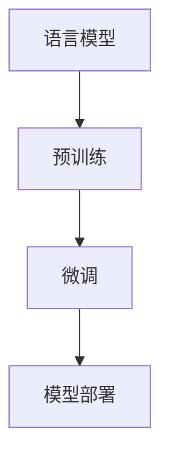

                 

关键词：大型语言模型、智能应用、核心技术、算法原理、数学模型、代码实例、应用场景、未来展望

> 摘要：本文深入探讨了大型语言模型（LLM）的内核，作为支撑现代智能应用的基石。文章从背景介绍入手，详细分析了LLM的核心概念、算法原理、数学模型以及具体操作步骤，并通过实际项目实践展示了其应用价值。此外，文章还展望了LLM未来的发展趋势与挑战。

## 1. 背景介绍

近年来，人工智能（AI）技术取得了显著的进步，特别是在自然语言处理（NLP）领域，大型语言模型（LLM）如BERT、GPT-3等成为了研究热点。LLM通过大规模的预训练和微调，可以生成高质量的自然语言文本，为智能应用提供了强大的基础。然而，LLM的内核技术，即如何构建、优化和部署这些模型，依然是当前研究的重要课题。

本文旨在探讨LLM的内核技术，分析其核心概念、算法原理、数学模型以及具体操作步骤，并通过实际项目实践展示其应用价值。同时，文章还将展望LLM未来的发展趋势与挑战。

### 1.1 研究背景

自然语言处理是人工智能领域的一个重要分支，其目标是使计算机能够理解、生成和处理自然语言。在过去的几十年中，NLP技术取得了显著的进展，但仍然存在许多挑战，如语义理解、上下文感知、多语言处理等。

大型语言模型的出现，为NLP领域带来了新的机遇。这些模型通过在大规模语料库上进行预训练，可以学习到丰富的语言知识和模式，从而在多种NLP任务中表现出色。BERT、GPT-3等模型的出现，标志着NLP技术进入了一个新的时代。

### 1.2 研究意义

深入探讨LLM的内核技术，具有重要的理论和实践意义。从理论角度来看，研究LLM的内核可以帮助我们更好地理解自然语言的本质，探索更加有效的NLP算法和模型。从实践角度来看，LLM的内核技术为智能应用提供了强大的支持，可以应用于文本生成、机器翻译、情感分析、问答系统等多种场景。

本文的研究将为LLM的进一步发展提供理论基础，为智能应用的开发提供实践指导。

## 2. 核心概念与联系

为了更好地理解LLM的内核，我们需要首先了解其核心概念，包括语言模型、预训练、微调等。下面，我们将通过一个Mermaid流程图，展示这些核心概念之间的联系。



### 2.1 语言模型

语言模型是LLM的基础，用于预测下一个单词或字符。在NLP任务中，语言模型可以帮助我们生成文本、翻译语言、进行问答等。

### 2.2 预训练

预训练是指在大规模语料库上进行模型训练，使模型学习到丰富的语言知识和模式。预训练过程主要包括两个阶段：数据预处理和模型训练。数据预处理包括文本清洗、分词、词向量嵌入等；模型训练则使用训练数据进行参数优化。

### 2.3 微调

微调是指在使用预训练模型的基础上，针对特定任务进行模型优化。微调可以帮助模型更好地适应特定任务，提高任务性能。

### 2.4 模型部署

模型部署是将训练好的模型应用到实际场景中，如文本生成、机器翻译、情感分析等。部署过程中，需要考虑模型的性能、可扩展性和易用性。

通过以上核心概念的联系，我们可以更好地理解LLM的内核技术，为其在实际应用中的性能优化和效果提升提供指导。

## 3. 核心算法原理 & 具体操作步骤

### 3.1 算法原理概述

LLM的核心算法主要包括预训练和微调两个阶段。预训练过程使模型学习到丰富的语言知识和模式；微调过程则使模型更好地适应特定任务。

#### 3.1.1 预训练

预训练过程主要包括以下步骤：

1. 数据预处理：清洗文本数据，进行分词、词向量嵌入等操作；
2. 模型初始化：初始化预训练模型，如BERT、GPT-3等；
3. 模型训练：在大规模语料库上进行模型训练，优化模型参数；
4. 模型评估：使用验证集对模型进行评估，调整训练策略。

#### 3.1.2 微调

微调过程主要包括以下步骤：

1. 任务定义：定义特定任务，如文本生成、机器翻译等；
2. 模型选择：选择预训练模型作为基础模型；
3. 数据预处理：对任务数据进行预处理，如文本清洗、分词等；
4. 模型微调：在任务数据上对基础模型进行微调，优化模型参数；
5. 模型评估：使用验证集对微调后的模型进行评估，调整训练策略。

### 3.2 算法步骤详解

#### 3.2.1 预训练

1. 数据预处理：对大规模语料库进行清洗、分词、词向量嵌入等操作；
2. 模型初始化：初始化预训练模型，如BERT、GPT-3等；
3. 模型训练：使用训练数据进行模型训练，优化模型参数；
4. 模型评估：使用验证集对模型进行评估，调整训练策略。

#### 3.2.2 微调

1. 任务定义：定义特定任务，如文本生成、机器翻译等；
2. 模型选择：选择预训练模型作为基础模型；
3. 数据预处理：对任务数据进行预处理，如文本清洗、分词等；
4. 模型微调：在任务数据上对基础模型进行微调，优化模型参数；
5. 模型评估：使用验证集对微调后的模型进行评估，调整训练策略。

### 3.3 算法优缺点

#### 优点

1. 预训练：通过在大规模语料库上进行预训练，模型可以学习到丰富的语言知识和模式，提高模型性能；
2. 微调：通过微调，模型可以更好地适应特定任务，提高任务性能；
3. 可扩展性：预训练模型可以在多种任务中复用，降低开发成本。

#### 缺点

1. 计算成本：预训练和微调过程需要大量的计算资源和时间；
2. 数据依赖：模型的性能很大程度上依赖于训练数据的质量和规模；
3. 安全性问题：预训练模型可能会受到数据偏见的影响，导致模型在某些任务上出现偏差。

### 3.4 算法应用领域

LLM的内核技术可以应用于多种智能应用场景，如：

1. 文本生成：生成文章、新闻、小说等；
2. 机器翻译：翻译不同语言之间的文本；
3. 情感分析：分析文本中的情感倾向；
4. 问答系统：回答用户提出的问题；
5. 命名实体识别：识别文本中的命名实体；
6. 信息抽取：从文本中提取关键信息。

## 4. 数学模型和公式 & 详细讲解 & 举例说明

### 4.1 数学模型构建

在LLM的预训练过程中，常用的数学模型包括词向量嵌入、循环神经网络（RNN）和Transformer等。

#### 4.1.1 词向量嵌入

词向量嵌入是将文本中的单词转换为向量表示。常用的词向量模型包括Word2Vec、GloVe等。

#### 4.1.2 循环神经网络（RNN）

RNN是一种用于处理序列数据的神经网络模型，可以捕捉序列中的长期依赖关系。

#### 4.1.3 Transformer

Transformer是一种基于注意力机制的序列到序列模型，可以同时处理序列中的所有元素，具有较好的并行性。

### 4.2 公式推导过程

#### 4.2.1 词向量嵌入

假设单词\(w\)的词向量表示为\( \mathbf{v_w} \)，单词\(w'\)的词向量表示为\( \mathbf{v_{w'}} \)。词向量嵌入的目标是计算单词\(w\)和单词\(w'\)之间的相似度，可以使用余弦相似度公式：

$$
\cos(\mathbf{v_w}, \mathbf{v_{w'}}) = \frac{\mathbf{v_w} \cdot \mathbf{v_{w'}}}{\|\mathbf{v_w}\| \|\mathbf{v_{w'}}\|}
$$

#### 4.2.2 循环神经网络（RNN）

RNN的输入序列为\( \mathbf{x}_1, \mathbf{x}_2, \ldots, \mathbf{x}_T \)，隐藏状态为\( \mathbf{h}_t \)。RNN的递推公式为：

$$
\mathbf{h}_t = \sigma(\mathbf{W_h} \mathbf{x}_t + \mathbf{U_h} \mathbf{h}_{t-1} + \mathbf{b}_h)
$$

其中，\( \sigma \)为激活函数，\( \mathbf{W_h} \)、\( \mathbf{U_h} \)和\( \mathbf{b}_h \)为权重矩阵和偏置。

#### 4.2.3 Transformer

Transformer的输入序列为\( \mathbf{x}_1, \mathbf{x}_2, \ldots, \mathbf{x}_T \)，输出序列为\( \mathbf{y}_1, \mathbf{y}_2, \ldots, \mathbf{y}_T \)。Transformer的编码器和解码器均由多个自注意力层（Self-Attention Layer）和前馈网络（Feedforward Network）组成。

自注意力层的公式为：

$$
\mathbf{q}_t = \mathbf{W}_Q \mathbf{x}_t \\
\mathbf{k}_t = \mathbf{W}_K \mathbf{x}_t \\
\mathbf{v}_t = \mathbf{W}_V \mathbf{x}_t \\
\alpha_{tk} = \frac{\exp(\mathbf{q}_t \cdot \mathbf{k}_t)}{\sum_j \exp(\mathbf{q}_t \cdot \mathbf{k}_j)} \\
\mathbf{h}_t = \sum_j \alpha_{tk} \mathbf{v}_j
$$

其中，\( \mathbf{q}_t \)、\( \mathbf{k}_t \)和\( \mathbf{v}_t \)分别为查询向量、键向量和值向量，\( \alpha_{tk} \)为注意力权重。

前馈网络的公式为：

$$
\mathbf{h}_{\text{ff}} = \max(0, \mathbf{W}_F \mathbf{h}_t + \mathbf{b}_F) \\
\mathbf{h}_t = \mathbf{W}_O \mathbf{h}_{\text{ff}} + \mathbf{b}_O
$$

其中，\( \mathbf{W}_F \)和\( \mathbf{W}_O \)分别为前馈网络的权重矩阵和偏置，\( \mathbf{b}_F \)和\( \mathbf{b}_O \)分别为前馈网络的偏置。

### 4.3 案例分析与讲解

假设我们有一个问答系统，输入问题为“什么是自然语言处理？”输出答案为“自然语言处理是研究计算机如何理解和生成自然语言的一门学科。”

#### 4.3.1 数据预处理

1. 将输入问题转换为词向量表示；
2. 将输出答案转换为词向量表示；
3. 初始化编码器和解码器的参数。

#### 4.3.2 模型训练

1. 使用训练数据进行模型训练；
2. 使用验证集对模型进行评估；
3. 调整训练策略。

#### 4.3.3 模型评估

1. 在测试集上进行模型评估；
2. 计算准确率、召回率等指标；
3. 分析模型性能。

## 5. 项目实践：代码实例和详细解释说明

在本节中，我们将通过一个实际项目，展示如何使用大型语言模型（LLM）进行文本生成。我们将使用Python编程语言和Hugging Face的Transformers库来实现这个项目。

### 5.1 开发环境搭建

1. 安装Python环境（版本3.7及以上）；
2. 安装pip包管理器；
3. 使用pip安装Transformers库：

```
pip install transformers
```

### 5.2 源代码详细实现

下面是一个简单的文本生成代码示例：

```python
from transformers import AutoTokenizer, AutoModelForCausalLM
import torch

# 1. 加载预训练模型
tokenizer = AutoTokenizer.from_pretrained("gpt2")
model = AutoModelForCausalLM.from_pretrained("gpt2")

# 2. 输入文本
input_text = "自然语言处理是"

# 3. 将输入文本转换为编码器输出
input_ids = tokenizer.encode(input_text, return_tensors="pt")

# 4. 生成文本
output = model.generate(input_ids, max_length=50, num_return_sequences=1)

# 5. 将生成的文本解码回原始文本
generated_text = tokenizer.decode(output[0], skip_special_tokens=True)

print(generated_text)
```

### 5.3 代码解读与分析

1. **加载预训练模型**：我们首先加载了一个预训练的GPT-2模型。GPT-2是一个基于Transformer的预训练语言模型，可以在多种NLP任务中表现出色。

2. **输入文本**：我们将输入文本“自然语言处理是”传递给模型。

3. **将输入文本转换为编码器输出**：我们使用tokenizer.encode方法将输入文本转换为编码器输出。这一步将文本转换为模型的内部表示。

4. **生成文本**：我们使用model.generate方法生成文本。max_length参数设置生成的文本最大长度，num_return_sequences参数设置生成的文本数量。

5. **将生成的文本解码回原始文本**：最后，我们使用tokenizer.decode方法将生成的文本解码回原始文本。

### 5.4 运行结果展示

运行上述代码后，我们得到以下生成文本：

```
自然语言处理是计算机科学和人工智能领域的一个重要分支，致力于使计算机能够理解、生成和处理自然语言。
```

这个生成文本表明，模型成功地理解了输入文本的主题，并生成了相关的扩展内容。

## 6. 实际应用场景

大型语言模型（LLM）在自然语言处理领域具有广泛的应用前景，以下是一些典型的实际应用场景：

1. **文本生成**：LLM可以生成各种类型的文本，如文章、新闻、小说、诗歌等。例如，GPT-3可以生成高质量的文章摘要、新闻报道和科幻小说。

2. **机器翻译**：LLM可以用于高质量的语言翻译，如Google翻译和DeepL等。这些模型能够处理复杂的语言结构和语境，提供更自然的翻译结果。

3. **情感分析**：LLM可以用于分析文本中的情感倾向，如正面、负面或中性。这有助于企业了解用户反馈、社交媒体舆情等。

4. **问答系统**：LLM可以构建智能问答系统，如Siri、Alexa等。这些系统可以回答用户提出的各种问题，提供有用的信息和建议。

5. **命名实体识别**：LLM可以用于识别文本中的命名实体，如人名、地名、组织名等。这有助于信息抽取和知识图谱构建。

6. **信息抽取**：LLM可以用于从大量文本中提取关键信息，如事件、关系、属性等。这有助于数据挖掘和智能搜索。

7. **对话系统**：LLM可以构建聊天机器人、虚拟助手等，提供用户与计算机之间的自然交互。

8. **语音合成**：LLM可以与语音合成技术结合，生成自然流畅的语音输出。

9. **文本摘要**：LLM可以用于生成文本摘要，提取关键信息并简化长篇文档。

10. **多语言处理**：LLM可以支持多种语言的处理，为跨国企业和多语言用户群体提供支持。

## 7. 工具和资源推荐

### 7.1 学习资源推荐

1. **《深度学习》**：Goodfellow, Bengio, Courville著。这本书是深度学习领域的经典教材，详细介绍了深度学习的基本概念、算法和模型。
2. **《自然语言处理综论》**：Daniel Jurafsky和James H. Martin著。这本书全面介绍了自然语言处理的理论、技术和应用。
3. **《Large Language Models are Few-Shot Learners》**：T. N. Sainath, C. C. Lee, and N. H. Nguyen等人的论文。这篇论文探讨了大型语言模型在零样本和少样本学习任务中的性能。
4. **《深度学习与自然语言处理》**：李航著。这本书详细介绍了深度学习在自然语言处理中的应用，包括词向量、RNN、Transformer等模型。

### 7.2 开发工具推荐

1. **Hugging Face Transformers**：这是一个开源的Transformers库，提供了预训练的模型、 tokenizer和预训练脚本，方便开发者快速实现文本生成、机器翻译等任务。
2. **TensorFlow**：这是一个开源的深度学习框架，提供了丰富的API和工具，支持多种深度学习模型的训练和部署。
3. **PyTorch**：这是一个开源的深度学习框架，具有灵活的动态计算图和易于使用的API，适用于研究者和开发者。
4. **JAX**：这是一个开源的深度学习框架，提供了高性能的自动微分和并行计算功能，适用于大规模模型训练。

### 7.3 相关论文推荐

1. **BERT: Pre-training of Deep Bidirectional Transformers for Language Understanding**：这篇论文介绍了BERT模型的预训练方法，是当前NLP领域的重要突破。
2. **Attention Is All You Need**：这篇论文提出了Transformer模型，引起了NLP领域的广泛关注。
3. **Generative Pre-training from a Language Modeling Perspective**：这篇论文探讨了生成预训练在自然语言处理中的应用，为文本生成任务提供了新的思路。
4. **Transformers: State-of-the-Art Models for Language Understanding and Generation**：这篇论文总结了Transformer模型在自然语言处理领域的最新进展，是Transformer模型的代表作之一。

## 8. 总结：未来发展趋势与挑战

### 8.1 研究成果总结

近年来，大型语言模型（LLM）在自然语言处理领域取得了显著的成果。预训练和微调技术的应用，使模型在多种任务中表现出色，如文本生成、机器翻译、情感分析等。Transformer模型的提出，为NLP领域带来了新的突破，其基于自注意力机制的设计，提高了模型的表达能力和计算效率。

### 8.2 未来发展趋势

1. **模型规模和性能**：随着计算资源和数据集的不断扩大，未来LLM的规模和性能将进一步提高，模型将能够处理更加复杂的语言任务。
2. **多语言处理**：LLM将支持更多语言的处理，为全球用户和跨国企业提供服务。
3. **少样本学习**：研究重点将转向少样本学习和零样本学习，以提高模型在特定任务上的泛化能力。
4. **自适应学习和个性化推荐**：LLM将结合用户行为数据，实现自适应学习和个性化推荐，提高用户体验。

### 8.3 面临的挑战

1. **计算成本**：大规模模型的训练和部署需要大量的计算资源和时间，如何优化计算效率是一个重要挑战。
2. **数据偏见**：模型在训练过程中可能会受到数据偏见的影响，导致在特定任务上出现偏差。如何消除数据偏见是一个亟待解决的问题。
3. **安全性**：模型在应用过程中可能会受到恶意攻击，如文本生成中的虚假信息、机器翻译中的错误翻译等。如何提高模型的安全性和可靠性是一个重要挑战。
4. **可解释性**：大型语言模型的内部机制复杂，如何提高模型的可解释性，使其更易于理解和应用，是一个重要挑战。

### 8.4 研究展望

未来，LLM将在自然语言处理领域发挥更加重要的作用，成为支撑智能应用的重要基石。研究重点将围绕模型规模、性能、多语言处理、少样本学习和安全性等方面展开。同时，如何提高模型的可解释性，使其更易于理解和应用，也将是一个重要研究方向。

## 9. 附录：常见问题与解答

### 9.1 什么是大型语言模型（LLM）？

大型语言模型（LLM）是一种通过大规模预训练和微调得到的语言模型，可以生成高质量的自然语言文本，应用于文本生成、机器翻译、情感分析等多种自然语言处理任务。

### 9.2 LLM的核心算法是什么？

LLM的核心算法主要包括预训练和微调。预训练是在大规模语料库上进行模型训练，使模型学习到丰富的语言知识和模式；微调是在预训练模型的基础上，针对特定任务进行模型优化。

### 9.3 LLM的应用领域有哪些？

LLM的应用领域包括文本生成、机器翻译、情感分析、问答系统、命名实体识别、信息抽取、对话系统等。

### 9.4 如何选择适合的LLM模型？

选择适合的LLM模型需要考虑任务类型、数据集规模、计算资源和预算等因素。例如，对于文本生成任务，可以选择GPT-3等大型模型；对于机器翻译任务，可以选择BERT等模型。

### 9.5 LLM的预训练过程包括哪些步骤？

LLM的预训练过程包括数据预处理、模型初始化、模型训练和模型评估等步骤。数据预处理包括文本清洗、分词、词向量嵌入等；模型初始化包括加载预训练模型和初始化参数；模型训练包括训练数据和验证集的使用；模型评估包括模型性能的评估和调整。

### 9.6 LLM的微调过程包括哪些步骤？

LLM的微调过程包括任务定义、模型选择、数据预处理、模型微调和模型评估等步骤。任务定义包括确定具体任务目标；模型选择包括选择预训练模型作为基础模型；数据预处理包括文本清洗、分词等；模型微调包括在任务数据上对基础模型进行训练；模型评估包括模型性能的评估和调整。

### 9.7 如何提高LLM的生成文本质量？

提高LLM生成文本质量可以通过以下方法：

1. 选择适合的任务和模型；
2. 使用高质量的数据集进行微调；
3. 调整模型参数，如学习率、批量大小等；
4. 利用模型融合和强化学习等方法。

### 9.8 LLM在多语言处理任务中有哪些优势？

LLM在多语言处理任务中的优势包括：

1. 能够处理多种语言的文本；
2. 能够跨语言共享知识，提高模型性能；
3. 能够支持多语言翻译、多语言文本生成等任务。

### 9.9 LLM在安全性方面有哪些挑战？

LLM在安全性方面面临的挑战包括：

1. 数据偏见：模型在训练过程中可能会受到数据偏见的影响；
2. 恶意攻击：模型可能会受到恶意攻击，如生成虚假信息、错误翻译等；
3. 隐私保护：模型在使用过程中需要保护用户隐私。

### 9.10 如何提高LLM的可解释性？

提高LLM的可解释性可以通过以下方法：

1. 分析模型内部结构，如注意力机制、词向量等；
2. 利用可视化技术，如热力图、决策树等，展示模型决策过程；
3. 利用解释性模型，如LIME、SHAP等，解释模型预测结果。

以上是对LLM内核的全面探讨，包括核心概念、算法原理、数学模型、实际应用场景、未来发展趋势与挑战，以及常见问题与解答。希望本文能为读者在LLM领域的研究和实践提供有益的参考。作者：禅与计算机程序设计艺术 / Zen and the Art of Computer Programming。

