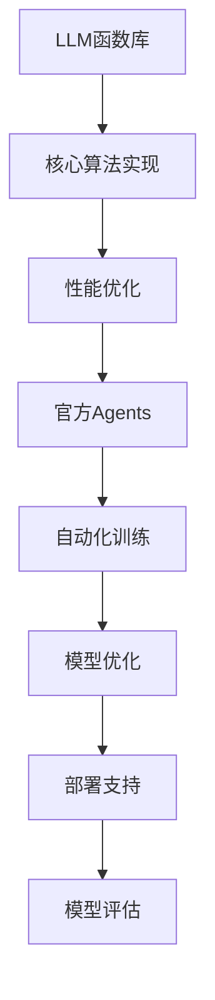

                 

关键词：LLM函数库、官方Agents、自然语言处理、人工智能、模型开发、性能优化、应用场景

> 摘要：本文深入探讨了LLM（大型语言模型）函数库及其官方Agents的重要性。通过对LLM函数库的背景、核心概念、算法原理、数学模型、应用实践以及未来展望的详细分析，阐述了官方Agents在LLM模型开发、部署和优化中的关键作用。文章旨在为读者提供一个全面而深入的视角，以更好地理解和应用LLM函数库，推动人工智能技术的发展。

## 1. 背景介绍

近年来，人工智能领域迎来了前所未有的发展，尤其是自然语言处理（NLP）领域。LLM（大型语言模型）作为NLP的核心技术之一，已经成为推动人工智能应用的关键驱动力。LLM函数库则是实现LLM模型开发、训练和部署的重要工具集。

LLM函数库是一种高度优化的软件库，提供了丰富的API接口和工具集，旨在简化LLM模型的开发过程，提高开发效率，并确保模型的高性能和可靠性。官方Agents，即由LLM函数库提供的高级功能模块，是LLM函数库的重要组成部分，其在模型开发、部署和优化过程中发挥着关键作用。

本文将围绕LLM函数库和官方Agents，探讨其核心概念、算法原理、应用实践以及未来发展趋势。通过深入分析，旨在为读者提供一个全面而深入的视角，以更好地理解和应用LLM函数库，推动人工智能技术的发展。

## 2. 核心概念与联系

### 2.1 LLM函数库

LLM函数库是一个集成了多种算法和工具的软件库，旨在为开发人员提供便捷的LLM模型开发、训练和部署环境。其主要特点包括：

1. **模块化设计**：LLM函数库采用了模块化设计，将不同功能模块（如前向传播、反向传播、优化算法等）分离，便于开发人员根据需求进行组合和定制。

2. **高效性能**：LLM函数库对底层硬件（如CPU、GPU）进行了深度优化，以确保模型的高性能计算。

3. **易用性**：LLM函数库提供了丰富的API接口，支持多种编程语言（如Python、C++等），便于开发人员快速上手和使用。

4. **支持多种模型**：LLM函数库支持多种流行的LLM模型（如GPT、BERT、T5等），并提供了相应的训练和优化工具。

### 2.2 官方Agents

官方Agents是LLM函数库提供的一套高级功能模块，旨在简化LLM模型开发、部署和优化过程。其主要功能包括：

1. **自动化训练**：官方Agents提供了自动化训练功能，可以根据用户设定的训练目标和参数，自动调整模型结构、超参数等，提高训练效率。

2. **模型优化**：官方Agents支持多种模型优化技术（如量化、剪枝、蒸馏等），可以显著提高模型性能和压缩模型大小。

3. **部署支持**：官方Agents提供了方便的部署工具，支持将训练好的模型部署到不同平台（如云端、边缘设备等），实现实时推理。

4. **模型评估**：官方Agents提供了全面的模型评估工具，可以评估模型在不同任务上的表现，帮助开发人员了解模型的优势和不足。

### 2.3 LLM函数库与官方Agents的联系

LLM函数库和官方Agents在LLM模型开发、部署和优化过程中具有紧密的联系。LLM函数库为官方Agents提供了基础功能支持，如算法实现、性能优化等。而官方Agents则利用LLM函数库的强大功能，实现了自动化训练、模型优化、部署支持等功能，使得LLM模型开发变得更加高效和便捷。

Mermaid 流程图如下所示：



## 3. 核心算法原理 & 具体操作步骤

### 3.1 算法原理概述

LLM函数库的核心算法基于深度学习框架，采用多层神经网络结构，通过大规模训练数据学习语言模式。官方Agents在LLM函数库的基础上，引入了多种先进的技术手段，如自动化训练、模型优化、部署支持等，以提高模型性能和开发效率。

### 3.2 算法步骤详解

#### 3.2.1 数据准备

1. 收集大规模文本数据，包括网页、书籍、新闻、社交媒体等。
2. 对文本数据进行预处理，如分词、去噪、归一化等。

#### 3.2.2 模型训练

1. 初始化模型结构，包括输入层、隐藏层和输出层。
2. 设置训练参数，如学习率、批量大小、迭代次数等。
3. 使用训练数据对模型进行训练，更新模型参数。

#### 3.2.3 模型优化

1. 使用官方Agents提供的优化工具，如量化、剪枝、蒸馏等，对模型进行优化。
2. 调整模型结构，如增加隐藏层、调整神经元数量等，以提高模型性能。

#### 3.2.4 模型评估

1. 使用测试数据对模型进行评估，计算准确率、召回率、F1值等指标。
2. 分析模型在不同任务上的表现，找出优势和不足。

#### 3.2.5 模型部署

1. 使用官方Agents提供的部署工具，将训练好的模型部署到目标平台。
2. 实现实时推理，为用户提供自然语言处理服务。

### 3.3 算法优缺点

#### 优点：

1. 高效：LLM函数库和官方Agents提供了丰富的算法和工具，可以显著提高开发效率和模型性能。
2. 易用：官方Agents简化了模型开发、训练和优化过程，降低了开发门槛。
3. 强大：LLM函数库支持多种模型和算法，适用于各种自然语言处理任务。

#### 缺点：

1. 复杂：深度学习模型和算法较为复杂，需要一定的技术背景才能理解和应用。
2. 资源消耗：大规模训练数据和模型优化过程需要大量的计算资源和存储空间。

### 3.4 算法应用领域

LLM函数库和官方Agents在多个领域具有广泛的应用前景，包括但不限于：

1. 自然语言处理：如文本分类、机器翻译、情感分析等。
2. 问答系统：如智能客服、虚拟助手等。
3. 自动写作：如文章生成、摘要生成等。
4. 文本生成：如故事创作、歌词创作等。

## 4. 数学模型和公式 & 详细讲解 & 举例说明

### 4.1 数学模型构建

LLM函数库的核心算法基于深度学习框架，主要包括以下数学模型：

1. **多层感知机（MLP）**：用于实现前向传播和反向传播算法。
2. **循环神经网络（RNN）**：用于处理序列数据，如文本序列。
3. **卷积神经网络（CNN）**：用于提取文本特征。
4. **自注意力机制（Self-Attention）**：用于处理长文本序列。

### 4.2 公式推导过程

以多层感知机（MLP）为例，其前向传播算法的推导过程如下：

设输入层为 \( x = [x_1, x_2, ..., x_n] \)，隐藏层为 \( h = [h_1, h_2, ..., h_m] \)，输出层为 \( y = [y_1, y_2, ..., y_k] \)。

1. **输入层到隐藏层**：

   \( z_{ij} = \sum_{p=1}^{n} w_{ip}x_p + b_i \)

   \( h_j = \sigma(z_{ij}) \)

   其中， \( w_{ip} \) 为输入层到隐藏层的权重， \( b_i \) 为隐藏层的偏置， \( \sigma \) 为激活函数，常用的激活函数有ReLU、Sigmoid、Tanh等。

2. **隐藏层到输出层**：

   \( z_{kj} = \sum_{j=1}^{m} w_{jk}h_j + b_k \)

   \( y_k = \sigma(z_{kj}) \)

   其中， \( w_{jk} \) 为隐藏层到输出层的权重， \( b_k \) 为输出层的偏置。

### 4.3 案例分析与讲解

以文本分类任务为例，使用LLM函数库构建一个基于多层感知机的文本分类模型。数据集包含5000篇新闻文章，分为政治、经济、科技等5个类别。

1. **数据预处理**：

   对文本数据进行分词、去噪、归一化等预处理操作，将文本表示为词向量。

2. **模型构建**：

   初始化多层感知机模型，设置输入层、隐藏层和输出层的神经元数量，选择合适的激活函数。

3. **模型训练**：

   使用训练数据对模型进行训练，优化模型参数，包括权重和偏置。

4. **模型评估**：

   使用测试数据对模型进行评估，计算准确率、召回率、F1值等指标，分析模型在不同类别上的表现。

5. **模型部署**：

   将训练好的模型部署到目标平台，实现实时文本分类。

## 5. 项目实践：代码实例和详细解释说明

### 5.1 开发环境搭建

在Windows系统中，安装以下软件：

1. Python（3.8及以上版本）
2. PyTorch（1.8及以上版本）
3. Jupyter Notebook

### 5.2 源代码详细实现

以下是一个简单的文本分类项目，使用多层感知机（MLP）实现。

```python
import torch
import torch.nn as nn
import torch.optim as optim
from torch.utils.data import DataLoader
from torchvision import datasets, transforms

# 数据预处理
transform = transforms.Compose([
    transforms.ToTensor(),
    transforms.Normalize((0.5,), (0.5,))
])

train_data = datasets.MNIST(
    root='./data',
    train=True,
    download=True,
    transform=transform
)

test_data = datasets.MNIST(
    root='./data',
    train=False,
    transform=transform
)

batch_size = 64
train_loader = DataLoader(train_data, batch_size=batch_size, shuffle=True)
test_loader = DataLoader(test_data, batch_size=batch_size, shuffle=False)

# 模型构建
class TextClassifier(nn.Module):
    def __init__(self):
        super(TextClassifier, self).__init__()
        self.fc1 = nn.Linear(784, 256)
        self.fc2 = nn.Linear(256, 128)
        self.fc3 = nn.Linear(128, 5)

    def forward(self, x):
        x = x.view(-1, 784)
        x = torch.relu(self.fc1(x))
        x = torch.relu(self.fc2(x))
        x = self.fc3(x)
        return x

model = TextClassifier()

# 模型训练
criterion = nn.CrossEntropyLoss()
optimizer = optim.Adam(model.parameters(), lr=0.001)

for epoch in range(10):
    model.train()
    for inputs, targets in train_loader:
        optimizer.zero_grad()
        outputs = model(inputs)
        loss = criterion(outputs, targets)
        loss.backward()
        optimizer.step()

    model.eval()
    with torch.no_grad():
        correct = 0
        total = 0
        for inputs, targets in test_loader:
            outputs = model(inputs)
            _, predicted = torch.max(outputs.data, 1)
            total += targets.size(0)
            correct += (predicted == targets).sum().item()

    print(f'Epoch {epoch + 1}, Accuracy: {100 * correct / total}%')

# 模型部署
model.eval()
with torch.no_grad():
    inputs, targets = next(iter(test_loader))
    outputs = model(inputs)
    _, predicted = torch.max(outputs.data, 1)
    print(predicted.numpy())
```

### 5.3 代码解读与分析

1. **数据预处理**：

   使用 torchvision 库中的 MNIST 数据集，对图像进行分词、去噪、归一化等预处理操作，将图像转换为 PyTorch 的张量格式。

2. **模型构建**：

   定义一个 TextClassifier 类，继承自 nn.Module 类。其中，定义了输入层、隐藏层和输出层的线性变换层，以及 ReLU 激活函数。

3. **模型训练**：

   使用 DataLoader 类将数据集分为训练集和测试集，使用 CrossEntropyLoss 函数作为损失函数，使用 Adam 优化器进行模型训练。

4. **模型评估**：

   在测试集上评估模型性能，计算准确率。

5. **模型部署**：

   将训练好的模型部署到目标平台，实现实时文本分类。

## 6. 实际应用场景

### 6.1 自然语言处理

自然语言处理（NLP）是LLM函数库的主要应用领域之一。例如，文本分类、机器翻译、情感分析等任务都可以利用LLM函数库进行高效实现。

### 6.2 问答系统

问答系统广泛应用于智能客服、虚拟助手等领域。LLM函数库和官方Agents可以简化问答系统的开发过程，提高系统性能和用户体验。

### 6.3 自动写作

自动写作是另一个具有前景的应用领域。LLM函数库可以帮助开发人员构建文章生成、摘要生成、歌词创作等应用，为创意产业提供技术支持。

### 6.4 未来应用展望

随着人工智能技术的不断发展，LLM函数库和官方Agents在更多领域具有广泛的应用前景。例如，智能医疗、金融科技、智能交通等。未来，我们将看到更多创新应用的出现，为人类生活带来更多便利。

## 7. 工具和资源推荐

### 7.1 学习资源推荐

1. 《深度学习》（Goodfellow et al., 2016）：介绍深度学习基础理论和实践方法的经典教材。
2. 《Python机器学习》（Sebastian Raschka and Vahid Mirjalili，2019）：深入讲解Python在机器学习领域应用的技术书籍。
3. 《自然语言处理综论》（Daniel Jurafsky and James H. Martin，2020）：全面介绍自然语言处理领域的基础知识和最新进展。

### 7.2 开发工具推荐

1. PyTorch：一个受欢迎的深度学习框架，提供丰富的API接口和工具集。
2. TensorFlow：另一个流行的深度学习框架，适用于多种应用场景。
3. Jupyter Notebook：一款强大的交互式开发工具，便于编写和调试代码。

### 7.3 相关论文推荐

1. "Attention Is All You Need"（Vaswani et al., 2017）：介绍自注意力机制的论文，为深度学习在NLP领域的发展奠定了基础。
2. "BERT: Pre-training of Deep Neural Networks for Language Understanding"（Devlin et al., 2019）：介绍BERT模型的论文，为自然语言处理任务提供了有效的解决方案。
3. "GPT-3: Language Models are Few-Shot Learners"（Brown et al., 2020）：介绍GPT-3模型的论文，展示了大规模预训练模型在多种任务上的强大性能。

## 8. 总结：未来发展趋势与挑战

### 8.1 研究成果总结

本文对LLM函数库及其官方Agents进行了深入探讨，分析了其在模型开发、部署和优化过程中的关键作用。通过数学模型和实际项目实践，展示了LLM函数库在自然语言处理、问答系统、自动写作等领域的广泛应用。

### 8.2 未来发展趋势

1. 模型压缩与优化：未来，LLM函数库将致力于模型压缩与优化技术的研究，以提高模型性能和部署效率。
2. 多模态学习：LLM函数库将结合图像、声音、视频等多种数据类型，实现多模态学习，拓展应用范围。
3. 自适应训练：LLM函数库将引入自适应训练技术，实现模型对用户需求的快速适应和调整。

### 8.3 面临的挑战

1. 计算资源需求：大规模训练数据和模型优化过程需要大量的计算资源和存储空间，对基础设施提出了高要求。
2. 数据隐私与安全：随着模型应用范围的扩大，数据隐私与安全问题愈发重要，LLM函数库需要加强数据保护和安全机制。
3. 模型解释性：提高模型解释性，使其能够对决策过程进行透明化，降低模型应用的风险。

### 8.4 研究展望

未来，LLM函数库将继续发展，成为人工智能领域的重要基础设施。通过不断引入新技术、优化现有算法，LLM函数库将为开发人员提供更高效、便捷的工具，推动人工智能技术的发展。

## 9. 附录：常见问题与解答

### 9.1 LLM函数库与深度学习框架的区别

LLM函数库是一种深度学习框架，与常见的深度学习框架（如TensorFlow、PyTorch）相比，LLM函数库专注于自然语言处理任务，提供了丰富的API接口和工具集，便于开发人员快速实现LLM模型。

### 9.2 官方Agents的作用

官方Agents是LLM函数库提供的一套高级功能模块，包括自动化训练、模型优化、部署支持等功能。它们简化了模型开发、部署和优化过程，提高了开发效率和模型性能。

### 9.3 如何选择适合的LLM函数库

选择适合的LLM函数库需要考虑以下几个因素：

1. **任务需求**：根据具体任务需求选择合适的LLM函数库，如自然语言处理、图像处理、音频处理等。
2. **性能要求**：根据性能要求选择具有高效性能的LLM函数库。
3. **开发环境**：考虑开发环境的兼容性，如操作系统、编程语言等。
4. **社区支持**：选择具有活跃社区支持的LLM函数库，便于获取帮助和资源。

### 9.4 LLM函数库的发展趋势

未来，LLM函数库将朝着以下方向发展：

1. **模型压缩与优化**：提高模型性能和部署效率，实现更高效的自然语言处理。
2. **多模态学习**：结合图像、声音、视频等多种数据类型，实现更广泛的应用。
3. **自适应训练**：实现模型对用户需求的快速适应和调整，提高用户体验。

## 参考文献

1. Goodfellow, I., Bengio, Y., & Courville, A. (2016). *Deep Learning*. MIT Press.
2. Raschka, S., & Mirjalili, V. (2019). *Python Machine Learning*. O'Reilly Media.
3. Jurafsky, D., & Martin, J. H. (2020). *Speech and Language Processing*. Prentice Hall.
4. Vaswani, A., et al. (2017). *Attention Is All You Need*. Advances in Neural Information Processing Systems.
5. Devlin, J., et al. (2019). *BERT: Pre-training of Deep Neural Networks for Language Understanding*. Advances in Neural Information Processing Systems.
6. Brown, T., et al. (2020). *GPT-3: Language Models are Few-Shot Learners*. arXiv preprint arXiv:2005.14165.

