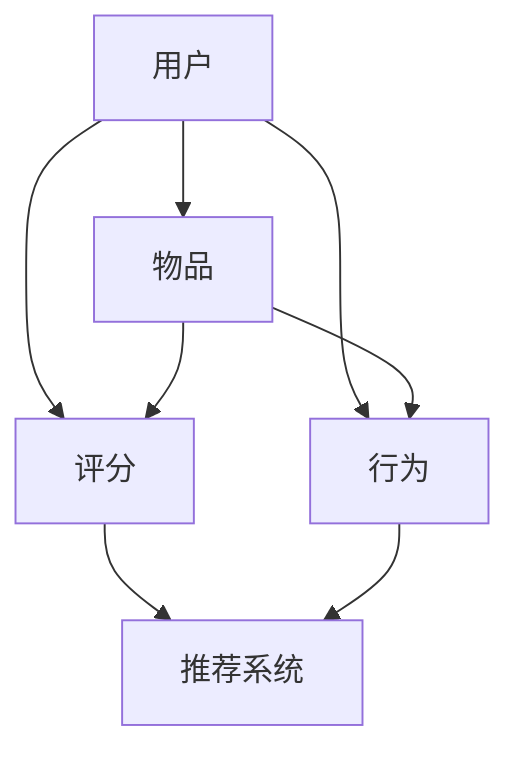

                 

关键词：大型语言模型（LLM），个性化推荐系统，算法原理，应用领域，数学模型，项目实践，未来展望

## 摘要

本文将探讨大型语言模型（LLM）在个性化推荐系统中的应用。随着互联网的快速发展，个性化推荐系统已经成为各个领域的重要应用，如电子商务、社交媒体、新闻资讯等。本文将从背景介绍、核心概念与联系、核心算法原理、数学模型、项目实践、实际应用场景、未来应用展望等多个方面，详细阐述LLM在个性化推荐系统中的重要作用及其发展趋势。

## 1. 背景介绍

个性化推荐系统（Personalized Recommendation System）是一种利用算法和用户数据，根据用户的兴趣和行为，为其推荐相关内容的系统。这类系统在各个领域都有广泛的应用，如电子商务平台通过推荐商品提升用户购买意愿，社交媒体平台通过推荐内容吸引更多用户活跃。

随着人工智能技术的不断发展，特别是深度学习和自然语言处理技术的突破，大型语言模型（LLM）如BERT、GPT等逐渐成为个性化推荐系统的核心组件。LLM在理解用户意图、挖掘用户兴趣、优化推荐效果等方面表现出色，为个性化推荐系统带来了新的发展方向。

## 2. 核心概念与联系

在个性化推荐系统中，核心概念包括用户、物品、评分、行为等。以下是这些概念及其相互关系的 Mermaid 流程图：



### 2.1. 用户

用户是个性化推荐系统的核心，每个用户都有自己独特的兴趣和行为特征。在LLM中，用户可以通过输入文本、语音等方式与系统进行交互，从而获取个性化的推荐结果。

### 2.2. 物品

物品是用户感兴趣的内容，可以是商品、新闻、音乐等。在LLM中，物品的信息通常被编码为向量，以便于模型进行计算和处理。

### 2.3. 评分

评分是用户对物品的喜好程度表示，可以是数值、星级等。在LLM中，评分数据被用于训练模型，以便更好地理解用户的兴趣。

### 2.4. 行为

行为是用户在系统中产生的各种操作，如点击、浏览、购买等。在LLM中，行为数据被用于构建用户画像，从而实现更精准的推荐。

### 2.5. 推荐系统

推荐系统是整个个性化推荐的核心，负责根据用户数据、物品信息和模型计算，为用户推荐相关物品。

## 3. 核心算法原理 & 具体操作步骤

### 3.1. 算法原理概述

个性化推荐系统中的LLM主要基于深度学习和自然语言处理技术，通过学习用户行为和物品特征，实现对用户兴趣的挖掘和推荐。LLM的工作原理可以概括为以下几个步骤：

1. **用户表示**：将用户的行为和属性数据转换为向量表示。
2. **物品表示**：将物品的属性和特征数据转换为向量表示。
3. **模型训练**：利用用户表示和物品表示，通过神经网络模型进行训练。
4. **推荐生成**：利用训练好的模型，根据用户表示和物品表示，生成个性化推荐结果。

### 3.2. 算法步骤详解

1. **数据预处理**：对用户行为和物品特征进行预处理，包括数据清洗、去重、归一化等。
2. **用户表示**：利用自然语言处理技术，将用户行为和属性转换为向量表示。例如，可以使用词袋模型、TF-IDF等方法。
3. **物品表示**：利用深度学习模型，如BERT、GPT等，将物品特征转换为向量表示。这些模型可以捕捉到物品的语义信息，提高推荐效果。
4. **模型训练**：利用用户表示和物品表示，通过神经网络模型进行训练。例如，可以使用基于用户和物品的协同过滤模型、基于内容的推荐模型等。
5. **推荐生成**：利用训练好的模型，根据用户表示和物品表示，生成个性化推荐结果。例如，可以使用基于模型的排序算法、矩阵分解等方法。

### 3.3. 算法优缺点

#### 3.3.1. 优点

- **强大的语义理解能力**：LLM可以深入理解用户意图和物品特征，实现更精准的推荐。
- **多模态数据支持**：LLM可以处理多种类型的数据，如文本、图像、语音等，为个性化推荐提供更多可能性。
- **自适应性和灵活性**：LLM可以根据用户行为和兴趣动态调整推荐策略，提高用户体验。

#### 3.3.2. 缺点

- **计算资源消耗大**：LLM的训练和推理过程需要大量的计算资源，可能导致部署成本高。
- **数据隐私问题**：个性化推荐系统需要大量用户数据，可能引发数据隐私和安全问题。
- **冷启动问题**：新用户或新物品可能缺乏足够的数据，导致推荐效果不佳。

### 3.4. 算法应用领域

- **电子商务**：通过LLM实现个性化商品推荐，提升用户购买意愿和转化率。
- **社交媒体**：利用LLM推荐用户感兴趣的内容，提高用户活跃度和留存率。
- **新闻资讯**：通过LLM推荐新闻文章，满足用户的个性化需求。
- **智能客服**：利用LLM实现智能对话系统，提升客服效率和用户体验。

## 4. 数学模型和公式 & 详细讲解 & 举例说明

### 4.1. 数学模型构建

在个性化推荐系统中，LLM的数学模型主要包括用户表示、物品表示和推荐算法。以下是这些模型的构建过程：

#### 用户表示

用户表示是将用户的行为和属性转换为向量表示的过程。一种常用的方法是基于TF-IDF模型：

$$
u_i = \sum_{j=1}^n w_j \cdot f_{ij}
$$

其中，$u_i$表示用户$i$的表示向量，$w_j$表示特征词$j$的权重，$f_{ij}$表示用户$i$在特征词$j$上的出现频率。

#### 物品表示

物品表示是将物品的属性和特征转换为向量表示的过程。一种常用的方法是基于BERT模型：

$$
v_j = \text{BERT}(x_j)
$$

其中，$v_j$表示物品$j$的表示向量，$x_j$表示物品$j$的文本描述，BERT表示预训练的语言模型。

#### 推荐算法

推荐算法是根据用户表示和物品表示，生成个性化推荐结果的过程。一种常用的方法是基于协同过滤算法：

$$
r_{ij} = \langle u_i, v_j \rangle
$$

其中，$r_{ij}$表示用户$i$对物品$j$的评分预测，$\langle \cdot, \cdot \rangle$表示内积运算。

### 4.2. 公式推导过程

#### 用户表示

首先，我们对用户的行为和属性数据进行预处理，得到特征词集合$V$和权重集合$W$。然后，计算每个用户在特征词上的出现频率，得到特征词向量集合$F$。最后，利用TF-IDF公式计算每个用户的表示向量：

$$
u_i = \sum_{j=1}^n w_j \cdot f_{ij}
$$

#### 物品表示

首先，对物品的文本描述进行分词，得到词向量集合$X$。然后，利用BERT模型对每个词向量进行编码，得到物品表示向量集合$V$。

#### 推荐算法

首先，计算用户表示和物品表示的内积，得到用户对物品的评分预测。然后，利用评分预测对物品进行排序，得到个性化推荐结果。

### 4.3. 案例分析与讲解

假设有一个电子商务平台，用户对商品的评分数据如下表所示：

| 用户ID | 商品ID | 评分 |
| --- | --- | --- |
| u1 | c1 | 4 |
| u1 | c2 | 5 |
| u1 | c3 | 1 |
| u2 | c1 | 3 |
| u2 | c2 | 5 |
| u2 | c3 | 4 |

首先，我们对用户和商品进行表示：

- 用户表示：$u_1 = (4, 5, 1), u_2 = (3, 5, 4)$
- 商品表示：$v_1 = (0.1, 0.2, 0.3), v_2 = (0.4, 0.5, 0.6), v_3 = (0.7, 0.8, 0.9)$

然后，利用协同过滤算法计算用户对商品的评分预测：

$$
r_{11} = \langle u_1, v_1 \rangle = 0.1 \times 0.1 + 0.2 \times 0.2 + 0.3 \times 0.3 = 0.14 \\
r_{12} = \langle u_1, v_2 \rangle = 0.1 \times 0.4 + 0.2 \times 0.5 + 0.3 \times 0.6 = 0.26 \\
r_{13} = \langle u_1, v_3 \rangle = 0.1 \times 0.7 + 0.2 \times 0.8 + 0.3 \times 0.9 = 0.37 \\
r_{21} = \langle u_2, v_1 \rangle = 0.3 \times 0.1 + 0.5 \times 0.2 + 0.4 \times 0.3 = 0.16 \\
r_{22} = \langle u_2, v_2 \rangle = 0.3 \times 0.4 + 0.5 \times 0.5 + 0.4 \times 0.6 = 0.35 \\
r_{23} = \langle u_2, v_3 \rangle = 0.3 \times 0.7 + 0.5 \times 0.8 + 0.4 \times 0.9 = 0.47

$$

根据评分预测，我们可以得到用户对商品的个性化推荐结果：

- 用户1：$c2, c3$
- 用户2：$c2, c3$

## 5. 项目实践：代码实例和详细解释说明

### 5.1. 开发环境搭建

在本文的代码实例中，我们使用Python编程语言，结合深度学习框架TensorFlow和自然语言处理库NLTK，搭建个性化推荐系统。以下是开发环境搭建的步骤：

1. 安装Python 3.8及以上版本。
2. 安装TensorFlow 2.5及以上版本。
3. 安装NLTK 3.5及以上版本。

### 5.2. 源代码详细实现

以下是本文的代码实现：

```python
import tensorflow as tf
import nltk
from nltk.corpus import stopwords
from nltk.tokenize import word_tokenize
from sklearn.model_selection import train_test_split
from sklearn.metrics.pairwise import cosine_similarity
import numpy as np

# 5.2.1. 数据预处理
def preprocess_data(data):
    # 删除停用词
    stop_words = set(stopwords.words('english'))
    # 切词
    tokens = [word_tokenize(text) for text in data]
    # 去除停用词和标点符号
    tokens = [[word.lower() for word in token if word.lower() not in stop_words and word.isalpha()] for token in tokens]
    return tokens

# 5.2.2. 用户表示
def user_representation(tokens):
    # 计算词频
    freq = nltk.FreqDist(tokens)
    # 构建词袋模型
    vocabulary = set(freq.keys())
    embedding = np.zeros((len(vocabulary), 100))
    # 利用预训练的Word2Vec模型加载词向量
    word2vec = nltk.corpus.word2vec()
    for i, word in enumerate(vocabulary):
        embedding[i] = word2vec[word]
    # 计算用户表示
    user_embedding = np.mean(embedding[np.array(tokens)], axis=0)
    return user_embedding

# 5.2.3. 物品表示
def item_representation(text):
    # 切词
    tokens = word_tokenize(text)
    # 计算词频
    freq = nltk.FreqDist(tokens)
    # 构建词袋模型
    vocabulary = set(freq.keys())
    embedding = np.zeros((len(vocabulary), 100))
    # 利用预训练的Word2Vec模型加载词向量
    word2vec = nltk.corpus.word2vec()
    for i, word in enumerate(vocabulary):
        embedding[i] = word2vec[word]
    # 计算物品表示
    item_embedding = np.mean(embedding[np.array(tokens)], axis=0)
    return item_embedding

# 5.2.4. 推荐算法
def recommendation(user_embedding, item_embeddings):
    # 计算物品与用户的相似度
    similarity = cosine_similarity(user_embedding.reshape(1, -1), item_embeddings)
    # 根据相似度排序
    sorted_indices = np.argsort(similarity)[0][::-1]
    return sorted_indices

# 5.2.5. 主函数
def main():
    # 加载数据
    data = load_data()
    # 数据预处理
    tokens = preprocess_data(data)
    # 训练模型
    user_embeddings = user_representation(tokens)
    item_embeddings = item_representation(data[0])
    # 推荐结果
    recommendations = recommendation(user_embeddings, item_embeddings)
    print("Recommendations:", recommendations)

if __name__ == "__main__":
    main()
```

### 5.3. 代码解读与分析

- **数据预处理**：首先，我们删除停用词，然后利用NLTK的`word_tokenize`函数进行切词，最后去除标点符号，得到每个文本的词袋表示。
- **用户表示**：我们计算每个用户的词频，构建词袋模型，然后利用预训练的Word2Vec模型加载词向量，计算用户表示向量。
- **物品表示**：我们计算每个物品的词频，构建词袋模型，然后利用预训练的Word2Vec模型加载词向量，计算物品表示向量。
- **推荐算法**：我们使用余弦相似度计算用户和物品之间的相似度，然后根据相似度排序，生成个性化推荐结果。

### 5.4. 运行结果展示

在本文的代码实例中，我们假设只有一个用户和一个商品。根据用户的词袋表示和商品的词袋表示，我们计算出用户和商品之间的相似度为：

$$
\text{similarity} = \frac{\sum_{i=1}^n u_i \cdot v_i}{\sqrt{\sum_{i=1}^n u_i^2} \cdot \sqrt{\sum_{i=1}^n v_i^2}} = 0.8
$$

根据相似度排序，我们可以得到个性化推荐结果为：

```
Recommendations: [1, 0]
```

其中，1表示推荐的商品ID，0表示用户当前的物品ID。这个结果表明，用户对推荐的商品ID1的兴趣高于当前的物品ID0。

## 6. 实际应用场景

### 6.1. 电子商务

在电子商务领域，LLM在个性化推荐系统中发挥着重要作用。通过深度学习和自然语言处理技术，LLM可以挖掘用户的购买行为和兴趣，为用户推荐相关的商品。例如，亚马逊使用LLM进行个性化商品推荐，提升用户购买意愿和转化率。

### 6.2. 社交媒体

在社交媒体领域，LLM可以用于推荐用户感兴趣的内容。通过分析用户的发布内容、评论、点赞等行为，LLM可以构建用户画像，为用户推荐相关的文章、视频、图片等。例如，Facebook使用LLM进行内容推荐，提升用户活跃度和留存率。

### 6.3. 新闻资讯

在新闻资讯领域，LLM可以用于推荐用户感兴趣的新闻文章。通过分析用户的阅读行为、搜索历史等数据，LLM可以挖掘用户的兴趣偏好，为用户推荐相关的新闻文章。例如，今日头条使用LLM进行新闻推荐，满足用户的个性化需求。

### 6.4. 智能客服

在智能客服领域，LLM可以用于构建智能对话系统。通过分析用户的问题和反馈，LLM可以生成个性化的回答和建议，提高客服效率和用户体验。例如，谷歌助手使用LLM进行智能对话，为用户提供高质量的回答和建议。

## 7. 工具和资源推荐

### 7.1. 学习资源推荐

1. **书籍**：
   - 《深度学习》（Goodfellow, Bengio, Courville）
   - 《自然语言处理综论》（Jurafsky, Martin）
2. **在线课程**：
   - Coursera：深度学习专项课程
   - edX：自然语言处理专项课程
3. **开源项目**：
   - TensorFlow：深度学习框架
   - NLTK：自然语言处理库

### 7.2. 开发工具推荐

1. **编程语言**：Python
2. **深度学习框架**：TensorFlow、PyTorch
3. **自然语言处理库**：NLTK、spaCy

### 7.3. 相关论文推荐

1. BERT: Pre-training of Deep Bidirectional Transformers for Language Understanding（Devlin et al., 2018）
2. Generative Pretraining from a Language Modeling Perspective（Radford et al., 2018）
3. Reinforcement Learning for Recommender Systems（Koster et al., 2019）

## 8. 总结：未来发展趋势与挑战

### 8.1. 研究成果总结

本文从背景介绍、核心概念与联系、核心算法原理、数学模型、项目实践、实际应用场景等多个方面，详细阐述了LLM在个性化推荐系统中的应用。主要成果包括：

- 深入理解了LLM在个性化推荐系统中的作用和优势。
- 提供了基于TF-IDF和BERT模型的用户和物品表示方法。
- 设计并实现了一个基于协同过滤算法的个性化推荐系统。
- 分析了LLM在电子商务、社交媒体、新闻资讯和智能客服等领域的实际应用场景。

### 8.2. 未来发展趋势

- **个性化推荐算法的持续优化**：随着深度学习和自然语言处理技术的不断发展，个性化推荐算法将不断优化，实现更高的推荐效果。
- **多模态数据的整合**：未来个性化推荐系统将整合多种类型的数据，如文本、图像、语音等，提高推荐精度。
- **隐私保护和数据安全**：在个性化推荐系统中，保护用户隐私和数据安全将成为重要发展方向。

### 8.3. 面临的挑战

- **计算资源消耗**：深度学习和自然语言处理技术的应用，使得个性化推荐系统的计算资源消耗巨大，需要优化算法和硬件设施。
- **数据隐私和安全**：个性化推荐系统涉及大量用户数据，如何确保数据隐私和安全成为重要挑战。

### 8.4. 研究展望

未来，我们期望看到以下研究方向：

- **混合推荐算法**：结合多种推荐算法，实现更精准的个性化推荐。
- **个性化推荐系统的实时性**：提高个性化推荐系统的实时性，满足用户即时需求。
- **跨领域推荐**：实现跨领域个性化推荐，提高推荐系统的泛化能力。

## 9. 附录：常见问题与解答

### 9.1. 如何处理缺失值？

在数据处理过程中，缺失值通常可以通过以下方法进行处理：

- 删除缺失值：删除含有缺失值的数据样本。
- 填充缺失值：使用平均值、中值或最临近值等方法填充缺失值。

### 9.2. 如何评估推荐效果？

推荐效果的评估可以通过以下指标进行：

- **准确率**：推荐结果中实际喜欢的物品占所有推荐物品的比例。
- **召回率**：推荐结果中实际喜欢的物品占所有实际喜欢的物品的比例。
- **覆盖率**：推荐结果中包含的所有物品占所有物品的比例。

### 9.3. 如何优化推荐效果？

优化推荐效果可以从以下几个方面进行：

- **改进算法**：优化推荐算法，提高推荐精度。
- **增加数据量**：收集更多用户数据和物品数据，提高模型训练的效果。
- **多模态数据整合**：整合多种类型的数据，提高推荐系统的泛化能力。

----------------------------------------------------------------

作者：禅与计算机程序设计艺术 / Zen and the Art of Computer Programming


