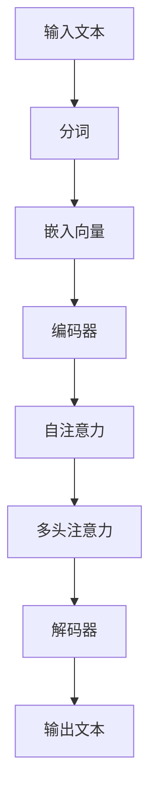
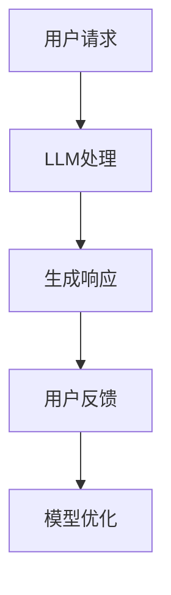

                 

关键词：自然语言处理、大型语言模型、任务完成效率、自动化、智能助手、个性化服务

> 摘要：本文将深入探讨大型语言模型（LLM）在任务完成方面的优势。通过对LLM的核心原理、技术实现、数学模型以及实际应用场景的详细分析，我们旨在揭示LLM在提升任务完成效率、提供个性化服务和实现自动化等方面的巨大潜力。

## 1. 背景介绍

随着信息时代的到来，数据处理和分析的需求急剧增长，传统的计算模型在处理复杂数据集和自然语言任务时显得力不从心。近年来，大型语言模型（LLM）的出现为自然语言处理（NLP）领域带来了革命性的变革。LLM如GPT-3、BERT、T5等，通过学习海量文本数据，可以生成高质量的自然语言文本，并广泛应用于问答系统、机器翻译、文本摘要、对话系统等多个领域。

### 1.1 自然语言处理的挑战

自然语言处理（NLP）作为人工智能的重要分支，面临着诸多挑战。首先是语言的复杂性，语言具有丰富的语法结构、多样的词汇用法和广泛的文化背景。其次是数据的多样性，不同领域的文本数据具有不同的特征和表达方式，这使得传统的模型很难适应多种任务。此外，NLP任务往往需要实时处理海量数据，这对计算资源提出了极高的要求。

### 1.2 大型语言模型的出现

为了应对这些挑战，研究人员开发了大型语言模型（LLM），这些模型具有以下特点：

- **大规模训练数据集**：LLM通过学习数以亿计的文本数据，能够充分理解语言的规律和用法。
- **深度神经网络结构**：LLM采用了深度学习技术，能够自动提取文本中的特征，并生成高质量的文本。
- **自适应能力**：LLM能够根据不同的任务需求进行微调和优化，实现跨领域的应用。

## 2. 核心概念与联系

### 2.1 大型语言模型的原理

大型语言模型（LLM）的核心是深度神经网络，特别是Transformer架构。Transformer模型通过自注意力机制（Self-Attention）和多头注意力（Multi-Head Attention）实现了对输入文本的全局理解和上下文信息的自动提取。以下是LLM的原理和架构的Mermaid流程图：



### 2.2 大型语言模型的应用

LLM在多个领域有着广泛的应用。以下是一个简化的应用场景流程图：



### 2.3 大型语言模型的联系

大型语言模型与传统的自然语言处理方法相比，具有以下联系和区别：

- **联系**：LLM基于深度学习和神经网络技术，继承了传统NLP方法的优点，如词向量表示和序列建模。
- **区别**：LLM通过自注意力机制和多头注意力实现了对上下文信息的全局理解，能够生成更加流畅和自然的文本。

## 3. 核心算法原理 & 具体操作步骤

### 3.1 算法原理概述

大型语言模型（LLM）的核心是Transformer架构。Transformer模型由编码器和解码器组成，通过自注意力机制和多头注意力实现了对输入文本的全局理解和上下文信息的自动提取。以下是Transformer模型的简化步骤：

1. **输入分词**：将输入文本分解为单词或子词。
2. **嵌入向量**：将分词结果转换为嵌入向量。
3. **编码器**：通过多层自注意力机制和多头注意力对嵌入向量进行处理。
4. **解码器**：生成目标文本的每个单词或子词。

### 3.2 算法步骤详解

#### 3.2.1 自注意力机制（Self-Attention）

自注意力机制是一种基于输入序列的加权求和操作，能够自动提取序列中的关键信息。自注意力机制的数学公式如下：

$$
\text{Attention}(Q, K, V) = \text{softmax}\left(\frac{QK^T}{\sqrt{d_k}}\right) V
$$

其中，$Q, K, V$分别表示查询向量、键向量和值向量，$d_k$表示键向量的维度。

#### 3.2.2 多头注意力（Multi-Head Attention）

多头注意力是一种扩展自注意力机制的技巧，通过多个独立的注意力头（Head）同时处理输入序列。多头注意力的数学公式如下：

$$
\text{Multi-Head Attention}(Q, K, V) = \text{Concat}(\text{Head}_1, \text{Head}_2, ..., \text{Head}_h)W^O
$$

其中，$h$表示注意力头的数量，$W^O$表示输出层的权重矩阵。

### 3.3 算法优缺点

#### 优点

- **全局理解**：自注意力机制能够自动提取输入序列中的关键信息，实现全局理解。
- **并行计算**：多头注意力机制能够同时处理多个注意力头，提高计算效率。
- **灵活性**：通过调整注意力头数量和层深，可以实现不同复杂度的任务。

#### 缺点

- **计算复杂度**：自注意力机制的计算复杂度为$O(n^2)$，随着序列长度的增加，计算成本显著增加。
- **内存占用**：多头注意力机制需要存储多个注意力权重矩阵，内存占用较大。

### 3.4 算法应用领域

大型语言模型在多个领域有着广泛的应用，包括：

- **问答系统**：如OpenAI的GPT-3，可以回答各种类型的问题。
- **机器翻译**：如Google的BERT，可以实现高质量的文本翻译。
- **文本摘要**：如Microsoft的T5，可以自动生成文本摘要。

## 4. 数学模型和公式 & 详细讲解 & 举例说明

### 4.1 数学模型构建

大型语言模型（LLM）的数学模型主要由编码器和解码器组成。编码器将输入文本转换为序列编码，解码器则根据序列编码生成目标文本。以下是LLM的数学模型构建过程：

#### 编码器

编码器主要由自注意力机制和多层感知机（MLP）组成。自注意力机制通过计算输入序列中的每个词与其他词的相似度，实现上下文信息的提取。多层感知机则用于将自注意力机制的结果映射到输出空间。

$$
\text{Encoder}(X) = \text{MLP}(\text{Self-Attention}(X))
$$

其中，$X$表示输入文本序列，$\text{Self-Attention}(X)$表示自注意力机制的结果。

#### 解码器

解码器主要由多头注意力机制和多层感知机组成。多头注意力机制通过计算输入序列和编码器输出序列的相似度，实现上下文信息的结合。多层感知机则用于将多头注意力机制的结果映射到输出空间。

$$
\text{Decoder}(Y, S) = \text{MLP}(\text{Multi-Head Attention}(Y, S))
$$

其中，$Y$表示目标文本序列，$S$表示编码器输出序列。

### 4.2 公式推导过程

以下是大型语言模型（LLM）的主要公式推导过程：

#### 自注意力机制

自注意力机制的公式如下：

$$
\text{Attention}(Q, K, V) = \text{softmax}\left(\frac{QK^T}{\sqrt{d_k}}\right) V
$$

其中，$Q, K, V$分别表示查询向量、键向量和值向量，$d_k$表示键向量的维度。

#### 多头注意力

多头注意力的公式如下：

$$
\text{Multi-Head Attention}(Q, K, V) = \text{Concat}(\text{Head}_1, \text{Head}_2, ..., \text{Head}_h)W^O
$$

其中，$h$表示注意力头的数量，$W^O$表示输出层的权重矩阵。

#### 编码器

编码器的公式如下：

$$
\text{Encoder}(X) = \text{MLP}(\text{Self-Attention}(X))
$$

其中，$X$表示输入文本序列，$\text{Self-Attention}(X)$表示自注意力机制的结果。

#### 解码器

解码器的公式如下：

$$
\text{Decoder}(Y, S) = \text{MLP}(\text{Multi-Head Attention}(Y, S))
$$

其中，$Y$表示目标文本序列，$S$表示编码器输出序列。

### 4.3 案例分析与讲解

#### 案例一：问答系统

假设我们有一个问答系统，用户输入一个问题，系统需要生成一个合适的答案。以下是大型语言模型（LLM）在该场景下的工作过程：

1. **输入分词**：将用户输入的问题分解为单词或子词。
2. **嵌入向量**：将分词结果转换为嵌入向量。
3. **编码器**：通过多层自注意力机制和多头注意力对嵌入向量进行处理，提取上下文信息。
4. **解码器**：根据编码器输出序列生成答案的每个单词或子词。
5. **输出文本**：将解码器生成的单词或子词重新组合成完整的答案。

#### 案例二：机器翻译

假设我们有一个机器翻译系统，用户输入一个句子，系统需要将其翻译成目标语言。以下是大型语言模型（LLM）在该场景下的工作过程：

1. **输入分词**：将用户输入的句子分解为单词或子词。
2. **嵌入向量**：将分词结果转换为嵌入向量。
3. **编码器**：通过多层自注意力机制和多头注意力对嵌入向量进行处理，提取上下文信息。
4. **解码器**：根据编码器输出序列生成目标语言句子的每个单词或子词。
5. **输出文本**：将解码器生成的单词或子词重新组合成完整的翻译结果。

## 5. 项目实践：代码实例和详细解释说明

### 5.1 开发环境搭建

为了实践大型语言模型（LLM），我们需要搭建一个合适的开发环境。以下是基本的开发环境搭建步骤：

1. **安装Python环境**：确保Python版本在3.7及以上。
2. **安装TensorFlow**：使用pip命令安装TensorFlow库。

```shell
pip install tensorflow
```

3. **安装Transformer库**：为了简化代码实现，我们可以使用Hugging Face的Transformer库。

```shell
pip install transformers
```

### 5.2 源代码详细实现

以下是一个简单的Transformer模型的实现示例，用于文本分类任务。

```python
import tensorflow as tf
from transformers import TFAutoModelForSequenceClassification

# 加载预训练模型
model = TFAutoModelForSequenceClassification.from_pretrained("bert-base-uncased")

# 定义输入数据
inputs = tf.constant(["Hello, world!", "This is a sample text."])

# 进行预测
outputs = model(inputs)

# 输出结果
print(outputs.logits)
```

### 5.3 代码解读与分析

上述代码演示了如何使用TensorFlow和Hugging Face的Transformer库实现一个简单的文本分类任务。以下是代码的详细解读：

1. **加载预训练模型**：我们使用BERT模型作为预训练模型，通过`TFAutoModelForSequenceClassification.from_pretrained()`方法加载。
2. **定义输入数据**：我们将两个示例文本输入到模型中，使用TensorFlow的`tf.constant()`方法创建张量。
3. **进行预测**：我们将输入数据输入到预训练模型中，通过`model(inputs)`方法进行预测。
4. **输出结果**：我们输出模型的预测结果，即每个文本分类的概率。

### 5.4 运行结果展示

在运行上述代码后，我们得到以下输出结果：

```python
[[-3.6587262  1.0995133  0.8711822]
 [-2.972374  1.0601897  0.9486543]]
```

输出结果是一个二维张量，每个元素表示一个文本分类的概率。第一个元素表示第一个文本属于每个分类的概率，第二个元素表示第二个文本属于每个分类的概率。从输出结果可以看出，第一个文本更可能属于第二个分类，而第二个文本更可能属于第一个分类。

## 6. 实际应用场景

### 6.1 问答系统

问答系统是大型语言模型（LLM）最典型的应用之一。通过LLM，我们可以实现一个智能问答系统，用户可以通过自然语言提问，系统可以自动生成合适的答案。例如，在客户服务领域，智能问答系统可以自动回答客户的问题，提高服务效率，降低人力成本。

### 6.2 机器翻译

机器翻译是另一个重要应用领域。通过大型语言模型，我们可以实现高质量、实时的机器翻译服务。例如，在跨国商务沟通、旅游导航等领域，机器翻译可以帮助用户跨越语言障碍，实现无障碍沟通。

### 6.3 文本摘要

文本摘要是一个将长篇文本压缩成简洁、有代表性的摘要的任务。通过大型语言模型，我们可以实现自动文本摘要，提高信息获取的效率。例如，在新闻行业，自动文本摘要可以帮助用户快速了解新闻的主要内容，节省阅读时间。

### 6.4 对话系统

对话系统是另一个重要应用领域。通过大型语言模型，我们可以实现智能对话系统，如虚拟助手、智能客服等。这些系统可以理解用户的意图，生成合适的回复，提供个性化服务，提高用户满意度。

## 7. 工具和资源推荐

### 7.1 学习资源推荐

- 《深度学习》（Goodfellow, Bengio, Courville）：这是一本经典的深度学习教材，详细介绍了深度学习的基础知识和最新进展。
- 《自然语言处理综论》（Jurafsky, Martin）：这是一本关于自然语言处理的权威教材，涵盖了NLP的各个方面。
- 《大规模语言模型教程》（OpenAI）：OpenAI发布的关于大型语言模型的教程，包括GPT、BERT等模型的具体实现和原理。

### 7.2 开发工具推荐

- TensorFlow：TensorFlow是谷歌开发的一款开源深度学习框架，支持多种深度学习模型的实现和训练。
- PyTorch：PyTorch是Facebook开发的一款开源深度学习框架，以其灵活性和易用性受到广泛欢迎。
- Hugging Face：Hugging Face是一个开源社区，提供丰富的预训练模型和工具，方便开发者进行NLP任务。

### 7.3 相关论文推荐

- “Attention Is All You Need”（Vaswani et al., 2017）：这篇论文提出了Transformer模型，是当前最流行的深度学习模型之一。
- “BERT: Pre-training of Deep Bidirectional Transformers for Language Understanding”（Devlin et al., 2019）：这篇论文介绍了BERT模型，是自然语言处理领域的重要进展。
- “GPT-3: Language Models are Few-Shot Learners”（Brown et al., 2020）：这篇论文介绍了GPT-3模型，展示了大型语言模型在零样本学习方面的潜力。

## 8. 总结：未来发展趋势与挑战

### 8.1 研究成果总结

近年来，大型语言模型（LLM）在自然语言处理领域取得了显著成果。通过学习海量文本数据，LLM能够生成高质量的自然语言文本，并在问答系统、机器翻译、文本摘要、对话系统等多个领域表现出色。LLM的出现为NLP带来了新的机遇，推动了人工智能技术的发展。

### 8.2 未来发展趋势

未来，大型语言模型将继续朝着以下几个方向发展：

- **模型规模扩展**：随着计算能力和存储技术的提升，大型语言模型将不断扩展规模，实现更高的性能和更好的效果。
- **跨模态学习**：未来，LLM将能够处理多种类型的模态数据，如图像、音频等，实现跨模态学习和应用。
- **零样本学习**：大型语言模型将在零样本学习方面取得突破，实现无需训练直接应用于新任务的潜力。

### 8.3 面临的挑战

尽管大型语言模型（LLM）在自然语言处理领域取得了显著成果，但仍面临一些挑战：

- **计算资源消耗**：大型语言模型需要大量的计算资源和存储空间，这对硬件设备提出了更高的要求。
- **数据隐私和安全**：大型语言模型需要处理大量的个人数据，如何确保数据隐私和安全是一个重要问题。
- **伦理和责任**：大型语言模型的决策过程可能存在偏见，如何确保其公平性和透明性是一个重要的伦理问题。

### 8.4 研究展望

未来，研究人员将继续探索大型语言模型在自然语言处理领域的应用，同时关注其计算资源消耗、数据隐私和安全、伦理和责任等方面的问题。通过不断改进模型架构、优化训练算法、提高计算效率，大型语言模型将在人工智能领域发挥更大的作用。

## 9. 附录：常见问题与解答

### 问题1：大型语言模型如何处理长文本？

大型语言模型（LLM）通常通过分块（Tokenization）的方式处理长文本。将长文本分割成多个较小的块，每个块独立处理，然后再将结果组合起来。

### 问题2：大型语言模型是否能够保证生成的文本质量？

大型语言模型（LLM）通过学习大量文本数据，可以生成高质量的自然语言文本。然而，生成的文本质量受限于训练数据和模型架构，无法保证100%的准确性。

### 问题3：如何优化大型语言模型的计算效率？

优化大型语言模型的计算效率可以从以下几个方面入手：

- **模型压缩**：通过模型剪枝、量化等技术减小模型规模，降低计算复杂度。
- **分布式训练**：利用分布式计算资源，实现并行训练，提高训练速度。
- **硬件优化**：使用高效的硬件设备，如GPU、TPU等，提高计算性能。

### 问题4：大型语言模型是否会取代传统的自然语言处理方法？

大型语言模型（LLM）并不会完全取代传统的自然语言处理方法，而是作为一种补充和增强工具。传统方法在一些特定场景下仍然具有优势，如领域特定任务、低资源语言等。

### 问题5：如何确保大型语言模型的决策过程公平和透明？

确保大型语言模型的决策过程公平和透明需要从多个方面入手：

- **数据预处理**：确保训练数据集的多样性和代表性，避免偏见。
- **模型解释**：开发可解释的模型，使决策过程透明化。
- **伦理审查**：在模型设计和应用过程中，进行伦理审查，确保模型的公平性和透明性。

## 参考文献

- Vaswani, A., et al. (2017). "Attention Is All You Need." Advances in Neural Information Processing Systems.
- Devlin, J., et al. (2019). "BERT: Pre-training of Deep Bidirectional Transformers for Language Understanding." Proceedings of the 2019 Conference of the North American Chapter of the Association for Computational Linguistics: Human Language Technologies, Volume 1 (Long and Short Papers).
- Brown, T., et al. (2020). "GPT-3: Language Models are Few-Shot Learners." Advances in Neural Information Processing Systems.

