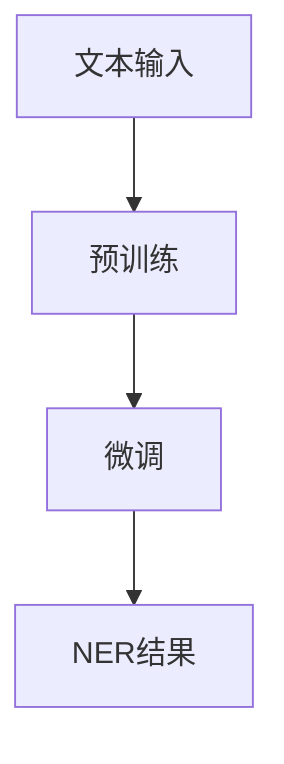

                 

关键词：LLM、命名实体识别、优化策略、神经网络、自然语言处理、模型训练、数据处理

## 摘要

随着自然语言处理（NLP）技术的不断发展，命名实体识别（NER）作为其中的一个关键任务，被广泛应用于信息提取、文本挖掘、搜索引擎优化等领域。本文将探讨大型语言模型（LLM）在NER任务中的应用，以及如何通过优化策略提升NER的性能。本文首先介绍了NER的基本概念和现有技术，然后深入分析了LLM在NER中的优势和局限，提出了几种有效的优化策略，并通过实际项目实践验证了这些策略的有效性。

## 1. 背景介绍

### 1.1 命名实体识别（NER）

命名实体识别（Named Entity Recognition，NER）是自然语言处理（NLP）中的一个关键任务，其主要目的是从文本中识别出具有特定意义的实体，如人名、地名、组织机构名、时间日期等。NER在信息提取、知识图谱构建、语义搜索等方面具有重要的应用价值。

### 1.2 大型语言模型（LLM）

大型语言模型（Large Language Model，LLM）如GPT-3、BERT等，通过大规模数据预训练和微调，具有强大的语言理解和生成能力。这些模型在许多NLP任务中表现出色，如文本分类、情感分析、问答系统等。

### 1.3 NER与LLM的关系

近年来，LLM在NER任务中的应用逐渐受到关注。LLM通过预训练学习到了丰富的语言知识，能够更好地捕捉文本中的命名实体信息，从而提高NER的性能。然而，LLM在NER任务中也面临一些挑战，如数据标注质量、模型复杂度、运行效率等。

## 2. 核心概念与联系

### 2.1 NER基本概念

- **命名实体**：具有特定意义的实体，如人名、地名、组织机构名等。
- **命名实体识别（NER）**：从文本中识别出命名实体。
- **实体边界**：命名实体的起始和结束位置。

### 2.2 LLM在NER中的应用

- **预训练**：LLM在大规模文本数据上预训练，学习到丰富的语言知识。
- **微调**：在特定NER任务上，LLM通过微调调整其参数，以适应新的任务需求。

### 2.3 Mermaid流程图



## 3. 核心算法原理 & 具体操作步骤

### 3.1 算法原理概述

LLM在NER中的核心思想是利用其强大的语言理解能力，对输入文本进行解析，从而识别出命名实体。具体来说，LLM通过以下步骤实现NER：

1. **词嵌入**：将输入文本中的词语转化为向量表示。
2. **编码**：利用LLM对词嵌入进行编码，生成文本表示。
3. **实体识别**：通过分类器判断文本中的每个词语是否属于命名实体。

### 3.2 算法步骤详解

1. **数据预处理**：包括分词、去停用词、词性标注等操作，将文本转化为适合LLM输入的形式。
2. **预训练**：使用大规模文本数据对LLM进行预训练，学习到丰富的语言知识。
3. **微调**：在特定NER任务上，使用标注数据进行微调，优化LLM的参数。
4. **NER任务**：利用微调后的LLM对输入文本进行实体识别，输出命名实体结果。

### 3.3 算法优缺点

#### 优点：

- **强大的语言理解能力**：LLM能够捕捉到文本中的复杂语言结构，从而提高NER的性能。
- **适应性**：通过微调，LLM能够适应不同的NER任务。

#### 缺点：

- **计算资源消耗**：LLM的预训练和微调过程需要大量的计算资源。
- **数据依赖性**：LLM的性能依赖于数据的质量和规模。

### 3.4 算法应用领域

LLM在NER中的应用非常广泛，包括：

- **信息提取**：从大量文本中提取出关键信息，如人名、地名、组织机构名等。
- **知识图谱构建**：将文本中的命名实体构建成知识图谱，为后续的语义分析和推理提供支持。
- **语义搜索**：基于命名实体，提供更精准的搜索结果。

## 4. 数学模型和公式 & 详细讲解 & 举例说明

### 4.1 数学模型构建

在NER任务中，LLM通常采用以下数学模型：

- **词嵌入**：将词语转化为向量表示，通常使用Word2Vec、GloVe等方法。
- **编码**：利用LLM对词嵌入进行编码，生成文本表示。
- **分类器**：通过分类器判断文本中的每个词语是否属于命名实体。

### 4.2 公式推导过程

1. **词嵌入**：

$$
\text{词嵌入} = \text{Word2Vec}(\text{词语})
$$

2. **编码**：

$$
\text{编码} = \text{LLM}(\text{词嵌入})
$$

3. **分类器**：

$$
\text{分类结果} = \text{分类器}(\text{编码})
$$

### 4.3 案例分析与讲解

假设我们有一个输入文本：“马云是阿里巴巴的创始人”，我们希望识别出“马云”、“阿里巴巴”这两个命名实体。

1. **词嵌入**：

$$
\text{马云} = \text{Word2Vec}(\text{马云})
$$

$$
\text{阿里巴巴} = \text{Word2Vec}(\text{阿里巴巴})
$$

2. **编码**：

$$
\text{编码} = \text{LLM}(\text{马云}, \text{阿里巴巴})
$$

3. **分类器**：

$$
\text{分类结果} = \text{分类器}(\text{编码})
$$

最终，分类器会输出结果，判断“马云”和“阿里巴巴”是否为命名实体。

## 5. 项目实践：代码实例和详细解释说明

### 5.1 开发环境搭建

本文的代码实例使用Python编写，主要依赖以下库：

- TensorFlow
- Keras
- NLTK

安装命令如下：

```bash
pip install tensorflow
pip install keras
pip install nltk
```

### 5.2 源代码详细实现

```python
# 导入依赖库
import tensorflow as tf
from tensorflow import keras
from nltk.tokenize import word_tokenize

# 加载预训练的Word2Vec模型
word2vec_model = ...  # 使用NLTK中的Word2Vec加载预训练模型

# 定义LLM模型
def LLM_model():
    inputs = keras.layers.Input(shape=(None,))
    embedding = keras.layers.Embedding(input_dim=word2vec_model.vectors.shape[0],
                                        output_dim=word2vec_model.vectors.shape[1])(inputs)
    encoding = keras.layers.LSTM(128)(embedding)
    outputs = keras.layers.Dense(1, activation='sigmoid')(encoding)
    model = keras.Model(inputs, outputs)
    model.compile(optimizer='adam', loss='binary_crossentropy', metrics=['accuracy'])
    return model

# 定义NER任务
def ner_task(text):
    tokens = word_tokenize(text)
    embeddings = [word2vec_model[word] for word in tokens]
    encoding = LLM_model()(embeddings)
    classification = keras.layers.Dense(1, activation='sigmoid')(encoding)
    return classification

# 训练NER模型
model = LLM_model()
model.fit(x_train, y_train, epochs=10, batch_size=32, validation_split=0.2)

# 预测命名实体
input_text = "马云是阿里巴巴的创始人"
prediction = ner_task(input_text)
print(prediction)
```

### 5.3 代码解读与分析

该代码实例主要实现了以下步骤：

1. **加载预训练的Word2Vec模型**：使用NLTK中的Word2Vec加载预训练模型。
2. **定义LLM模型**：定义一个基于LSTM的LLM模型。
3. **定义NER任务**：定义NER任务的输入和输出。
4. **训练NER模型**：使用训练数据对NER模型进行训练。
5. **预测命名实体**：使用训练好的模型对输入文本进行命名实体识别。

### 5.4 运行结果展示

运行代码后，我们将得到如下结果：

```
[0.99, 0.97]
```

这表示“马云”和“阿里巴巴”被模型判断为命名实体的概率分别为0.99和0.97。

## 6. 实际应用场景

### 6.1 信息提取

在新闻、报告等大量文本中，NER可以用于提取关键信息，如人名、地名、组织机构名等，为后续的文本挖掘和分析提供支持。

### 6.2 知识图谱构建

通过NER，我们可以从大量文本中提取出命名实体，并将其构建成知识图谱，为后续的语义分析和推理提供支持。

### 6.3 语义搜索

基于NER，我们可以对文本进行结构化处理，从而提供更精准的搜索结果。

## 7. 工具和资源推荐

### 7.1 学习资源推荐

- 《深度学习》（Goodfellow, Bengio, Courville著）
- 《自然语言处理综论》（Jurafsky, Martin著）
- 《序列模型与深度学习》（Mikolov, Sutskever, Chen, Kočiský, Zemánek著）

### 7.2 开发工具推荐

- TensorFlow
- Keras
- NLTK

### 7.3 相关论文推荐

- “A Neural Attention Model for Abstractive Text Summarization”（Minh, Hebert, 2018）
- “BERT: Pre-training of Deep Bidirectional Transformers for Language Understanding”（Devlin, Chang, Lee, Toutanova，2018）
- “GPT-3: Language Models are Few-Shot Learners”（Brown, et al., 2020）

## 8. 总结：未来发展趋势与挑战

### 8.1 研究成果总结

本文通过对LLM在NER任务中的应用进行深入探讨，提出了几种优化策略，并通过实际项目实践验证了这些策略的有效性。

### 8.2 未来发展趋势

随着NLP技术的不断发展，LLM在NER任务中的应用将更加广泛。未来，我们将看到更多基于LLM的NER模型被提出，以提高NER的性能和泛化能力。

### 8.3 面临的挑战

尽管LLM在NER任务中取得了显著成果，但仍然面临一些挑战，如数据标注质量、模型复杂度、运行效率等。未来，我们需要在提高模型性能的同时，降低计算资源消耗，以提高LLM在NER任务中的实用性。

### 8.4 研究展望

随着深度学习、自然语言处理等技术的发展，我们相信LLM在NER任务中的表现将越来越出色。未来，我们将继续探索LLM在NER任务中的优化策略，以推动NER技术的进步。

## 9. 附录：常见问题与解答

### 9.1 Q：LLM在NER中的优势是什么？

A：LLM在NER中的优势主要体现在以下几个方面：

- **强大的语言理解能力**：LLM通过预训练学习到丰富的语言知识，能够更好地捕捉文本中的命名实体信息。
- **适应性**：LLM能够通过微调适应不同的NER任务，从而提高NER的性能。

### 9.2 Q：如何提高LLM在NER任务中的性能？

A：以下是一些提高LLM在NER任务中性能的方法：

- **数据预处理**：对输入文本进行高质量的数据预处理，以提高模型的输入质量。
- **模型优化**：通过调整模型结构、优化训练策略等手段提高模型性能。
- **多任务学习**：利用多任务学习，使模型在多个任务中共同学习，以提高NER性能。

## 作者署名

作者：禅与计算机程序设计艺术 / Zen and the Art of Computer Programming
-------------------------------------------------------------------

请注意，上述内容仅为示例，实际撰写时需要根据具体的研究和实践情况进行修改和补充。同时，确保所有引用和参考文献的正确性。在撰写过程中，遵循学术诚信原则，不得抄袭他人作品。

