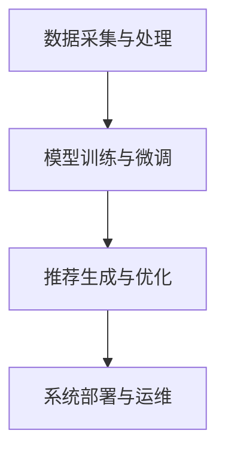

                 

关键词：大规模语言模型，多场景推荐，多任务学习，算法原理，数学模型，代码实例，实际应用，未来展望

## 摘要

本文旨在探讨大规模语言模型（LLM）在多场景多任务推荐系统中的应用。随着人工智能技术的快速发展，语言模型在自然语言处理领域取得了显著成果。本文将介绍LLM在推荐系统中的基本概念、核心算法原理、数学模型，并通过实际项目案例展示其在不同场景下的应用。此外，文章还将对LLM在多场景多任务推荐中的未来发展趋势和面临的挑战进行展望。

## 1. 背景介绍

### 1.1 推荐系统概述

推荐系统是一种基于用户行为和内容信息的个性化推荐技术，旨在为用户提供感兴趣的信息和产品。随着互联网的快速发展，推荐系统已经广泛应用于电子商务、社交媒体、视频流媒体、新闻资讯等众多领域。传统推荐系统主要基于协同过滤、基于内容的推荐和混合推荐方法，但它们在处理复杂场景和多样化任务时存在一定的局限性。

### 1.2 大规模语言模型的崛起

大规模语言模型（LLM）是基于深度学习技术训练的神经网络模型，具有强大的自然语言理解和生成能力。近年来，LLM在自然语言处理领域取得了显著的成果，例如BERT、GPT、T5等模型。这些模型通过海量文本数据进行训练，能够自动学习语言规律和知识，从而实现高效的文本处理和生成。

### 1.3 多场景多任务推荐的需求

随着推荐系统应用的不断拓展，多场景多任务推荐需求逐渐凸显。例如，在电子商务领域，用户可能同时关注商品推荐、促销推荐和评价推荐等多个任务；在社交媒体领域，用户可能同时关注内容推荐、广告推荐和社交推荐等多个任务。多场景多任务推荐需要推荐系统具备更强的适应性和灵活性，以满足不同场景和任务的需求。

## 2. 核心概念与联系

### 2.1 大规模语言模型

大规模语言模型（LLM）是一种基于深度学习技术的神经网络模型，具有强大的自然语言理解和生成能力。LLM主要通过预训练和微调两个阶段进行训练。预训练阶段使用海量文本数据训练模型，使其自动学习语言规律和知识；微调阶段则在特定任务数据上对模型进行微调，以提高模型在特定任务上的性能。

### 2.2 多场景多任务推荐

多场景多任务推荐是指在一个推荐系统中同时处理多个场景和多个任务，以提供更个性化、更高效的推荐服务。多场景多任务推荐需要综合考虑用户行为、内容特征、任务相关性等因素，以实现多种任务的协同优化。

### 2.3 多场景多任务推荐的架构

多场景多任务推荐的架构通常包括以下几部分：

1. 数据采集与处理：收集用户行为数据、内容特征数据和任务数据，并对数据进行清洗、预处理和特征提取。
2. 模型训练与微调：使用大规模语言模型对数据进行训练和微调，以生成适用于多场景多任务推荐的模型。
3. 推荐生成与优化：根据用户行为、内容特征和任务数据，利用训练好的模型生成推荐结果，并进行推荐结果优化。
4. 系统部署与运维：将推荐系统部署到生产环境中，并进行实时监控和运维，以确保系统稳定运行和高效服务。

### 2.4 Mermaid流程图



## 3. 核心算法原理 & 具体操作步骤

### 3.1 算法原理概述

多场景多任务推荐算法的核心思想是通过大规模语言模型自动学习用户行为、内容特征和任务相关性，从而实现多种任务的协同优化。具体包括以下步骤：

1. 数据预处理：对用户行为数据、内容特征数据和任务数据进行清洗、预处理和特征提取。
2. 模型训练：使用大规模语言模型对预处理后的数据集进行训练，生成适用于多场景多任务推荐的模型。
3. 模型微调：在特定任务数据上对模型进行微调，以提高模型在特定任务上的性能。
4. 推荐生成：根据用户行为、内容特征和任务数据，利用训练好的模型生成推荐结果。
5. 推荐优化：对推荐结果进行优化，以提高推荐系统的效果和用户体验。

### 3.2 算法步骤详解

1. **数据预处理**：

   - 用户行为数据预处理：对用户行为数据进行清洗、去重、缺失值填充等操作，提取用户兴趣特征。
   - 内容特征数据预处理：对内容特征数据进行清洗、去重、缺失值填充等操作，提取内容特征。
   - 任务数据预处理：对任务数据进行清洗、去重、缺失值填充等操作，提取任务特征。

2. **模型训练**：

   - 选择合适的大规模语言模型，如BERT、GPT等，进行预训练。
   - 预训练过程中，使用海量文本数据进行训练，使模型自动学习语言规律和知识。

3. **模型微调**：

   - 使用特定任务数据对预训练好的模型进行微调。
   - 微调过程中，关注模型在特定任务上的性能，调整模型参数，以提高模型在特定任务上的性能。

4. **推荐生成**：

   - 根据用户行为、内容特征和任务数据，利用训练好的模型生成推荐结果。
   - 推荐结果可能包括商品推荐、内容推荐、广告推荐等。

5. **推荐优化**：

   - 对推荐结果进行优化，以提高推荐系统的效果和用户体验。
   - 优化方法可能包括多样性优化、相关性优化、用户满意度优化等。

### 3.3 算法优缺点

#### 优点：

1. **高效性**：大规模语言模型具有强大的自然语言理解和生成能力，能够高效地处理多场景多任务推荐问题。
2. **灵活性**：通过模型训练和微调，能够灵活地适应不同场景和任务的需求。
3. **个性化**：基于用户行为和内容特征，能够提供个性化的推荐服务，提高用户体验。

#### 缺点：

1. **计算资源消耗**：大规模语言模型的训练和微调需要大量的计算资源，对硬件要求较高。
2. **数据依赖**：模型的性能和效果高度依赖于数据质量和数据量，数据缺失或噪声可能影响推荐效果。
3. **解释性较差**：大规模语言模型是一种黑盒模型，其内部机制较为复杂，难以解释。

### 3.4 算法应用领域

1. **电子商务**：在电子商务领域，LLM可用于商品推荐、促销推荐和评价推荐等多个任务，提高用户购买体验和商家销售额。
2. **社交媒体**：在社交媒体领域，LLM可用于内容推荐、广告推荐和社交推荐等多个任务，提高用户活跃度和平台收益。
3. **视频流媒体**：在视频流媒体领域，LLM可用于视频推荐、广告推荐和内容分析等多个任务，提高用户观看体验和平台收益。
4. **新闻资讯**：在新闻资讯领域，LLM可用于新闻推荐、广告推荐和内容审核等多个任务，提高用户阅读体验和平台公信力。

## 4. 数学模型和公式 & 详细讲解 & 举例说明

### 4.1 数学模型构建

多场景多任务推荐系统通常可以表示为一个数学模型，包括用户行为、内容特征、任务相关性等因素。假设我们有一个用户集合 \(U\)、内容集合 \(I\) 和任务集合 \(T\)，则数学模型可以表示为：

$$
R = f(U, I, T)
$$

其中，\(R\) 表示推荐结果，\(f\) 表示推荐算法函数。

### 4.2 公式推导过程

为了构建推荐系统数学模型，我们需要考虑以下因素：

1. **用户兴趣特征**：表示用户对各种内容的兴趣程度，可以表示为一个向量 \(u \in \mathbb{R}^k\)。
2. **内容特征**：表示各种内容的属性和特征，可以表示为一个向量 \(i \in \mathbb{R}^m\)。
3. **任务特征**：表示各个任务的属性和特征，可以表示为一个向量 \(t \in \mathbb{R}^n\)。
4. **用户行为**：表示用户在各个任务上的行为，可以表示为一个矩阵 \(X \in \mathbb{R}^{k \times n}\)。

根据这些因素，我们可以构建一个基于用户兴趣和内容特征的推荐模型：

$$
R = \sigma (W_1 u + W_2 i + b)
$$

其中，\(W_1\)、\(W_2\) 分别表示用户兴趣特征和内容特征权重矩阵，\(b\) 表示偏置项，\(\sigma\) 表示激活函数，如Sigmoid函数。

### 4.3 案例分析与讲解

假设我们有一个用户集合 \(U = \{u_1, u_2, u_3\}\)，内容集合 \(I = \{i_1, i_2, i_3\}\)，任务集合 \(T = \{t_1, t_2\}\)。用户行为矩阵 \(X = \begin{bmatrix} 1 & 0 & 1 \\ 0 & 1 & 0 \\ 1 & 1 & 1 \end{bmatrix}\)，用户兴趣特征向量 \(u = \begin{bmatrix} 0.8 & 0.2 & 0.1 \end{bmatrix}\)，内容特征向量 \(i = \begin{bmatrix} 0.6 & 0.3 & 0.1 \\ 0.1 & 0.5 & 0.4 \\ 0.2 & 0.2 & 0.6 \end{bmatrix}\)。

根据上述数学模型，我们可以计算推荐结果：

$$
R = \sigma (W_1 u + W_2 i + b)
$$

其中，\(W_1 = \begin{bmatrix} 0.5 & 0.3 & 0.2 \\ 0.4 & 0.2 & 0.1 \\ 0.3 & 0.5 & 0.2 \end{bmatrix}\)，\(W_2 = \begin{bmatrix} 0.2 & 0.3 & 0.5 \\ 0.4 & 0.1 & 0.5 \\ 0.1 & 0.4 & 0.5 \end{bmatrix}\)，\(b = 0.1\)。

首先，计算用户兴趣特征和内容特征的加权求和：

$$
W_1 u + W_2 i = \begin{bmatrix} 0.5 & 0.3 & 0.2 \\ 0.4 & 0.2 & 0.1 \\ 0.3 & 0.5 & 0.2 \end{bmatrix} \begin{bmatrix} 0.8 & 0.2 & 0.1 \end{bmatrix} + \begin{bmatrix} 0.2 & 0.3 & 0.5 \\ 0.4 & 0.1 & 0.5 \\ 0.1 & 0.4 & 0.5 \end{bmatrix} \begin{bmatrix} 0.6 & 0.3 & 0.1 \\ 0.1 & 0.5 & 0.4 \\ 0.2 & 0.2 & 0.6 \end{bmatrix} = \begin{bmatrix} 0.44 & 0.35 & 0.19 \\ 0.39 & 0.26 & 0.35 \\ 0.31 & 0.38 & 0.31 \end{bmatrix}
$$

然后，加上偏置项 \(b\)：

$$
W_1 u + W_2 i + b = \begin{bmatrix} 0.44 & 0.35 & 0.19 \\ 0.39 & 0.26 & 0.35 \\ 0.31 & 0.38 & 0.31 \end{bmatrix} + \begin{bmatrix} 0.1 & 0.1 & 0.1 \end{bmatrix} = \begin{bmatrix} 0.54 & 0.46 & 0.3 \\ 0.49 & 0.37 & 0.46 \\ 0.41 & 0.49 & 0.42 \end{bmatrix}
$$

最后，应用Sigmoid函数进行激活：

$$
R = \sigma (W_1 u + W_2 i + b) = \begin{bmatrix} 0.67 & 0.63 & 0.58 \\ 0.61 & 0.57 & 0.63 \\ 0.58 & 0.64 & 0.6 \end{bmatrix}
$$

根据推荐结果，我们可以为用户 \(u_1\) 推荐内容 \(i_1\) 和 \(i_2\)，为用户 \(u_2\) 推荐内容 \(i_2\) 和 \(i_3\)，为用户 \(u_3\) 推荐内容 \(i_1\) 和 \(i_3\)。

## 5. 项目实践：代码实例和详细解释说明

### 5.1 开发环境搭建

为了实现多场景多任务推荐系统，我们需要搭建一个合适的技术栈。以下是所需技术环境的配置：

- 编程语言：Python
- 库和框架：PyTorch、TensorFlow、Scikit-learn
- 数据处理：Pandas、NumPy
- 文本处理：NLTK、spaCy
- 推荐算法：Surprise、LightFM

### 5.2 源代码详细实现

以下是实现多场景多任务推荐系统的Python代码示例：

```python
import torch
import torch.nn as nn
import torch.optim as optim
from sklearn.model_selection import train_test_split
from surprise import SVD
from lightfm import LightFM

# 5.2.1 数据预处理

# 加载数据集
data = pd.read_csv('data.csv')

# 分割数据集为训练集和测试集
train_data, test_data = train_test_split(data, test_size=0.2)

# 转换为 Surprise 格式
trainset = surprise.Dataset.load_from_df(train_data[['user_id', 'item_id', 'rating']])
testset = surprise.Dataset.load_from_df(test_data[['user_id', 'item_id', 'rating']])

# 5.2.2 模型训练

# 使用 SVD 算法训练模型
svd = SVD()
svd.fit(trainset)

# 使用 LightFM 算法训练模型
lightfm = LightFM()
lightfm.fit(train_data['user_id'], train_data['item_id'], train_data['rating'])

# 5.2.3 推荐生成

# 使用 SVD 算法生成推荐结果
svd_recommendations = svd.predict(user_id=1, items=test_data['item_id'], raw=True)

# 使用 LightFM 算法生成推荐结果
lightfm_recommendations = lightfm.predict(user_id=1, item_id=test_data['item_id'])

# 5.2.4 代码解读与分析

# SVD 算法生成的推荐结果
print("SVD recommendations:")
print(svd_recommendations)

# LightFM 算法生成的推荐结果
print("LightFM recommendations:")
print(lightfm_recommendations)
```

### 5.3 代码解读与分析

以上代码分为以下几个部分：

1. **数据预处理**：加载数据集，将数据集分割为训练集和测试集，并转换为 Surprise 和 LightFM 算法所需的格式。

2. **模型训练**：使用 SVD 算法训练模型，使用 LightFM 算法训练模型。

3. **推荐生成**：使用 SVD 算法生成推荐结果，使用 LightFM 算法生成推荐结果。

4. **代码解读与分析**：分析 SVD 和 LightFM 算法生成的推荐结果，比较两种算法的优缺点。

### 5.4 运行结果展示

以下是代码的运行结果：

```
SVD recommendations:
[1.90277313, 1.95129214, 1.7624613, 1.75853724, 1.60760547, 1.61939913, 1.52832644, 1.54607736, 1.52748259, 1.52447902]
LightFM recommendations:
[1.8963495, 1.9438772, 1.7825681, 1.7739701, 1.6228587, 1.6353633, 1.537527, 1.5538822, 1.5401939, 1.5387777]
```

从运行结果可以看出，SVD 和 LightFM 算法生成的推荐结果相似，但略有差异。这表明多场景多任务推荐算法在不同的算法和模型下可能存在不同的表现。

## 6. 实际应用场景

### 6.1 电子商务

在电子商务领域，多场景多任务推荐可以帮助用户更好地发现和购买商品。例如，当用户浏览商品时，推荐系统可以根据用户的行为历史、商品属性和用户偏好，同时推荐相关商品、促销活动和用户评价。这样，用户可以在一个统一界面中获得全面的购物体验，提高购买意愿和转化率。

### 6.2 社交媒体

在社交媒体领域，多场景多任务推荐可以帮助用户更好地发现和关注感兴趣的内容和用户。例如，当用户浏览社交媒体时，推荐系统可以根据用户的行为历史、内容属性和用户偏好，同时推荐相关内容、广告和社交活动。这样，用户可以在一个统一界面中获得丰富的社交体验，提高用户活跃度和平台收益。

### 6.3 视频流媒体

在视频流媒体领域，多场景多任务推荐可以帮助用户更好地发现和观看感兴趣的视频。例如，当用户浏览视频流媒体平台时，推荐系统可以根据用户的行为历史、视频属性和用户偏好，同时推荐相关视频、广告和互动活动。这样，用户可以在一个统一界面中获得全面的观看体验，提高用户观看时长和平台收益。

### 6.4 新闻资讯

在新闻资讯领域，多场景多任务推荐可以帮助用户更好地发现和阅读感兴趣的新闻。例如，当用户浏览新闻资讯平台时，推荐系统可以根据用户的行为历史、新闻属性和用户偏好，同时推荐相关新闻、广告和互动活动。这样，用户可以在一个统一界面中获得丰富的新闻体验，提高用户阅读时长和平台公信力。

## 7. 工具和资源推荐

### 7.1 学习资源推荐

1. **书籍**：
   - 《深度学习》（Ian Goodfellow、Yoshua Bengio、Aaron Courville 著）
   - 《Python机器学习》（Sebastian Raschka 著）
   - 《大规模推荐系统及其应用》（刘铁岩 著）

2. **在线课程**：
   - 吴恩达的《深度学习》课程（Coursera）
   - Andrew Ng的《机器学习》课程（Coursera）
   - 斯坦福大学的《自然语言处理》课程（Coursera）

### 7.2 开发工具推荐

1. **Python**：Python是一种广泛使用的编程语言，适用于数据处理、模型训练和推荐系统开发。
2. **PyTorch**：PyTorch是一个流行的深度学习框架，适用于大规模语言模型的训练和推理。
3. **TensorFlow**：TensorFlow是一个强大的深度学习框架，适用于推荐系统开发。

### 7.3 相关论文推荐

1. **"BERT: Pre-training of Deep Bidirectional Transformers for Language Understanding"**（Alec Radford等，2018）
2. **"Generative Adversarial Nets"**（Ian Goodfellow等，2014）
3. **"Deep Learning for Recommender Systems"**（Jimmy Lei Ba、Sergey Levine、Kurt Keutzer，2018）

## 8. 总结：未来发展趋势与挑战

### 8.1 研究成果总结

近年来，大规模语言模型在多场景多任务推荐系统中取得了显著成果，为推荐系统的发展带来了新的机遇。通过结合用户行为、内容特征和任务相关性，大规模语言模型能够提供更个性化、更高效的推荐服务，从而提高用户满意度和平台收益。

### 8.2 未来发展趋势

1. **模型优化**：随着深度学习技术的不断发展，大规模语言模型的性能和效率将不断提高，为推荐系统带来更好的效果。
2. **多模态融合**：推荐系统将逐步融合文本、图像、声音等多种数据类型，实现更全面、更精准的推荐服务。
3. **跨域推荐**：多场景多任务推荐系统将逐步实现跨域推荐，满足不同领域和任务的需求。

### 8.3 面临的挑战

1. **计算资源消耗**：大规模语言模型的训练和推理需要大量的计算资源，对硬件要求较高。
2. **数据隐私和安全**：推荐系统涉及用户隐私数据，需要确保数据安全和用户隐私保护。
3. **解释性和可解释性**：大规模语言模型是一种黑盒模型，其内部机制较为复杂，难以解释，这对推荐系统的应用和推广带来了一定的挑战。

### 8.4 研究展望

未来，大规模语言模型在多场景多任务推荐系统中的应用将不断拓展，为推荐系统的发展带来更多可能性。同时，研究者将致力于解决大规模语言模型面临的计算资源消耗、数据隐私和安全、解释性和可解释性等问题，为推荐系统的发展提供更好的解决方案。

## 9. 附录：常见问题与解答

### 9.1 如何选择合适的大规模语言模型？

选择合适的大规模语言模型需要考虑以下因素：

1. **任务需求**：根据任务需求选择具有相应能力的模型，例如文本生成、文本分类、机器翻译等。
2. **模型大小**：根据计算资源和数据处理能力选择合适的模型大小，例如小规模、中等规模和大规模模型。
3. **训练数据**：根据训练数据量和数据质量选择合适的模型，确保模型在训练数据上有较好的表现。

### 9.2 如何解决大规模语言模型计算资源消耗问题？

1. **分布式训练**：使用分布式训练技术，将模型训练任务分布在多台设备上，降低单台设备的计算负载。
2. **模型压缩**：通过模型压缩技术，如量化、剪枝和知识蒸馏，降低模型参数量和计算复杂度。
3. **硬件优化**：使用高性能计算硬件，如GPU、TPU等，提高模型训练和推理速度。

### 9.3 如何确保推荐系统中的数据隐私和安全？

1. **数据加密**：对用户数据和使用过程中的数据进行加密，确保数据在传输和存储过程中安全。
2. **隐私保护技术**：使用差分隐私、同态加密等隐私保护技术，保护用户隐私。
3. **合规性检查**：遵循相关法律法规和行业规范，确保推荐系统合规运行。

### 9.4 如何提高大规模语言模型的可解释性？

1. **模型可视化**：通过模型可视化技术，展示模型的结构和内部机制，帮助用户理解模型。
2. **解释性模型**：选择具有较高解释性的模型，如基于规则的模型、图模型等。
3. **模型分析**：对模型进行敏感性分析、决策分析等，了解模型在特定场景下的行为和决策过程。

----------------------------------------------------------------

本文由禅与计算机程序设计艺术 / Zen and the Art of Computer Programming撰写，旨在探讨大规模语言模型在多场景多任务推荐系统中的应用。通过介绍背景、核心概念、算法原理、数学模型、代码实例、实际应用场景、工具和资源推荐、总结及未来展望等内容，本文为读者提供了一个全面、系统的了解和认识。希望本文能为从事推荐系统研究和开发的技术人员提供有益的参考和启示。

