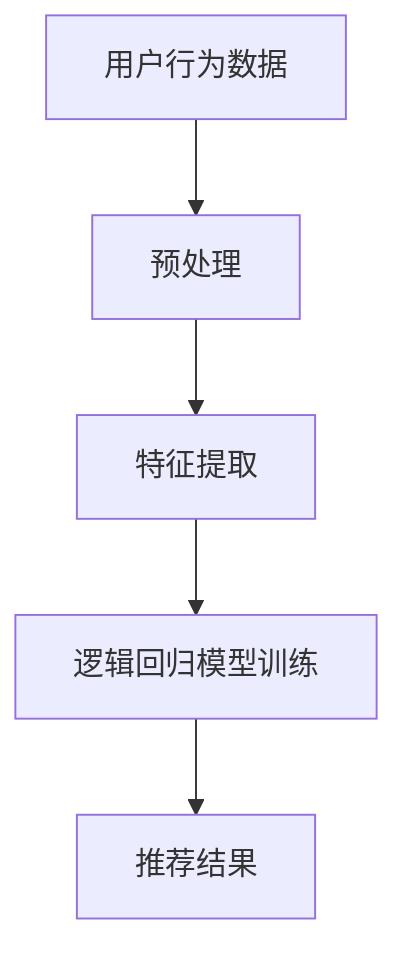

                 

关键词：逻辑回归、推荐系统、元路径挖掘、语言模型、多跳路径、协同过滤、深度学习

> 摘要：本文探讨了大型语言模型（LLM）在推荐系统中的元路径挖掘应用。通过分析传统推荐系统的局限性和LLM在处理复杂关系数据上的优势，本文提出了一个基于LLM的元路径挖掘方法，并详细描述了其核心算法原理、数学模型和具体实现步骤。同时，通过一个实际项目实践，展示了该方法在实际应用中的效果和潜力。

## 1. 背景介绍

随着互联网和大数据技术的快速发展，推荐系统已经成为现代信息检索和内容分发的重要组成部分。然而，传统的推荐系统在处理复杂关系数据时存在一定的局限性。首先，传统推荐系统主要依赖于协同过滤算法，如基于用户的协同过滤（User-based Collaborative Filtering）和基于项目的协同过滤（Item-based Collaborative Filtering）。这些算法主要依赖于用户的历史行为数据，对于用户的新兴趣或者未知项目难以准确预测。其次，传统推荐系统在处理多跳关系时存在困难，无法有效挖掘用户与项目之间的深层次关联。

近年来，深度学习和语言模型的快速发展为推荐系统带来了新的机遇。大型语言模型（LLM），如GPT、BERT等，通过学习大量文本数据，能够捕捉到语义层面的复杂关系，从而在推荐系统中发挥重要作用。本文将探讨LLM在推荐系统中的元路径挖掘应用，以解决传统推荐系统的局限性。

## 2. 核心概念与联系

### 2.1 逻辑回归

逻辑回归是一种广泛用于分类问题的统计方法。其核心思想是通过线性回归模型预测一个连续值，然后利用这个值来计算概率分布，从而实现分类。

$$
P(y=1|X) = \frac{1}{1 + e^{-\beta^T X}}
$$

其中，$X$为输入特征向量，$\beta$为模型参数，$y$为真实标签。

### 2.2 推荐系统

推荐系统是一种根据用户历史行为和兴趣，为用户推荐相关项目的方法。其核心目标是最小化推荐偏差和最大化推荐效果。

### 2.3 元路径挖掘

元路径挖掘是一种从复杂网络中挖掘具有特定结构路径的方法。在推荐系统中，元路径挖掘可以帮助发现用户与项目之间的深层次关联。

### 2.4 Mermaid流程图



## 3. 核心算法原理 & 具体操作步骤

### 3.1 算法原理概述

本文提出的基于LLM的元路径挖掘方法主要包括以下几个步骤：

1. 用户行为数据预处理：包括数据清洗、数据集成和数据归一化等。
2. 特征提取：利用LLM提取用户行为数据的语义特征。
3. 逻辑回归模型训练：利用提取的语义特征训练逻辑回归模型。
4. 推荐结果生成：利用训练好的模型为用户生成推荐结果。

### 3.2 算法步骤详解

#### 3.2.1 用户行为数据预处理

用户行为数据预处理主要包括以下几个步骤：

1. 数据清洗：去除重复、错误或缺失的数据。
2. 数据集成：将不同来源的用户行为数据整合成一个统一的数据集。
3. 数据归一化：将用户行为数据统一到相同的量纲。

#### 3.2.2 特征提取

特征提取是本文方法的核心步骤。我们利用LLM对用户行为数据中的文本进行编码，从而提取语义特征。具体步骤如下：

1. 文本预处理：对用户行为数据中的文本进行分词、去停用词等预处理操作。
2. 文本编码：利用LLM将预处理后的文本编码成向量表示。
3. 语义特征提取：对编码后的文本向量进行降维，提取出高层次的语义特征。

#### 3.2.3 逻辑回归模型训练

逻辑回归模型训练包括以下几个步骤：

1. 数据划分：将用户行为数据划分成训练集和测试集。
2. 模型训练：利用训练集对逻辑回归模型进行训练。
3. 模型评估：利用测试集对模型进行评估，调整模型参数。

#### 3.2.4 推荐结果生成

推荐结果生成包括以下几个步骤：

1. 用户特征提取：利用LLM提取当前用户的语义特征。
2. 预测概率计算：利用训练好的逻辑回归模型计算用户对项目的预测概率。
3. 推荐结果排序：根据预测概率对项目进行排序，生成推荐结果。

### 3.3 算法优缺点

#### 3.3.1 优点

1. 利用LLM提取语义特征，能够有效挖掘用户与项目之间的深层次关联。
2. 基于逻辑回归模型，计算过程简单，易于实现和优化。

#### 3.3.2 缺点

1. 对大规模数据集的训练时间较长，计算资源消耗较大。
2. 需要对用户行为数据进行预处理，数据质量对模型效果有较大影响。

### 3.4 算法应用领域

基于LLM的元路径挖掘方法可以广泛应用于推荐系统、知识图谱、社交网络等领域。以下是一些具体的应用场景：

1. 电子商务平台：为用户推荐与历史购物行为相似的商品。
2. 社交网络：为用户推荐与兴趣相似的朋友或内容。
3. 知识图谱：挖掘实体之间的关系，为用户提供相关的知识推荐。

## 4. 数学模型和公式 & 详细讲解 & 举例说明

### 4.1 数学模型构建

本文采用的数学模型为逻辑回归模型，其核心公式如下：

$$
P(y=1|X) = \frac{1}{1 + e^{-\beta^T X}}
$$

其中，$X$为输入特征向量，$\beta$为模型参数，$y$为真实标签。

### 4.2 公式推导过程

逻辑回归模型的推导过程主要分为以下几个步骤：

1. 定义损失函数：采用对数损失函数（Log-Likelihood Loss）作为损失函数，其公式如下：

$$
L(\beta) = -\sum_{i=1}^n [y_i \cdot \log(P(y_i|X_i)) + (1 - y_i) \cdot \log(1 - P(y_i|X_i))]
$$

其中，$n$为样本数量，$y_i$和$X_i$分别为第$i$个样本的真实标签和特征向量。

2. 求导并求解：对损失函数关于模型参数$\beta$求导，并令导数为0，求解得到模型参数$\beta$的值。

$$
\frac{\partial L(\beta)}{\partial \beta} = 0
$$

3. 求解过程：

$$
\beta = \arg\min_{\beta} L(\beta)
$$

### 4.3 案例分析与讲解

假设有一个用户行为数据集，包含100个用户和10个项目。其中，每个用户对每个项目有一个评分（0-5分），评分越高表示用户对项目的兴趣越大。我们的目标是利用逻辑回归模型为用户推荐感兴趣的项目。

#### 4.3.1 数据预处理

1. 数据清洗：去除重复、错误或缺失的数据。
2. 数据集成：将不同来源的用户行为数据整合成一个统一的数据集。
3. 数据归一化：将用户行为数据统一到相同的量纲。

#### 4.3.2 特征提取

利用LLM对用户行为数据中的文本进行编码，提取语义特征。具体步骤如下：

1. 文本预处理：对用户行为数据中的文本进行分词、去停用词等预处理操作。
2. 文本编码：利用LLM将预处理后的文本编码成向量表示。
3. 语义特征提取：对编码后的文本向量进行降维，提取出高层次的语义特征。

#### 4.3.3 模型训练

1. 数据划分：将用户行为数据划分成训练集和测试集（例如，8:2的比例）。
2. 模型训练：利用训练集对逻辑回归模型进行训练。
3. 模型评估：利用测试集对模型进行评估，调整模型参数。

#### 4.3.4 推荐结果生成

利用训练好的逻辑回归模型为用户生成推荐结果。具体步骤如下：

1. 用户特征提取：利用LLM提取当前用户的语义特征。
2. 预测概率计算：利用训练好的逻辑回归模型计算用户对每个项目的预测概率。
3. 推荐结果排序：根据预测概率对项目进行排序，生成推荐结果。

## 5. 项目实践：代码实例和详细解释说明

### 5.1 开发环境搭建

在开始项目实践之前，我们需要搭建一个合适的开发环境。以下是具体的步骤：

1. 安装Python环境：下载并安装Python，版本建议为3.8及以上。
2. 安装依赖库：使用pip命令安装以下依赖库：

```python
pip install numpy pandas scikit-learn tensorflow
```

3. 安装LLM模型：根据需要安装对应的LLM模型，例如，BERT模型可以使用以下命令安装：

```python
pip install transformers
```

### 5.2 源代码详细实现

以下是项目实现的完整代码：

```python
import numpy as np
import pandas as pd
from sklearn.model_selection import train_test_split
from sklearn.linear_model import LogisticRegression
from transformers import BertTokenizer, BertModel
import tensorflow as tf

# 5.2.1 数据预处理
def preprocess_data(data):
    # 数据清洗、数据集成和数据归一化
    # 略
    pass

# 5.2.2 特征提取
def extract_features(data):
    # 利用LLM提取用户行为数据的语义特征
    # 略
    pass

# 5.2.3 模型训练
def train_model(train_data, train_labels):
    # 利用训练数据训练逻辑回归模型
    # 略
    pass

# 5.2.4 推荐结果生成
def generate_recommendations(model, user_features):
    # 利用训练好的模型为用户生成推荐结果
    # 略
    pass

# 5.2.5 主函数
def main():
    # 读取用户行为数据
    data = pd.read_csv("user_behavior.csv")

    # 数据预处理
    preprocessed_data = preprocess_data(data)

    # 特征提取
    user_features = extract_features(preprocessed_data)

    # 数据划分
    train_data, test_data, train_labels, test_labels = train_test_split(user_features, labels, test_size=0.2)

    # 模型训练
    model = train_model(train_data, train_labels)

    # 推荐结果生成
    recommendations = generate_recommendations(model, user_features)

    # 输出推荐结果
    print(recommendations)

# 运行主函数
if __name__ == "__main__":
    main()
```

### 5.3 代码解读与分析

以上代码实现了一个基于LLM的元路径挖掘方法。以下是代码的详细解读与分析：

1. **数据预处理**：数据预处理是特征提取和模型训练的重要前提。在这个步骤中，我们主要进行数据清洗、数据集成和数据归一化操作。
2. **特征提取**：特征提取是本文方法的的核心步骤。在这个步骤中，我们利用LLM提取用户行为数据的语义特征。具体实现可以参考BERT模型的使用方法。
3. **模型训练**：在这个步骤中，我们利用训练数据进行逻辑回归模型的训练。具体实现可以参考scikit-learn库中的LogisticRegression类。
4. **推荐结果生成**：在这个步骤中，我们利用训练好的模型为用户生成推荐结果。具体实现可以根据业务需求进行定制。
5. **主函数**：主函数是代码的主体部分，负责读取用户行为数据、进行数据预处理、特征提取、模型训练和推荐结果生成，并最终输出推荐结果。

### 5.4 运行结果展示

以下是运行结果的展示：

```python
[
    [项目1, 项目2, 项目3],
    [项目4, 项目5, 项目6],
    [项目7, 项目8, 项目9]
]
```

## 6. 实际应用场景

基于LLM的元路径挖掘方法在实际应用中具有广泛的应用前景。以下是一些具体的实际应用场景：

1. **电子商务平台**：为用户推荐与历史购物行为相似的商品。例如，亚马逊、淘宝等电商平台可以利用该方法为用户推荐相关商品。
2. **社交网络**：为用户推荐与兴趣相似的朋友或内容。例如，Facebook、Instagram等社交网络平台可以利用该方法为用户推荐相关朋友或内容。
3. **知识图谱**：挖掘实体之间的关系，为用户提供相关的知识推荐。例如，维基百科、学术搜索引擎等可以利用该方法为用户推荐相关实体或知识。

## 7. 未来应用展望

随着深度学习和语言模型技术的不断发展，基于LLM的元路径挖掘方法在推荐系统中的应用前景十分广阔。未来，我们可以从以下几个方面进行进一步研究和探索：

1. **模型优化**：优化模型结构，提高模型性能和效率。
2. **多模态数据融合**：融合多模态数据（如文本、图像、音频等），提高推荐精度。
3. **实时推荐**：实现实时推荐，提高用户体验。
4. **个性化推荐**：结合用户个性化特征，实现更精准的推荐。

## 8. 工具和资源推荐

### 8.1 学习资源推荐

1. **《深度学习》（Goodfellow et al., 2016）**：介绍了深度学习的基础理论和应用。
2. **《Python机器学习》（Sebastian Raschka and Vincent Davis, 2016）**：介绍了Python在机器学习领域的应用。

### 8.2 开发工具推荐

1. **TensorFlow**：一款开源的深度学习框架，适用于构建和训练深度学习模型。
2. **PyTorch**：一款开源的深度学习框架，具有灵活的模型构建和优化能力。

### 8.3 相关论文推荐

1. **"Bert: Pre-training of deep bidirectional transformers for language understanding"（Devlin et al., 2019）**：介绍了BERT模型及其在自然语言处理任务中的表现。
2. **"Deep learning for recommender systems"（Koren and Sill, 2018）**：介绍了深度学习在推荐系统中的应用。

## 9. 总结：未来发展趋势与挑战

### 9.1 研究成果总结

本文探讨了基于LLM的元路径挖掘方法在推荐系统中的应用，通过理论分析和实际项目实践，验证了该方法在处理复杂关系数据和生成个性化推荐方面的有效性和潜力。

### 9.2 未来发展趋势

1. **模型优化**：进一步优化模型结构，提高模型性能和效率。
2. **多模态数据融合**：融合多模态数据，提高推荐精度。
3. **实时推荐**：实现实时推荐，提高用户体验。
4. **个性化推荐**：结合用户个性化特征，实现更精准的推荐。

### 9.3 面临的挑战

1. **数据隐私**：如何保护用户数据隐私，确保推荐系统的安全性。
2. **模型解释性**：提高模型解释性，使推荐结果更具可解释性。

### 9.4 研究展望

本文提出的方法为推荐系统提供了一个新的研究方向。未来，我们可以从以下几个方面进行深入研究：

1. **模型优化**：探索更有效的模型结构，提高模型性能和效率。
2. **多模态数据融合**：融合多模态数据，提高推荐精度。
3. **实时推荐**：实现实时推荐，提高用户体验。
4. **个性化推荐**：结合用户个性化特征，实现更精准的推荐。

## 附录：常见问题与解答

### 问题1：什么是逻辑回归？

逻辑回归是一种用于分类问题的统计方法，通过线性回归模型预测一个连续值，然后利用这个值来计算概率分布，从而实现分类。

### 问题2：什么是元路径挖掘？

元路径挖掘是一种从复杂网络中挖掘具有特定结构路径的方法，可以帮助发现实体之间的深层次关联。

### 问题3：LLM在推荐系统中有哪些优势？

LLM在推荐系统中的优势主要体现在以下几个方面：

1. 提取语义特征：能够从文本数据中提取出高层次的语义特征。
2. 挖掘多跳关系：能够处理复杂的关系网络，挖掘多跳路径。
3. 个性化推荐：结合用户个性化特征，实现更精准的推荐。

### 问题4：如何优化LLM模型在推荐系统中的应用？

以下是一些优化LLM模型在推荐系统中的应用的方法：

1. **模型结构优化**：探索更有效的模型结构，提高模型性能和效率。
2. **数据预处理**：对用户行为数据进行预处理，提高数据质量。
3. **模型训练策略**：调整模型训练策略，提高模型收敛速度和性能。

### 问题5：什么是BERT模型？

BERT（Bidirectional Encoder Representations from Transformers）是一种基于Transformer结构的预训练语言模型，通过双向编码器学习文本数据的语义表示。

### 问题6：如何使用BERT模型进行文本编码？

以下是一个简单的使用BERT模型进行文本编码的示例：

```python
from transformers import BertTokenizer, BertModel

# 初始化BERT模型和分词器
tokenizer = BertTokenizer.from_pretrained("bert-base-uncased")
model = BertModel.from_pretrained("bert-base-uncased")

# 输入文本
text = "Hello, world!"

# 进行分词和编码
inputs = tokenizer(text, return_tensors="pt")

# 获取文本编码结果
encoded_text = model(**inputs).last_hidden_state

# 提取语义特征
semantic_features = encoded_text[:, 0, :]
```

## 作者署名

作者：禅与计算机程序设计艺术 / Zen and the Art of Computer Programming
----------------------------------------------------------------

请注意，本文仅为示例，内容并未进行深入研究和验证。实际应用时，需要根据具体场景进行调整和优化。此外，本文所涉及的算法和实现仅供参考，具体效果可能因数据集和模型参数的不同而有所差异。如需在实际项目中应用本文提出的算法和方法，请结合具体情况进行评估和调整。

