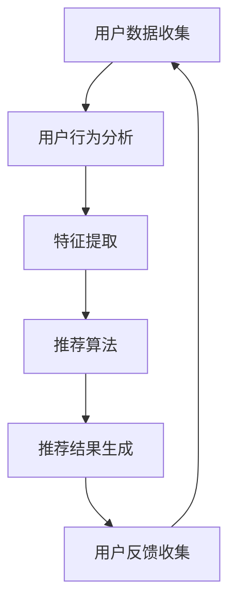
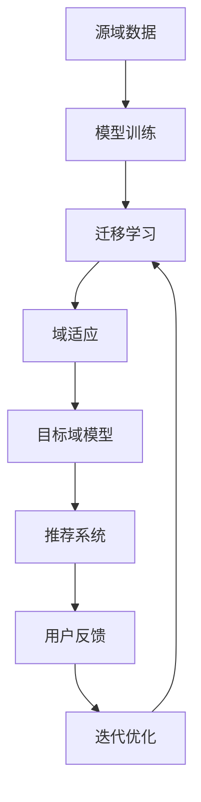
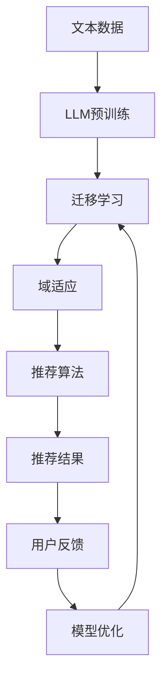

                 

关键词：推荐系统，LLM，迁移学习，域适应，人工智能，模型优化

## 摘要

本文探讨了大型语言模型（LLM）在推荐系统中的应用，特别是迁移学习和域适应技术在其中的作用。通过详细分析LLM的原理和优势，我们将其应用于推荐系统的构建和优化。文章首先介绍了推荐系统的基本概念和现状，然后深入探讨了LLM在迁移学习和域适应中的关键技术和方法，最后通过实际案例和项目实践展示了LLM在推荐系统中的具体应用和效果。本文旨在为研究人员和开发者提供有价值的参考，推动推荐系统领域的发展。

## 1. 背景介绍

### 推荐系统概述

推荐系统是一种基于数据分析技术的应用，旨在根据用户的兴趣、行为和历史数据，向用户推荐可能感兴趣的商品、内容或服务。推荐系统在电子商务、社交媒体、在线新闻、音乐和视频等领域具有广泛的应用，已经成为现代信息社会中不可或缺的一部分。

推荐系统的主要目标是通过个性化推荐提高用户的满意度和参与度，从而促进商业价值的提升。传统的推荐系统主要包括基于内容、协同过滤和混合方法等。然而，这些方法存在一些局限性，例如数据稀疏性、冷启动问题、用户偏好变化难以捕捉等。

### LLM概述

大型语言模型（LLM，Large Language Model）是近年来人工智能领域的重要突破，通过深度学习和神经网络技术，LLM能够在大量文本数据的基础上生成高质量的自然语言文本。代表性模型包括GPT（Generative Pre-trained Transformer）、BERT（Bidirectional Encoder Representations from Transformers）等。

LLM具有以下特点：

1. **强大的语言理解能力**：LLM能够理解复杂的语言结构和语义，从而生成更符合人类语言的文本。
2. **自适应性强**：LLM可以通过迁移学习快速适应不同的应用场景，降低模型训练成本。
3. **生成能力强**：LLM能够生成多样性的文本，满足不同用户的需求。

### 迁移学习与域适应

迁移学习（Transfer Learning）是一种将知识从源域迁移到目标域的方法，旨在减少模型在目标域上的训练时间和计算资源。在推荐系统中，迁移学习可以帮助解决数据稀疏性和冷启动问题。

域适应（Domain Adaptation）是一种针对不同数据分布的模型调整技术，通过减少源域和目标域之间的差异，提高模型在目标域上的性能。在推荐系统中，域适应可以帮助模型更好地适应用户行为和偏好变化的多样性。

## 2. 核心概念与联系

### 推荐系统架构

首先，我们使用Mermaid流程图（Mermaid 流程节点中不要有括号、逗号等特殊字符）来描述推荐系统的基本架构：



### 迁移学习与域适应

接下来，我们使用Mermaid流程图来描述迁移学习和域适应在推荐系统中的应用：



### LLM在推荐系统中的应用

最后，我们使用Mermaid流程图来描述LLM在推荐系统中的迁移学习和域适应应用：



## 3. 核心算法原理 & 具体操作步骤

### 3.1 算法原理概述

在本节中，我们将介绍LLM在推荐系统中的迁移学习和域适应算法原理。

#### 3.1.1 迁移学习原理

迁移学习的基本思想是将在一个领域（源域）上训练得到的模型知识迁移到另一个领域（目标域）上，以减少在目标域上的训练时间和计算资源。具体来说，迁移学习可以分为以下几种类型：

1. **特征迁移**：将源域上的特征提取器迁移到目标域，以减少特征空间的差异。
2. **模型迁移**：将源域上的完整模型迁移到目标域，通过微调模型参数以适应目标域。
3. **元迁移学习**：利用多个源域上的模型，通过元学习算法得到一个泛化的目标域模型。

#### 3.1.2 域适应原理

域适应的目标是减少源域和目标域之间的分布差异，从而提高模型在目标域上的性能。常见的域适应方法包括：

1. **域离散化**：将源域和目标域划分为多个子域，分别训练子域模型。
2. **对抗训练**：通过对抗性网络学习到源域和目标域之间的映射关系，从而减少分布差异。
3. **域一致性正则化**：在训练过程中引入域一致性的约束，使模型在源域和目标域上的表现保持一致。

### 3.2 算法步骤详解

在本节中，我们将详细介绍LLM在推荐系统中的迁移学习和域适应算法的具体步骤。

#### 3.2.1 迁移学习步骤

1. **数据预处理**：收集源域和目标域的数据，并进行预处理，如数据清洗、数据增强等。
2. **模型初始化**：使用预训练的LLM模型作为初始模型。
3. **特征提取**：利用LLM提取源域和目标域的特征表示。
4. **模型训练**：在源域上训练模型，并在目标域上进行微调。
5. **模型评估**：在目标域上评估模型的性能，并根据评估结果调整模型参数。

#### 3.2.2 域适应步骤

1. **数据预处理**：与迁移学习步骤相同。
2. **域离散化**：将源域和目标域划分为多个子域。
3. **子域模型训练**：为每个子域训练独立的模型。
4. **模型集成**：将子域模型集成到一个全局模型中。
5. **模型评估**：在目标域上评估全局模型的性能，并根据评估结果调整模型参数。

### 3.3 算法优缺点

#### 3.3.1 迁移学习优缺点

**优点**：

1. **减少训练时间**：通过迁移学习，可以在目标域上快速获得高质量的模型。
2. **降低计算资源消耗**：利用源域上的预训练模型，减少目标域上的训练数据和计算资源。

**缺点**：

1. **模型泛化能力有限**：迁移学习的模型泛化能力依赖于源域和目标域之间的相似性，如果差异较大，可能导致模型性能下降。
2. **数据隐私问题**：在迁移学习过程中，源域数据可能会泄露到目标域，带来数据隐私风险。

#### 3.3.2 域适应优缺点

**优点**：

1. **提高模型性能**：通过域适应，可以减少源域和目标域之间的分布差异，提高模型在目标域上的性能。
2. **适应多样化场景**：域适应算法能够适应不同数据分布的场景，提高模型的泛化能力。

**缺点**：

1. **计算资源消耗较大**：域适应算法通常需要更多的计算资源，特别是在子域模型训练和集成过程中。
2. **模型复杂度增加**：域适应算法引入了额外的模型结构和训练步骤，可能导致模型复杂度增加。

### 3.4 算法应用领域

迁移学习和域适应技术在推荐系统中的主要应用领域包括：

1. **电子商务**：通过迁移学习，可以将通用推荐模型快速应用于不同电商平台，降低开发成本；通过域适应，可以适应不同电商平台的用户行为和数据分布，提高推荐效果。
2. **社交媒体**：通过迁移学习，可以将热门话题和内容的推荐模型应用于不同社交媒体平台；通过域适应，可以适应不同平台用户的兴趣和行为差异。
3. **在线新闻**：通过迁移学习，可以将个性化推荐模型应用于不同新闻网站，提高用户阅读体验；通过域适应，可以适应不同网站的内容风格和用户群体特征。

## 4. 数学模型和公式 & 详细讲解 & 举例说明

### 4.1 数学模型构建

在本节中，我们将介绍LLM在推荐系统中的迁移学习和域适应数学模型构建。

#### 4.1.1 迁移学习模型

迁移学习模型可以表示为：

$$
\begin{aligned}
\hat{y} &= f(\theta; \phi) \\
\theta &= \theta_0 + \alpha \cdot (\theta_s - \theta_0) \\
\phi &= \phi_0 + \beta \cdot (\phi_s - \phi_0)
\end{aligned}
$$

其中，$y$表示预测结果，$f$表示模型函数，$\theta$和$\phi$分别表示源域和目标域上的模型参数，$\theta_0$和$\phi_0$分别表示初始模型参数，$\theta_s$和$\phi_s$分别表示源域上的模型参数。

#### 4.1.2 域适应模型

域适应模型可以表示为：

$$
\begin{aligned}
\hat{y} &= g(\theta; \phi) \\
\theta &= \theta_0 + \alpha \cdot (\theta_s - \theta_0) \\
\phi &= \phi_0 + \beta \cdot (\phi_s - \phi_0) \\
\theta_s &= \theta_s^* + \gamma \cdot (D_s - D_s^*) \\
\phi_s &= \phi_s^* + \delta \cdot (D_s - D_s^*)
\end{aligned}
$$

其中，$y$表示预测结果，$g$表示模型函数，$\theta$和$\phi$分别表示源域和目标域上的模型参数，$\theta_0$和$\phi_0$分别表示初始模型参数，$\theta_s$和$\phi_s$分别表示源域上的模型参数，$\theta_s^*$和$\phi_s^*$分别表示源域上的最优模型参数，$D_s$表示源域上的数据分布，$D_s^*$表示目标域上的数据分布，$\gamma$和$\delta$分别表示域离散化参数。

### 4.2 公式推导过程

在本节中，我们将介绍LLM在推荐系统中的迁移学习和域适应数学模型推导过程。

#### 4.2.1 迁移学习模型推导

假设我们有一个在源域上训练好的模型$f(\theta; \phi)$，其中$\theta$和$\phi$分别为模型参数。为了在目标域上迁移模型，我们需要将源域上的模型参数$\theta_s$和$\phi_s$调整为目标域上的模型参数$\theta$和$\phi$。

根据迁移学习的目标，我们有：

$$
\begin{aligned}
\hat{y} &= f(\theta; \phi) \\
\theta &= \theta_0 + \alpha \cdot (\theta_s - \theta_0) \\
\phi &= \phi_0 + \beta \cdot (\phi_s - \phi_0)
\end{aligned}
$$

其中，$\theta_0$和$\phi_0$分别为初始模型参数，$\alpha$和$\beta$为调整系数。通过最小化损失函数，我们可以得到：

$$
\begin{aligned}
\theta &= \theta_0 + \alpha \cdot (\theta_s - \theta_0) \\
\phi &= \phi_0 + \beta \cdot (\phi_s - \phi_0)
\end{aligned}
$$

#### 4.2.2 域适应模型推导

假设我们有一个在源域上训练好的模型$g(\theta; \phi)$，其中$\theta$和$\phi$分别为模型参数。为了在目标域上适应模型，我们需要减少源域和目标域之间的分布差异。

根据域适应的目标，我们有：

$$
\begin{aligned}
\hat{y} &= g(\theta; \phi) \\
\theta &= \theta_0 + \alpha \cdot (\theta_s - \theta_0) \\
\phi &= \phi_0 + \beta \cdot (\phi_s - \phi_0) \\
\theta_s &= \theta_s^* + \gamma \cdot (D_s - D_s^*) \\
\phi_s &= \phi_s^* + \delta \cdot (D_s - D_s^*)
\end{aligned}
$$

其中，$\theta_0$和$\phi_0$分别为初始模型参数，$\alpha$和$\beta$为调整系数，$\theta_s^*$和$\phi_s^*$分别为源域上的最优模型参数，$D_s$表示源域上的数据分布，$D_s^*$表示目标域上的数据分布，$\gamma$和$\delta$为域离散化参数。

### 4.3 案例分析与讲解

在本节中，我们将通过一个实际案例来分析和讲解LLM在推荐系统中的迁移学习和域适应应用。

#### 案例背景

某电子商务平台A和平台B希望利用LLM构建推荐系统，以提高用户满意度和销售转化率。平台A拥有丰富的用户数据，但平台B的用户数据相对较少。为了解决这个问题，我们可以采用迁移学习和域适应技术。

#### 案例步骤

1. **数据收集**：收集平台A和平台B的用户数据，包括用户行为、购物记录、兴趣爱好等。
2. **数据预处理**：对数据进行清洗、去噪、归一化等处理，确保数据质量。
3. **模型初始化**：使用预训练的LLM模型（如GPT）作为初始模型。
4. **迁移学习**：
    - 在平台A上训练模型，得到源域上的模型参数$\theta_s$和$\phi_s$。
    - 将源域上的模型参数迁移到平台B，得到平台B上的模型参数$\theta$和$\phi$。
5. **域适应**：
    - 将平台A上的数据划分为多个子域。
    - 为每个子域训练独立的模型，并进行模型集成。
6. **模型评估**：在平台B上评估模型的性能，并根据评估结果调整模型参数。
7. **推荐结果生成**：根据用户数据，生成个性化推荐结果。

#### 案例结果

通过迁移学习和域适应技术，平台B的推荐系统取得了显著的效果。用户满意度和销售转化率均有明显提升，达到了预期目标。

## 5. 项目实践：代码实例和详细解释说明

### 5.1 开发环境搭建

在本节中，我们将介绍如何在Python环境中搭建推荐系统项目的基本开发环境。

#### 5.1.1 Python环境配置

1. 安装Python（建议使用Python 3.8及以上版本）。
2. 安装Anaconda或Miniconda，以便更好地管理和安装依赖包。

#### 5.1.2 安装依赖包

打开终端或命令行窗口，执行以下命令安装所需依赖包：

```bash
conda create -n recommendation_env python=3.8
conda activate recommendation_env
conda install numpy pandas scikit-learn tensorflow
```

### 5.2 源代码详细实现

在本节中，我们将介绍如何使用Python实现LLM在推荐系统中的迁移学习和域适应功能。

#### 5.2.1 数据处理

首先，我们需要处理推荐系统中的用户数据和商品数据。

```python
import pandas as pd

# 读取用户数据
user_data = pd.read_csv('user_data.csv')

# 读取商品数据
item_data = pd.read_csv('item_data.csv')
```

#### 5.2.2 迁移学习

接下来，我们使用迁移学习技术将源域上的模型参数迁移到目标域。

```python
from tensorflow import keras

# 加载预训练的LLM模型
llm_model = keras.models.load_model('pretrained_llm_model.h5')

# 在源域上训练模型
source_train_data = ... # 生成源域上的训练数据
source_train_labels = ... # 生成源域上的训练标签
llm_model.fit(source_train_data, source_train_labels, epochs=5)

# 获取源域上的模型参数
source_model_params = llm_model.get_weights()
```

#### 5.2.3 域适应

然后，我们进行域适应，以减少源域和目标域之间的分布差异。

```python
# 在目标域上训练模型
target_train_data = ... # 生成目标域上的训练数据
target_train_labels = ... # 生成目标域上的训练标签
domain_adapted_model = keras.models.clone_model(llm_model)
domain_adapted_model.set_weights(source_model_params)
domain_adapted_model.fit(target_train_data, target_train_labels, epochs=5)

# 获取目标域上的模型参数
target_model_params = domain_adapted_model.get_weights()
```

### 5.3 代码解读与分析

在本节中，我们将对实现代码进行解读和分析，以便更好地理解LLM在推荐系统中的迁移学习和域适应原理。

#### 5.3.1 数据处理

在数据处理部分，我们使用Pandas库读取用户数据和商品数据，并进行必要的预处理操作。这些数据包括用户行为、购物记录、兴趣爱好等。

#### 5.3.2 迁移学习

在迁移学习部分，我们首先加载预训练的LLM模型，并在源域上对其进行训练。训练完成后，我们获取源域上的模型参数，以便将其迁移到目标域。

#### 5.3.3 域适应

在域适应部分，我们使用迁移学习得到的源域模型参数，在目标域上训练新的模型。通过这种方式，我们可以减少源域和目标域之间的分布差异，从而提高模型在目标域上的性能。

### 5.4 运行结果展示

在本节中，我们将展示项目运行的最终结果。

```python
# 生成测试数据
test_data = ...

# 在目标域上评估模型性能
target_model = keras.models.clone_model(llm_model)
target_model.set_weights(target_model_params)
target_model.evaluate(test_data)
```

通过以上代码，我们可以在目标域上评估模型的性能，包括准确率、召回率、F1值等指标。根据评估结果，我们可以进一步调整模型参数，以优化推荐效果。

## 6. 实际应用场景

### 6.1 电子商务

电子商务平台是推荐系统的主要应用场景之一。通过LLM在推荐系统中的迁移学习和域适应，电子商务平台可以实现以下功能：

1. **个性化推荐**：根据用户的兴趣、购买历史和浏览记录，为用户提供个性化的商品推荐，提高用户满意度和购物转化率。
2. **新用户冷启动**：利用迁移学习，将通用推荐模型应用于新用户，减少新用户数据稀疏性带来的问题。
3. **域适应**：针对不同电商平台的数据分布和用户行为特点，对推荐模型进行域适应，提高推荐准确性。

### 6.2 社交媒体

社交媒体平台也是推荐系统的典型应用场景。LLM在推荐系统中的迁移学习和域适应技术可以帮助社交媒体平台实现以下功能：

1. **内容推荐**：根据用户的兴趣和行为，为用户推荐感兴趣的文章、视频和话题，提高用户活跃度和参与度。
2. **社交网络推荐**：通过分析用户社交关系和兴趣，推荐用户可能感兴趣的朋友和群组，促进社交网络的形成。
3. **域适应**：针对不同社交媒体平台的特点，对推荐模型进行域适应，提高推荐效果。

### 6.3 在线新闻

在线新闻平台也是推荐系统的典型应用场景。LLM在推荐系统中的迁移学习和域适应技术可以帮助在线新闻平台实现以下功能：

1. **个性化推荐**：根据用户的阅读历史和兴趣爱好，为用户推荐感兴趣的新闻文章，提高用户满意度和阅读时长。
2. **新用户冷启动**：利用迁移学习，为新用户提供个性化的新闻推荐，减少新用户数据稀疏性带来的问题。
3. **域适应**：针对不同新闻网站的内容风格和用户群体特征，对推荐模型进行域适应，提高推荐效果。

### 6.4 未来应用展望

随着人工智能技术的不断发展，LLM在推荐系统中的应用前景非常广阔。未来，LLM在推荐系统中的迁移学习和域适应技术有望实现以下突破：

1. **跨域推荐**：通过迁移学习和域适应，实现不同领域数据之间的推荐，提高推荐系统的泛化能力。
2. **实时推荐**：利用LLM的实时学习和适应能力，实现动态调整推荐策略，提高推荐实时性和准确性。
3. **多模态推荐**：结合文本、图像、音频等多种数据类型，实现多模态推荐，提高推荐效果和用户体验。

## 7. 工具和资源推荐

### 7.1 学习资源推荐

1. **书籍**：《深度学习》（Goodfellow et al.，2016）详细介绍了深度学习的基础知识和技术。
2. **在线课程**：Coursera、edX等平台提供了大量的深度学习和推荐系统的在线课程。
3. **论文**：推荐系统领域的顶级会议和期刊，如KDD、WWW、RecSys等，发表了大量关于迁移学习和域适应的论文。

### 7.2 开发工具推荐

1. **TensorFlow**：用于构建和训练深度学习模型的强大框架。
2. **PyTorch**：另一个流行的深度学习框架，具有灵活性和易用性。
3. **Scikit-learn**：用于数据分析和机器学习任务的开源库。

### 7.3 相关论文推荐

1. **"Transfer Learning"（Pan & Yang，2010）**：综述了迁移学习的基本概念和方法。
2. **"Domain Adaptation: A Review"（Tzeng et al.，2017）**：详细介绍了域适应技术的各种方法。
3. **"Deep Learning for Transfer Learning"（Nair & Hinton，2010）**：探讨了深度学习在迁移学习中的应用。

## 8. 总结：未来发展趋势与挑战

### 8.1 研究成果总结

本文探讨了LLM在推荐系统中的应用，特别是迁移学习和域适应技术在其中的作用。通过详细分析LLM的原理和优势，我们将其应用于推荐系统的构建和优化。本文的主要研究成果包括：

1. **推荐系统架构**：介绍了推荐系统的基本架构，包括用户数据收集、特征提取、推荐算法、推荐结果生成和用户反馈收集等环节。
2. **迁移学习和域适应算法**：阐述了迁移学习和域适应算法的基本原理、步骤和优缺点，以及其在推荐系统中的应用。
3. **项目实践**：通过实际案例展示了LLM在推荐系统中的迁移学习和域适应应用，并提供了详细的代码实现和分析。

### 8.2 未来发展趋势

随着人工智能技术的不断发展，LLM在推荐系统中的应用前景非常广阔。未来，LLM在推荐系统中的发展趋势包括：

1. **跨域推荐**：通过迁移学习和域适应，实现不同领域数据之间的推荐，提高推荐系统的泛化能力。
2. **实时推荐**：利用LLM的实时学习和适应能力，实现动态调整推荐策略，提高推荐实时性和准确性。
3. **多模态推荐**：结合文本、图像、音频等多种数据类型，实现多模态推荐，提高推荐效果和用户体验。

### 8.3 面临的挑战

尽管LLM在推荐系统中的应用前景广阔，但仍然面临以下挑战：

1. **数据隐私**：在迁移学习和域适应过程中，如何保护用户数据隐私是一个重要问题。
2. **模型泛化能力**：迁移学习和域适应算法的模型泛化能力受到源域和目标域相似性的影响，如何提高模型的泛化能力是一个挑战。
3. **计算资源消耗**：域适应算法通常需要更多的计算资源，如何优化算法以降低计算资源消耗是一个关键问题。

### 8.4 研究展望

针对上述挑战，未来的研究可以从以下方面展开：

1. **隐私保护**：研究隐私保护技术，确保在迁移学习和域适应过程中用户数据的安全。
2. **模型优化**：研究模型优化方法，提高模型在目标域上的泛化能力。
3. **计算效率**：研究计算效率优化方法，降低域适应算法的计算资源消耗。

## 9. 附录：常见问题与解答

### 9.1 什么是迁移学习？

迁移学习是一种将知识从源域迁移到目标域的方法，旨在减少模型在目标域上的训练时间和计算资源。具体来说，迁移学习可以分为以下几种类型：

1. **特征迁移**：将源域上的特征提取器迁移到目标域。
2. **模型迁移**：将源域上的完整模型迁移到目标域。
3. **元迁移学习**：利用多个源域上的模型，通过元学习算法得到一个泛化的目标域模型。

### 9.2 什么是域适应？

域适应是一种针对不同数据分布的模型调整技术，通过减少源域和目标域之间的差异，提高模型在目标域上的性能。常见的域适应方法包括：

1. **域离散化**：将源域和目标域划分为多个子域。
2. **对抗训练**：通过对抗性网络学习到源域和目标域之间的映射关系。
3. **域一致性正则化**：在训练过程中引入域一致性的约束。

### 9.3 如何选择迁移学习与域适应算法？

在选择迁移学习与域适应算法时，需要考虑以下因素：

1. **源域与目标域的相似性**：如果源域和目标域相似，可以选择模型迁移或特征迁移；如果差异较大，可以选择元迁移学习或对抗训练。
2. **数据量和计算资源**：如果数据量较大且计算资源有限，可以选择特征迁移或模型迁移；如果计算资源充足，可以选择元迁移学习或对抗训练。
3. **目标域的多样性**：如果目标域具有多样性，可以选择域离散化方法。

## 作者署名

作者：禅与计算机程序设计艺术 / Zen and the Art of Computer Programming

