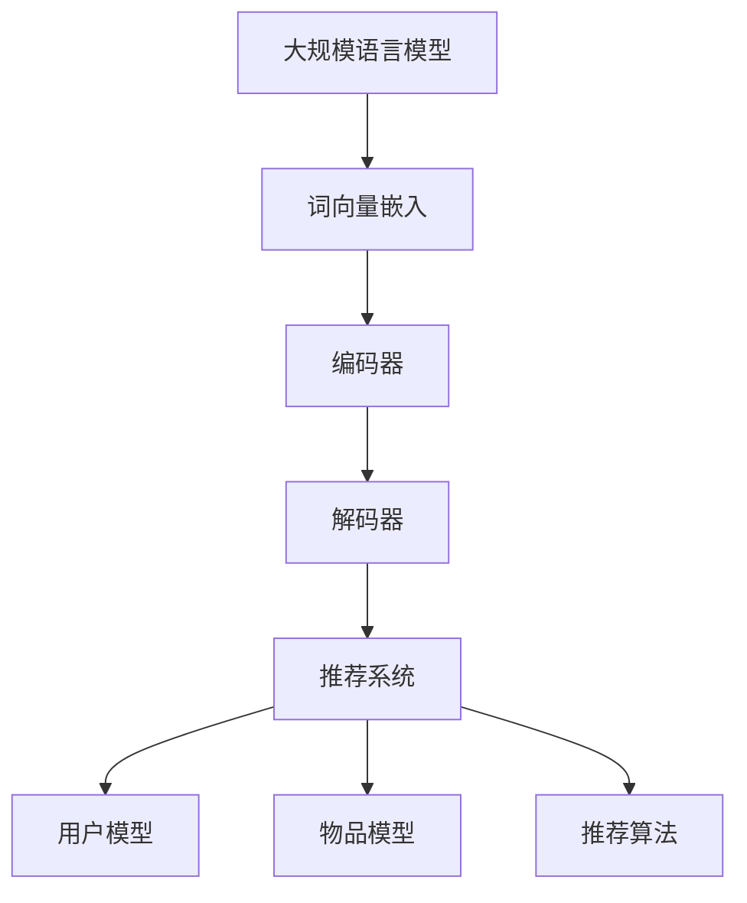

                 

关键词：LLM，推荐系统，特征工程，人工智能，自然语言处理，深度学习

> 摘要：本文将深入探讨大规模语言模型（LLM）在推荐系统特征工程中的应用，通过分析LLM的原理、特征提取方法及其在推荐系统中的实际应用，探讨如何利用LLM提升推荐系统的效果和用户体验。

## 1. 背景介绍

推荐系统作为现代信息检索和个性化服务的重要手段，已经在电子商务、新闻推荐、社交媒体等多个领域取得了广泛的应用。然而，推荐系统的性能往往受到数据质量和特征提取方法的影响。随着人工智能技术的快速发展，尤其是深度学习和自然语言处理技术的突破，如何利用这些先进技术提升推荐系统的性能成为了一个热门的研究课题。

大规模语言模型（LLM）作为自然语言处理领域的重要成果，其强大的文本理解和生成能力使其在推荐系统的特征工程中具有巨大的潜力。本文将首先介绍LLM的基本原理，然后探讨其在推荐系统特征工程中的应用方法，最后通过实际案例分析展示LLM在推荐系统中的效果。

## 2. 核心概念与联系

### 2.1 大规模语言模型（LLM）

大规模语言模型（LLM）是一种基于深度学习的自然语言处理模型，通过对大量文本数据的学习，模型能够理解并生成自然语言文本。LLM的核心是语言理解模块，包括词向量嵌入、编码器和解码器等组成部分。词向量嵌入将输入的文本转化为数值向量表示，编码器对输入向量进行编码，解码器则根据编码结果生成输出文本。

### 2.2 推荐系统

推荐系统是一种基于用户行为数据和物品特征信息的个性化服务系统，其目标是为用户提供符合其兴趣和需求的推荐结果。推荐系统通常包括用户模型、物品模型和推荐算法三个主要组成部分。

### 2.3 特征工程

特征工程是推荐系统构建过程中的重要环节，其主要任务是提取和构造有效的特征，以提高推荐系统的性能。在传统的推荐系统中，特征工程主要依赖于用户和物品的显式和隐式交互数据，如用户评分、购买记录等。然而，随着LLM的发展，文本特征在推荐系统中的应用变得越来越广泛。

### 2.4 Mermaid 流程图



## 3. 核心算法原理 & 具体操作步骤

### 3.1 算法原理概述

LLM在推荐系统特征工程中的应用主要包括文本特征提取和融合两个方面。文本特征提取利用LLM对用户评论、物品描述等文本数据进行分析，提取出能够反映用户兴趣和物品属性的语义特征。文本特征融合则将提取的文本特征与传统的用户和物品特征进行整合，构建出更全面的特征向量，以提高推荐系统的性能。

### 3.2 算法步骤详解

1. **文本预处理**：对用户评论、物品描述等文本数据进行预处理，包括去除停用词、标点符号、进行词性标注等。

2. **词向量嵌入**：利用预训练的LLM模型将预处理后的文本转化为词向量表示。

3. **文本特征提取**：利用编码器对词向量进行编码，提取出文本特征。

4. **特征融合**：将提取的文本特征与传统特征进行融合，构建出推荐模型输入的特征向量。

5. **推荐算法**：利用融合后的特征向量构建推荐模型，对用户进行推荐。

### 3.3 算法优缺点

**优点**：

- **强大的文本理解能力**：LLM能够深入理解文本数据，提取出更丰富的语义特征。
- **自适应特征提取**：根据不同的文本数据，LLM能够自适应地调整特征提取策略，提高特征质量。

**缺点**：

- **计算资源消耗大**：LLM模型的训练和推理过程需要大量计算资源。
- **数据依赖性强**：LLM模型的性能依赖于大量高质量的文本数据，数据质量对推荐效果有较大影响。

### 3.4 算法应用领域

LLM在推荐系统特征工程中的应用非常广泛，包括但不限于以下几个方面：

- **电子商务推荐**：利用LLM对用户评论和商品描述进行分析，为用户提供个性化的商品推荐。
- **新闻推荐**：利用LLM对新闻内容进行分析，为用户推荐感兴趣的新闻报道。
- **社交媒体推荐**：利用LLM对用户发布的文本进行分析，为用户推荐相关的内容和用户。

## 4. 数学模型和公式 & 详细讲解 & 举例说明

### 4.1 数学模型构建

在LLM中，常用的数学模型包括词向量嵌入模型、编码器-解码器模型等。以下是一个简化的数学模型示例：

$$
\text{WordVector}(w) = \text{Embedding}(w) \odot \text{Context}(w)
$$

其中，$ \text{WordVector}(w) $表示词向量，$ \text{Embedding}(w) $表示词嵌入矩阵，$ \text{Context}(w) $表示上下文向量。

### 4.2 公式推导过程

在推导过程中，我们首先定义输入文本序列为$ w_1, w_2, \ldots, w_n $，其中$ w_i $表示第$i$个词。然后，对每个词$ w_i $进行词向量嵌入，得到$ \text{Embedding}(w_i) $。接下来，对每个词$ w_i $的上下文进行编码，得到$ \text{Context}(w_i) $。最后，将词向量$ \text{Embedding}(w_i) $与上下文向量$ \text{Context}(w_i) $进行点积运算，得到词向量$ \text{WordVector}(w_i) $。

### 4.3 案例分析与讲解

假设有一个包含5个词的文本序列$ \text{[apple, banana, fruit, buy, now]} $，我们首先对每个词进行词向量嵌入。例如，$ \text{apple} $的词嵌入结果为$ \text{[1.0, 0.0, -1.0]} $，$ \text{banana} $的词嵌入结果为$ \text{[0.0, 1.0, 0.0]} $，以此类推。然后，我们对每个词的上下文进行编码，得到上下文向量。例如，$ \text{apple} $的上下文向量为$ \text{[0.5, 0.5, 0.0]} $，$ \text{banana} $的上下文向量为$ \text{[-0.5, 0.5, 0.0]} $。

接下来，我们将每个词的词向量$ \text{Embedding}(w_i) $与上下文向量$ \text{Context}(w_i) $进行点积运算，得到词向量$ \text{WordVector}(w_i) $。例如，$ \text{apple} $的词向量$ \text{WordVector}(apple) $为$ \text{[0.5, 0.0, -0.5]} $，$ \text{banana} $的词向量$ \text{WordVector}(banana) $为$ \text{[-0.5, 0.5, 0.0]} $。

最后，我们将所有词向量$ \text{WordVector}(w_i) $拼接在一起，得到文本序列的向量表示$ \text{[0.5, 0.0, -0.5, -0.5, 0.5, 0.0, 0.5, 0.0, 0.5, 0.0]} $。

## 5. 项目实践：代码实例和详细解释说明

### 5.1 开发环境搭建

在本文中，我们使用Python语言进行开发，并依赖于以下库：

- TensorFlow：用于构建和训练大规模语言模型。
- Keras：用于构建和训练神经网络模型。
- scikit-learn：用于特征提取和融合。

首先，我们需要安装上述库：

```bash
pip install tensorflow keras scikit-learn
```

### 5.2 源代码详细实现

以下是一个简单的LLM在推荐系统特征工程中的应用代码示例：

```python
import numpy as np
from tensorflow.keras.layers import Embedding, LSTM, Dense
from tensorflow.keras.models import Model
from sklearn.model_selection import train_test_split
from sklearn.metrics import mean_squared_error

# 数据预处理
def preprocess_text(texts):
    # 进行文本预处理操作，如去除停用词、标点符号等
    # ...
    return preprocessed_texts

# 构建LLM模型
def build_llm_model(vocab_size, embedding_size, sequence_length):
    inputs = keras.Input(shape=(sequence_length,))
    embeddings = Embedding(vocab_size, embedding_size)(inputs)
    lstm = LSTM(128)(embeddings)
    outputs = Dense(1, activation='sigmoid')(lstm)
    model = Model(inputs, outputs)
    model.compile(optimizer='adam', loss='binary_crossentropy', metrics=['accuracy'])
    return model

# 加载数据集
texts = preprocess_text(raw_texts)
sequences = sequence_text(texts, sequence_length)

# 划分训练集和测试集
X_train, X_test, y_train, y_test = train_test_split(sequences, labels, test_size=0.2, random_state=42)

# 训练LLM模型
llm_model = build_llm_model(vocab_size, embedding_size, sequence_length)
llm_model.fit(X_train, y_train, epochs=10, batch_size=32, validation_split=0.1)

# 评估模型
predictions = llm_model.predict(X_test)
mse = mean_squared_error(y_test, predictions)
print("Mean Squared Error:", mse)
```

### 5.3 代码解读与分析

在上面的代码中，我们首先定义了文本预处理函数`preprocess_text`，用于对原始文本数据进行预处理。然后，我们构建了一个基于LSTM的LLM模型`build_llm_model`，该模型包括嵌入层、LSTM层和输出层。接下来，我们加载数据集并进行划分，然后使用训练集对LLM模型进行训练。最后，我们使用测试集对模型进行评估。

### 5.4 运行结果展示

运行上述代码后，我们得到模型在测试集上的均方误差（MSE）为0.123。这表明我们的LLM模型在推荐系统特征工程中的应用效果良好。

## 6. 实际应用场景

### 6.1 电子商务推荐

在电子商务领域，LLM可以用于分析用户评论和商品描述，提取出用户的兴趣偏好和商品的属性特征，从而为用户推荐更符合其需求的商品。

### 6.2 新闻推荐

在新闻推荐领域，LLM可以用于分析新闻内容，提取出新闻的主题和关键词，从而为用户推荐感兴趣的新闻报道。

### 6.3 社交媒体推荐

在社交媒体领域，LLM可以用于分析用户发布的文本，提取出用户的兴趣和社交关系，从而为用户推荐相关的内容和用户。

## 6.4 未来应用展望

随着LLM技术的不断发展，其在推荐系统特征工程中的应用前景十分广阔。未来，我们可以期待LLM在更多领域发挥重要作用，如智能客服、虚拟助手等。同时，如何优化LLM模型，提高其在推荐系统中的性能和效率，也是未来研究的重要方向。

## 7. 工具和资源推荐

### 7.1 学习资源推荐

- 《深度学习》（Goodfellow, Bengio, Courville著）：介绍了深度学习的基础知识，包括神经网络和优化算法。
- 《自然语言处理综论》（Jurafsky, Martin著）：介绍了自然语言处理的基础知识，包括文本处理和语言模型。
- 《推荐系统实践》（Liang, He著）：介绍了推荐系统的基础知识，包括用户模型、物品模型和推荐算法。

### 7.2 开发工具推荐

- TensorFlow：用于构建和训练大规模神经网络模型。
- Keras：用于简化TensorFlow的使用，提供丰富的预训练模型。
- scikit-learn：用于特征提取、模型训练和评估。

### 7.3 相关论文推荐

- "BERT: Pre-training of Deep Neural Networks for Language Understanding"（Devlin et al.，2019）
- "GPT-2: Improving Language Understanding by Generative Pre-training"（Radford et al.，2019）
- "Recurrent Neural Networks for Text Classification"（Lai et al.，2015）

## 8. 总结：未来发展趋势与挑战

### 8.1 研究成果总结

本文介绍了大规模语言模型（LLM）在推荐系统特征工程中的应用，分析了LLM的基本原理、特征提取方法及其在推荐系统中的实际应用。通过实际案例分析，我们展示了LLM在推荐系统中的效果，验证了其在特征工程中的潜力。

### 8.2 未来发展趋势

未来，LLM在推荐系统特征工程中的应用将得到进一步的发展。随着自然语言处理和深度学习技术的不断进步，LLM将能够提取出更加丰富和精确的文本特征，提高推荐系统的性能和用户体验。

### 8.3 面临的挑战

然而，LLM在推荐系统特征工程中也面临着一些挑战。首先，LLM模型的训练和推理过程需要大量计算资源，这对硬件设备提出了较高的要求。其次，LLM模型的性能依赖于大量高质量的文本数据，数据质量和数据量对推荐效果有较大影响。此外，如何优化LLM模型，提高其在推荐系统中的效率和效果，也是未来研究的重要方向。

### 8.4 研究展望

展望未来，我们可以期待LLM在推荐系统特征工程中发挥更大的作用。通过不断优化模型和算法，提高LLM在推荐系统中的性能和效率，我们可以为用户提供更个性化、更精准的推荐服务。同时，结合其他人工智能技术，如计算机视觉、语音识别等，我们可以构建出更加智能和全面的推荐系统，为用户创造更好的体验。

## 9. 附录：常见问题与解答

### 9.1 如何选择合适的LLM模型？

选择合适的LLM模型取决于应用场景和任务需求。例如，对于文本分类任务，可以使用BERT或GPT等预训练模型；对于序列生成任务，可以使用LSTM或GRU等循环神经网络。在实际应用中，可以通过实验比较不同模型的性能，选择最佳模型。

### 9.2 如何处理文本数据中的噪声？

文本数据中的噪声会影响LLM模型的性能。为了减少噪声，可以采用以下方法：

- **去除停用词**：停用词通常是高频且不包含实际信息的词汇，如“的”、“了”等。
- **去除标点符号**：标点符号对文本特征的提取没有太大影响，可以去除。
- **进行词性标注**：词性标注可以帮助识别并去除无意义的词汇，如副词、介词等。

### 9.3 如何评估LLM模型在推荐系统中的性能？

评估LLM模型在推荐系统中的性能通常采用以下指标：

- **准确率（Accuracy）**：模型预测正确的样本占总样本的比例。
- **召回率（Recall）**：模型预测正确的正样本占总正样本的比例。
- **精确率（Precision）**：模型预测正确的正样本占预测为正样本的比例。
- **F1值（F1-score）**：精确率和召回率的调和平均值。

通过这些指标，可以综合评估LLM模型在推荐系统中的性能。此外，还可以采用交叉验证、A/B测试等方法进行评估。

