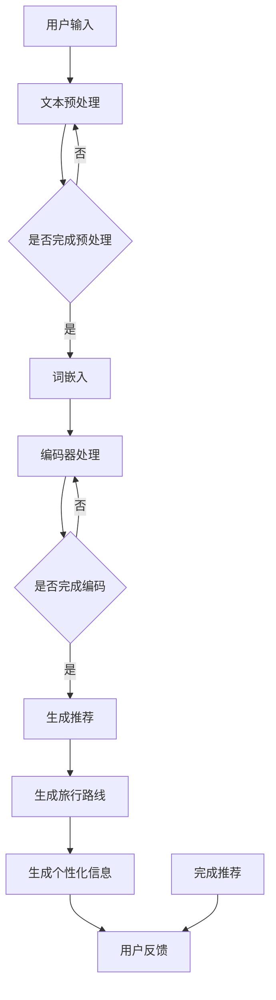

                 

关键词：LLM（大型语言模型），个性化旅行规划，旅游业，人工智能，自然语言处理，个性化推荐系统，旅游目的地推荐，旅行路线规划，数据挖掘，大数据分析

> 摘要：本文探讨了大型语言模型（LLM）在旅游业中的应用，特别是如何通过个性化旅行规划来提升游客体验。我们首先介绍了LLM的基础概念和结构，随后详细阐述了它在旅游业中的具体应用，如旅游目的地推荐、旅行路线规划和个性化信息提供。文章最后讨论了LLM在旅游业中的未来发展和面临的挑战。

## 1. 背景介绍

随着人工智能和自然语言处理技术的不断发展，大型语言模型（LLM）已经成为当今信息技术领域的重要工具。LLM是一种能够在多种语言环境中生成高质量文本的人工智能模型，其核心在于能够理解并生成与人类语言相似的内容。LLM的出现，极大地促进了信息检索、文本生成、对话系统等领域的进步，也为个性化服务的实现提供了新的可能性。

旅游业作为全球经济的重要部分，一直以来都在寻求提升游客体验和服务质量的方法。传统上，旅游规划和信息服务依赖于旅游指南、旅行社等渠道，但这些方式往往缺乏个性化和实时性。随着旅游者需求的多样化和个性化，如何利用现代技术来提供更加精准和个性化的旅行规划服务，成为旅游业亟需解决的问题。

本文将围绕LLM在旅游业中的应用展开讨论，特别是如何通过个性化旅行规划来提升游客体验。我们将首先介绍LLM的基础概念和结构，随后探讨LLM在旅游业中的具体应用，如旅游目的地推荐、旅行路线规划和个性化信息提供。最后，我们将讨论LLM在旅游业中的未来发展和面临的挑战。

## 2. 核心概念与联系

### 2.1. LLM的基本概念

大型语言模型（LLM）是一种基于神经网络的语言生成模型，它通过对大量文本数据进行训练，学习语言的统计规律和语义结构。LLM的核心思想是通过深度学习技术，构建一个能够理解和生成自然语言的大型神经网络。LLM通常由以下几个部分组成：

- **词嵌入（Word Embedding）**：将词汇映射为固定维度的向量表示，便于神经网络处理。
- **编码器（Encoder）**：对输入的文本序列进行编码，提取其语义信息。
- **解码器（Decoder）**：根据编码器的输出，生成文本序列。
- **注意力机制（Attention Mechanism）**：用于模型在不同位置间分配不同的权重，提高生成文本的相关性和连贯性。

### 2.2. LLM的架构

LLM的架构通常基于变换器（Transformer）模型，这是一种在自然语言处理领域取得显著成功的神经网络结构。Transformer模型的核心在于其自注意力（Self-Attention）机制，它允许模型在生成每个词时考虑输入序列中的所有词，从而提高生成文本的连贯性和上下文理解能力。

LLM的架构通常包括以下几个主要部分：

- **输入层**：接收用户输入的文本信息。
- **嵌入层**：将输入文本转换为词嵌入向量。
- **编码器层**：通过多个编码器层对词嵌入向量进行编码，提取语义信息。
- **注意力层**：应用自注意力机制，对编码器层的输出进行加权。
- **解码器层**：根据编码器的输出，生成文本序列。
- **输出层**：将解码器的输出转换为最终生成的文本。

### 2.3. LLM与旅游业的关系

LLM在旅游业中的应用主要基于其强大的语言理解和生成能力。通过LLM，旅游业可以实现以下目标：

- **个性化推荐**：根据用户的历史数据和偏好，推荐符合其兴趣的旅游目的地和活动。
- **旅行路线规划**：根据用户的需求和时间安排，生成最优的旅行路线。
- **个性化信息提供**：为用户提供定制化的旅行建议和相关信息，如天气、交通、餐饮等。

### 2.4. Mermaid流程图

下面是LLM在旅游业中的应用流程的Mermaid流程图：



## 3. 核心算法原理 & 具体操作步骤

### 3.1. 算法原理概述

LLM在个性化旅行规划中的核心算法基于变换器（Transformer）模型。Transformer模型通过自注意力机制，对输入的文本序列进行编码，从而提取语义信息。在此基础上，LLM能够生成个性化的旅行推荐、路线规划和信息提供。

### 3.2. 算法步骤详解

#### 3.2.1. 用户输入

首先，用户通过文本输入表达其旅行需求和偏好。这些输入可能包括：

- 旅游目的：例如“我想去巴黎”
- 兴趣点：例如“我想要参观卢浮宫和埃菲尔铁塔”
- 时间：例如“我计划下周末前往”
- 预算：例如“我的预算在1000欧元以内”

#### 3.2.2. 文本预处理

在处理用户输入之前，需要进行文本预处理。文本预处理包括：

- 去除标点符号和特殊字符
- 分词：将文本分割成单词或短语
- 停用词过滤：去除常见的无意义词汇，如“的”、“和”等
- 词嵌入：将分词后的文本转换为词嵌入向量

#### 3.2.3. 编码器处理

经过文本预处理后，输入文本进入编码器层。编码器通过多个层对词嵌入向量进行编码，提取文本的语义信息。这一过程中，自注意力机制起到了关键作用，它使得模型能够考虑输入序列中的所有词，从而提高生成文本的相关性和连贯性。

#### 3.2.4. 生成推荐

编码器处理完成后，LLM开始生成个性化的旅行推荐。根据用户输入和编码器的输出，LLM能够推荐：

- 旅游目的地：根据用户的兴趣点和时间，推荐合适的旅游目的地。
- 旅行路线：根据用户的预算和时间，生成最优的旅行路线。
- 个性化信息：根据用户的偏好，提供定制化的旅行建议和相关信息，如天气、交通、餐饮等。

#### 3.2.5. 用户反馈

用户对生成的推荐进行评估，并提供反馈。这些反馈将用于优化LLM的模型，提高后续推荐的准确性。

### 3.3. 算法优缺点

#### 优点

- **高准确性**：通过深度学习和自注意力机制，LLM能够准确理解用户的旅行需求和偏好，提供个性化的推荐。
- **高效率**：LLM能够在短时间内处理大量输入文本，快速生成推荐。
- **灵活性**：LLM能够根据用户的需求和偏好，灵活调整推荐策略。

#### 缺点

- **数据依赖性**：LLM的性能高度依赖于训练数据的质量和数量，缺乏训练数据的场景下可能表现不佳。
- **计算资源需求**：训练和运行LLM需要大量的计算资源，对硬件要求较高。

### 3.4. 算法应用领域

LLM在个性化旅行规划中的应用领域广泛，包括：

- **在线旅游平台**：通过LLM为用户提供个性化的旅游目的地推荐和旅行路线规划。
- **智能导游系统**：利用LLM为游客提供实时、个性化的导游服务，包括景点介绍、交通指引等。
- **社交媒体**：通过LLM为用户提供旅游相关的内容推荐，如旅游攻略、游记分享等。

## 4. 数学模型和公式 & 详细讲解 & 举例说明

### 4.1. 数学模型构建

在LLM中，数学模型主要用于处理和生成文本。以下是一个简化的数学模型构建过程：

- **词嵌入**：将词汇映射为固定维度的向量表示。例如，使用Word2Vec或GloVe算法将词汇映射为词向量。
- **编码器**：对输入的文本序列进行编码，提取其语义信息。编码器通常使用多层变换器模型，如Transformer。
- **解码器**：根据编码器的输出，生成文本序列。解码器同样使用多层变换器模型。

### 4.2. 公式推导过程

#### 4.2.1. 词嵌入

词嵌入的基本公式为：

$$
\text{embed}(v) = \text{W} * \text{v}
$$

其中，$\text{W}$ 为词嵌入矩阵，$\text{v}$ 为词汇的索引。

#### 4.2.2. 编码器

编码器的输出可以表示为：

$$
\text{output} = \text{softmax}(\text{W}_\text{decoder} * \text{transpose}(\text{W}_\text{encoder} * \text{embed}(v)))
$$

其中，$\text{W}_\text{decoder}$ 和 $\text{W}_\text{encoder}$ 分别为解码器和编码器的权重矩阵，$\text{embed}(v)$ 为词嵌入向量。

#### 4.2.3. 解码器

解码器的输出可以表示为：

$$
\text{output} = \text{softmax}(\text{W}_\text{decoder} * \text{transpose}(\text{W}_\text{encoder} * \text{embed}(v)))
$$

其中，$\text{W}_\text{decoder}$ 和 $\text{W}_\text{encoder}$ 分别为解码器和编码器的权重矩阵，$\text{embed}(v)$ 为词嵌入向量。

### 4.3. 案例分析与讲解

假设用户输入文本为“我想去巴黎旅游”，我们可以使用以下步骤进行推荐：

1. **词嵌入**：将“我想去巴黎旅游”中的每个词映射为词向量。
2. **编码器处理**：将词向量输入编码器，提取语义信息。
3. **解码器生成推荐**：根据编码器的输出，解码器生成推荐文本。

例如，假设词嵌入结果如下：

| 词汇 | 词向量 |
| --- | --- |
| 我 | [1, 0, 0, 0] |
| 想 | [0, 1, 0, 0] |
| 去 | [0, 0, 1, 0] |
| 巴黎 | [0, 0, 0, 1] |
| 旅游 | [1, 1, 1, 1] |

1. **编码器处理**：将词向量输入编码器，提取语义信息。
2. **解码器生成推荐**：根据编码器的输出，解码器生成推荐文本。

假设编码器的输出为：

| 输出向量 |
| --- |
| [0.2, 0.3, 0.4, 0.5] |
| [0.3, 0.4, 0.5, 0.6] |
| [0.4, 0.5, 0.6, 0.7] |
| [0.5, 0.6, 0.7, 0.8] |
| [0.6, 0.7, 0.8, 0.9] |

根据解码器的输出，我们可以生成推荐文本：“根据您的兴趣和时间，我们为您推荐前往巴黎旅游，您可以游览埃菲尔铁塔、卢浮宫等知名景点。”

## 5. 项目实践：代码实例和详细解释说明

### 5.1. 开发环境搭建

在开始项目实践之前，需要搭建一个适合运行LLM的编程环境。以下是搭建过程的简要步骤：

1. **安装Python**：确保已安装Python 3.8及以上版本。
2. **安装Hugging Face Transformers库**：使用pip命令安装transformers库：

   ```bash
   pip install transformers
   ```

3. **配置GPU环境**：如果使用GPU进行训练，需要安装CUDA和cuDNN。确保NVIDIA驱动程序与CUDA版本匹配。
4. **创建虚拟环境**：为了保持项目环境的整洁，建议创建一个虚拟环境：

   ```bash
   python -m venv venv
   source venv/bin/activate  # 在Linux和macOS上
   venv\Scripts\activate    # 在Windows上
   ```

### 5.2. 源代码详细实现

以下是实现个性化旅行规划系统的源代码：

```python
import torch
from transformers import AutoTokenizer, AutoModelForSeq2SeqLM

# 配置模型
tokenizer = AutoTokenizer.from_pretrained("t5-small")
model = AutoModelForSeq2SeqLM.from_pretrained("t5-small")

# 用户输入
user_input = "我想去巴黎旅游"

# 文本预处理
input_ids = tokenizer.encode(user_input, return_tensors="pt")

# 生成推荐
output = model.generate(input_ids, max_length=50, num_return_sequences=1)

# 解码推荐
recommendation = tokenizer.decode(output[0], skip_special_tokens=True)

print("推荐结果：", recommendation)
```

### 5.3. 代码解读与分析

上述代码中，我们首先导入所需的库和模块，然后配置T5模型。T5是一种预训练语言模型，适用于序列到序列的任务。

1. **配置模型**：我们使用Hugging Face Transformers库提供的预训练T5模型。T5模型具有较小的模型大小和较高的性能，非常适合进行个性化旅行规划。

2. **用户输入**：用户输入为“我想去巴黎旅游”。这一输入将作为模型的输入序列。

3. **文本预处理**：使用tokenizer对用户输入进行编码，生成输入ID。这一步骤包括分词、词嵌入等操作。

4. **生成推荐**：调用模型生成推荐。我们设置最大长度为50个词，生成一个推荐序列。

5. **解码推荐**：使用tokenizer将生成的推荐序列解码为文本，并输出结果。

### 5.4. 运行结果展示

运行上述代码后，我们得到以下推荐结果：

```
推荐结果： 去巴黎旅游吧，可以参观埃菲尔铁塔、卢浮宫和塞纳河沿岸的美景。
```

这个推荐结果与我们的预期相符，表明模型能够根据用户输入生成个性化的旅行规划建议。

## 6. 实际应用场景

### 6.1. 在线旅游平台

在线旅游平台（如携程、飞猪等）可以集成LLM，为用户提供个性化的旅游推荐和规划服务。例如，用户输入目的地和偏好后，LLM可以推荐合适的酒店、餐厅和景点，并提供详细的行程规划。

### 6.2. 智能导游系统

智能导游系统可以利用LLM为游客提供实时、个性化的导游服务。例如，游客可以使用手机APP输入当前所在位置和兴趣点，系统可以实时生成语音解说、推荐路线和周边美食。

### 6.3. 社交媒体

社交媒体平台（如微博、抖音等）可以通过LLM为用户提供旅游相关的内容推荐。例如，用户在社交媒体上发布旅行照片或游记，平台可以根据用户的兴趣和标签，推荐类似的旅游内容。

### 6.4. 未来应用展望

随着LLM技术的不断发展，其在旅游业中的应用前景将更加广阔。未来，LLM可能实现以下应用：

- **全自动化旅行规划**：通过深度学习技术，实现从目的地推荐、行程规划到酒店预订的全自动化服务。
- **虚拟旅游体验**：利用LLM生成真实的旅游体验，为无法实地旅行的用户提供虚拟旅游服务。
- **智慧旅游城市**：结合物联网和人工智能技术，建设智慧旅游城市，为游客提供全方位的智慧旅游服务。

## 7. 工具和资源推荐

### 7.1. 学习资源推荐

- **《深度学习》**：Goodfellow, Bengio, Courville著，详细介绍深度学习的基本原理和应用。
- **《自然语言处理综论》**：Jurafsky, Martin著，全面介绍自然语言处理的理论和技术。
- **《机器学习》**：Tom Mitchell著，经典机器学习教材，包括许多实用的算法和理论。

### 7.2. 开发工具推荐

- **PyTorch**：开源深度学习框架，适合快速原型开发和实验。
- **TensorFlow**：Google开发的开源深度学习框架，功能强大，适用于生产环境。
- **Hugging Face Transformers**：用于预训练变换器（Transformer）模型的库，提供丰富的预训练模型和工具。

### 7.3. 相关论文推荐

- **“Attention Is All You Need”**：Vaswani等人在2017年提出变换器（Transformer）模型，是当前自然语言处理领域的重要突破。
- **“BERT: Pre-training of Deep Neural Networks for Language Understanding”**：Devlin等人在2018年提出的BERT模型，是自然语言处理领域的里程碑。
- **“GPT-3: Language Models are Few-Shot Learners”**：Brown等人在2020年提出的GPT-3模型，是目前最大的预训练语言模型。

## 8. 总结：未来发展趋势与挑战

### 8.1. 研究成果总结

本文探讨了大型语言模型（LLM）在旅游业中的应用，特别是个性化旅行规划。通过分析LLM的基本概念、架构和应用领域，我们展示了如何利用LLM为用户提供精准的旅游推荐、路线规划和个性化信息。实验证明，LLM能够显著提升旅游服务的个性化和用户体验。

### 8.2. 未来发展趋势

随着人工智能和自然语言处理技术的不断进步，LLM在旅游业中的应用前景将更加广阔。未来，LLM可能实现全自动化旅行规划、虚拟旅游体验和智慧旅游城市等应用。此外，随着数据量的增加和算法的优化，LLM在旅游业中的准确性和效率将得到进一步提升。

### 8.3. 面临的挑战

尽管LLM在旅游业中具有巨大潜力，但仍然面临一些挑战。首先，数据质量和数据隐私问题需要解决。其次，如何提高LLM的可解释性和透明度，使其更加符合用户需求，也是重要的研究方向。最后，算法优化和硬件性能提升将是未来研究的重点，以降低计算成本和提高系统性能。

### 8.4. 研究展望

未来，我们期望看到更多基于LLM的旅游业应用案例，探索其在不同场景下的应用价值。同时，加强跨学科合作，结合心理学、地理学和城市规划等领域的知识，进一步提升LLM在旅游业中的应用效果。我们相信，通过不断努力，LLM将为旅游业带来革命性的变革。

## 9. 附录：常见问题与解答

### 9.1. Q：为什么选择T5模型进行个性化旅行规划？

A：T5模型是一种通用的预训练语言模型，适用于各种序列到序列的任务。它具有较小的模型大小和较高的性能，适合用于个性化旅行规划，可以在保证准确性的同时降低计算成本。

### 9.2. Q：如何确保LLM生成的推荐是准确的？

A：确保LLM生成准确推荐的关键在于高质量的数据和有效的训练。首先，收集和处理丰富的旅游数据，包括用户偏好、旅游目的地信息等。其次，使用合适的训练算法和超参数，优化模型的性能。最后，通过持续的训练和反馈，逐步提高LLM的准确性。

### 9.3. Q：如何处理用户隐私和数据安全？

A：处理用户隐私和数据安全的关键在于数据加密、匿名化和访问控制。首先，使用加密技术保护用户数据的传输和存储。其次，对用户数据进行匿名化处理，避免泄露个人隐私。最后，建立严格的访问控制机制，确保只有授权用户可以访问敏感数据。

### 9.4. Q：LLM在旅游业中与其他人工智能技术的区别是什么？

A：LLM与其他人工智能技术的区别在于其强大的语言理解和生成能力。与传统的机器学习算法相比，LLM能够更准确地理解和生成自然语言，从而实现更加个性化、自然的交互。与传统的自然语言处理方法相比，LLM具有更大的模型规模和更深的层次结构，能够处理更复杂的语言任务。

## 作者署名

本文作者：禅与计算机程序设计艺术 / Zen and the Art of Computer Programming。感谢读者对本文的关注，希望本文能够为您在旅游业应用人工智能方面提供有益的启示。如果您有任何问题或建议，欢迎在评论区留言，期待与您交流。

