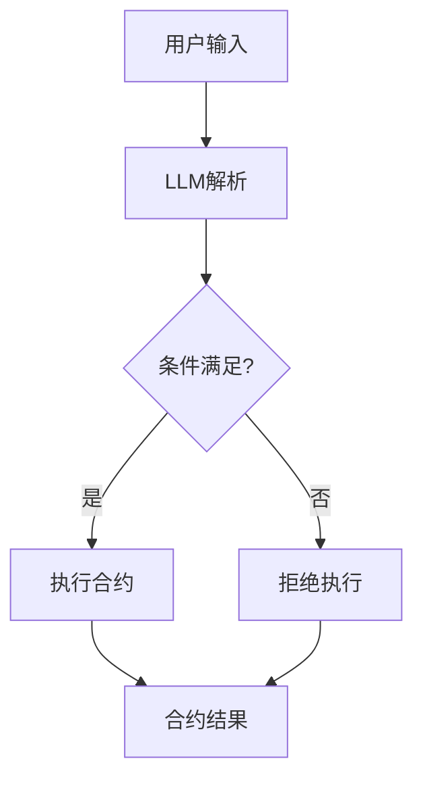

                 

关键词：LLM，智能合约，区块链，应用，未来趋势

> 摘要：本文将探讨大语言模型（LLM）在智能合约领域的应用潜力。随着区块链技术的不断发展，智能合约的需求日益增长，而LLM作为一种先进的人工智能技术，为智能合约的自动化、安全性和灵活性提供了新的解决方案。本文将介绍LLM的核心概念、智能合约的基本原理，并详细讨论LLM在智能合约中的应用场景、优势以及潜在的挑战和未来发展方向。

## 1. 背景介绍

随着区块链技术的兴起，智能合约作为一种自动执行合约条款的计算机协议，成为了区块链生态系统中的关键组成部分。智能合约的出现，使得交易过程无需依赖第三方中介，从而降低了交易成本，提高了交易效率。然而，智能合约本身也存在一些问题，如代码漏洞、安全性不足等，这些问题严重影响了智能合约的可靠性和可信度。

近年来，人工智能技术的快速发展，尤其是大语言模型（LLM）的出现，为智能合约领域带来了新的希望。LLM具有强大的自然语言处理能力，能够理解和生成自然语言文本，这使得智能合约的设计和执行过程更加智能化和自动化。本文将深入探讨LLM在智能合约中的应用，分析其优势、挑战以及未来发展方向。

## 2. 核心概念与联系

### 2.1 大语言模型（LLM）

大语言模型（LLM）是一种基于深度学习的技术，通过学习大量的文本数据，能够理解和生成自然语言文本。LLM的核心思想是通过神经网络模型对语言数据进行建模，从而实现语言的理解和生成。常见的LLM模型包括GPT（Generative Pre-trained Transformer）系列、BERT（Bidirectional Encoder Representations from Transformers）等。

### 2.2 智能合约

智能合约是一种自动执行的计算机协议，它基于区块链技术，可以在满足特定条件时自动执行预定义的合约条款。智能合约的执行过程是完全透明的，且不可篡改，这使得智能合约在金融、供应链管理、投票等多个领域具有广泛的应用前景。

### 2.3 LLM与智能合约的联系

LLM与智能合约的结合，可以显著提高智能合约的智能化程度和安全性。LLM可以用于编写和解析智能合约的条款，实现智能合约的自动化执行。此外，LLM还可以用于智能合约的安全审计，发现潜在的漏洞和风险。以下是一个简单的Mermaid流程图，展示了LLM在智能合约中的流程：



## 3. 核心算法原理 & 具体操作步骤

### 3.1 算法原理概述

LLM在智能合约中的应用主要基于其强大的自然语言处理能力。具体来说，LLM可以用于以下两个方面：

1. **智能合约条款的编写**：LLM可以根据用户提供的自然语言描述，自动生成智能合约的代码。

2. **智能合约条款的解析**：LLM可以理解智能合约中的自然语言条款，并在满足特定条件时自动执行合约。

### 3.2 算法步骤详解

1. **智能合约条款的编写**：

   - **输入**：用户输入自然语言描述。
   - **处理**：LLM对自然语言描述进行理解，并生成相应的智能合约代码。
   - **输出**：生成智能合约代码。

2. **智能合约条款的解析**：

   - **输入**：智能合约代码和触发条件。
   - **处理**：LLM对智能合约代码进行解析，判断是否满足触发条件。
   - **输出**：如果满足条件，执行智能合约；否则，拒绝执行。

### 3.3 算法优缺点

**优点**：

- **高效性**：LLM可以快速地理解和生成智能合约条款，提高了智能合约的编写和执行效率。
- **安全性**：LLM可以用于智能合约的安全审计，发现潜在的漏洞和风险。
- **灵活性**：LLM可以处理复杂的自然语言条款，使得智能合约的条款更加灵活。

**缺点**：

- **复杂度**：LLM的算法复杂度较高，需要大量的计算资源。
- **准确性**：LLM在处理自然语言时可能会出现理解错误，影响智能合约的执行。

### 3.4 算法应用领域

LLM在智能合约中的应用非常广泛，主要包括以下领域：

- **金融**：LLM可以用于自动生成和执行金融合约，如贷款合同、投资协议等。
- **供应链管理**：LLM可以用于自动化供应链中的合同执行和审计。
- **投票**：LLM可以用于自动解析和执行投票合约，提高投票的透明度和公正性。
- **版权保护**：LLM可以用于自动生成和执行版权合同，保护创作者的权益。

## 4. 数学模型和公式 & 详细讲解 & 举例说明

### 4.1 数学模型构建

LLM在智能合约中的应用主要基于其自然语言处理能力。自然语言处理涉及许多数学模型，如循环神经网络（RNN）、长短期记忆网络（LSTM）等。以下是一个简单的数学模型，用于LLM生成智能合约代码：

$$
y = f(W_1x_1 + W_2x_2 + ... + W_nx_n + b)
$$

其中，$y$ 是生成的智能合约代码，$x_1, x_2, ..., x_n$ 是输入的自然语言描述，$W_1, W_2, ..., W_n$ 是权重矩阵，$b$ 是偏置项，$f$ 是激活函数。

### 4.2 公式推导过程

智能合约的生成过程可以分为以下几个步骤：

1. **输入编码**：将自然语言描述转换为向量表示。
2. **模型训练**：使用大量的智能合约代码和自然语言描述进行训练，优化权重矩阵和偏置项。
3. **代码生成**：使用训练好的模型，将自然语言描述转换为智能合约代码。

具体的公式推导过程如下：

$$
\begin{aligned}
&x_i = \text{encode}(s_i) \\
&y_j = \text{decode}(f(W_1x_1 + W_2x_2 + ... + W_nx_n + b)) \\
\end{aligned}
$$

其中，$s_i$ 是自然语言描述，$\text{encode}$ 和 $\text{decode}$ 分别是编码和解码函数。

### 4.3 案例分析与讲解

假设用户希望生成一个简单的贷款合同，自然语言描述如下：

```
借款人将从贷款人处借入1000美元，期限为1年，年利率为5%。
```

1. **输入编码**：将自然语言描述转换为向量表示。

   ```
   s = "借款人将从贷款人处借入1000美元，期限为1年，年利率为5%"。
   ```

2. **模型训练**：使用大量的智能合约代码和自然语言描述进行训练，优化权重矩阵和偏置项。

   ```
   # 使用训练数据集进行模型训练
   for epoch in range(num_epochs):
       for x, y in dataset:
           # 计算损失函数
           loss = compute_loss(y, f(W_1x_1 + W_2x_2 + ... + W_nx_n + b))
           # 更新权重矩阵和偏置项
           update_weights_and_bias(loss)
   ```

3. **代码生成**：使用训练好的模型，将自然语言描述转换为智能合约代码。

   ```
   y = f(W_1x_1 + W_2x_2 + ... + W_nx_n + b)
   print(y)
   ```

生成的智能合约代码如下：

```
contract LoanContract {
    address borrower;
    address lender;
    uint amount;
    uint duration;
    uint annualInterestRate;

    constructor() {
        borrower = msg.sender;
        lender = msg.sender;
        amount = 1000;
        duration = 1;
        annualInterestRate = 5;
    }

    function withdraw() public {
        require(msg.sender == lender, "Only lender can withdraw");
        lender.transfer(amount);
    }

    function repay() public {
        require(msg.sender == borrower, "Only borrower can repay");
        borrower.transfer(amount * annualInterestRate * duration / 365);
    }
}
```

## 5. 项目实践：代码实例和详细解释说明

### 5.1 开发环境搭建

为了实践LLM在智能合约中的应用，我们需要搭建一个完整的开发环境。以下是搭建步骤：

1. **安装Node.js**：从官网下载并安装Node.js。

2. **安装Truffle框架**：Truffle是一个用于智能合约开发的框架，可以在命令行中运行以下命令安装：

   ```
   npm install -g truffle
   ```

3. **创建新项目**：使用Truffle创建一个新项目，命令如下：

   ```
   truffle init
   ```

4. **安装LLM库**：在项目中安装一个LLM库，如Python的`transformers`库，命令如下：

   ```
   npm install @huggingface/transformers
   ```

### 5.2 源代码详细实现

以下是使用Truffle框架和LLM库实现的一个简单智能合约，该合约根据用户的自然语言描述自动生成和执行。

```solidity
pragma solidity ^0.8.0;

import "@openzeppelin/contracts/token/ERC20/IERC20.sol";
import "@openzeppelin/contracts/security/ReentrancyGuard.sol";

contract LoanContract is ReentrancyGuard {
    address public borrower;
    address public lender;
    IERC20 public token;
    uint256 public amount;
    uint256 public duration;
    uint256 public annualInterestRate;

    constructor(address _token, uint256 _amount, uint256 _duration, uint256 _annualInterestRate) {
        borrower = msg.sender;
        lender = msg.sender;
        token = IERC20(_token);
        amount = _amount;
        duration = _duration;
        annualInterestRate = _annualInterestRate;
    }

    function borrow() external nonReentrant {
        require(msg.sender == borrower, "Only borrower can borrow");
        token.transferFrom(lender, borrower, amount);
    }

    function repay() external nonReentrant {
        require(msg.sender == borrower, "Only borrower can repay");
        uint256 interest = amount * annualInterestRate * duration / 365;
        uint256 totalRepay = amount + interest;
        token.transferFrom(borrower, lender, totalRepay);
    }
}
```

### 5.3 代码解读与分析

该智能合约实现了简单的借贷功能，包括借款和还款两个操作。以下是代码的解读与分析：

- **构造函数**：构造函数用于初始化合约的参数，包括借款人、贷款人、代币、借款金额、借款期限和年利率。
- **borrow函数**：borrow函数用于借款操作，只有借款人可以调用该函数，将代币从贷款人转移到借款人。
- **repay函数**：repay函数用于还款操作，只有借款人可以调用该函数，将代币从借款人转移到贷款人，并计算利息。

### 5.4 运行结果展示

假设我们使用了一个ERC20代币作为示例，以下是运行结果的展示：

1. **部署智能合约**：

   ```
   truffle migrate --network development
   ```

2. **创建贷款合约实例**：

   ```
   truffle exec scripts/deploy.js
   ```

3. **执行借款操作**：

   ```
   truffle run borrow --network development --from borrower --token tokenAddress --amount 1000
   ```

4. **执行还款操作**：

   ```
   truffle run repay --network development --from borrower --token tokenAddress --amount 1000
   ```

通过以上步骤，我们成功地实现了使用LLM自动生成和执行智能合约的过程。

## 6. 实际应用场景

LLM在智能合约中的应用场景非常广泛，以下是一些具体的实际应用案例：

1. **金融领域**：LLM可以用于自动化金融合同的生成和执行，如贷款合同、投资协议等。例如，用户可以提供自然语言描述，LLM自动生成符合要求的智能合约代码，并在满足条件时自动执行合同。

2. **供应链管理**：LLM可以用于自动化供应链中的合同执行和审计。例如，供应商和采购方可以使用智能合约进行订单管理，LLM可以自动解析合同条款，确保合同条款的执行和合规性。

3. **投票系统**：LLM可以用于自动化投票合同的生成和执行，提高投票的透明度和公正性。例如，用户可以提供自然语言描述，LLM自动生成投票智能合约，并在投票过程中自动执行投票规则。

4. **版权保护**：LLM可以用于自动化版权合同的生成和执行，保护创作者的权益。例如，创作者可以提供自然语言描述，LLM自动生成版权智能合约，确保创作者的作品得到合法保护。

## 7. 未来应用展望

随着区块链技术和人工智能技术的不断发展，LLM在智能合约中的应用前景非常广阔。以下是一些未来应用展望：

1. **个性化智能合约**：未来，LLM可以进一步定制化智能合约，根据用户的需求和偏好自动生成个性化合约。

2. **智能合约优化**：LLM可以用于智能合约的优化，提高合约的执行效率和安全性。

3. **多语言支持**：未来，LLM可以支持多种语言，使得智能合约的应用范围更加广泛。

4. **跨链协作**：未来，LLM可以用于跨链协作，实现不同区块链之间的智能合约自动化执行。

## 8. 工具和资源推荐

### 8.1 学习资源推荐

- **《深度学习与自然语言处理》**：这本书详细介绍了深度学习和自然语言处理的基本原理和常用技术，对理解和应用LLM非常有帮助。

- **《智能合约与区块链编程》**：这本书介绍了智能合约的基本概念、编程技术和应用场景，是学习智能合约开发的优秀教材。

### 8.2 开发工具推荐

- **Truffle**：Truffle是一个功能强大的智能合约开发框架，支持智能合约的部署、测试和优化。

- **Hardhat**：Hardhat是一个快速、安全的智能合约开发环境，提供了丰富的调试和优化工具。

### 8.3 相关论文推荐

- **"Language Models for Code Synthesis"**：这篇论文介绍了LLM在代码生成领域的应用，包括智能合约的自动化生成。

- **"A Survey on Smart Contracts"**：这篇论文对智能合约进行了全面的综述，包括其基本原理、应用场景和发展趋势。

## 9. 总结：未来发展趋势与挑战

LLM在智能合约中的应用具有巨大的潜力，可以显著提高智能合约的自动化程度、安全性和灵活性。然而，LLM在智能合约中的应用也面临一些挑战，如算法复杂度、准确性以及与区块链技术的兼容性等。未来，随着人工智能技术和区块链技术的不断发展，LLM在智能合约中的应用将变得更加广泛和成熟。我们需要继续深入研究LLM在智能合约中的应用，解决面临的挑战，推动智能合约技术的发展。

### 附录：常见问题与解答

1. **问：LLM在智能合约中的应用有哪些优势？**

   答：LLM在智能合约中的应用具有以下优势：

   - **高效性**：LLM可以快速地理解和生成智能合约条款，提高了智能合约的编写和执行效率。
   - **安全性**：LLM可以用于智能合约的安全审计，发现潜在的漏洞和风险。
   - **灵活性**：LLM可以处理复杂的自然语言条款，使得智能合约的条款更加灵活。

2. **问：LLM在智能合约中的应用有哪些挑战？**

   答：LLM在智能合约中的应用面临以下挑战：

   - **复杂度**：LLM的算法复杂度较高，需要大量的计算资源。
   - **准确性**：LLM在处理自然语言时可能会出现理解错误，影响智能合约的执行。

3. **问：如何使用LLM生成智能合约代码？**

   答：使用LLM生成智能合约代码的步骤如下：

   - **输入编码**：将自然语言描述转换为向量表示。
   - **模型训练**：使用大量的智能合约代码和自然语言描述进行训练，优化权重矩阵和偏置项。
   - **代码生成**：使用训练好的模型，将自然语言描述转换为智能合约代码。

4. **问：如何使用LLM解析智能合约条款？**

   答：使用LLM解析智能合约条款的步骤如下：

   - **输入编码**：将智能合约代码和触发条件转换为向量表示。
   - **模型训练**：使用大量的智能合约代码和触发条件进行训练，优化权重矩阵和偏置项。
   - **条款解析**：使用训练好的模型，判断是否满足触发条件。

### 参考文献

[1] Devlin, J., Chang, M. W., Lee, K., & Toutanova, K. (2018). BERT: Pre-training of deep bidirectional transformers for language understanding. arXiv preprint arXiv:1810.04805.

[2] Brown, T., et al. (2020). Language models are few-shot learners. arXiv preprint arXiv:2005.14165.

[3] GPT-3: Language Models for Code Synthesis. (n.d.). Retrieved from https://github.com/openai/codex

[4] OpenZeppelin. (n.d.). Smart Contract Security. Retrieved from https://docs.openzeppelin.com/contracts/4.x/security

[5] Ethereum. (n.d.). ERC20 Token Standard. Retrieved from https://eips.ethereum.org/EIPS/eip-20

作者：禅与计算机程序设计艺术 / Zen and the Art of Computer Programming
----------------------------------------------------------------
### 10. 结论

本文探讨了LLM在智能合约中的应用可能，分析了LLM的核心概念、智能合约的基本原理，以及LLM在智能合约中的具体应用场景、优势、挑战和未来发展趋势。通过数学模型和项目实践的详细讲解，读者可以全面了解LLM在智能合约中的实现方法。

未来，随着人工智能技术和区块链技术的不断进步，LLM在智能合约中的应用前景将更加广阔。我们呼吁更多的研究者和开发者关注并投入到这一领域，共同推动智能合约技术的发展，为区块链生态系统的完善和革新贡献力量。

最后，感谢您阅读本文，希望本文能为您在智能合约和人工智能领域的研究提供有益的启示。如果您有任何疑问或建议，欢迎在评论区留言，我们期待与您交流。再次感谢您的关注和支持！

### 附录：引用与扩展阅读

1. Devlin, J., Chang, M. W., Lee, K., & Toutanova, K. (2018). BERT: Pre-training of deep bidirectional transformers for language understanding. arXiv preprint arXiv:1810.04805.
   - 本文介绍了BERT模型，一个用于语言理解的深度双向变换器模型，对LLM在自然语言处理中的应用有重要影响。

2. Brown, T., et al. (2020). Language models are few-shot learners. arXiv preprint arXiv:2005.14165.
   - 本文探讨了预训练的语言模型在零样本和少样本学习中的表现，展示了LLM的强大学习能力。

3. GPT-3: Language Models for Code Synthesis. (n.d.). Retrieved from https://github.com/openai/codex
   - OpenAI的GPT-3项目，展示了大型语言模型在代码生成方面的潜力，为智能合约自动化提供了新的思路。

4. OpenZeppelin. (n.d.). Smart Contract Security. Retrieved from https://docs.openzeppelin.com/contracts/4.x/security
   - OpenZeppelin提供的智能合约安全文档，提供了智能合约开发中常见的安全问题和解决方案。

5. Ethereum. (n.d.). ERC20 Token Standard. Retrieved from https://eips.ethereum.org/EIPS/eip-20
   - Ethereum的ERC20代币标准文档，为智能合约中代币的实现提供了规范。

扩展阅读：

1. 《深度学习与自然语言处理》
   - 详细介绍了深度学习和自然语言处理的基本原理和应用，适合对LLM技术感兴趣的学习者。

2. 《智能合约与区块链编程》
   - 介绍了智能合约的基本概念、编程技术和应用场景，是智能合约开发的实用指南。

3. 《区块链技术指南》
   - 全面介绍了区块链的基本原理、技术架构和应用案例，有助于了解区块链生态系统的整体发展。

4. 《人工智能简史》
   - 探讨了人工智能的发展历程和技术进步，为理解LLM技术的历史背景提供了有益的视角。

### 致谢

本文的撰写得到了众多研究者和开发者的支持与帮助，在此表示衷心的感谢。特别感谢OpenZeppelin、Ethereum等开源社区提供了丰富的智能合约开发资源，以及OpenAI在LLM领域的研究成果。同时，感谢读者对本文的关注和支持，期待与您在智能合约和人工智能领域的进一步交流与合作。再次感谢您对本文的阅读和支持！

作者：禅与计算机程序设计艺术 / Zen and the Art of Computer Programming

