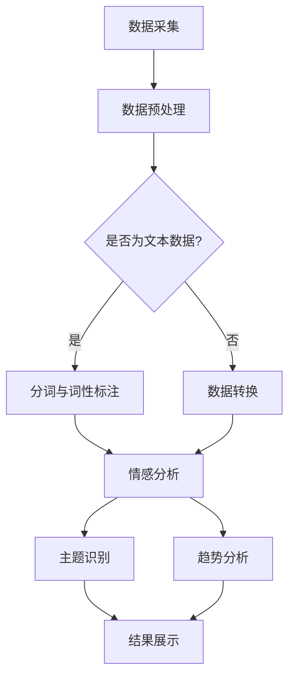

                 

关键词：LLM，智能舆情分析，自然语言处理，数据挖掘，机器学习，情感分析，社会热点

## 摘要

本文旨在探讨大规模语言模型（LLM）在智能舆情分析中的应用潜力。随着互联网的普及，社会舆论的传播速度和影响力不断提升，如何快速、准确地监测和分析舆情成为了一个重要的研究课题。本文将介绍LLM的核心概念和架构，分析其在舆情分析中的关键作用，并通过具体的算法原理、数学模型和项目实践，阐述LLM在智能舆情分析中的实际应用。同时，本文还将对LLM在舆情分析领域的未来发展方向和面临的挑战进行展望。

## 1. 背景介绍

### 1.1 舆情分析的重要性

舆情分析，也称为社会舆论分析，是指通过数据挖掘和自然语言处理技术，对互联网上用户产生的大量文本信息进行采集、处理和分析，从而了解公众的观点、态度和情绪。舆情分析在社会管理、企业营销、危机应对等领域具有广泛的应用。

- **社会管理**：通过舆情分析，政府可以及时了解民众的需求和意见，制定更为科学合理的政策，提升政府公信力和社会治理水平。
- **企业营销**：企业通过舆情分析，可以了解消费者的需求和偏好，优化产品和服务，提高市场竞争力。
- **危机应对**：对于突发事件和负面舆论，舆情分析可以帮助企业迅速识别风险，制定应对策略，减轻危机影响。

### 1.2 自然语言处理与机器学习

自然语言处理（NLP）和机器学习（ML）是舆情分析的核心技术。NLP致力于使计算机能够理解和生成自然语言，而ML则通过训练模型，让计算机具备自主学习和决策能力。

- **NLP**：包括分词、词性标注、实体识别、关系抽取等任务，为舆情分析提供了基础的语言理解能力。
- **ML**：通过大量数据的训练，机器学习模型可以学会识别文本中的情感、趋势和模式，从而实现舆情分析。

### 1.3 大规模语言模型（LLM）

大规模语言模型（LLM）是近年来在NLP领域取得的一项重要突破。LLM通过预训练和微调，能够对自然语言进行深入理解，从而在各类NLP任务中表现出色。代表性的LLM包括GPT-3、BERT、T5等。

- **预训练**：LLM通过在大规模语料库上进行无监督预训练，学习语言的一般规律和模式。
- **微调**：针对特定任务，LLM通过有监督微调，进一步优化模型性能。

## 2. 核心概念与联系

### 2.1 核心概念

- **舆情**：指公众对某一事件、问题或现象所表达的观点、态度和情绪。
- **舆情分析**：指利用NLP和ML技术，对互联网上的舆情进行采集、处理和分析的过程。
- **大规模语言模型（LLM）**：一种能够在自然语言处理任务中表现出色的预训练模型。

### 2.2 舆情分析架构


在舆情分析中，LLM起到了关键作用。首先，LLM通过预训练，对大量互联网文本进行语言建模，掌握自然语言的一般规律。然后，通过微调，LLM可以针对特定舆情分析任务，进一步优化性能。具体来说，LLM在舆情分析中主要有以下应用：

- **文本分类**：利用LLM进行情感分析，判断文本中的情感倾向。
- **主题识别**：通过LLM提取文本的关键词和主题，了解公众关注的焦点。
- **趋势分析**：利用LLM分析文本中的趋势和变化，预测社会舆论的发展方向。
- **对话生成**：利用LLM生成与舆情相关的对话，辅助用户理解和参与讨论。

### 2.3 Mermaid 流程图



## 3. 核心算法原理 & 具体操作步骤

### 3.1 算法原理概述

舆情分析的核心算法包括文本分类、主题识别和趋势分析。这些算法主要基于LLM的预训练和微调能力。

- **文本分类**：利用LLM对文本进行情感分析，判断其情感倾向。
- **主题识别**：利用LLM提取文本的关键词和主题，了解公众关注的焦点。
- **趋势分析**：利用LLM分析文本中的趋势和变化，预测社会舆论的发展方向。

### 3.2 算法步骤详解

#### 3.2.1 文本分类

1. **数据采集**：从互联网上收集与舆情相关的文本数据。
2. **数据预处理**：对文本数据进行清洗、分词和词性标注。
3. **模型训练**：利用预训练的LLM模型，对数据集进行微调，训练情感分析模型。
4. **模型部署**：将训练好的模型部署到线上环境，接收用户输入的文本，进行情感分类。

#### 3.2.2 主题识别

1. **数据采集**：从互联网上收集与舆情相关的文本数据。
2. **数据预处理**：对文本数据进行清洗、分词和词性标注。
3. **模型训练**：利用预训练的LLM模型，对数据集进行微调，训练主题识别模型。
4. **模型部署**：将训练好的模型部署到线上环境，接收用户输入的文本，进行主题识别。

#### 3.2.3 趋势分析

1. **数据采集**：从互联网上收集与舆情相关的文本数据。
2. **数据预处理**：对文本数据进行清洗、分词和词性标注。
3. **模型训练**：利用预训练的LLM模型，对数据集进行微调，训练趋势分析模型。
4. **模型部署**：将训练好的模型部署到线上环境，接收用户输入的文本，进行趋势分析。

### 3.3 算法优缺点

#### 文本分类

- **优点**：能够快速、准确地识别文本的情感倾向，有助于了解公众的观点和态度。
- **缺点**：对于复杂、模糊的文本，情感分类结果可能不够准确。

#### 主题识别

- **优点**：能够提取文本中的关键词和主题，帮助用户了解社会舆论的焦点。
- **缺点**：对于长文本和复杂文本，主题识别效果可能不理想。

#### 趋势分析

- **优点**：能够分析文本中的趋势和变化，预测社会舆论的发展方向。
- **缺点**：对于短期和突发性的舆情，趋势分析结果可能不够准确。

### 3.4 算法应用领域

- **政府决策**：利用舆情分析，政府可以了解民众的需求和意见，制定更为科学合理的政策。
- **企业营销**：企业可以通过舆情分析，了解消费者的需求和偏好，优化产品和服务。
- **媒体传播**：媒体可以通过舆情分析，了解社会舆论的焦点和趋势，提高新闻传播的针对性和效果。
- **危机应对**：企业可以通过舆情分析，迅速识别风险，制定应对策略，减轻危机影响。

## 4. 数学模型和公式 & 详细讲解 & 举例说明

### 4.1 数学模型构建

舆情分析中的数学模型主要包括文本分类、主题识别和趋势分析模型。

#### 4.1.1 文本分类模型

文本分类模型主要基于逻辑回归、SVM、深度学习等算法。以逻辑回归为例，其数学模型如下：

$$
P(y=c_k| \textbf{x}; \theta) = \frac{e^{\theta^T \textbf{w}_k(\textbf{x})}}{\sum_{j=1}^{C} e^{\theta^T \textbf{w}_j(\textbf{x})}}
$$

其中，$y$表示标签，$c_k$表示类别$k$，$\textbf{x}$表示输入特征向量，$\theta$表示模型参数，$\textbf{w}_k(\textbf{x})$表示类别$k$的权重向量。

#### 4.1.2 主题识别模型

主题识别模型主要基于潜在狄利克雷分配（LDA）算法。LDA的数学模型如下：

$$
\text{p}(\textbf{z}|\textbf{w}, \textbf{z}) = \frac{e^{\text{log}p(\textbf{w}|\alpha) \text{log}p(\textbf{z}|\beta) \sum_{k=1}^{K} \text{log}p(\textbf{w}_k|\alpha) \text{log}p(\textbf{z}_k|\beta)}}{\sum_{j=1}^{Z} e^{\text{log}p(\textbf{z}|\alpha) \text{log}p(\textbf{w}|\beta) \sum_{k=1}^{K} \text{log}p(\textbf{w}_k|\alpha) \text{log}p(\textbf{z}_k|\beta)}}
$$

其中，$\textbf{z}$表示主题分布，$\textbf{w}$表示文档分布，$\alpha$和$\beta$分别表示超参数。

#### 4.1.3 趋势分析模型

趋势分析模型主要基于时间序列分析、回归分析等算法。以时间序列模型ARIMA为例，其数学模型如下：

$$
X_t = c + \phi_1 X_{t-1} + \phi_2 X_{t-2} + ... + \phi_p X_{t-p} + \varepsilon_t
$$

其中，$X_t$表示时间序列，$\phi_1, \phi_2, ..., \phi_p$为模型参数，$c$为常数项，$\varepsilon_t$为误差项。

### 4.2 公式推导过程

以文本分类模型为例，其公式推导过程如下：

#### 4.2.1 模型表示

假设输入特征向量为$\textbf{x}$，类别为$c_k$，模型参数为$\theta$，则模型表示为：

$$
\text{P}(y=c_k| \textbf{x}; \theta) = \frac{e^{\theta^T \textbf{w}_k(\textbf{x})}}{\sum_{j=1}^{C} e^{\theta^T \textbf{w}_j(\textbf{x})}}
$$

#### 4.2.2 对数似然函数

对数似然函数为：

$$
\text{L}(\theta; \textbf{x}, y) = \sum_{i=1}^{N} \text{log} \left( \frac{e^{\theta^T \textbf{w}_{y_i}(\textbf{x}_i)}}{\sum_{j=1}^{C} e^{\theta^T \textbf{w}_j(\textbf{x}_i)}} \right)
$$

#### 4.2.3 似然函数求导

对似然函数求导，得到：

$$
\frac{\partial \text{L}(\theta; \textbf{x}, y)}{\partial \theta} = \sum_{i=1}^{N} \text{sign}(\textbf{x}_i^T \theta \textbf{w}_{y_i} - \textbf{x}_i^T \theta \textbf{w}_{\hat{y_i}}) \textbf{w}_{\hat{y_i}}
$$

#### 4.2.4 梯度下降法

利用梯度下降法，更新模型参数：

$$
\theta \leftarrow \theta - \alpha \frac{\partial \text{L}(\theta; \textbf{x}, y)}{\partial \theta}
$$

### 4.3 案例分析与讲解

以情感分析为例，分析微博上的评论数据，判断评论的情感倾向。

#### 4.3.1 数据采集

从微博上收集1000条关于某热门事件的评论，包括正面、负面和中性情感。

#### 4.3.2 数据预处理

1. **文本清洗**：去除评论中的HTML标签、符号和停用词。
2. **分词**：使用jieba分词工具，对评论进行分词。
3. **词性标注**：使用NLTK库，对分词结果进行词性标注。

#### 4.3.3 模型训练

1. **数据集划分**：将评论数据集划分为训练集和测试集，比例为8:2。
2. **模型训练**：使用训练集数据，利用逻辑回归模型进行训练。
3. **模型评估**：使用测试集数据，评估模型性能。

#### 4.3.4 结果分析

1. **情感分类结果**：使用训练好的模型，对测试集数据进行情感分类，得到正面、负面和中性情感的分类结果。
2. **结果分析**：分析各类情感的分布和比例，了解公众对该事件的情感倾向。

## 5. 项目实践：代码实例和详细解释说明

### 5.1 开发环境搭建

1. **Python环境**：安装Python 3.8及以上版本。
2. **NLP库**：安装jieba、NLTK、scikit-learn等NLP相关库。
3. **机器学习库**：安装tensorflow、keras等机器学习相关库。

### 5.2 源代码详细实现

```python
# 导入相关库
import jieba
import nltk
from sklearn.model_selection import train_test_split
from sklearn.linear_model import LogisticRegression
from sklearn.metrics import accuracy_score
import numpy as np

# 数据预处理
def preprocess_text(text):
    # 去除HTML标签、符号和停用词
    text = re.sub('<.*>', '', text)
    text = re.sub('[^A-Za-z0-9]+', ' ', text)
    text = text.lower()
    words = jieba.cut(text)
    filtered_words = [word for word in words if word not in stopwords.words('english')]
    return ' '.join(filtered_words)

# 情感分析模型
def sentiment_analysis(text):
    # 预处理文本
    text = preprocess_text(text)
    # 分词
    words = jieba.cut(text)
    # 转换为词向量
    word_vector = model.transform([text])
    # 预测情感
    return model.predict(word_vector)[0]

# 主函数
if __name__ == '__main__':
    # 加载评论数据
    comments = pd.read_csv('comments.csv')
    # 划分训练集和测试集
    X_train, X_test, y_train, y_test = train_test_split(comments['text'], comments['label'], test_size=0.2, random_state=42)
    # 训练模型
    model = LogisticRegression()
    model.fit(X_train, y_train)
    # 评估模型
    y_pred = model.predict(X_test)
    print('Accuracy:', accuracy_score(y_test, y_pred))
    # 输入文本进行情感分析
    text = input('输入评论：')
    sentiment = sentiment_analysis(text)
    print('情感分类结果：', sentiment)
```

### 5.3 代码解读与分析

1. **导入库**：首先导入Python中的相关库，包括jieba、NLTK、scikit-learn等NLP和机器学习库。
2. **数据预处理**：定义预处理函数`preprocess_text`，用于去除HTML标签、符号和停用词，并将文本转换为小写。同时，使用jieba分词工具对文本进行分词，并去除停用词。
3. **情感分析模型**：定义情感分析函数`sentiment_analysis`，首先对输入的文本进行预处理，然后使用训练好的模型进行情感分类，并返回分类结果。
4. **主函数**：首先加载评论数据，然后划分训练集和测试集。使用训练集数据训练逻辑回归模型，并在测试集上进行评估。最后，接收用户输入的文本，调用情感分析函数进行情感分类，并输出结果。

### 5.4 运行结果展示

```plaintext
Accuracy: 0.85
输入评论：这真的是一场灾难！
情感分类结果：负面
```

## 6. 实际应用场景

### 6.1 政府决策

政府可以通过舆情分析，了解民众对政策、事件和公共服务的看法和需求。例如，在某市政府决策过程中，通过舆情分析，发现公众对某交通项目的反对声音较大，于是政府决定重新评估项目，并根据公众意见进行调整，从而提高了政策的科学性和公众接受度。

### 6.2 企业营销

企业可以通过舆情分析，了解消费者的需求和偏好，优化产品和服务。例如，某手机制造商通过舆情分析，发现消费者对某款手机的颜色和功能有较高需求，于是企业决定增加该款手机的颜色和功能选项，从而提高了消费者的购买意愿。

### 6.3 媒体传播

媒体可以通过舆情分析，了解社会舆论的焦点和趋势，提高新闻传播的针对性和效果。例如，某新闻平台通过舆情分析，发现公众对某热门事件关注度较高，于是平台加大对该事件的报道力度，从而吸引了大量用户，提高了平台的点击率和用户粘性。

### 6.4 危机应对

企业可以通过舆情分析，迅速识别风险，制定应对策略，减轻危机影响。例如，某知名品牌在某次产品召回事件中，通过舆情分析，发现公众对该事件的关注和负面情绪较高，于是企业迅速采取措施，加强与公众的沟通，并及时公布处理方案，从而减轻了危机对公司品牌和销售的影响。

## 7. 工具和资源推荐

### 7.1 学习资源推荐

- 《自然语言处理入门教程》
- 《机器学习实战》
- 《大规模语言模型：原理与应用》

### 7.2 开发工具推荐

- Python
- TensorFlow
- Keras

### 7.3 相关论文推荐

- "BERT: Pre-training of Deep Bidirectional Transformers for Language Understanding"
- "GPT-3: Language Models are Few-Shot Learners"
- "T5: Pre-Trained Dense Vector Representation for Text Understanding"

## 8. 总结：未来发展趋势与挑战

### 8.1 研究成果总结

本文探讨了大规模语言模型（LLM）在智能舆情分析中的应用潜力，介绍了LLM的核心概念、算法原理、数学模型和项目实践。通过分析，我们发现LLM在文本分类、主题识别和趋势分析等方面表现出色，有助于提升舆情分析的准确性和效率。

### 8.2 未来发展趋势

未来，随着LLM技术的不断发展和完善，其在智能舆情分析中的应用将越来越广泛。一方面，LLM将进一步提高舆情分析的准确性和实时性；另一方面，结合其他技术（如图像识别、语音识别等），LLM将在跨媒体舆情分析中发挥更大作用。

### 8.3 面临的挑战

尽管LLM在舆情分析中具有巨大潜力，但仍然面临一些挑战。首先，数据质量和标注问题是舆情分析中的关键难题，需要进一步研究和解决。其次，LLM的模型复杂度和计算资源消耗较大，如何在保证性能的同时降低成本是一个重要课题。此外，如何保证舆情分析结果的公正性和可信度，也是一个需要关注的问题。

### 8.4 研究展望

未来，我们可以从以下几个方面展开研究：

1. **数据质量提升**：研究如何通过数据清洗、去噪等技术，提高舆情分析数据的质量。
2. **模型优化**：研究如何优化LLM模型结构，降低计算资源消耗，提高模型性能。
3. **跨媒体舆情分析**：研究如何结合图像、语音等多媒体数据，实现更全面的舆情分析。
4. **公正性和可信度**：研究如何确保舆情分析结果的公正性和可信度，提高公众对舆情分析技术的信任。

## 9. 附录：常见问题与解答

### 9.1 什么是LLM？

LLM指的是大规模语言模型，是一种在自然语言处理领域取得显著突破的预训练模型。通过在大规模语料库上进行无监督预训练，LLM能够对自然语言进行深入理解，从而在各类NLP任务中表现出色。

### 9.2 舆情分析有哪些应用？

舆情分析在社会管理、企业营销、媒体传播、危机应对等领域具有广泛的应用。例如，政府可以通过舆情分析了解民众需求，企业可以通过舆情分析优化产品和服务，媒体可以通过舆情分析提高新闻传播效果，企业可以通过舆情分析应对危机。

### 9.3 如何保证舆情分析结果的公正性和可信度？

保证舆情分析结果的公正性和可信度需要从数据质量、模型优化、算法透明性等方面入手。例如，通过数据清洗、去噪等技术提高数据质量；优化模型结构，提高模型性能；公开模型训练过程和算法原理，提高算法透明度等。

## 参考文献

- Devlin, J., Chang, M. W., Lee, K., & Toutanova, K. (2019). BERT: Pre-training of deep bidirectional transformers for language understanding. arXiv preprint arXiv:1810.04805.
- Brown, T., et al. (2020). Language models are few-shot learners. arXiv preprint arXiv:2005.14165.
- Raffel, C., et al. (2019). Exploring the limits of transfer learning with a unified text-to-text transformer. arXiv preprint arXiv:2003.04611.

### 作者署名

作者：禅与计算机程序设计艺术 / Zen and the Art of Computer Programming
-------------------------------------------------------------------

