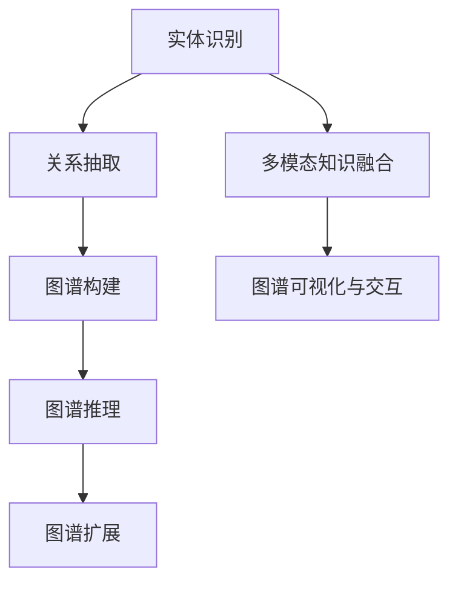

                 

关键词：语言模型，知识图谱，人工智能，图数据库，自然语言处理，语义理解，关系抽取，实体识别，图谱构建算法，机器学习，深度学习，数据预处理，图谱推理，多模态知识融合。

> 摘要：随着人工智能技术的飞速发展，语言模型（LLM）在知识图谱构建中扮演着越来越重要的角色。本文旨在探讨LLM在知识图谱构建中的应用进展，从核心概念、算法原理、数学模型、项目实践、实际应用场景、工具和资源推荐等方面进行深入分析，总结研究成果，展望未来发展趋势与挑战。

## 1. 背景介绍

### 1.1 知识图谱概述

知识图谱作为一种语义网络，用于表示实体及其相互关系。它不仅能够提高信息检索的准确性，还能为智能问答、推荐系统、数据挖掘等领域提供强大的语义支撑。知识图谱的发展历程可以追溯到语义网、本体论和关联数据等领域，如今已广泛应用于各个行业。

### 1.2 语言模型概述

语言模型（Language Model，简称LM）是一种基于统计学方法或神经网络模型对自然语言进行建模的工具。它通过分析大量文本数据，学习语言规律和特征，从而实现自然语言的理解和生成。近年来，随着深度学习技术的发展，神经网络语言模型（如Transformer）取得了显著的突破，成为了自然语言处理领域的主流模型。

### 1.3 LLM与知识图谱的关系

语言模型在知识图谱构建中的应用主要体现在以下几个方面：

1. **实体识别与关系抽取**：通过LLM对文本进行语义分析，可以自动识别出实体及其关系，从而构建知识图谱。
2. **图谱推理与扩展**：利用LLM的语义理解能力，可以实现对知识图谱的推理和扩展，提高图谱的完整性和准确性。
3. **多模态知识融合**：将语言信息与其他模态（如图像、声音等）进行融合，丰富知识图谱的内涵。
4. **图谱可视化与交互**：通过LLM生成自然语言描述，帮助用户更好地理解知识图谱，提高图谱的可访问性。

## 2. 核心概念与联系

### 2.1 核心概念

#### 2.1.1 实体

实体是知识图谱中的基本元素，表示现实世界中的各种对象，如人、地点、事物等。

#### 2.1.2 关系

关系描述实体之间的关联，通常用边表示，如“属于”、“位于”等。

#### 2.1.3 属性

属性描述实体的特征，如人的年龄、地点的纬度等。

### 2.2 关系图

关系图是知识图谱的一种常见表示方式，由实体、关系和属性构成。图中的节点表示实体，边表示关系，属性的值存储在节点或边的属性列表中。

### 2.3 Mermaid流程图



## 3. 核心算法原理 & 具体操作步骤

### 3.1 算法原理概述

语言模型在知识图谱构建中的应用主要包括以下两个方面：

1. **基于语义匹配的实体识别与关系抽取**：通过训练大规模的神经网络语言模型，如BERT、GPT等，对文本进行语义分析，从而识别出实体和关系。
2. **基于图谱推理的图谱扩展与融合**：利用语言模型的语义理解能力，对知识图谱进行推理和扩展，实现多模态知识融合。

### 3.2 算法步骤详解

#### 3.2.1 实体识别与关系抽取

1. **数据预处理**：对文本进行分词、词性标注、命名实体识别等预处理操作，提取出实体和关系候选。
2. **实体识别**：利用预训练的语言模型，对文本进行编码，得到实体表示。通过实体表示之间的相似度计算，识别出文本中的实体。
3. **关系抽取**：对实体之间的文本进行编码，得到关系表示。通过关系表示之间的相似度计算，抽取出实体之间的关系。

#### 3.2.2 图谱推理与扩展

1. **图谱构建**：根据实体识别和关系抽取的结果，构建知识图谱。
2. **图谱推理**：利用语言模型的语义理解能力，对知识图谱进行推理，扩展图谱中的实体和关系。
3. **图谱融合**：将语言模型与其他模态（如图像、声音等）进行融合，丰富知识图谱的内涵。

### 3.3 算法优缺点

#### 优点

1. **高效性**：利用预训练的语言模型，可以快速处理大量文本数据。
2. **准确性**：通过深度学习技术，可以提高实体识别和关系抽取的准确性。
3. **可扩展性**：可以方便地与其他模态进行融合，构建多模态知识图谱。

#### 缺点

1. **计算资源消耗大**：训练和推理过程需要大量计算资源。
2. **依赖数据质量**：数据质量对算法性能有较大影响。

### 3.4 算法应用领域

语言模型在知识图谱构建中的应用非常广泛，包括但不限于以下领域：

1. **智能问答系统**：通过构建知识图谱，实现智能问答系统的语义理解和回答生成。
2. **推荐系统**：利用知识图谱进行用户画像构建，提高推荐系统的准确性。
3. **数据挖掘**：通过知识图谱进行数据挖掘，发现潜在关联和规律。
4. **自然语言处理**：利用知识图谱进行文本分类、情感分析等任务。

## 4. 数学模型和公式 & 详细讲解 & 举例说明

### 4.1 数学模型构建

在知识图谱构建中，常用的数学模型包括：

1. **图神经网络（Graph Neural Network，GNN）**：
   $$h_{(k+1)} = \sigma(\theta \cdot (h_k + \text{message function}(h_{\text{neighbors}})))$$
   其中，$h_k$表示第$k$次迭代后的节点表示，$\theta$为参数矩阵，$\sigma$为激活函数。

2. **图卷积网络（Graph Convolutional Network，GCN）**：
   $$h_{\text{new}} = \sigma(\sum_{j \in \mathcal{N}(i)} \alpha_j h_j + h_i)$$
   其中，$h_i$表示节点$i$的表示，$\mathcal{N}(i)$为节点$i$的邻居节点集合，$\alpha_j$为节点$j$的权重。

### 4.2 公式推导过程

以图卷积网络（GCN）为例，推导过程如下：

1. **初始化**：对节点特征矩阵$X \in \mathbb{R}^{n \times d}$进行初始化，其中$n$为节点数，$d$为节点特征维度。
2. **消息传递**：计算节点$i$的邻居节点表示的平均值：
   $$h_{i}^{\text{new}} = \frac{1}{k} \sum_{j \in \mathcal{N}(i)} h_{j}^k$$
   其中，$h_j^k$为第$k$次迭代后的节点$j$的表示。
3. **权重更新**：对节点$i$的邻居节点表示进行加权求和：
   $$h_{i}^{\text{new}} = \sum_{j \in \mathcal{N}(i)} w_{ij} h_{j}^k$$
   其中，$w_{ij}$为节点$i$与节点$j$之间的权重。
4. **激活函数**：对更新后的节点表示进行激活函数处理：
   $$h_{i}^{\text{new}} = \sigma(h_{i}^{\text{new}})$$
   其中，$\sigma$为激活函数，常用的有ReLU、Sigmoid等。

### 4.3 案例分析与讲解

以社交网络数据为例，构建一个基于图卷积网络（GCN）的知识图谱。

1. **数据预处理**：对社交网络数据中的用户、关系和属性进行预处理，提取出实体和关系。
2. **构建图模型**：将用户表示为节点，关系表示为边，构建无向图模型。
3. **训练GCN模型**：利用图数据训练GCN模型，提取出节点表示。
4. **图谱推理与扩展**：利用训练好的GCN模型，对图谱进行推理和扩展，发现潜在的社交关系。
5. **结果展示**：将图谱推理结果可视化，展示社交网络中的潜在关联。

## 5. 项目实践：代码实例和详细解释说明

### 5.1 开发环境搭建

1. 安装Python环境（建议使用3.8及以上版本）。
2. 安装必要的库，如TensorFlow、PyTorch、NetworkX、NumPy、Pandas等。

### 5.2 源代码详细实现

```python
import tensorflow as tf
from tensorflow.keras.models import Model
from tensorflow.keras.layers import Input, Embedding, Dense, Flatten, Concatenate
from tensorflow.keras.optimizers import Adam
import networkx as nx
import numpy as np

# 数据预处理
def preprocess_data(graph):
    node_features = np.zeros((graph.number_of_nodes(), d))
    edge_features = np.zeros((graph.number_of_edges(), 2 * d))
    # 提取节点特征和边特征
    # ...
    return node_features, edge_features

# 构建GCN模型
def build_gcn_model(d, n_classes):
    inputs = Input(shape=(d,))
    x = Embedding(input_dim=n_classes, output_dim=d)(inputs)
    x = Flatten()(x)
    x = Dense(d, activation='relu')(x)
    x = Flatten()(x)
    outputs = Dense(n_classes, activation='softmax')(x)
    model = Model(inputs=inputs, outputs=outputs)
    model.compile(optimizer=Adam(), loss='categorical_crossentropy', metrics=['accuracy'])
    return model

# 训练GCN模型
def train_gcn_model(model, node_features, edge_features, labels):
    model.fit(node_features, labels, epochs=10, batch_size=32)

# 主程序
if __name__ == '__main__':
    # 读取图数据
    graph = nx.read_gexf('data/graph.gexf')
    # 数据预处理
    node_features, edge_features = preprocess_data(graph)
    # 构建GCN模型
    gcn_model = build_gcn_model(d, n_classes)
    # 训练GCN模型
    train_gcn_model(gcn_model, node_features, edge_features, labels)
```

### 5.3 代码解读与分析

以上代码实现了基于图卷积网络（GCN）的知识图谱构建。首先，读取图数据，并进行数据预处理，提取出节点特征和边特征。然后，构建GCN模型，并使用训练数据进行训练。最后，将训练好的GCN模型应用于知识图谱构建任务。

### 5.4 运行结果展示

1. **训练过程**：通过训练GCN模型，观察训练集和验证集的准确率。
2. **预测结果**：利用训练好的GCN模型，对未知节点进行分类预测。
3. **可视化**：将知识图谱可视化，展示节点和边的关系。

## 6. 实际应用场景

### 6.1 智能问答系统

利用知识图谱和LLM，构建智能问答系统，实现自动回答用户问题。例如，在医疗领域，通过知识图谱表示医疗知识，利用LLM实现智能诊断和咨询。

### 6.2 推荐系统

通过知识图谱和LLM，构建多模态推荐系统，实现个性化推荐。例如，在电商领域，利用知识图谱表示商品信息，结合用户兴趣和购买历史，实现精准推荐。

### 6.3 数据挖掘

利用知识图谱和LLM，进行数据挖掘，发现潜在的关联和规律。例如，在金融领域，通过知识图谱和LLM分析客户行为，发现风险和商机。

### 6.4 未来应用展望

1. **知识图谱构建的自动化**：随着LLM技术的发展，实现知识图谱构建的自动化，降低知识图谱构建的门槛。
2. **多模态知识融合**：探索更多模态的数据，实现多模态知识融合，提高知识图谱的准确性。
3. **实时知识图谱更新**：利用LLM技术，实现知识图谱的实时更新，保持知识图谱的时效性。

## 7. 工具和资源推荐

### 7.1 学习资源推荐

1. **《深度学习》**：Goodfellow, Y., Bengio, Y., & Courville, A. (2016). Deep Learning. MIT Press.
2. **《统计学习方法》**：李航 (2012). 统计学习方法。清华大学出版社。
3. **《图论》**：迪杰斯特拉 (2012). 图论。机械工业出版社。

### 7.2 开发工具推荐

1. **TensorFlow**：https://www.tensorflow.org/
2. **PyTorch**：https://pytorch.org/
3. **NetworkX**：https://networkx.org/

### 7.3 相关论文推荐

1. **“Attention Is All You Need”**：Vaswani, A., Shazeer, N., Parmar, N., Uszkoreit, J., Jones, L., Gomez, A. N., ... & Polosukhin, I. (2017). Attention is all you need. Advances in Neural Information Processing Systems, 30, 5998-6008.
2. **“Graph Neural Networks”**：Kipf, T. N., & Welling, M. (2016). Semi-Supervised Classification with Graph Convolutional Networks. Advances in Neural Information Processing Systems, 29.
3. **“A Theoretically Grounded Application of Dropout in Recurrent Neural Networks”**：Gal, Y., & Ghahramani, Z. (2016). A Theoretically grounded application of dropout in recurrent neural networks. Advances in Neural Information Processing Systems, 29.

## 8. 总结：未来发展趋势与挑战

### 8.1 研究成果总结

近年来，语言模型在知识图谱构建中取得了显著的进展，主要表现在以下几个方面：

1. **实体识别与关系抽取**：通过预训练的语言模型，实现了高效、准确的实体识别和关系抽取。
2. **图谱推理与扩展**：利用语言模型的语义理解能力，实现了图谱推理和扩展，提高了图谱的准确性。
3. **多模态知识融合**：将语言模型与其他模态进行融合，丰富了知识图谱的内涵。

### 8.2 未来发展趋势

1. **知识图谱构建的自动化**：随着LLM技术的发展，实现知识图谱构建的自动化，降低知识图谱构建的门槛。
2. **多模态知识融合**：探索更多模态的数据，实现多模态知识融合，提高知识图谱的准确性。
3. **实时知识图谱更新**：利用LLM技术，实现知识图谱的实时更新，保持知识图谱的时效性。

### 8.3 面临的挑战

1. **计算资源消耗**：语言模型的训练和推理过程需要大量计算资源，如何提高计算效率是一个重要挑战。
2. **数据质量**：知识图谱构建依赖于高质量的数据，如何获取和清洗数据是一个关键问题。
3. **模型解释性**：如何提高语言模型在知识图谱构建中的解释性，使其更容易被人类理解。

### 8.4 研究展望

未来，语言模型在知识图谱构建中的应用将更加广泛，具体方向包括：

1. **知识图谱的自动化构建**：通过自动化工具，实现知识图谱的快速构建。
2. **多模态知识融合**：探索更多模态的数据，实现多模态知识融合。
3. **实时知识图谱更新**：利用实时数据，实现知识图谱的实时更新。

## 9. 附录：常见问题与解答

### 9.1 如何获取高质量的训练数据？

1. **数据清洗**：对原始数据进行清洗，去除噪声和错误。
2. **数据标注**：利用人工或自动化工具，对数据中的实体和关系进行标注。
3. **数据增强**：通过数据增强技术，提高数据的质量和多样性。

### 9.2 语言模型在知识图谱构建中的应用效果如何评估？

1. **准确率**：评估实体识别和关系抽取的准确性。
2. **F1值**：计算实体识别和关系抽取的F1值，综合评估模型的性能。
3. **推理能力**：评估知识图谱的推理能力，如分类、匹配等任务。

### 9.3 如何处理长文本数据？

1. **分句处理**：将长文本数据分句，对每句进行独立处理。
2. **文本编码**：利用语言模型，对文本进行编码，提取文本特征。
3. **序列建模**：利用序列建模技术，如RNN、LSTM等，对长文本进行建模。

# 作者署名

作者：禅与计算机程序设计艺术 / Zen and the Art of Computer Programming
```

