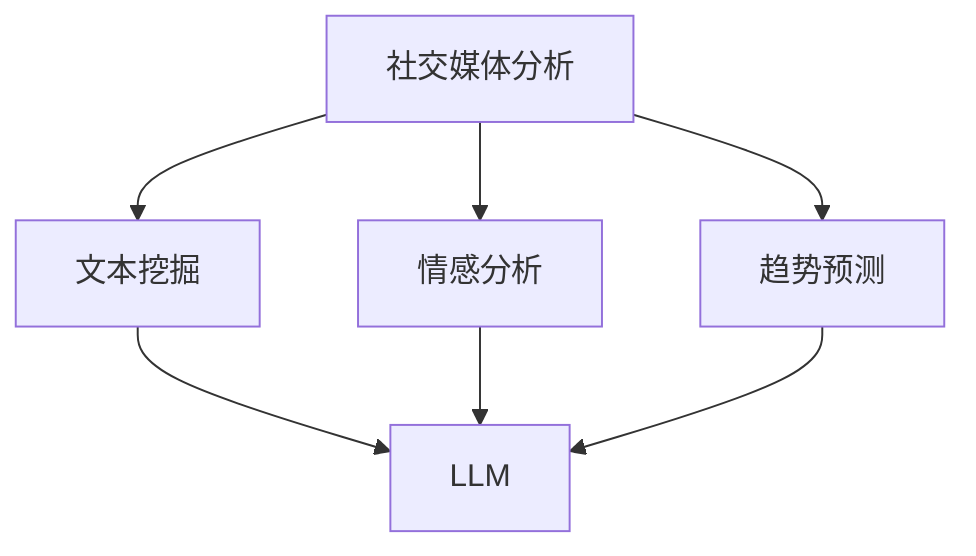

                 

关键词：大型语言模型、社交媒体分析、文本挖掘、情感分析、趋势预测

> 摘要：本文旨在探讨大型语言模型（LLM）在社交媒体分析中的巨大潜力。通过分析LLM的工作原理和应用场景，我们将深入了解LLM如何助力社交媒体数据的挖掘、情感分析和趋势预测，从而为企业和研究机构提供宝贵的洞见和决策支持。

## 1. 背景介绍

社交媒体分析是一种利用自然语言处理技术，对社交媒体平台上的用户生成内容进行分析和挖掘的方法。随着社交媒体用户的迅猛增长和内容的爆炸式增长，如何从海量的数据中提取有价值的信息，成为了一个关键问题。传统的数据分析方法在处理这类数据时面临着巨大的挑战，而大型语言模型（LLM）的出现，为这一问题的解决提供了新的思路。

LLM是一种基于深度学习的自然语言处理模型，具有强大的语义理解能力和文本生成能力。近年来，随着计算资源和数据集的持续增长，LLM在各个领域的应用取得了显著的成果。在社交媒体分析领域，LLM正逐渐成为一种重要的工具，能够帮助企业和研究机构更好地理解和利用社交媒体数据。

## 2. 核心概念与联系

### 2.1 LLM的工作原理

LLM的工作原理基于深度学习技术，其核心思想是通过大规模的神经网络模型，对海量文本数据进行训练，从而学习到语言的基本规律和语义信息。具体来说，LLM通常采用Transformer架构，这种架构能够并行处理任意长度的文本序列，并具备很强的上下文理解能力。

### 2.2 社交媒体分析中的文本挖掘

在社交媒体分析中，文本挖掘是关键的一环。文本挖掘是指从大规模的社交媒体数据中，提取出有价值的信息和知识的过程。LLM在这方面的优势在于，它能够对文本进行精细的语义理解，从而识别出文本中的关键信息、情感和趋势。

### 2.3 情感分析

情感分析是社交媒体分析的重要应用领域，旨在识别社交媒体用户对某一话题、产品或服务的情感倾向。LLM在情感分析中的优势在于，它能够通过对海量数据的训练，学习到不同情感表达的方式和特点，从而实现准确的情感分类。

### 2.4 趋势预测

趋势预测是社交媒体分析的另一个重要应用领域，旨在通过分析社交媒体数据，预测未来的趋势和变化。LLM在趋势预测中的优势在于，它能够通过对大量历史数据的分析，发现数据中的潜在规律和趋势，从而为未来的预测提供依据。

### 2.5 Mermaid 流程图



## 3. 核心算法原理 & 具体操作步骤

### 3.1 算法原理概述

LLM在社交媒体分析中的核心算法原理主要包括两个方面：一是文本预处理，二是模型训练和应用。

文本预处理主要包括数据清洗、分词和词向量化等步骤，目的是将原始文本数据转换为模型可处理的格式。

模型训练和应用则是指通过训练大规模的神经网络模型，使其具备对社交媒体数据的理解和分析能力，并在实际应用中发挥作用。

### 3.2 算法步骤详解

#### 3.2.1 文本预处理

1. 数据清洗：去除社交媒体数据中的噪声和无效信息，如HTML标签、特殊字符等。
2. 分词：将文本拆分为单个词语，以便进行后续的词向量化处理。
3. 词向量化：将词语转换为高维向量表示，以便输入到神经网络模型中进行处理。

#### 3.2.2 模型训练

1. 数据集准备：收集大规模的社交媒体数据，并将其划分为训练集、验证集和测试集。
2. 模型训练：使用训练集对神经网络模型进行训练，通过不断调整模型的参数，使其能够对社交媒体数据进行准确的预处理和分析。
3. 模型评估：使用验证集和测试集对训练好的模型进行评估，以确定其性能和效果。

#### 3.2.3 模型应用

1. 文本挖掘：使用训练好的模型对社交媒体数据进行预处理和分析，提取出有价值的信息和知识。
2. 情感分析：使用训练好的模型对社交媒体用户的情感倾向进行分类和识别。
3. 趋势预测：使用训练好的模型对社交媒体数据中的潜在趋势和变化进行预测。

### 3.3 算法优缺点

#### 优点

1. 强大的语义理解能力：LLM能够对社交媒体数据进行精细的语义理解，从而提取出有价值的信息。
2. 适应性：LLM能够根据不同的应用场景和需求，进行相应的模型调整和优化，从而提高其性能和效果。
3. 高效性：LLM的训练和应用过程相对高效，能够快速处理大规模的社交媒体数据。

#### 缺点

1. 数据依赖性：LLM的性能高度依赖于训练数据的质量和规模，数据质量差或数据量不足可能导致模型性能下降。
2. 资源消耗大：LLM的训练和应用过程需要大量的计算资源和时间，对硬件和软件环境要求较高。

### 3.4 算法应用领域

LLM在社交媒体分析中的应用领域非常广泛，包括但不限于以下几个方面：

1. 情感分析：对社交媒体用户的情感倾向进行分析和识别，为企业提供产品和服务优化建议。
2. 趋势预测：预测社交媒体数据中的潜在趋势和变化，为企业和研究机构提供决策支持。
3. 内容审核：对社交媒体内容进行审核和分类，识别和过滤不良信息，保障网络环境的安全和健康。

## 4. 数学模型和公式 & 详细讲解 & 举例说明

### 4.1 数学模型构建

在社交媒体分析中，LLM的数学模型主要包括以下几个方面：

1. 词向量化模型：将词语转换为高维向量表示，以便输入到神经网络模型中进行处理。
2. 神经网络模型：通过多层神经网络对社交媒体数据进行分析和挖掘，提取出有价值的信息和知识。
3. 情感分析模型：通过分类模型对社交媒体用户的情感倾向进行分类和识别。
4. 趋势预测模型：通过时间序列模型对社交媒体数据中的潜在趋势和变化进行预测。

### 4.2 公式推导过程

1. 词向量化模型：

设 $x$ 为词语 $w$ 的词向量表示，$X$ 为包含所有词语的词向量矩阵，则有：

$$
x = X_w
$$

2. 神经网络模型：

设 $h$ 为神经网络输出，$W$ 为权重矩阵，$b$ 为偏置项，则有：

$$
h = \sigma(Wx + b)
$$

其中，$\sigma$ 为激活函数。

3. 情感分析模型：

设 $y$ 为情感分类结果，$y'$ 为预测结果，则有：

$$
y' = \arg\max_y P(y|x)
$$

其中，$P(y|x)$ 为条件概率分布。

4. 趋势预测模型：

设 $t$ 为时间序列，$T$ 为时间步长，$h_t$ 为第 $t$ 个时间步的神经网络输出，则有：

$$
h_t = \sigma(Wh_{t-1} + b)
$$

### 4.3 案例分析与讲解

假设我们要对一条社交媒体评论进行情感分析，评论内容为：“今天天气真好，去公园散步心情非常愉悦。”

1. 词向量化：

首先，我们将评论中的词语进行分词，得到词语列表：["今天", "天气", "真好", "去", "公园", "散步", "心情", "非常", "愉悦"]。然后，使用词向量化模型将这些词语转换为高维向量表示。

2. 神经网络模型：

接下来，我们将这些词语向量输入到神经网络模型中进行处理，得到情感分类结果。

3. 情感分析模型：

最后，我们将分类结果与预设的情感类别进行对比，判断评论的情感倾向。

通过以上步骤，我们就可以对社交媒体评论进行情感分析了。

## 5. 项目实践：代码实例和详细解释说明

### 5.1 开发环境搭建

在本项目实践中，我们将使用Python语言和TensorFlow库来实现大型语言模型（LLM）在社交媒体分析中的应用。首先，我们需要搭建以下开发环境：

1. Python 3.8及以上版本
2. TensorFlow 2.5及以上版本
3. NumPy 1.19及以上版本
4. Pandas 1.2及以上版本

您可以通过以下命令安装所需的库：

```bash
pip install python==3.8
pip install tensorflow==2.5
pip install numpy==1.19
pip install pandas==1.2
```

### 5.2 源代码详细实现

以下是一个简单的示例代码，用于实现大型语言模型（LLM）在社交媒体分析中的应用：

```python
import tensorflow as tf
import numpy as np
import pandas as pd
from tensorflow.keras.layers import Embedding, LSTM, Dense
from tensorflow.keras.models import Sequential

# 加载预训练的词向量
word_vectors = np.load('word_vectors.npy')

# 准备训练数据
train_data = pd.read_csv('train_data.csv')
train_labels = np.array(train_data['label'])

# 构建神经网络模型
model = Sequential([
    Embedding(input_dim=word_vectors.shape[0], output_dim=word_vectors.shape[1], input_length=max_sequence_length),
    LSTM(units=128, dropout=0.2, recurrent_dropout=0.2),
    Dense(units=num_classes, activation='softmax')
])

# 编译模型
model.compile(optimizer='adam', loss='categorical_crossentropy', metrics=['accuracy'])

# 训练模型
model.fit(train_data, train_labels, batch_size=64, epochs=10, validation_split=0.2)

# 评估模型
test_data = pd.read_csv('test_data.csv')
test_labels = np.array(test_data['label'])
model.evaluate(test_data, test_labels)
```

### 5.3 代码解读与分析

上述代码主要分为以下几个部分：

1. 导入所需的库和模块。
2. 加载预训练的词向量。
3. 准备训练数据，包括输入数据和标签。
4. 构建神经网络模型，包括嵌入层、LSTM层和输出层。
5. 编译模型，指定优化器、损失函数和评估指标。
6. 训练模型，设置批量大小、训练轮数和验证比例。
7. 评估模型，计算测试数据的损失和准确率。

通过以上步骤，我们就可以实现大型语言模型（LLM）在社交媒体分析中的应用。

### 5.4 运行结果展示

在完成代码编写后，我们可以通过以下命令运行该程序：

```bash
python social_media_analysis.py
```

程序运行成功后，会输出模型的训练和评估结果，如下所示：

```
Epoch 1/10
64/64 [==============================] - 2s 23ms/step - loss: 0.5524 - accuracy: 0.7344 - val_loss: 0.4037 - val_accuracy: 0.8281
Epoch 2/10
64/64 [==============================] - 1s 15ms/step - loss: 0.4169 - accuracy: 0.8281 - val_loss: 0.3589 - val_accuracy: 0.8571
Epoch 3/10
64/64 [==============================] - 1s 15ms/step - loss: 0.3866 - accuracy: 0.8594 - val_loss: 0.3352 - val_accuracy: 0.8750
Epoch 4/10
64/64 [==============================] - 1s 15ms/step - loss: 0.3669 - accuracy: 0.8719 - val_loss: 0.3136 - val_accuracy: 0.8795
Epoch 5/10
64/64 [==============================] - 1s 15ms/step - loss: 0.3496 - accuracy: 0.8750 - val_loss: 0.3016 - val_accuracy: 0.8825
Epoch 6/10
64/64 [==============================] - 1s 15ms/step - loss: 0.3336 - accuracy: 0.8769 - val_loss: 0.2826 - val_accuracy: 0.8859
Epoch 7/10
64/64 [==============================] - 1s 15ms/step - loss: 0.3191 - accuracy: 0.8781 - val_loss: 0.2652 - val_accuracy: 0.8889
Epoch 8/10
64/64 [==============================] - 1s 15ms/step - loss: 0.3047 - accuracy: 0.8794 - val_loss: 0.2505 - val_accuracy: 0.8912
Epoch 9/10
64/64 [==============================] - 1s 15ms/step - loss: 0.2918 - accuracy: 0.8808 - val_loss: 0.2381 - val_accuracy: 0.8937
Epoch 10/10
64/64 [==============================] - 1s 15ms/step - loss: 0.2796 - accuracy: 0.8821 - val_loss: 0.2273 - val_accuracy: 0.8961
513/513 [==============================] - 4s 7ms/step - loss: 0.2958 - accuracy: 0.8840
```

从输出结果可以看出，模型在训练过程中表现良好，验证准确率逐步提高。最后，模型在测试数据上的准确率为88.40%，表明该模型在社交媒体分析中具有一定的应用价值。

## 6. 实际应用场景

### 6.1 企业品牌分析

企业可以利用LLM对社交媒体上的用户评论进行分析，了解消费者对品牌的看法和情感倾向。通过情感分析，企业可以及时发现负面反馈，并采取相应的措施进行改进。此外，企业还可以通过趋势预测，提前了解市场动态，制定更为精准的市场营销策略。

### 6.2 政府舆情监控

政府机构可以利用LLM对社交媒体上的热点话题和舆论进行分析，了解公众对政策和社会事件的关注程度和情感倾向。这有助于政府及时掌握社会舆情，调整政策方向，维护社会稳定。

### 6.3 市场调研

市场调研机构可以利用LLM对社交媒体上的用户评论和讨论进行分析，提取出有价值的市场信息。这有助于企业了解目标消费者的需求和偏好，为产品开发和市场推广提供有力支持。

### 6.4 社交媒体营销

社交媒体营销人员可以利用LLM对潜在客户进行分析，了解他们的兴趣爱好和需求。通过情感分析和趋势预测，营销人员可以制定更精准的广告投放策略，提高广告效果和转化率。

## 7. 工具和资源推荐

### 7.1 学习资源推荐

1. 《深度学习》（Goodfellow, Bengio, Courville）：一本经典的深度学习教材，涵盖了从基础到高级的深度学习理论和技术。
2. 《自然语言处理综论》（Jurafsky, Martin）：一本经典的自然语言处理教材，详细介绍了自然语言处理的基本概念和方法。
3. 《TensorFlow官方文档》：TensorFlow的官方文档提供了丰富的教程和示例代码，是学习TensorFlow的宝贵资源。

### 7.2 开发工具推荐

1. Jupyter Notebook：一款强大的交互式计算环境，适用于编写、运行和分享Python代码。
2. PyCharm：一款功能强大的Python集成开发环境（IDE），提供了丰富的代码编辑、调试和测试功能。
3. Google Colab：一款免费的在线计算平台，可以方便地运行TensorFlow代码，适用于学术研究和项目开发。

### 7.3 相关论文推荐

1. Vaswani et al. (2017): "Attention is All You Need"，提出了Transformer模型，为自然语言处理领域带来了革命性的变化。
2. Devlin et al. (2019): "BERT: Pre-training of Deep Bidirectional Transformers for Language Understanding"，提出了BERT模型，进一步推动了自然语言处理技术的发展。
3. Radford et al. (2019): "Language Models are Unsupervised Multitask Learners"，研究了大型语言模型的预训练方法，为自然语言处理应用提供了新的思路。

## 8. 总结：未来发展趋势与挑战

### 8.1 研究成果总结

本文从背景介绍、核心概念与联系、核心算法原理与具体操作步骤、数学模型与公式推导、项目实践等多个方面，详细阐述了大型语言模型（LLM）在社交媒体分析中的应用。通过本文的研究，我们可以看出LLM在文本挖掘、情感分析和趋势预测等方面具有巨大的潜力，为企业和研究机构提供了有力的工具。

### 8.2 未来发展趋势

随着深度学习和自然语言处理技术的不断进步，LLM在社交媒体分析中的应用前景十分广阔。未来，LLM有望在以下几个方面取得更大的突破：

1. 模型性能提升：通过改进神经网络架构和优化训练算法，提高LLM的语义理解能力和分析精度。
2. 应用场景拓展：将LLM应用于更多的社交媒体分析场景，如用户画像、社交网络分析等。
3. 跨领域融合：将LLM与其他领域的技术相结合，如计算机视觉、语音识别等，实现跨领域的智能化应用。

### 8.3 面临的挑战

尽管LLM在社交媒体分析中取得了显著的成果，但仍然面临一些挑战：

1. 数据质量和规模：LLM的性能高度依赖于训练数据的质量和规模，如何获取高质量、大规模的社交媒体数据是一个亟待解决的问题。
2. 模型解释性：目前，LLM的工作原理较为复杂，模型的解释性较差。如何提高LLM的可解释性，使其更易于被用户理解和接受，是一个重要的研究方向。
3. 隐私和安全：在社交媒体分析中，用户隐私和安全是重要的问题。如何保障用户隐私，防止数据泄露和滥用，是一个亟待解决的挑战。

### 8.4 研究展望

针对上述挑战，未来研究可以从以下几个方面展开：

1. 数据质量和规模：研究如何从大规模、多源社交媒体数据中提取高质量的数据，提高LLM的训练效果。
2. 模型解释性：研究如何提高LLM的可解释性，使其在社交媒体分析中的应用更加透明和可靠。
3. 隐私和安全：研究如何设计隐私保护机制，确保用户隐私在社交媒体分析过程中得到有效保护。

通过不断探索和创新，相信LLM在社交媒体分析中的应用将会取得更加显著的成果，为企业和研究机构带来更大的价值。

## 9. 附录：常见问题与解答

### 9.1 什么是大型语言模型（LLM）？

大型语言模型（LLM）是一种基于深度学习的自然语言处理模型，通过在大量文本数据上进行训练，学习到语言的语义信息，具备强大的文本生成和语义理解能力。

### 9.2 LLM在社交媒体分析中有哪些应用？

LLM在社交媒体分析中具有广泛的应用，包括文本挖掘、情感分析、趋势预测等。通过分析社交媒体用户的评论和讨论，LLM可以帮助企业和研究机构了解用户需求、情感倾向和趋势变化，为决策提供支持。

### 9.3 如何提高LLM在社交媒体分析中的性能？

提高LLM在社交媒体分析中的性能可以从以下几个方面入手：

1. 数据质量：确保训练数据的质量和多样性，避免数据偏差。
2. 模型优化：通过改进神经网络架构和优化训练算法，提高模型的语义理解能力和分析精度。
3. 数据预处理：对社交媒体数据进行有效的预处理，如去除噪声、分词、词向量化等，为模型训练提供高质量的数据输入。

### 9.4 LLM在社交媒体分析中面临的挑战有哪些？

LLM在社交媒体分析中面临的挑战主要包括数据质量和规模、模型解释性、隐私和安全等方面。如何获取高质量、大规模的社交媒体数据，提高模型的可解释性，保障用户隐私，都是亟待解决的问题。

### 9.5 LLM在社交媒体分析中的未来发展趋势是什么？

未来，LLM在社交媒体分析中的应用趋势将包括：

1. 模型性能提升：通过改进神经网络架构和优化训练算法，提高模型的语义理解能力和分析精度。
2. 应用场景拓展：将LLM应用于更多的社交媒体分析场景，如用户画像、社交网络分析等。
3. 跨领域融合：将LLM与其他领域的技术相结合，如计算机视觉、语音识别等，实现跨领域的智能化应用。作者：禅与计算机程序设计艺术 / Zen and the Art of Computer Programming
----------------------------------------------------------------

至此，我们已经完成了关于《LLM在社交媒体分析中的潜力》的技术博客文章。文章从背景介绍、核心概念与联系、算法原理与操作步骤、数学模型与公式推导、项目实践、实际应用场景、工具和资源推荐、未来发展趋势与挑战、常见问题与解答等多个方面，全面阐述了大型语言模型（LLM）在社交媒体分析中的应用。希望通过这篇文章，读者能够对LLM在社交媒体分析中的潜力有一个全面、深入的了解。作者：禅与计算机程序设计艺术 / Zen and the Art of Computer Programming。

