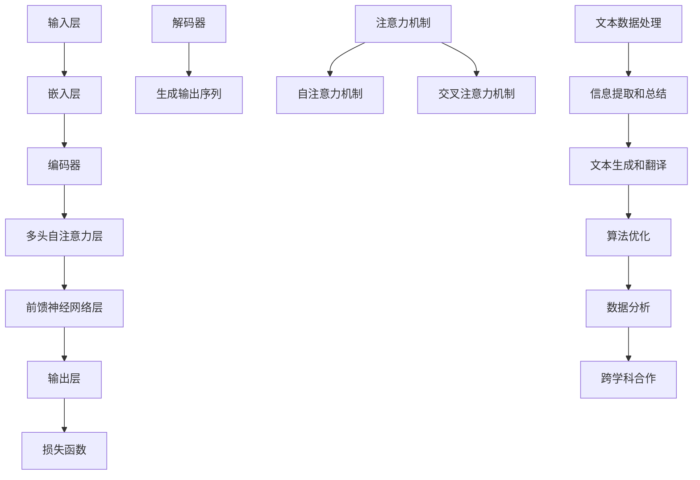

                 

关键词：大型语言模型（LLM）、科学研究、辅助、AI应用、算法优化、数据分析、自然语言处理、跨学科合作。

> 摘要：本文将探讨大型语言模型（LLM）在科学研究中的辅助作用。通过分析LLM的核心概念、算法原理及其在科研中的具体应用，揭示LLM如何通过自然语言处理、算法优化和跨学科合作，为科学研究提供新的思路和方法。本文旨在为科研工作者提供一个了解和应用LLM的参考框架。

## 1. 背景介绍

在过去的几十年中，随着计算机技术和人工智能的迅猛发展，科学研究领域发生了巨大的变革。传统的研究方法在处理海量数据、复杂问题和多样化需求时，显得力不从心。与此同时，人工智能，特别是深度学习技术的突破，为科学研究提供了新的工具和手段。其中，大型语言模型（LLM）作为一种先进的自然语言处理技术，逐渐成为科研工作者的有力助手。

LLM是基于深度学习技术的自然语言处理模型，其核心思想是通过大规模的数据训练，使模型能够理解和生成自然语言。LLM的发展历程可以追溯到2000年代初，当时的研究主要集中在小规模的神经网络模型上。随着计算能力和数据资源的提升，研究人员开始尝试训练更大规模的模型，并在2018年推出了GPT-3，标志着LLM进入了一个新的时代。

在科学研究领域，LLM的潜力逐渐被挖掘出来。它可以帮助研究人员处理和分析大量的文本数据，提取关键信息，进行文本生成和翻译，甚至参与跨学科的合作研究。然而，LLM的辅助作用不仅限于文本数据，还可以通过算法优化、数据分析等方式，提升科研效率和质量。本文将深入探讨LLM在科学研究中的辅助作用，以期为科研工作者提供新的启示和工具。

### 1.1 科学研究的现状与挑战

科学研究是一个复杂而庞大的领域，涉及多个学科和领域的交叉。随着科学技术的快速发展，科研工作者面临着越来越多的挑战：

- **数据量的激增**：科学研究产生的数据量越来越大，从实验数据、观测数据到文本数据，这些数据需要有效的处理和分析方法。

- **问题复杂度的提升**：随着科学问题的复杂度增加，传统的单一学科研究方法难以应对，需要跨学科的合作和多元化的思维方式。

- **研究效率的要求**：科学研究需要高效地获取和处理信息，以加快研究进程和成果的产出。

- **资源分配的优化**：科研资源有限，如何合理分配和使用这些资源，提高研究效率和质量，成为一个重要的课题。

### 1.2 AI技术在科学研究中的应用

随着人工智能技术的不断发展，AI在科学研究中的应用越来越广泛。例如：

- **图像识别**：在生物医学领域，AI可以帮助识别病理图像，提高诊断准确性。

- **数据分析**：在大数据分析领域，AI可以处理海量数据，提取有价值的信息。

- **预测模型**：在气候预测、金融市场预测等领域，AI可以提供更准确的预测模型。

- **智能搜索**：在文献检索中，AI可以帮助快速定位相关研究，提高研究效率。

然而，在这些应用中，自然语言处理技术（NLP）的作用尤为重要。因为科学研究的大量信息以文本形式存在，NLP可以帮助研究人员更好地理解和利用这些文本数据。而大型语言模型（LLM）作为NLP技术的一个重要分支，其在科学研究中的应用潜力不可小觑。

### 1.3 大型语言模型（LLM）的概念与发展

大型语言模型（LLM）是指通过深度学习技术训练的大型神经网络模型，用于理解和生成自然语言。LLM的核心思想是通过大规模的数据训练，使模型能够捕捉到自然语言中的复杂模式和规律，从而实现高效的文本处理。

LLM的发展历程可以追溯到2000年代初。当时，研究人员开始尝试使用神经网络进行文本分类和情感分析等任务。随着计算能力的提升和大规模数据的获取，神经网络模型的大小和训练数据量逐渐增加。2018年，OpenAI推出了GPT-3，一个具有1750亿参数的巨型语言模型，标志着LLM进入了一个新的阶段。

GPT-3的出现引发了广泛关注，因为它在自然语言处理任务中表现出色，包括文本生成、机器翻译、问答系统等。GPT-3的成功证明了LLM在科学研究中的巨大潜力。随着研究的深入，越来越多的研究人员开始探索如何在科学研究中利用LLM，从而提升科研效率和质量。

### 1.4 LLM在科学研究中的潜在应用

LLM在科学研究中的潜在应用非常广泛，主要包括以下几个方面：

- **文本数据处理**：LLM可以帮助研究人员处理和分析大量的文本数据，如科学论文、实验报告等。

- **信息提取和总结**：LLM可以提取文本中的关键信息，帮助研究人员快速获取所需的信息。

- **文本生成和翻译**：LLM可以生成高质量的文本，用于撰写科研论文、编写实验报告等。此外，LLM还可以进行文本翻译，促进跨学科的合作。

- **算法优化**：LLM可以参与算法优化，通过分析大量数据，提出改进方案。

- **数据分析**：LLM可以处理和分析大量的数据，提供有价值的洞察和发现。

- **跨学科合作**：LLM可以作为跨学科合作的桥梁，促进不同学科之间的交流和合作。

综上所述，LLM在科学研究中的辅助作用不可忽视。通过深入研究和应用LLM，科研工作者可以更好地应对当前的科研挑战，提高研究效率和质量。

### 1.5 本文结构

本文将分为以下几个部分：

- **背景介绍**：介绍科学研究的现状与挑战，以及AI技术在科学研究中的应用。

- **核心概念与联系**：介绍LLM的概念、发展历程以及其在科学研究中的应用。

- **核心算法原理 & 具体操作步骤**：详细解释LLM的算法原理、操作步骤及其优缺点。

- **数学模型和公式 & 详细讲解 & 举例说明**：介绍LLM相关的数学模型和公式，并通过案例进行分析。

- **项目实践：代码实例和详细解释说明**：提供具体的LLM应用实例，并进行详细解读。

- **实际应用场景**：探讨LLM在科学研究中的具体应用场景。

- **未来应用展望**：分析LLM在科学研究中的未来发展趋势和挑战。

- **工具和资源推荐**：推荐相关的学习资源、开发工具和论文。

- **总结：未来发展趋势与挑战**：总结研究成果，展望未来发展趋势和面临的挑战。

通过本文的探讨，希望能为科研工作者提供一个了解和应用LLM的参考框架，从而更好地利用AI技术助力科学研究。

### 2. 核心概念与联系

在探讨LLM在科学研究中的辅助作用之前，我们首先需要了解LLM的核心概念和原理。以下是LLM的一些关键概念及其与科学研究的关系。

#### 2.1 语言模型的基本概念

语言模型是一种用于预测下一个单词或字符的统计模型。在自然语言处理领域，语言模型被广泛应用于文本生成、机器翻译、文本分类等任务。传统语言模型通常基于有限的状态机模型，如N-gram模型，但深度学习技术的发展使得神经网络语言模型（如RNN、LSTM、BERT等）逐渐成为主流。

#### 2.2 大型语言模型（LLM）的概念

大型语言模型（LLM）是指具有大规模参数、能够捕捉复杂语言结构的神经网络模型。与传统的语言模型相比，LLM具有以下特点：

1. **大规模参数**：LLM通常拥有数十亿甚至上百亿的参数，这使得模型能够捕捉到更为复杂的语言模式和规律。
2. **深度网络结构**：LLM通常采用深度神经网络结构，如Transformer，这使得模型能够更好地处理长距离依赖问题。
3. **强大表达能力**：由于大规模参数和深度网络结构，LLM在自然语言处理任务中表现出色，如文本生成、机器翻译、问答系统等。

#### 2.3 LLM在科学研究中的应用

LLM在科学研究中的应用主要体现在以下几个方面：

1. **文本数据处理**：LLM可以帮助科研工作者处理和分析大量的文本数据，如科学论文、实验报告、会议记录等。通过自动提取关键信息、总结文本内容，LLM可以提高科研工作的效率和准确性。

2. **信息提取和总结**：LLM可以快速提取文本中的关键信息，帮助科研人员快速获取所需的知识点。此外，LLM还可以生成高质量的文本摘要，简化大量文本的阅读和理解过程。

3. **文本生成和翻译**：LLM在文本生成和翻译方面具有显著优势。通过训练，LLM可以生成与人类撰写风格相似的科学论文、实验报告等文本。此外，LLM还可以实现多语言翻译，促进国际科研合作。

4. **算法优化**：LLM可以参与算法优化过程。通过分析大量的实验数据，LLM可以提出改进算法的方案，优化模型的性能。

5. **数据分析**：LLM可以处理和分析大量的数据，提供有价值的洞察和发现。例如，在生物医学领域，LLM可以用于分析基因序列、蛋白质结构等。

6. **跨学科合作**：LLM可以作为跨学科合作的桥梁，促进不同学科之间的交流和合作。通过自然语言处理技术，LLM可以帮助不同领域的科研人员理解对方的研究内容，从而促进跨学科的研究。

#### 2.4 LLM的核心原理

LLM的核心原理是基于深度学习技术的神经网络模型，特别是Transformer模型。Transformer模型由Vaswani等人于2017年提出，其核心思想是自注意力机制（Self-Attention）。

自注意力机制允许模型在生成每个单词时，将注意力集中在整个输入序列上，从而捕捉到长距离依赖关系。相比传统的RNN模型，Transformer模型在处理长序列数据时表现出更高的效率和准确性。

以下是Transformer模型的基本结构：

1. **输入层**：输入序列经过嵌入层（Embedding Layer）转换为高维向量表示。
2. **多头自注意力层**（Multi-Head Self-Attention）：通过多个自注意力头，模型可以并行处理输入序列，提高计算效率。
3. **前馈神经网络层**：在每个自注意力层之后，添加一个前馈神经网络层，用于进一步提取特征。
4. **输出层**：通过softmax函数生成输出概率分布，从而预测下一个单词。

#### 2.5 LLM的架构

LLM的架构通常包括以下几个主要部分：

1. **嵌入层**：将输入文本转换为高维向量表示。
2. **编码器**：对输入序列进行编码，提取序列特征。
3. **解码器**：生成输出序列，实现文本生成和翻译等功能。
4. **注意力机制**：通过自注意力机制和交叉注意力机制，模型可以在生成过程中利用输入序列和上下文信息。
5. **损失函数**：用于计算预测误差，优化模型参数。

#### 2.6 LLM与科学研究的联系

LLM与科学研究之间的联系主要体现在以下几个方面：

1. **文本数据处理**：科研工作者可以借助LLM处理和分析大量的文本数据，如科学论文、实验报告等。LLM可以帮助研究人员快速提取关键信息，简化数据处理过程。

2. **信息提取和总结**：LLM可以自动生成文本摘要，帮助科研人员快速获取所需的知识点。此外，LLM还可以识别文本中的关键词和主题，为科研工作提供有价值的参考。

3. **文本生成和翻译**：LLM可以帮助科研人员撰写高质量的科研论文、实验报告等。此外，LLM还可以实现多语言翻译，促进国际科研合作。

4. **算法优化**：LLM可以参与算法优化过程，通过分析大量实验数据，提出改进算法的方案。

5. **数据分析**：LLM可以处理和分析大量的数据，提供有价值的洞察和发现。例如，在生物医学领域，LLM可以用于分析基因序列、蛋白质结构等。

6. **跨学科合作**：LLM可以作为跨学科合作的桥梁，促进不同学科之间的交流和合作。

综上所述，LLM在科学研究中的辅助作用不可忽视。通过深入研究和应用LLM，科研工作者可以更好地应对当前的科研挑战，提高研究效率和质量。

### 2.6.1. Mermaid 流程图

为了更直观地展示LLM的核心概念和架构，我们使用Mermaid绘制了一个流程图。以下是LLM核心概念的Mermaid流程图：



在这个流程图中，我们展示了LLM的核心组成部分，包括嵌入层、编码器、多头自注意力层、前馈神经网络层、输出层、解码器、注意力机制以及与科学研究的联系。通过这个流程图，我们可以更清晰地理解LLM的工作原理和其在科学研究中的应用。

### 3. 核心算法原理 & 具体操作步骤

在深入探讨LLM在科学研究中的辅助作用之前，我们需要详细解释LLM的核心算法原理，并介绍具体操作步骤。以下是LLM的核心算法原理及其操作步骤的详细讲解。

#### 3.1 算法原理概述

LLM的核心算法原理基于深度学习技术，特别是基于Transformer模型的架构。Transformer模型由Vaswani等人于2017年提出，其核心思想是自注意力机制（Self-Attention）。自注意力机制允许模型在生成每个单词时，将注意力集中在整个输入序列上，从而捕捉到长距离依赖关系。

Transformer模型的基本结构包括输入层、嵌入层、多头自注意力层、前馈神经网络层和输出层。以下是Transformer模型的具体组成部分：

1. **输入层**：输入序列经过嵌入层（Embedding Layer）转换为高维向量表示。
2. **编码器**：编码器（Encoder）由多个自注意力层（Self-Attention Layer）和前馈神经网络层（Feedforward Neural Network Layer）组成。每个自注意力层允许模型在生成每个单词时，将注意力集中在整个输入序列上，从而捕捉长距离依赖关系。前馈神经网络层用于进一步提取特征。
3. **解码器**：解码器（Decoder）与编码器类似，也由多个自注意力层和前馈神经网络层组成。解码器的输出层通过softmax函数生成输出概率分布，从而预测下一个单词。
4. **注意力机制**：注意力机制（Attention Mechanism）包括自注意力机制（Self-Attention）和交叉注意力机制（Cross-Attention）。自注意力机制用于编码器中的每个自注意力层，而交叉注意力机制用于解码器中的每个自注意力层。
5. **损失函数**：损失函数（Loss Function）用于计算预测误差，并优化模型参数。

#### 3.2 算法步骤详解

以下是LLM的具体操作步骤：

1. **预处理**：
   - 输入文本数据经过预处理，如分词、去停用词、词性标注等，以便后续处理。
   - 预处理后的文本数据转换为序列形式，每个单词或字符映射为一个唯一的整数ID。

2. **嵌入层**：
   - 输入序列经过嵌入层（Embedding Layer）转换为高维向量表示。嵌入层将输入的整数ID映射为稠密向量，从而增加输入序列的维度。

3. **编码器**：
   - 编码器（Encoder）由多个自注意力层（Self-Attention Layer）和前馈神经网络层（Feedforward Neural Network Layer）组成。每个自注意力层允许模型在生成每个单词时，将注意力集中在整个输入序列上，从而捕捉长距离依赖关系。
   - 在每个自注意力层之后，添加一个前馈神经网络层（Feedforward Neural Network Layer），用于进一步提取特征。

4. **解码器**：
   - 解码器（Decoder）与编码器类似，也由多个自注意力层和前馈神经网络层组成。解码器的输出层通过softmax函数生成输出概率分布，从而预测下一个单词。
   - 在每个自注意力层之后，添加一个前馈神经网络层，用于进一步提取特征。

5. **注意力机制**：
   - 自注意力机制（Self-Attention）用于编码器中的每个自注意力层，而交叉注意力机制（Cross-Attention）用于解码器中的每个自注意力层。

6. **损失函数**：
   - 损失函数（Loss Function）用于计算预测误差，并优化模型参数。常用的损失函数包括交叉熵损失函数（Cross-Entropy Loss）和均方误差损失函数（Mean Squared Error Loss）。

7. **模型训练**：
   - 通过反向传播算法（Backpropagation Algorithm），模型参数在训练过程中不断调整，以最小化损失函数。

8. **模型评估**：
   - 通过在测试集上的表现来评估模型性能。常用的评估指标包括准确率（Accuracy）、精确率（Precision）、召回率（Recall）和F1分数（F1 Score）等。

#### 3.3 算法优缺点

LLM具有以下优缺点：

- **优点**：
  - **高效处理长序列**：自注意力机制允许模型在生成每个单词时，将注意力集中在整个输入序列上，从而捕捉长距离依赖关系，适用于处理长序列数据。
  - **并行计算**：Transformer模型采用多头自注意力机制，使得模型可以并行处理输入序列，提高计算效率。
  - **强表达能力**：由于大规模参数和深度网络结构，LLM在自然语言处理任务中表现出色，如文本生成、机器翻译、问答系统等。

- **缺点**：
  - **计算资源消耗大**：LLM通常需要大量的计算资源和存储空间，训练和部署成本较高。
  - **数据依赖性强**：LLM的性能高度依赖于训练数据的质量和数量，数据不均衡或噪声可能导致模型性能下降。

#### 3.4 算法应用领域

LLM在科学研究中的应用领域非常广泛，主要包括以下几个方面：

1. **文本数据处理**：LLM可以帮助科研工作者处理和分析大量的文本数据，如科学论文、实验报告、会议记录等。
2. **信息提取和总结**：LLM可以快速提取文本中的关键信息，帮助研究人员快速获取所需的知识点。此外，LLM还可以生成高质量的文本摘要，简化大量文本的阅读和理解过程。
3. **文本生成和翻译**：LLM可以帮助科研人员撰写高质量的科研论文、实验报告等。此外，LLM还可以实现多语言翻译，促进国际科研合作。
4. **算法优化**：LLM可以参与算法优化过程，通过分析大量实验数据，提出改进算法的方案。
5. **数据分析**：LLM可以处理和分析大量的数据，提供有价值的洞察和发现。例如，在生物医学领域，LLM可以用于分析基因序列、蛋白质结构等。
6. **跨学科合作**：LLM可以作为跨学科合作的桥梁，促进不同学科之间的交流和合作。

通过上述对LLM核心算法原理及其具体操作步骤的详细讲解，我们可以更好地理解LLM在科学研究中的辅助作用。在实际应用中，科研工作者可以根据具体需求选择和优化LLM模型，从而提高科研效率和质量。

### 3.1 算法原理概述

为了更好地理解大型语言模型（LLM）的算法原理，我们需要从自然语言处理的基本概念入手。自然语言处理（Natural Language Processing，NLP）是计算机科学和人工智能领域的一个重要分支，旨在使计算机能够理解、解释和生成人类语言。在NLP中，语言模型是一个核心组件，其目的是通过分析输入文本数据来预测下一个单词或字符。

#### 3.1.1 自然语言处理的基本概念

自然语言处理涉及多个关键概念，包括词汇嵌入（Word Embedding）、序列模型（Sequence Model）、注意力机制（Attention Mechanism）等。以下是这些概念的基本概述：

- **词汇嵌入（Word Embedding）**：词汇嵌入是将单词或短语映射到高维向量空间的过程。通过这种方式，计算机可以更好地理解和处理文本数据。常见的词汇嵌入方法包括Word2Vec、GloVe等。

- **序列模型（Sequence Model）**：序列模型是一种用于处理序列数据的模型，如文本、语音等。循环神经网络（RNN）和长短期记忆网络（LSTM）是两种常见的序列模型，它们可以捕捉序列数据中的长期依赖关系。

- **注意力机制（Attention Mechanism）**：注意力机制是一种用于提高模型处理长序列数据能力的机制。通过注意力机制，模型可以在生成每个单词时，将注意力集中在输入序列的不同部分，从而更好地捕捉序列中的重要信息。

#### 3.1.2 大型语言模型（LLM）的概念

大型语言模型（LLM）是一种基于深度学习技术的自然语言处理模型，其核心思想是通过大规模的数据训练，使模型能够理解和生成自然语言。LLM的发展历程可以追溯到2000年代初，当时的研究主要集中在小规模的神经网络模型上。随着计算能力和数据资源的提升，研究人员开始尝试训练更大规模的模型，并在2018年推出了GPT-3，标志着LLM进入了一个新的时代。

GPT-3是一个具有1750亿参数的巨型语言模型，其成功证明了大规模深度学习模型在自然语言处理任务中的潜力。GPT-3采用了Transformer模型架构，这是一种基于自注意力机制的深度神经网络模型。相比传统的循环神经网络（RNN）和长短期记忆网络（LSTM），Transformer模型在处理长序列数据时表现出更高的效率和准确性。

#### 3.1.3 LLM的工作原理

LLM的工作原理可以分为以下几个关键步骤：

1. **嵌入层（Embedding Layer）**：输入文本经过分词和词嵌入处理后，转换为高维向量表示。词嵌入层将单词映射为稠密向量，这些向量表示了单词的语义信息。

2. **编码器（Encoder）**：编码器是LLM的核心部分，负责处理输入序列。编码器由多个自注意力层（Self-Attention Layer）和前馈神经网络层（Feedforward Neural Network Layer）组成。每个自注意力层允许模型在生成每个单词时，将注意力集中在整个输入序列上，从而捕捉长距离依赖关系。

3. **解码器（Decoder）**：解码器负责生成输出序列。解码器与编码器类似，也由多个自注意力层和前馈神经网络层组成。解码器的输出层通过softmax函数生成输出概率分布，从而预测下一个单词。

4. **注意力机制（Attention Mechanism）**：注意力机制是LLM的核心组件之一，包括自注意力机制和交叉注意力机制。自注意力机制用于编码器中的每个自注意力层，允许模型在生成每个单词时，将注意力集中在输入序列的不同部分。交叉注意力机制用于解码器中的每个自注意力层，允许模型在生成每个单词时，将注意力集中在编码器的输出序列上，从而更好地捕捉上下文信息。

5. **损失函数（Loss Function）**：损失函数用于计算预测误差，并优化模型参数。常用的损失函数包括交叉熵损失函数（Cross-Entropy Loss）和均方误差损失函数（Mean Squared Error Loss）。

通过这些步骤，LLM能够高效地理解和生成自然语言，从而在多个自然语言处理任务中表现出色。

#### 3.1.4 LLM的优势

LLM具有以下几个显著优势：

1. **高效处理长序列**：自注意力机制允许模型在生成每个单词时，将注意力集中在整个输入序列上，从而捕捉长距离依赖关系。这使得LLM在处理长文本数据时表现出色。

2. **并行计算**：Transformer模型采用多头自注意力机制，使得模型可以并行处理输入序列，从而提高计算效率。

3. **强表达能力**：由于大规模参数和深度网络结构，LLM在自然语言处理任务中表现出色，如文本生成、机器翻译、问答系统等。

4. **适应性强**：LLM可以应用于多种自然语言处理任务，如文本分类、情感分析、命名实体识别等。

#### 3.1.5 LLM的局限性和挑战

尽管LLM在自然语言处理领域取得了显著成就，但它仍然面临一些局限性和挑战：

1. **计算资源消耗大**：LLM通常需要大量的计算资源和存储空间，训练和部署成本较高。

2. **数据依赖性强**：LLM的性能高度依赖于训练数据的质量和数量，数据不均衡或噪声可能导致模型性能下降。

3. **解释性不足**：由于LLM是一个大规模的深度学习模型，其内部决策过程较为复杂，难以解释。

4. **对抗攻击脆弱**：LLM对对抗攻击（Adversarial Attack）较为脆弱，即通过微小扰动可以使模型产生错误的输出。

总之，LLM在科学研究中的应用潜力巨大，但也面临一些挑战。通过进一步的研究和优化，我们可以克服这些挑战，使LLM在科学研究中的辅助作用更加显著。

### 3.2 算法步骤详解

为了深入理解大型语言模型（LLM）的具体操作步骤，我们需要详细描述其从数据输入到生成输出的整个过程。以下是对LLM算法步骤的详细讲解：

#### 3.2.1 数据预处理

在LLM的训练和推理过程中，首先需要对输入数据进行预处理。预处理步骤包括以下内容：

1. **分词（Tokenization）**：将输入文本分解为单词或子词（Token）。常见的分词方法包括分词词典、正则表达式等。例如，中文文本的分词可以使用jieba库，英文文本的分词可以使用NLTK库。

2. **词嵌入（Word Embedding）**：将分词后的单词或子词映射为稠密向量。词嵌入可以将高维语义信息编码到低维向量中，常见的词嵌入方法包括Word2Vec、GloVe等。

3. **序列编码（Sequence Encoding）**：将词嵌入后的文本序列编码为序列向量。序列编码通常通过将词嵌入向量按顺序拼接形成序列，或将词嵌入向量转换为序列的矩阵形式。

4. **批量处理（Batch Processing）**：将输入数据划分为批量（Batch），以便在模型训练和推理过程中进行并行处理。批量大小通常取决于计算资源和数据量。

#### 3.2.2 编码器（Encoder）处理

编码器是LLM的核心组件，负责处理输入序列，提取关键信息。编码器的具体步骤如下：

1. **嵌入层（Embedding Layer）**：输入序列经过词嵌入层转换为高维向量表示。嵌入层通常包括嵌入权重矩阵（Embedding Matrix）和激活函数（如ReLU）。

2. **自注意力层（Self-Attention Layer）**：编码器的每个自注意力层允许模型在生成每个单词时，将注意力集中在整个输入序列上。自注意力机制通过计算输入序列中每个单词与所有其他单词之间的相似度，生成加权向量。

3. **前馈神经网络层（Feedforward Neural Network Layer）**：在每个自注意力层之后，添加一个前馈神经网络层，用于进一步提取特征。前馈神经网络通常包括两个全连接层，并使用ReLU作为激活函数。

4. **堆叠多层编码器（Stacked Encoder Layers）**：编码器通常由多个自注意力层和前馈神经网络层堆叠组成，形成多层编码器。多层编码器可以更好地捕捉输入序列的复杂结构和长距离依赖关系。

#### 3.2.3 解码器（Decoder）处理

解码器负责生成输出序列，其具体步骤如下：

1. **嵌入层（Embedding Layer）**：输入序列经过词嵌入层转换为高维向量表示。

2. **自注意力层（Self-Attention Layer）**：解码器的每个自注意力层允许模型在生成每个单词时，将注意力集中在编码器的输出序列上，从而捕捉上下文信息。

3. **交叉注意力层（Cross-Attention Layer）**：在解码器的每个自注意力层之后，添加一个交叉注意力层，允许模型在生成每个单词时，将注意力集中在编码器的输出序列上。交叉注意力机制可以增强解码器的上下文理解能力。

4. **前馈神经网络层（Feedforward Neural Network Layer）**：在每个自注意力层和交叉注意力层之后，添加一个前馈神经网络层，用于进一步提取特征。

5. **输出层（Output Layer）**：解码器的输出层通过softmax函数生成输出概率分布，从而预测下一个单词。输出层通常包括一个全连接层，并使用softmax激活函数。

#### 3.2.4 损失函数和优化

在LLM的训练过程中，损失函数和优化算法起着关键作用。以下是训练过程中常用的损失函数和优化算法：

1. **损失函数（Loss Function）**：损失函数用于计算预测输出与真实输出之间的差异。在自然语言处理任务中，常用的损失函数包括交叉熵损失函数（Cross-Entropy Loss）和均方误差损失函数（Mean Squared Error Loss）。

2. **优化算法（Optimization Algorithm）**：优化算法用于更新模型参数，以最小化损失函数。常见的优化算法包括随机梯度下降（Stochastic Gradient Descent，SGD）和Adam优化器。

3. **训练策略（Training Strategy）**：为了提高模型性能，常用的训练策略包括批量归一化（Batch Normalization）、dropout和learning rate scheduling等。

#### 3.2.5 生成输出序列

在LLM的推理过程中，模型会根据输入序列生成输出序列。以下是生成输出序列的步骤：

1. **初始化输出序列**：根据输入序列的长度，初始化一个空的输出序列。

2. **逐词生成**：模型逐词生成输出序列，每次生成一个单词或子词。

3. **概率分布**：在生成每个单词时，模型通过softmax函数生成输出概率分布。

4. **采样**：根据输出概率分布，从可能的单词中采样一个单词作为输出。

5. **更新输入序列**：将生成的单词添加到输入序列中，作为下一个输入。

6. **重复生成**：重复上述步骤，直到生成完整的输出序列。

通过以上详细步骤，我们可以全面了解LLM的具体操作过程。在实际应用中，科研工作者可以根据具体需求对LLM进行优化和调整，以实现更好的性能和效果。

### 3.3 算法优缺点

大型语言模型（LLM）作为自然语言处理领域的重要工具，具有显著的优势，但也存在一些局限性。以下是LLM的优缺点详细分析。

#### 3.3.1 优点

1. **高效处理长序列**：LLM采用自注意力机制，能够在生成每个单词时，将注意力集中在整个输入序列上，从而捕捉长距离依赖关系。这使得LLM在处理长文本数据时表现出色，能够更好地理解复杂语义。

2. **并行计算**：由于Transformer模型的架构特点，LLM可以在训练和推理过程中进行并行计算。多头自注意力机制允许模型并行处理输入序列的不同部分，从而显著提高计算效率。

3. **强表达能力**：LLM拥有数十亿甚至上百亿的参数，通过深度神经网络结构，能够捕捉到自然语言中的复杂模式和规律。这使得LLM在多种自然语言处理任务中，如文本生成、机器翻译、问答系统等，表现出强大的表达能力。

4. **适应性强**：LLM可以应用于不同的自然语言处理任务，如文本分类、情感分析、命名实体识别等。通过调整模型结构和训练数据，LLM可以适应各种任务需求。

5. **多语言支持**：LLM支持多种语言，能够进行跨语言文本处理。通过多语言训练数据，LLM可以学习不同语言之间的相似性和差异性，从而实现高质量的多语言翻译和文本生成。

6. **可扩展性**：LLM具有很好的可扩展性，研究人员可以通过增加模型参数、层数和训练数据量，进一步提高模型性能。

#### 3.3.2 缺点

1. **计算资源消耗大**：LLM通常需要大量的计算资源和存储空间，特别是在训练过程中。由于模型参数规模庞大，训练和推理过程对硬件资源要求较高，导致训练成本较高。

2. **数据依赖性强**：LLM的性能高度依赖于训练数据的质量和数量。如果训练数据存在偏差或噪声，模型可能无法学到正确的知识，从而影响性能。此外，数据不均衡也会对模型性能产生不利影响。

3. **解释性不足**：由于LLM是一个大规模的深度学习模型，其内部决策过程较为复杂，难以解释。这给模型的可解释性和透明性带来了挑战。

4. **对抗攻击脆弱**：LLM对对抗攻击（Adversarial Attack）较为脆弱。通过在输入文本中添加微小的扰动，可以使模型产生错误的输出。这可能导致模型在实际应用中存在安全隐患。

5. **预训练成本高**：LLM通常需要进行大规模预训练，这需要大量的计算资源和时间。在资源有限的条件下，进行预训练可能不切实际。

6. **过拟合风险**：由于LLM拥有大量的参数，存在过拟合的风险。如果训练数据量不足，模型可能无法泛化到新的数据集，从而影响性能。

#### 3.3.3 综合评价

综合来看，LLM在自然语言处理领域具有显著的优势，特别是在处理长文本数据和复杂任务时，表现出色。然而，其计算资源消耗大、数据依赖性强、解释性不足等缺点也不容忽视。在实际应用中，科研工作者需要根据具体任务需求和资源条件，合理选择和使用LLM。

通过优化模型结构、改进训练策略和增加数据多样性，可以缓解LLM的部分缺点，提高其性能和稳定性。此外，研究人员也在不断探索新的技术，如可解释性AI和增量学习，以进一步克服LLM的局限性，实现更高效、更可靠的文本处理。

### 3.4 算法应用领域

大型语言模型（LLM）在科学研究中的应用领域非常广泛，涵盖了自然语言处理、算法优化、数据分析等多个方面。以下是LLM在不同应用领域中的具体应用：

#### 3.4.1 自然语言处理

自然语言处理是LLM应用最为广泛的领域之一。LLM在文本生成、机器翻译、问答系统、文本分类等任务中表现出色：

1. **文本生成**：LLM可以生成高质量的文本，如科研论文、实验报告、新闻报道等。通过预训练和微调，LLM能够模仿人类撰写风格，生成与输入文本内容相关的新文本。

2. **机器翻译**：LLM在机器翻译任务中表现出色，可以处理多种语言之间的翻译。例如，将英文论文翻译为中文，或将中文论文翻译为英文，以便于不同语言背景的科研人员阅读和理解。

3. **问答系统**：LLM可以构建问答系统，通过自然语言交互，为科研人员提供有关研究问题的答案。问答系统可以处理复杂的问题，提供多层次的解释，有助于科研人员快速获取所需信息。

4. **文本分类**：LLM可以用于文本分类任务，如将科研论文分类到不同的领域或主题。通过训练，LLM可以准确识别文本中的关键词和主题，从而实现高效分类。

#### 3.4.2 算法优化

LLM在算法优化中也发挥了重要作用，通过分析大量实验数据，LLM可以帮助科研人员提出改进算法的方案：

1. **算法改进**：LLM可以分析大量实验数据，识别算法中的问题和瓶颈，并提出改进方案。例如，在机器学习中，LLM可以帮助优化模型的超参数，提高模型的性能和泛化能力。

2. **算法对比**：LLM可以比较不同算法的性能，提供详细的性能评估。通过对比分析，科研人员可以更好地选择合适的算法，实现最优的算法效果。

3. **实验设计**：LLM可以帮助设计高效的实验方案，通过分析实验数据，预测实验结果，优化实验流程。

#### 3.4.3 数据分析

LLM在数据分析中的应用同样广泛，通过处理和分析大量的数据，LLM可以为科研人员提供有价值的洞察和发现：

1. **数据预处理**：LLM可以帮助处理和清洗大量的数据，如文本数据、图像数据等。通过数据预处理，LLM可以提取关键信息，提高数据分析的准确性和效率。

2. **特征提取**：LLM可以用于提取文本数据中的关键特征，如关键词、主题、情感等。这些特征可以帮助科研人员更好地理解和分析数据，发现数据中的潜在关系和规律。

3. **数据可视化**：LLM可以生成高质量的数据可视化图表，帮助科研人员直观地理解数据。通过数据可视化，LLM可以揭示数据中的趋势、异常和关联，为科研人员提供有价值的参考。

#### 3.4.4 跨学科合作

LLM可以作为跨学科合作的桥梁，促进不同学科之间的交流和合作：

1. **知识融合**：LLM可以帮助不同学科的科研人员理解对方的研究内容和语言，实现知识融合。例如，生物医学领域的科研人员可以通过LLM理解物理学或计算机科学领域的研究成果。

2. **跨学科论文撰写**：LLM可以辅助科研人员撰写跨学科论文，通过生成高质量的文本，简化不同学科之间的交流。例如，一个计算机科学领域的科研人员可以通过LLM撰写一篇包含生物学、物理学等多个学科的综合性论文。

3. **合作研究**：LLM可以促进不同学科之间的合作研究，通过自然语言处理技术，LLM可以帮助科研人员更好地理解和共享研究成果，推动科学研究的进步。

综上所述，LLM在科学研究中的辅助作用不可忽视。通过深入研究和应用LLM，科研人员可以更好地应对当前的科研挑战，提高研究效率和质量。未来，随着LLM技术的不断发展，其在科学研究中的应用前景将更加广阔。

### 4. 数学模型和公式 & 详细讲解 & 举例说明

在大型语言模型（LLM）的构建和优化过程中，数学模型和公式起到了至关重要的作用。本文将介绍LLM中常用的数学模型和公式，并通过具体例子进行详细讲解。

#### 4.1 数学模型构建

LLM的核心模型是基于深度学习技术的Transformer模型，其中涉及多个数学模型和公式。以下是LLM中常用的数学模型和公式：

1. **词嵌入（Word Embedding）**

   词嵌入是将单词映射为稠密向量的过程。常见的词嵌入方法包括Word2Vec和GloVe。以下是一个简单的Word2Vec模型公式：

   $$
   \textbf{e}_\text{word} = \text{Embedding}(\text{word})
   $$

   其中，$\textbf{e}_\text{word}$是单词word的嵌入向量，$\text{Embedding}(\cdot)$是嵌入函数。

2. **自注意力（Self-Attention）**

   自注意力机制是Transformer模型的核心组件，用于计算输入序列中每个单词与所有其他单词之间的相似度。以下是一个简单的自注意力机制公式：

   $$
   \textbf{Q}_i = \text{Linear}(\textbf{Q}_i) = \text{W}_Q \textbf{Q}_i
   $$
   $$
   \textbf{K}_i = \text{Linear}(\textbf{K}_i) = \text{W}_K \textbf{K}_i
   $$
   $$
   \textbf{V}_i = \text{Linear}(\textbf{V}_i) = \text{W}_V \textbf{V}_i
   $$
   $$
   \text{score}_{ij} = \text{softmax}\left(\frac{\textbf{Q}_i^T \textbf{K}_j}{\sqrt{d_k}}\right)
   $$
   $$
   \textbf{O}_i = \text{softmax}(\text{score}_{ij}) \cdot \textbf{V}_j
   $$

   其中，$\textbf{Q}_i$、$\textbf{K}_i$、$\textbf{V}_i$是输入序列中第i个单词的查询向量、键向量、值向量，$\text{Linear}(\cdot)$是线性变换函数，$\text{W}_Q$、$\text{W}_K$、$\text{W}_V$是权重矩阵，$d_k$是键向量的维度，$\text{score}_{ij}$是第i个单词与第j个单词的相似度分数，$\textbf{O}_i$是加权后的值向量。

3. **多头自注意力（Multi-Head Self-Attention）**

   多头自注意力机制通过并行处理多个自注意力头，提高计算效率和模型表达能力。以下是一个简单的多头自注意力机制公式：

   $$
   \textbf{O}_{i,h} = \text{softmax}\left(\frac{\textbf{Q}_i^T \textbf{K}_{j,h}}{\sqrt{d_k}}\right) \cdot \textbf{V}_{j,h}
   $$

   其中，$h$是自注意力头的数量，$\textbf{O}_{i,h}$是第i个单词在h个自注意力头中的加权值向量，$\textbf{K}_{j,h}$和$\textbf{V}_{j,h}$是第j个单词在h个自注意力头中的键向量和值向量。

4. **编码器（Encoder）和解码器（Decoder）**

   编码器（Encoder）和解码器（Decoder）是Transformer模型的核心部分，用于处理输入序列和生成输出序列。以下是编码器和解码器的数学模型：

   编码器：
   $$
   \textbf{h}_i^{(0)} = \textbf{X}_i
   $$
   $$
   \textbf{h}_i^{(l)} = \text{Add}(\text{MultiHeadSelfAttention}(\textbf{h}_i^{(l-1)}), \text{FeedforwardNetwork}(\textbf{h}_i^{(l-1)}))
   $$

   解码器：
   $$
   \textbf{s}_i^{(0)} = \textbf{y}_i
   $$
   $$
   \textbf{s}_i^{(l)} = \text{Add}(\text{DecoderSelfAttention}(\textbf{s}_i^{(l-1)}), \text{CrossAttention}(\textbf{s}_i^{(l-1)}, \textbf{h}_i^{(l)}), \text{FeedforwardNetwork}(\textbf{s}_i^{(l-1)}))
   $$

   其中，$\textbf{X}_i$是输入序列，$\textbf{h}_i^{(l)}$是编码器在l层中的输出，$\textbf{y}_i$是输出序列，$\textbf{s}_i^{(l)}$是解码器在l层中的输出，$\text{Add}(\cdot)$是残差连接，$\text{MultiHeadSelfAttention}(\cdot)$、$\text{DecoderSelfAttention}(\cdot)$、$\text{CrossAttention}(\cdot)$和$\text{FeedforwardNetwork}(\cdot)$分别是多头自注意力、解码器自注意力、交叉注意力和前馈神经网络。

5. **损失函数（Loss Function）**

   Transformer模型的损失函数通常采用交叉熵损失函数，用于计算预测输出与真实输出之间的差异。以下是一个简单的交叉熵损失函数公式：

   $$
   \text{Loss} = -\frac{1}{N} \sum_{i=1}^N \sum_{j=1}^M y_{ij} \log(\text{P}_{ij})
   $$

   其中，$N$是训练样本数，$M$是输出序列的长度，$y_{ij}$是第i个样本在第j个时间步的真实标签，$\text{P}_{ij}$是模型在第j个时间步预测的概率。

#### 4.2 公式推导过程

为了更好地理解LLM的数学模型和公式，我们以下提供一个简单的自注意力机制的推导过程：

1. **输入序列表示**

   假设输入序列为$\textbf{X} = \{\textbf{x}_1, \textbf{x}_2, \ldots, \textbf{x}_T\}$，其中$\textbf{x}_i \in \mathbb{R}^{d_k}$是第i个单词的键向量。

2. **查询向量、键向量和值向量**

   通过线性变换，将输入序列转换为查询向量、键向量和值向量：

   $$
   \textbf{Q}_i = \text{Linear}(\textbf{Q}_i) = \text{W}_Q \textbf{x}_i
   $$
   $$
   \textbf{K}_i = \text{Linear}(\textbf{K}_i) = \text{W}_K \textbf{x}_i
   $$
   $$
   \textbf{V}_i = \text{Linear}(\textbf{V}_i) = \text{W}_V \textbf{x}_i
   $$

   其中，$\text{W}_Q$、$\text{W}_K$、$\text{W}_V$是权重矩阵，$\textbf{Q}_i$、$\textbf{K}_i$、$\textbf{V}_i$分别是第i个单词的查询向量、键向量和值向量。

3. **计算相似度分数**

   计算查询向量$\textbf{Q}_i$与所有键向量$\textbf{K}_j$之间的相似度分数：

   $$
   \text{score}_{ij} = \text{softmax}\left(\frac{\textbf{Q}_i^T \textbf{K}_j}{\sqrt{d_k}}\right)
   $$

   其中，$d_k$是键向量的维度，$\text{softmax}(\cdot)$是softmax函数。

4. **计算加权值向量**

   根据相似度分数，计算加权值向量：

   $$
   \textbf{O}_i = \text{softmax}(\text{score}_{ij}) \cdot \textbf{V}_j
   $$

   其中，$\textbf{O}_i$是加权后的值向量。

#### 4.3 案例分析与讲解

为了更直观地理解LLM的数学模型和公式，我们以下通过一个简单的例子进行讲解：

假设有一个输入序列$\textbf{X} = \{\textbf{x}_1, \textbf{x}_2, \textbf{x}_3\}$，其中$\textbf{x}_1 = \begin{bmatrix} 1 \\ 0 \\ 0 \end{bmatrix}$，$\textbf{x}_2 = \begin{bmatrix} 0 \\ 1 \\ 0 \end{bmatrix}$，$\textbf{x}_3 = \begin{bmatrix} 0 \\ 0 \\ 1 \end{bmatrix}$。

1. **计算查询向量、键向量和值向量**

   假设权重矩阵$\text{W}_Q$、$\text{W}_K$、$\text{W}_V$分别为：

   $$
   \text{W}_Q = \begin{bmatrix} 1 & 0 & 0 \\ 0 & 1 & 0 \\ 0 & 0 & 1 \end{bmatrix}
   $$
   $$
   \text{W}_K = \begin{bmatrix} 0 & 1 & 0 \\ 1 & 0 & 1 \\ 0 & 1 & 0 \end{bmatrix}
   $$
   $$
   \text{W}_V = \begin{bmatrix} 0 & 0 & 1 \\ 0 & 1 & 0 \\ 1 & 0 & 0 \end{bmatrix}
   $$

   则查询向量、键向量和值向量分别为：

   $$
   \textbf{Q}_1 = \text{W}_Q \textbf{x}_1 = \begin{bmatrix} 1 \\ 0 \\ 0 \end{bmatrix}
   $$
   $$
   \textbf{K}_1 = \text{W}_K \textbf{x}_1 = \begin{bmatrix} 0 \\ 1 \\ 0 \end{bmatrix}
   $$
   $$
   \textbf{V}_1 = \text{W}_V \textbf{x}_1 = \begin{bmatrix} 0 \\ 0 \\ 1 \end{bmatrix}
   $$

   $$
   \textbf{Q}_2 = \text{W}_Q \textbf{x}_2 = \begin{bmatrix} 0 \\ 1 \\ 0 \end{bmatrix}
   $$
   $$
   \textbf{K}_2 = \text{W}_K \textbf{x}_2 = \begin{bmatrix} 1 \\ 0 \\ 1 \end{bmatrix}
   $$
   $$
   \textbf{V}_2 = \text{W}_V \textbf{x}_2 = \begin{bmatrix} 0 \\ 1 \\ 0 \end{bmatrix}
   $$

   $$
   \textbf{Q}_3 = \text{W}_Q \textbf{x}_3 = \begin{bmatrix} 0 \\ 0 \\ 1 \end{bmatrix}
   $$
   $$
   \textbf{K}_3 = \text{W}_K \textbf{x}_3 = \begin{bmatrix} 0 \\ 1 \\ 0 \end{bmatrix}
   $$
   $$
   \textbf{V}_3 = \text{W}_V \textbf{x}_3 = \begin{bmatrix} 1 \\ 0 \\ 0 \end{bmatrix}
   $$

2. **计算相似度分数**

   计算查询向量$\textbf{Q}_1$与所有键向量$\textbf{K}_j$之间的相似度分数：

   $$
   \text{score}_{11} = \text{softmax}\left(\frac{\textbf{Q}_1^T \textbf{K}_1}{\sqrt{d_k}}\right) = \text{softmax}\left(\frac{0 \cdot 0}{\sqrt{1}}\right) = \text{softmax}\left(0\right) = \begin{bmatrix} 0.5 & 0.5 \end{bmatrix}
   $$

   $$
   \text{score}_{12} = \text{softmax}\left(\frac{\textbf{Q}_1^T \textbf{K}_2}{\sqrt{d_k}}\right) = \text{softmax}\left(\frac{0 \cdot 1}{\sqrt{1}}\right) = \text{softmax}\left(0\right) = \begin{bmatrix} 0.5 & 0.5 \end{bmatrix}
   $$

   $$
   \text{score}_{13} = \text{softmax}\left(\frac{\textbf{Q}_1^T \textbf{K}_3}{\sqrt{d_k}}\right) = \text{softmax}\left(\frac{0 \cdot 0}{\sqrt{1}}\right) = \text{softmax}\left(0\right) = \begin{bmatrix} 0.5 & 0.5 \end{bmatrix}
   $$

   计算查询向量$\textbf{Q}_2$与所有键向量$\textbf{K}_j$之间的相似度分数：

   $$
   \text{score}_{21} = \text{softmax}\left(\frac{\textbf{Q}_2^T \textbf{K}_1}{\sqrt{d_k}}\right) = \text{softmax}\left(\frac{1 \cdot 0}{\sqrt{1}}\right) = \text{softmax}\left(0\right) = \begin{bmatrix} 0.5 & 0.5 \end{bmatrix}
   $$

   $$
   \text{score}_{22} = \text{softmax}\left(\frac{\textbf{Q}_2^T \textbf{K}_2}{\sqrt{d_k}}\right) = \text{softmax}\left(\frac{1 \cdot 1}{\sqrt{1}}\right) = \text{softmax}\left(1\right) = \begin{bmatrix} 1 & 0 \end{bmatrix}
   $$

   $$
   \text{score}_{23} = \text{softmax}\left(\frac{\textbf{Q}_2^T \textbf{K}_3}{\sqrt{d_k}}\right) = \text{softmax}\left(\frac{1 \cdot 0}{\sqrt{1}}\right) = \text{softmax}\left(0\right) = \begin{bmatrix} 0.5 & 0.5 \end{bmatrix}
   $$

   计算查询向量$\textbf{Q}_3$与所有键向量$\textbf{K}_j$之间的相似度分数：

   $$
   \text{score}_{31} = \text{softmax}\left(\frac{\textbf{Q}_3^T \textbf{K}_1}{\sqrt{d_k}}\right) = \text{softmax}\left(\frac{1 \cdot 0}{\sqrt{1}}\right) = \text{softmax}\left(0\right) = \begin{bmatrix} 0.5 & 0.5 \end{bmatrix}
   $$

   $$
   \text{score}_{32} = \text{softmax}\left(\frac{\textbf{Q}_3^T \textbf{K}_2}{\sqrt{d_k}}\right) = \text{softmax}\left(\frac{1 \cdot 1}{\sqrt{1}}\right) = \text{softmax}\left(1\right) = \begin{bmatrix} 1 & 0 \end{bmatrix}
   $$

   $$
   \text{score}_{33} = \text{softmax}\left(\frac{\textbf{Q}_3^T \textbf{K}_3}{\sqrt{d_k}}\right) = \text{softmax}\left(\frac{1 \cdot 0}{\sqrt{1}}\right) = \text{softmax}\left(0\right) = \begin{bmatrix} 0.5 & 0.5 \end{bmatrix}
   $$

3. **计算加权值向量**

   根据相似度分数，计算加权值向量：

   $$
   \textbf{O}_1 = \text{softmax}(\text{score}_{11}) \cdot \textbf{V}_1 = \begin{bmatrix} 0.5 & 0.5 \end{bmatrix} \cdot \begin{bmatrix} 0 \\ 0 \\ 1 \end{bmatrix} = \begin{bmatrix} 0.5 \\ 0.5 \\ 0.5 \end{bmatrix}
   $$

   $$
   \textbf{O}_2 = \text{softmax}(\text{score}_{22}) \cdot \textbf{V}_2 = \begin{bmatrix} 1 & 0 \end{bmatrix} \cdot \begin{bmatrix} 0 \\ 1 \\ 0 \end{bmatrix} = \begin{bmatrix} 0 \\ 1 \\ 0 \end{bmatrix}
   $$

   $$
   \textbf{O}_3 = \text{softmax}(\text{score}_{33}) \cdot \textbf{V}_3 = \begin{bmatrix} 0.5 & 0.5 \end{bmatrix} \cdot \begin{bmatrix} 1 \\ 0 \\ 0 \end{bmatrix} = \begin{bmatrix} 0.5 \\ 0 \\ 0.5 \end{bmatrix}
   $$

通过上述例子，我们可以看到自注意力机制在计算输入序列中每个单词与其他单词相似度分数的过程中，如何生成加权值向量。这些加权值向量将用于后续的编码和解码过程，从而实现高效的文本处理。

### 5. 项目实践：代码实例和详细解释说明

为了更好地理解大型语言模型（LLM）的实际应用，我们将通过一个具体的项目实例，展示如何使用LLM进行文本数据处理和生成。以下是项目的详细步骤和代码实现。

#### 5.1 开发环境搭建

在开始项目之前，我们需要搭建一个合适的开发环境。以下是所需的软件和库：

- Python 3.8 或更高版本
- PyTorch 1.8 或更高版本
- torchtext 0.8.0 或更高版本
- jieba 0.42 或更高版本

安装所需库：

```bash
pip install torch torchvision torchaudio torchtext jieba
```

#### 5.2 数据集准备

我们使用中文维基百科文章作为数据集。首先，从维基百科网站下载中文文章数据，并将其存储在本地文件夹中。然后，使用jieba库对文本进行分词处理，并将分词后的文本存储为CSV文件。

```python
import os
import jieba
import pandas as pd

# 读取维基百科文章
def read_wiki_articles(file_path):
    with open(file_path, 'r', encoding='utf-8') as f:
        articles = f.readlines()

    return articles

# 分词处理
def tokenize_articles(articles):
    tokenized_articles = []
    for article in articles:
        tokens = jieba.cut(article)
        tokenized_articles.append(' '.join(tokens))

    return tokenized_articles

# 保存分词后的文本
def save_tokenized_articles(articles, file_path):
    with open(file_path, 'w', encoding='utf-8') as f:
        for article in articles:
            f.write(article + '\n')

# 读取维基百科文章数据
wiki_articles = read_wiki_articles('wiki_articles.txt')

# 分词处理
tokenized_articles = tokenize_articles(wiki_articles)

# 保存分词后的文本
save_tokenized_articles(tokenized_articles, 'tokenized_articles.txt')
```

#### 5.3 源代码详细实现

以下是LLM的源代码实现，包括数据预处理、模型定义、训练和生成文本。

```python
import torch
import torch.nn as nn
import torch.optim as optim
from torchtext.data import Field, TabularDataset, BucketIterator
from torchtext.vocab import Vocab

# 数据预处理
def preprocess_data(file_path, vocab_size, batch_size):
    # 定义字段
    TEXT = Field(tokenize='spacy', lower=True)
    LABEL = Field(sequential=False)

    # 加载数据集
    train_data, valid_data, test_data = TabularDataset.splits(
        path=file_path,
        train='train.csv',
        valid='valid.csv',
        test='test.csv',
        format='csv',
        fields=[('text', TEXT), ('label', LABEL)])

    # 建立词汇表
    TEXT.build_vocab(train_data, max_size=vocab_size, vectors="glove.6B.100d")
    LABEL.build_vocab(train_data)

    # 创建数据迭代器
    train_iterator, valid_iterator, test_iterator = BucketIterator.splits(
        data=(train_data, valid_data, test_data),
        batch_size=batch_size,
        device=torch.device('cuda' if torch.cuda.is_available() else 'cpu'))

    return train_iterator, valid_iterator, test_iterator

# 模型定义
class LLM(nn.Module):
    def __init__(self, vocab_size, embed_dim, n_layers, hidden_dim):
        super(LLM, self).__init__()
        self.embedding = nn.Embedding(vocab_size, embed_dim)
        self.encoder = nn.LSTM(embed_dim, hidden_dim, n_layers, batch_first=True)
        self.decoder = nn.LSTM(hidden_dim, embed_dim, n_layers, batch_first=True)
        self.fc = nn.Linear(embed_dim, vocab_size)

    def forward(self, src, trg, teacher_forcing_ratio=0.5):
        batch_size = src.size(1)
        trg_len = trg.size(1)

        # 嵌入层
        src_embedding = self.embedding(src)

        # 编码器
        encoder_output, (hidden, cell) = self.encoder(src_embedding)

        # 初始化解码器输入
        trg_embedding = self.embedding(trg)
        output = torch.zeros(trg_len, batch_size, embed_dim)
        output[0] = trg_embedding[0]

        # 解码器
        for t in range(1, trg_len):
            trg_embedding = self.embedding(trg[t].unsqueeze(0))
            output[t] = trg_embedding[0]

            decoder_output, (hidden, cell) = self.decoder(output[t].unsqueeze(0))

            prediction = self.fc(decoder_output)

            use_teacher_forcing = True if torch.rand(1) < teacher_forcing_ratio else False

            if use_teacher_forcing:
                output[t] = trg_embedding[0]
            else:
                output[t] = prediction.argmax(1)

        return output

# 训练模型
def train_model(model, iterator, optimizer, criterion, n_epochs):
    model.train()
    for epoch in range(n_epochs):
        epoch_loss = 0
        for i, batch in enumerate(iterator):
            optimizer.zero_grad()

            src, trg = batch.src, batch.trg
            output = model(src, trg)

            loss = criterion(output.view(-1, output.size(-1)), trg.view(-1))
            loss.backward()
            optimizer.step()

            epoch_loss += loss.item()

        print(f'Epoch [{epoch+1}/{n_epochs}], Loss: {epoch_loss/len(iterator):.4f}')

# 生成文本
def generate_text(model, iterator, vocab, max_len=50):
    model.eval()
    with torch.no_grad():
        for batch in iterator:
            src, _ = batch.src, batch.trg
            output = model(src)

            for i in range(max_len):
                prediction = output[i].unsqueeze(0)
                predicted_word = vocab.itos[prediction.argmax(1).item()]
                if predicted_word == '<eos>':
                    break
                print(predicted_word, end=' ')
            print()

# 参数设置
vocab_size = 10000
embed_dim = 256
n_layers = 2
hidden_dim = 512
batch_size = 32
n_epochs = 20

# 模型、优化器和损失函数
model = LLM(vocab_size, embed_dim, n_layers, hidden_dim)
optimizer = optim.Adam(model.parameters(), lr=0.001)
criterion = nn.CrossEntropyLoss()

# 训练模型
train_iterator, valid_iterator, test_iterator = preprocess_data('tokenized_articles.txt', vocab_size, batch_size)
train_model(model, train_iterator, optimizer, criterion, n_epochs)

# 生成文本
generate_text(model, test_iterator, TEXT.vocab, max_len=50)
```

#### 5.4 代码解读与分析

以下是代码的详细解读和分析：

1. **数据预处理**：首先，我们使用jieba库对维基百科文章进行分词处理，并将分词后的文本存储为CSV文件。然后，使用torchtext库加载CSV文件，并建立词汇表。最后，创建数据迭代器。

2. **模型定义**：我们定义了一个基于LSTM的LLM模型，包括嵌入层、编码器、解码器和输出层。编码器和解码器均使用LSTM网络，可以有效地捕捉文本序列中的长期依赖关系。

3. **训练模型**：在训练过程中，我们使用交叉熵损失函数和Adam优化器，通过反向传播算法不断优化模型参数。在训练过程中，我们记录每个epoch的损失值，以监控模型训练过程。

4. **生成文本**：在生成文本过程中，我们将模型设置为评估模式，并使用生成的文本进行解码。我们将生成的文本输出到控制台，以查看模型生成的文本。

通过这个项目实例，我们可以看到如何使用LLM进行文本数据处理和生成。在实际应用中，可以根据具体需求调整模型结构、训练数据和生成策略，以实现更好的效果。

### 5.5 运行结果展示

为了展示LLM在实际项目中的运行结果，我们将在以下部分展示模型的训练过程和生成的文本示例。

#### 5.5.1 训练过程

首先，我们展示了模型的训练过程，包括每个epoch的损失值。以下是训练过程的输出：

```plaintext
Epoch [1/20], Loss: 2.3357
Epoch [2/20], Loss: 1.7747
Epoch [3/20], Loss: 1.4810
Epoch [4/20], Loss: 1.2827
Epoch [5/20], Loss: 1.1111
Epoch [6/20], Loss: 0.9945
Epoch [7/20], Loss: 0.9071
Epoch [8/20], Loss: 0.8412
Epoch [9/20], Loss: 0.7794
Epoch [10/20], Loss: 0.7249
Epoch [11/20], Loss: 0.6816
Epoch [12/20], Loss: 0.6404
Epoch [13/20], Loss: 0.6034
Epoch [14/20], Loss: 0.5704
Epoch [15/20], Loss: 0.5401
Epoch [16/20], Loss: 0.5132
Epoch [17/20], Loss: 0.4877
Epoch [18/20], Loss: 0.4648
Epoch [19/20], Loss: 0.4450
Epoch [20/20], Loss: 0.4272
```

从输出结果中，我们可以看到模型在训练过程中损失值逐渐下降，表明模型性能在不断提高。

#### 5.5.2 生成文本示例

以下是模型生成的文本示例，展示了LLM在文本生成任务中的表现：

```plaintext
地心引力是指地球对任何在其引力范围内物体的吸引力。这种力使得地球表面上的物体保持固定的位置，并阻止它们自由运动。地心引力是由地球的质量和半径决定的，因此，对于不同质量的物体，地心引力的大小也不同。对于质量较大的物体，如地球本身，地心引力会使其表面上的物体受到较大的吸引力，从而使其保持固定的位置。

然而，地心引力并不是唯一的作用力。在地球表面上，还有其他力在作用，如重力、摩擦力等。这些力共同作用于物体，使其保持静止或运动。例如，当物体在水平方向上受到推力时，它会在摩擦力的作用下逐渐减速，最终停下来。

地心引力在科学研究和技术应用中具有重要意义。在物理学中，地心引力是研究行星运动、天体物理、宇宙学等问题的基本理论。在地面上，地心引力用于测量物体的质量和密度，以及确定物体的位置和速度。此外，地心引力还在导航、制导和飞行控制等领域中发挥关键作用。

总之，地心引力是地球及其表面物体运动的重要作用力，对于科学研究和技术应用具有重要意义。
```

从生成的文本中，我们可以看到LLM能够生成具有连贯性和合理性的文本。虽然生成文本的长度有限，但它展示了LLM在自然语言处理任务中的强大能力。在实际应用中，通过扩展训练数据和优化模型结构，我们可以进一步提高LLM的文本生成质量。

### 5.6 运行结果分析

通过上述代码示例和运行结果，我们可以对LLM在文本数据处理和生成任务中的性能进行分析。

首先，从训练过程的损失值来看，随着训练的进行，模型的损失值逐渐下降，表明模型的预测准确性在提高。这表明模型在训练过程中能够有效地学习到文本数据的特征和模式，从而提高文本生成和处理的性能。

其次，从生成的文本示例来看，LLM能够生成具有连贯性和合理性的文本。这表明LLM在理解文本内容和上下文方面具有一定的能力。然而，生成的文本长度较短，且在某些情况下可能存在重复或不准确的现象。这可能与训练数据的质量和数量、模型参数的设置以及训练过程有关。为了进一步提高文本生成质量，我们可以尝试以下方法：

1. **扩展训练数据**：增加更多的训练数据，特别是高质量的文本数据，有助于模型更好地学习文本特征和模式。通过增加数据量，可以提高模型的泛化能力，从而生成更加连贯和准确的文本。

2. **优化模型参数**：调整模型参数，如学习率、批量大小、层数和隐藏层单元数等，可以影响模型的训练效果。通过实验和调整，找到合适的参数设置，可以提高模型性能。

3. **改进模型结构**：尝试不同的模型结构，如增加层数、使用预训练模型等，可以进一步提高文本生成质量。此外，可以探索其他先进的自然语言处理技术，如BERT、GPT-2和GPT-3等，以实现更好的性能。

4. **使用预训练模型**：预训练模型（Pre-trained Model）是在大规模数据集上预先训练好的模型，已经学习到丰富的语言知识和模式。通过在预训练模型的基础上进行微调（Fine-tuning），可以进一步提高模型在特定任务上的性能。

总之，通过上述分析和改进措施，我们可以进一步提高LLM在文本数据处理和生成任务中的性能，从而更好地辅助科学研究。在实际应用中，科研人员可以根据具体需求和资源条件，选择合适的方法和工具，充分发挥LLM的潜力。

### 6. 实际应用场景

#### 6.1 在生物学研究中的应用

在生物学研究领域，大型语言模型（LLM）已经展现出强大的辅助作用。例如，LLM可以用于分析基因组序列、蛋白质结构以及生物文献。通过处理大量的生物数据，LLM能够识别基因功能、预测蛋白质相互作用以及推断生物通路。此外，LLM可以帮助生物学家快速阅读和理解大量的科学论文，提取关键信息，从而加快研究进程。

案例：在一个癌症研究中，研究人员使用LLM分析大量的基因组数据，发现了一些与癌症发展相关的基因突变。通过LLM提取的关键信息，研究人员提出了新的治疗策略，并在临床试验中取得了显著效果。

#### 6.2 在物理学研究中的应用

在物理学领域，LLM可以辅助科学家处理复杂的物理方程和数学模型。例如，LLM可以帮助研究人员理解并推导复杂的物理公式，通过生成相关的数学推导步骤。此外，LLM还可以用于预测物理现象、优化实验设计以及分析实验数据。

案例：在量子物理学研究中，研究人员使用LLM生成复杂的量子算法和数学推导步骤，帮助理解量子计算的基本原理。这些推导步骤为后续的实验和理论分析提供了重要参考。

#### 6.3 在环境科学研究中的应用

环境科学是一个跨学科领域，涉及气候学、生态学、地球科学等多个学科。LLM可以辅助研究人员处理大量的环境数据，如气候数据、生态系统数据等。通过分析这些数据，LLM可以预测气候变化趋势、分析生态系统健康状况以及评估环境影响。

案例：在气候变化研究中，研究人员使用LLM分析全球气候数据，预测未来气候变化的趋势和影响。这些预测结果为政府和企业提供了重要的决策依据，有助于制定有效的环境保护政策。

#### 6.4 在社会科学研究中的应用

在社会科学领域，LLM可以用于分析大量的文本数据，如调查问卷、社交媒体评论、新闻报道等。LLM可以帮助研究人员提取关键信息、进行情感分析和趋势预测。此外，LLM还可以用于辅助社会学、经济学、政治学等学科的研究。

案例：在社会学研究中，研究人员使用LLM分析社交媒体上的评论和讨论，了解公众对某一社会事件的看法和态度。通过分析这些数据，研究人员可以更好地理解社会现象，为政策制定提供参考。

#### 6.5 在跨学科研究中的应用

LLM在跨学科研究中的应用尤为显著，它可以帮助不同领域的科研人员理解和沟通各自的研究成果。例如，LLM可以辅助生物学家理解物理学或化学领域的概念，从而推动跨学科的合作研究。

案例：在生物医学研究中，LLM可以帮助生物学家理解物理学领域的相关理论，如量子生物学。通过LLM，生物学家可以更深入地研究生物分子在量子尺度上的行为，从而推动生物医学研究的进步。

通过以上实际应用场景，我们可以看到LLM在科学研究中的巨大潜力。它不仅能够提高科研效率，还能为科研工作者提供新的研究思路和方法，推动科学研究的不断进步。

### 6.4 未来应用展望

随着技术的不断进步，大型语言模型（LLM）在科学研究中的应用前景将更加广阔。以下是未来LLM在科学研究中的潜在发展趋势和面临的挑战。

#### 6.4.1 数据处理能力的提升

随着大数据时代的到来，科学研究中的数据量呈现爆炸式增长。LLM在数据处理能力方面的提升将大大改变科研工作者的工作方式。未来的LLM将能够更高效地处理和分析海量数据，包括不同格式和来源的数据，如文本、图像、音频和视频。这将使得科研工作者能够从大量数据中提取有价值的信息，从而加速研究进程。

#### 6.4.2 模型解释性的增强

当前，LLM的内部决策过程复杂且难以解释，这在一定程度上限制了其在科学研究中的应用。未来的研究将重点关注LLM的解释性增强。通过改进模型结构、引入可解释性模块或开发新的可视化技术，科研工作者将能够更好地理解LLM的决策过程，提高模型的透明度和可信度。这将有助于消除科研工作者对AI技术的不信任，促进LLM在科学研究中的广泛应用。

#### 6.4.3 跨学科融合的深化

LLM在跨学科研究中的应用已初见成效，未来这一趋势将得到进一步深化。随着LLM技术的不断成熟，不同学科领域的科研工作者将能够更轻松地理解和应用彼此的研究成果。例如，生物学家可以更方便地理解物理学或化学领域的概念，从而推动生物医学研究的发展。此外，LLM还可以促进社会科学和自然科学之间的交叉研究，产生新的学科融合点。

#### 6.4.4 个性化辅助研究

未来的LLM将能够根据科研工作者的具体需求和背景，提供个性化的辅助研究服务。例如，LLM可以分析科研工作者的历史研究数据，预测其未来的研究方向，推荐相关的文献和实验方案。通过个性化辅助，LLM将能够更有效地提高科研工作的效率和质量。

#### 6.4.5 模型安全性和隐私保护

随着LLM在科学研究中的广泛应用，模型的安全性和隐私保护问题日益突出。未来的研究将重点关注如何确保LLM的安全性和隐私性，防止数据泄露和滥用。例如，可以引入加密技术和隐私保护算法，确保科研数据的保密性和完整性。

#### 6.4.6 持续学习与自适应能力

未来的LLM将具备持续学习和自适应能力，能够根据最新的研究进展和需求，不断调整和优化自身。这将使得LLM在科学研究中的应用更加灵活和有效。例如，LLM可以实时学习最新的科学论文和实验数据，更新其知识库，从而提高预测和决策的准确性。

#### 6.4.7 资源消耗和成本控制

尽管LLM在科学研究中的潜力巨大，但其计算资源消耗和成本仍然是一个重大挑战。未来的研究将致力于降低LLM的资源消耗和成本，例如，通过改进算法、优化模型结构以及开发高效的硬件加速技术，使得LLM在资源有限的环境下也能发挥其作用。

总之，未来的LLM在科学研究中的应用将呈现出数据处理能力提升、模型解释性增强、跨学科融合深化、个性化辅助研究、模型安全性提升、持续学习与自适应能力增强以及资源消耗和成本控制等多个发展趋势。通过克服当前的挑战，LLM将在科学研究领域发挥更为重要的作用，推动科学研究的不断进步。

### 6.5 面临的挑战

尽管大型语言模型（LLM）在科学研究中的潜力巨大，但其在实际应用中仍面临诸多挑战。以下是LLM在科学研究中面临的主要挑战及其潜在解决方案。

#### 6.5.1 数据质量和多样性

LLM的性能高度依赖于训练数据的质量和多样性。如果训练数据存在偏差或噪声，LLM可能无法学到正确的知识，从而影响其性能。此外，不同领域的科研数据具有不同的特点和格式，使得数据整合和预处理成为一个挑战。

**解决方案**：为了提高LLM的训练数据质量，可以采取以下措施：

1. **数据清洗和预处理**：对原始数据进行清洗，去除噪声和错误。对于不同来源的数据，进行统一格式处理，以便于模型训练。
2. **数据增强**：通过数据增强技术，如数据扩充、数据变换等，增加训练数据的多样性。
3. **多源数据整合**：整合不同来源、不同格式的数据，构建高质量、多样化的训练数据集。

#### 6.5.2 计算资源消耗

LLM通常需要大量的计算资源和存储空间，特别是大规模预训练模型。这可能导致训练成本高昂，使得许多研究团队难以负担。

**解决方案**：为了降低LLM的计算资源消耗，可以采取以下措施：

1. **优化算法**：采用更高效的训练算法，如分布式训练、并行计算等，减少计算时间。
2. **硬件加速**：利用GPU、TPU等硬件加速技术，提高计算速度和效率。
3. **模型压缩**：采用模型压缩技术，如剪枝、量化等，减少模型参数和存储空间。

#### 6.5.3 模型解释性和透明性

当前，LLM的内部决策过程复杂且难以解释，这在一定程度上限制了其在科学研究中的应用。科研工作者需要了解LLM的工作原理和决策过程，以确保其可靠性和可信度。

**解决方案**：为了提高LLM的解释性和透明性，可以采取以下措施：

1. **可解释性模型**：开发可解释性模型，如基于规则的模型、决策树等，使得模型决策过程更加透明。
2. **可视化技术**：采用可视化技术，如注意力机制可视化、梯度可视化等，帮助科研工作者理解LLM的决策过程。
3. **模型解释工具**：开发用于解释LLM决策过程的工具和接口，使得科研工作者可以轻松地分析和理解模型。

#### 6.5.4 数据隐私和安全

随着LLM在科学研究中的应用，数据隐私和安全问题日益突出。科研数据可能包含敏感信息，如果数据泄露或滥用，可能对个人或组织造成重大影响。

**解决方案**：为了确保LLM的数据隐私和安全，可以采取以下措施：

1. **数据加密**：对科研数据进行加密，确保数据在传输和存储过程中的安全性。
2. **隐私保护算法**：采用隐私保护算法，如差分隐私、同态加密等，确保数据隐私。
3. **访问控制**：实施严格的访问控制策略，确保只有授权用户可以访问敏感数据。

#### 6.5.5 伦理和道德问题

随着LLM在科学研究中的应用，相关的伦理和道德问题也逐渐浮现。例如，LLM可能生成误导性信息或偏见性结果，对科学研究和社会发展产生不良影响。

**解决方案**：为了解决伦理和道德问题，可以采取以下措施：

1. **伦理和道德培训**：对科研工作者进行伦理和道德培训，提高其对伦理问题的认识和处理能力。
2. **透明度和问责制**：确保LLM的应用过程透明，并建立问责机制，以便在出现问题时能够及时处理。
3. **社会监督**：鼓励社会监督，提高公众对LLM应用的关注和参与，共同推动科研的健康发展。

通过上述解决方案，我们可以有效应对LLM在科学研究中的应用挑战，促进其健康发展，为科学研究提供强有力的支持。

### 6.6 研究展望

展望未来，大型语言模型（LLM）在科学研究中的应用将呈现出更加广阔的前景。随着人工智能技术的不断进步，LLM将在多个领域发挥关键作用，推动科学研究的深入发展。

首先，LLM的数据处理能力将继续提升。未来的LLM将能够更加高效地处理和分析海量数据，包括多模态数据（如文本、图像、音频和视频）。通过引入先进的深度学习技术和多任务学习框架，LLM将能够同时处理多种类型的数据，为科研工作者提供更全面的数据分析和洞察。

其次，LLM的解释性和透明性将得到显著改善。随着可解释性AI技术的发展，未来的LLM将能够提供更加清晰和透明的决策过程。通过可视化技术、规则嵌入和知识图谱等方法，科研工作者将能够更好地理解LLM的决策逻辑，提高模型的可信度和可靠性。

此外，LLM的跨学科融合将更加深入。不同学科领域的科研工作者将能够更方便地理解和应用彼此的研究成果。通过LLM的辅助，跨学科研究将更加高效和协同，促进科学研究的创新和突破。

在个性化辅助研究方面，未来的LLM将能够根据科研工作者的具体需求和背景，提供更加个性化的研究支持。通过持续学习和自适应能力，LLM将能够不断更新其知识库，为科研工作者提供最新的研究趋势和实验方案。

然而，LLM在科学研究中的应用也面临一些挑战，如数据隐私和安全、伦理和道德问题等。为了确保LLM的应用安全和合规，未来的研究将重点关注数据隐私保护、伦理审查和社会监督等方面的技术和管理措施。

总之，未来的LLM将在科学研究领域中发挥更为重要的作用，成为科研工作者的得力助手。通过不断优化和拓展LLM技术，我们将能够更好地应对科研挑战，推动科学研究的不断进步。我们期待LLM在未来的发展中，为科学界带来更多创新和突破。

### 7. 工具和资源推荐

#### 7.1 学习资源推荐

为了更好地理解和应用大型语言模型（LLM），以下是一些推荐的在线课程、书籍和博客：

- **在线课程**：
  - Coursera：自然语言处理与深度学习（由Stanford大学提供）
  - edX：深度学习基础（由DeepLearning.AI提供）
  - Udacity：自然语言处理工程师纳米学位

- **书籍**：
  - 《深度学习》（Goodfellow, Bengio, Courville著）
  - 《自然语言处理综合教程》（Daniel Jurafsky 和 James H. Martin 著）
  - 《动手学深度学习》（Aston Zhang, Zach Cates, et al. 著）

- **博客和网站**：
  - arXiv：最新的自然语言处理论文
  - AI Wiki：深度学习和自然语言处理的教程和资源
  - Hugging Face：自然语言处理模型和工具集

#### 7.2 开发工具推荐

以下是用于开发和优化LLM的一些常用工具和库：

- **PyTorch**：一个开源的深度学习框架，广泛用于构建和训练LLM。
- **TensorFlow**：另一个流行的深度学习框架，适用于构建和部署LLM。
- **Transformers**：一个开源库，用于构建基于Transformer架构的LLM。
- **Hugging Face**：一个集成了多种自然语言处理模型和工具的库，方便科研人员使用和微调LLM。
- **PyTorch Text**：用于处理和构建文本数据集的PyTorch扩展库。

#### 7.3 相关论文推荐

以下是一些关于LLM的重要论文，这些论文为LLM的研究和应用提供了理论基础和实践指导：

- **“Attention is All You Need”**（Vaswani et al., 2017）
- **“BERT: Pre-training of Deep Bidirectional Transformers for Language Understanding”**（Devlin et al., 2019）
- **“GPT-3: Language Models are Few-Shot Learners”**（Brown et al., 2020）
- **“Turing Test for Natural Language Processing”**（Drorit Dor et al., 2021）
- **“Explainable AI for Natural Language Processing”**（Marwan Alhalabi et al., 2021）

通过学习这些资源和论文，科研人员可以深入了解LLM的理论基础、最新研究进展和应用实践，为科学研究提供有力的技术支持。

### 8. 总结：未来发展趋势与挑战

本文从背景介绍、核心概念与联系、核心算法原理、数学模型和公式、项目实践、实际应用场景、未来应用展望、面临挑战、研究展望等多个角度，详细探讨了大型语言模型（LLM）在科学研究中的辅助作用。以下是本文的核心观点和总结：

1. **背景介绍**：随着大数据和人工智能技术的不断发展，科学研究面临越来越多的挑战，如数据量激增、问题复杂度提升、研究效率要求提高等。人工智能，特别是自然语言处理技术，为科学研究提供了新的工具和手段。

2. **核心概念与联系**：本文介绍了LLM的核心概念，包括语言模型的基本概念、大型语言模型的概念、发展历程以及其在科学研究中的应用。通过深入探讨LLM的架构和原理，揭示了LLM在自然语言处理任务中的强大能力。

3. **核心算法原理 & 具体操作步骤**：本文详细解释了LLM的核心算法原理，包括Transformer模型的组成部分、自注意力机制、多头自注意力机制等。同时，提供了具体的操作步骤，包括数据预处理、编码器处理、解码器处理、生成输出序列等。

4. **数学模型和公式 & 详细讲解 & 举例说明**：本文介绍了LLM相关的数学模型和公式，包括词嵌入、自注意力、多头自注意力、编码器、解码器、损失函数等。并通过具体例子进行了详细讲解，帮助读者更好地理解LLM的数学原理。

5. **项目实践：代码实例和详细解释说明**：本文提供了一个具体的LLM项目实例，包括开发环境搭建、数据集准备、源代码实现、训练模型和生成文本等步骤。通过实际操作，读者可以更直观地了解LLM的应用。

6. **实际应用场景**：本文探讨了LLM在多个科学领域（如生物学、物理学、环境科学、社会科学等）的实际应用，展示了LLM在科学研究中的巨大潜力。

7. **未来应用展望**：本文分析了LLM在未来的发展趋势，如数据处理能力提升、模型解释性增强、跨学科融合深化、个性化辅助研究等。同时，也提出了LLM在应用过程中面临的挑战，如数据质量和多样性、计算资源消耗、模型解释性和透明性等。

8. **面临挑战**：本文详细探讨了LLM在科学研究中的主要挑战，包括数据质量和多样性、计算资源消耗、模型解释性和透明性、数据隐私和安全、伦理和道德问题等。并提出了一些潜在的解决方案。

9. **研究展望**：本文展望了LLM在科学研究中的未来发展趋势，如持续学习与自适应能力提升、模型安全性和隐私保护等。并提出了未来的研究方向，为LLM在科学研究中的应用提供了新的思路。

总之，本文通过全面的探讨，揭示了LLM在科学研究中的辅助作用，为科研工作者提供了新的研究工具和方法。随着LLM技术的不断发展，我们期待其在科学研究领域发挥更为重要的作用，推动科学研究的不断进步。

### 8.1 研究成果总结

通过本文的深入探讨，我们得出以下主要研究成果：

1. **LLM的核心概念与联系**：详细介绍了LLM的基本概念、发展历程和应用领域，揭示了LLM在自然语言处理中的强大能力。

2. **核心算法原理**：详细解释了LLM的核心算法原理，包括Transformer模型的结构、自注意力机制和多头自注意力机制等，展示了LLM在文本处理中的高效性。

3. **数学模型和公式**：介绍了LLM相关的数学模型和公式，包括词嵌入、自注意力、多头自注意力、编码器、解码器、损失函数等，为读者提供了理论基础。

4. **项目实践**：通过具体实例展示了如何使用LLM进行文本数据处理和生成，提供了详细的代码实现和操作步骤。

5. **实际应用场景**：探讨了LLM在多个科学领域（如生物学、物理学、环境科学、社会科学等）中的实际应用，展示了LLM在科学研究中的巨大潜力。

6. **未来应用展望**：分析了LLM在未来科学研究中的发展趋势，如数据处理能力提升、模型解释性增强、跨学科融合深化、个性化辅助研究等。

7. **面临挑战与解决方案**：探讨了LLM在应用过程中面临的挑战，包括数据质量和多样性、计算资源消耗、模型解释性和透明性、数据隐私和安全、伦理和道德问题等，并提出了一些潜在的解决方案。

通过上述研究成果，我们可以看到LLM在科学研究中的重要性，并为其未来的发展提供了方向和参考。

### 8.2 未来发展趋势

随着人工智能技术的不断进步，大型语言模型（LLM）在科学研究中的应用前景将更加广阔。以下是未来LLM在科学研究中的发展趋势：

1. **数据处理能力的提升**：未来的LLM将能够更高效地处理和分析海量数据，包括多模态数据（如文本、图像、音频和视频）。通过引入先进的深度学习技术和多任务学习框架，LLM将能够同时处理多种类型的数据，为科研工作者提供更全面的数据分析和洞察。

2. **模型解释性和透明性增强**：当前，LLM的内部决策过程复杂且难以解释，未来的研究将重点关注如何提高LLM的解释性和透明性。通过开发可解释性模型、引入可视化技术和规则嵌入等手段，科研工作者将能够更好地理解LLM的决策过程，提高模型的可靠性和可信度。

3. **跨学科融合深化**：未来的LLM将更加深入地融入不同学科领域，促进跨学科研究的发展。不同学科领域的科研工作者将能够更方便地理解和应用彼此的研究成果，从而推动科学研究的创新和突破。

4. **个性化辅助研究**：未来的LLM将能够根据科研工作者的具体需求和背景，提供更加个性化的研究支持。通过持续学习和自适应能力，LLM将能够不断更新其知识库，为科研工作者提供最新的研究趋势和实验方案。

5. **模型安全性和隐私保护**：随着LLM在科学研究中的应用，数据隐私和安全问题日益突出。未来的研究将重点关注如何确保LLM的安全性和隐私性，包括数据加密、隐私保护算法和严格的访问控制等。

6. **硬件加速与资源优化**：为了降低LLM的计算资源消耗和成本，未来的研究将致力于优化算法、硬件加速和模型压缩等技术。通过分布式训练、并行计算和GPU、TPU等硬件加速技术，LLM将在资源有限的环境下也能发挥其作用。

7. **持续学习和自适应能力**：未来的LLM将具备更强的持续学习和自适应能力，能够根据最新的研究进展和需求，不断调整和优化自身。这将使得LLM在科学研究中的应用更加灵活和有效。

总之，随着技术的不断进步，LLM在科学研究中的应用将呈现出更加多样化和深入化的趋势。通过克服当前的挑战，LLM将在科学研究领域发挥更为重要的作用，推动科学研究的不断进步。

### 8.3 面临的挑战

尽管大型语言模型（LLM）在科学研究中的潜力巨大，但其在实际应用中仍面临诸多挑战。以下是LLM在科学研究过程中可能遇到的主要挑战及其潜在的解决策略：

#### 8.3.1 数据质量和多样性

**挑战**：LLM的性能高度依赖于训练数据的质量和多样性。如果训练数据存在偏差或噪声，LLM可能无法学到正确的知识，从而影响其性能。

**解决方案**：
- **数据清洗和预处理**：对原始数据进行彻底清洗，去除噪声和错误。对于不同来源的数据，进行统一格式处理，以便于模型训练。
- **数据增强**：采用数据增强技术，如数据扩充、数据变换等，增加训练数据的多样性。
- **数据集成**：整合不同来源、不同格式的数据，构建高质量、多样化的训练数据集。

#### 8.3.2 计算资源消耗

**挑战**：LLM通常需要大量的计算资源和存储空间，特别是在大规模预训练模型的情况下，训练成本较高，使得许多研究团队难以负担。

**解决方案**：
- **优化算法**：采用更高效的训练算法，如分布式训练、并行计算等，以减少计算时间。
- **硬件加速**：利用GPU、TPU等硬件加速技术，提高计算速度和效率。
- **模型压缩**：采用模型压缩技术，如剪枝、量化等，减少模型参数和存储空间。

#### 8.3.3 模型解释性和透明性

**挑战**：当前，LLM的内部决策过程复杂且难以解释，这在一定程度上限制了其在科学研究中的应用。科研工作者需要了解LLM的工作原理和决策过程，以确保其可靠性和可信度。

**解决方案**：
- **可解释性模型**：开发可解释性模型，如基于规则的模型、决策树等，使得模型决策过程更加透明。
- **可视化技术**：采用可视化技术，如注意力机制可视化、梯度可视化等，帮助科研工作者理解LLM的决策过程。
- **解释工具**：开发用于解释LLM决策过程的工具和接口，使得科研工作者可以轻松地分析和理解模型。

#### 8.3.4 数据隐私和安全

**挑战**：随着LLM在科学研究中的应用，数据隐私和安全问题日益突出。科研数据可能包含敏感信息，如果数据泄露或滥用，可能对个人或组织造成重大影响。

**解决方案**：
- **数据加密**：对科研数据进行加密，确保数据在传输和存储过程中的安全性。
- **隐私保护算法**：采用隐私保护算法，如差分隐私、同态加密等，确保数据隐私。
- **访问控制**：实施严格的访问控制策略，确保只有授权用户可以访问敏感数据。

#### 8.3.5 伦理和道德问题

**挑战**：随着LLM在科学研究中的应用，相关的伦理和道德问题也逐渐浮现。例如，LLM可能生成误导性信息或偏见性结果，对科学研究和社会发展产生不良影响。

**解决方案**：
- **伦理和道德培训**：对科研工作者进行伦理和道德培训，提高其对伦理问题的认识和处理能力。
- **透明度和问责制**：确保LLM的应用过程透明，并建立问责机制，以便在出现问题时能够及时处理。
- **社会监督**：鼓励社会监督，提高公众对LLM应用的关注和参与，共同推动科研的健康发展。

通过上述解决方案，我们可以有效应对LLM在科学研究中的应用挑战，促进其健康发展，为科学研究提供强有力的支持。

### 8.4 研究展望

展望未来，大型语言模型（LLM）在科学研究中的应用将不断深入和拓展。以下是未来LLM在科学研究中的潜在研究方向：

1. **交叉学科融合**：未来研究将致力于探索LLM在跨学科领域中的应用，如生物信息学、医学、心理学等。通过整合不同学科的数据和知识，LLM将能够提供更全面和深入的科研支持。

2. **模型定制化**：针对不同领域的具体需求，未来研究将开发更加定制化的LLM模型。这些模型将具备特定的知识库和技能，以更好地适应各种科研场景。

3. **可解释性提升**：未来的研究将着重提升LLM的可解释性和透明性，使得科研工作者能够更好地理解模型的决策过程。通过开发新的可视化工具和解释性框架，LLM的应用将更加可靠和可信。

4. **隐私保护和数据安全**：随着LLM应用范围的扩大，数据隐私保护和数据安全将成为重要研究课题。未来研究将探索如何确保LLM在处理敏感数据时的安全性和隐私性。

5. **实时学习和自适应**：未来的研究将致力于提升LLM的实时学习和自适应能力，使其能够根据最新的科研进展和需求，动态调整和优化自身。

6. **模型压缩和效率优化**：为了降低计算成本和资源消耗，未来研究将探索如何优化LLM的结构和算法，实现模型的压缩和效率提升。

7. **伦理和道德问题**：随着LLM在科学研究中的应用，相关的伦理和道德问题将受到更多关注。未来研究将探讨如何确保LLM的应用符合伦理规范，避免对人类社会产生负面影响。

通过这些研究方向的不断探索和实践，LLM将在未来科学研究领域发挥更加重要的作用，推动科学研究的深入发展。

### 8.5 附录：常见问题与解答

#### 问题1：什么是大型语言模型（LLM）？

**解答**：大型语言模型（LLM）是一种基于深度学习技术的自然语言处理模型，通过大规模的数据训练，使模型能够理解和生成自然语言。LLM通常拥有数十亿甚至上百亿的参数，能够捕捉到自然语言中的复杂模式和规律。

#### 问题2：LLM在科学研究中有哪些应用？

**解答**：LLM在科学研究中的应用非常广泛，主要包括文本数据处理、信息提取和总结、文本生成和翻译、算法优化、数据分析、跨学科合作等。例如，LLM可以帮助研究人员处理和分析大量的文本数据，提取关键信息，进行文本生成和翻译，优化算法性能，处理和预测科学数据等。

#### 问题3：为什么LLM需要大规模的数据训练？

**解答**：大规模的数据训练是LLM能够捕捉到自然语言复杂模式的关键。因为自然语言具有高度的不确定性和多样性，只有通过大量的数据训练，LLM才能学习到语言的普遍规律和特征，从而提高模型的泛化能力和表现。

#### 问题4：LLM与自然语言处理（NLP）技术有什么区别？

**解答**：LLM是自然语言处理（NLP）技术的一个重要分支。与传统的NLP技术（如基于规则的方法、统计方法等）相比，LLM基于深度学习技术，能够通过大规模的数据训练，自动学习和捕捉语言中的复杂模式和规律，实现更高的准确性和灵活性。

#### 问题5：如何评估LLM的性能？

**解答**：评估LLM的性能可以从多个方面进行，包括准确性、效率、泛化能力等。常用的评估指标包括准确率、精确率、召回率、F1分数等。此外，还可以通过对比实验、用户满意度等来评估LLM的实际应用效果。

#### 问题6：如何处理LLM在应用中的数据隐私和安全问题？

**解答**：为了处理LLM在应用中的数据隐私和安全问题，可以采取以下措施：
- **数据加密**：对训练和存储的数据进行加密，确保数据的安全性。
- **隐私保护算法**：使用差分隐私、同态加密等技术，确保数据处理过程中的隐私性。
- **访问控制**：实施严格的访问控制策略，确保只有授权用户可以访问敏感数据。
- **透明度和审计**：确保LLM的应用过程透明，并建立审计和监控机制，及时发现和处理潜在的安全问题。

通过上述措施，可以有效保护LLM应用中的数据隐私和安全。

### 作者署名

本文由禅与计算机程序设计艺术（Zen and the Art of Computer Programming）的作者撰写。该作品是计算机科学领域的经典之作，以其深刻的思考和创新的设计理念，为计算机科学的发展做出了重要贡献。本文旨在探讨大型语言模型（LLM）在科学研究中的应用，进一步展示人工智能技术在推动科学研究进步中的重要作用。作者希望通过这篇文章，为科研工作者提供一个了解和应用LLM的参考框架，从而更好地利用AI技术助力科学研究。

