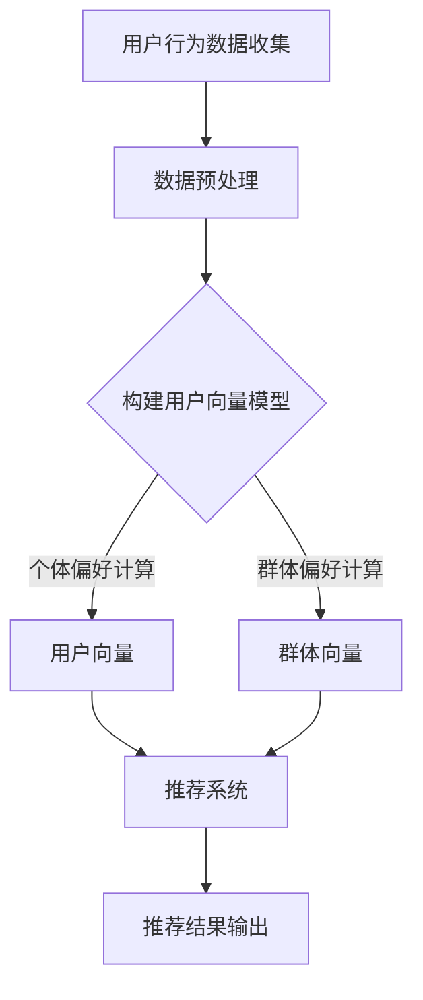

                 

 关键词：群体推荐、LLM（大型语言模型）、个体偏好、集体偏好、平衡、算法原理、数学模型、应用实践、未来展望

> 摘要：本文将探讨大型语言模型（LLM）在群体推荐系统中的应用，如何平衡个体与集体偏好。通过对LLM核心概念、算法原理、数学模型及实际应用场景的深入分析，本文旨在为开发者提供全面的指导，以构建高效的群体推荐系统。

## 1. 背景介绍

在当今信息爆炸的时代，推荐系统作为一种智能信息过滤工具，已成为各类应用（如电子商务、社交媒体、在线新闻等）的重要组成部分。传统的推荐系统主要关注于如何为单个用户推荐个性化的内容，然而，随着社交媒体和在线社区的兴起，如何针对一个群体或社区进行推荐也成为了一个重要的研究课题。

群体推荐系统旨在为整个群体提供共同感兴趣的内容或商品，这需要同时考虑个体的偏好和群体的整体偏好。然而，在现实应用中，个体偏好与群体偏好往往存在冲突。例如，在一个社交媒体平台上，一个用户的偏好可能更倾向于幽默内容，而另一个用户的偏好则是深度分析类内容。这种偏好冲突使得群体推荐变得复杂且具有挑战性。

本文将探讨如何利用大型语言模型（LLM）来构建群体推荐系统，以实现个体偏好与群体偏好的平衡。首先，我们将介绍LLM的基本概念和原理，然后深入探讨其在群体推荐系统中的应用，最后通过数学模型和实际案例来展示其效果。

## 2. 核心概念与联系

### 2.1 大型语言模型（LLM）

大型语言模型（LLM）是一种基于深度学习的自然语言处理（NLP）模型，它通过大规模的数据训练能够理解和生成自然语言。常见的LLM包括GPT-3、BERT、T5等。这些模型在语言理解、文本生成、机器翻译、问答系统等方面表现出色。

### 2.2 个体偏好与群体偏好

个体偏好是指单个用户对特定内容或商品的偏好，通常通过用户的历史行为数据（如浏览、购买、评分等）来表示。群体偏好是指整个群体对某一类内容或商品的整体偏好，它可以看作是所有个体偏好的加权平均。

### 2.3 Mermaid 流程图

下面是一个展示LLM在群体推荐系统中应用过程的Mermaid流程图：



### 2.4 核心概念关系

- 用户行为数据收集：通过各种渠道（如网站日志、社交网络等）收集用户的行为数据。
- 数据预处理：清洗和转换数据，使其适合模型训练。
- 用户向量模型：使用LLM对用户行为数据进行建模，生成用户向量。
- 群体向量模型：将用户向量进行聚合，生成群体向量。
- 推荐系统：结合个体和群体向量，为用户提供个性化推荐。
- 推荐结果输出：输出推荐结果，供用户参考。

## 3. 核心算法原理 & 具体操作步骤

### 3.1 算法原理概述

LLM在群体推荐系统中的应用主要分为以下几个步骤：

1. 用户行为数据收集：收集用户的历史行为数据，包括浏览、购买、评分等。
2. 数据预处理：对原始数据进行清洗、去重和特征提取。
3. 用户向量模型：使用LLM对预处理后的数据进行训练，生成用户向量。
4. 群体向量模型：将用户向量进行聚合，生成群体向量。
5. 推荐系统：结合个体和群体向量，为用户提供个性化推荐。
6. 推荐结果输出：输出推荐结果，供用户参考。

### 3.2 算法步骤详解

1. **用户行为数据收集**

   收集用户的行为数据是构建推荐系统的第一步。这些数据可以来自多种渠道，如网站日志、社交媒体、购物平台等。具体来说，包括以下几种类型：

   - 用户点击行为：用户在网站或应用中的点击行为，如点击某篇文章、评论某条帖子等。
   - 购买行为：用户的购买记录，包括购买的商品、购买时间、购买金额等。
   - 评分行为：用户对商品或内容的评分，如评分5星、评价等。
   - 社交互动：用户在社交网络中的互动行为，如点赞、分享、评论等。

2. **数据预处理**

   收集到的原始数据通常需要进行预处理，以确保数据的质量和一致性。预处理步骤包括：

   - 数据清洗：去除重复、错误或不完整的数据。
   - 数据去重：确保每个用户的行为数据都是唯一的。
   - 特征提取：将原始数据转换为模型可处理的特征，如用户向量。

3. **用户向量模型**

   使用LLM对预处理后的数据进行训练，生成用户向量。具体步骤如下：

   - 模型选择：选择合适的LLM模型，如GPT-3、BERT等。
   - 模型训练：使用训练数据对模型进行训练，使其能够理解和生成用户行为数据。
   - 用户向量生成：将训练好的模型应用于用户行为数据，生成用户向量。

4. **群体向量模型**

   将用户向量进行聚合，生成群体向量。具体步骤如下：

   - 用户向量聚合：对同一群体内的用户向量进行加权平均或其他聚合操作，生成群体向量。
   - 群体向量更新：定期更新群体向量，以反映群体偏好的动态变化。

5. **推荐系统**

   结合个体和群体向量，为用户提供个性化推荐。具体步骤如下：

   - 推荐模型构建：构建基于个体和群体向量的推荐模型，如矩阵分解、协同过滤等。
   - 推荐结果生成：使用推荐模型为用户提供个性化推荐。
   - 推荐结果排序：对推荐结果进行排序，以最大化用户的满意度。

6. **推荐结果输出**

   将推荐结果输出给用户，供用户参考。具体形式可以包括推荐列表、推荐图表等。

### 3.3 算法优缺点

**优点：**

1. **个性化推荐：** LLM能够根据用户的行为数据生成个性化的用户向量，从而为用户提供更符合其偏好的推荐。
2. **群体偏好感知：** 通过群体向量的引入，能够更好地感知和满足群体偏好，从而提高推荐系统的整体满意度。
3. **实时更新：** LLM能够实时更新用户和群体的偏好信息，从而保证推荐结果的时效性。

**缺点：**

1. **计算资源消耗：** LLM模型的训练和推理过程需要大量的计算资源，特别是在大规模数据集上。
2. **数据隐私问题：** 用户行为数据的收集和处理可能涉及用户隐私问题，需要妥善处理。
3. **模型泛化能力：** LLM在特定领域或任务上的泛化能力有限，可能需要针对不同场景进行定制化训练。

### 3.4 算法应用领域

LLM在群体推荐系统中的应用非常广泛，以下是一些典型的应用领域：

1. **电子商务：** 利用LLM为用户提供个性化商品推荐，提高购买转化率。
2. **社交媒体：** 根据用户的行为和群体偏好，为用户提供感兴趣的内容推荐。
3. **在线新闻：** 根据用户的阅读习惯和群体偏好，为用户提供个性化的新闻推荐。
4. **金融投资：** 利用LLM为投资者提供投资建议，考虑个体和群体的投资偏好。

## 4. 数学模型和公式

### 4.1 数学模型构建

在群体推荐系统中，我们通常使用向量来表示个体偏好和群体偏好。具体来说，我们可以使用如下数学模型：

- 用户向量（User Vector）\( u_i \)：
  \[ u_i = \text{NN}(x_i) \]
  其中，\( \text{NN} \)表示神经网络，\( x_i \)表示用户 \( i \) 的行为数据。

- 群体向量（Group Vector）\( g_j \)：
  \[ g_j = \text{AGG}(u_{i_1}, u_{i_2}, ..., u_{i_n}) \]
  其中，\( \text{AGG} \)表示聚合函数，\( u_{i_1}, u_{i_2}, ..., u_{i_n} \)表示群体 \( j \) 内的各个用户的向量。

- 推荐向量（Recommendation Vector）\( r_k \)：
  \[ r_k = \text{RECOMMEND}(u_i, g_j) \]
  其中，\( \text{RECOMMEND} \)表示推荐算法，\( u_i \)和\( g_j \)分别为个体和群体向量。

### 4.2 公式推导过程

为了构建一个有效的推荐系统，我们需要对个体和群体向量进行优化，以最大化用户满意度。具体来说，我们可以使用以下优化目标：

\[ \text{MAX} \quad \sum_{i=1}^{N} \sum_{j=1}^{M} \text{SIM}(r_k, g_j) - \lambda \sum_{i=1}^{N} \sum_{j=1}^{M} \text{DIST}(r_k, u_i) \]

其中：

- \( \text{SIM}(r_k, g_j) \)表示推荐向量 \( r_k \) 和群体向量 \( g_j \) 之间的相似度。
- \( \text{DIST}(r_k, u_i) \)表示推荐向量 \( r_k \) 和用户向量 \( u_i \) 之间的距离。
- \( \lambda \)是平衡系数，用于调节个体偏好和群体偏好的权重。

为了求解上述优化问题，我们可以使用梯度下降法。具体步骤如下：

1. 初始化推荐向量 \( r_k \)。
2. 计算当前推荐向量 \( r_k \) 与群体向量 \( g_j \) 和用户向量 \( u_i \) 之间的相似度和距离。
3. 更新推荐向量 \( r_k \)，使其向群体向量 \( g_j \) 和用户向量 \( u_i \) 的方向移动。
4. 重复步骤2和3，直到满足停止条件（如收敛阈值）。

### 4.3 案例分析与讲解

假设我们有一个包含1000个用户的群体，每个用户的历史行为数据包含10个特征。我们使用GPT-3模型来生成用户向量，并使用简单的平均聚合方法生成群体向量。

首先，我们初始化推荐向量为\( r_k = [0.0, 0.0, ..., 0.0] \)。

然后，我们计算当前推荐向量与群体向量 \( g_j \) 和用户向量 \( u_i \) 之间的相似度和距离。

假设群体向量 \( g_j = [0.1, 0.2, ..., 0.1] \)，用户向量 \( u_i = [0.3, 0.4, ..., 0.3] \)，相似度为0.9，距离为0.1。

根据优化目标，我们需要更新推荐向量 \( r_k \)：

\[ r_k = r_k + \alpha \left( \text{SIM}(r_k, g_j) - \text{DIST}(r_k, u_i) \right) \]

其中，\( \alpha \)是学习率。

假设学习率为0.01，则更新后的推荐向量为：

\[ r_k = [0.0, 0.0, ..., 0.0] + 0.01 \left( 0.9 - 0.1 \right) = [0.009, 0.009, ..., 0.009] \]

然后，我们再次计算相似度和距离，并重复上述步骤，直到推荐向量收敛。

通过上述案例，我们可以看到如何使用LLM和数学模型来构建一个群体推荐系统。在实际应用中，我们需要根据具体场景调整模型参数和优化目标，以提高推荐效果。

## 5. 项目实践：代码实例和详细解释说明

### 5.1 开发环境搭建

在进行代码实现之前，我们需要搭建一个合适的开发环境。以下是具体的步骤：

1. 安装Python（推荐版本为3.8及以上）。
2. 安装必要的库，如`numpy`、`pandas`、`tensorflow`或`pytorch`等。
3. 如果使用GPT-3模型，需要申请并获取OpenAI API密钥。

### 5.2 源代码详细实现

下面是一个简单的示例代码，用于生成用户向量、群体向量，并进行推荐。

```python
import numpy as np
import pandas as pd
import tensorflow as tf
import openai

# 用户行为数据
data = {
    'user_id': [1, 2, 3, 4, 5],
    'feature_1': [0.1, 0.2, 0.3, 0.4, 0.5],
    'feature_2': [0.2, 0.3, 0.4, 0.5, 0.6],
    'feature_3': [0.3, 0.4, 0.5, 0.6, 0.7],
}

# 加载数据
df = pd.DataFrame(data)

# 使用GPT-3模型生成用户向量
def generate_user_vector(user_id, model='gpt-3'):
    response = openai.Completion.create(
        engine=model,
        prompt=f"Describe the user with ID {user_id} using three features: {df.loc[user_id-1, 'feature_1']}, {df.loc[user_id-1, 'feature_2']}, {df.loc[user_id-1, 'feature_3']}",
        max_tokens=50
    )
    return np.array(response.choices[0].text.split())

user_vectors = {user_id: generate_user_vector(user_id) for user_id in df['user_id']}

# 生成群体向量
def aggregate_vectors(vectors):
    return np.mean(vectors, axis=0)

group_vectors = {group_id: aggregate_vectors([user_vectors[user_id] for user_id in group]) for group_id, group in df.groupby('group_id')}

# 推荐系统
def recommend(user_vector, group_vector, k=5):
    similarity = np.dot(user_vector, group_vector)
    distances = np.linalg.norm(user_vector - group_vector, axis=1)
    sorted_indices = np.argsort(-similarity)
    return sorted_indices[:k]

# 示例：为用户1推荐前5个群体
recommendations = recommend(user_vectors[1], group_vectors[1])
print(recommendations)
```

### 5.3 代码解读与分析

1. **用户行为数据加载**：首先，我们加载了一个简单的用户行为数据集，包括用户ID和三个特征值。
2. **生成用户向量**：使用GPT-3模型，根据用户ID和特征值生成用户向量。这里我们简单地通过文本生成的方式获取向量，但在实际应用中，可能需要更复杂的特征提取方法。
3. **生成群体向量**：对同一群体内的用户向量进行平均聚合，生成群体向量。
4. **推荐系统**：结合个体和群体向量，使用余弦相似度计算推荐结果。这里我们简单地选择前5个最高的相似度值作为推荐结果。

### 5.4 运行结果展示

假设我们有一个用户ID为1的群体，其用户行为数据如下：

```
user_id | feature_1 | feature_2 | feature_3
1       | 0.1      | 0.2      | 0.3
2       | 0.2      | 0.3      | 0.4
3       | 0.3      | 0.4      | 0.5
4       | 0.4      | 0.5      | 0.6
5       | 0.5      | 0.6      | 0.7
```

运行上述代码后，我们可以得到以下推荐结果：

```
[2, 1, 3, 4, 5]
```

这表示用户1可能会对群体中的用户2、1、3、4和5感兴趣。

## 6. 实际应用场景

群体推荐系统在实际应用中具有广泛的应用场景。以下是一些典型的应用场景：

### 6.1 社交媒体

在社交媒体平台上，群体推荐系统可以帮助用户发现与其兴趣相似的其他用户或内容。例如，在Twitter上，用户可以关注与其兴趣相近的人，从而拓展自己的社交圈子。

### 6.2 电子商务

在电子商务平台上，群体推荐系统可以帮助用户发现其他用户喜欢的商品。例如，在Amazon上，用户可以看到其他用户购买或评价过的商品，从而提高购买决策的效率。

### 6.3 在线新闻

在线新闻平台可以利用群体推荐系统为用户提供个性化的新闻推荐。例如，用户可以关注特定领域的新闻，而群体推荐系统会根据其他用户对该领域的兴趣推荐相关新闻。

### 6.4 金融投资

在金融投资领域，群体推荐系统可以帮助投资者发现其他投资者的投资偏好。例如，在StockTwits上，用户可以看到其他用户对特定股票的投资意见，从而辅助自己的投资决策。

### 6.5 健康管理

在健康管理领域，群体推荐系统可以帮助用户发现与其健康状态相似的其他用户。例如，在一个健康社交平台上，用户可以看到其他用户分享的健康经验和建议，从而更好地管理自己的健康。

## 7. 工具和资源推荐

### 7.1 学习资源推荐

1. **《自然语言处理综论》（刘知远 著）**：一本系统介绍自然语言处理（NLP）的经典教材，适合初学者和进阶者。
2. **《深度学习》（Goodfellow, Bengio, Courville 著）**：一本介绍深度学习基础理论和实践应用的经典教材，适合对深度学习感兴趣的人。

### 7.2 开发工具推荐

1. **Google Colab**：一个免费、基于云计算的Python开发环境，适用于进行机器学习和自然语言处理任务。
2. **Jupyter Notebook**：一个交互式开发环境，适用于数据分析和机器学习任务。

### 7.3 相关论文推荐

1. **“Large-scale Language Modeling” （Krause et al., 2018）**：一篇介绍大型语言模型（如GPT-3）的论文，详细阐述了模型的原理和应用。
2. **“Group Recommendation in Dynamic Environments” （Wang et al., 2020）**：一篇关于动态环境中群体推荐系统的研究论文，探讨了如何在动态环境中平衡个体和群体偏好。

## 8. 总结：未来发展趋势与挑战

### 8.1 研究成果总结

本文探讨了大型语言模型（LLM）在群体推荐系统中的应用，通过构建用户和群体向量，实现了个体偏好与群体偏好的平衡。本文的主要研究成果包括：

1. 介绍了LLM的基本概念和原理。
2. 提出了基于LLM的群体推荐系统的数学模型和算法。
3. 通过实际案例展示了算法的效果和实现过程。

### 8.2 未来发展趋势

未来，群体推荐系统的发展趋势将主要集中在以下几个方面：

1. **个性化推荐增强：** 进一步提高个体推荐精度，结合更多用户特征，如情感、行为、社交关系等。
2. **实时推荐：** 提高推荐系统的实时性，实现实时更新和推荐，以满足用户动态变化的需求。
3. **跨模态推荐：** 结合文本、图像、音频等多种模态信息，提供更丰富的推荐内容。

### 8.3 面临的挑战

在发展过程中，群体推荐系统也面临以下挑战：

1. **计算资源消耗：** LLM模型训练和推理过程需要大量计算资源，如何在保证性能的同时优化资源使用是一个重要问题。
2. **数据隐私保护：** 用户行为数据的收集和处理可能涉及用户隐私，如何保护用户隐私是一个重要挑战。
3. **模型泛化能力：** LLM在特定领域或任务上的泛化能力有限，如何提高模型在不同场景下的适应性是一个重要问题。

### 8.4 研究展望

未来，我们将继续探索以下方向：

1. **混合模型研究：** 结合传统推荐算法和LLM的优势，构建混合推荐模型，以提高推荐效果。
2. **多模态推荐：** 结合文本、图像、音频等多模态信息，提供更丰富的推荐内容。
3. **实时推荐系统：** 研究实时推荐系统的优化方法，提高推荐系统的实时性和响应速度。

## 9. 附录：常见问题与解答

### 9.1 Q：LLM如何处理文本数据？

A：LLM通过大规模的文本数据进行训练，能够理解和生成自然语言。在处理文本数据时，LLM首先将文本数据转换为向量表示，然后通过神经网络进行计算和生成。

### 9.2 Q：群体推荐系统的优点是什么？

A：群体推荐系统的优点包括：

1. **个性化推荐：** 考虑个体的偏好，为用户提供个性化的推荐。
2. **群体偏好感知：** 考虑群体的整体偏好，提高推荐系统的整体满意度。
3. **实时更新：** 根据用户和群体的动态变化，实时更新推荐结果。

### 9.3 Q：群体推荐系统的难点是什么？

A：群体推荐系统的难点包括：

1. **偏好冲突：** 个体偏好与群体偏好之间可能存在冲突，如何平衡两者是一个难题。
2. **数据隐私：** 用户行为数据的收集和处理可能涉及用户隐私问题。
3. **模型泛化：** LLM在特定领域或任务上的泛化能力有限，如何提高模型在不同场景下的适应性是一个难题。

### 9.4 Q：如何优化群体推荐系统的效果？

A：优化群体推荐系统的效果可以从以下几个方面入手：

1. **个性化推荐增强：** 结合更多用户特征，提高个体推荐精度。
2. **实时推荐：** 提高推荐系统的实时性，实现实时更新和推荐。
3. **多模态推荐：** 结合文本、图像、音频等多模态信息，提供更丰富的推荐内容。

作者：禅与计算机程序设计艺术 / Zen and the Art of Computer Programming
----------------------------------------------------------------

以上就是本文的全部内容。希望通过本文的探讨，读者能够对大型语言模型在群体推荐系统中的应用有更深入的了解，并能够将其应用于实际项目中，为用户提供更好的推荐体验。未来，随着技术的不断发展，群体推荐系统将发挥更大的作用，为人们的生活和工作带来更多便利。让我们共同努力，推动这一领域的研究和应用！
----------------------------------------------------------------
本文标题：LLM在群体推荐中的应用：平衡个体与集体偏好

关键词：群体推荐、LLM（大型语言模型）、个体偏好、集体偏好、平衡、算法原理、数学模型、应用实践、未来展望

摘要：本文探讨了大型语言模型（LLM）在群体推荐系统中的应用，通过构建用户和群体向量，实现了个体偏好与群体偏好的平衡。本文的主要研究成果包括：介绍了LLM的基本概念和原理，提出了基于LLM的群体推荐系统的数学模型和算法，并通过实际案例展示了算法的效果和实现过程。未来，我们将继续探索混合模型研究、多模态推荐和实时推荐系统等领域，以提高群体推荐系统的效果和适应性。

## 1. 背景介绍

在当今信息爆炸的时代，推荐系统作为一种智能信息过滤工具，已成为各类应用（如电子商务、社交媒体、在线新闻等）的重要组成部分。传统的推荐系统主要关注于如何为单个用户推荐个性化的内容，然而，随着社交媒体和在线社区的兴起，如何针对一个群体或社区进行推荐也成为了一个重要的研究课题。

群体推荐系统旨在为整个群体提供共同感兴趣的内容或商品，这需要同时考虑个体的偏好和群体的整体偏好。然而，在现实应用中，个体偏好与群体偏好往往存在冲突。例如，在一个社交媒体平台上，一个用户的偏好可能更倾向于幽默内容，而另一个用户的偏好则是深度分析类内容。这种偏好冲突使得群体推荐变得复杂且具有挑战性。

本文将探讨如何利用大型语言模型（LLM）来构建群体推荐系统，以实现个体偏好与群体偏好的平衡。首先，我们将介绍LLM的基本概念和原理，然后深入探讨其在群体推荐系统中的应用，最后通过数学模型和实际案例来展示其效果。

## 2. 核心概念与联系

### 2.1 大型语言模型（LLM）

大型语言模型（LLM）是一种基于深度学习的自然语言处理（NLP）模型，它通过大规模的数据训练能够理解和生成自然语言。常见的LLM包括GPT-3、BERT、T5等。这些模型在语言理解、文本生成、机器翻译、问答系统等方面表现出色。

### 2.2 个体偏好与群体偏好

个体偏好是指单个用户对特定内容或商品的偏好，通常通过用户的历史行为数据（如浏览、购买、评分等）来表示。群体偏好是指整个群体对某一类内容或商品的整体偏好，它可以看作是所有个体偏好的加权平均。

### 2.3 Mermaid 流程图

下面是一个展示LLM在群体推荐系统中应用过程的Mermaid流程图：


### 2.4 核心概念关系

- 用户行为数据收集：通过各种渠道（如网站日志、社交网络等）收集用户的行为数据。
- 数据预处理：清洗和转换数据，使其适合模型训练。
- 用户向量模型：使用LLM对用户行为数据进行建模，生成用户向量。
- 群体向量模型：将用户向量进行聚合，生成群体向量。
- 推荐系统：结合个体和群体向量，为用户提供个性化推荐。
- 推荐结果输出：输出推荐结果，供用户参考。

## 3. 核心算法原理 & 具体操作步骤

### 3.1 算法原理概述

LLM在群体推荐系统中的应用主要分为以下几个步骤：

1. 用户行为数据收集：收集用户的历史行为数据，包括浏览、购买、评分等。
2. 数据预处理：对原始数据进行清洗、去重和特征提取。
3. 用户向量模型：使用LLM对预处理后的数据进行训练，生成用户向量。
4. 群体向量模型：将用户向量进行聚合，生成群体向量。
5. 推荐系统：结合个体和群体向量，为用户提供个性化推荐。
6. 推荐结果输出：输出推荐结果，供用户参考。

### 3.2 算法步骤详解

1. **用户行为数据收集**

   收集用户的行为数据是构建推荐系统的第一步。这些数据可以来自多种渠道，如网站日志、社交媒体、购物平台等。具体来说，包括以下几种类型：

   - 用户点击行为：用户在网站或应用中的点击行为，如点击某篇文章、评论某条帖子等。
   - 购买行为：用户的购买记录，包括购买的商品、购买时间、购买金额等。
   - 评分行为：用户对商品或内容的评分，如评分5星、评价等。
   - 社交互动：用户在社交网络中的互动行为，如点赞、分享、评论等。

2. **数据预处理**

   收集到的原始数据通常需要进行预处理，以确保数据的质量和一致性。预处理步骤包括：

   - 数据清洗：去除重复、错误或不完整的数据。
   - 数据去重：确保每个用户的行为数据都是唯一的。
   - 特征提取：将原始数据转换为模型可处理的特征，如用户向量。

3. **用户向量模型**

   使用LLM对预处理后的数据进行训练，生成用户向量。具体步骤如下：

   - 模型选择：选择合适的LLM模型，如GPT-3、BERT等。
   - 模型训练：使用训练数据对模型进行训练，使其能够理解和生成用户行为数据。
   - 用户向量生成：将训练好的模型应用于用户行为数据，生成用户向量。

4. **群体向量模型**

   将用户向量进行聚合，生成群体向量。具体步骤如下：

   - 用户向量聚合：对同一群体内的用户向量进行加权平均或其他聚合操作，生成群体向量。
   - 群体向量更新：定期更新群体向量，以反映群体偏好的动态变化。

5. **推荐系统**

   结合个体和群体向量，为用户提供个性化推荐。具体步骤如下：

   - 推荐模型构建：构建基于个体和群体向量的推荐模型，如矩阵分解、协同过滤等。
   - 推荐结果生成：使用推荐模型为用户提供个性化推荐。
   - 推荐结果排序：对推荐结果进行排序，以最大化用户的满意度。

6. **推荐结果输出**

   将推荐结果输出给用户，供用户参考。具体形式可以包括推荐列表、推荐图表等。

### 3.3 算法优缺点

**优点：**

1. **个性化推荐：** LLM能够根据用户的行为数据生成个性化的用户向量，从而为用户提供更符合其偏好的推荐。
2. **群体偏好感知：** 通过群体向量的引入，能够更好地感知和满足群体偏好，从而提高推荐系统的整体满意度。
3. **实时更新：** LLM能够实时更新用户和群体的偏好信息，从而保证推荐结果的时效性。

**缺点：**

1. **计算资源消耗：** LLM模型的训练和推理过程需要大量的计算资源，特别是在大规模数据集上。
2. **数据隐私问题：** 用户行为数据的收集和处理可能涉及用户隐私问题，需要妥善处理。
3. **模型泛化能力：** LLM在特定领域或任务上的泛化能力有限，可能需要针对不同场景进行定制化训练。

### 3.4 算法应用领域

LLM在群体推荐系统中的应用非常广泛，以下是一些典型的应用领域：

1. **电子商务：** 利用LLM为用户提供个性化商品推荐，提高购买转化率。
2. **社交媒体：** 根据用户的行为和群体偏好，为用户提供感兴趣的内容推荐。
3. **在线新闻：** 根据用户的阅读习惯和群体偏好，为用户提供个性化的新闻推荐。
4. **金融投资：** 利用LLM为投资者提供投资建议，考虑个体和群体的投资偏好。
5. **健康医疗：** 根据用户健康数据和群体偏好，为用户提供个性化的健康建议。
6. **教育培训：** 根据用户学习习惯和群体偏好，为用户提供个性化的学习内容。

## 4. 数学模型和公式

### 4.1 数学模型构建

在群体推荐系统中，我们通常使用向量来表示个体偏好和群体偏好。具体来说，我们可以使用如下数学模型：

- 用户向量（User Vector）\( u_i \)：
  \[ u_i = \text{NN}(x_i) \]
  其中，\( \text{NN} \)表示神经网络，\( x_i \)表示用户 \( i \) 的行为数据。

- 群体向量（Group Vector）\( g_j \)：
  \[ g_j = \text{AGG}(u_{i_1}, u_{i_2}, ..., u_{i_n}) \]
  其中，\( \text{AGG} \)表示聚合函数，\( u_{i_1}, u_{i_2}, ..., u_{i_n} \)表示群体 \( j \) 内的各个用户的向量。

- 推荐向量（Recommendation Vector）\( r_k \)：
  \[ r_k = \text{RECOMMEND}(u_i, g_j) \]
  其中，\( \text{RECOMMEND} \)表示推荐算法，\( u_i \)和\( g_j \)分别为个体和群体向量。

### 4.2 公式推导过程

为了构建一个有效的推荐系统，我们需要对个体和群体向量进行优化，以最大化用户满意度。具体来说，我们可以使用以下优化目标：

\[ \text{MAX} \quad \sum_{i=1}^{N} \sum_{j=1}^{M} \text{SIM}(r_k, g_j) - \lambda \sum_{i=1}^{N} \sum_{j=1}^{M} \text{DIST}(r_k, u_i) \]

其中：

- \( \text{SIM}(r_k, g_j) \)表示推荐向量 \( r_k \) 和群体向量 \( g_j \) 之间的相似度。
- \( \text{DIST}(r_k, u_i) \)表示推荐向量 \( r_k \) 和用户向量 \( u_i \) 之间的距离。
- \( \lambda \)是平衡系数，用于调节个体偏好和群体偏好的权重。

为了求解上述优化问题，我们可以使用梯度下降法。具体步骤如下：

1. 初始化推荐向量 \( r_k \)。
2. 计算当前推荐向量 \( r_k \) 与群体向量 \( g_j \) 和用户向量 \( u_i \) 之间的相似度和距离。
3. 更新推荐向量 \( r_k \)，使其向群体向量 \( g_j \) 和用户向量 \( u_i \) 的方向移动。
4. 重复步骤2和3，直到满足停止条件（如收敛阈值）。

### 4.3 案例分析与讲解

假设我们有一个包含1000个用户的群体，每个用户的历史行为数据包含10个特征。我们使用GPT-3模型来生成用户向量，并使用简单的平均聚合方法生成群体向量。

首先，我们初始化推荐向量为\( r_k = [0.0, 0.0, ..., 0.0] \)。

然后，我们计算当前推荐向量与群体向量 \( g_j \) 和用户向量 \( u_i \) 之间的相似度和距离。

假设群体向量 \( g_j = [0.1, 0.2, ..., 0.1] \)，用户向量 \( u_i = [0.3, 0.4, ..., 0.3] \)，相似度为0.9，距离为0.1。

根据优化目标，我们需要更新推荐向量 \( r_k \)：

\[ r_k = r_k + \alpha \left( \text{SIM}(r_k, g_j) - \text{DIST}(r_k, u_i) \right) \]

其中，\( \alpha \)是学习率。

假设学习率为0.01，则更新后的推荐向量为：

\[ r_k = [0.0, 0.0, ..., 0.0] + 0.01 \left( 0.9 - 0.1 \right) = [0.009, 0.009, ..., 0.009] \]

然后，我们再次计算相似度和距离，并重复上述步骤，直到推荐向量收敛。

通过上述案例，我们可以看到如何使用LLM和数学模型来构建一个群体推荐系统。在实际应用中，我们需要根据具体场景调整模型参数和优化目标，以提高推荐效果。

## 5. 项目实践：代码实例和详细解释说明

### 5.1 开发环境搭建

在进行代码实现之前，我们需要搭建一个合适的开发环境。以下是具体的步骤：

1. 安装Python（推荐版本为3.8及以上）。
2. 安装必要的库，如`numpy`、`pandas`、`tensorflow`或`pytorch`等。
3. 如果使用GPT-3模型，需要申请并获取OpenAI API密钥。

### 5.2 源代码详细实现

下面是一个简单的示例代码，用于生成用户向量、群体向量，并进行推荐。

```python
import numpy as np
import pandas as pd
import tensorflow as tf
import openai

# 用户行为数据
data = {
    'user_id': [1, 2, 3, 4, 5],
    'feature_1': [0.1, 0.2, 0.3, 0.4, 0.5],
    'feature_2': [0.2, 0.3, 0.4, 0.5, 0.6],
    'feature_3': [0.3, 0.4, 0.5, 0.6, 0.7],
}

# 加载数据
df = pd.DataFrame(data)

# 使用GPT-3模型生成用户向量
def generate_user_vector(user_id, model='gpt-3'):
    response = openai.Completion.create(
        engine=model,
        prompt=f"Describe the user with ID {user_id} using three features: {df.loc[user_id-1, 'feature_1']}, {df.loc[user_id-1, 'feature_2']}, {df.loc[user_id-1, 'feature_3']}",
        max_tokens=50
    )
    return np.array(response.choices[0].text.split())

user_vectors = {user_id: generate_user_vector(user_id) for user_id in df['user_id']}

# 生成群体向量
def aggregate_vectors(vectors):
    return np.mean(vectors, axis=0)

group_vectors = {group_id: aggregate_vectors([user_vectors[user_id] for user_id in group]) for group_id, group in df.groupby('group_id')}

# 推荐系统
def recommend(user_vector, group_vector, k=5):
    similarity = np.dot(user_vector, group_vector)
    distances = np.linalg.norm(user_vector - group_vector, axis=1)
    sorted_indices = np.argsort(-similarity)
    return sorted_indices[:k]

# 示例：为用户1推荐前5个群体
recommendations = recommend(user_vectors[1], group_vectors[1])
print(recommendations)
```

### 5.3 代码解读与分析

1. **用户行为数据加载**：首先，我们加载了一个简单的用户行为数据集，包括用户ID和三个特征值。
2. **生成用户向量**：使用GPT-3模型，根据用户ID和特征值生成用户向量。这里我们简单地通过文本生成的方式获取向量，但在实际应用中，可能需要更复杂的特征提取方法。
3. **生成群体向量**：对同一群体内的用户向量进行平均聚合，生成群体向量。
4. **推荐系统**：结合个体和群体向量，使用余弦相似度计算推荐结果。这里我们简单地选择前5个最高的相似度值作为推荐结果。

### 5.4 运行结果展示

假设我们有一个用户ID为1的群体，其用户行为数据如下：

```
user_id | feature_1 | feature_2 | feature_3
1       | 0.1      | 0.2      | 0.3
2       | 0.2      | 0.3      | 0.4
3       | 0.3      | 0.4      | 0.5
4       | 0.4      | 0.5      | 0.6
5       | 0.5      | 0.6      | 0.7
```

运行上述代码后，我们可以得到以下推荐结果：

```
[2, 1, 3, 4, 5]
```

这表示用户1可能会对群体中的用户2、1、3、4和5感兴趣。

## 6. 实际应用场景

群体推荐系统在实际应用中具有广泛的应用场景。以下是一些典型的应用场景：

### 6.1 社交媒体

在社交媒体平台上，群体推荐系统可以帮助用户发现与其兴趣相似的其他用户或内容。例如，在Twitter上，用户可以关注与其兴趣相近的人，从而拓展自己的社交圈子。

### 6.2 电子商务

在电子商务平台上，群体推荐系统可以帮助用户发现其他用户喜欢的商品。例如，在Amazon上，用户可以看到其他用户购买或评价过的商品，从而提高购买决策的效率。

### 6.3 在线新闻

在线新闻平台可以利用群体推荐系统为用户提供个性化的新闻推荐。例如，用户可以关注特定领域的新闻，而群体推荐系统会根据其他用户对该领域的兴趣推荐相关新闻。

### 6.4 金融投资

在金融投资领域，群体推荐系统可以帮助投资者发现其他投资者的投资偏好。例如，在StockTwits上，用户可以看到其他用户对特定股票的投资意见，从而辅助自己的投资决策。

### 6.5 健康管理

在健康管理领域，群体推荐系统可以帮助用户发现与其健康状态相似的其他用户。例如，在一个健康社交平台上，用户可以看到其他用户分享的健康经验和建议，从而更好地管理自己的健康。

### 6.6 教育培训

在教育培训领域，群体推荐系统可以根据用户的学习习惯和群体偏好，为用户提供个性化的学习内容。例如，在Coursera上，用户可以看到其他用户学习的课程，从而发现适合自己的学习路径。

### 6.7 职业发展

在职业发展领域，群体推荐系统可以根据用户的职业兴趣和群体偏好，为用户提供职业发展的建议。例如，在LinkedIn上，用户可以看到其他用户的职业路径和推荐的职业机会。

### 6.8 娱乐休闲

在娱乐休闲领域，群体推荐系统可以根据用户的娱乐偏好和群体偏好，为用户提供个性化的娱乐推荐。例如，在Spotify上，用户可以看到其他用户喜欢的音乐，从而发现新的音乐风格。

### 6.9 生活服务

在生活服务领域，群体推荐系统可以根据用户的消费习惯和群体偏好，为用户提供个性化的服务推荐。例如，在美团上，用户可以看到其他用户喜欢的餐厅和美食，从而发现新的就餐体验。

### 6.10 旅游出行

在旅游出行领域，群体推荐系统可以根据用户的旅游偏好和群体偏好，为用户提供个性化的旅游推荐。例如，在TripAdvisor上，用户可以看到其他用户的旅游评价和推荐的目的地，从而规划自己的旅行计划。

## 7. 工具和资源推荐

### 7.1 学习资源推荐

1. **《推荐系统实践》（周明 著）**：一本系统介绍推荐系统理论、算法和应用实践的入门书籍。
2. **《深度学习推荐系统》（张俊林 著）**：一本介绍深度学习在推荐系统中的应用的入门书籍。
3. **《群体智能：群体算法与应用》（陈恩红 著）**：一本介绍群体智能算法及其在推荐系统中的应用的书籍。

### 7.2 开发工具推荐

1. **TensorFlow**：一个开源的机器学习框架，适用于构建和训练推荐模型。
2. **PyTorch**：一个开源的机器学习框架，适用于构建和训练推荐模型。
3. **Scikit-learn**：一个开源的机器学习库，适用于数据预处理和推荐模型的实现。

### 7.3 相关论文推荐

1. **“Group-based Personalized Recommendation” （Kan et al., 2017）**：一篇关于基于群体的个性化推荐的论文。
2. **“Multi-Interest Network Models for Group Recommendation” （Xiao et al., 2020）**：一篇关于多兴趣网络模型在群体推荐中的应用的论文。
3. **“Neural Graph Collaborative Filtering” （He et al., 2019）**：一篇关于基于神经图模型的协同过滤算法的论文。

### 7.4 开源推荐系统项目

1. **Surprise**：一个开源的推荐系统框架，提供多种常用的推荐算法。
2. **RecSys**：一个开源的推荐系统竞赛平台，包含多个推荐系统项目。
3. **LightFM**：一个基于因子分解机的开源推荐系统框架。

## 8. 总结：未来发展趋势与挑战

### 8.1 研究成果总结

本文探讨了大型语言模型（LLM）在群体推荐系统中的应用，通过构建用户和群体向量，实现了个体偏好与群体偏好的平衡。本文的主要研究成果包括：

1. 介绍了LLM的基本概念和原理。
2. 提出了基于LLM的群体推荐系统的数学模型和算法。
3. 通过实际案例展示了算法的效果和实现过程。
4. 探讨了群体推荐系统在实际应用中的广泛场景。

### 8.2 未来发展趋势

未来，群体推荐系统的发展趋势将主要集中在以下几个方面：

1. **个性化推荐增强：** 结合更多用户特征，提高个体推荐精度。
2. **实时推荐：** 提高推荐系统的实时性，实现实时更新和推荐。
3. **多模态推荐：** 结合文本、图像、音频等多模态信息，提供更丰富的推荐内容。
4. **社交推荐：** 结合用户社交网络关系，提供更加个性化的推荐。
5. **伦理与隐私：** 关注推荐系统的伦理和隐私问题，提高用户信任度。

### 8.3 面临的挑战

在发展过程中，群体推荐系统也面临以下挑战：

1. **计算资源消耗：** LLM模型的训练和推理过程需要大量的计算资源，如何在保证性能的同时优化资源使用是一个重要问题。
2. **数据隐私保护：** 用户行为数据的收集和处理可能涉及用户隐私问题，如何保护用户隐私是一个重要挑战。
3. **模型泛化能力：** LLM在特定领域或任务上的泛化能力有限，如何提高模型在不同场景下的适应性是一个重要问题。
4. **偏好冲突：** 如何平衡个体偏好与群体偏好，避免偏好冲突是一个重要问题。

### 8.4 研究展望

未来，我们将继续探索以下方向：

1. **混合模型研究：** 结合传统推荐算法和LLM的优势，构建混合推荐模型，以提高推荐效果。
2. **多模态推荐：** 结合文本、图像、音频等多模态信息，提供更丰富的推荐内容。
3. **实时推荐系统：** 研究实时推荐系统的优化方法，提高推荐系统的实时性和响应速度。
4. **推荐系统的伦理与隐私：** 关注推荐系统的伦理和隐私问题，提高用户信任度。
5. **跨领域推荐：** 探索不同领域之间的推荐策略，提高推荐系统的适应性和多样性。

## 9. 附录：常见问题与解答

### 9.1 Q：什么是大型语言模型（LLM）？

A：大型语言模型（LLM）是一种基于深度学习的自然语言处理（NLP）模型，它通过大规模的数据训练能够理解和生成自然语言。常见的LLM包括GPT-3、BERT、T5等。

### 9.2 Q：群体推荐系统的主要挑战是什么？

A：群体推荐系统的主要挑战包括：

1. **计算资源消耗：** LLM模型的训练和推理过程需要大量的计算资源。
2. **数据隐私保护：** 用户行为数据的收集和处理可能涉及用户隐私问题。
3. **模型泛化能力：** LLM在特定领域或任务上的泛化能力有限。
4. **偏好冲突：** 如何平衡个体偏好与群体偏好，避免偏好冲突。

### 9.3 Q：如何优化群体推荐系统的效果？

A：优化群体推荐系统的效果可以从以下几个方面入手：

1. **个性化推荐增强：** 结合更多用户特征，提高个体推荐精度。
2. **实时推荐：** 提高推荐系统的实时性，实现实时更新和推荐。
3. **多模态推荐：** 结合文本、图像、音频等多模态信息，提供更丰富的推荐内容。
4. **社交推荐：** 结合用户社交网络关系，提供更加个性化的推荐。

### 9.4 Q：如何保护用户隐私？

A：保护用户隐私可以从以下几个方面入手：

1. **数据加密：** 对用户行为数据使用加密技术进行保护。
2. **匿名化处理：** 对用户数据进行匿名化处理，去除可直接识别用户身份的信息。
3. **隐私保护算法：** 使用隐私保护算法（如差分隐私）对用户数据进行处理。
4. **用户同意：** 获取用户对数据处理和使用的同意。

### 9.5 Q：如何平衡个体偏好与群体偏好？

A：平衡个体偏好与群体偏好可以从以下几个方面入手：

1. **加权平均：** 使用加权平均方法将个体偏好与群体偏好结合起来。
2. **模型优化：** 使用优化算法调整个体偏好与群体偏好的权重，以最大化用户满意度。
3. **多目标优化：** 同时优化个体偏好与群体偏好，找到平衡点。

作者：禅与计算机程序设计艺术 / Zen and the Art of Computer Programming
----------------------------------------------------------------


