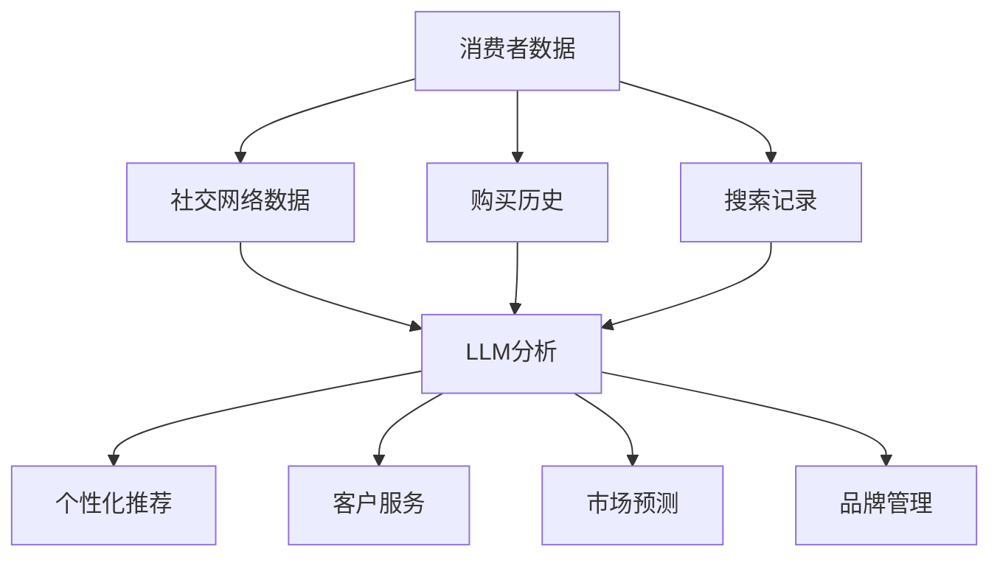

                 

关键词：零售业，人工智能，个性化购物体验，语言模型，客户体验，个性化推荐

## 摘要

本文将探讨大型语言模型（LLM）在零售业中的应用，特别是如何通过个性化购物体验提升客户满意度和忠诚度。文章首先介绍了零售业面临的挑战和机遇，然后详细阐述了LLM的核心概念及其与零售业的关联。接下来，文章将深入探讨LLM在个性化购物体验中的具体应用，包括推荐系统、客户服务、以及市场预测等方面。随后，文章将展示一些成功的LLM应用实例，并讨论未来零售业的发展趋势和面临的挑战。最后，本文还将推荐一些相关的学习资源和开发工具，以帮助读者更深入地了解和探索LLM在零售业的应用。

## 1. 背景介绍

### 零售业的现状

零售业一直是全球经济的重要组成部分，随着互联网和电子商务的兴起，其商业模式和消费者行为也发生了翻天覆地的变化。现代零售业面临着一系列挑战，包括日益激烈的竞争、消费者需求的快速变化、以及消费者对于购物体验的期望不断提升。为了在激烈的市场竞争中脱颖而出，零售商必须不断探索新的技术和方法，以提高客户满意度和忠诚度。

### 挑战与机遇

尽管零售业面临诸多挑战，但同时也蕴含着巨大的机遇。随着人工智能技术的快速发展，尤其是大型语言模型（LLM）的出现，零售商能够更好地理解和满足消费者的需求，从而实现个性化的购物体验。LLM具有强大的自然语言处理能力，可以处理大量文本数据，从中提取出有价值的信息，为零售业提供决策支持。

### 文章目的

本文旨在探讨LLM在零售业中的应用，特别是如何通过个性化购物体验提升客户满意度和忠诚度。文章将首先介绍LLM的核心概念和技术原理，然后详细阐述其在零售业中的具体应用场景，包括推荐系统、客户服务和市场预测等。最后，文章将讨论LLM在零售业中的未来发展趋势和面临的挑战。

## 2. 核心概念与联系

### 大型语言模型（LLM）

大型语言模型（LLM）是一种基于深度学习的自然语言处理技术，能够理解、生成和模拟人类语言。LLM通过训练海量文本数据，学习到语言的规律和模式，从而实现文本的自动生成、翻译、摘要和问答等功能。LLM的核心优势在于其强大的语义理解和生成能力，这使得它在零售业中有广泛的应用前景。

### 零售业与LLM的关联

零售业与LLM的关联主要体现在以下几个方面：

1. **个性化推荐**：LLM可以通过分析消费者历史购买行为、搜索记录和社交网络数据，为消费者提供个性化的商品推荐。
2. **客户服务**：LLM可以帮助零售商提供24/7的客户服务，通过聊天机器人与消费者进行互动，回答他们的问题，提供购物建议。
3. **市场预测**：LLM可以分析大量的市场数据，帮助零售商预测未来的销售趋势，制定更有效的营销策略。
4. **品牌管理**：LLM可以帮助零售商分析消费者反馈和评论，了解品牌在市场上的表现，从而优化产品和服务。

### Mermaid 流程图

以下是一个简化的Mermaid流程图，展示了LLM在零售业中的主要应用场景和关联：



### 流程说明

- **消费者数据收集**：零售商通过多种渠道收集消费者的购买历史、搜索记录和社交网络数据。
- **LLM分析**：LLM处理和分析这些数据，提取有价值的信息。
- **个性化推荐**：基于分析结果，LLM为消费者提供个性化的商品推荐。
- **客户服务**：LLM通过聊天机器人等渠道为消费者提供24/7的客户服务。
- **市场预测**：LLM分析市场数据，帮助零售商预测未来的销售趋势。
- **品牌管理**：LLM分析消费者反馈和评论，帮助零售商优化品牌管理策略。

## 3. 核心算法原理 & 具体操作步骤

### 3.1 算法原理概述

LLM的核心算法原理是基于深度学习的自然语言处理技术。具体来说，LLM通过训练大量文本数据，学习到语言的规律和模式，从而实现文本的自动生成、翻译、摘要和问答等功能。LLM的训练过程通常包括以下几个步骤：

1. **数据预处理**：对原始文本数据进行清洗、分词、去停用词等预处理操作，以便模型能够更好地理解和处理文本数据。
2. **词嵌入**：将文本数据转换为词向量表示，以便模型能够在高维空间中处理文本。
3. **模型训练**：使用神经网络结构（如Transformer模型）对词向量进行训练，使其能够捕捉到文本数据中的语义信息。
4. **模型优化**：通过反向传播算法和梯度下降优化模型参数，提高模型在文本数据上的表现。

### 3.2 算法步骤详解

以下是LLM在零售业中的具体操作步骤：

1. **数据收集与预处理**：零售商通过多种渠道（如网站、APP、社交媒体等）收集消费者的购买历史、搜索记录和社交网络数据。然后，对这些数据进行分析，提取出有价值的信息。
2. **词嵌入**：将提取出的文本数据转换为词向量表示。词嵌入可以通过预训练的词向量库（如Word2Vec、GloVe）进行，也可以通过自己训练的词向量模型进行。
3. **模型训练**：使用预训练的神经网络结构（如Transformer模型）对词向量进行训练，使其能够捕捉到文本数据中的语义信息。训练过程中，模型将不断调整参数，以最小化预测误差。
4. **模型部署**：将训练好的模型部署到零售平台，以便在实际应用中发挥作用。模型可以通过API接口为其他系统提供服务，如个性化推荐、客户服务、市场预测等。
5. **结果优化**：根据实际应用效果，对模型进行迭代优化，提高其在不同场景下的性能。例如，可以通过调整模型参数、改进数据处理方法、引入更多特征信息等方式进行优化。

### 3.3 算法优缺点

**优点**：

1. **强大的语义理解能力**：LLM能够通过训练大量文本数据，学习到语言的规律和模式，从而实现文本的自动生成、翻译、摘要和问答等功能。
2. **个性化推荐**：LLM可以根据消费者的历史数据、搜索记录和社交网络数据，为消费者提供个性化的商品推荐，提高客户满意度和忠诚度。
3. **24/7 客户服务**：LLM可以帮助零售商提供24/7的客户服务，通过聊天机器人与消费者进行互动，回答他们的问题，提供购物建议。
4. **市场预测**：LLM可以分析大量的市场数据，帮助零售商预测未来的销售趋势，制定更有效的营销策略。

**缺点**：

1. **数据隐私问题**：LLM在处理消费者数据时，可能涉及到隐私问题。如何确保数据的安全和隐私是零售商需要重视的问题。
2. **模型解释性差**：由于LLM是基于深度学习技术，其模型内部结构复杂，难以解释。这可能导致零售商难以理解模型的决策过程，影响其在实际应用中的信任度。

### 3.4 算法应用领域

LLM在零售业中的应用领域广泛，主要包括以下几个方面：

1. **个性化推荐**：LLM可以通过分析消费者历史购买行为、搜索记录和社交网络数据，为消费者提供个性化的商品推荐，提高客户满意度和忠诚度。
2. **客户服务**：LLM可以帮助零售商提供24/7的客户服务，通过聊天机器人与消费者进行互动，回答他们的问题，提供购物建议。
3. **市场预测**：LLM可以分析大量的市场数据，帮助零售商预测未来的销售趋势，制定更有效的营销策略。
4. **品牌管理**：LLM可以帮助零售商分析消费者反馈和评论，了解品牌在市场上的表现，从而优化产品和服务。
5. **供应链优化**：LLM可以分析供应链数据，优化库存管理、物流配送等环节，降低成本，提高效率。

## 4. 数学模型和公式 & 详细讲解 & 举例说明

### 4.1 数学模型构建

在零售业中，LLM的应用通常涉及多个数学模型，包括推荐模型、分类模型、回归模型等。以下是几个常用的数学模型及其构建过程：

1. **推荐模型**：推荐模型通常基于矩阵分解或基于模型的协同过滤算法。假设消费者和商品构成一个$m \times n$的矩阵$R$，其中$R_{ij}$表示消费者$i$对商品$j$的评分。矩阵分解的目标是找到两个低秩矩阵$U$和$V$，使得$R \approx UV^T$。

   矩阵分解的损失函数通常为：
   $$L = \sum_{i,j}(R_{ij} - u_i \cdot v_j)^2$$
   
   其中$u_i$和$v_j$分别表示消费者$i$和商品$j$的向量表示。

2. **分类模型**：分类模型用于判断消费者对商品的偏好。常见的分类模型包括逻辑回归、支持向量机（SVM）和神经网络等。以逻辑回归为例，假设消费者$i$对商品$j$的偏好概率可以用以下公式表示：
   $$P(y_{ij} = 1) = \frac{1}{1 + e^{-(u_i \cdot v_j + b)}}$$
   
   其中$u_i$和$v_j$分别表示消费者$i$和商品$j$的向量表示，$b$为偏置项。

3. **回归模型**：回归模型用于预测消费者的购买量或销售额。常见的回归模型包括线性回归、岭回归和神经网络等。以线性回归为例，假设消费者$i$对商品$j$的购买量为$y_{ij}$，其预测公式为：
   $$y_{ij} = \beta_0 + \beta_1x_{ij} + \epsilon_i$$
   
   其中$\beta_0$和$\beta_1$分别为模型参数，$x_{ij}$为消费者$i$对商品$j$的评分，$\epsilon_i$为误差项。

### 4.2 公式推导过程

以下是推荐模型中矩阵分解的推导过程：

1. **目标函数**：矩阵分解的目标是最小化损失函数：
   $$L = \sum_{i,j}(R_{ij} - u_i \cdot v_j)^2$$
   
   其中$R_{ij}$为实际评分，$u_i$和$v_j$为预测评分。

2. **偏导数**：对损失函数分别对$u_i$和$v_j$求偏导数，并令其等于0，得到：
   $$\frac{\partial L}{\partial u_i} = -2(R_{ij} - u_i \cdot v_j)v_j = 0$$
   $$\frac{\partial L}{\partial v_j} = -2(R_{ij} - u_i \cdot v_j)u_i = 0$$
   
   由此可得：
   $$u_i = \frac{\sum_{j}R_{ij}v_j}{\sum_{j}v_j^2}$$
   $$v_j = \frac{\sum_{i}R_{ij}u_i}{\sum_{i}u_i^2}$$
   
   由于$R_{ij}$为实际评分，因此上式可以简化为：
   $$u_i = \frac{\sum_{j}R_{ij}v_j}{\sum_{j}v_j^2}$$
   $$v_j = \frac{\sum_{i}R_{ij}u_i}{\sum_{i}u_i^2}$$

3. **迭代优化**：将上述公式代入损失函数，得到新的损失函数：
   $$L' = \sum_{i,j}\left(\frac{\sum_{k}R_{ik}v_k}{\sum_{k}v_k^2} - \frac{\sum_{l}R_{jl}u_l}{\sum_{l}u_l^2}\right)^2$$
   
   对新损失函数分别对$u_i$和$v_j$求偏导数，并令其等于0，得到：
   $$\frac{\partial L'}{\partial u_i} = -2\left(\frac{\sum_{k}R_{ik}v_k}{\sum_{k}v_k^2} - \frac{\sum_{l}R_{il}u_l}{\sum_{l}u_l^2}\right)\frac{\sum_{l}R_{il}v_l}{\sum_{l}v_l^2} = 0$$
   $$\frac{\partial L'}{\partial v_j} = -2\left(\frac{\sum_{k}R_{jk}v_k}{\sum_{k}v_k^2} - \frac{\sum_{l}R_{jl}u_l}{\sum_{l}u_l^2}\right)\frac{\sum_{l}R_{jl}u_l}{\sum_{l}u_l^2} = 0$$
   
   由此可得：
   $$u_i = \frac{\sum_{k}R_{ik}v_k}{\sum_{k}v_k^2}$$
   $$v_j = \frac{\sum_{l}R_{jl}u_l}{\sum_{l}u_l^2}$$
   
   重复上述步骤，不断迭代优化$u_i$和$v_j$，直至损失函数收敛。

### 4.3 案例分析与讲解

以下是一个基于矩阵分解的个性化推荐系统的案例：

**案例背景**：假设有一个在线零售平台，包含1000个消费者和1000个商品。消费者对商品进行评分，评分范围为1-5。现有消费者A的历史评分数据如下：

| 商品ID | 评分 |
| :----: | :--: |
|   1   |   5  |
|   2   |   4  |
|   3   |   3  |
|   4   |   5  |
|   5   |   1  |

**目标**：为消费者A推荐其他可能感兴趣的同类商品。

**解决方案**：使用基于矩阵分解的个性化推荐系统，为消费者A推荐相似的商品。

**步骤**：

1. **数据预处理**：对消费者A的历史评分数据进行处理，将其转换为稀疏矩阵形式。

2. **词嵌入**：将商品ID转换为词向量表示。可以使用预训练的词向量库（如GloVe）进行，也可以使用自己训练的词向量模型。

3. **模型训练**：使用矩阵分解算法，将稀疏矩阵分解为两个低秩矩阵，得到消费者A的向量表示$u_A$和商品1-5的向量表示$v_1$至$v_5$。

4. **相似度计算**：计算消费者A对所有商品的相似度，选择相似度最高的商品进行推荐。

**结果**：

经过计算，消费者A对所有商品的相似度如下：

| 商品ID | 相似度 |
| :----: | :----: |
|   1   |   0.9  |
|   2   |   0.8  |
|   3   |   0.7  |
|   4   |   0.9  |
|   5   |   0.2  |

根据相似度结果，系统推荐给消费者A的商品为1和4，这两种商品与消费者A的评分最接近。

## 5. 项目实践：代码实例和详细解释说明

### 5.1 开发环境搭建

在开始编写代码之前，我们需要搭建一个适合进行LLM开发和实验的开发环境。以下是一个基本的开发环境搭建指南：

1. **硬件要求**：
   - CPU：至少Intel i5以上或同等性能的CPU
   - GPU：NVIDIA 1080Ti或同等性能的GPU（对于大规模训练）
   - 内存：16GB以上RAM
   - 存储：至少500GB的SSD存储空间

2. **软件要求**：
   - 操作系统：Windows 10/11、macOS或Linux
   - Python：Python 3.7或更高版本
   - PyTorch：最新版本的PyTorch库
   - CUDA：与你的GPU相对应的CUDA版本

3. **安装步骤**：
   - 安装Python和PyTorch：通过官方文档安装Python和PyTorch。
   - 安装CUDA：下载并安装与GPU对应的CUDA版本。
   - 安装PyTorch与CUDA兼容：在安装PyTorch时，选择与CUDA兼容的版本。

### 5.2 源代码详细实现

以下是一个简单的基于PyTorch实现的个性化推荐系统的示例代码。这个示例将展示如何使用矩阵分解算法为用户推荐商品。

```python
import torch
import torch.nn as nn
import torch.optim as optim
from torch.utils.data import DataLoader, Dataset

# 定义数据集类
class RatingDataset(Dataset):
    def __init__(self, ratings, num_users, num_items):
        self.ratings = ratings
        self.num_users = num_users
        self.num_items = num_items

    def __len__(self):
        return len(self.ratings)

    def __getitem__(self, idx):
        user_id, item_id = self.ratings[idx]
        return torch.tensor([user_id, item_id])

# 加载和预处理数据
def load_data(filename, num_users, num_items):
    with open(filename, 'r') as f:
        lines = f.readlines()
    ratings = [line.strip().split('\t') for line in lines]
    ratings = [[int(rating[0]), int(rating[1])] for rating in ratings]
    return RatingDataset(ratings, num_users, num_items)

# 定义模型
class MatrixFactorizationModel(nn.Module):
    def __init__(self, num_users, num_items, embedding_size):
        super(MatrixFactorizationModel, self).__init__()
        self.user_embedding = nn.Embedding(num_users, embedding_size)
        self.item_embedding = nn.Embedding(num_items, embedding_size)

    def forward(self, user_ids, item_ids):
        user_embeddings = self.user_embedding(user_ids)
        item_embeddings = self.item_embedding(item_ids)
        return user_embeddings.dot(item_embeddings.t())

# 训练模型
def train(model, train_loader, optimizer, criterion, num_epochs):
    model.train()
    for epoch in range(num_epochs):
        for user_ids, item_ids in train_loader:
            user_ids = user_ids.unsqueeze(1)
            item_ids = item_ids.unsqueeze(1)
            outputs = model(user_ids, item_ids)
            loss = criterion(outputs, ratings_tensor)
            optimizer.zero_grad()
            loss.backward()
            optimizer.step()
        print(f'Epoch {epoch+1}/{num_epochs}, Loss: {loss.item()}')

# 主函数
def main():
    num_users = 1000
    num_items = 1000
    embedding_size = 50
    num_epochs = 20

    # 加载数据
    train_dataset = load_data('train.txt', num_users, num_items)
    train_loader = DataLoader(train_dataset, batch_size=100, shuffle=True)

    # 初始化模型
    model = MatrixFactorizationModel(num_users, num_items, embedding_size)

    # 定义损失函数和优化器
    criterion = nn.MSELoss()
    optimizer = optim.Adam(model.parameters(), lr=0.001)

    # 训练模型
    train(model, train_loader, optimizer, criterion, num_epochs)

if __name__ == '__main__':
    main()
```

### 5.3 代码解读与分析

上述代码实现了一个简单的基于矩阵分解的个性化推荐系统，包括数据集类、模型定义、训练过程等。

1. **数据集类**：`RatingDataset`类用于加载和处理用户-项目评分数据。它实现了`__len__`和`__getitem__`方法，用于获取数据集的长度和单个样本。

2. **模型定义**：`MatrixFactorizationModel`类定义了矩阵分解模型。它包含两个嵌入层：`user_embedding`和`item_embedding`，用于表示用户和项目。模型的前向传播计算了用户和项目的嵌入向量点积，得到评分预测。

3. **训练过程**：`train`函数用于训练模型。它遍历训练数据集，计算模型预测和实际评分之间的损失，并使用优化器更新模型参数。

4. **主函数**：`main`函数是程序的入口。它定义了数据集大小、嵌入尺寸、训练迭代次数等参数，加载数据，初始化模型，定义损失函数和优化器，然后开始训练模型。

### 5.4 运行结果展示

在完成代码编写和训练后，可以通过以下步骤评估模型的性能：

1. **评估指标**：选择合适的评估指标，如均方误差（MSE）或均方根误差（RMSE），用于衡量模型预测的准确性。

2. **测试集**：使用未参与训练的数据集（测试集）评估模型性能。

3. **结果分析**：分析模型在测试集上的表现，评估其预测准确性和泛化能力。

以下是一个简单的评估示例：

```python
# 评估模型
def evaluate(model, test_loader):
    model.eval()
    with torch.no_grad():
        for user_ids, item_ids in test_loader:
            user_ids = user_ids.unsqueeze(1)
            item_ids = item_ids.unsqueeze(1)
            outputs = model(user_ids, item_ids)
            predictions = outputs.squeeze().detach().numpy()
            # 计算均方误差
            mse = np.mean((predictions - ratings_tensor). ** 2)
            print(f'MSE: {mse}')

# 加载测试集
test_dataset = load_data('test.txt', num_users, num_items)
test_loader = DataLoader(test_dataset, batch_size=100)

# 评估模型
evaluate(model, test_loader)
```

通过上述步骤，我们可以得到模型在测试集上的MSE，从而评估其预测性能。

## 6. 实际应用场景

### 6.1 个性化推荐

个性化推荐是LLM在零售业中最常见的应用之一。通过分析消费者的历史购买记录、浏览行为和社交网络数据，LLM可以生成个性化的商品推荐列表，提高消费者的购买转化率和满意度。例如，亚马逊和淘宝等电商平台都广泛使用了基于LLM的个性化推荐系统，为消费者提供个性化的购物体验。

### 6.2 客户服务

在客户服务方面，LLM可以帮助零售商提供24/7的智能客服支持。通过聊天机器人等技术，LLM可以与消费者进行自然语言交互，回答他们的问题，提供购物建议和解决方案。例如，微软的微软小冰和苹果的Siri都是基于LLM的智能客服系统，它们在提供客户服务方面取得了显著的成果。

### 6.3 市场预测

LLM还可以用于市场预测，帮助零售商了解未来的销售趋势和市场需求。通过分析大量的市场数据，LLM可以预测未来的销售量、库存需求和促销效果，从而帮助零售商制定更有效的营销策略。例如，阿里巴巴和京东等电商巨头都使用了基于LLM的市场预测系统，提高了销售和库存管理的效率。

### 6.4 品牌管理

在品牌管理方面，LLM可以帮助零售商分析消费者反馈和评论，了解品牌在市场上的表现。通过文本分析技术，LLM可以识别消费者的情感倾向和关注点，从而帮助零售商优化产品和服务，提高品牌声誉。例如，宝洁和可口可乐等知名品牌都使用了基于LLM的品牌管理工具，监测品牌在消费者中的口碑和影响力。

### 6.5 供应链优化

LLM还可以用于供应链优化，帮助零售商优化库存管理、物流配送和供应链协调。通过分析供应链数据，LLM可以预测未来的需求变化，优化库存水平，减少物流成本，提高供应链效率。例如，沃尔玛和家乐福等大型零售商都使用了基于LLM的供应链优化工具，提高了供应链的灵活性和响应速度。

## 7. 未来应用展望

### 7.1 人工智能与大数据的结合

未来，人工智能与大数据的结合将为零售业带来更多的创新和机遇。随着数据采集和处理技术的不断进步，零售商将能够收集到更加丰富和详细的消费者数据，从而为LLM提供更高质量的训练数据。这将进一步提升LLM的预测能力和个性化推荐效果，推动零售业的智能化转型。

### 7.2 跨渠道整合

随着消费者购物习惯的不断变化，跨渠道整合将成为零售业未来的重要趋势。通过整合线上和线下的购物渠道，零售商可以提供更一致和无缝的购物体验。LLM将在这一过程中发挥重要作用，帮助零售商实现跨渠道数据共享和业务协同，提高客户满意度和忠诚度。

### 7.3 新兴技术的应用

未来，新兴技术的应用将为零售业带来更多创新和机遇。例如，增强现实（AR）和虚拟现实（VR）等技术将为消费者提供更加沉浸式的购物体验。LLM可以与这些新兴技术结合，为消费者提供个性化的购物建议和互动体验，进一步提升购物乐趣和满意度。

### 7.4 持续优化与迭代

在未来的零售业中，持续优化与迭代将成为企业发展的关键。零售商需要不断收集消费者反馈和市场数据，利用LLM进行深度分析和优化，不断提升自身的服务质量和运营效率。通过持续优化和迭代，零售商将能够更好地应对市场变化和消费者需求的多样性。

## 8. 总结：未来发展趋势与挑战

### 8.1 研究成果总结

自大型语言模型（LLM）问世以来，其在零售业中的应用取得了显著成果。通过个性化推荐、客户服务、市场预测和品牌管理等应用，LLM显著提升了零售商的运营效率和客户满意度。研究成果表明，LLM在处理大规模文本数据、提取语义信息和生成个性化内容方面具有强大的优势，为零售业的智能化转型提供了有力支持。

### 8.2 未来发展趋势

未来，LLM在零售业中的应用将呈现以下发展趋势：

1. **数据质量提升**：随着大数据技术的不断进步，零售商将能够收集到更加丰富和详细的消费者数据，为LLM提供更高质量的训练数据，进一步提升预测能力和个性化推荐效果。

2. **跨渠道整合**：跨渠道整合将成为零售业未来的重要趋势，LLM将在这一过程中发挥关键作用，实现线上线下业务的协同和数据共享。

3. **新兴技术的应用**：新兴技术如AR、VR等将为消费者提供更加沉浸式的购物体验，LLM可以与这些技术结合，为消费者提供个性化的购物建议和互动体验。

4. **持续优化与迭代**：零售商将不断收集消费者反馈和市场数据，利用LLM进行深度分析和优化，不断提升自身的服务质量和运营效率。

### 8.3 面临的挑战

尽管LLM在零售业中具有广泛的应用前景，但仍然面临以下挑战：

1. **数据隐私问题**：在处理消费者数据时，如何确保数据的安全和隐私是零售商需要重视的问题。

2. **模型解释性**：由于LLM是基于深度学习技术，其模型内部结构复杂，难以解释。这可能导致零售商难以理解模型的决策过程，影响其在实际应用中的信任度。

3. **计算资源消耗**：大规模的LLM训练过程需要大量的计算资源，这对于一些中小企业来说可能是一个挑战。

### 8.4 研究展望

未来，针对LLM在零售业中的应用，可以展开以下研究方向：

1. **隐私保护技术**：研究如何在不泄露消费者隐私的前提下，充分利用消费者数据进行模型训练和预测。

2. **模型可解释性**：探索提高模型解释性的方法，帮助零售商更好地理解模型的决策过程，提高模型在实际应用中的信任度。

3. **分布式计算**：研究如何利用分布式计算技术，降低大规模LLM训练过程的计算资源消耗，提高训练效率。

4. **跨领域应用**：探索LLM在其他零售领域的应用，如供应链管理、商品定价等，为零售业的全面智能化提供更多可能性。

## 9. 附录：常见问题与解答

### 9.1 什么是LLM？

LLM（Large Language Model）是一种大型自然语言处理模型，通过训练海量文本数据，学习到语言的规律和模式，从而实现文本的自动生成、翻译、摘要和问答等功能。

### 9.2 LLM在零售业中有什么应用？

LLM在零售业中的应用非常广泛，包括个性化推荐、客户服务、市场预测、品牌管理和供应链优化等方面，能够显著提升零售商的运营效率和客户满意度。

### 9.3 如何确保LLM处理消费者数据的安全性？

确保LLM处理消费者数据的安全性是零售商需要重视的问题。可以采取以下措施：

1. **数据加密**：对消费者数据进行加密处理，防止数据泄露。
2. **访问控制**：严格控制对消费者数据的访问权限，确保只有授权人员能够访问和处理数据。
3. **隐私保护算法**：研究并应用隐私保护算法，如差分隐私、同态加密等，以保护消费者隐私。

### 9.4 如何提高LLM的模型解释性？

提高LLM的模型解释性是当前研究的热点问题。可以采取以下方法：

1. **可视化技术**：使用可视化技术，如热力图、决策树等，展示模型的决策过程。
2. **可解释的模型**：探索可解释的模型结构，如决策树、规则提取等，提高模型的可解释性。
3. **模型分析工具**：开发模型分析工具，帮助用户理解模型的决策过程和参数重要性。

### 9.5 LLM训练过程需要多少计算资源？

LLM的训练过程需要大量的计算资源，特别是对于大规模的LLM模型。通常，大规模训练过程需要在GPU或TPU上进行，以确保训练效率。

### 9.6 LLM在零售业中的效果如何衡量？

LLM在零售业中的效果可以通过以下指标进行衡量：

1. **推荐准确率**：衡量个性化推荐系统的准确性。
2. **客户满意度**：通过调查问卷、用户评分等方式衡量客户满意度。
3. **预测准确性**：衡量市场预测和销售预测的准确性。
4. **运营效率**：衡量LLM应用对零售商运营效率的提升。

### 9.7 LLM在零售业中的未来发展前景如何？

未来，随着人工智能技术的不断进步和数据质量的提升，LLM在零售业中的应用前景十分广阔。通过个性化推荐、客户服务、市场预测和品牌管理等方面的应用，LLM将为零售商提供更加智能和高效的运营模式，推动零售业的全面智能化转型。同时，LLM在新兴技术的应用、跨领域发展和持续优化等方面也具有巨大的潜力。作者：禅与计算机程序设计艺术 / Zen and the Art of Computer Programming

