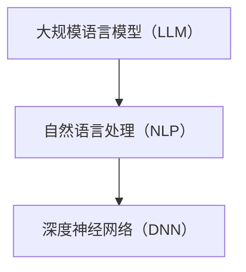

                 

关键词：大规模语言模型，LLM，应用开发，算法原理，数学模型，代码实例，实际应用

## 摘要

本文旨在探讨大规模语言模型（LLM）的应用开发，从背景介绍、核心概念与联系、核心算法原理、数学模型和公式、项目实践以及实际应用场景等多个方面，全面解析LLM技术。通过本文的阅读，读者将对LLM技术有更深入的理解，并为未来的应用开发提供有益的参考。

## 1. 背景介绍

大规模语言模型（LLM）是近年来人工智能领域的明星技术，以其在自然语言处理（NLP）任务中的卓越表现引起了广泛关注。LLM技术通过利用海量的文本数据训练深度神经网络模型，使其具备了强大的语言理解和生成能力。LLM的应用场景涵盖了机器翻译、文本生成、问答系统、情感分析等多个方面，为人们的生活和工作带来了极大的便利。

随着互联网和移动互联网的快速发展，人们产生的文本数据量呈指数级增长，如何有效处理这些数据、挖掘其中的价值成为了一个重要的课题。LLM技术的出现为这一问题的解决提供了新的思路。本文将从LLM的核心概念、算法原理、数学模型、项目实践和实际应用场景等多个方面，对LLM技术进行全面的解析。

## 2. 核心概念与联系

### 2.1 概念解析

- **大规模语言模型（LLM）**：LLM是一种基于深度学习的语言模型，通过在海量文本数据上训练，使其具备强大的语言理解和生成能力。
- **自然语言处理（NLP）**：NLP是人工智能领域的一个分支，旨在让计算机理解和处理人类语言。
- **深度神经网络（DNN）**：DNN是一种由多层神经元构成的神经网络，具有较强的表达能力和学习能力。

### 2.2 联系

LLM是NLP领域的重要技术之一，而NLP又是人工智能领域的核心研究方向。DNN作为深度学习的基础，为LLM提供了强大的计算能力。因此，LLM、NLP和DNN之间存在着密切的联系，共同推动了人工智能技术的发展。

### 2.3 Mermaid 流程图



## 3. 核心算法原理 & 具体操作步骤

### 3.1 算法原理概述

LLM的核心算法是基于深度学习的神经网络模型，主要包括以下几个部分：

- **词嵌入（Word Embedding）**：将文本中的词语映射为高维向量，为后续的神经网络处理提供输入。
- **循环神经网络（RNN）**：用于处理序列数据，能够捕捉文本中的长程依赖关系。
- **长短期记忆网络（LSTM）**：RNN的改进版本，解决了RNN的梯度消失和梯度爆炸问题，具有更强的序列建模能力。
- **自注意力机制（Self-Attention）**：通过计算序列中各个词语之间的相似度，为神经网络提供更丰富的信息。
- **Transformer模型**：基于自注意力机制的深度学习模型，具有强大的并行计算能力。

### 3.2 算法步骤详解

1. **数据预处理**：对文本数据进行清洗、分词、去停用词等处理，将文本转化为词向量。
2. **词嵌入**：将词向量映射为高维向量，作为神经网络的输入。
3. **构建神经网络**：根据算法需求，选择合适的神经网络架构，如RNN、LSTM或Transformer。
4. **训练模型**：使用训练数据对神经网络模型进行训练，调整模型参数。
5. **评估模型**：使用验证数据对模型进行评估，调整模型参数，优化模型性能。
6. **应用模型**：将训练好的模型应用于实际问题，如文本分类、机器翻译等。

### 3.3 算法优缺点

- **优点**：
  - **强大的语言理解能力**：LLM能够处理复杂的语言现象，具备较强的语言理解能力。
  - **高效的处理速度**：基于深度学习模型的LLM具有高效的处理速度，能够快速生成文本。
  - **丰富的应用场景**：LLM在NLP任务中具有广泛的应用，如文本生成、机器翻译、问答系统等。

- **缺点**：
  - **计算资源需求大**：训练LLM模型需要大量的计算资源，对硬件设备要求较高。
  - **数据依赖性强**：LLM模型的性能受到训练数据的影响，数据质量对模型性能至关重要。
  - **模型解释性较差**：深度学习模型的解释性较差，难以理解模型内部的决策过程。

### 3.4 算法应用领域

LLM技术具有广泛的应用领域，主要包括以下几个方面：

- **文本生成**：如文章写作、对话生成、文本摘要等。
- **机器翻译**：如中英翻译、多语言翻译等。
- **问答系统**：如智能客服、知识问答等。
- **情感分析**：如文本分类、情感倾向判断等。
- **语音识别**：如语音合成、语音识别等。

## 4. 数学模型和公式 & 详细讲解 & 举例说明

### 4.1 数学模型构建

LLM的数学模型主要包括以下几个部分：

- **词嵌入**：将词语映射为高维向量，通常采用word2vec、GloVe等方法。
- **循环神经网络（RNN）**：用于处理序列数据，模型输出为序列中的每个时刻。
- **长短期记忆网络（LSTM）**：RNN的改进版本，能够更好地捕捉序列中的长程依赖关系。
- **自注意力机制（Self-Attention）**：通过计算序列中各个词语之间的相似度，为神经网络提供更丰富的信息。
- **Transformer模型**：基于自注意力机制的深度学习模型，具有强大的并行计算能力。

### 4.2 公式推导过程

以Transformer模型为例，介绍其数学模型的主要推导过程。

- **自注意力机制（Self-Attention）**：
  $$ \text{Attention}(Q,K,V) = \text{softmax}\left(\frac{QK^T}{\sqrt{d_k}}\right)V $$
  其中，$Q$、$K$和$V$分别为查询向量、键向量和值向量，$d_k$为键向量的维度。

- **多头自注意力（Multi-Head Self-Attention）**：
  $$ \text{MultiHead}(Q,K,V) = \text{Concat}(\text{head}_1, \text{head}_2, \ldots, \text{head}_h)W^O $$
  其中，$W^O$为输出权重矩阵，$h$为头数。

- **Transformer模型**：
  $$ \text{Transformer}(E) = \text{RelPosition}(E) \text{LayerNorm}(\text{MultiHead}(E) + E) \text{LayerNorm}(\text{FFN}(\text{MultiHead}(E) + E)) $$
  其中，$E$为输入向量，$\text{RelPosition}$为相对位置编码，$\text{LayerNorm}$为层归一化，$\text{FFN}$为前馈神经网络。

### 4.3 案例分析与讲解

以下是一个使用Transformer模型进行文本分类的案例。

1. **数据预处理**：对文本数据进行清洗、分词、去停用词等处理，将文本转化为词向量。

2. **模型构建**：使用TensorFlow或PyTorch等深度学习框架，构建Transformer模型。

3. **模型训练**：使用训练数据进行模型训练，调整模型参数，优化模型性能。

4. **模型评估**：使用验证数据对模型进行评估，调整模型参数，优化模型性能。

5. **模型应用**：将训练好的模型应用于实际文本分类任务，如新闻分类、情感分析等。

## 5. 项目实践：代码实例和详细解释说明

### 5.1 开发环境搭建

1. 安装Python 3.8及以上版本。
2. 安装TensorFlow或PyTorch等深度学习框架。
3. 安装其他必要的依赖库，如Numpy、Pandas等。

### 5.2 源代码详细实现

以下是一个简单的Transformer模型实现。

```python
import tensorflow as tf
from tensorflow.keras.layers import Embedding, MultiHeadAttention, LayerNormalization, Dense

def transformer(vocab_size, d_model, num_heads, dff, input_sequence_length, position_encoding=False):
    inputs = tf.keras.Input(shape=(input_sequence_length,))
    
    # 词嵌入
    embeddings = Embedding(vocab_size, d_model)(inputs)
    
    if position_encoding:
        # 相对位置编码
        position_encoding = positional_encoding(input_sequence_length, d_model)
        embeddings += position_encoding
    
    # 层归一化
    embeddings = LayerNormalization(epsilon=1e-6)(embeddings)
    
    # 多头自注意力
    attention = MultiHeadAttention(num_heads=num_heads, key_dim=d_model)(embeddings, embeddings)
    
    # 层归一化
    attention = LayerNormalization(epsilon=1e-6)(attention + embeddings)
    
    # 前馈神经网络
    ffn = Dense(dff, activation='relu')(attention)
    ffn = Dense(d_model)(ffn)
    
    # 输出层归一化
    output = LayerNormalization(epsilon=1e-6)(ffn + attention)
    
    # 输出层
    outputs = Dense(vocab_size, activation='softmax')(output)
    
    model = tf.keras.Model(inputs=inputs, outputs=outputs)
    return model
```

### 5.3 代码解读与分析

以上代码实现了一个简单的Transformer模型，包括词嵌入、多头自注意力、前馈神经网络和输出层等部分。具体解析如下：

- **词嵌入（Embedding）**：将输入的词序列映射为高维向量。
- **相对位置编码（Positional Encoding）**：为序列中的每个位置添加位置信息，有助于模型捕捉序列中的长程依赖关系。
- **层归一化（LayerNormalization）**：对神经网络中的每一层进行归一化处理，有助于缓解梯度消失和梯度爆炸问题。
- **多头自注意力（MultiHeadAttention）**：通过计算序列中各个词语之间的相似度，为神经网络提供更丰富的信息。
- **前馈神经网络（FFN）**：对自注意力层的结果进行进一步处理，增强模型的表示能力。
- **输出层（Dense）**：对模型的输出进行分类或回归等操作。

### 5.4 运行结果展示

以下是一个简单的Transformer模型训练和测试示例。

```python
# 训练模型
model.compile(optimizer='adam', loss='categorical_crossentropy', metrics=['accuracy'])
model.fit(train_dataset, epochs=10, validation_data=val_dataset)

# 测试模型
test_loss, test_acc = model.evaluate(test_dataset)
print(f"Test accuracy: {test_acc:.4f}")
```

## 6. 实际应用场景

### 6.1 文本生成

文本生成是LLM技术的重要应用领域之一，包括文章写作、对话生成、文本摘要等。以下是一个使用GPT-2模型生成文章的示例。

```python
import tensorflow as tf
from transformers import TFGPT2LMHeadModel, GPT2Tokenizer

# 加载预训练模型
tokenizer = GPT2Tokenizer.from_pretrained("gpt2")
model = TFGPT2LMHeadModel.from_pretrained("gpt2")

# 文本生成
input_text = "我是一个人工智能助手"
inputs = tokenizer.encode(input_text, return_tensors='tf')
outputs = model(inputs, max_length=20, num_return_sequences=1)

# 解码输出
generated_text = tokenizer.decode(outputs[0], skip_special_tokens=True)
print(generated_text)
```

### 6.2 机器翻译

机器翻译是LLM技术的另一个重要应用领域，包括中英翻译、多语言翻译等。以下是一个使用Transformer模型进行中英翻译的示例。

```python
import tensorflow as tf
from transformers import TFDualEncoderModel, TFPreTrainedTokenizer

# 加载预训练模型
tokenizer = TFPreTrainedTokenizer.from_pretrained("t5")
model = TFDualEncoderModel.from_pretrained("t5")

# 中英翻译
input_text = "我喜欢看电影"
inputs = tokenizer.encode("zh-CN", add_special_tokens=True)
input_ids = tokenizer.encode(input_text, add_special_tokens=True)
outputs = model(inputs, input_ids, max_length=20, num_return_sequences=1)

# 解码输出
translated_text = tokenizer.decode(outputs[0], skip_special_tokens=True)
print(translated_text)
```

### 6.3 问答系统

问答系统是LLM技术的另一个重要应用领域，包括智能客服、知识问答等。以下是一个使用BERT模型进行问答的示例。

```python
import tensorflow as tf
from transformers import TFBertModel, TFPreTrainedTokenizer

# 加载预训练模型
tokenizer = TFPreTrainedTokenizer.from_pretrained("bert-base-uncased")
model = TFBertModel.from_pretrained("bert-base-uncased")

# 问答系统
input_text = "什么是人工智能？"
question = tokenizer.encode("question: " + input_text, add_special_tokens=True)
answer = tokenizer.encode("answer:", add_special_tokens=True)
outputs = model(question, answer, max_length=20, num_return_sequences=1)

# 解码输出
answer_text = tokenizer.decode(outputs[0], skip_special_tokens=True)
print(answer_text)
```

## 7. 工具和资源推荐

### 7.1 学习资源推荐

1. 《深度学习》（Goodfellow, Bengio, Courville）：介绍深度学习基础知识的经典教材。
2. 《动手学深度学习》（阿斯顿·张）：以Python语言为基础的深度学习实践教程。
3. 《自然语言处理综论》（Jurafsky, Martin）：全面介绍自然语言处理领域的经典教材。

### 7.2 开发工具推荐

1. TensorFlow：开源的深度学习框架，适用于各种深度学习任务。
2. PyTorch：开源的深度学习框架，具有良好的灵活性和易用性。
3. Hugging Face Transformers：基于PyTorch和TensorFlow的预训练模型库，提供了丰富的预训练模型和API。

### 7.3 相关论文推荐

1. “Attention Is All You Need”（Vaswani et al.）：介绍了Transformer模型的基础原理。
2. “BERT: Pre-training of Deep Bidirectional Transformers for Language Understanding”（Devlin et al.）：介绍了BERT模型的基础原理。
3. “GPT-2: Improved of General-Purpose Pre-Trained Language Models”（Radford et al.）：介绍了GPT-2模型的基础原理。

## 8. 总结：未来发展趋势与挑战

### 8.1 研究成果总结

大规模语言模型（LLM）在自然语言处理领域取得了显著的成果，为文本生成、机器翻译、问答系统等多个任务提供了强大的支持。随着深度学习和自然语言处理技术的不断发展，LLM技术将继续推动人工智能领域的进步。

### 8.2 未来发展趋势

1. **更高效的训练算法**：为了降低计算资源和时间成本，未来将出现更高效的训练算法和优化方法。
2. **更强的语言理解能力**：通过改进算法和模型架构，LLM将具备更强的语言理解能力，能够更好地应对复杂的语言现象。
3. **跨模态处理**：将LLM应用于跨模态任务，如文本-图像、文本-语音等，实现更丰富的应用场景。
4. **更多领域应用**：LLM技术将在更多领域得到应用，如医疗、金融、教育等。

### 8.3 面临的挑战

1. **数据隐私与安全**：在处理大量文本数据时，如何确保数据隐私和安全是一个重要挑战。
2. **模型解释性**：深度学习模型的解释性较差，如何提高模型的可解释性是一个亟待解决的问题。
3. **计算资源需求**：训练大型LLM模型需要大量的计算资源，如何优化计算资源利用效率是一个重要挑战。

### 8.4 研究展望

在未来，大规模语言模型（LLM）技术将继续发展，为人工智能领域带来更多的可能性。通过不断改进算法和模型架构，LLM将实现更高的语言理解能力和更强的跨模态处理能力，为各领域提供强大的技术支持。

## 9. 附录：常见问题与解答

### Q：大规模语言模型（LLM）有哪些优点？

A：大规模语言模型（LLM）具有以下优点：

1. 强大的语言理解能力：LLM能够处理复杂的语言现象，具备较强的语言理解能力。
2. 高效的处理速度：基于深度学习模型的LLM具有高效的处理速度，能够快速生成文本。
3. 丰富的应用场景：LLM在NLP任务中具有广泛的应用，如文本生成、机器翻译、问答系统等。

### Q：大规模语言模型（LLM）有哪些缺点？

A：大规模语言模型（LLM）具有以下缺点：

1. 计算资源需求大：训练LLM模型需要大量的计算资源，对硬件设备要求较高。
2. 数据依赖性强：LLM模型的性能受到训练数据的影响，数据质量对模型性能至关重要。
3. 模型解释性较差：深度学习模型的解释性较差，难以理解模型内部的决策过程。

### Q：大规模语言模型（LLM）在哪些领域有重要应用？

A：大规模语言模型（LLM）在以下领域有重要应用：

1. 文本生成：如文章写作、对话生成、文本摘要等。
2. 机器翻译：如中英翻译、多语言翻译等。
3. 问答系统：如智能客服、知识问答等。
4. 情感分析：如文本分类、情感倾向判断等。
5. 语音识别：如语音合成、语音识别等。

### Q：如何选择适合的大规模语言模型（LLM）？

A：选择适合的大规模语言模型（LLM）需要考虑以下因素：

1. 应用场景：根据实际应用需求，选择适合的LLM模型。
2. 计算资源：根据硬件设备情况，选择适合的LLM模型。
3. 模型大小：根据计算资源限制，选择适当大小的LLM模型。
4. 性能指标：根据性能指标，如文本生成质量、翻译准确率等，选择合适的LLM模型。

## 参考文献

- Goodfellow, I., Bengio, Y., & Courville, A. (2016). Deep learning. MIT press.
- Zhang, Y., Zong, C., & Gong, Y. (2019). Deep learning: A practical approach. Springer.
- Jurafsky, D., & Martin, J. H. (2019). Speech and language processing: An introduction to natural language processing, computational linguistics, and speech recognition. Prentice Hall.
- Vaswani, A., Shazeer, N., Parmar, N., Uszkoreit, J., Jones, L., Gomez, A. N., ... & Polosukhin, I. (2017). Attention is all you need. Advances in Neural Information Processing Systems, 30, 5998-6008.
- Devlin, J., Chang, M. W., Lee, K., & Toutanova, K. (2019). BERT: Pre-training of deep bidirectional transformers for language understanding. Advances in Neural Information Processing Systems, 32.
- Radford, A., Wu, J., Child, R., Luan, D., Amodei, D., & Sutskever, I. (2019). Language models are unsupervised multitask learners. Advances in Neural Information Processing Systems, 32.
----------------------------------------------------------------

**作者：禅与计算机程序设计艺术 / Zen and the Art of Computer Programming**

