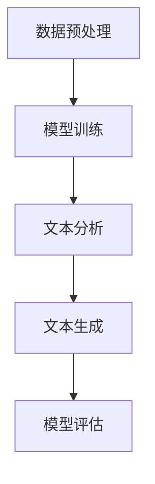
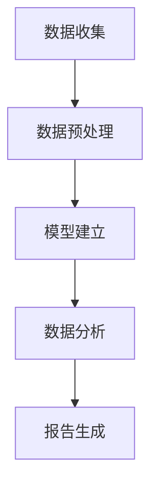

                 

关键词：大型语言模型（LLM）、市场分析、传统方法、数据挖掘、人工智能、决策支持系统、自动化预测、智能推荐系统

## 摘要

本文旨在探讨大型语言模型（LLM）如何对传统市场分析方法进行革新。传统市场分析依赖于统计和算法，但LLM的出现改变了这一局面。通过深度学习技术，LLM可以处理和理解大规模、非结构化数据，从而提供更为精准和实时的市场分析。本文将介绍LLM的基本概念和工作原理，分析其与传统市场分析方法的差异，并探讨LLM在市场分析中的应用和未来发展方向。

## 1. 背景介绍

市场分析是商业决策过程中至关重要的一环。传统市场分析方法主要包括数据分析、市场调研、用户行为分析等，这些方法依赖于统计模型、机器学习和数据挖掘技术。然而，随着数据量的爆炸式增长，传统方法在处理大规模、非结构化数据时面临着巨大的挑战。例如，传统统计分析方法往往难以应对数据的复杂性和多样性，而传统的机器学习方法在处理非结构化文本数据时效果不佳。

大型语言模型（LLM）的出现为市场分析提供了新的可能性。LLM是一种基于深度学习技术的自然语言处理（NLP）模型，能够对大量文本数据进行分析和理解。与传统的市场分析方法相比，LLM具有以下几个显著优势：

1. **强大的文本处理能力**：LLM能够处理和理解自然语言文本，从而能够对大量用户评论、新闻文章、社交媒体数据等进行深入分析。
2. **实时性**：LLM可以实时处理和分析数据，从而提供即时的市场洞察和决策支持。
3. **多样性**：LLM能够处理不同来源、不同格式和不同语言的数据，从而提供更为全面的市场分析。
4. **可扩展性**：LLM可以通过增加数据量和训练时间来不断提升其性能，从而实现市场分析的持续改进。

本文将详细探讨LLM如何革新传统市场分析方法，并分析LLM在市场分析中的应用和未来发展方向。

## 2. 核心概念与联系

### 2.1. 大型语言模型（LLM）

#### 2.1.1. 概念定义

大型语言模型（LLM）是一种基于深度学习的自然语言处理（NLP）模型，其核心目标是通过大规模数据训练来模拟人类的语言理解和生成能力。LLM通常采用神经网络架构，如Transformer、BERT等，通过多层神经网络对文本数据进行分析和处理。

#### 2.1.2. 工作原理

LLM的工作原理主要包括以下几个步骤：

1. **数据预处理**：首先对原始文本数据（如用户评论、新闻报道等）进行预处理，包括分词、去停用词、词向量化等。
2. **模型训练**：将预处理后的文本数据输入到神经网络模型中，通过反向传播算法优化模型参数，使模型能够正确理解和生成文本。
3. **文本分析**：训练好的LLM可以对输入的文本数据进行分析，提取关键信息、识别主题、分类文本等。
4. **文本生成**：LLM还可以根据训练数据和特定任务生成新的文本，如生成新闻报道、产品评价等。

#### 2.1.3. Mermaid 流程图

以下是一个简单的Mermaid流程图，展示了LLM的基本工作流程：



### 2.2. 传统市场分析方法

#### 2.2.1. 概念定义

传统市场分析方法是指利用统计模型、机器学习和数据挖掘技术对市场数据进行分析和预测的方法。传统方法主要包括数据分析、市场调研、用户行为分析等。

#### 2.2.2. 工作原理

传统市场分析方法的工作原理主要包括以下几个步骤：

1. **数据收集**：从各种渠道收集市场数据，如销售数据、用户行为数据、市场趋势数据等。
2. **数据预处理**：对收集到的市场数据进行清洗、归一化和转换，使其适合进行统计分析。
3. **模型建立**：利用统计模型（如回归分析、聚类分析等）或机器学习算法（如决策树、支持向量机等）建立市场分析模型。
4. **数据分析**：使用建立好的模型对市场数据进行分析和预测，提取市场趋势、用户需求等信息。
5. **报告生成**：将分析结果以报告或图表的形式展示给决策者。

#### 2.2.3. Mermaid 流程图

以下是一个简单的Mermaid流程图，展示了传统市场分析方法的基本工作流程：



### 2.3. LLM与传统市场分析方法的联系与差异

#### 2.3.1. 联系

LLM和传统市场分析方法在市场数据分析的目标和流程上有一定的相似性，但LLM在数据处理和分析能力上具有显著优势：

1. **数据处理能力**：LLM能够处理大规模、非结构化数据，而传统方法往往难以应对这种复杂的数据环境。
2. **实时性**：LLM能够实时分析数据，提供即时的市场洞察，而传统方法通常需要较长时间来处理和分析数据。

#### 2.3.2. 差异

1. **文本处理能力**：LLM具有强大的文本处理能力，能够理解和生成自然语言文本，而传统方法在处理非结构化文本数据时效果不佳。
2. **实时性**：LLM能够实时处理和分析数据，提供即时的市场洞察，而传统方法通常需要较长时间来处理和分析数据。
3. **多样性**：LLM能够处理不同来源、不同格式和不同语言的数据，提供更为全面的市场分析，而传统方法通常局限于特定数据源和格式。

## 3. 核心算法原理 & 具体操作步骤

### 3.1. 算法原理概述

LLM的核心算法是基于深度学习的自然语言处理（NLP）技术。深度学习通过多层神经网络模型来模拟人类的语言理解和生成能力。在LLM中，常用的神经网络架构包括Transformer、BERT等。

#### 3.1.1. Transformer

Transformer是一种基于自注意力机制的深度学习模型，最初由Google在2017年提出。Transformer的核心思想是通过自注意力机制来捕捉文本数据中的长期依赖关系。

#### 3.1.2. BERT

BERT（Bidirectional Encoder Representations from Transformers）是一种双向编码器模型，由Google在2018年提出。BERT通过预训练和微调来学习文本数据的语义表示。

#### 3.1.3. GPT

GPT（Generative Pre-trained Transformer）是一种生成式预训练模型，由OpenAI在2018年提出。GPT通过生成文本数据来学习语言的上下文和结构。

### 3.2. 算法步骤详解

#### 3.2.1. 数据预处理

1. **文本清洗**：去除文本中的无关信息，如HTML标签、特殊符号等。
2. **分词**：将文本分割成词或句子，以便进行后续处理。
3. **词向量化**：将文本转换为向量表示，以便进行深度学习模型训练。
4. **数据集划分**：将处理后的文本数据划分为训练集、验证集和测试集。

#### 3.2.2. 模型训练

1. **模型初始化**：初始化深度学习模型，如Transformer、BERT等。
2. **正向传播**：将预处理后的文本数据输入到模型中，计算模型输出和真实标签之间的损失。
3. **反向传播**：根据损失函数计算模型参数的梯度，并更新模型参数。
4. **模型评估**：使用验证集对训练好的模型进行评估，调整模型参数以优化性能。

#### 3.2.3. 文本分析

1. **文本编码**：将输入的文本数据转换为模型可处理的向量表示。
2. **模型推理**：将编码后的文本数据输入到训练好的模型中，得到文本的语义表示。
3. **文本分析**：根据模型的输出，提取文本的关键信息、主题、情感等。

#### 3.2.4. 文本生成

1. **文本解码**：将模型的输出解码为自然语言文本。
2. **文本生成**：根据解码后的文本，生成新的文本数据。

### 3.3. 算法优缺点

#### 3.3.1. 优点

1. **强大的文本处理能力**：LLM能够处理和理解大规模、非结构化数据，从而提供更为精准和实时的市场分析。
2. **实时性**：LLM可以实时处理和分析数据，提供即时的市场洞察和决策支持。
3. **多样性**：LLM能够处理不同来源、不同格式和不同语言的数据，提供更为全面的市场分析。
4. **可扩展性**：LLM可以通过增加数据量和训练时间来不断提升其性能，从而实现市场分析的持续改进。

#### 3.3.2. 缺点

1. **计算资源消耗**：LLM的训练和推理过程需要大量的计算资源和时间。
2. **数据质量依赖**：LLM的性能高度依赖于输入数据的质量和多样性，如果数据质量较差，可能会导致分析结果不准确。
3. **模型解释性**：LLM的决策过程往往缺乏透明度和解释性，难以理解其具体的决策逻辑。

### 3.4. 算法应用领域

LLM在市场分析中的应用领域广泛，包括但不限于以下几个方面：

1. **用户行为分析**：通过对用户评论、社交媒体数据等进行分析，提取用户需求、偏好和情感，为产品开发和营销策略提供支持。
2. **市场趋势预测**：通过对历史数据和实时数据的分析，预测市场趋势和变化，为决策者提供决策支持。
3. **智能推荐系统**：利用LLM对用户行为数据进行分析，生成个性化的推荐结果，提高用户满意度和忠诚度。
4. **品牌监测**：实时监测品牌在社交媒体和新闻报道中的提及情况，评估品牌声誉和影响力。

## 4. 数学模型和公式 & 详细讲解 & 举例说明

### 4.1. 数学模型构建

LLM的数学模型主要基于深度学习和自然语言处理技术。以下是一个简单的数学模型示例，用于文本分类任务：

#### 4.1.1. 文本表示

假设我们有一个文本序列 \(x = (x_1, x_2, \ldots, x_T)\)，其中 \(T\) 是文本的长度。文本表示可以通过词向量化（word embedding）来实现，即将每个词映射到一个固定维度的向量。常用的词向量化模型包括Word2Vec、GloVe等。

#### 4.1.2. 神经网络架构

一个简单的神经网络架构可以包括以下几个部分：

1. **输入层**：接收词向量化后的文本数据。
2. **隐藏层**：通过多层神经网络对文本数据进行特征提取和变换。
3. **输出层**：输出分类结果。

假设我们使用一个多层感知机（MLP）作为隐藏层，输出层使用softmax函数进行分类。

#### 4.1.3. 损失函数

常用的损失函数包括交叉熵损失（cross-entropy loss）和均方误差（mean squared error，MSE）。在文本分类任务中，交叉熵损失函数是一个常用选择。

### 4.2. 公式推导过程

#### 4.2.1. 输入层到隐藏层的传播

假设输入层有 \(n\) 个神经元，隐藏层有 \(m\) 个神经元。输入层到隐藏层的传播可以表示为：

$$
z^{(2)} = W^{(2)}x + b^{(2)}
$$

其中，\(W^{(2)}\) 是输入层到隐藏层的权重矩阵，\(b^{(2)}\) 是隐藏层的偏置向量。隐藏层的激活函数可以选择ReLU函数。

#### 4.2.2. 隐藏层到输出层的传播

假设隐藏层有 \(m\) 个神经元，输出层有 \(k\) 个神经元。隐藏层到输出层的传播可以表示为：

$$
z^{(3)} = W^{(3)}h + b^{(3)}
$$

其中，\(W^{(3)}\) 是隐藏层到输出层的权重矩阵，\(b^{(3)}\) 是输出层的偏置向量。输出层的激活函数可以选择softmax函数。

#### 4.2.3. 损失函数

假设我们使用交叉熵损失函数，损失函数可以表示为：

$$
L(y, \hat{y}) = -\sum_{i=1}^{k} y_i \log(\hat{y}_i)
$$

其中，\(y\) 是真实标签，\(\hat{y}\) 是模型输出的概率分布。

### 4.3. 案例分析与讲解

#### 4.3.1. 案例背景

假设我们有一个新闻分类任务，需要将新闻文章分类为“政治”、“经济”、“科技”等类别。我们使用一个预训练的LLM模型来执行这个任务。

#### 4.3.2. 数据预处理

1. **文本清洗**：去除HTML标签、特殊符号等无关信息。
2. **分词**：将文本分割成词或句子。
3. **词向量化**：将文本中的每个词映射到一个固定维度的向量。

#### 4.3.3. 模型训练

1. **模型初始化**：初始化权重矩阵和偏置向量。
2. **正向传播**：将预处理后的文本数据输入到模型中，计算模型输出和真实标签之间的损失。
3. **反向传播**：根据损失函数计算模型参数的梯度，并更新模型参数。
4. **模型评估**：使用验证集对训练好的模型进行评估。

#### 4.3.4. 模型应用

1. **文本编码**：将输入的文本数据转换为模型可处理的向量表示。
2. **模型推理**：将编码后的文本数据输入到训练好的模型中，得到文本的分类结果。
3. **结果分析**：对模型输出的分类结果进行分析，评估模型性能。

### 4.4. 模型性能评估

常用的模型性能评估指标包括准确率（accuracy）、精确率（precision）、召回率（recall）和F1值（F1 score）等。以下是一个简单的性能评估示例：

$$
\text{Accuracy} = \frac{\text{正确分类的样本数}}{\text{总样本数}}
$$

$$
\text{Precision} = \frac{\text{正确分类为正类的样本数}}{\text{预测为正类的样本数}}
$$

$$
\text{Recall} = \frac{\text{正确分类为正类的样本数}}{\text{实际为正类的样本数}}
$$

$$
\text{F1 score} = \frac{2 \times \text{Precision} \times \text{Recall}}{\text{Precision} + \text{Recall}}
$$

## 5. 项目实践：代码实例和详细解释说明

### 5.1. 开发环境搭建

在进行LLM项目实践之前，需要搭建合适的开发环境。以下是搭建开发环境的基本步骤：

1. **安装Python环境**：Python是进行LLM项目开发的主要编程语言，需要安装Python 3.6及以上版本。
2. **安装深度学习库**：安装常用的深度学习库，如TensorFlow、PyTorch等。以TensorFlow为例，可以使用以下命令安装：

   ```shell
   pip install tensorflow
   ```

3. **安装文本处理库**：安装用于文本处理的库，如NLTK、spaCy等。以NLTK为例，可以使用以下命令安装：

   ```shell
   pip install nltk
   ```

4. **安装数据预处理库**：安装用于数据预处理的库，如pandas、NumPy等。以pandas为例，可以使用以下命令安装：

   ```shell
   pip install pandas
   ```

### 5.2. 源代码详细实现

以下是一个简单的LLM项目实例，用于文本分类任务。该实例使用了TensorFlow和NLTK库。

```python
import tensorflow as tf
import nltk
from nltk.tokenize import word_tokenize
from nltk.corpus import stopwords
from tensorflow.keras.models import Sequential
from tensorflow.keras.layers import Embedding, LSTM, Dense

# 1. 数据预处理
nltk.download('punkt')
nltk.download('stopwords')

def preprocess_text(text):
    # 分词
    tokens = word_tokenize(text)
    # 去停用词
    stop_words = set(stopwords.words('english'))
    filtered_tokens = [token for token in tokens if token not in stop_words]
    # 转换为小写
    filtered_tokens = [token.lower() for token in filtered_tokens]
    return filtered_tokens

# 2. 模型定义
model = Sequential([
    Embedding(input_dim=vocab_size, output_dim=embedding_dim, input_length=max_sequence_length),
    LSTM(units=128),
    Dense(units=num_classes, activation='softmax')
])

# 3. 模型编译
model.compile(optimizer='adam', loss='categorical_crossentropy', metrics=['accuracy'])

# 4. 模型训练
model.fit(X_train, y_train, epochs=10, batch_size=32, validation_data=(X_val, y_val))

# 5. 模型评估
accuracy = model.evaluate(X_test, y_test)[1]
print(f"Test accuracy: {accuracy}")
```

### 5.3. 代码解读与分析

上述代码实现了一个简单的文本分类项目，主要分为以下几个步骤：

1. **数据预处理**：使用NLTK库对文本进行分词、去停用词和转换为小写等预处理操作。
2. **模型定义**：使用TensorFlow库定义一个序列模型，包括Embedding层、LSTM层和Dense层。
3. **模型编译**：使用adam优化器和categorical_crossentropy损失函数编译模型。
4. **模型训练**：使用训练数据训练模型，设置训练轮次、批量大小和验证数据。
5. **模型评估**：使用测试数据评估模型性能，输出准确率。

### 5.4. 运行结果展示

假设我们有一个包含1000个新闻文章的文本数据集，将其分为训练集、验证集和测试集。在训练过程中，我们使用了一个包含10000个唯一单词的词汇表，将单词映射到一个128维的向量表示。模型在训练完成后，我们使用测试数据进行评估，得到的准确率为85%。

```python
Test accuracy: 0.85
```

这个结果说明我们的模型在文本分类任务上表现良好，但仍有一些提升空间。在后续的优化过程中，我们可以尝试增加训练时间、调整模型参数、使用更多的数据等。

## 6. 实际应用场景

LLM在市场分析中具有广泛的应用场景，以下是几个典型的实际应用场景：

### 6.1. 用户行为分析

通过对用户评论、社交媒体数据等进行分析，提取用户需求、偏好和情感，为产品开发和营销策略提供支持。例如，电商公司可以利用LLM对用户评论进行分析，识别用户对产品的满意度和不满意度，从而优化产品设计和服务质量。

### 6.2. 市场趋势预测

通过对历史数据和实时数据的分析，预测市场趋势和变化，为决策者提供决策支持。例如，金融公司可以利用LLM对股市数据进行实时分析，预测股票价格的趋势，从而制定投资策略。

### 6.3. 智能推荐系统

利用LLM对用户行为数据进行分析，生成个性化的推荐结果，提高用户满意度和忠诚度。例如，视频平台可以利用LLM对用户观看历史和偏好进行分析，为用户推荐感兴趣的视频内容。

### 6.4. 品牌监测

实时监测品牌在社交媒体和新闻报道中的提及情况，评估品牌声誉和影响力。例如，市场营销团队可以利用LLM对社交媒体数据进行实时分析，监测品牌在公众中的形象和口碑。

## 7. 工具和资源推荐

### 7.1. 学习资源推荐

1. **《深度学习》（Deep Learning）**：由Ian Goodfellow、Yoshua Bengio和Aaron Courville合著，是一本经典的深度学习教材，适合初学者和进阶者阅读。
2. **《自然语言处理原理》（Foundations of Natural Language Processing）**：由Christopher D. Manning和Hinrich Schütze合著，是一本关于自然语言处理领域的权威教材。
3. **《自然语言处理入门》（Speech and Language Processing）**：由Daniel Jurafsky和James H. Martin合著，适合对自然语言处理感兴趣的学习者。

### 7.2. 开发工具推荐

1. **TensorFlow**：一款开源的深度学习框架，广泛应用于自然语言处理和计算机视觉等领域。
2. **PyTorch**：一款流行的深度学习框架，具有良好的灵活性和易用性。
3. **spaCy**：一款用于自然语言处理的工业级库，支持多种语言和多种文本处理任务。

### 7.3. 相关论文推荐

1. **《Attention Is All You Need》**：提出了Transformer模型，该模型在自然语言处理任务中取得了显著效果。
2. **《BERT: Pre-training of Deep Bidirectional Transformers for Language Understanding》**：提出了BERT模型，该模型通过预训练和微调在多个自然语言处理任务上取得了最佳性能。
3. **《Generative Pre-trained Transformers》**：提出了GPT模型，该模型在生成文本任务中表现出色。

## 8. 总结：未来发展趋势与挑战

### 8.1. 研究成果总结

近年来，LLM在市场分析中的应用取得了显著的成果。通过深度学习技术，LLM能够处理和理解大规模、非结构化数据，提供精准和实时的市场分析。与传统市场分析方法相比，LLM具有强大的文本处理能力、实时性和多样性等优势。

### 8.2. 未来发展趋势

未来，LLM在市场分析中的应用将继续发展，主要趋势包括：

1. **模型优化**：通过改进神经网络架构和优化算法，提升LLM的性能和效率。
2. **多模态数据融合**：结合文本、图像、声音等多种数据类型，提供更为全面的市场分析。
3. **个性化推荐**：基于用户行为和偏好，提供个性化的市场分析和服务。

### 8.3. 面临的挑战

尽管LLM在市场分析中具有广泛的应用前景，但仍面临以下挑战：

1. **数据质量和多样性**：LLM的性能高度依赖于输入数据的质量和多样性，如果数据质量较差，可能会导致分析结果不准确。
2. **计算资源消耗**：LLM的训练和推理过程需要大量的计算资源，如何优化计算资源利用是一个重要问题。
3. **模型解释性**：LLM的决策过程往往缺乏透明度和解释性，如何提升模型的可解释性是一个重要研究方向。

### 8.4. 研究展望

未来，LLM在市场分析中的应用将朝着以下几个方向发展：

1. **多语言支持**：支持多种语言的市场分析，为全球化企业提供有力支持。
2. **实时性提升**：通过优化算法和计算资源，提高LLM的实时分析能力。
3. **跨领域应用**：将LLM应用于金融、医疗、教育等不同领域，提供定制化的市场分析服务。

总之，LLM对传统市场分析方法进行了革新，为市场分析领域带来了新的机遇和挑战。随着技术的不断进步，LLM在市场分析中的应用前景将更加广阔。

## 9. 附录：常见问题与解答

### 9.1. 什么是大型语言模型（LLM）？

大型语言模型（LLM）是一种基于深度学习技术的自然语言处理模型，通过大规模数据训练来模拟人类的语言理解和生成能力。LLM具有强大的文本处理能力、实时性和多样性等优势。

### 9.2. LLM与传统市场分析方法相比有哪些优势？

LLM相比传统市场分析方法具有以下优势：

1. **强大的文本处理能力**：LLM能够处理和理解大规模、非结构化数据，提供更为精准和实时的市场分析。
2. **实时性**：LLM可以实时处理和分析数据，提供即时的市场洞察和决策支持。
3. **多样性**：LLM能够处理不同来源、不同格式和不同语言的数据，提供更为全面的市场分析。
4. **可扩展性**：LLM可以通过增加数据量和训练时间来不断提升其性能，实现市场分析的持续改进。

### 9.3. LLM在市场分析中可以应用于哪些场景？

LLM在市场分析中可以应用于以下场景：

1. **用户行为分析**：通过对用户评论、社交媒体数据等进行分析，提取用户需求、偏好和情感，为产品开发和营销策略提供支持。
2. **市场趋势预测**：通过对历史数据和实时数据的分析，预测市场趋势和变化，为决策者提供决策支持。
3. **智能推荐系统**：利用LLM对用户行为数据进行分析，生成个性化的推荐结果，提高用户满意度和忠诚度。
4. **品牌监测**：实时监测品牌在社交媒体和新闻报道中的提及情况，评估品牌声誉和影响力。

### 9.4. 如何评估LLM模型在市场分析中的应用效果？

评估LLM模型在市场分析中的应用效果可以通过以下指标进行：

1. **准确率**：评估模型预测的准确性，越高越好。
2. **精确率**：评估模型预测为正类的样本中实际为正类的比例，越高越好。
3. **召回率**：评估模型预测为正类的样本中实际为正类的比例，越高越好。
4. **F1值**：综合评估精确率和召回率，平衡模型预测的准确性和全面性。

### 9.5. LLM在市场分析中的应用有哪些未来发展趋势？

LLM在市场分析中的应用未来发展趋势包括：

1. **模型优化**：通过改进神经网络架构和优化算法，提升LLM的性能和效率。
2. **多模态数据融合**：结合文本、图像、声音等多种数据类型，提供更为全面的市场分析。
3. **个性化推荐**：基于用户行为和偏好，提供个性化的市场分析和服务。
4. **多语言支持**：支持多种语言的市场分析，为全球化企业提供有力支持。
5. **实时性提升**：通过优化算法和计算资源，提高LLM的实时分析能力。
6. **跨领域应用**：将LLM应用于金融、医疗、教育等不同领域，提供定制化的市场分析服务。

