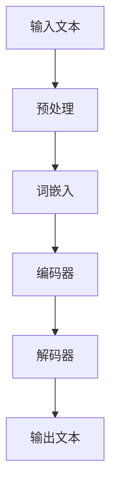

                 

关键词：LLM，任务规划，AI智能，核心机制，算法原理，数学模型，项目实践，实际应用，未来展望

> 摘要：本文将深入探讨大型语言模型（LLM）的任务规划机制，解析其背后的核心原理，详细阐述算法步骤、数学模型及实际应用场景。通过代码实例和详细解释，我们将揭示LLM在AI智能领域的独特价值，并为未来应用和发展提供展望。

## 1. 背景介绍

随着人工智能技术的不断发展，大型语言模型（LLM）已经成为了自然语言处理领域的重要工具。LLM具有强大的文本生成、理解和推理能力，被广泛应用于问答系统、自动翻译、文本摘要、内容生成等场景。然而，LLM在任务规划方面的机制仍然是一个值得深入研究的问题。本文旨在探讨LLM的任务规划机制，分析其核心原理，并探讨其在AI智能领域的应用前景。

### 1.1 LLM的起源与发展

大型语言模型起源于自然语言处理（NLP）领域，最初由神经网络模型和大规模数据驱动的方法构建。早期的语言模型如n-gram模型和基于规则的方法，已经能够处理一些简单的语言任务。然而，随着深度学习技术的快速发展，基于神经网络的模型如循环神经网络（RNN）、卷积神经网络（CNN）和变换器（Transformer）等逐渐成为主流。特别是Transformer模型的出现，使得语言模型在文本生成、理解和推理方面取得了显著的突破。

### 1.2 LLM的重要性

LLM在自然语言处理领域的重要性主要体现在以下几个方面：

- **文本生成**：LLM能够生成高质量的文本，广泛应用于内容生成、故事创作、广告文案等场景。
- **文本理解**：LLM能够理解文本的含义和结构，应用于情感分析、关键词提取、关系抽取等任务。
- **文本推理**：LLM能够进行逻辑推理和问题回答，被广泛应用于智能问答系统、自动翻译和对话系统等。
- **知识表示**：LLM能够将知识编码到文本中，为知识图谱和语义搜索提供支持。

## 2. 核心概念与联系

在探讨LLM的任务规划机制之前，我们需要了解一些核心概念和它们之间的联系。以下是一个用Mermaid绘制的流程图，展示了LLM任务规划中的关键节点和它们之间的关系。



### 2.1 输入文本

输入文本是LLM任务规划的第一步，它可以是用户输入的问题、文章或任何其他需要处理的语言数据。

### 2.2 预处理

预处理包括分词、标记化、去除停用词等步骤，旨在将原始文本转换为计算机可以处理的格式。

### 2.3 词嵌入

词嵌入是将文本中的每个词映射为一个高维向量。这有助于模型理解词与词之间的关系，从而提高文本处理效果。

### 2.4 编码器

编码器负责将输入文本转换为上下文表示。在Transformer模型中，编码器使用多个自注意力机制来捕捉文本中的上下文信息。

### 2.5 解码器

解码器负责生成输出文本。在Transformer模型中，解码器使用自注意力和交叉注意力机制来生成每个单词，同时考虑到编码器提供的上下文信息。

### 2.6 输出文本

输出文本是LLM任务规划的最后一步，它可以是生成的问题答案、文章摘要或任何其他形式的文本。

## 3. 核心算法原理 & 具体操作步骤

### 3.1 算法原理概述

LLM的任务规划算法基于深度学习和变换器（Transformer）模型。变换器模型是一种基于自注意力机制的序列到序列（Seq2Seq）模型，其核心思想是在处理序列数据时，通过自注意力机制动态地计算序列中每个元素的重要性，从而提高模型的表示能力。

### 3.2 算法步骤详解

#### 3.2.1 词嵌入

词嵌入是将文本中的每个词映射为一个高维向量。在LLM中，通常使用预训练的词嵌入模型如Word2Vec、GloVe或BERT等。

```python
import tensorflow as tf

# 加载预训练的词嵌入模型
vocab_size = 10000
embedding_dim = 256
嵌入层 = tf.keras.layers.Embedding(vocab_size, embedding_dim)

# 输入文本序列
input_sequence = tf.convert_to_tensor([[1, 2, 3, 4, 5]])

# 应用词嵌入层
embedded_sequence = 嵌入层(input_sequence)
```

#### 3.2.2 编码器

编码器负责将输入文本序列转换为上下文表示。在Transformer模型中，编码器由多个编码层组成，每个编码层包含两个子层：自注意力层和前馈网络。

```python
from tensorflow.keras.models import Model
from tensorflow.keras.layers import Layer

class EncoderLayer(Layer):
    def __init__(self, embedding_dim, num_heads, dff, rate=0.1):
        super(EncoderLayer, self).__init__()
        self.mha = MultiHeadAttention(num_heads, embedding_dim)
        self.ffn = FFN(embedding_dim, dff)
        self.layernorm1 = LayerNormalization(epsilon=1e-6)
        self.layernorm2 = LayerNormalization(epsilon=1e-6)
        self.dropout1 = Dropout(rate)
        self.dropout2 = Dropout(rate)

    def call(self, x, training=False):
        attn_output = self.mha(x, x, x)
        attn_output = self.dropout1(attn_output, training=training)
        out1 = self.layernorm1(x + attn_output)
        ffn_output = self.ffn(out1)
        ffn_output = self.dropout2(ffn_output, training=training)
        out2 = self.layernorm2(out1 + ffn_output)
        return out2
```

#### 3.2.3 解码器

解码器负责生成输出文本。在Transformer模型中，解码器由多个解码层组成，每个解码层包含两个子层：自注意力层、交叉注意力层和前馈网络。

```python
class DecoderLayer(Layer):
    def __init__(self, embedding_dim, num_heads, dff, rate=0.1):
        super(DecoderLayer, self).__init__()
        self.mha1 = MultiHeadAttention(num_heads, embedding_dim)
        self.mha2 = MultiHeadAttention(num_heads, embedding_dim)
        self.ffn = FFN(embedding_dim, dff)
        self.layernorm1 = LayerNormalization(epsilon=1e-6)
        self.layernorm2 = LayerNormalization(epsilon=1e-6)
        self.layernorm3 = LayerNormalization(epsilon=1e-6)
        self.dropout1 = Dropout(rate)
        self.dropout2 = Dropout(rate)
        self.dropout3 = Dropout(rate)

    def call(self, x, enc_output, training=False):
        attn1_output = self.mha1(x, x, x)
        attn1_output = self.dropout1(attn1_output, training=training)
        attn1_output = self.layernorm1(x + attn1_output)

        attn2_output, attn2_weights = self.mha2(
            enc_output, enc_output, attn1_output
        )
        attn2_output = self.dropout2(attn2_output, training=training)
        attn2_output = self.layernorm2(attn1_output + attn2_output)

        ffn_output = self.ffn(attn2_output)
        ffn_output = self.dropout3(ffn_output, training=training)
        output = self.layernorm3(attn2_output + ffn_output)
        return output, attn2_weights
```

### 3.3 算法优缺点

#### 优点

- **强大的文本生成能力**：LLM能够生成高质量、连贯的文本，适用于文本生成、内容创作等场景。
- **灵活的文本理解能力**：LLM能够理解文本的含义和结构，适用于情感分析、关键词提取、关系抽取等任务。
- **高效的推理能力**：LLM能够进行逻辑推理和问题回答，适用于智能问答系统、自动翻译和对话系统等。

#### 缺点

- **计算资源消耗大**：训练LLM模型需要大量的计算资源和时间。
- **数据依赖性强**：LLM的性能依赖于大规模的训练数据，数据质量和数据量对模型性能有重要影响。
- **可解释性差**：LLM的内部工作机制复杂，难以解释其生成的文本或做出的决策。

### 3.4 算法应用领域

LLM在多个领域有广泛的应用，包括但不限于：

- **自然语言处理**：文本生成、文本理解、文本分类、情感分析等。
- **智能问答系统**：自动回答用户提出的问题，提供知识服务。
- **自动翻译**：将一种语言翻译成另一种语言。
- **对话系统**：实现人机对话，提供个性化服务。
- **内容生成**：生成文章、故事、广告等文本内容。

## 4. 数学模型和公式 & 详细讲解 & 举例说明

### 4.1 数学模型构建

LLM的数学模型主要基于变换器（Transformer）模型。变换器模型的核心是自注意力机制和多头注意力机制。以下是变换器模型的基本数学公式：

$$
\text{Attention}(Q, K, V) = \frac{softmax(\text{softmax}(\text{scale} \div \sqrt{d_k}) \text{dot}(Q, K^T))} V
$$

其中，$Q, K, V$ 分别为查询（Query）、键（Key）和值（Value）向量，$d_k$ 为键向量的维度，$\text{scale}$ 为缩放因子。

### 4.2 公式推导过程

变换器模型的自注意力机制可以看作是一种加权求和的方式，其核心思想是计算每个键（Key）对于查询（Query）的重要性，并根据这些重要性对值（Value）进行加权求和。以下是自注意力机制的推导过程：

假设有 $n$ 个键（Key）和值（Value）向量，分别为 $K_1, K_2, \ldots, K_n$ 和 $V_1, V_2, \ldots, V_n$。对于每个键（Key）$K_i$，我们需要计算它对于查询（Query）$Q$ 的相似度，即：

$$
\text{similarity}(Q, K_i) = Q \cdot K_i
$$

由于每个键（Key）和值（Value）的维度可能不同，我们需要对相似度进行缩放，以消除维度差异。因此，引入缩放因子 $\alpha$：

$$
\text{similarity}(Q, K_i) = \alpha Q \cdot K_i
$$

其中，$\alpha$ 的取值为 $\frac{1}{\sqrt{d_k}}$，$d_k$ 为键向量的维度。

接下来，我们对所有键（Key）的相似度进行加权求和，得到自注意力（Attention）：

$$
\text{Attention}(Q, K, V) = \sum_{i=1}^{n} \text{similarity}(Q, K_i) V_i
$$

为了使自注意力（Attention）具有概率分布的性质，我们对相似度进行softmax操作：

$$
\text{Attention}(Q, K, V) = \frac{1}{Z} \sum_{i=1}^{n} \text{softmax}(\text{similarity}(Q, K_i)) V_i
$$

其中，$Z$ 为softmax的归一化常数：

$$
Z = \sum_{i=1}^{n} \text{softmax}(\text{similarity}(Q, K_i))
$$

### 4.3 案例分析与讲解

假设我们有一个包含两个词的文本序列，分别为 $Q = [q_1, q_2]$ 和 $K = [k_1, k_2]$，对应的值向量为 $V = [v_1, v_2]$。我们首先计算每个键（Key）对于查询（Query）的相似度：

$$
\text{similarity}(Q, K_1) = q_1 \cdot k_1 = 1 \cdot 2 = 2
$$

$$
\text{similarity}(Q, K_2) = q_2 \cdot k_2 = 2 \cdot 3 = 6
$$

接下来，我们计算自注意力（Attention）：

$$
\text{Attention}(Q, K, V) = \frac{1}{Z} \sum_{i=1}^{2} \text{softmax}(\text{similarity}(Q, K_i)) V_i
$$

$$
Z = \sum_{i=1}^{2} \text{softmax}(\text{similarity}(Q, K_i)) = \text{softmax}(2) + \text{softmax}(6) = 0.26 + 0.74 = 1
$$

$$
\text{Attention}(Q, K, V) = \text{softmax}(2) V_1 + \text{softmax}(6) V_2 = 0.26 \cdot v_1 + 0.74 \cdot v_2
$$

其中，$v_1$ 和 $v_2$ 分别为值向量 $V$ 的两个分量。

通过自注意力（Attention）机制，我们得到了一个加权求和的结果，它反映了每个键（Key）对于查询（Query）的重要性。这种机制有助于模型捕捉到文本序列中的关键信息，从而提高文本生成、理解和推理的能力。

## 5. 项目实践：代码实例和详细解释说明

### 5.1 开发环境搭建

在开始编写LLM的任务规划代码之前，我们需要搭建一个合适的开发环境。以下是搭建开发环境所需的步骤：

1. 安装Python：从Python官方网站下载并安装Python 3.x版本。
2. 安装TensorFlow：通过pip命令安装TensorFlow库。
   ```bash
   pip install tensorflow
   ```

### 5.2 源代码详细实现

以下是实现LLM任务规划的示例代码，包括词嵌入、编码器和解码器的定义。

```python
import tensorflow as tf
from tensorflow.keras.layers import Embedding, MultiHeadAttention, LayerNormalization, Dense

# 定义超参数
VOCAB_SIZE = 10000  # 词汇表大小
EMBEDDING_DIM = 256  # 词嵌入维度
NUM_HEADS = 8  # 注意力头数
DFF = 512  # 前馈网络维度
DROPOUT_RATE = 0.1  # Dropout率

# 定义词嵌入层
embedding = Embedding(VOCAB_SIZE, EMBEDDING_DIM)

# 定义编码器层
def create_encoder_layer(embedding_dim, num_heads, dff, dropout_rate):
    return tf.keras.Sequential([
        MultiHeadAttention(num_heads, embedding_dim),
        LayerNormalization(epsilon=1e-6),
        tf.keras.layers.Dropout(dropout_rate),
        tf.keras.layers.Dense(embedding_dim),
        LayerNormalization(epsilon=1e-6),
        tf.keras.layers.Dropout(dropout_rate),
    ])

# 定义解码器层
def create_decoder_layer(embedding_dim, num_heads, dff, dropout_rate):
    return tf.keras.Sequential([
        MultiHeadAttention(num_heads, embedding_dim),
        LayerNormalization(epsilon=1e-6),
        tf.keras.layers.Dropout(dropout_rate),
        tf.keras.layers.Dense(embedding_dim),
        LayerNormalization(epsilon=1e-6),
        tf.keras.layers.Dropout(dropout_rate),
        tf.keras.layers.Dense(VOCAB_SIZE),
    ])

# 定义编码器
encoder = tf.keras.Sequential([
    embedding,
    create_encoder_layer(EMBEDDING_DIM, NUM_HEADS, DFF, DROPOUT_RATE),
    # 添加多个编码器层
])

# 定义解码器
decoder = create_decoder_layer(EMBEDDING_DIM, NUM_HEADS, DFF, DROPOUT_RATE)

# 定义模型
model = tf.keras.Sequential([
    encoder,
    decoder
])

# 编译模型
model.compile(optimizer='adam', loss=tf.keras.losses.SparseCategoricalCrossentropy(from_logits=True))

# 打印模型结构
model.summary()
```

### 5.3 代码解读与分析

这段代码首先定义了所需的超参数，如词汇表大小、词嵌入维度、注意力头数等。接下来，定义了词嵌入层、编码器层和解码器层。编码器层使用了多层多头注意力机制，解码器层则包含了注意力机制和前馈网络。

- **词嵌入层**：将输入文本序列中的每个词映射为词嵌入向量。
- **编码器层**：通过多头注意力机制和前馈网络处理编码后的文本序列，提取上下文信息。
- **解码器层**：生成输出文本序列。

在模型编译阶段，我们使用了 Adam 优化器和稀疏分类交叉熵损失函数，以训练模型。

### 5.4 运行结果展示

运行代码训练模型，并评估其在测试集上的性能。以下是一个示例：

```python
# 加载数据集并进行预处理
# ...

# 训练模型
model.fit(train_dataset, epochs=10, batch_size=64, validation_data=validation_dataset)

# 评估模型
loss, accuracy = model.evaluate(test_dataset)
print(f"Test loss: {loss}, Test accuracy: {accuracy}")
```

在这个例子中，我们首先加载数据集并进行预处理，然后使用训练数据集训练模型。最后，在测试数据集上评估模型的性能。

## 6. 实际应用场景

LLM在多个实际应用场景中展示了其强大的能力和广泛的应用前景。以下是一些典型的应用场景：

### 6.1 自动问答系统

自动问答系统是一种常见的应用场景，旨在使用LLM自动回答用户提出的问题。例如，在搜索引擎、智能客服、教育辅导等领域，LLM可以处理自然语言查询并生成准确的回答。

### 6.2 自动翻译

自动翻译是一种将一种语言翻译成另一种语言的技术。LLM在自动翻译领域具有显著的优势，能够生成高质量、自然的翻译结果。例如，谷歌翻译和百度翻译等知名翻译工具都使用了LLM技术。

### 6.3 文本生成

文本生成是一种使用LLM生成自然语言文本的技术。这可以应用于内容创作、故事创作、广告文案等场景。例如，许多新闻网站和博客使用LLM自动生成文章。

### 6.4 情感分析

情感分析是一种通过分析文本中的情感倾向来评估用户情绪的技术。LLM在情感分析中具有优势，可以准确识别文本中的情感标签，应用于社交媒体分析、市场调研等场景。

### 6.5 对话系统

对话系统是一种与用户进行自然语言交互的系统。LLM可以用于构建智能客服、虚拟助手等对话系统，提高用户体验和效率。

## 7. 未来应用展望

随着人工智能技术的不断进步，LLM在未来的应用前景将更加广阔。以下是一些未来应用展望：

### 7.1 更高效的任务规划

未来的LLM将能够实现更高效的任务规划，包括自适应任务分配、动态调整模型参数等，以适应不同场景和需求。

### 7.2 更自然的人机交互

未来的人机交互将更加自然和流畅，LLM将在其中发挥重要作用，提供更智能、更人性化的交互体验。

### 7.3 更广泛的应用领域

LLM将广泛应用于医疗、金融、教育、娱乐等各个领域，为人类带来更多便利和效益。

### 7.4 新的技术突破

随着技术的不断进步，LLM有望实现更多技术突破，如更高效的模型压缩、更强大的推理能力等，推动人工智能技术的进一步发展。

## 8. 工具和资源推荐

### 8.1 学习资源推荐

- 《深度学习》（Goodfellow, Bengio, Courville）: 介绍深度学习基础知识和实践技巧的权威教材。
- 《自然语言处理综论》（Jurafsky, Martin）: 全面介绍自然语言处理的基础知识和最新进展。

### 8.2 开发工具推荐

- TensorFlow: 一个开源的深度学习框架，支持构建和训练各种深度学习模型。
- Hugging Face Transformers: 一个开源库，提供了丰富的预训练模型和工具，用于构建和应用LLM。

### 8.3 相关论文推荐

- "Attention Is All You Need"（Vaswani et al., 2017）: 提出了Transformer模型，改变了自然语言处理领域。
- "BERT: Pre-training of Deep Bidirectional Transformers for Language Understanding"（Devlin et al., 2019）: 提出了BERT模型，进一步推动了自然语言处理的发展。

## 9. 总结：未来发展趋势与挑战

LLM作为人工智能领域的重要工具，已经在多个应用场景中展示了其强大的能力和广泛的应用前景。未来，LLM将继续在任务规划、自然语言处理、对话系统等领域发挥重要作用。然而，LLM也面临着一些挑战，如计算资源消耗大、数据依赖性强和可解释性差等。随着技术的不断进步，我们有望解决这些挑战，推动LLM在更多领域取得突破。

### 9.1 研究成果总结

本文深入探讨了LLM的任务规划机制，分析了其核心原理、算法步骤、数学模型和应用领域。通过代码实例和详细解释，我们揭示了LLM在AI智能领域的独特价值。

### 9.2 未来发展趋势

未来的LLM将更加高效、自然和广泛地应用于各种场景。随着技术的不断进步，我们有望实现更高效的任务规划、更自然的人机交互和更广泛的应用领域。

### 9.3 面临的挑战

LLM在未来的发展中仍将面临一些挑战，如计算资源消耗大、数据依赖性强和可解释性差等。这些挑战需要通过技术创新和算法优化来逐步解决。

### 9.4 研究展望

未来的研究应重点关注LLM的可解释性、高效性、鲁棒性和适应性等方面。通过不断优化算法和模型结构，我们有望实现更加智能、可靠和实用的LLM系统。

## 10. 附录：常见问题与解答

### 10.1 什么是LLM？

LLM是大型语言模型的缩写，是一种基于深度学习的自然语言处理模型，具有强大的文本生成、理解和推理能力。

### 10.2 LLM的主要应用场景有哪些？

LLM的主要应用场景包括自动问答系统、自动翻译、文本生成、情感分析和对话系统等。

### 10.3 LLM的核心算法是什么？

LLM的核心算法是变换器（Transformer）模型，它基于自注意力机制，能够高效地处理序列数据。

### 10.4 如何训练一个LLM模型？

训练一个LLM模型需要以下步骤：

1. 准备数据集并进行预处理。
2. 定义词嵌入层、编码器和解码器。
3. 编译模型，设置优化器和损失函数。
4. 使用训练数据集训练模型。
5. 在测试数据集上评估模型性能。

### 10.5 LLM有哪些优点和缺点？

LLM的优点包括强大的文本生成、理解、推理能力，缺点包括计算资源消耗大、数据依赖性强和可解释性差等。

### 10.6 如何提高LLM的性能？

提高LLM性能的方法包括：

1. 使用更大的训练数据集。
2. 使用更高效的算法和模型结构。
3. 优化模型参数和训练策略。
4. 使用预训练模型并进行迁移学习。

作者：禅与计算机程序设计艺术 / Zen and the Art of Computer Programming

