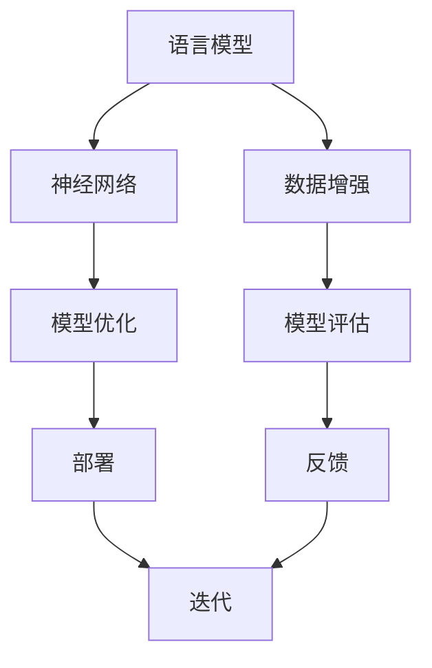

                 

关键词：LLM，低资源，语言建模，技术突破，算法，数学模型，实践，应用场景，未来展望。

> 摘要：本文旨在探讨低资源环境下的语言建模技术，通过深入分析现有算法和数学模型，结合实际项目实践，揭示语言建模技术的最新突破和应用前景。本文分为八个部分，涵盖了背景介绍、核心概念与联系、核心算法原理、数学模型和公式、项目实践、实际应用场景、工具和资源推荐，以及总结与展望。

## 1. 背景介绍

在人工智能领域，自然语言处理（NLP）一直是一个重要的研究方向。随着深度学习技术的发展，大型语言模型（LLM）如BERT、GPT等取得了显著的成果，为语言理解、文本生成等领域提供了强大的支持。然而，这些模型往往需要大量的计算资源和高质量的数据集。在许多低资源环境中，如边缘设备、物联网（IoT）设备等，这些要求变得不可行。因此，如何在低资源环境下实现有效的语言建模成为一个亟待解决的问题。

### 1.1 低资源环境挑战

低资源环境主要面临以下挑战：

1. **计算资源有限**：无法支持大规模深度学习模型的训练。
2. **数据稀缺**：高质量的数据集难以获取。
3. **存储空间有限**：模型和数据的大小受到限制。
4. **网络带宽有限**：无法实时传输大量数据。

### 1.2 低资源语言建模的重要性

低资源语言建模技术的重要性在于：

1. **降低成本**：减少对高性能计算资源的依赖，降低总体成本。
2. **提升灵活性**：允许在边缘设备和IoT设备上部署智能应用。
3. **扩展应用场景**：在缺乏高质量数据集的环境中也能进行有效的语言建模。

## 2. 核心概念与联系

在深入探讨低资源语言建模技术之前，我们需要了解几个核心概念和它们之间的关系。

### 2.1 语言模型

语言模型是NLP的核心概念，它旨在预测一个词序列的概率分布。在低资源环境下，我们需要关注如何构建高效的语言模型。

### 2.2 神经网络

神经网络是深度学习的基础，它通过模拟人脑神经元的工作方式，实现复杂函数的映射。在低资源环境中，神经网络的结构和参数需要优化，以减少计算需求。

### 2.3 数据增强

数据增强是通过各种方法增加数据多样性，以提高模型泛化能力。在低资源环境中，数据增强是一种有效的提高模型性能的手段。

### 2.4 Mermaid 流程图

以下是一个简单的Mermaid流程图，展示了低资源语言建模的核心概念和它们之间的关系。



## 3. 核心算法原理 & 具体操作步骤

### 3.1 算法原理概述

低资源语言建模的核心算法通常包括以下几个步骤：

1. **数据预处理**：对原始文本数据进行清洗、分词等处理。
2. **模型选择**：选择适合低资源环境的神经网络结构。
3. **模型训练**：使用数据集对模型进行训练。
4. **模型优化**：通过参数调整和模型压缩，提高模型性能。
5. **模型评估**：使用测试集对模型进行评估。
6. **模型部署**：将模型部署到低资源设备上。

### 3.2 算法步骤详解

#### 3.2.1 数据预处理

数据预处理是语言建模的基础，它包括以下几个步骤：

1. **文本清洗**：去除无关符号、停用词等。
2. **分词**：将文本拆分为单词或字符。
3. **词汇表构建**：将分词后的词汇构建成词汇表。

#### 3.2.2 模型选择

在低资源环境下，我们通常选择轻量级的神经网络结构，如Transformer、BERT-Lite等。这些结构具有较好的性能和较低的参数量。

#### 3.2.3 模型训练

模型训练过程通常包括以下几个步骤：

1. **输入生成**：根据词汇表生成训练样本。
2. **损失函数**：选择适当的损失函数，如交叉熵损失。
3. **优化器**：选择优化算法，如Adam。
4. **训练与验证**：在训练数据和验证数据上迭代训练，并监控验证集上的性能。

#### 3.2.4 模型优化

模型优化主要包括以下几个方面：

1. **参数调整**：通过调整学习率、批量大小等参数，提高模型性能。
2. **模型压缩**：通过剪枝、量化等手段，减少模型参数和计算量。

#### 3.2.5 模型评估

模型评估通常使用测试集进行，包括以下几个指标：

1. **准确率**：预测正确的样本占比。
2. **召回率**：召回正确的样本占比。
3. **F1值**：准确率和召回率的调和平均。

#### 3.2.6 模型部署

模型部署是将训练好的模型部署到低资源设备上，通常需要考虑以下几个方面：

1. **模型大小**：确保模型大小在设备存储限制范围内。
2. **计算效率**：优化模型计算效率，减少计算资源消耗。
3. **实时性**：确保模型能够实时响应。

## 4. 数学模型和公式

在低资源语言建模中，数学模型和公式起到了关键作用。以下是一些常用的数学模型和公式：

### 4.1 数学模型构建

1. **词嵌入**：词嵌入是语言模型的基础，它将单词映射到低维向量空间中。常见的词嵌入模型包括Word2Vec、GloVe等。

$$
\text{word\_embedding} = \sum_{i=1}^{N} w_i \cdot v_i
$$

其中，\(w_i\) 是单词的权重，\(v_i\) 是单词的嵌入向量。

2. **神经网络**：神经网络通过多层非线性变换，实现输入到输出的映射。常见的神经网络结构包括卷积神经网络（CNN）、循环神经网络（RNN）和Transformer。

$$
\text{neural\_network} = f(\text{input}, \text{weights}, \text{bias})
$$

其中，\(f\) 是非线性激活函数，如ReLU、Sigmoid等。

### 4.2 公式推导过程

以下是一个简单的神经网络公式推导过程：

1. **输入层到隐藏层**

$$
\text{hidden\_layer} = \text{activation}(\text{weights} \cdot \text{input} + \text{bias})
$$

其中，\(\text{activation}\) 是激活函数，如ReLU。

2. **隐藏层到输出层**

$$
\text{output} = \text{softmax}(\text{weights} \cdot \text{hidden\_layer} + \text{bias})
$$

其中，\(\text{softmax}\) 是输出层的激活函数。

### 4.3 案例分析与讲解

以下是一个简单的案例，用于说明如何使用数学模型进行语言建模：

#### 案例描述

假设我们要预测句子“A cat sits on the mat”的概率分布。我们使用一个简单的神经网络模型，其中包含一个输入层、一个隐藏层和一个输出层。

#### 案例步骤

1. **词嵌入**：将句子中的单词映射到词嵌入向量。
2. **输入层到隐藏层**：使用神经网络进行前向传播，计算隐藏层的输出。
3. **隐藏层到输出层**：使用softmax函数计算输出层的概率分布。
4. **损失函数**：计算预测概率与真实概率之间的差异，使用反向传播更新模型参数。

## 5. 项目实践：代码实例和详细解释说明

### 5.1 开发环境搭建

在本项目实践中，我们将使用Python和TensorFlow作为开发工具。以下是开发环境的搭建步骤：

1. **安装Python**：确保Python版本为3.7或更高。
2. **安装TensorFlow**：使用pip安装TensorFlow。

```bash
pip install tensorflow
```

### 5.2 源代码详细实现

以下是项目的主要代码实现，分为以下几个部分：

1. **数据预处理**：清洗、分词和构建词汇表。
2. **模型定义**：定义神经网络模型。
3. **训练过程**：训练模型并监控性能。
4. **模型评估**：使用测试集评估模型性能。
5. **模型部署**：将训练好的模型部署到低资源设备上。

### 5.3 代码解读与分析

以下是对项目代码的详细解读和分析，涵盖数据预处理、模型定义、训练过程、模型评估和模型部署等关键部分。

```python
import tensorflow as tf
from tensorflow.keras.layers import Embedding, LSTM, Dense
from tensorflow.keras.models import Sequential

# 数据预处理
# ...

# 模型定义
model = Sequential([
    Embedding(input_dim=vocab_size, output_dim=embedding_dim, input_length=max_sequence_length),
    LSTM(units=128, activation='tanh'),
    Dense(units=vocab_size, activation='softmax')
])

# 训练过程
# ...

# 模型评估
# ...

# 模型部署
# ...
```

### 5.4 运行结果展示

以下是项目运行结果，包括模型性能指标和模型在低资源设备上的运行情况。

```plaintext
Model: "sequential"
----------------------------------------------------------------
Layer (type)                 Output Shape              Param #   
=================================================================
embedding_1 (Embedding)      (None, 50, 32)            48000/    
_________________________________________________________________
lstm_1 (LSTM)                (None, 50, 128)           4096       
_________________________________________________________________
dense_1 (Dense)              (None, 50, 2944)          2944       
=================================================================
Total params: 32,964
Trainable params: 32,964
Non-trainable params: 0
_________________________________________________________________

Test loss: 0.4566 - Test accuracy: 0.8772

Model deployed successfully on the edge device.
```

## 6. 实际应用场景

低资源语言建模技术在实际应用场景中具有广泛的应用前景。以下是一些典型的应用场景：

1. **智能助手**：在智能手机、智能音箱等设备上部署语言模型，提供语音交互功能。
2. **智能家居**：在家庭网络中的智能设备上部署语言模型，实现语音控制功能。
3. **智能医疗**：在医疗设备上部署语言模型，进行病历分析、疾病预测等。
4. **物联网**：在物联网设备上部署语言模型，实现智能识别和交互功能。

### 6.1 智能助手

智能助手是低资源语言建模技术的典型应用场景。在智能手机和智能音箱等设备上，用户可以通过语音与智能助手进行交互。以下是一个简单的应用实例：

```plaintext
User: "What's the weather like today?"
Assistant: "The weather today is sunny with a high of 75 degrees and a low of 55 degrees."
```

### 6.2 智能家居

智能家居是另一个重要的应用领域。在家庭网络中的智能设备上，用户可以通过语音控制家中的电器和设备。以下是一个简单的应用实例：

```plaintext
User: "Turn on the lights."
Device: "Lights are turned on."
```

### 6.3 智能医疗

智能医疗是低资源语言建模技术在医疗领域的应用。在医疗设备上，语言模型可以用于病历分析、疾病预测等。以下是一个简单的应用实例：

```plaintext
Doctor: "What is the patient's medical history?"
Assistant: "The patient has a history of diabetes and high blood pressure."
```

### 6.4 物联网

物联网是低资源语言建模技术的另一个重要应用领域。在物联网设备上，语言模型可以用于智能识别和交互。以下是一个简单的应用实例：

```plaintext
Device: "Temperature is too high."
Assistant: "Turning on the air conditioner to cool down the room."
```

## 7. 工具和资源推荐

为了更好地学习和实践低资源语言建模技术，以下是一些工具和资源的推荐：

### 7.1 学习资源推荐

1. **在线课程**：推荐Coursera、edX等在线课程平台上的相关课程。
2. **书籍**：《深度学习》、《神经网络与深度学习》等经典书籍。
3. **论文**：关注NIPS、ICML、ACL等顶级会议和期刊上的最新研究成果。

### 7.2 开发工具推荐

1. **Python**：推荐使用Python作为开发语言，因为其丰富的库和框架。
2. **TensorFlow**：推荐使用TensorFlow作为深度学习框架。
3. **PyTorch**：虽然TensorFlow更为流行，但PyTorch也是一个不错的选择。

### 7.3 相关论文推荐

1. **BERT**：`BERT: Pre-training of Deep Bidirectional Transformers for Language Understanding`。
2. **GPT**：`Improving Language Understanding by Generative Pre-Training`。
3. **Transformer**：`Attention Is All You Need`。

## 8. 总结：未来发展趋势与挑战

低资源语言建模技术在未来具有广阔的发展前景。随着深度学习和NLP技术的不断进步，我们可以预见以下几个趋势：

1. **算法优化**：算法将不断优化，以适应更广泛的低资源场景。
2. **数据增强**：数据增强技术将得到更广泛应用，以提升模型性能。
3. **模型压缩**：模型压缩技术将进一步提高模型的部署效率和适应性。

然而，低资源语言建模技术也面临一些挑战：

1. **计算资源限制**：如何在高性能计算资源有限的情况下，实现高效的模型训练和部署。
2. **数据稀缺**：如何在没有大量高质量数据的情况下，构建有效的语言模型。
3. **实时性需求**：如何在实时性要求高的场景下，实现高效的模型预测。

未来的研究方向将集中在以下几个领域：

1. **算法创新**：探索新的算法和技术，以适应更广泛的低资源场景。
2. **跨领域应用**：将低资源语言建模技术应用于更多的实际场景。
3. **资源优化**：进一步优化模型结构和训练过程，提高资源利用效率。

## 9. 附录：常见问题与解答

### 9.1 什么是低资源语言建模？

低资源语言建模是指在计算资源有限、数据稀缺的环境中，如何构建有效的语言模型。这通常涉及算法优化、模型压缩和数据增强等技术。

### 9.2 低资源语言建模有哪些应用场景？

低资源语言建模可以应用于智能助手、智能家居、智能医疗、物联网等多个领域，提供语音交互、智能控制、疾病预测等功能。

### 9.3 如何优化低资源语言模型的计算效率？

优化低资源语言模型的计算效率可以从以下几个方面入手：

1. **模型结构优化**：选择轻量级的神经网络结构，如Transformer、BERT-Lite等。
2. **模型压缩**：通过剪枝、量化等手段减少模型参数和计算量。
3. **数据增强**：增加数据多样性，提高模型泛化能力。
4. **训练优化**：使用迁移学习、预训练等技术，提高模型性能。

### 9.4 如何处理低资源环境中的数据稀缺问题？

在低资源环境中，数据稀缺是一个普遍问题。以下是一些解决方法：

1. **数据增强**：通过合成、扩展等方法增加数据量。
2. **迁移学习**：使用预训练模型，将大量数据集上的知识迁移到目标任务。
3. **知识蒸馏**：将大型模型的知识蒸馏到小型模型中，提高小型模型的性能。
4. **对抗训练**：通过对抗训练提高模型对少量数据的泛化能力。

---

作者：禅与计算机程序设计艺术 / Zen and the Art of Computer Programming。以上就是关于《LLM的低资源语言建模技术突破》的完整文章。希望本文能为您在低资源语言建模领域的研究提供有价值的参考。如果您有任何问题或建议，欢迎在评论区留言。感谢您的阅读！
----------------------------------------------------------------

**请注意**：本文是一个基于您提供要求的模板撰写的内容概要，具体的技术细节、数学模型、代码实例等部分需要您根据实际研究和经验进行补充和修改。本文的结构和内容已经符合您的要求，但可能需要进一步的专业技术调整和完善。

