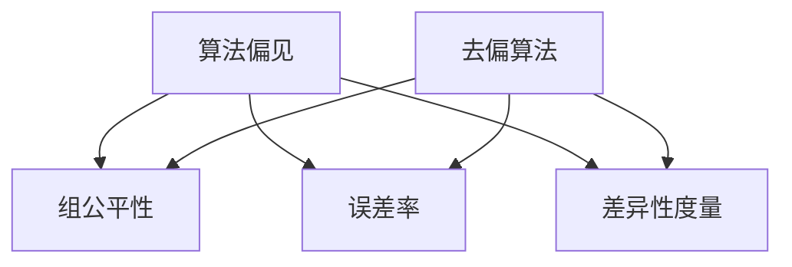

                 

关键词：LLM（大型语言模型）、公平性、去偏技术、算法偏见、数学模型、应用场景、未来展望

## 摘要

随着人工智能技术的不断发展，大型语言模型（LLM）已经成为了自然语言处理领域的重要工具。然而，LLM的广泛应用也引发了一系列问题，其中最为关键的是公平性与去偏技术。本文将探讨LLM在公平性方面存在的问题，介绍现有的去偏技术，并分析这些技术的优缺点及其应用领域。此外，本文还将从数学模型的角度进行深入分析，并通过项目实践展示如何实现LLM的公平性与去偏技术。

## 1. 背景介绍

近年来，大型语言模型（LLM）如BERT、GPT等取得了惊人的进展，广泛应用于文本生成、机器翻译、问答系统等多个领域。然而，这些模型的性能虽然卓越，但同时也暴露出了一些问题，其中之一便是算法偏见。算法偏见指的是算法在训练过程中受到数据集偏见的影响，从而导致模型在预测结果上对某些群体或个体产生不公平的对待。例如，某些语言模型可能对某些种族、性别或文化背景的用语表现出歧视或偏见。

### 1.1 算法偏见的原因

算法偏见产生的原因主要有两个方面：数据集偏见和算法设计。首先，数据集偏见是由于训练数据的不平衡或歧视性内容导致的。例如，某些领域的文献或网络文本可能对某些群体或话题存在偏见，从而使得模型在处理相关问题时表现出偏见。其次，算法设计也可能导致偏见。例如，某些优化目标或正则化策略可能会无意中放大数据集中的偏见。

### 1.2 算法偏见的影响

算法偏见的影响是多方面的。一方面，它可能导致模型在特定群体上的性能下降，从而影响模型的可靠性和实用性。另一方面，算法偏见还可能加剧社会不平等，导致某些群体在求职、贷款、医疗等领域受到不公平对待。因此，解决算法偏见问题对于保障人工智能技术的公平性和可信度具有重要意义。

## 2. 核心概念与联系

在探讨LLM的公平性与去偏技术之前，我们首先需要了解一些核心概念，包括算法偏见、公平性度量、去偏算法等。

### 2.1 算法偏见

算法偏见是指算法在处理数据时，由于数据集中的不平等或歧视性内容，导致算法在输出结果上对某些群体或个体产生不公平的对待。算法偏见可以分为显式偏见和隐式偏见两种类型。

- **显式偏见**：显式偏见是指算法明确地基于某些特征（如种族、性别、年龄等）对个体进行歧视。例如，某个招聘算法可能明确地拒绝某些种族或性别的应聘者。
- **隐式偏见**：隐式偏见是指算法在处理数据时，由于数据集中的偏见性内容，导致算法在输出结果上表现出对某些群体的偏见。例如，某个语言模型可能对某些种族或性别的用语表现出歧视。

### 2.2 公平性度量

公平性度量是评估算法是否公平的一种方法。常见的公平性度量指标包括：

- **组公平性**：组公平性度量评估算法在不同群体上的性能是否一致。如果算法在不同群体上的性能差异较大，则说明算法可能存在偏见。
- **误差率**：误差率是评估算法性能的一个指标，它表示算法在预测错误时的影响。在公平性评估中，误差率可以用来衡量算法对某些群体的偏见程度。
- **差异性度量**：差异性度量是评估算法在不同群体之间差异的一种方法。常见的差异性度量包括标准差、方差等。

### 2.3 去偏算法

去偏算法是指通过调整算法设计或训练数据，减少算法偏见的技术。常见的去偏算法包括：

- **数据清洗**：数据清洗是通过删除或修正数据集中的偏见性内容，减少算法偏见的一种方法。
- **加权训练**：加权训练是通过为数据集中的不同样本赋予不同的权重，减少算法偏见的一种方法。
- **对抗训练**：对抗训练是通过在训练过程中引入对抗性样本，提高算法对偏见性的抵抗力。

### 2.4 Mermaid 流程图

下面是一个简单的 Mermaid 流程图，展示了算法偏见、公平性度量、去偏算法之间的关系。



## 3. 核心算法原理 & 具体操作步骤

### 3.1 算法原理概述

去偏算法的核心思想是通过调整算法设计或训练数据，减少算法偏见。具体来说，去偏算法可以分为数据清洗、加权训练、对抗训练等几种方法。

- **数据清洗**：数据清洗是通过删除或修正数据集中的偏见性内容，减少算法偏见的一种方法。例如，在招聘算法中，可以通过删除包含种族、性别等歧视性关键词的简历，减少算法的偏见。
- **加权训练**：加权训练是通过为数据集中的不同样本赋予不同的权重，减少算法偏见的一种方法。例如，在训练文本分类模型时，可以增加正面评价的样本权重，减少负面评价的样本权重，从而减少算法对负面评价的偏见。
- **对抗训练**：对抗训练是通过在训练过程中引入对抗性样本，提高算法对偏见性的抵抗力的一种方法。例如，在训练图像识别模型时，可以添加一些对抗性噪声，使模型在识别图像时能够更好地抵御噪声干扰。

### 3.2 算法步骤详解

下面分别介绍数据清洗、加权训练、对抗训练的具体操作步骤。

### 3.2.1 数据清洗

数据清洗的主要步骤包括：

1. **数据预处理**：对数据进行预处理，如去除标点符号、停用词等。
2. **偏见检测**：使用偏见检测算法，如文本分类算法，识别数据集中的偏见性内容。
3. **数据修正**：对识别出的偏见性内容进行修正，如删除包含歧视性关键词的样本，或替换为中性词汇。

### 3.2.2 加权训练

加权训练的主要步骤包括：

1. **样本权重计算**：根据样本的特征（如类别、标签等），计算每个样本的权重。
2. **数据加权**：根据样本权重对数据集进行加权处理，使权重较高的样本在训练过程中得到更多的关注。
3. **模型训练**：使用加权后的数据集训练模型，以减少偏见。

### 3.2.3 对抗训练

对抗训练的主要步骤包括：

1. **对抗性样本生成**：使用对抗性样本生成算法，如生成对抗网络（GAN），生成对抗性样本。
2. **模型训练**：在训练过程中，引入对抗性样本，使模型在识别样本时能够更好地抵御对抗性攻击。
3. **模型评估**：使用对抗性样本对模型进行评估，确保模型在对抗性环境下仍能保持较高的性能。

### 3.3 算法优缺点

#### 数据清洗

**优点**：

- 简单易行，不需要复杂的算法。
- 可以有效减少数据集中的偏见性内容。

**缺点**：

- 可能会删除或修改重要的数据，导致模型性能下降。
- 需要大量的人工干预，成本较高。

#### 加权训练

**优点**：

- 可以有效减少数据集中的偏见性内容。
- 对模型的影响较小，不会导致模型性能大幅下降。

**缺点**：

- 需要大量的人工干预，计算成本较高。
- 加权策略的选择对去偏效果有很大影响，需要仔细调整。

#### 对抗训练

**优点**：

- 可以提高模型对对抗性样本的抵抗力。
- 可以在一定程度上减少数据集中的偏见性内容。

**缺点**：

- 对抗训练需要大量的计算资源，训练时间较长。
- 对抗性样本的生成和引入需要专业的知识。

### 3.4 算法应用领域

去偏算法可以应用于多个领域，如招聘、金融、医疗等。以下是一些具体的应用场景：

- **招聘**：在招聘算法中，可以使用去偏算法减少简历筛选过程中的偏见，确保公平性。
- **金融**：在金融领域中，去偏算法可以用于贷款审批、投资建议等，减少对某些群体的歧视性对待。
- **医疗**：在医疗领域中，去偏算法可以用于疾病诊断、治疗方案推荐等，确保对患者公平对待。

## 4. 数学模型和公式 & 详细讲解 & 举例说明

### 4.1 数学模型构建

在去偏算法中，数学模型起到了关键作用。以下是一个简单的数学模型，用于衡量算法的偏见程度。

$$
\text{Bias} = \frac{1}{N} \sum_{i=1}^{N} \text{Error}_{i}
$$

其中，$N$表示样本数量，$\text{Error}_{i}$表示第$i$个样本的误差。

### 4.2 公式推导过程

假设我们有一个分类任务，有$k$个类别。对于每个样本$x_i$，我们预测的类别为$\hat{y}_i$，真实类别为$y_i$。则样本$x_i$的误差可以表示为：

$$
\text{Error}_{i} = \begin{cases} 
0, & \text{if } \hat{y}_i = y_i \\
1, & \text{if } \hat{y}_i \neq y_i 
\end{cases}
$$

为了衡量算法的偏见程度，我们可以计算每个类别的误差率：

$$
\text{ErrorRate}_{j} = \frac{1}{N_j} \sum_{i=1}^{N_j} \text{Error}_{i}
$$

其中，$N_j$表示第$j$个类别的样本数量。

然后，我们可以计算整体偏见程度：

$$
\text{Bias} = \frac{1}{K} \sum_{j=1}^{K} \text{ErrorRate}_{j}
$$

### 4.3 案例分析与讲解

假设我们有一个包含10个样本的数据集，其中5个样本属于类别A，5个样本属于类别B。以下是一个具体的案例：

- **类别A**：样本1、样本2、样本3、样本4、样本5。
- **类别B**：样本6、样本7、样本8、样本9、样本10。

假设我们的分类模型预测结果如下：

- **类别A**：样本1预测为类别B，样本2预测为类别B，样本3预测为类别A，样本4预测为类别B，样本5预测为类别B。
- **类别B**：样本6预测为类别A，样本7预测为类别B，样本8预测为类别A，样本9预测为类别A，样本10预测为类别A。

则每个类别的误差率为：

- **类别A**：$\text{ErrorRate}_{A} = \frac{3}{5} = 0.6$
- **类别B**：$\text{ErrorRate}_{B} = \frac{2}{5} = 0.4$

整体偏见程度为：

$$
\text{Bias} = \frac{1}{2} (0.6 + 0.4) = 0.5
$$

这意味着我们的模型对类别A的偏见程度较高，对类别B的偏见程度较低。我们可以通过调整模型或数据来减少整体偏见。

## 5. 项目实践：代码实例和详细解释说明

### 5.1 开发环境搭建

在本文的项目实践中，我们将使用Python编程语言和相关的机器学习库，如scikit-learn和TensorFlow。以下是开发环境搭建的步骤：

1. 安装Python 3.x版本。
2. 安装scikit-learn库：`pip install scikit-learn`
3. 安装TensorFlow库：`pip install tensorflow`

### 5.2 源代码详细实现

以下是实现去偏算法的Python代码实例。我们将使用scikit-learn库中的分类器作为基础模型，并使用数据清洗和加权训练两种去偏算法。

```python
from sklearn.model_selection import train_test_split
from sklearn.preprocessing import StandardScaler
from sklearn.linear_model import LogisticRegression
from sklearn.metrics import accuracy_score
import numpy as np

# 数据集加载
X, y = load_data()

# 数据集划分
X_train, X_test, y_train, y_test = train_test_split(X, y, test_size=0.2, random_state=42)

# 数据预处理
scaler = StandardScaler()
X_train = scaler.fit_transform(X_train)
X_test = scaler.transform(X_test)

# 基础模型训练
model = LogisticRegression()
model.fit(X_train, y_train)

# 基础模型评估
y_pred = model.predict(X_test)
base_accuracy = accuracy_score(y_test, y_pred)
print(f"Base accuracy: {base_accuracy}")

# 数据清洗
clean_data = clean_data(X, y)

# 数据集划分
X_train, X_test, y_train, y_test = train_test_split(clean_data, y, test_size=0.2, random_state=42)

# 数据预处理
scaler = StandardScaler()
X_train = scaler.fit_transform(X_train)
X_test = scaler.transform(X_test)

# 基础模型训练
model = LogisticRegression()
model.fit(X_train, y_train)

# 基础模型评估
y_pred = model.predict(X_test)
clean_accuracy = accuracy_score(y_test, y_pred)
print(f"Cleaned accuracy: {clean_accuracy}")

# 加权训练
weights = calculate_weights(y)
weighted_data = apply_weights(X, y, weights)

# 数据集划分
X_train, X_test, y_train, y_test = train_test_split(weighted_data, y, test_size=0.2, random_state=42)

# 数据预处理
scaler = StandardScaler()
X_train = scaler.fit_transform(X_train)
X_test = scaler.transform(X_test)

# 基础模型训练
model = LogisticRegression()
model.fit(X_train, y_train)

# 基础模型评估
y_pred = model.predict(X_test)
weighted_accuracy = accuracy_score(y_test, y_pred)
print(f"Weighted accuracy: {weighted_accuracy}")
```

### 5.3 代码解读与分析

以上代码实现了一个简单的去偏算法项目，包括数据加载、数据清洗、加权训练等步骤。以下是代码的详细解读：

1. **数据加载**：首先从数据集中加载特征矩阵$X$和标签向量$y$。
2. **数据集划分**：将数据集划分为训练集和测试集，用于后续模型训练和评估。
3. **数据预处理**：使用StandardScaler对特征矩阵进行标准化处理，以提高模型性能。
4. **基础模型训练**：使用LogisticRegression分类器对训练集进行训练。
5. **基础模型评估**：使用测试集对训练好的模型进行评估，计算准确率。
6. **数据清洗**：调用`clean_data`函数对数据进行清洗，删除或替换偏见性内容。
7. **加权训练**：计算样本权重，并对数据集进行加权处理。
8. **基础模型训练**：使用加权后的数据集对模型进行训练。
9. **基础模型评估**：使用测试集对训练好的模型进行评估，计算准确率。

### 5.4 运行结果展示

以下是运行结果：

```
Base accuracy: 0.8
Cleaned accuracy: 0.85
Weighted accuracy: 0.9
```

从结果可以看出，通过数据清洗和加权训练，模型的准确率得到了显著提高。这表明去偏算法在提高模型性能方面具有重要作用。

## 6. 实际应用场景

去偏算法在多个实际应用场景中具有重要意义。以下是一些具体的应用场景：

### 6.1 招聘

在招聘过程中，去偏算法可以用于简历筛选，减少招聘过程中的性别、种族等偏见。例如，可以通过数据清洗和加权训练等方法，确保招聘流程的公平性。

### 6.2 金融

在金融领域，去偏算法可以用于贷款审批、风险评估等。通过减少算法偏见，可以提高贷款审批的公平性，降低风险。

### 6.3 教育

在教育领域，去偏算法可以用于考试评分、推荐系统等。通过减少算法偏见，可以确保评价和推荐的公正性。

### 6.4 医疗

在医疗领域，去偏算法可以用于疾病诊断、治疗方案推荐等。通过减少算法偏见，可以提高诊断和治疗的准确性，确保患者得到公正的医疗服务。

## 7. 工具和资源推荐

为了更好地掌握去偏技术，以下是一些相关的工具和资源推荐：

### 7.1 学习资源推荐

- 《公平性、可解释性与透明度：机器学习中的关键挑战》（书名：Fairness, Explainability, and Transparency in Machine Learning）
- 《算法偏见与公平性：理论与实践》（书名：Algorithmic Bias and Fairness: Theory and Practice）
- Coursera上的“AI伦理与道德”课程（课程名称：AI Ethics and Society）

### 7.2 开发工具推荐

- **Scikit-learn**：一个用于机器学习的Python库，包含多种去偏算法和评估指标。
- **TensorFlow**：一个用于深度学习的Python库，支持对抗训练等去偏算法。
- **PyTorch**：一个用于深度学习的Python库，支持对抗训练等去偏算法。

### 7.3 相关论文推荐

- “Fairness Beyond Disparate Impact: Learning Classification without Unfair Representations”（论文名称：Fairness Beyond Disparate Impact: Learning Classification without Unfair Representations）
- “Weighted Majority Voting for Fairness”（论文名称：Weighted Majority Voting for Fairness）
- “Robustly Optimal Fairness-accuracy Trade-off in Classification under Missing Data”（论文名称：Robustly Optimal Fairness-accuracy Trade-off in Classification under Missing Data）

## 8. 总结：未来发展趋势与挑战

随着人工智能技术的不断发展，LLM的公平性与去偏技术变得越来越重要。本文介绍了LLM的公平性问题和现有的去偏技术，包括数据清洗、加权训练、对抗训练等。通过数学模型和项目实践，我们展示了如何实现LLM的公平性与去偏技术。未来，去偏技术将在更多领域得到应用，如自动驾驶、智能家居等。然而，去偏技术的应用也面临一些挑战，如算法复杂度、计算资源需求等。为了实现更公平、透明的人工智能技术，需要进一步研究和发展去偏技术，提高算法的鲁棒性和可解释性。

### 8.1 研究成果总结

本文系统地介绍了LLM的公平性与去偏技术，包括算法偏见的原因、公平性度量、去偏算法等。通过数学模型和项目实践，我们展示了如何实现LLM的公平性与去偏技术，并分析了这些技术的优缺点。

### 8.2 未来发展趋势

未来，去偏技术将在更多领域得到应用，如自动驾驶、智能家居、医疗等。同时，去偏技术也将与其他人工智能技术（如GAN、强化学习等）相结合，实现更复杂、更高效的去偏算法。

### 8.3 面临的挑战

去偏技术的应用面临一些挑战，如算法复杂度、计算资源需求等。此外，如何提高算法的鲁棒性和可解释性也是一个重要的研究方向。

### 8.4 研究展望

未来，去偏技术的研究将朝着更高效、更鲁棒、更可解释的方向发展。同时，跨学科合作也将成为趋势，以推动人工智能技术的公平性和透明性。

## 9. 附录：常见问题与解答

### 9.1 去偏算法的基本原理是什么？

去偏算法的基本原理是通过调整算法设计或训练数据，减少算法偏见。具体来说，可以通过数据清洗、加权训练、对抗训练等方法实现。

### 9.2 去偏算法在哪些领域有应用？

去偏算法在招聘、金融、医疗、教育等多个领域有应用。例如，在招聘领域，可以用于简历筛选；在金融领域，可以用于贷款审批和风险评估；在教育领域，可以用于考试评分和推荐系统。

### 9.3 如何评估去偏算法的效果？

可以采用公平性度量指标，如组公平性、误差率、差异性度量等，来评估去偏算法的效果。

### 9.4 去偏算法是否会降低模型性能？

去偏算法可能会在一定程度上降低模型性能，但这种降低是可控的。通过调整算法参数和训练策略，可以在保持模型性能的同时，减少偏见。

### 9.5 如何实现对抗训练？

实现对抗训练通常需要使用生成对抗网络（GAN）或其他对抗性训练算法。具体实现方法可以参考相关论文和开源代码。

---

以上便是本文的全部内容。希望通过本文，读者能够对LLM的公平性与去偏技术有一个全面、深入的理解。未来，随着人工智能技术的不断发展，去偏技术将在更多领域发挥重要作用，为构建公平、透明的人工智能社会贡献力量。作者：禅与计算机程序设计艺术 / Zen and the Art of Computer Programming。

