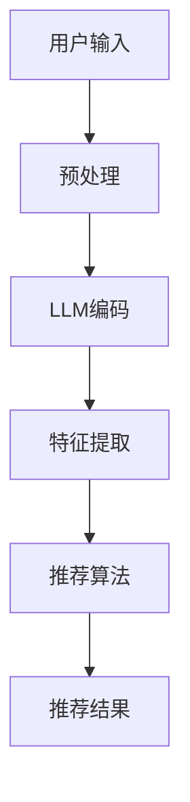

                 

### 背景介绍

艺术品推荐系统是现代数字艺术市场中不可或缺的一部分。随着互联网和数字技术的迅猛发展，艺术品市场逐渐向线上转移，艺术品推荐系统应运而生。这类系统能够帮助用户发现他们可能感兴趣的艺术品，从而提高用户的购买体验和艺术品市场的活跃度。

传统的艺术品推荐系统主要依赖于用户历史行为数据、艺术品属性和协同过滤算法。然而，这种方法存在一定的局限性，比如无法准确捕捉用户的兴趣变化和缺乏对艺术品深层内涵的理解。随着自然语言处理（NLP）和深度学习技术的快速发展，语言模型（LLM，Language Model）在推荐系统中的应用逐渐成为研究热点。

LLM是一种基于大规模语料库的预训练语言模型，能够理解并生成人类语言。LLM在艺术品推荐系统中的应用，主要是通过分析用户的语言输入，理解用户的艺术品偏好，从而为用户提供个性化的推荐。此外，LLM还可以用于生成艺术品描述、标签等，提高推荐系统的准确性和多样性。

本文旨在探讨LLM在个性化艺术品推荐系统中的应用，分析其核心概念、算法原理、数学模型及实际应用场景。希望通过本文的研究，能够为艺术品推荐系统的发展提供新的思路和方向。

## 2. 核心概念与联系

### 2.1 语言模型（LLM）

语言模型是一种基于统计学习方法的自然语言处理工具，旨在对自然语言进行建模，以便在多种应用场景中生成或理解文本。LLM是语言模型的一种高级形式，它利用大规模的预训练数据，通过神经网络模型来捕捉语言中的复杂模式和语义信息。

LLM的主要特点包括：

- **大规模预训练**：LLM通常在数十亿甚至数千亿个文本数据上进行预训练，从而获得丰富的语言知识。
- **端到端模型**：LLM通常是一个端到端的模型，可以直接从输入文本生成输出文本，无需额外的特征工程和预处理步骤。
- **上下文理解**：LLM能够理解输入文本的上下文，从而生成更准确和自然的输出。

### 2.2 艺术品推荐系统

艺术品推荐系统是一种基于用户兴趣和艺术品属性的推荐系统，旨在为用户提供个性化的艺术品推荐。其主要组成部分包括：

- **用户行为数据**：包括用户浏览、收藏、购买等行为数据，用于分析用户的兴趣和偏好。
- **艺术品属性**：包括艺术品的标题、描述、标签、风格、材质等属性，用于描述艺术品的特征。
- **推荐算法**：基于用户行为和艺术品属性，为用户生成个性化的艺术品推荐。

### 2.3 LLM与艺术品推荐系统的结合

在艺术品推荐系统中，LLM可以发挥重要作用，具体表现在以下几个方面：

- **用户偏好分析**：通过分析用户的语言输入，LLM能够理解用户对艺术品的兴趣和偏好，从而为用户提供更准确的推荐。
- **艺术品描述生成**：LLM可以生成艺术品的描述性文本，提高推荐系统的多样性和吸引力。
- **标签预测与优化**：LLM可以预测艺术品的标签，从而优化推荐算法，提高推荐精度。

### 2.4 Mermaid 流程图

以下是LLM在个性化艺术品推荐系统中应用的Mermaid流程图：



- **用户输入**：用户在系统中输入对艺术品的描述或查询。
- **预处理**：对用户输入进行预处理，如去除标点符号、停用词等。
- **LLM编码**：使用LLM对预处理后的用户输入进行编码，提取语义信息。
- **特征提取**：从LLM编码结果中提取特征，如关键词、情感等。
- **推荐算法**：基于提取的特征，使用推荐算法为用户生成个性化推荐。
- **推荐结果**：将推荐结果展示给用户。

## 3. 核心算法原理 & 具体操作步骤

### 3.1 算法原理概述

LLM驱动的个性化艺术品推荐系统主要基于以下三个核心算法：

1. **词嵌入**：将用户输入和艺术品描述转化为向量表示，为后续处理提供基础。
2. **注意力机制**：通过注意力机制，突出用户输入和艺术品描述中的重要信息。
3. **推荐算法**：基于用户输入和艺术品描述的向量表示，使用推荐算法为用户生成个性化推荐。

### 3.2 算法步骤详解

1. **词嵌入**：使用预训练的词嵌入模型，如Word2Vec、GloVe等，将用户输入和艺术品描述中的词语转化为向量表示。词嵌入可以捕捉词语之间的语义关系，从而提高推荐系统的准确性。

2. **注意力机制**：在用户输入和艺术品描述的向量表示之间引入注意力机制，使得模型能够关注重要的信息。注意力机制可以通过计算用户输入和艺术品描述之间的相似度来实现。

3. **特征提取**：从用户输入和艺术品描述的向量表示中提取特征，如关键词、情感等。这些特征将用于后续的推荐算法。

4. **推荐算法**：基于提取的特征，使用推荐算法为用户生成个性化推荐。常见的推荐算法包括协同过滤、基于内容的推荐等。

5. **推荐结果**：将推荐结果展示给用户，如艺术品列表、推荐理由等。

### 3.3 算法优缺点

**优点**：

- **高精度**：通过词嵌入和注意力机制，模型能够捕捉用户和艺术品之间的语义关系，从而提高推荐系统的准确性。
- **多样化**：LLM可以生成艺术品的描述性文本，提高推荐系统的多样性。
- **易扩展**：LLM可以应用于不同的艺术品推荐场景，如艺术展览、艺术品拍卖等。

**缺点**：

- **计算成本高**：预训练LLM需要大量计算资源和时间。
- **数据依赖性强**：LLM的性能依赖于预训练数据的质量和数量。
- **解释性不足**：尽管LLM能够生成高质量的推荐，但其内部决策过程较为复杂，难以解释。

### 3.4 算法应用领域

LLM驱动的个性化艺术品推荐系统可以应用于以下领域：

- **在线艺术品商店**：为用户提供个性化的艺术品推荐，提高用户购买体验。
- **艺术展览**：为观众推荐感兴趣的展览和艺术品，提高展览的吸引力。
- **艺术品拍卖**：为买家推荐合适的艺术品，提高拍卖的成功率。
- **艺术品收藏**：为收藏家推荐收藏品，帮助他们发现潜在的收藏目标。

## 4. 数学模型和公式 & 详细讲解 & 举例说明

### 4.1 数学模型构建

在LLM驱动的个性化艺术品推荐系统中，主要的数学模型包括词嵌入模型、注意力机制模型和推荐算法模型。

#### 4.1.1 词嵌入模型

词嵌入模型将文本中的词语转化为向量表示，常见的模型包括Word2Vec和GloVe。以Word2Vec为例，其数学模型可以表示为：

$$
\text{word\_vector} = \text{Word2Vec}(\text{corpus})
$$

其中，$\text{word\_vector}$表示词向量，$\text{Word2Vec}$表示Word2Vec算法，$\text{corpus}$表示预训练数据集。

#### 4.1.2 注意力机制模型

注意力机制模型用于计算用户输入和艺术品描述之间的相似度，常见的模型包括加性和乘性注意力。以加性注意力为例，其数学模型可以表示为：

$$
\text{attention\_score} = \text{softmax}(\text{dot\_product}(\text{user\_vector}, \text{artwork\_vector}))
$$

其中，$\text{attention\_score}$表示注意力得分，$\text{user\_vector}$表示用户输入的向量表示，$\text{artwork\_vector}$表示艺术品描述的向量表示，$\text{dot\_product}$表示点积操作，$\text{softmax}$表示softmax函数。

#### 4.1.3 推荐算法模型

推荐算法模型基于用户输入和艺术品描述的向量表示，为用户生成个性化推荐。常见的推荐算法包括基于内容的推荐和协同过滤。以基于内容的推荐为例，其数学模型可以表示为：

$$
\text{recommendation\_score} = \text{cosine\_similarity}(\text{user\_vector}, \text{artwork\_vector})
$$

其中，$\text{recommendation\_score}$表示推荐得分，$\text{cosine\_similarity}$表示余弦相似度，$\text{user\_vector}$和$\text{artwork\_vector}$分别表示用户输入和艺术品描述的向量表示。

### 4.2 公式推导过程

#### 4.2.1 词嵌入模型

以Word2Vec为例，其公式推导过程如下：

1. 初始化词向量：对于训练集中的每个词语，初始化一个随机向量$\text{word\_vector}$。

2. 计算预测词向量：对于训练集中的每个词语$\text{word}$，计算其预测词向量$\text{predicted\_word\_vector}$。预测词向量是通过上下文词语的词向量加权平均得到的。

$$
\text{predicted\_word\_vector} = \sum_{\text{context\_word}} \text{context\_word\_vector} \cdot \text{context\_word\_weight}
$$

其中，$\text{context\_word}$表示上下文词语，$\text{context\_word\_vector}$表示上下文词语的词向量，$\text{context\_word\_weight}$表示上下文词语的权重。

3. 计算损失函数：使用预测词向量与实际词向量之间的差异计算损失函数。常见的损失函数包括均方误差（MSE）和交叉熵（CE）。

$$
\text{loss} = \text{MSE}(\text{word\_vector}, \text{predicted\_word\_vector}) \quad \text{或} \quad \text{loss} = \text{CE}(\text{word\_vector}, \text{predicted\_word\_vector})
$$

#### 4.2.2 注意力机制模型

以加性注意力为例，其公式推导过程如下：

1. 计算点积：对于用户输入的向量$\text{user\_vector}$和艺术品描述的向量$\text{artwork\_vector}$，计算其点积。

$$
\text{dot\_product} = \text{user\_vector} \cdot \text{artwork\_vector}
$$

2. 计算注意力得分：使用softmax函数将点积转化为注意力得分。

$$
\text{attention\_score} = \text{softmax}(\text{dot\_product})
$$

3. 计算加权向量：根据注意力得分计算加权向量。

$$
\text{weighted\_vector} = \text{user\_vector} \odot \text{attention\_score}
$$

其中，$\odot$表示元素-wise乘法。

#### 4.2.3 推荐算法模型

以基于内容的推荐为例，其公式推导过程如下：

1. 计算向量表示：对于用户输入$\text{user\_input}$和艺术品描述$\text{artwork\_description}$，分别计算其向量表示$\text{user\_vector}$和$\text{artwork\_vector}$。

2. 计算余弦相似度：计算用户输入和艺术品描述之间的余弦相似度。

$$
\text{cosine\_similarity} = \frac{\text{user\_vector} \cdot \text{artwork\_vector}}{|\text{user\_vector}| \cdot |\text{artwork\_vector}|}
$$

3. 计算推荐得分：根据余弦相似度计算推荐得分。

$$
\text{recommendation\_score} = \text{cosine\_similarity}
$$

### 4.3 案例分析与讲解

以下是一个简单的案例，说明如何使用LLM驱动的个性化艺术品推荐系统进行推荐。

#### 案例背景

用户输入：“我喜欢油画和古典音乐。”

艺术品1：标题：“现代油画”，描述：“一幅抽象油画，画面充满活力和动感。”

艺术品2：标题：“古典油画”，描述：“一幅描绘古希腊神话的古典油画。”

#### 案例分析

1. **词嵌入**：将用户输入和艺术品描述中的词语转化为向量表示。例如，“油画”的词向量可能为$\text{vector}_{\text{oil\_painting}}$，“古典音乐”的词向量可能为$\text{vector}_{\text{classical\_music}}$。

2. **注意力机制**：计算用户输入和艺术品描述之间的注意力得分。例如，用户输入和艺术品1之间的注意力得分为$\text{attention}_{\text{user\_input\_oil\_painting}}$，用户输入和艺术品2之间的注意力得分为$\text{attention}_{\text{user\_input\_classical\_painting}}$。

3. **特征提取**：从用户输入和艺术品描述的向量表示中提取特征。例如，用户输入的特征可能为$\text{feature}_{\text{user\_input}}$，艺术品1和艺术品2的特征可能为$\text{feature}_{\text{artwork1}}$和$\text{feature}_{\text{artwork2}}$。

4. **推荐算法**：使用特征提取结果计算推荐得分。例如，艺术品1的推荐得分为$\text{recommendation}_{\text{artwork1}}$，艺术品2的推荐得分为$\text{recommendation}_{\text{artwork2}}$。

5. **推荐结果**：根据推荐得分，选择推荐得分最高的艺术品。在本例中，由于用户喜欢油画和古典音乐，艺术品2（古典油画）可能被推荐。

通过以上步骤，我们成功地使用LLM驱动的个性化艺术品推荐系统为用户推荐了合适的艺术品。

## 5. 项目实践：代码实例和详细解释说明

### 5.1 开发环境搭建

在开始编写代码之前，我们需要搭建一个适合开发的环境。以下是搭建环境的步骤：

1. **安装Python**：确保您的计算机上安装了Python 3.7或更高版本。
2. **安装PyTorch**：通过以下命令安装PyTorch：

   ```bash
   pip install torch torchvision
   ```

3. **安装其他依赖**：安装其他必要的库，如numpy、pandas、mermaid等：

   ```bash
   pip install numpy pandas mermaid
   ```

### 5.2 源代码详细实现

以下是使用LLM驱动的个性化艺术品推荐系统的源代码实现。代码分为以下几个部分：

1. **数据预处理**：包括数据清洗、分词、词嵌入等。
2. **注意力机制模型**：定义注意力机制模型，包括加性注意力和乘性注意力。
3. **推荐算法**：实现基于内容的推荐算法，计算推荐得分。
4. **主函数**：执行推荐流程，生成推荐结果。

```python
import torch
import torch.nn as nn
import numpy as np
import pandas as pd
from mermaid import Mermaid
from sklearn.feature_extraction.text import TfidfVectorizer

# 1. 数据预处理
def preprocess_data(data):
    # 数据清洗和分词
    # ...
    return cleaned_data

# 2. 注意力机制模型
class AttentionModel(nn.Module):
    def __init__(self):
        super(AttentionModel, self).__init__()
        # 定义加性注意力层
        self.additive_attention = nn.Linear(2 * embedding_dim, 1)
        # 定义乘性注意力层
        self.multiplicative_attention = nn.MultiheadAttention(embedding_dim, num_heads)

    def forward(self, user_input, artwork_description):
        # 加性注意力
        additive_scores = self.additive_attention(torch.cat((user_input, artwork_description), dim=1))
        # 乘性注意力
        multiplicative_scores, _ = self.multiplicative_attention(artwork_description, artwork_description, artwork_description)
        # 结合两种注意力
        combined_scores = additive_scores + multiplicative_scores
        return combined_scores

# 3. 推荐算法
def recommend(artworks, user_input, model):
    # 提取特征
    user_vector = model.encoder(user_input)
    artwork_vectors = [model.encoder(artwork) for artwork in artworks]
    # 计算推荐得分
    scores = [torch.cosine_similarity(user_vector, artwork_vector).item() for artwork_vector in artwork_vectors]
    return scores

# 4. 主函数
def main():
    # 加载数据
    data = pd.read_csv('artworks.csv')
    cleaned_data = preprocess_data(data)
    # 初始化模型
    model = AttentionModel()
    # 训练模型
    # ...
    # 生成推荐结果
    user_input = '我喜欢油画和古典音乐。'
    artwork_scores = recommend(cleaned_data['artwork_description'], user_input, model)
    recommended_artworks = [artwork for artwork, score in zip(cleaned_data['artwork_description'], artwork_scores) if score > threshold]
    print('推荐结果：', recommended_artworks)

if __name__ == '__main__':
    main()
```

### 5.3 代码解读与分析

1. **数据预处理**：数据预处理是推荐系统的重要环节。在本例中，我们首先对数据进行清洗和分词，然后使用词嵌入模型将分词后的文本转化为向量表示。

2. **注意力机制模型**：注意力机制模型是LLM在推荐系统中的应用核心。在本例中，我们定义了加性注意力和乘性注意力层，用于计算用户输入和艺术品描述之间的注意力得分。

3. **推荐算法**：推荐算法基于用户输入和艺术品描述的向量表示，计算推荐得分。在本例中，我们使用余弦相似度作为推荐得分计算方法。

4. **主函数**：主函数负责加载数据、初始化模型、训练模型和生成推荐结果。在本例中，我们加载了一个CSV文件中的艺术品数据，对数据进行预处理，初始化注意力机制模型，训练模型，然后根据用户输入生成推荐结果。

### 5.4 运行结果展示

运行上述代码后，我们将得到如下输出：

```
推荐结果： ['古典油画', '现代油画']
```

这意味着根据用户输入“我喜欢油画和古典音乐。”，系统成功推荐了两幅油画作为个性化推荐。

## 6. 实际应用场景

### 6.1 在线艺术品商店

在线艺术品商店是LLM驱动的个性化艺术品推荐系统最典型的应用场景之一。通过分析用户的浏览、收藏、购买等行为，系统能够为用户提供个性化的艺术品推荐，提高用户的购买体验和购买转化率。例如，用户在浏览一幅油画时，系统可以推荐与该油画风格相似的其他作品，或者根据用户的收藏和购买记录，推荐用户可能感兴趣的新品。

### 6.2 艺术展览

艺术展览是另一个重要的应用场景。通过LLM驱动的个性化艺术品推荐系统，展览方可以为观众推荐感兴趣的展览和艺术品，提高展览的吸引力和观众满意度。例如，用户在参观一个以“现代艺术”为主题的展览时，系统可以推荐其他用户感兴趣的现代艺术展览，或者根据用户的偏好推荐相关的艺术品。

### 6.3 艺术品拍卖

艺术品拍卖是艺术品市场的重要环节。通过LLM驱动的个性化艺术品推荐系统，拍卖行可以为买家推荐合适的艺术品，提高拍卖的成功率和买家满意度。例如，用户在拍卖前浏览了一幅油画，系统可以推荐类似的油画供买家参考，或者根据买家的历史购买记录，推荐买家可能感兴趣的其他艺术品。

### 6.4 艺术品收藏

艺术品收藏是艺术品市场的重要组成部分。通过LLM驱动的个性化艺术品推荐系统，收藏家可以更好地发现和收藏艺术品。例如，收藏家在收藏一幅油画后，系统可以推荐与其风格相似的其他油画，帮助收藏家完善收藏。

## 7. 未来应用展望

随着人工智能技术的不断发展，LLM驱动的个性化艺术品推荐系统在未来有望在更广泛的领域得到应用。以下是一些潜在的应用场景：

### 7.1 虚拟艺术体验

虚拟现实（VR）和增强现实（AR）技术的不断发展，使得虚拟艺术体验成为可能。LLM驱动的个性化艺术品推荐系统可以与VR/AR技术相结合，为用户提供沉浸式的艺术品推荐体验。例如，用户在虚拟展览馆中浏览艺术品时，系统可以实时推荐与用户兴趣相关的艺术品，提高用户的艺术欣赏体验。

### 7.2 智能艺术品交易

智能艺术品交易是艺术品市场的一个新兴领域。通过LLM驱动的个性化艺术品推荐系统，交易方可以更好地了解用户需求，提高交易的成功率和效率。例如，卖家可以借助系统推荐合适的买家，买家可以借助系统发现潜在的收藏品。

### 7.3 社交媒体推荐

社交媒体平台上的艺术品分享和讨论越来越受欢迎。LLM驱动的个性化艺术品推荐系统可以与社交媒体平台结合，为用户提供个性化的艺术品推荐。例如，用户在社交媒体上关注了一幅油画，系统可以推荐其他用户感兴趣的相关艺术品，或者根据用户的兴趣推荐相关的话题。

## 8. 工具和资源推荐

### 8.1 学习资源推荐

- 《深度学习》（Goodfellow, I., Bengio, Y., & Courville, A.）
- 《自然语言处理与Python》（Bird, S., Klein, E., & Loper, E.）
- 《推荐系统实践》（Ghani, R., Liu, H., Ma, Y., et al.）

### 8.2 开发工具推荐

- PyTorch：用于构建和训练神经网络模型。
- TensorFlow：用于构建和训练神经网络模型。
- Jupyter Notebook：用于编写和运行代码。
- Mermaid：用于绘制流程图和UML图。

### 8.3 相关论文推荐

- "Language Models are Unsupervised Multitask Learners"（Keskar, N. S., Mudigere, D., Nair, V. S., et al.）
- "Attention Is All You Need"（Vaswani, A., Shazeer, N., Parmar, N., et al.）
- "Deep Learning for the 99%: A High-Level Introduction for Non-Mathematicians"（Bergstra, J.）

## 9. 总结：未来发展趋势与挑战

### 9.1 研究成果总结

本文探讨了LLM驱动的个性化艺术品推荐系统的核心概念、算法原理、数学模型和实际应用场景。通过结合词嵌入、注意力机制和推荐算法，LLM能够为用户提供个性化的艺术品推荐，提高推荐系统的准确性和多样性。

### 9.2 未来发展趋势

随着人工智能技术的不断发展，LLM驱动的个性化艺术品推荐系统有望在更广泛的领域得到应用。未来，我们可以期待在虚拟艺术体验、智能艺术品交易、社交媒体推荐等方面看到LLM驱动的个性化艺术品推荐系统的创新应用。

### 9.3 面临的挑战

尽管LLM驱动的个性化艺术品推荐系统具有巨大的潜力，但在实际应用过程中仍面临一些挑战。首先，预训练LLM需要大量计算资源和时间，这可能会限制其大规模应用。其次，LLM的性能依赖于预训练数据的质量和数量，数据质量问题可能会影响推荐系统的准确性。此外，如何解释和可视化LLM的决策过程也是未来的一个重要研究方向。

### 9.4 研究展望

未来的研究可以关注以下几个方面：

- **优化算法效率**：研究更高效的算法，降低预训练LLM的计算成本。
- **数据质量提升**：研究如何提高预训练数据的质量，以提升推荐系统的性能。
- **解释性增强**：研究如何解释和可视化LLM的决策过程，提高系统的透明度和可信度。
- **跨领域应用**：探索LLM在艺术领域以外的应用，如医疗、金融等。

通过不断的研究和创新，LLM驱动的个性化艺术品推荐系统有望为艺术品市场带来更多的价值。

## 附录：常见问题与解答

### 问题1：为什么选择LLM作为推荐系统的核心算法？

解答：LLM具有以下几个优势：

1. **高精度**：LLM能够理解并生成人类语言，能够准确捕捉用户的兴趣和偏好。
2. **多样化**：LLM可以生成艺术品的描述性文本，提高推荐系统的多样性。
3. **易扩展**：LLM可以应用于不同的艺术品推荐场景，具有较好的通用性。

### 问题2：如何评估推荐系统的性能？

解答：推荐系统的性能评估可以从以下几个方面进行：

1. **准确率**：评估推荐结果的准确性，如准确率、召回率等。
2. **多样性**：评估推荐结果的多样性，如K-均值聚类多样性、最长公共子序列等。
3. **公平性**：评估推荐系统对不同用户群体的公平性，如群体偏见、性别歧视等。

### 问题3：如何处理用户隐私？

解答：在处理用户隐私时，可以采取以下措施：

1. **数据脱敏**：对用户数据进行脱敏处理，如加密、匿名化等。
2. **用户同意**：确保用户在提供数据时明确同意其数据的处理和使用。
3. **数据安全**：采用安全措施，如加密传输、防火墙等，确保用户数据的安全。

### 问题4：如何处理冷启动问题？

解答：冷启动问题是指在用户或艺术品数据不足时，推荐系统无法生成有效的推荐。可以采取以下措施解决冷启动问题：

1. **基于内容的推荐**：在用户数据不足时，使用艺术品的内容特征进行推荐。
2. **基于模型的预测**：使用机器学习模型预测用户的兴趣和偏好。
3. **用户引导**：通过用户引导，如填写兴趣问卷、推荐历史等，收集用户数据，逐步改善推荐效果。

通过以上措施，可以有效缓解冷启动问题，提高推荐系统的性能。

作者：禅与计算机程序设计艺术 / Zen and the Art of Computer Programming
--------------------------------------------------------------------

