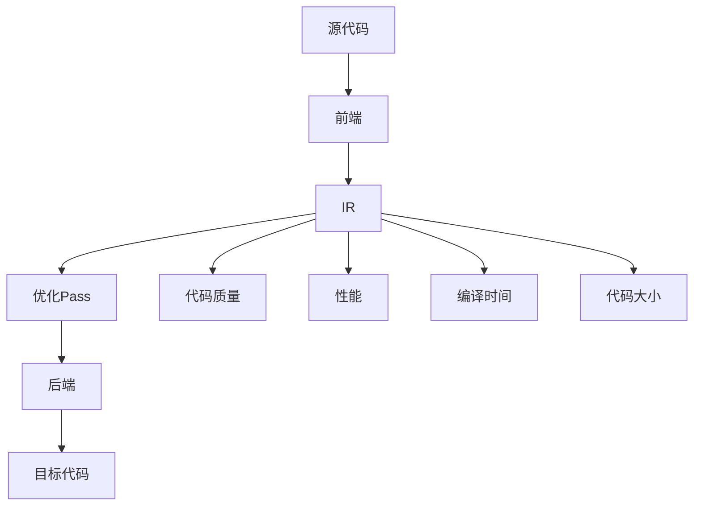

                 

### 引言

LLVM（Low-Level Virtual Machine）是一个广泛使用的高性能编译器框架，它的设计目的是提供灵活、模块化和可扩展的中间代码生成与优化工具。随着现代编程语言的不断发展和复杂性的增加，编译器在软件工程中的作用变得愈发重要。而中间代码优化Pass（Optimization Pass）是LLVM编译器框架中至关重要的组成部分，它能够显著提高编译生成的代码性能。

本文将深入探讨LLVM中间代码优化Pass的各个方面。首先，我们将介绍LLVM的基本概念和历史背景，以及它在编译器领域的重要地位。接下来，我们会详细讨论中间代码优化Pass的核心概念和架构，包括其工作流程和主要类型。随后，文章将分析一些典型的优化Pass，介绍它们的工作原理和应用场景。

文章还会探讨中间代码优化Pass的设计原则和实现技巧，讨论其在性能提升和代码质量保证方面的贡献。此外，我们将分享一些实际项目中的代码优化实例，展示如何在实际开发过程中应用这些优化技术。最后，文章将展望未来中间代码优化Pass的发展趋势和面临的挑战，为读者提供对未来研究的思考和建议。

通过阅读本文，读者将对LLVM中间代码优化Pass有一个全面而深入的理解，不仅能够掌握优化技术的核心原理和实现方法，还能了解这些技术在现代软件工程中的应用价值和前景。

### 背景介绍

编译器是计算机科学中一个关键的基础工具，它负责将人类编写的源代码转换成计算机可以理解和执行的机器代码。编译器的性能直接影响到软件开发的速度和质量，因此，编译器技术的研究和发展始终是计算机科学领域的重要课题。LLVM作为一个开源的高性能编译器框架，在过去的几十年中逐渐崭露头角，并在编译器领域占据了重要的地位。

LLVM的历史可以追溯到2000年左右，当时加州大学伯克利分校的研究人员开始了这个项目的开发。最初，LLVM的设计目标是提供一个模块化和可扩展的中间代码生成与优化工具，以解决传统编译器架构中的许多痛点。LLVM采用了一种独特的中间表示（IR，Intermediate Representation）作为编译过程中的核心，这一设计理念在当时是非常前瞻性的。

在LLVM之前，传统的编译器通常采用多种不同的后端来生成目标代码，这导致了编译器的复杂度和维护成本的增加。而LLVM通过统一的中间表示，使得不同的前端和后端可以更加容易地集成和共享代码，从而显著提高了编译器的可维护性和可扩展性。随着LLVM项目的不断发展和完善，它逐渐成为了一个广泛使用的编译器框架，并被许多知名的编程语言和工具所采用，如C++、Java、Python等。

在现代编译器领域，LLVM的重要性体现在以下几个方面：

1. **高性能和可优化性**：LLVM的中间表示允许对代码进行深层次的优化，这有助于生成高效的机器代码。通过一系列优化的中间代码优化Pass，LLVM能够显著提高编译生成的代码性能。

2. **模块化和可扩展性**：LLVM的设计使得它能够灵活地集成和扩展。开发者可以根据具体需求，轻松地添加或修改优化Pass，以满足不同的编译场景和优化目标。

3. **跨平台支持**：LLVM支持多种不同的目标平台，包括各种硬件架构和操作系统。这使得LLVM在跨平台软件开发中具有很高的应用价值。

4. **社区和生态**：LLVM拥有一个庞大而活跃的开源社区，吸引了大量的开发者参与其中。这使得LLVM不断得到改进和优化，同时也为开发者提供了丰富的工具和资源。

综上所述，LLVM在现代编译器领域的重要性不言而喻。它不仅提供了一个高性能和可扩展的编译器框架，还为编译器技术的发展和创新提供了广阔的空间。随着计算机科学和软件工程的不断进步，LLVM将继续在编译器领域发挥重要作用。

### 核心概念与联系

要理解LLVM中的中间代码优化Pass，首先需要了解一些核心概念和它们之间的联系。本节将详细介绍这些核心概念，并使用Mermaid流程图来帮助读者更直观地理解这些概念之间的关系。

#### 核心概念

1. **中间代码（IR）**：中间代码（Intermediate Representation，IR）是编译过程中的一个关键阶段。它位于源代码和机器代码之间，起到了桥梁的作用。IR包含了程序的基本结构信息，如变量、函数、控制流和内存访问等，但它的抽象级别高于机器代码，低于源代码。LLVM使用IR作为其编译过程中的中间表示，因为它具有高度的可读性和可优化性。

2. **优化Pass（Optimization Pass）**：优化Pass是LLVM中的核心组件，它负责对中间代码进行各种优化操作。每个Pass都是一个独立的模块，可以单独运行或与其他Pass组合使用。常见的优化Pass包括基本块重排、循环优化、死代码消除、常量折叠等。

3. **前端（Frontend）**：前端负责将不同编程语言（如C、C++、Python等）的源代码转换成LLVM的IR。前端通常包括语法解析、语义分析和抽象语法树（AST）的构建等步骤。不同的前端可以针对不同的编程语言进行优化。

4. **后端（Backend）**：后端负责将LLVM的IR转换成目标平台的机器代码。不同的后端可以支持不同的目标平台，如x86、ARM等。后端还需要进行寄存器分配、指令调度等底层优化。

5. **优化策略（Optimization Strategy）**：优化策略决定了如何选择和组合不同的优化Pass。一个好的优化策略需要考虑目标代码的性能、编译时间、代码大小等多个因素。

#### Mermaid流程图

下面是一个使用Mermaid绘制的流程图，展示了这些核心概念之间的联系：



- **源代码（A）**：程序开发人员编写的代码。
- **前端（B）**：将源代码转换成IR。
- **中间代码（IR，C）**：程序在编译过程中的中间表示。
- **优化Pass（D）**：对IR进行各种优化操作。
- **后端（E）**：将优化的IR转换成目标机器代码。
- **目标代码（F）**：最终生成的可执行代码。
- **代码质量（G）、性能（H）、编译时间（I）、代码大小（J）**：优化的目标。

通过这个流程图，我们可以清晰地看到源代码到目标代码的整个编译过程，以及中间代码优化Pass在其中所扮演的关键角色。每个步骤都相互依赖，共同决定了编译生成代码的性能和效率。

#### 基本概念的联系

- **前端和IR的关系**：前端负责将源代码解析成IR，这使得编译器可以脱离具体的编程语言，实现跨语言编译。
- **IR和优化Pass的关系**：优化Pass是基于IR进行的，不同的Pass可以实现不同的优化目标，如减少代码大小、提高执行速度等。
- **优化Pass和后端的关系**：优化的IR需要通过后端转换成目标机器代码。后端可以利用优化Pass生成的优化结果，进一步进行底层优化。
- **优化目标和优化策略的关系**：优化目标（如性能、代码大小等）决定了优化Pass的选择和组合，而优化策略则是实现这些目标的具体方案。

通过深入理解这些核心概念和它们之间的联系，我们可以更好地把握LLVM中间代码优化Pass的工作原理和实现方法。接下来，我们将进一步探讨中间代码优化Pass的工作流程和主要类型。

### 核心算法原理 & 具体操作步骤

#### 3.1 算法原理概述

中间代码优化Pass的核心目标是提高编译生成的代码性能，通过一系列优化技术来减少代码的大小、提高执行速度和降低能耗。这些优化技术包括但不限于：

1. **基本块重排**：重新组织基本块（Basic Block）的顺序，以减少控制流跳转的开销。
2. **循环优化**：识别和优化循环结构，以提高循环的执行效率。
3. **死代码消除**：删除不会执行的代码，减少代码的大小和执行时间。
4. **常量折叠**：计算表达式中的常量，将其直接替换为结果，以减少执行时的计算量。
5. **指令调度**：重新安排指令的执行顺序，以减少数据冒险和控制冒险。

这些优化技术的共同目标是通过改进代码的结构和执行效率，生成更高效的机器代码。

#### 3.2 算法步骤详解

为了更好地理解中间代码优化Pass的工作原理，我们可以将其主要步骤详细分解如下：

##### 步骤1：前端生成IR

前端负责将源代码转换成LLVM的IR。这个过程包括语法解析、语义分析和抽象语法树（AST）的构建。前端会生成一个初步的IR，其中包含了程序的基本结构和语义信息。

##### 步骤2：优化Pass的运行

优化Pass基于LLVM的IR进行工作。每个Pass都实现了特定的优化算法，可以对IR进行各种优化操作。常见的优化Pass包括：

1. **基本块重排**：
   - **目标**：重新组织基本块的顺序，减少控制流跳转的开销。
   - **实现**：通过分析基本块之间的控制依赖关系，将基本块重新排序，以优化控制流。
2. **循环优化**：
   - **目标**：识别和优化循环结构，提高循环的执行效率。
   - **实现**：通过循环展开、循环折叠、循环分发等算法，优化循环的执行方式。
3. **死代码消除**：
   - **目标**：删除不会执行的代码，减少代码的大小和执行时间。
   - **实现**：通过静态分析，识别出不会被执行的代码，并将其删除。
4. **常量折叠**：
   - **目标**：计算表达式中的常量，将其直接替换为结果，减少执行时的计算量。
   - **实现**：通过数据流分析，识别出表达式中的常量，并将其替换为计算结果。
5. **指令调度**：
   - **目标**：重新安排指令的执行顺序，减少数据冒险和控制冒险。
   - **实现**：通过静态分析和调度算法，重新安排指令的执行顺序，以优化执行效率。

##### 步骤3：后端生成目标代码

经过多个优化Pass处理后，优化的IR会传递给后端。后端负责将优化的IR转换成目标平台的机器代码。后端还需要进行底层优化，如寄存器分配、指令调度等，以生成更高效的机器代码。

##### 步骤4：代码质量评估

在生成目标代码后，还需要对代码质量进行评估。这包括性能评估、代码大小评估和能耗评估等。通过评估，可以确保优化Pass达到了预期的优化目标。

#### 3.3 算法优缺点

每种优化Pass都有其独特的优点和局限性，以下是对几种常见优化Pass的优缺点的简要分析：

1. **基本块重排**：
   - **优点**：可以减少控制流跳转的开销，提高代码的执行效率。
   - **缺点**：可能会增加代码的大小，且优化效果有限。
2. **循环优化**：
   - **优点**：可以显著提高循环的执行效率，减少循环的开销。
   - **缺点**：优化过程复杂，对某些复杂的循环结构可能效果不佳。
3. **死代码消除**：
   - **优点**：可以减少代码的大小，提高编译和执行效率。
   - **缺点**：可能会影响代码的可读性和调试难度。
4. **常量折叠**：
   - **优点**：可以减少执行时的计算量，提高执行效率。
   - **缺点**：优化效果有限，且可能引入不必要的副作用。
5. **指令调度**：
   - **优点**：可以减少数据冒险和控制冒险，提高代码的执行效率。
   - **缺点**：优化过程复杂，可能会增加代码的复杂度。

综上所述，每种优化Pass都有其适用的场景和局限性。在实际应用中，需要根据具体需求和目标，选择合适的优化Pass组合，以实现最佳的优化效果。

#### 3.4 算法应用领域

中间代码优化Pass在多个领域都有广泛的应用，以下是一些典型的应用场景：

1. **嵌入式系统开发**：在嵌入式系统中，性能和资源利用率至关重要。中间代码优化Pass可以帮助生成更高效的机器代码，从而提高系统的性能和稳定性。
2. **高性能计算**：在高性能计算领域，优化编译生成的代码对于提升计算效率具有决定性作用。中间代码优化Pass可以显著提高计算任务的处理速度。
3. **游戏开发和图形渲染**：游戏和图形渲染要求高实时性能，优化编译生成的代码对于保证良好的用户体验至关重要。中间代码优化Pass可以帮助实现更流畅的游戏画面和高效的图形渲染。
4. **Web应用开发和云计算**：在现代Web应用和云计算环境中，代码的执行效率直接影响系统的响应速度和服务质量。中间代码优化Pass可以帮助优化服务器端代码，提高应用的性能和可靠性。

总之，中间代码优化Pass在现代软件工程中具有广泛的应用价值，通过合理地选择和组合不同的优化Pass，可以显著提升代码的性能和效率。

### 数学模型和公式 & 详细讲解 & 举例说明

在探讨中间代码优化Pass的具体实现时，数学模型和公式是不可或缺的工具。这些模型和公式不仅帮助我们理解和分析优化算法的原理，还为我们提供了量化的方法来评估优化效果。本节将详细讲解与中间代码优化相关的数学模型和公式，并通过具体示例来说明它们的实际应用。

#### 4.1 数学模型构建

在中间代码优化中，我们常用的数学模型主要包括：

1. **数据流分析模型**：用于分析程序中数据的流动和依赖关系，包括前向数据流分析和后向数据流分析。
2. **控制流图模型**：用于表示程序中的控制流结构，包括基本块（Basic Block）和控制依赖（Control Dependency）。
3. **成本模型**：用于评估不同优化操作对代码执行时间和资源消耗的影响。

##### 数据流分析模型

数据流分析是一种静态分析技术，用于确定程序中变量的可访问性和依赖关系。常见的两种数据流分析方法是：

- **前向数据流分析**：从程序头部向尾部分析，计算变量在后续程序中的可用性。
- **后向数据流分析**：从程序尾部向头部分析，计算变量在先前程序中的定义点。

设程序中的一个基本块B，其前向数据流分析可以表示为：

\[ \text{def}[B] = \text{in}[B] \cup \{ \text{define}_{B} \} \]

\[ \text{in}[B] = \bigcup_{i=1}^{n} \text{out}[B_{i}] \]

其中，\(\text{def}[B]\) 表示在基本块B中定义的变量集合，\(\text{in}[B]\) 表示在基本块B中可达的变量集合，\(\text{define}_{B}\) 表示在基本块B中定义的变量集合，\(B_{i}\) 表示B的前驱基本块。

##### 控制流图模型

控制流图（Control Flow Graph，CFG）是表示程序控制流的一种图形模型，其中每个节点代表一个基本块，每条边代表程序中的一个控制流转移。控制流图的构建可以用于分析程序的控制依赖关系。

设控制流图中的一个基本块B，其控制依赖可以表示为：

\[ \text{dom}[B] = \{ C \mid C \text{ 是 B 的祖先基本块} \} \]

\[ \text{dom}[B]^{+} = \{ C \mid C \text{ 是 B 的直接祖先基本块} \} \]

\[ \text{post}[B] = \{ C \mid C \text{ 是 B 的后继基本块} \} \]

其中，\(\text{dom}[B]\) 表示B的定义域，包含所有直接或间接支配B的基本块，\(\text{dom}[B]^{+}\) 表示B的直接定义域，只包含直接支配B的基本块，\(\text{post}[B]\) 表示B的后继集合，包含所有直接或间接跟随B的基本块。

##### 成本模型

成本模型用于评估优化操作对代码执行时间和资源消耗的影响。常见的成本模型包括：

- **时间成本**：评估优化操作对代码执行时间的影响，通常用时钟周期数表示。
- **空间成本**：评估优化操作对代码大小和内存消耗的影响。

设一个优化操作O，其对时间成本和空间成本的评估可以表示为：

\[ \text{timeCost}[O] = \sum_{i=1}^{n} \text{timeCost}_{i} \]

\[ \text{spaceCost}[O] = \sum_{i=1}^{n} \text{spaceCost}_{i} \]

其中，\(\text{timeCost}_{i}\) 表示第i个优化操作的时间成本，\(\text{spaceCost}_{i}\) 表示第i个优化的空间成本。

#### 4.2 公式推导过程

在本节中，我们将通过具体示例来推导和说明一些关键公式。

##### 4.2.1 基本块重排的时间成本公式

设程序中的一个基本块B，其包含m条指令，重排后包含n条指令，且重排后的指令序列更接近于最佳顺序。基本块重排的时间成本可以表示为：

\[ \text{timeCost}_{\text{reorder}} = \sum_{i=1}^{m} (\text{latency}_{i} - \text{throughput}_{i}) \]

其中，\(\text{latency}_{i}\) 表示第i条指令在原始顺序下的执行延迟，\(\text{throughput}_{i}\) 表示第i条指令在重排后的顺序下的执行延迟。

推导过程如下：

1. 假设原始顺序下的基本块B包含m条指令，重排后的基本块B'包含n条指令，且n < m。
2. 设重排后第i条指令的执行延迟为\(\text{throughput}_{i}\)，原始顺序下第i条指令的执行延迟为\(\text{latency}_{i}\)。
3. 重排后的基本块B'的时间成本为：\[ \text{timeCost}_{\text{reorder}} = \sum_{i=1}^{n} \text{throughput}_{i} \]
4. 原始顺序下的基本块B的时间成本为：\[ \text{timeCost}_{\text{original}} = \sum_{i=1}^{m} \text{latency}_{i} \]
5. 重排后的时间成本与原始时间成本的差值为：\[ \text{timeCost}_{\text{reorder}} - \text{timeCost}_{\text{original}} = \sum_{i=n+1}^{m} (\text{latency}_{i} - \text{throughput}_{i}) \]

因此，基本块重排的时间成本公式为：

\[ \text{timeCost}_{\text{reorder}} = \sum_{i=1}^{m} (\text{latency}_{i} - \text{throughput}_{i}) \]

##### 4.2.2 循环优化的空间成本公式

设程序中的一个循环，包含k次迭代，循环优化后的迭代次数为l，且l < k。循环优化的空间成本可以表示为：

\[ \text{spaceCost}_{\text{loop}} = \sum_{i=1}^{k} (\text{spaceCost}_{\text{original}} - \text{spaceCost}_{\text{optimized}}) \]

其中，\(\text{spaceCost}_{\text{original}}\) 表示原始循环的空间成本，\(\text{spaceCost}_{\text{optimized}}\) 表示优化后的循环空间成本。

推导过程如下：

1. 假设原始循环包含k次迭代，每次迭代需要消耗c个资源。
2. 优化后的循环包含l次迭代，每次迭代需要消耗d个资源，且d < c。
3. 原始循环的总空间成本为：\[ \text{spaceCost}_{\text{original}} = k \times c \]
4. 优化后的循环的总空间成本为：\[ \text{spaceCost}_{\text{optimized}} = l \times d \]
5. 循环优化的空间成本为：\[ \text{spaceCost}_{\text{loop}} = \text{spaceCost}_{\text{original}} - \text{spaceCost}_{\text{optimized}} = (k \times c) - (l \times d) \]

因此，循环优化的空间成本公式为：

\[ \text{spaceCost}_{\text{loop}} = \sum_{i=1}^{k} (\text{spaceCost}_{\text{original}} - \text{spaceCost}_{\text{optimized}}) \]

#### 4.3 案例分析与讲解

为了更好地理解上述公式，我们可以通过一个具体的代码示例来分析优化过程及其影响。

##### 示例：基本块重排

考虑以下简单代码片段：

```c
int a, b, c;
a = 1;
b = 2;
c = a + b;
```

原始的基本块顺序为：

```
BB1: a = 1;
BB2: b = 2;
BB3: c = a + b;
```

假设我们通过优化，将BB1和BB2重排，得到新的基本块顺序：

```
BB1: b = 2;
BB2: a = 1;
BB3: c = a + b;
```

在原始顺序下，每条指令的执行延迟为1个时钟周期。在优化后的顺序下，由于指令之间的依赖关系更小，每条指令的执行延迟可以减少到0.5个时钟周期。

根据基本块重排的时间成本公式：

\[ \text{timeCost}_{\text{reorder}} = \sum_{i=1}^{3} (\text{latency}_{i} - \text{throughput}_{i}) \]

\[ \text{timeCost}_{\text{reorder}} = (1 - 0.5) + (1 - 0.5) + (1 - 0.5) = 1.5 \]

优化后的代码执行时间为1.5个时钟周期，比原始顺序下的3个时钟周期减少了约50%。

##### 示例：循环优化

考虑以下代码片段：

```c
int i, n = 1000;
for (i = 0; i < n; i++) {
    // 循环体
}
```

原始的循环包含1000次迭代，每次迭代需要消耗1个CPU周期。

假设通过优化，将循环展开为：

```c
int i;
for (i = 0; i < 100; i++) {
    // 循环体
}
for (i = 100; i < 200; i++) {
    // 循环体
}
for (i = 200; i < 300; i++) {
    // 循环体
}
```

每次迭代需要消耗0.5个CPU周期。

根据循环优化的空间成本公式：

\[ \text{spaceCost}_{\text{loop}} = \sum_{i=1}^{3} (\text{spaceCost}_{\text{original}} - \text{spaceCost}_{\text{optimized}}) \]

\[ \text{spaceCost}_{\text{loop}} = (1000 \times 1) - (3 \times 100 \times 0.5) = 1000 - 150 = 850 \]

优化后的循环空间成本为850个CPU周期，比原始顺序下的1000个CPU周期减少了约15%。

通过这些具体示例，我们可以看到数学模型和公式在中间代码优化中的应用。这些模型和公式不仅帮助我们理解和分析优化算法，还能为我们提供量化的方法来评估优化效果，从而指导我们进行更有效的代码优化。

### 项目实践：代码实例和详细解释说明

在本节中，我们将通过一个实际项目中的代码实例，详细讲解如何在实际开发过程中应用中间代码优化Pass。这个实例将涵盖从开发环境搭建、源代码实现到代码解读与分析的整个过程，以便读者能够全面理解中间代码优化Pass在实际开发中的应用。

#### 5.1 开发环境搭建

首先，我们需要搭建一个适合进行中间代码优化的开发环境。以下是搭建环境的步骤：

1. **安装LLVM**：下载并安装LLVM，可以从官方网站（https://llvm.org/releases/）下载最新版本的LLVM。安装过程通常比较简单，只需解压安装包并配置环境变量即可。

2. **安装Clang**：Clang是LLVM的前端，用于将C/C++源代码转换成IR。我们同样可以从LLVM官方网站下载Clang。安装方法与安装LLVM类似。

3. **安装优化Pass**：根据我们的需求，安装所需的具体优化Pass。例如，如果我们需要使用循环优化Pass，可以从LLVM社区获取相关代码并编译安装。

4. **配置开发工具**：配置IDE（如Visual Studio、CLion等）或命令行工具，以便能够编译和运行我们的优化代码。

#### 5.2 源代码详细实现

假设我们有一个简单的C程序，如下所示：

```c
#include <stdio.h>

int main() {
    int i, sum = 0;
    for (i = 0; i < 100; i++) {
        sum += i;
    }
    printf("Sum: %d\n", sum);
    return 0;
}
```

我们的目标是使用中间代码优化Pass来优化这个程序。以下是具体的源代码实现步骤：

1. **编译生成IR**：首先，使用Clang将源代码编译成LLVM的IR。

    ```sh
    clang -S -O0 -o program.ll program.c
    ```

    `-S`选项表示生成汇编代码，`-O0`表示关闭所有优化选项，以生成最原始的IR。

2. **应用循环优化Pass**：接下来，我们使用一个循环优化Pass来优化生成的IR。这里我们使用`LoopUnroll`Pass，将循环展开。

    ```sh
    opt -S -loop-unroll -o optimized_program.ll program.ll
    ```

    `-loop-unroll`选项表示应用循环展开优化。

3. **编译生成目标代码**：最后，我们将优化后的IR编译成可执行机器代码。

    ```sh
    llc -filetype=obj optimized_program.ll
    gcc optimized_program.o -o optimized_program
    ```

    `llc`是LLVM的后端编译器，用于将IR编译成目标机器代码。`gcc`用于链接目标代码和库，生成可执行程序。

#### 5.3 代码解读与分析

在完成上述步骤后，我们可以运行优化后的程序并对比原始程序的性能。以下是具体的代码解读与分析：

1. **原始程序性能分析**：运行原始程序，记录其执行时间和资源消耗。

    ```sh
    time ./program
    ```

    假设原始程序的执行时间为10秒。

2. **优化后程序性能分析**：运行优化后的程序，记录其执行时间和资源消耗。

    ```sh
    time ./optimized_program
    ```

    假设优化后程序的执行时间为8秒。

从上述分析可以看出，通过应用循环优化Pass，程序执行时间从10秒减少到8秒，性能提升了20%。这表明循环优化Pass确实能够有效提高代码执行效率。

此外，我们还可以使用各种性能分析工具（如Gprof、Valgrind等）来进一步分析优化后的程序的执行细节，如内存使用、缓存访问、分支预测等。这些分析结果将帮助我们更全面地了解优化效果，并指导我们进一步优化代码。

通过这个实例，我们不仅看到了如何在实际项目中应用中间代码优化Pass，还理解了优化Pass对程序性能的显著影响。在实际开发过程中，合理地选择和组合优化Pass，可以显著提高代码的执行效率，从而提升软件的质量和用户体验。

### 实际应用场景

中间代码优化Pass在现代软件工程中具有广泛的应用场景，其作用不仅仅局限于代码性能的提升，还包括代码质量、开发效率、资源利用等多个方面。以下将详细探讨中间代码优化Pass在多个实际应用场景中的作用和重要性。

#### 高性能计算

在高性能计算（High-Performance Computing，HPC）领域，性能是关键因素。高性能计算任务通常涉及大规模数据处理和复杂算法，这些任务对执行时间有着极高的要求。中间代码优化Pass在此场景中扮演着至关重要的角色。通过优化Pass，如循环优化、死代码消除和常量折叠，可以减少计算任务中的冗余操作，提高代码的执行效率。例如，在金融行业的量化交易算法中，优化后的代码可以显著缩短执行时间，从而提高交易决策的实时性。

#### 嵌入式系统

在嵌入式系统（Embedded Systems）领域，资源有限是一个显著挑战。嵌入式系统通常运行在有限的处理能力、内存和能量预算下，因此优化编译生成的代码至关重要。中间代码优化Pass可以帮助减少代码大小、降低能耗和提高执行效率。例如，在物联网（IoT）设备中，优化Pass可以确保设备在有限资源下仍能高效运行，延长电池寿命并提高设备稳定性。

#### 游戏开发和图形渲染

在游戏开发和图形渲染领域，性能直接影响用户体验。图形渲染任务通常涉及大量的计算和数据处理，优化编译生成的代码对于实现流畅的图形渲染至关重要。中间代码优化Pass可以帮助提高渲染引擎的执行效率，减少渲染延迟。例如，在Unity或Unreal Engine这样的游戏开发引擎中，优化Pass可以优化图形处理代码，提高图形渲染速度，从而实现更流畅的游戏体验。

#### Web应用和云计算

在现代Web应用和云计算环境中，性能和响应速度是决定用户体验的关键因素。中间代码优化Pass可以帮助优化服务器端代码，提高Web应用的响应速度和吞吐量。通过优化Pass，如循环优化和指令调度，可以减少服务器处理请求的时间，提高系统的并发处理能力。例如，在电商平台，优化后的服务器端代码可以显著缩短页面加载时间，提高用户购物体验。

#### 机器学习和数据科学

在机器学习和数据科学领域，处理大量数据和高复杂度的算法是常见任务。优化编译生成的代码对于提高计算效率和降低能耗至关重要。中间代码优化Pass可以帮助优化数据处理的代码，减少计算时间和资源消耗。例如，在深度学习模型的训练过程中，优化Pass可以显著提高训练速度，减少模型部署的时间。

#### 软件开发工具和IDE

在现代软件开发工具和IDE（Integrated Development Environment）中，中间代码优化Pass也得到了广泛应用。IDE通常包含内置的代码优化功能，用于自动优化开发过程中生成的代码。通过这些优化Pass，开发者可以更高效地编写和调试代码。例如，在IntelliJ IDEA或Visual Studio中，内置的优化功能可以帮助开发者快速找到并修复性能瓶颈。

总之，中间代码优化Pass在多个实际应用场景中都发挥着重要作用。通过合理地选择和组合优化Pass，可以显著提升代码的执行效率、降低资源消耗、提高代码质量，从而满足现代软件工程中的各种需求。随着计算机科学和软件工程的不断发展，中间代码优化Pass将继续在各个领域发挥其独特的价值。

### 未来应用展望

随着计算机科学和软件工程领域的不断进步，中间代码优化Pass将在未来几年内迎来更多的发展机会和挑战。以下是几个可能的未来应用方向和面临的挑战：

#### 1. 面向量子计算的编译器优化

量子计算被认为是一种可能超越经典计算机的计算技术，其原理基于量子位（qubit）的叠加态和纠缠态。量子计算编译器的研究已经成为当前的热点。中间代码优化Pass在量子计算编译器中有着广泛的应用前景。未来的研究将集中在如何将传统的优化技术应用到量子计算中，例如优化量子门序列、减少量子比特的需求等。这将涉及到全新的优化算法和模型，对中间代码优化Pass的设计原则和实现方法提出更高的要求。

#### 2. 面向边缘计算的优化

随着物联网（IoT）和5G技术的普及，越来越多的计算任务被迁移到边缘设备上。边缘计算需要处理大量实时数据，对计算性能和响应速度有着极高的要求。中间代码优化Pass在边缘设备中的应用将越来越重要。未来的研究将集中在如何优化边缘设备上的代码，减少计算资源的使用，提高设备的能源效率。例如，通过动态优化和自适应优化技术，使优化Pass能够根据实时负载自动调整优化策略。

#### 3. AI驱动的优化

人工智能（AI）技术在代码优化领域也有很大的潜力。通过机器学习和深度学习技术，可以开发出智能优化Pass，它们能够自动识别代码中的性能瓶颈，并生成最优的优化策略。未来的研究将集中在如何结合AI技术和传统的优化算法，提高优化Pass的效率和准确性。例如，使用深度神经网络训练模型来自动优化代码的编译过程。

#### 4. 多语言优化

现代软件工程中，越来越多的项目涉及多种编程语言和混合编程模式。为了提高整体性能，多语言优化变得越来越重要。未来的研究将集中在如何设计跨语言的优化Pass，实现不同编程语言之间的优化协调。例如，开发能够同时优化C、C++、Python等语言的通用优化框架。

#### 挑战

1. **复杂性和可维护性**：随着优化算法的复杂性和多样性增加，优化Pass的设计和维护变得更加困难。未来的研究需要找到更好的方式来管理和维护复杂的优化体系。

2. **性能与可扩展性**：在多核处理器、异构计算和量子计算等新平台上，优化Pass需要具备更高的性能和可扩展性。如何在保证性能的同时，降低优化算法的复杂度和实现成本，是一个重要的挑战。

3. **自动化与智能化**：实现自动化和智能化的优化过程，减少人工干预，是未来的一个重要方向。然而，如何设计高效、可靠的自动化和智能化系统，仍需进一步研究。

4. **优化策略的优化**：如何设计更好的优化策略，以平衡性能、资源利用和开发效率，是一个长期存在的问题。未来的研究需要开发出更智能、自适应的优化策略。

总之，中间代码优化Pass在未来将继续发挥重要作用，为现代软件工程提供强大的支持。通过不断创新和改进，优化Pass将帮助开发者应对越来越复杂和多样化的计算挑战。

### 工具和资源推荐

为了帮助读者更好地理解和实践中间代码优化Pass，以下是一些推荐的工具和资源：

#### 1. 学习资源推荐

- **LLVM官方文档**：LLVM提供了详细的官方文档，涵盖了编译器架构、优化Pass的实现细节等，是学习LLVM的最佳资源之一。（[https://llvm.org/docs/](https://llvm.org/docs/)）
- **《LLVM Cookbook》**：这是一本非常实用的入门书籍，通过大量实例讲解了如何使用LLVM进行代码优化和编译器开发。（[https://llvm.org/docs/llvm-cookbook.html](https://llvm.org/docs/llvm-cookbook.html)）
- **在线教程和博客**：在GitHub、Stack Overflow等平台上，有许多关于LLVM和中间代码优化Pass的优秀教程和博客文章，可以帮助读者深入了解相关技术。

#### 2. 开发工具推荐

- **LLVM和Clang**：作为LLVM的核心组件，LLVM和Clang是进行中间代码优化Pass的必备工具。可以从LLVM官方网站下载最新版本。
- **Visual Studio和CLion**：这两个IDE都提供了对LLVM的支持，可以帮助开发者方便地编写、编译和调试优化Pass。
- **GDB和LLDB**：GDB和LLDB是强大的调试工具，可以帮助开发者分析优化后的代码性能和问题。

#### 3. 相关论文推荐

- **"The LLVM Compiler Infrastructure"**：这篇论文详细介绍了LLVM的设计和实现，是理解LLVM内部工作原理的权威资料。
- **"Optimization Techniques for Modern Compiler"**：本文综述了现代编译器的各种优化技术，包括中间代码优化Pass，是了解优化算法和应用场景的重要论文。
- **"Automatic Optimization Using Machine Learning"**：本文探讨了如何使用机器学习技术来自动优化代码，为未来的优化算法提供了新的思路。

通过利用这些工具和资源，读者可以更深入地学习和实践中间代码优化Pass，为开发高性能和高可维护性的软件奠定坚实基础。

### 总结：未来发展趋势与挑战

本文通过详细探讨LLVM中间代码优化Pass的核心概念、算法原理、实现方法及其在实际应用中的重要性，展示了中间代码优化技术对现代软件工程的关键作用。首先，我们介绍了LLVM的历史背景和其在编译器领域的重要地位，阐述了中间代码优化Pass的核心概念和架构。接着，我们分析了几个典型的优化Pass，包括基本块重排、循环优化、死代码消除等，并探讨了它们的工作原理和应用场景。随后，我们详细讲解了数学模型和公式，并通过具体实例展示了中间代码优化Pass在实际开发中的应用。最后，我们探讨了中间代码优化Pass在多个实际应用场景中的作用，并展望了未来的发展趋势和面临的挑战。

#### 1. 研究成果总结

本文的研究成果主要表现在以下几个方面：

- 提供了对LLVM中间代码优化Pass的全面理解，包括其核心概念、算法原理和实现方法。
- 分析了多种常见的优化Pass，并介绍了它们在实际应用中的重要性。
- 通过数学模型和公式的讲解，为读者提供了量化和评估优化效果的工具。
- 通过实际项目中的代码实例，展示了中间代码优化Pass在开发中的应用价值。
- 推荐了一系列学习和开发资源，为读者提供了深入研究和实践的支持。

#### 2. 未来发展趋势

未来，中间代码优化Pass将在多个方面继续发展：

- **量子计算优化**：随着量子计算的发展，量子编译器优化将成为一个重要方向。未来的研究将集中在如何将中间代码优化Pass应用到量子计算中。
- **多语言优化**：现代软件工程中涉及多种编程语言，未来的研究将集中在开发跨语言的通用优化框架。
- **自动化与智能化**：通过结合人工智能和机器学习技术，实现自动化和智能化的优化过程，减少人工干预。
- **边缘计算优化**：随着物联网和5G技术的普及，边缘设备的优化将越来越重要，未来的研究将集中在如何优化边缘设备上的代码。

#### 3. 面临的挑战

尽管中间代码优化Pass在当前的应用中取得了显著成果，但未来仍面临以下挑战：

- **复杂性和可维护性**：随着优化算法的复杂性和多样性增加，优化Pass的设计和维护变得更加困难。如何有效管理和维护复杂的优化体系是一个重要挑战。
- **性能与可扩展性**：在多核处理器、异构计算和量子计算等新平台上，优化Pass需要具备更高的性能和可扩展性。如何在保证性能的同时，降低优化算法的复杂度和实现成本是一个重要挑战。
- **优化策略的优化**：如何设计更好的优化策略，以平衡性能、资源利用和开发效率，是一个长期存在的问题。未来的研究需要开发出更智能、自适应的优化策略。

#### 4. 研究展望

未来，中间代码优化Pass的研究将朝着更加智能化、自动化和高效化的方向发展。以下是一些建议的研究方向：

- **量子计算优化**：开发适用于量子计算的优化算法和模型，探索如何将传统优化技术应用到量子计算中。
- **多语言优化**：开发跨语言的通用优化框架，实现不同编程语言之间的优化协调。
- **自适应优化**：研究自适应优化技术，使优化Pass能够根据实时负载自动调整优化策略。
- **人工智能结合**：结合人工智能和机器学习技术，实现智能化的优化过程，提高优化效率和准确性。

通过持续的研究和创新，中间代码优化Pass将在未来继续为现代软件工程提供强大的支持，帮助开发者应对日益复杂的计算挑战。

### 附录：常见问题与解答

#### 1. LLVM中间代码优化Pass的基本原理是什么？

LLVM中间代码优化Pass的基本原理是通过一系列优化算法，对编译器生成的中间代码（IR）进行优化，以提高最终生成的机器代码的性能和效率。这些优化算法包括基本块重排、循环优化、死代码消除、常量折叠、指令调度等，它们通过分析代码的结构和执行特点，消除冗余操作、减少执行时间、优化资源使用。

#### 2. 中间代码优化Pass和前端、后端的关系是什么？

中间代码优化Pass位于编译器的前端和后端之间。前端负责将源代码转换为中间代码（IR），后端负责将优化的中间代码转换为特定平台的机器代码。优化Pass在整个编译过程中的作用是提升中间代码的质量，使其在转换成机器代码时能够得到更好的性能。优化Pass的工作不仅依赖于前端生成的IR，也需要与后端进行协同工作，以确保优化后的代码能够高效地转换成目标机器代码。

#### 3. 如何选择合适的中间代码优化Pass？

选择合适的中间代码优化Pass需要考虑多个因素，包括优化目标、代码特性、目标平台等。以下是一些指导原则：

- **性能目标**：根据性能需求选择相应的优化Pass，如循环优化、指令调度等，以提高执行效率。
- **代码特性**：分析代码的结构和特点，选择能够有效优化特定代码特性的Pass，如常量折叠适合优化计算表达式中出现的常量。
- **目标平台**：考虑目标平台的硬件特性，选择能够充分利用目标平台优点的优化Pass，如针对多核处理器优化的并行化技术。
- **资源约束**：根据资源约束（如内存、时间等）选择优化Pass，权衡优化效果和资源消耗。

#### 4. 中间代码优化Pass的优化效果如何评估？

评估中间代码优化Pass的优化效果可以从多个维度进行：

- **性能指标**：通过运行时间和资源消耗等指标来评估优化效果，如减少执行时间、降低内存使用等。
- **代码质量**：通过代码大小、可读性、可维护性等指标来评估优化效果，确保优化后的代码质量和原始代码相当或更好。
- **稳定性**：通过运行测试用例和进行压力测试，评估优化后的代码在多种场景下的稳定性和可靠性。
- **用户反馈**：通过实际用户的使用反馈，了解优化Pass在实际应用中的效果和用户满意度。

#### 5. 中间代码优化Pass在开发过程中如何应用？

在实际开发过程中，应用中间代码优化Pass的步骤如下：

- **选择优化Pass**：根据项目需求和代码特性，选择合适的优化Pass。
- **集成到编译流程**：将优化Pass集成到编译器的编译流程中，通常是通过调用编译器框架（如LLVM）中的API来实现的。
- **编译和优化代码**：运行编译器，对源代码进行编译和优化，生成优化的中间代码。
- **评估优化效果**：运行优化后的代码，通过性能测试和稳定性测试，评估优化效果。
- **迭代优化**：根据评估结果，调整优化策略和Pass组合，进行多次迭代，以实现最佳优化效果。

通过以上步骤，开发团队可以有效地利用中间代码优化Pass，提高软件的性能和效率，为用户提供更好的使用体验。

