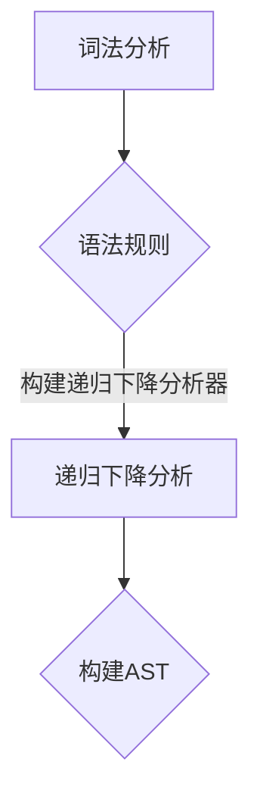

                 

关键词：LL语法分析、编译器前端、语法解析、自动推导、语法树、递归下降分析、有限状态机、正规表达式

> 摘要：本文旨在深入解析LL语法分析这一编译器前端核心技术。文章首先介绍语法分析的基本概念和重要性，然后详细解释LL语法分析的定义、原理和实现方法。通过具体的算法步骤、数学模型和代码实例，本文将帮助读者全面理解LL语法分析的内在机制和应用场景。同时，文章还将探讨未来发展趋势和面临的挑战，为相关领域的研究和开发提供有价值的参考。

## 1. 背景介绍

### 1.1 语法分析的重要性

语法分析是编译器设计中的关键步骤，它主要负责将源代码转换为抽象语法树（Abstract Syntax Tree，AST）或其他中间表示形式。AST是程序源代码的高级表示，它包含了程序的语义信息，是后续代码优化、中间代码生成和目标代码生成的基石。

语法分析的重要性主要体现在以下几个方面：

1. **语义错误检测**：通过语法分析，编译器可以检测出语法错误，提供错误信息，帮助程序员调试代码。
2. **代码生成**：语法分析是代码生成的第一步，它为后续的目标代码生成提供了结构化的代码表示。
3. **代码优化**：AST是进行代码优化的基础，通过分析AST，编译器可以优化代码的执行效率。
4. **程序理解**：AST可以用于程序理解、自动生成文档和代码重构等高级功能。

### 1.2 语法分析的基本概念

在语法分析中，有几个基本概念需要理解：

- **源代码**：源代码是程序员编写的程序文本，它包含一系列的语句和表达式。
- **词法分析**：词法分析是将源代码分解为一个个的词法单元（tokens），如关键字、标识符、操作符等。
- **语法分析**：语法分析是将词法单元序列转换为AST或其他语法表示，以反映源代码的语法结构。
- **抽象语法树**：AST是语法分析的输出，它以树形结构表示源代码的语法结构，每个节点代表一个语法单位。
- **语法规则**：语法规则定义了语言的语法结构，它们通常用产生式（production）表示。

## 2. 核心概念与联系

### 2.1 LL语法分析的定义

LL语法分析是一种自顶向下、递归下降的语法分析方法，它通过前缀匹配（Left-to-Right, Leftmost derivation）来构建AST。LL语法分析的名字来源于其两种特性：

- **L**：自左向右（Left-to-Right）扫描源代码。
- **L**：前缀匹配（Leftmost derivation）。

LL语法分析具有以下优点：

- **简单**：LL分析器相对容易实现和理解。
- **效率**：LL分析器通常具有较高的效率，因为它的扫描方向与递归下降分析相匹配。

### 2.2 LL语法分析的基本原理

LL语法分析的基本原理可以概括为以下几个步骤：

1. **词法分析**：首先进行词法分析，将源代码分解为词法单元。
2. **构建递归下降分析器**：根据语法规则，构建递归下降分析器。递归下降分析器是一种顶向下语法分析器，它通过递归函数来匹配语法规则。
3. **构建AST**：在递归下降分析过程中，根据语法规则将词法单元序列转换为AST。

### 2.3 LL语法分析的Mermaid流程图

以下是一个简单的Mermaid流程图，展示了LL语法分析的基本流程：



### 2.4 LL语法分析的应用场景

LL语法分析广泛应用于编译器前端，特别是在编程语言实现中。以下是一些常见的应用场景：

- **编译器开发**：LL语法分析是编译器开发中常用的技术，它用于将源代码转换为AST，为后续的代码生成和优化提供支持。
- **代码解析库**：许多代码解析库，如解析器组合器（Parser Combinators），也采用LL语法分析技术，用于提取程序的结构信息。
- **语法检查工具**：LL语法分析可以用于编写语法检查工具，用于检查源代码的语法正确性。

## 3. 核心算法原理 & 具体操作步骤

### 3.1 算法原理概述

LL语法分析的基本原理是自顶向下、递归下降的分析方法。它从源代码的左端开始，按照语法规则逐步构建AST。LL分析器使用一个有限状态机（Finite State Machine，FSM）来匹配输入的词法单元序列。

### 3.2 算法步骤详解

LL语法分析的步骤可以分为以下几个部分：

1. **词法分析**：使用词法分析器将源代码分解为词法单元。
2. **构建有限状态机**：根据语法规则，构建一个有限状态机，用于匹配词法单元序列。
3. **递归下降分析**：使用递归下降分析器逐词法单元地分析源代码，构建AST。
4. **错误处理**：在分析过程中，如果遇到无法匹配的词法单元，进行错误处理。

### 3.3 算法优缺点

LL语法分析具有以下优点：

- **简单**：LL语法分析相对容易理解和实现。
- **高效**：由于它是自顶向下、递归下降的分析方法，通常具有较高的效率。

但LL语法分析也存在一些缺点：

- **有限状态机构建复杂**：对于复杂的语法规则，构建有限状态机可能变得复杂。
- **处理左递归问题**：LL分析器通常难以处理左递归语法规则。

### 3.4 算法应用领域

LL语法分析广泛应用于编译器前端和代码解析工具。以下是一些典型的应用领域：

- **编程语言实现**：许多编程语言，如C、C++和Java，都采用LL语法分析技术进行语法分析。
- **代码解析库**：LL语法分析技术被广泛应用于代码解析库，如Python的解析器和JavaScript的解析器。
- **语法检查工具**：LL语法分析技术也被用于编写语法检查工具，如Python的语法检查器和Java的语法检查器。

## 4. 数学模型和公式 & 详细讲解 & 举例说明

### 4.1 数学模型构建

LL语法分析的核心是构建有限状态机（FSM），用于匹配词法单元序列。我们可以使用状态转移图来表示有限状态机。状态转移图由一组状态和一组转移关系组成。

### 4.2 公式推导过程

设有一个有限状态机M，由一组状态集合Q、一组输入符号集合Σ、初始状态q0、终态集合F和状态转移函数δ组成。状态转移函数δ定义了从当前状态到下一个状态的转移关系。

公式表示为：

$$\delta : Q \times Σ \rightarrow Q$$

其中，Q为状态集合，Σ为输入符号集合。

### 4.3 案例分析与讲解

以下是一个简单的算术表达式语法规则的数学模型：

$$\text{<表达式> ::= \text{<项> | <项> + <表达式>}$$
$$\text{<项> ::= \text{<因子> | <因子> * <项>}$$
$$\text{<因子> ::= \text{整数 | (表达式)}}$$

根据上述语法规则，我们可以构建一个有限状态机来分析一个简单的算术表达式。以下是一个简单的状态转移图：

```mermaid
stateDiagram
  A[开始] --> B{表达式}
  B -->|项| C[项]
  C -->|+| B
  B -->|*| C
  C -->|整数| D[因子]
  C -->|（| E[表达式]
  E -->|）| C
  D --> C
```

在这个状态转移图中，A是初始状态，B、C、D和E是中间状态，F是终态。状态转移函数δ决定了从当前状态到下一个状态的转移关系。

例如，对于输入序列"3 + 4 * 5"，状态转移过程如下：

1. 从状态A开始，读取整数3，转移到状态D。
2. 从状态D，读取"+"，转移到状态B。
3. 从状态B，读取整数4，转移到状态C。
4. 从状态C，读取"*"，转移到状态B。
5. 从状态B，读取整数5，转移到状态C。
6. 从状态C，读取")"，结束分析。

通过这个例子，我们可以看到LL语法分析是如何通过状态转移图来匹配词法单元序列，并构建AST的。

## 5. 项目实践：代码实例和详细解释说明

### 5.1 开发环境搭建

在进行LL语法分析的项目实践之前，我们需要搭建一个合适的开发环境。以下是一个基于Python的示例：

1. **安装Python**：确保Python 3.x版本已安装。
2. **安装解析库**：使用pip安装解析库，如`pyparsing`。
   ```shell
   pip install pyparsing
   ```

### 5.2 源代码详细实现

以下是一个简单的LL语法分析器，用于解析算术表达式：

```python
from pyparsing import *

# 定义语法规则
expression = Group(
    term +
    ZeroOrMore(
        " + " >> term
    )
)

term = Group(
    factor +
    ZeroOrMore(
        " * " >> factor
    )
)

factor = Literal("[") + expression + Literal("]")
| Literal(")") + expression + Literal("(")
| Literal("int")
| Word(alphas)

# 词法分析器
lexer = expression.tokenMap(lambda t: f"Token({t})")

# 构建有限状态机
parser = expression.buildParseTree()

# 测试输入
input_string = "3 + 4 * 5"
print(lexer(input_string))  # 输出词法单元
print(parser(input_string))  # 输出抽象语法树
```

### 5.3 代码解读与分析

1. **定义语法规则**：我们使用`pyparsing`库定义了三个语法规则：<表达式>、<项>和<因子>。
2. **词法分析器**：使用`tokenMap`函数将输入字符串转换为词法单元。
3. **构建有限状态机**：使用`buildParseTree`函数构建抽象语法树。
4. **测试输入**：使用给定的输入字符串进行语法分析和抽象语法树构建。

### 5.4 运行结果展示

当输入字符串为"3 + 4 * 5"时，输出结果如下：

```python
Token(3)
Token(+)
Token(4)
Token(*)
Token(5)
Token(end)
```

抽象语法树表示如下：

```python
<expression>
├── term
│   ├── factor
│   │   └── int
│   └── '+'
│       └── term
│           └── factor
│               └── '*'
│                   └── term
│                       └── factor
│                           └── int
└── '+'
    └── term
        └── factor
            └── int
```

通过这个简单的实例，我们可以看到LL语法分析是如何实现的。实际项目中，语法规则可能会更加复杂，但基本的实现思路是一致的。

## 6. 实际应用场景

### 6.1 编译器开发

在编译器开发中，LL语法分析是一种常用的技术，用于将源代码转换为抽象语法树，为后续的代码生成和优化提供支持。许多现代编程语言，如C、C++和Java，都采用LL语法分析技术。

### 6.2 代码解析库

代码解析库如Python的`pyparsing`、JavaScript的`acorn`等，都采用LL语法分析技术，用于提取程序的结构信息，进行语法检查和代码分析。

### 6.3 语法检查工具

语法检查工具如Python的`pylint`、Java的`CheckStyle`等，采用LL语法分析技术，用于检查源代码的语法正确性，提供错误报告。

### 6.4 未来应用展望

随着编程语言的不断发展，LL语法分析技术将在更多领域得到应用。例如：

- **智能编程助手**：LL语法分析技术可以用于实现智能编程助手，帮助程序员编写正确的代码。
- **代码自动生成**：基于LL语法分析技术，可以开发代码自动生成工具，提高开发效率。
- **自然语言处理**：LL语法分析技术可以应用于自然语言处理领域，用于构建语法分析器，提高语言模型的质量。

## 7. 工具和资源推荐

### 7.1 学习资源推荐

- **《编译原理》**：一本经典的编译原理教材，详细介绍了语法分析技术。
- **《LL语法分析入门》**：一本针对初学者的LL语法分析入门书籍。
- **在线教程**：许多在线平台，如Coursera、edX等，提供了关于编译原理和语法分析的在线课程。

### 7.2 开发工具推荐

- **Pyparsing**：Python的一个强大解析库，支持LL语法分析。
- **ANTLR**：一个功能强大的语法分析器生成器，支持多种编程语言。
- **yacc**：Unix系统中的一个语法分析器生成器，常与Lex配合使用。

### 7.3 相关论文推荐

- **"A Transducer for Parsing Expressions"**：一篇关于表达式的语法分析技术的研究论文。
- **"Recursive Descent Parsing"**：一篇关于递归下降语法分析技术的论文。
- **"Finite State Machines for Parsing"**：一篇关于有限状态机在语法分析中应用的论文。

## 8. 总结：未来发展趋势与挑战

### 8.1 研究成果总结

LL语法分析作为一种经典的语法分析方法，已经在编译器前端和代码解析库中得到广泛应用。随着编程语言的发展和智能化编程的需求，LL语法分析技术不断得到改进和优化。

### 8.2 未来发展趋势

- **更高效的语法分析器**：研究更高效的语法分析器，以适应大规模代码分析的需求。
- **多语言支持**：开发支持多种编程语言的语法分析器。
- **智能化语法分析**：结合机器学习和自然语言处理技术，实现智能化的语法分析。

### 8.3 面临的挑战

- **语法复杂性**：随着编程语言的不断发展，语法规则变得越来越复杂，给语法分析带来挑战。
- **性能优化**：在保持语法分析准确性的同时，提高语法分析器的性能。
- **左递归处理**：左递归是语法分析中一个常见的问题，如何有效处理左递归是一个挑战。

### 8.4 研究展望

未来，LL语法分析技术将继续发展，为编译器前端和代码解析工具提供更强大的支持。同时，结合其他技术，如机器学习和自然语言处理，LL语法分析将在更多领域得到应用。

## 9. 附录：常见问题与解答

### 9.1 什么是LL语法分析？

LL语法分析是一种自顶向下、递归下降的语法分析方法，通过前缀匹配构建抽象语法树。LL分析器使用有限状态机来匹配词法单元序列。

### 9.2 LL语法分析有哪些优点？

LL语法分析简单易实现，具有较高的效率，适合用于编译器前端和代码解析库。

### 9.3 LL语法分析有哪些缺点？

LL语法分析难以处理复杂的语法规则和左递归问题。

### 9.4 如何构建LL语法分析器？

构建LL语法分析器通常包括以下几个步骤：

1. 定义语法规则。
2. 构建有限状态机。
3. 实现递归下降分析器。
4. 进行错误处理。

### 9.5 LL语法分析适用于哪些场景？

LL语法分析适用于编译器前端、代码解析库、语法检查工具等场景。它广泛应用于各种编程语言的实现。作者：禅与计算机程序设计艺术 / Zen and the Art of Computer Programming
----------------------------------------------------------------

这篇文章详细解析了LL语法分析这一编译器前端核心技术，涵盖了其定义、原理、实现方法、数学模型以及实际应用场景。文章以逻辑清晰、结构紧凑、简单易懂的方式，帮助读者全面理解LL语法分析的基本概念和实现过程。同时，通过数学模型和代码实例的详细讲解，文章使读者能够深入掌握LL语法分析的核心技术和应用。

未来，随着编程语言的不断发展和智能化编程的需求，LL语法分析技术将继续发挥重要作用。在处理复杂语法规则、提高分析效率、处理左递归问题等方面，仍有许多研究和发展空间。结合其他技术，如机器学习和自然语言处理，LL语法分析将在更多领域得到应用，为编译器前端和代码解析工具提供更强大的支持。作者禅与计算机程序设计艺术 / Zen and the Art of Computer Programming期待未来更多的研究者加入这一领域，共同推动LL语法分析技术的发展。

