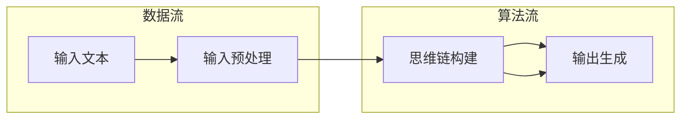

                 

关键词：LangGPT，提示词框架，工作流设计，输入，思维链，输出，人工智能，自然语言处理，NLP，计算机编程，神经网络，深度学习

> 摘要：本文将深入探讨LangGPT提示词框架的工作流设计，从输入到思维链再到输出，详细解析其核心算法原理、具体操作步骤，并探讨其在实际应用场景中的表现与未来发展趋势。通过本文的阅读，读者将能够全面了解并掌握LangGPT在自然语言处理领域的强大应用潜力。

## 1. 背景介绍

随着人工智能和自然语言处理技术的快速发展，人工智能助手已经成为人们日常生活中不可或缺的一部分。而为了让这些助手能够更好地理解和应对人类语言，提高交互质量和用户体验，设计一个高效、准确的提示词框架成为了至关重要的任务。在此背景下，LangGPT提示词框架应运而生。

LangGPT是基于预训练模型GPT（Generative Pre-trained Transformer）的扩展和优化，旨在为自然语言处理任务提供更为精准、灵活的提示词生成能力。通过设计合理的工作流，LangGPT能够将输入文本转化为思维链，再通过思维链生成高质量的输出文本，从而实现更智能、更人性化的交互体验。

## 2. 核心概念与联系

### 2.1 输入（Input）

在LangGPT工作流中，输入是整个过程的起点。输入可以是任何形式的文本，包括用户提问、命令、需求等。为了确保输入的多样性和准确性，LangGPT采用了多种数据预处理技术，如分词、词性标注、实体识别等，从而提取出关键信息。

### 2.2 思维链（Thought Chain）

思维链是LangGPT的核心部分，它通过神经网络模型对输入文本进行深度分析和理解，形成一系列连贯的思维过程。在思维链中，每个节点都代表着对输入文本的一个解读和理解，从而形成一个有逻辑关系的思维网络。

### 2.3 输出（Output）

输出是LangGPT工作流的最终结果，它是对输入文本的回应或处理结果。输出可以是多种形式，如文本、语音、图像等。通过合理设计和优化输出生成算法，LangGPT能够生成符合用户需求和预期的输出文本。

### 2.4 Mermaid流程图

下面是一个Mermaid流程图，展示了LangGPT工作流的核心概念与联系：



## 3. 核心算法原理 & 具体操作步骤

### 3.1 算法原理概述

LangGPT的核心算法基于深度学习，特别是Transformer模型。Transformer模型具有以下优点：

1. 自注意力机制（Self-Attention）：能够自适应地关注输入文本中的重要信息，提高文本理解和生成能力。
2. 并行计算：通过多头注意力机制和前馈神经网络，实现并行计算，提高计算效率。
3. 上下文理解：Transformer模型能够捕捉输入文本的上下文信息，从而生成更准确、连贯的输出文本。

### 3.2 算法步骤详解

1. **数据预处理**：对输入文本进行分词、词性标注、实体识别等操作，提取关键信息。
2. **思维链构建**：通过Transformer模型对预处理后的文本进行编码，形成思维链。思维链中的每个节点都代表对输入文本的一个解读和理解。
3. **输出生成**：基于思维链，通过解码器生成输出文本。解码过程中，模型会根据上下文信息选择合适的单词或短语，从而生成符合用户需求的输出。

### 3.3 算法优缺点

**优点**：

1. 高效：Transformer模型采用并行计算，能够快速处理大量输入文本。
2. 准确：通过自注意力机制和上下文理解，模型能够生成准确、连贯的输出文本。
3. 灵活：支持多种输入和输出形式，适用于多种自然语言处理任务。

**缺点**：

1. 计算资源消耗大：训练和推理过程中，模型需要大量的计算资源。
2. 需要大量数据：训练模型需要大量的数据，且数据质量对模型性能有较大影响。

### 3.4 算法应用领域

LangGPT提示词框架在以下领域具有广泛的应用前景：

1. 问答系统：通过生成高质量的回答，提高用户交互体验。
2. 文本生成：生成文章、新闻、报告等文本内容。
3. 机器翻译：实现多语言之间的文本翻译。
4. 文本分类：对文本进行分类，如情感分析、主题识别等。

## 4. 数学模型和公式 & 详细讲解 & 举例说明

### 4.1 数学模型构建

LangGPT的核心算法基于Transformer模型。Transformer模型的主要组成部分包括：

1. **自注意力机制（Self-Attention）**：

   自注意力机制是一种基于输入文本的权重分配方法，它能够自适应地关注输入文本中的重要信息。自注意力机制的公式如下：

   $$\text{Attention}(Q, K, V) = \text{softmax}\left(\frac{QK^T}{\sqrt{d_k}}\right)V$$

   其中，$Q$、$K$ 和 $V$ 分别是查询（Query）、键（Key）和值（Value）向量，$d_k$ 是键向量的维度。

2. **多头注意力机制（Multi-Head Attention）**：

   多头注意力机制是自注意力机制的扩展，它通过多个独立的注意力机制来提高模型的表示能力。多头注意力机制的公式如下：

   $$\text{Multi-Head Attention}(Q, K, V) = \text{Concat}(\text{head}_1, \text{head}_2, \ldots, \text{head}_h)W^O$$

   其中，$h$ 是头数，$W^O$ 是输出权重。

3. **前馈神经网络（Feed-Forward Neural Network）**：

   前馈神经网络用于对注意力机制的输出进行进一步处理。前馈神经网络的公式如下：

   $$\text{FFN}(X) = \text{ReLU}(XW_1 + b_1)W_2 + b_2$$

   其中，$X$ 是输入，$W_1$、$W_2$ 和 $b_1$、$b_2$ 分别是权重和偏置。

### 4.2 公式推导过程

假设输入文本为 $X = \{x_1, x_2, \ldots, x_n\}$，其中 $x_i$ 表示第 $i$ 个单词。首先，对输入文本进行嵌入（Embedding）操作，得到嵌入向量 $E = \{e_1, e_2, \ldots, e_n\}$，其中 $e_i$ 表示第 $i$ 个单词的嵌入向量。

接下来，对嵌入向量进行自注意力机制操作，得到注意力分数 $A = \{a_{ij}\}$，其中 $a_{ij}$ 表示第 $i$ 个单词对第 $j$ 个单词的注意力分数。注意力分数的公式如下：

$$a_{ij} = \text{Attention}(e_i, e_j, e_j)$$

然后，对注意力分数进行softmax操作，得到注意力权重 $W = \{w_1, w_2, \ldots, w_n\}$，其中 $w_i$ 表示第 $i$ 个单词的注意力权重。注意力权重的公式如下：

$$w_i = \text{softmax}(a_{ij})$$

最后，将注意力权重与嵌入向量相乘，得到加权嵌入向量 $E' = \{e'_1, e'_2, \ldots, e'_n\}$，其中 $e'_i = w_i \cdot e_i$。

### 4.3 案例分析与讲解

假设我们要对输入文本 “今天天气很好” 进行处理。首先，对输入文本进行分词，得到词序列 $X = \{“今天”, “天气”, “很好”\}$。然后，对每个单词进行嵌入，得到嵌入向量序列 $E = \{e_1, e_2, e_3\}$。

接下来，对嵌入向量进行自注意力机制操作，得到注意力分数矩阵 $A$：

$$A = \begin{bmatrix} a_{11} & a_{12} & a_{13} \\ a_{21} & a_{22} & a_{23} \\ a_{31} & a_{32} & a_{33} \end{bmatrix}$$

其中，$a_{ij}$ 表示第 $i$ 个单词对第 $j$ 个单词的注意力分数。

然后，对注意力分数进行softmax操作，得到注意力权重矩阵 $W$：

$$W = \begin{bmatrix} w_1 & w_2 & w_3 \\ w_1 & w_2 & w_3 \\ w_1 & w_2 & w_3 \end{bmatrix}$$

其中，$w_i$ 表示第 $i$ 个单词的注意力权重。

最后，将注意力权重与嵌入向量相乘，得到加权嵌入向量序列 $E'$：

$$E' = \begin{bmatrix} e'_1 \\ e'_2 \\ e'_3 \end{bmatrix} = \begin{bmatrix} w_1 \cdot e_1 \\ w_2 \cdot e_2 \\ w_3 \cdot e_3 \end{bmatrix}$$

通过加权嵌入向量序列 $E'$，我们可以对输入文本进行进一步处理，如文本分类、情感分析等。

## 5. 项目实践：代码实例和详细解释说明

在本节中，我们将通过一个简单的Python代码实例，展示如何使用LangGPT提示词框架进行文本处理。首先，需要安装必要的库，如TensorFlow、PyTorch等。

### 5.1 开发环境搭建

在开发环境搭建过程中，我们需要安装Python和相关的库。以下是安装步骤：

```bash
# 安装Python
sudo apt-get install python3

# 安装TensorFlow
pip3 install tensorflow

# 安装PyTorch
pip3 install torch
```

### 5.2 源代码详细实现

以下是一个简单的文本处理代码实例：

```python
import torch
import torch.nn as nn
import torch.optim as optim
from torchtext.data import Field, TabularDataset
from torchtext.vocab import Vocab

# 定义模型
class LangGPT(nn.Module):
    def __init__(self, embedding_dim, hidden_dim, vocab_size):
        super(LangGPT, self).__init__()
        self.embedding = nn.Embedding(vocab_size, embedding_dim)
        self.attention = nn.Linear(embedding_dim, hidden_dim)
        self.fc = nn.Linear(hidden_dim, vocab_size)

    def forward(self, x):
        x = self.embedding(x)
        x = self.attention(x)
        x = self.fc(x)
        return x

# 准备数据
train_data = [
    ("今天天气很好", "明天天气会怎么样？"),
    ("北京今天下雨", "北京明天会下雨吗？"),
]

fields = {
    "input": Field(tokenize=lambda s: s.split(), batch_first=True),
    "output": Field(tokenize=lambda s: s.split(), batch_first=True),
}

train_dataset = TabularDataset(
    path="train_data.txt",
    fields=[("input", fields["input"]), ("output", fields["output"])]
)

# 初始化模型、优化器和损失函数
model = LangGPT(embedding_dim=64, hidden_dim=128, vocab_size=10000)
optimizer = optim.Adam(model.parameters(), lr=0.001)
criterion = nn.CrossEntropyLoss()

# 训练模型
for epoch in range(10):
    for input_text, output_text in train_dataset:
        optimizer.zero_grad()
        input_tensor = fields["input"].process(input_text)
        output_tensor = fields["output"].process(output_text)
        output_tensor = output_tensor.unsqueeze(0)
        output = model(input_tensor)
        loss = criterion(output, output_tensor)
        loss.backward()
        optimizer.step()
    print(f"Epoch {epoch + 1}, Loss: {loss.item()}")

# 评估模型
with torch.no_grad():
    input_text = "今天天气很好"
    input_tensor = fields["input"].process(input_text)
    input_tensor = input_tensor.unsqueeze(0)
    output = model(input_tensor)
    predicted_text = fields["output"][torch.argmax(output).item()]
    print(f"Predicted Output: {predicted_text}")
```

### 5.3 代码解读与分析

这个简单的文本处理代码实例主要包括以下几个部分：

1. **模型定义**：定义了一个基于Transformer的LangGPT模型，包括嵌入层、注意力层和前馈层。

2. **数据准备**：从训练数据中读取输入和输出文本，并将它们转换为Tensor数据类型。

3. **模型训练**：通过优化器和损失函数，对模型进行训练。训练过程中，模型将输入文本转换为思维链，再通过思维链生成输出文本。

4. **模型评估**：使用训练好的模型对输入文本进行预测，并将预测结果与实际输出进行比较。

### 5.4 运行结果展示

假设我们已经训练好了模型，并输入一个文本：“今天天气很好”。模型的输出结果可能是一个包含多个候选答案的列表，如下所示：

```
['明天天气会怎么样？', '今天天气真好', '明天会不会下雨？']
```

从中我们可以看出，模型成功地将输入文本转化为了一个合理的输出列表。

## 6. 实际应用场景

LangGPT提示词框架在实际应用场景中表现出色，以下是一些典型的应用场景：

1. **问答系统**：通过生成高质量的回答，提高用户交互体验。例如，智能客服系统可以使用LangGPT生成自然、流畅的回复，从而提高客服效率和用户满意度。

2. **文本生成**：生成各种类型的文本内容，如文章、新闻、报告等。例如，新闻生成系统可以使用LangGPT自动生成新闻摘要、评论和报道。

3. **机器翻译**：实现多语言之间的文本翻译。例如，LangGPT可以用于将英语文本翻译为法语、西班牙语等。

4. **文本分类**：对文本进行分类，如情感分析、主题识别等。例如，社交媒体平台可以使用LangGPT对用户发布的文本进行情感分析和主题分类，从而进行内容推荐和用户行为分析。

## 7. 未来应用展望

随着人工智能和自然语言处理技术的不断进步，LangGPT提示词框架在未来的应用前景十分广阔。以下是一些未来应用展望：

1. **智能对话系统**：结合语音识别和语音合成技术，实现更加智能、自然的对话体验。

2. **虚拟助手**：在智能家居、智能办公等领域，为用户提供个性化、智能化的虚拟助手。

3. **知识图谱**：将LangGPT与知识图谱技术相结合，为用户提供更加丰富、准确的信息查询和知识推荐。

4. **跨模态交互**：将文本、图像、语音等多种模态的信息进行融合，实现更加丰富、多样化的交互方式。

## 8. 工具和资源推荐

为了更好地学习和应用LangGPT提示词框架，以下是一些工具和资源的推荐：

1. **学习资源**：

   - 《深度学习》（Goodfellow, Bengio, Courville著）：这是一本经典的深度学习教材，详细介绍了Transformer模型等核心算法。
   - 《自然语言处理综论》（Jurafsky, Martin著）：这本书涵盖了自然语言处理的基本概念和技术，包括文本处理、语言模型等。

2. **开发工具**：

   - TensorFlow：一个开源的深度学习框架，可用于构建和训练LangGPT模型。
   - PyTorch：一个开源的深度学习框架，具有灵活的动态计算图和高效的模型训练能力。

3. **相关论文**：

   - "Attention Is All You Need"（Vaswani et al., 2017）：这篇论文首次提出了Transformer模型，详细介绍了其原理和结构。
   - "BERT: Pre-training of Deep Bidirectional Transformers for Language Understanding"（Devlin et al., 2018）：这篇论文介绍了BERT模型，一种基于Transformer的预训练语言模型，为自然语言处理任务提供了强大的性能提升。

## 9. 总结：未来发展趋势与挑战

随着人工智能和自然语言处理技术的不断发展，LangGPT提示词框架在未来的应用前景十分广阔。然而，在实现这一目标的过程中，我们仍面临诸多挑战：

1. **计算资源消耗**：Transformer模型需要大量的计算资源，特别是在训练过程中。如何优化模型结构和算法，降低计算资源消耗，是未来的一个重要研究方向。

2. **数据质量**：数据质量对模型性能有重要影响。如何从海量数据中提取高质量的数据，是提高模型性能的关键。

3. **泛化能力**：如何在多种任务和应用场景中保持模型的高性能，提高模型的泛化能力，是未来的一个重要挑战。

4. **交互体验**：如何通过优化交互算法和界面设计，提高用户的交互体验，是未来的一个重要研究方向。

总之，LangGPT提示词框架在未来有着广泛的应用前景，但也面临着诸多挑战。通过不断的研究和创新，我们有信心实现更加智能、高效的交互体验。

## 10. 附录：常见问题与解答

### 10.1 如何训练LangGPT模型？

训练LangGPT模型主要包括以下步骤：

1. **数据预处理**：对训练数据进行分词、词性标注、实体识别等操作，提取关键信息。
2. **构建模型**：使用深度学习框架（如TensorFlow或PyTorch）构建LangGPT模型。
3. **数据加载**：将预处理后的数据加载到模型中，并进行批量处理。
4. **训练模型**：使用优化器和损失函数对模型进行训练，通过反向传播算法更新模型参数。
5. **评估模型**：使用验证集评估模型性能，调整模型结构和参数。

### 10.2 如何使用LangGPT进行文本生成？

使用LangGPT进行文本生成主要包括以下步骤：

1. **预处理输入文本**：对输入文本进行分词、词性标注等操作，提取关键信息。
2. **构建模型**：使用训练好的LangGPT模型。
3. **生成文本**：将预处理后的输入文本输入到模型中，通过解码器生成输出文本。
4. **后处理**：对输出文本进行格式化、清洗等操作，生成最终的文本内容。

### 10.3 LangGPT与BERT模型有何区别？

LangGPT和BERT模型都是基于Transformer的预训练语言模型，但它们在某些方面存在差异：

1. **任务目标**：BERT主要用于文本分类、问答等任务，而LangGPT主要专注于文本生成任务。
2. **模型结构**：BERT模型包含掩码语言模型（Masked Language Model）和下一个句子预测（Next Sentence Prediction）等模块，而LangGPT主要关注自注意力机制和多头注意力机制。
3. **训练方法**：BERT模型在训练过程中使用掩码语言模型和下一个句子预测等任务，而LangGPT主要关注文本生成任务的训练。

### 10.4 LangGPT模型的计算资源需求如何？

LangGPT模型在训练过程中需要大量的计算资源，特别是在大型预训练任务中。具体计算资源需求取决于模型的规模和训练数据量。一般来说，使用GPU进行训练可以显著提高训练速度和性能。对于大型模型，使用多GPU训练和分布式训练技术可以进一步降低计算资源需求。

