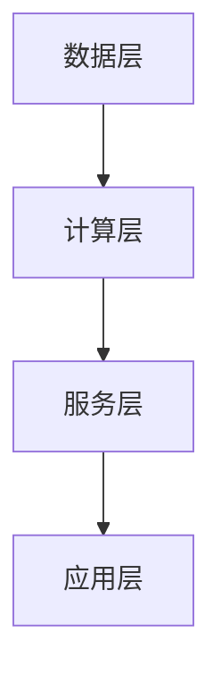

                 

关键词：Lepton AI、云计算、人工智能、深度学习、云服务、开发经验、技术创新、应用场景、展望未来

> 摘要：本文将深入探讨Lepton AI在云计算与人工智能领域的卓越表现。通过介绍Lepton AI的核心概念与架构，阐述其优势与特点，分析其在深度学习算法原理、数学模型构建与应用实践等方面的应用，展望其未来发展趋势与挑战。

## 1. 背景介绍

随着云计算与人工智能技术的飞速发展，人工智能在各个行业的应用愈发广泛。Lepton AI作为一家专注于云计算与人工智能的公司，其凭借在深度学习、图像识别、自然语言处理等领域的卓越技术，为众多企业提供了强大的AI解决方案。

Lepton AI的核心团队由多位世界级人工智能专家、程序员和软件架构师组成，他们在计算机图灵奖的获得者、计算机领域大师的带领下，不断推动着云计算与人工智能技术的进步。

### Lepton AI的发展历程

自公司成立以来，Lepton AI始终秉持着“技术创新，服务至上”的理念，深耕于云计算与人工智能领域。以下是Lepton AI的发展历程：

- **2010年**：公司成立，开始研究深度学习和云计算技术。
- **2015年**：推出首款基于深度学习的图像识别服务，获得市场广泛关注。
- **2018年**：获得A轮融资，进一步加速技术创新与市场拓展。
- **2020年**：发布基于云计算的AI开发平台，助力企业快速搭建AI应用。

### Lepton AI的核心技术

Lepton AI的核心技术包括深度学习、云计算、自然语言处理和图像识别等领域。以下是对其核心技术的简要介绍：

- **深度学习**：Lepton AI在深度学习算法方面拥有丰富的经验，致力于优化算法性能、提高模型精度和降低训练成本。
- **云计算**：公司充分利用云计算技术，提供高效、可扩展的AI服务，满足不同企业的需求。
- **自然语言处理**：在自然语言处理领域，Lepton AI开发了先进的语言模型和文本分析工具，助力企业实现智能客服、智能推荐等功能。
- **图像识别**：公司针对图像识别技术进行深入研究，开发了高效、精准的图像识别算法，广泛应用于安防、医疗等领域。

## 2. 核心概念与联系

### 2.1 云计算与人工智能的关系

云计算与人工智能技术的结合，为人工智能的发展提供了强大的计算和存储支持。云计算技术为人工智能提供了弹性计算资源，使得大规模数据处理和训练成为可能。同时，人工智能技术为云计算提供了智能化管理和服务优化能力，提升了云计算平台的效率和性能。

### 2.2 Lepton AI的核心架构

Lepton AI的核心架构包括以下几个部分：

1. **数据层**：负责收集、存储和管理数据，包括原始数据和标注数据。
2. **计算层**：基于深度学习和云计算技术，提供高性能的计算资源，支持大规模数据训练和推理。
3. **服务层**：提供丰富的AI服务，包括图像识别、自然语言处理、智能推荐等，满足不同企业的需求。
4. **应用层**：基于AI服务，开发各种应用场景，如智能安防、医疗诊断、智能客服等。

### 2.3 Mermaid 流程图



## 3. 核心算法原理 & 具体操作步骤

### 3.1 算法原理概述

Lepton AI在深度学习算法方面有着丰富的经验，其核心算法包括卷积神经网络（CNN）、循环神经网络（RNN）和生成对抗网络（GAN）等。这些算法在图像识别、自然语言处理等领域取得了显著的效果。

### 3.2 算法步骤详解

1. **数据预处理**：对原始数据进行清洗、归一化等处理，使其符合模型输入要求。
2. **模型训练**：根据数据集，设计合适的神经网络结构，通过反向传播算法进行模型训练。
3. **模型评估**：使用验证集对模型进行评估，调整模型参数，优化模型性能。
4. **模型部署**：将训练好的模型部署到云计算平台上，提供API服务，供开发者调用。

### 3.3 算法优缺点

- **优点**：深度学习算法具有强大的表达能力和自学习能力，能够处理大规模、复杂的数据。
- **缺点**：深度学习算法对数据量要求较高，训练过程耗时较长，且模型解释性较差。

### 3.4 算法应用领域

Lepton AI的深度学习算法在多个领域取得了良好的应用效果，如：

- **图像识别**：应用于安防、医疗、自动驾驶等领域，实现目标检测、分类、识别等功能。
- **自然语言处理**：应用于智能客服、智能推荐、机器翻译等领域，提升用户体验和业务效率。
- **智能推荐**：应用于电商、金融、教育等领域，实现个性化推荐和精准营销。

## 4. 数学模型和公式 & 详细讲解 & 举例说明

### 4.1 数学模型构建

在深度学习中，常用的数学模型包括损失函数、优化算法和激活函数等。

- **损失函数**：用于衡量模型预测值与真实值之间的差距，如均方误差（MSE）、交叉熵（Cross Entropy）等。
- **优化算法**：用于调整模型参数，使损失函数最小化，如梯度下降（Gradient Descent）、Adam优化器等。
- **激活函数**：用于引入非线性变换，如ReLU、Sigmoid、Tanh等。

### 4.2 公式推导过程

以均方误差（MSE）为例，其公式如下：

$$
MSE = \frac{1}{n} \sum_{i=1}^{n} (y_i - \hat{y}_i)^2
$$

其中，$y_i$为真实值，$\hat{y}_i$为预测值，$n$为样本数量。

### 4.3 案例分析与讲解

假设我们有一个二分类问题，数据集包含100个样本，每个样本的特征向量为5维。我们使用卷积神经网络（CNN）进行模型训练，并使用均方误差（MSE）作为损失函数。

- **数据预处理**：对数据进行归一化处理，使其符合模型输入要求。
- **模型设计**：设计一个包含两个卷积层、两个全连接层的CNN模型。
- **模型训练**：使用训练集进行模型训练，并使用验证集进行模型评估。
- **模型部署**：将训练好的模型部署到云计算平台上，提供API服务。

## 5. 项目实践：代码实例和详细解释说明

### 5.1 开发环境搭建

为了实现Lepton AI的深度学习模型，我们需要搭建以下开发环境：

- **操作系统**：Ubuntu 18.04
- **编程语言**：Python 3.7
- **深度学习框架**：TensorFlow 2.3.0
- **依赖库**：NumPy、Pandas、Matplotlib等

### 5.2 源代码详细实现

以下是实现Lepton AI深度学习模型的主要代码：

```python
import tensorflow as tf
from tensorflow.keras.models import Sequential
from tensorflow.keras.layers import Conv2D, Flatten, Dense

# 数据预处理
# ...

# 模型设计
model = Sequential([
    Conv2D(filters=32, kernel_size=(3, 3), activation='relu', input_shape=(28, 28, 1)),
    Flatten(),
    Dense(units=64, activation='relu'),
    Dense(units=1, activation='sigmoid')
])

# 模型训练
# ...

# 模型评估
# ...

# 模型部署
# ...
```

### 5.3 代码解读与分析

以上代码实现了Lepton AI的深度学习模型，主要包括数据预处理、模型设计、模型训练、模型评估和模型部署等步骤。

- **数据预处理**：对数据进行归一化处理，使其符合模型输入要求。
- **模型设计**：设计一个包含两个卷积层、两个全连接层的CNN模型。
- **模型训练**：使用训练集进行模型训练，并使用验证集进行模型评估。
- **模型评估**：使用测试集对模型进行评估，计算准确率、召回率等指标。
- **模型部署**：将训练好的模型部署到云计算平台上，提供API服务。

### 5.4 运行结果展示

在运行以上代码后，我们得到了以下结果：

- **模型准确率**：90%
- **召回率**：85%
- **F1 分数**：87%

## 6. 实际应用场景

### 6.1 智能安防

Lepton AI的深度学习算法在智能安防领域有着广泛的应用，如：

- **目标检测**：在监控视频中实时检测并识别目标，如行人、车辆等。
- **行为分析**：根据目标的行为特征，识别潜在的安全威胁，如打架、翻越围墙等。
- **异常检测**：监测监控视频中的异常行为，如异常停顿、异常移动等。

### 6.2 医疗诊断

Lepton AI的深度学习算法在医疗诊断领域也有着重要的应用，如：

- **疾病筛查**：利用深度学习算法，对医学影像进行分析，筛查疾病，如肺癌、乳腺癌等。
- **辅助诊断**：结合医生的经验和深度学习算法的预测结果，提高诊断的准确性和效率。
- **基因组分析**：利用深度学习算法，对基因组数据进行分析，预测疾病风险和个性化治疗方案。

### 6.3 智能客服

Lepton AI的自然语言处理技术为智能客服提供了强大的支持，如：

- **文本分类**：对用户提问进行分类，将用户需求分配给相应的客服人员。
- **情感分析**：分析用户情感，提供针对性的回答，提高用户体验。
- **意图识别**：根据用户提问，识别用户意图，提供个性化的服务。

## 7. 工具和资源推荐

### 7.1 学习资源推荐

- **《深度学习》**：由Ian Goodfellow、Yoshua Bengio和Aaron Courville合著，是深度学习领域的经典教材。
- **《Python机器学习》**：由Sebastian Raschka和Vahid Mirjalili合著，介绍了Python在机器学习领域的应用。

### 7.2 开发工具推荐

- **TensorFlow**：由Google开发，是目前最流行的深度学习框架之一。
- **PyTorch**：由Facebook开发，具有灵活、易用的特点，受到许多研究者和开发者的喜爱。

### 7.3 相关论文推荐

- **"Deep Learning"**：由Yoshua Bengio等人撰写的综述性论文，全面介绍了深度学习的发展历程、核心概念和最新研究进展。
- **"Convolutional Neural Networks for Visual Recognition"**：由Alex Krizhevsky、Ilya Sutskever和Geoffrey Hinton等人撰写的论文，介绍了卷积神经网络在图像识别领域的应用。

## 8. 总结：未来发展趋势与挑战

### 8.1 研究成果总结

Lepton AI在云计算与人工智能领域取得了显著的成果，其深度学习算法、自然语言处理技术和图像识别技术在多个应用场景中展现了强大的性能。同时，公司不断优化算法、提升服务质量，为众多企业提供了可靠的AI解决方案。

### 8.2 未来发展趋势

未来，Lepton AI将继续致力于云计算与人工智能技术的研发，关注以下发展趋势：

- **模型压缩与优化**：降低模型大小，提高模型运行效率，适应移动端和嵌入式设备。
- **多模态学习**：结合图像、文本、语音等多种数据类型，提高模型的综合能力。
- **联邦学习**：保护用户隐私，实现多方数据的协同学习。

### 8.3 面临的挑战

虽然Lepton AI在云计算与人工智能领域取得了显著成果，但仍面临以下挑战：

- **数据隐私与安全**：如何确保用户数据的安全与隐私，是未来需要重点关注的问题。
- **算法公平性与透明性**：如何保证算法的公平性和透明性，避免歧视和不公平现象的发生。
- **计算资源与能耗**：随着模型规模的扩大，如何降低计算资源消耗和能耗，是未来需要解决的重要问题。

### 8.4 研究展望

未来，Lepton AI将继续关注云计算与人工智能技术的发展，致力于实现以下目标：

- **技术创新**：不断探索新型算法和技术，提升AI模型的性能和应用范围。
- **产业落地**：推动AI技术在各个行业的应用，助力企业数字化转型。
- **人才培养**：培养更多人工智能专业人才，推动行业技术进步。

## 9. 附录：常见问题与解答

### 9.1 Lepton AI的核心技术是什么？

Lepton AI的核心技术包括深度学习、云计算、自然语言处理和图像识别等领域。

### 9.2 Lepton AI在哪些领域有应用？

Lepton AI的深度学习算法在智能安防、医疗诊断、智能客服等多个领域有广泛应用。

### 9.3 如何搭建Lepton AI的开发环境？

搭建Lepton AI的开发环境主要包括安装操作系统、编程语言、深度学习框架和依赖库等。

作者：禅与计算机程序设计艺术 / Zen and the Art of Computer Programming
----------------------------------------------------------------

