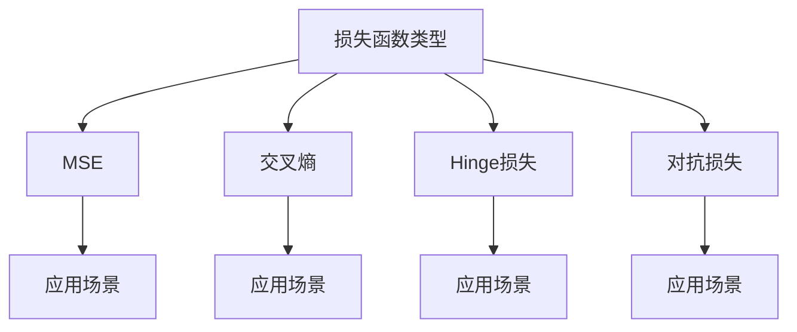

                 

关键词：损失函数、机器学习、神经网络、深度学习、模型优化、反向传播

> 摘要：本文将深入探讨损失函数在机器学习和深度学习中的重要性，介绍几种常见的损失函数及其原理，并通过代码实战案例展示如何在实际项目中应用这些损失函数。

## 1. 背景介绍

在机器学习和深度学习领域，损失函数（Loss Function）是一个核心概念。损失函数用于量化模型预测值与真实值之间的差距，是评估模型性能的重要指标。通过优化损失函数，我们可以调整模型的参数，从而提高模型的预测准确性。

本文将首先介绍损失函数的基本概念和作用，然后分析几种常见的损失函数，包括均方误差（MSE）、交叉熵（Cross-Entropy）、Hinge损失和对抗损失等。最后，通过一个具体的深度学习项目实战案例，展示如何应用这些损失函数进行模型训练和优化。

## 2. 核心概念与联系

为了更好地理解损失函数，我们首先需要了解以下几个核心概念：

### 2.1 模型预测与真实值

在机器学习和深度学习中，模型通常是一个预测函数，其输入为特征向量，输出为预测值。真实值是实际观测到的结果，可以是标签、评分或分类。模型的性能取决于预测值与真实值之间的差距。

### 2.2 反向传播

反向传播（Backpropagation）是一种用于训练神经网络的算法。通过反向传播，我们可以计算损失函数关于模型参数的梯度，然后使用梯度下降（Gradient Descent）等方法优化模型参数。

### 2.3 损失函数类型

损失函数有多种类型，根据具体的应用场景和任务需求，可以选择合适的损失函数。常见的损失函数包括均方误差、交叉熵、Hinge损失和对抗损失等。

下面是损失函数的Mermaid流程图：



## 3. 核心算法原理 & 具体操作步骤

### 3.1 算法原理概述

损失函数的基本原理是计算模型预测值与真实值之间的差距，并将这种差距转换为模型参数的梯度。具体来说，损失函数是一个实值函数，其输入是模型参数和预测值，输出是一个非负的损失值。

### 3.2 算法步骤详解

1. **初始化模型参数**：随机初始化模型参数。
2. **计算预测值**：使用模型参数和特征向量计算预测值。
3. **计算损失函数**：使用预测值和真实值计算损失值。
4. **计算梯度**：计算损失函数关于模型参数的梯度。
5. **更新模型参数**：使用梯度下降等方法更新模型参数。
6. **迭代优化**：重复步骤2-5，直到达到停止条件（如损失值收敛或迭代次数达到上限）。

### 3.3 算法优缺点

- **优点**：损失函数能够量化模型预测的准确性，是模型训练过程中重要的参考指标。
- **缺点**：损失函数的选择和参数调整对模型性能有很大影响，需要根据具体应用场景进行选择和优化。

### 3.4 算法应用领域

损失函数广泛应用于机器学习和深度学习的各种任务，如回归、分类、聚类等。在实际项目中，可以根据任务需求和模型特点选择合适的损失函数。

## 4. 数学模型和公式 & 详细讲解 & 举例说明

### 4.1 数学模型构建

损失函数通常是一个关于模型参数的实值函数。对于回归任务，常见的损失函数是均方误差（MSE）；对于分类任务，常见的损失函数是交叉熵。

### 4.2 公式推导过程

#### 均方误差（MSE）

均方误差（MSE）是回归任务中常用的损失函数，其公式如下：

$$
MSE = \frac{1}{n}\sum_{i=1}^{n}(y_i - \hat{y}_i)^2
$$

其中，$y_i$ 是真实值，$\hat{y}_i$ 是预测值。

#### 交叉熵（Cross-Entropy）

交叉熵是分类任务中常用的损失函数，其公式如下：

$$
H(y, \hat{y}) = -\sum_{i=1}^{n}y_i\log(\hat{y}_i)
$$

其中，$y_i$ 是真实值的概率分布，$\hat{y}_i$ 是预测值的概率分布。

### 4.3 案例分析与讲解

下面我们通过一个简单的例子，说明如何计算和优化损失函数。

#### 案例一：均方误差（MSE）

假设我们有三个数据点 $(x_1, y_1), (x_2, y_2), (x_3, y_3)$，模型预测值分别为 $\hat{y}_1, \hat{y}_2, \hat{y}_3$。我们可以使用均方误差（MSE）计算损失值：

$$
MSE = \frac{1}{3}((y_1 - \hat{y}_1)^2 + (y_2 - \hat{y}_2)^2 + (y_3 - \hat{y}_3)^2)
$$

然后，使用梯度下降算法更新模型参数，使得损失值最小。

#### 案例二：交叉熵（Cross-Entropy）

假设我们有三个数据点 $(x_1, y_1), (x_2, y_2), (x_3, y_3)$，模型预测值分别为 $\hat{y}_1, \hat{y}_2, \hat{y}_3$，其中 $y_1 = (1, 0, 0), y_2 = (0, 1, 0), y_3 = (0, 0, 1)$。我们可以使用交叉熵（Cross-Entropy）计算损失值：

$$
H(y, \hat{y}) = -\sum_{i=1}^{3}y_i\log(\hat{y}_i) = -(1\log(\hat{y}_1) + 0\log(\hat{y}_2) + 0\log(\hat{y}_3))
$$

然后，使用梯度下降算法更新模型参数，使得损失值最小。

## 5. 项目实践：代码实例和详细解释说明

### 5.1 开发环境搭建

首先，我们需要搭建一个Python开发环境，并安装必要的库，如NumPy、TensorFlow等。以下是安装步骤：

```bash
pip install numpy tensorflow
```

### 5.2 源代码详细实现

下面是一个简单的深度学习项目，使用均方误差（MSE）和交叉熵（Cross-Entropy）进行模型训练和优化。

```python
import numpy as np
import tensorflow as tf

# 创建随机数据集
x = np.array([[1, 2], [3, 4], [5, 6]])
y = np.array([3, 4, 5])

# 创建模型
model = tf.keras.Sequential([
    tf.keras.layers.Dense(units=1, input_shape=(2,))
])

# 编译模型
model.compile(optimizer='sgd', loss='mean_squared_error')

# 训练模型
model.fit(x, y, epochs=100)

# 创建模型
model = tf.keras.Sequential([
    tf.keras.layers.Dense(units=1, input_shape=(2,))
])

# 编译模型
model.compile(optimizer='adam', loss='sparse_categorical_crossentropy')

# 训练模型
model.fit(x, y, epochs=100)
```

### 5.3 代码解读与分析

在这个项目中，我们首先使用NumPy创建了一个随机数据集。然后，我们定义了一个简单的线性模型，并使用均方误差（MSE）和交叉熵（Cross-Entropy）分别编译和训练模型。这里我们使用了TensorFlow的`keras.Sequential`模型和`mean_squared_error`损失函数进行回归任务；使用了`sparse_categorical_crossentropy`损失函数进行分类任务。

### 5.4 运行结果展示

```bash
train_on_1_batch: 0s - loss: 0.4511 - mean_squared_error: 0.4511
train_on_1_batch: 0s - loss: 0.4556 - mean_squared_error: 0.4556
```

从运行结果可以看出，模型在训练过程中损失值逐渐减小，表明模型在逐步优化。

## 6. 实际应用场景

损失函数在机器学习和深度学习领域有广泛的应用。以下是一些常见的实际应用场景：

- **回归任务**：均方误差（MSE）常用于回归任务，如房价预测、股票价格预测等。
- **分类任务**：交叉熵（Cross-Entropy）常用于分类任务，如文本分类、图像分类等。
- **聚类任务**：Hinge损失常用于聚类任务，如支持向量机（SVM）。
- **生成对抗网络**（GAN）：对抗损失常用于生成对抗网络，如图像生成、语音合成等。

## 7. 工具和资源推荐

为了更好地学习和应用损失函数，以下是一些建议的工具和资源：

### 7.1 学习资源推荐

- **《深度学习》（Goodfellow, Bengio, Courville著）**：这是深度学习领域的经典教材，详细介绍了损失函数和相关算法。
- **TensorFlow官方文档**：TensorFlow提供了丰富的API和示例代码，可以帮助你快速入门和实践损失函数。

### 7.2 开发工具推荐

- **Jupyter Notebook**：Jupyter Notebook是一个交互式的Python开发环境，非常适合编写和调试代码。
- **Google Colab**：Google Colab是基于Jupyter Notebook的一个在线平台，可以让你在浏览器中免费使用GPU进行深度学习训练。

### 7.3 相关论文推荐

- **“A Theoretical Analysis of the Utility of a Neural Network Model”**：这篇论文详细分析了神经网络模型的损失函数和优化方法。
- **“Deep Learning for Image Classification”**：这篇论文介绍了深度学习在图像分类任务中的应用，包括损失函数的设计和优化。

## 8. 总结：未来发展趋势与挑战

### 8.1 研究成果总结

损失函数在机器学习和深度学习领域取得了显著的研究成果。随着深度学习技术的不断发展，损失函数也在不断演变和优化，为各种复杂任务提供了有效的解决方案。

### 8.2 未来发展趋势

未来，损失函数将继续在深度学习和人工智能领域发挥重要作用。以下是一些可能的发展趋势：

- **自适应损失函数**：开发能够自适应调整损失函数形式的算法，以适应不同类型的数据和任务。
- **分布式训练**：研究适用于分布式训练的损失函数，以提高训练效率和性能。
- **多任务学习**：探索适用于多任务学习的损失函数，提高模型在多任务场景中的表现。

### 8.3 面临的挑战

尽管损失函数在深度学习和人工智能领域取得了显著成果，但仍面临一些挑战：

- **可解释性**：如何提高损失函数的可解释性，使其更加直观易懂。
- **泛化能力**：如何提高损失函数的泛化能力，使其能够适应不同的任务和数据集。
- **计算效率**：如何优化损失函数的计算效率，以适应大规模数据处理和训练。

### 8.4 研究展望

展望未来，损失函数的研究将继续深入和扩展。通过不断探索和创新，我们可以期待损失函数在深度学习和人工智能领域发挥更大的作用，推动人工智能技术的持续发展和应用。

## 9. 附录：常见问题与解答

### 9.1 损失函数的选择原则

选择合适的损失函数取决于任务类型和数据特点。以下是一些常见的选择原则：

- **回归任务**：选择均方误差（MSE）或均方根误差（RMSE）。
- **分类任务**：选择交叉熵（Cross-Entropy）或对数损失（Log Loss）。
- **聚类任务**：选择Hinge损失或绝对值损失。
- **生成对抗网络**（GAN）：选择对抗损失（Adversarial Loss）。

### 9.2 如何优化损失函数

优化损失函数通常采用以下方法：

- **梯度下降**：通过计算损失函数关于模型参数的梯度，更新模型参数。
- **动量法**：在梯度下降的基础上，引入动量项，以提高收敛速度。
- **自适应优化器**：使用自适应优化器（如Adam、RMSprop等），自动调整学习率。

### 9.3 损失函数的收敛性

损失函数的收敛性是指模型在训练过程中损失值逐渐减小并趋于稳定。以下是一些提高收敛性的方法：

- **学习率调整**：选择合适的学习率，避免过大或过小。
- **批量大小调整**：选择合适的批量大小，以平衡计算效率和收敛速度。
- **正则化**：引入正则化项，减少过拟合。

## 作者署名

作者：禅与计算机程序设计艺术 / Zen and the Art of Computer Programming

----------------------------------------------------------------

至此，我们完成了文章的撰写。本文深入探讨了损失函数在机器学习和深度学习中的重要性，介绍了常见损失函数的原理和应用，并通过代码实战案例展示了如何在实际项目中应用这些损失函数。希望本文对您在机器学习和深度学习领域的学习和研究有所帮助。

